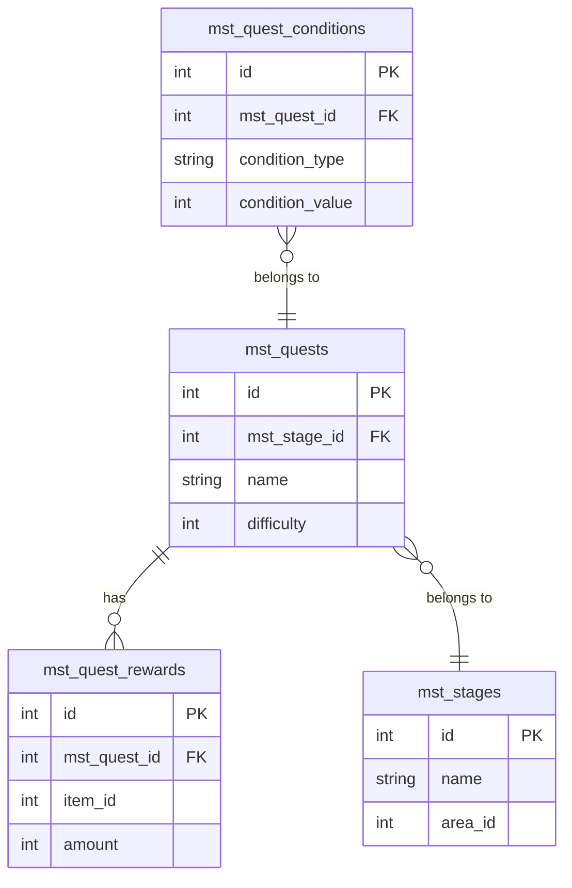

# マスタデータリレーション分析

指定された機能に関連するマスタテーブル間のリレーション関係を分析し、Mermaid図を含むわかりやすいドキュメントを生成します。

## 引数

- `$1`: 分析対象の機能名（例: `quest`, `mission`, `character`, `gacha`, `shop`など）

## タスク

以下のステップで、マスタテーブルのリレーション関係を明らかにし、ドキュメント化してください。

### 1. **masterdata-explorerスキルの起動**

まず、`masterdata-explorer`スキルを使用して、DBスキーマ情報を参照できる状態にしてください。

```bash
# projects/glow-masterdata/schema/schema.json の構造を確認
```

### 2. **関連テーブルのピックアップ**

指定された機能名（`$1`）に関連するマスタテーブルをDBスキーマから抽出してください。

- テーブル名に機能名が含まれるもの（例: `mst_quests`, `mst_quest_rewards`）
- 機能名から推測される関連テーブル（例: quest → stage, mission → achievementなど）
- `jq`コマンドを使ってschema.jsonから効率的に抽出

**出力例:**
```
以下のテーブルが「quest」機能に関連しています：
- mst_quests
- mst_quest_rewards
- mst_stages
- mst_quest_conditions
```

### 3. **リレーションの推測（カラム名ベース）**

各テーブルのカラム名を分析し、他テーブルへの参照関係を推測してください。

**推測ルール:**
- `mst_[table]_id` → `mst_[table]s.id` へのFK
- `[table]_group_id` → `mst_[table]s.group_id` へのFK
- `id`, `group_id` などのプライマリキー/グループキーを特定

**推測例:**
```
mst_quests.mst_stage_id → mst_stages.id
mst_quest_rewards.mst_quest_id → mst_quests.id
mst_quest_conditions.mst_quest_id → mst_quests.id
mst_mission_achievements.mst_mission_reward_group_id → mst_mission_rewards.group_id
```

### 4. **コードベース調査（推測が困難な場合）**

カラム名からの推測が難しいリレーションについては、以下のコードを調査してください：

**調査対象:**
- `projects/glow-server/`: Laravelモデルのリレーション定義
  - `app/Models/MasterData/Mst*.php` のリレーションメソッド
  - `hasMany`, `belongsTo`, `belongsToMany` などの定義
- `projects/glow-client/`: Unityクライアントのマスタデータ参照コード
  - マスタデータロード処理
  - マスタデータ間の参照コード

**検索例:**
```bash
# Laravelモデルのリレーション定義を検索
grep -r "function.*mst_quests" projects/glow-server/app/Models/MasterData/

# クライアント側のマスタデータ参照を検索
grep -r "MstQuest" projects/glow-client/Assets/GLOW/Scripts/
```

### 5. **Mermaid ERD図の作成**

明らかになったリレーション関係を、Mermaid記法のER図として表現してください。

**テンプレート:**


**リレーション記法:**
- `||--o{`: 1対多
- `}o--||`: 多対1
- `||--||`: 1対1
- `}o--o{`: 多対多

### 6. **ドキュメントの生成**

以下の構成でMarkdownドキュメントを作成してください。

**ファイル名:** `docs/機能一覧/マスタデータリレーション_{機能名}.md`

**ドキュメント構成:**

```markdown
# {機能名}機能 - マスタデータリレーション

## 概要

{機能名}機能に関連するマスタテーブルとそのリレーション関係をまとめたドキュメントです。

## 関連テーブル一覧

| テーブル名 | 説明 | 主キー | 備考 |
|-----------|------|--------|------|
| mst_quests | クエストマスタ | id | ... |
| mst_stages | ステージマスタ | id | ... |
| ... | ... | ... | ... |

## テーブルリレーション図

```mermaid
erDiagram
    ...（上記で作成した図）
```

## リレーション詳細

### mst_quests → mst_stages

- **関係**: 多対1（Many to One）
- **外部キー**: `mst_quests.mst_stage_id` → `mst_stages.id`
- **説明**: 各クエストは1つのステージに所属します
- **コード参照**:
  - Laravel: `projects/glow-server/app/Models/MasterData/MstQuest.php:45`
  - Unity: `projects/glow-client/Assets/GLOW/Scripts/Master/Quest.cs:123`

### mst_quests ← mst_quest_rewards

- **関係**: 1対多（One to Many）
- **外部キー**: `mst_quest_rewards.mst_quest_id` → `mst_quests.id`
- **説明**: 1つのクエストは複数の報酬を持つことができます
- **コード参照**:
  - Laravel: `projects/glow-server/app/Models/MasterData/MstQuest.php:67`

## 注意事項

- {特記事項があれば記載}
- {循環参照やgroup_id使用など、特殊なリレーションがあれば説明}

## 生成情報

- **生成日時**: {YYYY-MM-DD}
- **分析対象機能**: {機能名}
- **スキーマバージョン**: {current_version from versions.json}
```

## 注意事項

### スキーマ参照時の注意
- `projects/glow-masterdata/schema/schema.json`を使用
- バージョン情報は`config/versions.json`の`current_version`を参照

### リレーション推測の優先順位
1. **カラム名からの明確な推測**（mst_xxx_id形式）
2. **Laravelモデルの定義**（最も信頼性が高い）
3. **Unityクライアントのコード**（実際の使用例）
4. **group_idなどの特殊なパターン**（複数レコードのグルーピング）

### コード参照の書き方
- 必ず`file_path:line_number`形式で記載
- 例: `projects/glow-server/app/Models/MasterData/MstQuest.php:45`

### Mermaid図の品質
- すべてのテーブルにPKを明記
- FKは必ずリレーション線と対応させる
- カーディナリティ（1対多、多対1など）を正確に表現
- 主要なカラムのみ記載（詳細はテーブル定義を参照）

### ドキュメント配置
- 既存の機能ドキュメントと同じディレクトリに配置
- ファイル名は統一した命名規則に従う

## 期待される出力

1. **分析プロセスの説明**（どのテーブルを調査したか）
2. **Mermaid ER図**（視覚的なリレーション表現）
3. **リレーション詳細**（各リレーションの説明とコード参照）
4. **完成したMarkdownドキュメント**（指定ディレクトリに保存）

実行後、以下の情報を提供してください：
- 分析したテーブル数
- 発見したリレーション数
- 生成されたドキュメントのパス
- コードベースから発見した重要な知見
