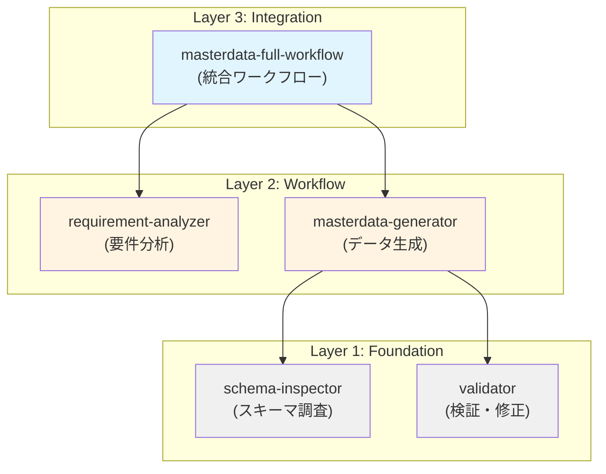
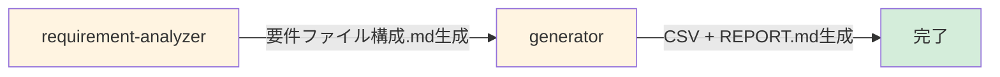
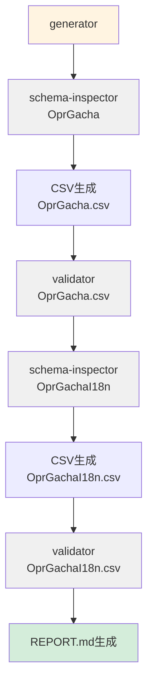
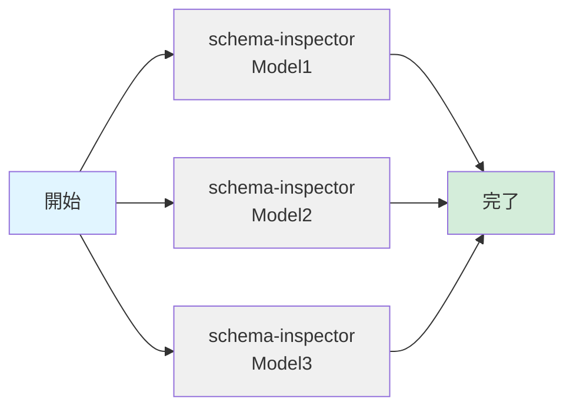
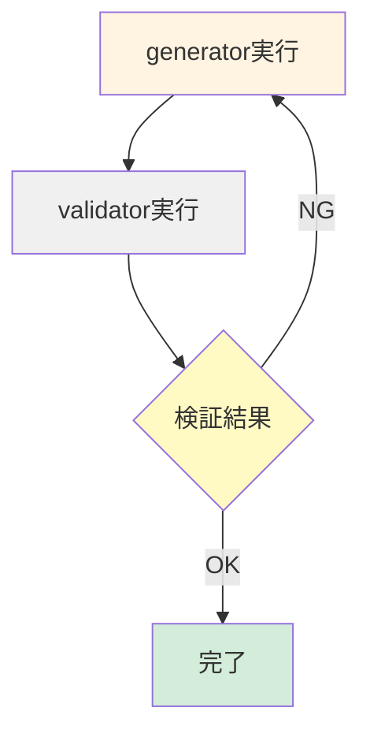
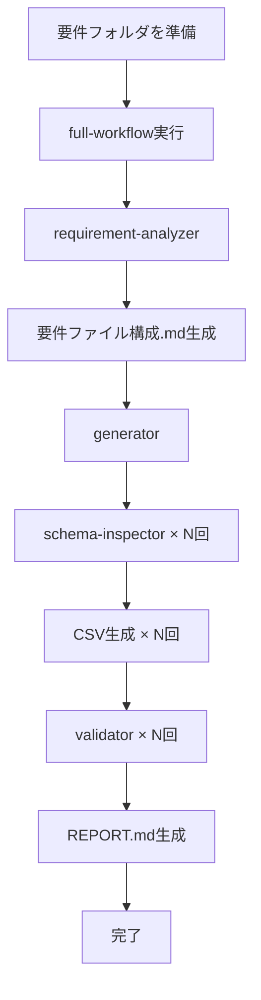
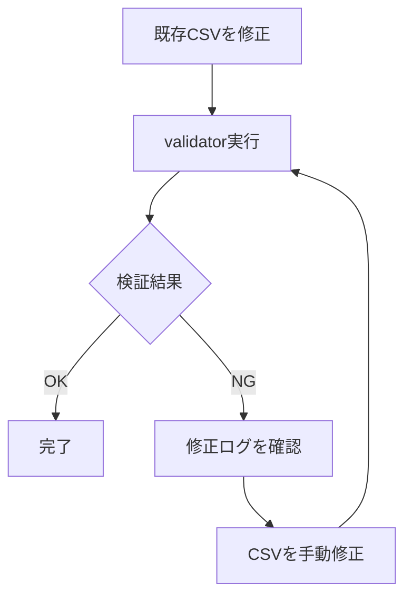
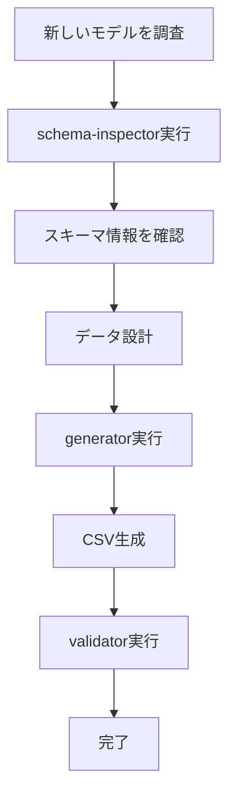
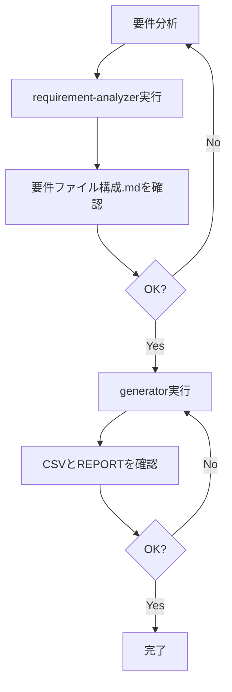
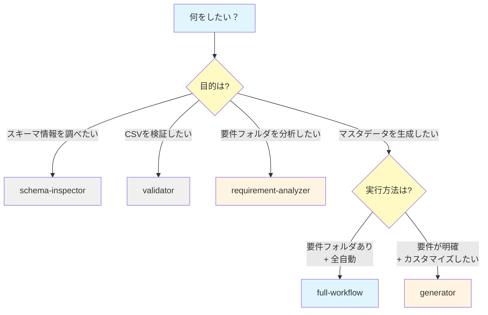

# マスタデータスキル群 - ユースケース＆連携ガイド

このドキュメントは、マスタデータ生成に関連する5つのスキルのユースケースと連携方法をまとめたガイドです。

## 目次

1. [スキル群の概要](#スキル群の概要)
2. [アーキテクチャと設計思想](#アーキテクチャと設計思想)
3. [各スキルの詳細な役割](#各スキルの詳細な役割)
4. [ユースケース別の使い方](#ユースケース別の使い方)
5. [スキル間の連携パターン](#スキル間の連携パターン)
6. [ワークフロー例](#ワークフロー例)
7. [ベストプラクティス](#ベストプラクティス)
8. [トラブルシューティング](#トラブルシューティング)

---

## スキル群の概要

マスタデータ生成ワークフローを**3層のスキル構造**で実現しています。

### 3層アーキテクチャ



### スキル一覧

| 層 | スキル名 | 役割 | 独立実行 |
|---|---------|------|---------|
| **Layer 1** | `masterdata-schema-inspector` | スキーマ情報の調査・提示 | ✅ |
| **Layer 1** | `masterdata-validator` | CSV検証と自動修正 | ✅ |
| **Layer 2** | `masterdata-requirement-analyzer` | 要件フォルダの分析 | ✅ |
| **Layer 2** | `masterdata-generator` | マスタデータ生成 | ✅（Layer 1に依存） |
| **Layer 3** | `masterdata-full-workflow` | フル実行ワークフロー | ✅（Layer 2に依存） |

---

## アーキテクチャと設計思想

### 設計原則

#### 1. **関心の分離 (Separation of Concerns)**

各スキルは明確に定義された単一の責務を持ちます：

- **schema-inspector**: スキーマ情報の「読み取り」のみ
- **validator**: CSV検証の「チェックと修正」のみ
- **requirement-analyzer**: 要件フォルダの「分析」のみ
- **generator**: マスタデータの「生成」に集中
- **full-workflow**: スキル間の「オーケストレーション」のみ

#### 2. **依存性の注入 (Dependency Injection)**

上位層のスキルは、下位層のスキルを`Skill()`で呼び出すことで連携します。これにより：

- 各スキルが疎結合
- テストが容易
- 部分的な置き換えが可能

#### 3. **再利用性 (Reusability)**

Layer 1の基盤スキルは、マスタデータ生成以外のタスクでも利用可能：

```
# 例: 既存マスタデータの検証のみ実施
Skill(skill: "masterdata-validator", args: "既存データ/OprGacha.csv OprGacha")

# 例: 新しいモデルのスキーマを調査
Skill(skill: "masterdata-schema-inspector", args: "NewModel")
```

#### 4. **段階的実行 (Progressive Execution)**

ユーザーは必要に応じて、以下のいずれかを選択できます：

- **フル実行**: `full-workflow`で全自動
- **段階的実行**: 各スキルを個別に実行
- **部分実行**: 特定の層のスキルのみ使用

---

## 各スキルの詳細な役割

### Layer 1: Foundation（基盤スキル）

#### `masterdata-schema-inspector`

**責務**: スキーマ情報の調査と提示

**入力**:
- モデル名（PascalCase形式、例: `OprGacha`, `MstUnit`）

**出力**:
- テーブル名（変換結果）
- カラム定義（型、NULL可否、デフォルト値、ENUM選択肢）
- CSVテンプレートファイルの構造
- 既存マスタデータのパターン

**内部処理**:
1. モデル名→テーブル名変換（スクリプト: `convert_model_to_table.sh`）
2. スキーマJSONからテーブル定義を取得（スクリプト: `extract_schema.sh`）
3. CSVテンプレートファイルの読み取り
4. 既存マスタデータのパターン分析
5. 結果をMarkdown形式で整形

**依存関係**: なし（完全に独立）

**使用シーン**:
- 新しいモデルのスキーマを調べたい
- ENUM型の選択肢を確認したい
- 既存データのパターンを把握したい

---

#### `masterdata-validator`

**責務**: CSV検証と自動修正

**入力**:
- CSVファイルパス
- モデル名

**出力**:
- 修正済みCSVファイル（上書き保存）
- 修正ログ（REPORT.md用）

**内部処理（6段階）**:
1. スキーマJSONファイルの参照
2. カラムの存在確認（不正カラムの検出）
3. データ型の検証（ENUM、INT、DATETIME）
4. 制約の検証（PRIMARY KEY、UNIQUE、NOT NULL）
5. 自動修正の実施
6. 修正ログの出力

**依存関係**: `masterdata-schema-inspector`（内部でモデル名→テーブル名変換を使用）

**使用シーン**:
- CSV生成後の検証
- 既存CSVの整合性チェック
- スキーマ変更後のCSV修正

---

### Layer 2: Workflow（ワークフロースキル）

#### `masterdata-requirement-analyzer`

**責務**: 要件フォルダの分析とドキュメント生成

**入力**:
- 施策ディレクトリパス

**出力**:
- `要件ファイル構成.md`（施策ディレクトリ直下に保存）

**内部処理**:
1. `要件/` フォルダ内のファイル一覧を取得
2. ファイル内容の分析（タイトル、見出し、リンク）
3. カテゴリ分類（番号順、役割別、状態別）
4. ファイル間の関係性を図示
5. Markdownドキュメントとして出力

**依存関係**: なし（完全に独立）

**使用シーン**:
- 施策の要件フォルダを整理したい
- 要件ファイルの構造を把握したい
- チームメンバーに要件を共有したい

---

#### `masterdata-generator`

**責務**: 要件に基づくマスタデータ生成（最も重要）

**入力**:
- 要件の説明（テキスト形式）

**出力**:
- マスタデータCSVファイル群
- `REPORT.md`（データ生成レポート）

**内部処理**:
1. 要件の分析とマスタデータリストアップ
2. 各マスタデータに対して:
   - `schema-inspector`でスキーマ調査
   - テンプレートファイルをコピー
   - CSVデータを生成
   - `validator`でスキーマ検証
3. REPORT.mdを生成（スキーマ検証ログを含む）

**依存関係**:
- `masterdata-schema-inspector`（スキーマ調査）
- `masterdata-validator`（CSV検証）

**タスク完遂の原則**:
- 途中で止めない
- 全てのマスタデータを完成させる
- 「未作成のマスタデータ」セクションを作成しない
- 不明点は既存データから推測して実装継続

**使用シーン**:
- 新しい施策のマスタデータを生成
- 既存データを参考に新規データを作成
- 複数のマスタデータを一括生成

---

### Layer 3: Integration（統合スキル）

#### `masterdata-full-workflow`

**責務**: フル実行ワークフロー

**入力**:
- 施策ディレクトリパス

**出力**:
- `要件ファイル構成.md`
- マスタデータCSVファイル群
- `REPORT.md`

**内部処理**:
1. `requirement-analyzer`を実行
2. `generator`を実行
3. 全成果物の確認

**依存関係**:
- `masterdata-requirement-analyzer`（ステップ1）
- `masterdata-generator`（ステップ2）

**使用シーン**:
- 要件フォルダを準備済みで、全自動で生成したい
- 初めてマスタデータを生成する
- ワンコマンドで完結させたい

---

## ユースケース別の使い方

### ユースケース1: 初めてのマスタデータ生成（推奨）

**シナリオ**: 新しい施策のマスタデータを初めて生成する

**前提条件**:
```
マスタデータ/施策/新春ガチャ/
└── 要件/
    ├── 01_概要.html
    ├── 02_ガチャ仕様.html
    └── 03_報酬設定.html
```

**実行**:
```
Skill(skill: "masterdata-full-workflow", args: "マスタデータ/施策/新春ガチャ")
```

**結果**:
```
マスタデータ/施策/新春ガチャ/
├── 要件/
├── 要件ファイル構成.md       ← 新規生成
├── REPORT.md                ← 新規生成
├── OprGacha.csv             ← 新規生成
├── OprGachaI18n.csv         ← 新規生成
└── MstGachaPrizeGroup.csv   ← 新規生成
```

**メリット**:
- ワンコマンドで完結
- 全ステップが自動実行
- 初心者に最適

---

### ユースケース2: 段階的な生成（カスタマイズ重視）

**シナリオ**: 各ステップを確認しながら進めたい

**ステップ1: 要件分析**
```
Skill(skill: "masterdata-requirement-analyzer", args: "マスタデータ/施策/新春ガチャ")
```

→ `要件ファイル構成.md`を確認

**ステップ2: マスタデータ生成**
```
Skill(skill: "masterdata-generator", args: "新春限定ガチャを追加。期間は2026年1月1日〜1月31日。10連ガチャで1回確定報酬あり。")
```

→ CSVファイルとREPORT.mdを確認

**メリット**:
- 各ステップで内容を確認できる
- 問題があれば途中で調整可能
- 詳細なカスタマイズが可能

---

### ユースケース3: スキーマ調査のみ

**シナリオ**: 新しいモデルのスキーマを調べたい

**実行**:
```
Skill(skill: "masterdata-schema-inspector", args: "OprGacha")
```

**結果**:
```markdown
# OprGacha スキーマ調査結果

## モデル情報
- モデル名: OprGacha
- テーブル名: opr_gachas
- データベース: mst

## カラム定義
| カラム名 | 型 | NULL可 | デフォルト値 | 説明 |
|---------|-----|--------|-------------|------|
| id | varchar(255) | NO | - | ガチャID |
| gacha_type | varchar(255) | NO | None | ガチャタイプ |
...

## ENUM型カラム
### gacha_type
- 型: `enum('Standard','Premium','Special')`
- 選択肢:
  - `Standard`
  - `Premium`
  - `Special`
...
```

**メリット**:
- モデルの仕様を素早く把握
- ENUM選択肢を確認できる
- 既存データのパターンを参照できる

---

### ユースケース4: 既存CSVの検証

**シナリオ**: 既存のCSVファイルが正しいか検証したい

**実行**:
```
Skill(skill: "masterdata-validator", args: "マスタデータ/施策/既存施策/OprGacha.csv OprGacha")
```

**結果**:
```markdown
# OprGacha.csv スキーマ検証結果

## 検証ステータス: ⚠️ 警告あり

### ステップ6-2: カラムの存在確認
- ⚠️ CSVにあってスキーマJSONにないカラム: `old_field`
- ⚠️ スキーマJSONにあってCSVにないカラム: `new_required_field` (NOT NULL制約)

### ステップ6-5: 自動修正の実施
- 削除したカラム: `old_field`
- 追加したカラム: `new_required_field` (デフォルト値: 0)

### ステップ6-6: 修正ログ
修正内容を記録しました。修正済みCSVを保存しました。
```

**メリット**:
- スキーマとの整合性を自動チェック
- 不正なカラムを自動削除
- 不足カラムを自動追加

---

### ユースケース5: 複数モデルのスキーマを一括調査

**シナリオ**: 関連する複数のモデルを一度に調べたい

**実行**:
```
# 並列実行（Taskツール内で複数のSkill呼び出し）
Task(subagent_type: "general-purpose", prompt: """
以下のモデルのスキーマを調査してください:
- OprGacha
- OprGachaI18n
- MstGachaPrizeGroup

各モデルについて、schema-inspectorスキルを実行してください。
""")
```

**メリット**:
- 複数モデルを効率的に調査
- 関連モデルの関係性を把握
- スキーマ全体像を俯瞰できる

---

## スキル間の連携パターン

### パターン1: シーケンシャル実行（順次実行）

**説明**: スキルを順番に実行し、前のスキルの結果を次のスキルで利用する

**例: full-workflow**



**実装**:
```
# full-workflowスキル内部
Step 1: Skill(skill: "masterdata-requirement-analyzer", args: "...")
Step 2: Skill(skill: "masterdata-generator", args: "...")
```

---

### パターン2: ネスト実行（入れ子実行）

**説明**: スキル内部で別のスキルを複数回呼び出す

**例: generator**



**実装**:
```
# generatorスキル内部
For each モデル:
    1. Skill(skill: "masterdata-schema-inspector", args: "<ModelName>")
    2. CSV生成
    3. Skill(skill: "masterdata-validator", args: "<CSVファイルパス> <ModelName>")
```

---

### パターン3: 並列実行（パラレル実行）

**説明**: 複数のスキルを同時に実行（依存関係がない場合のみ）

**例: 複数モデルのスキーマ調査**



**実装**:
```
# 単一のメッセージで複数のSkill呼び出し
<message>
<tool_use>Skill(skill: "masterdata-schema-inspector", args: "Model1")</tool_use>
<tool_use>Skill(skill: "masterdata-schema-inspector", args: "Model2")</tool_use>
<tool_use>Skill(skill: "masterdata-schema-inspector", args: "Model3")</tool_use>
</message>
```

---

### パターン4: 条件付き実行

**説明**: 前のスキルの結果に応じて、次のスキルを実行するか判断

**例: 検証結果に応じた再生成**



**実装**:
```
# カスタムワークフロー
result = Skill(skill: "masterdata-validator", args: "...")
if "エラー" in result:
    Skill(skill: "masterdata-generator", args: "...")  # 再生成
```

---

## ワークフロー例

### ワークフロー1: 新規施策の完全生成



**コマンド1つ**:
```
Skill(skill: "masterdata-full-workflow", args: "マスタデータ/施策/新春ガチャ")
```

---

### ワークフロー2: 既存データの修正と検証



**コマンド**:
```
Skill(skill: "masterdata-validator", args: "既存データ/OprGacha.csv OprGacha")
```

---

### ワークフロー3: スキーマ調査→設計→生成



**コマンド**:
```
# ステップ1: スキーマ調査
Skill(skill: "masterdata-schema-inspector", args: "OprGacha")

# ステップ2: データ生成
Skill(skill: "masterdata-generator", args: "新春ガチャを追加...")
```

---

### ワークフロー4: 段階的な確認を伴う生成



---

## ベストプラクティス

### 1. スキル選択の指針

#### フル実行 vs 段階的実行

**フル実行（full-workflow）を使うべき場合**:
- ✅ 初めてマスタデータを生成する
- ✅ 要件が明確で変更の可能性が低い
- ✅ ワンコマンドで完結させたい

**段階的実行を使うべき場合**:
- ✅ 各ステップで内容を確認したい
- ✅ 要件が曖昧で調整が必要
- ✅ 詳細なカスタマイズが必要

#### 独立スキル vs 統合スキル

**独立スキル（schema-inspector, validator）を使うべき場合**:
- ✅ スキーマ情報だけを調べたい
- ✅ 既存CSVの検証のみ実施したい
- ✅ 他のタスクで再利用したい

**統合スキル（generator, full-workflow）を使うべき場合**:
- ✅ データ生成全体を自動化したい
- ✅ スキル間の連携を気にしたくない

---

### 2. データ品質の確保

#### テンプレートファイルの厳守

**必須ルール**:
```bash
# ❌ 間違い: ゼロからCSVを作成
echo "ENABLE,id,name" > OprGacha.csv

# ✅ 正しい: テンプレートをコピー
cp projects/glow-masterdata/sheet_schema/OprGacha.csv マスタデータ/施策/新春ガチャ/OprGacha.csv
```

**理由**:
- テンプレートには3行のヘッダー（memo, TABLE, ENABLE）が含まれる
- カラム順序が正しく保たれる
- I18n対応のカラムが自動的に含まれる

#### スキーマ検証の徹底

**必須ステップ**:
```
1. CSV生成
   ↓
2. validator実行 ← 必ず実行!
   ↓
3. 検証結果を確認
```

**validatorが検出する問題**:
- 不正なカラム（スキーマJSONに存在しない）
- 不足カラム（NOT NULL制約あり）
- ENUM値の不正
- PRIMARY KEY重複
- データ型の不一致

---

### 3. エラーハンドリング

#### generatorのタスク完遂の原則

**原則**:
- 途中で止めない
- 全てのマスタデータを完成させる
- 不明点は既存データから推測して実装継続

**やってはいけないこと**:
- ❌ 一部のマスタデータだけ作成して終了
- ❌ 「未作成のマスタデータ」セクションをREPORTに追加
- ❌ 不明点があるからといって作業を途中で止める

**正しいアプローチ**:
- ✅ 既存データのパターンを参照
- ✅ 合理的な推測で実装を続ける
- ✅ REPORTに推測した内容を記載

#### validatorの自動修正

**自動修正される問題**:
- 不正なカラムの削除
- 不足カラムの追加（デフォルト値設定）
- データ型の修正（可能な範囲で）

**手動修正が必要な問題**:
- PRIMARY KEY重複（自動修正は危険）
- 業務ロジック違反（スキルでは検出不可）
- 外部キー参照の不整合（スキルでは検出不可）

---

### 4. スキル呼び出しのコツ

#### 引数の渡し方

**schema-inspector**:
```
# ✅ モデル名のみ
Skill(skill: "masterdata-schema-inspector", args: "OprGacha")

# ❌ パスを含めない
Skill(skill: "masterdata-schema-inspector", args: "projects/glow-masterdata/OprGacha")
```

**validator**:
```
# ✅ CSVパス + モデル名
Skill(skill: "masterdata-validator", args: "マスタデータ/施策/新春ガチャ/OprGacha.csv OprGacha")

# ❌ モデル名のみ
Skill(skill: "masterdata-validator", args: "OprGacha")
```

**generator**:
```
# ✅ 具体的な要件
Skill(skill: "masterdata-generator", args: "新春限定ガチャを追加。期間は2026年1月1日〜1月31日。10連ガチャで1回確定報酬あり。")

# ❌ 抽象的すぎる要件
Skill(skill: "masterdata-generator", args: "ガチャを作る")
```

---

## トラブルシューティング

### 問題1: schema-inspectorが「テーブルが見つからない」エラー

**症状**:
```
Error: Table 'opr_gacha' not found in schema
```

**原因**:
- モデル名のスペルミス
- 複数形化のルール違反

**解決方法**:
```bash
# スクリプトで変換結果を確認
bash .claude/skills/masterdata-schema-inspector/scripts/convert_model_to_table.sh OprGacha
# 出力: opr_gachas （複数形になっているか確認）

# スキーマJSONに存在するか確認
jq '.databases.mst.tables | keys' projects/glow-server/api/database/schema/exports/master_tables_schema.json | grep opr_gacha
```

---

### 問題2: validatorが多数のエラーを報告

**症状**:
```
⚠️ CSVにあってスキーマJSONにないカラム: column1, column2, ...
⚠️ スキーマJSONにあってCSVにないカラム: column3, column4, ...
```

**原因**:
- テンプレートファイルを使用せずにCSVを作成した
- スキーマが更新されたが、CSVが古い

**解決方法**:
```bash
# 1. 最新のテンプレートファイルをコピー
cp projects/glow-masterdata/sheet_schema/OprGacha.csv マスタデータ/施策/新春ガチャ/OprGacha.csv

# 2. データ行のみを既存CSVから移行
# （ヘッダーはテンプレートのものを使用）

# 3. validatorで再検証
Skill(skill: "masterdata-validator", args: "マスタデータ/施策/新春ガチャ/OprGacha.csv OprGacha")
```

---

### 問題3: generatorが途中で停止する

**症状**:
```
生成データ一覧:
- OprGacha.csv: 完了
- OprGachaI18n.csv: 完了

未作成のマスタデータ:
- MstGachaPrizeGroup.csv
```

**原因**:
- generatorが「タスク完遂の原則」に従っていない
- 不明点があって作業を中断した

**解決方法**:
```
# generatorを再実行し、以下を明示的に指示
Skill(skill: "masterdata-generator", args: """
新春限定ガチャを追加。

重要: 以下の全てのマスタデータを作成してください:
- OprGacha
- OprGachaI18n
- MstGachaPrizeGroup

不明点がある場合は、既存データから推測して実装を続けてください。
REPORTに「未作成のマスタデータ」セクションを作成しないでください。
""")
```

---

### 問題4: full-workflowがステップ1で止まる

**症状**:
```
ステップ1: 要件ファイル構成.mdを生成 ✅
ステップ2: （実行されない）
```

**原因**:
- requirement-analyzerがエラーを返した
- 要件フォルダが空または存在しない

**解決方法**:
```bash
# 要件フォルダの存在を確認
ls マスタデータ/施策/新春ガチャ/要件/

# ファイルが存在するか確認
find マスタデータ/施策/新春ガチャ/要件/ -type f

# 要件ファイル構成.mdが生成されているか確認
cat マスタデータ/施策/新春ガチャ/要件ファイル構成.md
```

---

### 問題5: スキルが自動検出されない

**症状**:
Claude Codeがスキルを自動的に提案しない

**原因**:
- descriptionにトリガーキーワードが不足
- スキル名が不正

**解決方法**:
```bash
# スキル名を確認
grep "^name:" .claude/skills/masterdata-*/SKILL.md

# descriptionを確認
grep "^description:" .claude/skills/masterdata-*/SKILL.md

# トリガーキーワードが含まれているか確認
# 例: "マスタデータ", "スキーマ", "検証", "要件"
```

---

## まとめ

### スキル選択フローチャート



### 推奨ワークフロー

**初めての方**:
```
full-workflow で全自動生成
```

**慣れている方**:
```
1. schema-inspector でスキーマ調査
2. generator でデータ生成
3. validator で検証
```

**既存データの修正**:
```
validator で検証のみ
```

---

**最終更新**: 2025-12-26
**バージョン**: 1.0.0
