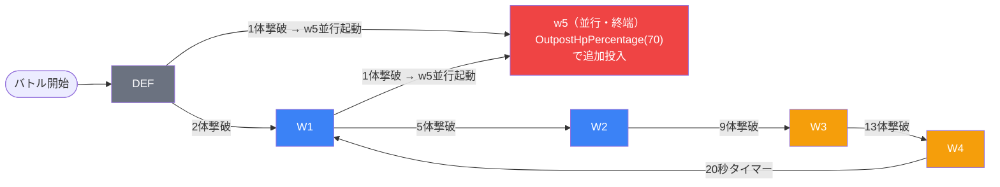

# eventタイプ例示: event_jig1_savage_00001

> 完全な実例ドキュメント:
> `domain/tasks/masterdata-entry/in-game-tables/event_jig1_savage_00001_詳細解説.md`

---

## このコンテンツの特徴

- **コンテンツタイプ**: イベントクエスト・SAVAGE（上級）
- **ゲームモード**: 砦破壊型（`is_damage_invalidation` = 空）
- **砦HP**: 100,000（ダメージ有効・破壊目的）
- **シーケンス行数**: 32行
- **グループ構成**: デフォルト + w1〜w5（6グループ）
- **特徴的なルール**: スピードアタックルールあり

---

## グループ構造の要点



---

## 使用する敵（4種類）

| ID | 日本語名 | kind | color | 特徴 |
|----|---------|------|-------|------|
| `c_jig_00501_jig1_savage_Boss_Yellow` | 山田浅ェ門 桐馬 | Boss | Yellow | ボスオーラあり。デフォルトグループのみ出現 |
| `c_jig_00401_jig1_savage_Normal_Colorless` | 賊王 亜左 弔兵衛 | Normal | Colorless | ノックバック無効。各ウェーブに登場 |
| `e_jig_00001_jig1_savage_Normal_Colorless` | 門神（無属性） | Normal | Colorless | 攻撃型（Attack）雑魚 |
| `e_jig_00001_jig1_savage_Normal_Yellow` | 門神（黄属性） | Normal | Yellow | 防御型（Defense）雑魚 |

---

## eventタイプで特徴的な設定パターン

### 1. w5 並行グループ
各グループの `groupchange_6` に `FriendUnitDead(1)` → w5 が共通設定されている。
最初の1体撃破で w5 が起動し、メインフローと並行して動く。

```
groupchange_6: FriendUnitDead(1) → SwitchSequenceGroup(w5)
```

### 2. タイマーループ（w4 → w1）
w4 の `groupchange_5` が `ElapsedTimeSinceSequenceGroupActivated(2000)` = 20秒後に w1 へ戻る。
撃破数ではなく時間で強制リセットする設計。

### 3. コマ侵入トリガー
`EnterTargetKomaIndex(N)` でプレイヤーが前進するたびに後方から援軍が落下。
- w1: コマ2番目到達 → 無属性雑魚2体
- w3: コマ3番目到達 → 無属性雑魚2体
- w5: コマ5番目到達 → 無属性雑魚3体

### 4. hp倍率のウェーブスケーリング
中ボス（亜左 弔兵衛）の `enemy_hp_coef` がウェーブごとに増加:
```
デフォルト: hp倍70
w1:         hp倍80
w2:         hp倍90
w3:         hp倍100（砦HPと一致）
```

---

## 対応するスキル手順の注意点

- Step 2-4 でデフォルトグループを取得する際、`sequence_group_id IS NULL OR sequence_group_id = ''` でフィルタ
- w5 が「終端グループ」（groupchange行がない）であることをドキュメントに明記する
- `groupchange_6`（w5起動）と `groupchange_1`（w1遷移）は並行評価されることを説明する
- `ElapsedTimeSinceSequenceGroupActivated(2000)` の時間計算: 2000 × 10ms = 20,000ms = 20秒

---

## 完全実例の参照

完全なドキュメント（32行分の詳細データ含む）は以下を参照:
`domain/tasks/masterdata-entry/in-game-tables/event_jig1_savage_00001_詳細解説.md`
