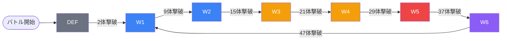

# raidタイプ例示: raid_osh1_00001

> 完全な実例ドキュメント:
> `domain/tasks/masterdata-entry/in-game-tables/raid_osh1_00001_詳細解説.md`

---

## このコンテンツの特徴

- **コンテンツタイプ**: レイドバトル
- **ゲームモード**: スコアアタック型（`is_damage_invalidation` = 1）
- **砦HP**: 1,000,000（ダメージ無効・時間制限でスコアを稼ぐ）
- **シーケンス行数**: 60行（MstAutoPlayerSequenceの最多行数クラス）
- **グループ構成**: デフォルト + w1〜w6（7グループ）
- **特徴的なルール**: w6 → w1 ループ（累計47体でリセット）

---

## グループ構造の要点



---

## 使用する敵（9種類）

| ID | 日本語名 | kind | color | 特徴 |
|----|---------|------|-------|------|
| `c_osh_00201_osh1_advent_Normal_Red` | 星野 ルビー | Normal | Red | Attack/高速(37) |
| `c_osh_00201_osh1_advent_Boss_Red` | 星野 ルビー | Boss | Red | HP×10・やや遅い(31) |
| `c_osh_00301_osh1_advent_Normal_Yellow` | MEMちょ | Normal | Yellow | Technical/射程0.27（最大） |
| `c_osh_00301_osh1_advent_Boss_Yellow` | MEMちょ | Boss | Yellow | AdventBoss1〜2で使用 |
| `c_osh_00401_osh1_advent_Normal_Colorless` | 有馬 かな | Normal | Colorless | 火傷攻撃キャラ |
| `c_osh_00401_osh1_advent_Boss_Colorless` | 有馬 かな | Boss | Colorless | AdventBoss3で使用 |
| `e_glo_00002_osh1_advent_Normal_Green` | 推し活ファントム（緑） | Normal | Green | Attack/最速(47) |
| `e_glo_00002_osh1_advent_Normal_Colorless` | 推し活ファントム（無属性） | Normal | Colorless | Defense/最低速(20)/ノックバックなし/囮役 |
| `e_glo_00002_osh1_advent_Boss_Green` | 推し活ファントム（緑/Boss） | Boss | Green | HP×10 |

---

## raidタイプで特徴的な設定パターン

### 1. InitialSummon による初期配置
デフォルトグループの elem1〜7 が `condition_type = InitialSummon`。
バトル開始時にキャラや雑魚を特定の位置（`summon_position`）に分散配置する。

```
elem1: InitialSummon → MEMちょ(Normal) 位置2.3 → ElapsedTime(250)後に移動
elem2: InitialSummon → 有馬 かな(Normal) 位置2.5 → ElapsedTime(250)後に移動
elem3: InitialSummon → 星野 ルビー(Normal) 位置2.7 → ElapsedTime(250)後に移動
elem4〜7: InitialSummon → 推し活ファントム（無属性/Normal）各位置に1体
```

### 2. AdventBoss オーラ
`aura` カラムでボス演出ランクを指定:
- `AdventBoss1`: w1〜w2 のボス（緑ファントムBoss, MEMちょBoss）
- `AdventBoss2`: w3〜w4 のボス（星野 ルビーBoss, 緑ファントムBoss）
- `AdventBoss3`: w5〜w6 の最高ランクボス（有馬 かなBoss）

### 3. 同一 sequence_element_id の複数行
w1 の elem12 が4行ある（同一タイミングで4つの異なる位置に1体ずつ配置するテクニック）:
```
elem12（1行目）: 位置2.2 → 無属性ファントム1体
elem12（2行目）: 位置2.4 → 無属性ファントム1体
elem12（3行目）: 位置2.6 → 無属性ファントム1体
elem12（4行目）: 位置2.8 → 無属性ファントム1体
```

### 4. Normal種別でも超強敵を作れる
w5 では kind=Normal のキャラに高倍率を設定:
- MEMちょ(Normal): hp倍300 → 実HP 300,000
- 星野 ルビー(Normal): hp倍350 → 実HP 350,000
ボスオーラがなく演出を抑えつつ高難度を実現。

### 5. hp倍率の段階的スケーリング
```
デフォルト: hp×1〜5   / atk×0.5〜1.5
w1:         hp×5〜10  / atk×2.5〜3
w2:         hp×10〜20 / atk×3〜4
w3:         hp×15〜30 / atk×6〜8
w4:         hp×20〜50 / atk×7〜9
w5:         hp×20〜350/ atk×10〜15
w6:         hp×60〜70 / atk×12〜20
```

---

## 対応するスキル手順の注意点

- `InitialSummon` 行には `summon_position`（位置）と `movement_start_condition`（移動開始条件）があることに注意
- 同一 `sequence_element_id` が複数行ある場合、テーブルに明記する（elem12（1行目）〜（4行目）と表記）
- w6 → w1 のループを Mermaid に反映する（ループバック矢印）
- `aura` の `AdventBoss1/2/3` はUIの演出ランクを示すことを説明する
- `defeated_score` と `override_drop_battle_point` の違いをスコア体系セクションで説明する

---

## 完全実例の参照

完全なドキュメント（60行分の詳細データ含む）は以下を参照:
`domain/tasks/masterdata-entry/in-game-tables/raid_osh1_00001_詳細解説.md`
