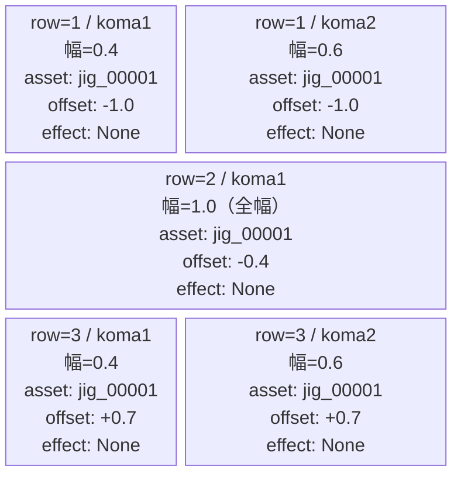

# raidタイプ例示: raid_jig1_00001（v2フォーマット）

> 完全な実例ドキュメント:
> `domain/knowledge/masterdata/in-game/guides/raid_jig1_00001_v2.md`

---

## このコンテンツの特徴

- **コンテンツタイプ**: レイドバトル（スコアアタック型）
- **ゲームモード**: スコアアタック型（`is_damage_invalidation` = 1）
- **砦HP**: 1,000,000（ダメージ無効・制限時間内にバトルポイントを稼ぐ）
- **フィールド**: 3行5コマ構成（全コマeffect=None、アセットjig_00001で統一）
- **グループ構成**: デフォルト + w1〜w5（6グループ）
- **ループ構造**: w5 → w1（累計505体撃破でw1へ戻る。2周目以降は実質w2スタート）
- **初期配置**: デフォルトグループで竈神 魚（Boss）が位置1.7に `InitialSummon`

---

## v2フォーマットで特徴的な設定パターン

### 1. コマ設計を Mermaid block-beta 図で表現

MstPage + MstKomaLine の設定から、フィールドの視覚的構造を block-beta 図で示す。
`columns 10` を基準に、各コマの幅を10分割比率の `:N` で表現する。


```mermaid
block-beta
  columns 10
  A["row=1 / koma1\n幅=0.4\nasset: jig_00001\noffset: -1.0\neffect: None"]:4
  B["row=1 / koma2\n幅=0.6\nasset: jig_00001\noffset: -1.0\neffect: None"]:6
  C["row=2 / koma1\n幅=1.0（全幅）\nasset: jig_00001\noffset: -0.4\neffect: None"]:10
  D["row=3 / koma1\n幅=0.4\nasset: jig_00001\noffset: +0.7\neffect: None"]:4
  E["row=3 / koma2\n幅=0.6\nasset: jig_00001\noffset: +0.7\neffect: None"]:6
```

> **幅比率の求め方**: width=0.4 → `:4`、width=0.6 → `:6`、width=1.0 → `:10`（全行合計が必ず10になるよう調整）

---

### 2. InitialSummon による固定初期配置

raidタイプでは `InitialSummon` を使い、バトル開始時点で高耐久ボスを固定座標に配置することが多い。
これにより「開始直後からボスが既にそこにいる脅威」として演出される。

```
デフォルトグループ elem3: InitialSummon(1) → 竈神 魚（Colorless/Boss） 位置1.7（固定初期配置）
```

グループ別テーブルでは出現タイミング列に **太字** + `**InitialSummon(1)**` と明記し、召喚位置も `**位置1.7（固定初期配置）**` と強調する。

---

### 3. w5の撃破連鎖召喚

w5では `FriendUnitDead(elem_id)` を使い、特定の敵を倒すと次の敵が出現する「連鎖召喚」を設計している。
単純な時間/体数トリガーではなく、ボスの撃破が次フェーズの鍵となる。

```
[グループ起動] → 503（竈神 魚）召喚
     ↓ 503撃破
 501（極楽蝶×20）+ 504（門神(大)/Yellow）同時出現
     ↓ 504撃破
 502（門神×40）+ 505（朱槿）+ 506（門神(大)/Red）同時出現
     ↓ 505撃破
[groupchange → w1ループ]
```

グループ別テーブルでは、この連鎖構造を別途ブロック図で補足する。

---

### 4. グループ別の属性テーマ

各グループに属性テーマがあり、プレイヤーにキャラ選択の戦略性を与える設計。

| グループ | 属性テーマ |
|---------|---------|
| デフォルト | Colorless（無属性） |
| w1・w2 | Yellow（黄） |
| w3 | Green（緑） |
| w4 | Red（赤） |
| w5 | 全属性混合（Colorless + Yellow + Red） |

インゲーム要件テキストでこのテーマを明文化する。

---

### 5. FriendUnitDeadは累計値・リセットなし

raidのループ構造で重要な設計ポイント。FriendUnitDead の値は累計体数で、ループ後もリセットされない。

```
w1→w2: FriendUnitDead(103)  ← 累計103体
w2→w3: FriendUnitDead(202)  ← 累計202体
...
w5→w1: FriendUnitDead(505)  ← 累計505体でw1へループ
```

2周目はw1起動直後に既に累計103体が達成されているため即w2へ遷移。実質w2スタートになる。
フェーズ切り替え表の注記欄に必ずこの仕様を記載する。

---

### 6. オーラランクのグループ別変化

同一敵でもグループによってオーラランクが変化する設計。

| 敵 | グループ | オーラ |
|----|---------|-------|
| 朱槿 | w2 | `AdventBoss2` |
| 朱槿 | w5 | `AdventBoss3`（最高） |

演出セクションのオーラテーブルで「グループによってランクが変化」と明記する。

---

### 7. 召喚アニメーション全Noneの場合は一文で済ませる

全敵の `summon_animation_type` が `None` の場合、テーブルを展開せず以下の一文で記述する。

> 全敵の`summon_animation_type`が`None`（アニメーションなし）。

---

## v2フォーマットのセクション構成（実例）

```
# raid_jig1_00001 インゲームデータ詳細解説
> 参照リポジトリ: `projects/glow-masterdata`
> リリースキー: `202601010`

## インゲーム要件テキスト
（散文5段落・箇条書きなし）

---

## レベルデザイン
### 敵キャラ設計
#### 敵キャラ選定（MstEnemyCharacter）    ← 4種類サマリーテーブル
#### 敵キャラステータス調整（MstEnemyStageParameter → MstInGame基本設定）    ← 10種類素値テーブル

---

### コマ設計    ← block-beta図（3行5コマ）

---

### 敵キャラシーケンス設計
#### どのフェーズで、どの敵を...    ← Mermaidフロー図 + 6グループ別テーブル
#### 敵キャラの固有ステータス調整（hp_coef / atk_coef）    ← 実HP/ATK計算テーブル
#### フェーズ切り替えはあるか    ← 6段階+ループ表

---

## 演出
### アセット
#### コマ背景    ← effect=Noneのため背景調整が必要と記述
#### BGM

---

### 敵キャラオーラ    ← Default/AdventBoss1〜3テーブル
### 敵キャラ召喚アニメーション    ← 全Noneのため一文
```

---

## 完全実例の参照

完全なドキュメント（v2フォーマット）は以下を参照:
`domain/knowledge/masterdata/in-game/guides/raid_jig1_00001_v2.md`
