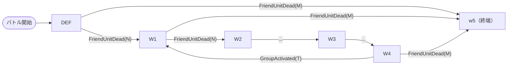
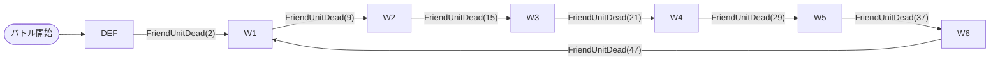

# コンテンツタイプ別ガイド

インゲームIDのプレフィックスで判別できるコンテンツタイプと、それぞれの設定上の差異を説明する。

---

## コンテンツタイプ一覧

| IDプレフィックス | コンテンツタイプ | ゲームモード |
|----------------|----------------|------------|
| `event_*_savage_*` | イベントクエスト（SAVAGE/上級） | 砦破壊型 |
| `event_*_normal_*` | イベントクエスト（NORMAL/通常） | 砦破壊型 |
| `raid_*` | レイドバトル | スコアアタック型 |
| `advent_*` | 降臨バトル | スコアアタック型 |

---

## 砦破壊型（event）の特徴

### MstEnemyOutpost

```
hp: 100,000〜（実際の数値はコンテンツによる）
is_damage_invalidation: （空）← ダメージ有効
```

### MstAutoPlayerSequence の特徴

- **w5並行グループ**: `FriendUnitDead(1)` で各グループから並行起動される独立グループ
- **ループ構造**: w4 → w1 が `ElapsedTimeSinceSequenceGroupActivated` (タイマー) でループ
- **コマ侵入トリガー**: `EnterTargetKomaIndex(N)` で前進するたびに敵を追加投入
- **砦HP条件**: `OutpostHpPercentage(N)` で砦が削られると敵を追加

### Mermaidフロー構造（eventの典型）



> w5 は各グループから並行起動され、終端グループ（groupchange なし）として機能する。

---

## スコアアタック型（raid/advent）の特徴

### MstEnemyOutpost

```
hp: 1,000,000（実質壊せない）
is_damage_invalidation: 1 ← ダメージ無効
```

### MstAutoPlayerSequence の特徴

- **InitialSummon**: デフォルトグループで `condition_type = InitialSummon` による初期配置
  - `summon_position` で各位置に分散配置
  - `movement_start_condition` で移動開始タイミングを制御
- **AdventBossオーラ**: `aura` カラムが `AdventBoss1` / `AdventBoss2` / `AdventBoss3`（演出ランク）
- **w5並行グループなし**: 各グループは直列遷移のみ
- **ループ構造**: wN → w1 が `FriendUnitDead` でループ

### Mermaidフロー構造（raidの典型）



---

## condition_type マッピング

MstAutoPlayerSequence の `condition_type` と `condition_value` の解釈:

| condition_type | condition_value | 発動タイミング |
|----------------|----------------|--------------|
| `InitialSummon` | — | バトル開始時の初期配置 |
| `ElapsedTimeSinceSequenceGroupActivated` | N (100=1秒) | グループ起動からN×10ms後 |
| `FriendUnitDead` | N | 累計N体撃破時 |
| `EnterTargetKomaIndex` | N | プレイヤーがコマN番目に到達時 |
| `OutpostHpPercentage` | N | 砦HPがN%以下になった時 |
| `ElapsedTime` | N (100=1秒) | バトル開始からN×10ms後（デフォルトグループ用） |

> `condition_value` の単位について:
> - `ElapsedTimeSinceSequenceGroupActivated` と `ElapsedTime`: 100 = 1,000ms = 1秒
>   （例: `GroupActivated(300)` = 3,000ms = 3秒後）

---

## グループ構造の共通パターン

### デフォルトグループの判別

`sequence_group_id` が空 or NULL の行が**デフォルトグループ**に属する。

### groupchange行の判別

`sequence_element_id` が `groupchange_N` の行はグループ切り替えトリガー。
- `action_type = 'SummonEnemy'` → 通常の敵召喚行
- `action_type = 'SwitchSequenceGroup'` → グループ切り替え行（enemyパラメータなし）

### 同一 sequence_element_id が複数行ある場合

raidでは `elem12` が4行など、同一 `sequence_element_id` で複数の召喚が発生することがある。
これは「同一タイミングで異なる位置に1体ずつ配置する」テクニック（intervalなしでの位置分散）。

---

## override_drop_battle_point と defeated_score の違い

| カラム | 用途 |
|--------|------|
| `override_drop_battle_point` | 実際に獲得するバトルポイント（ガチャ等の通貨換算） |
| `defeated_score` | バトル終了時のリザルト画面で表示するスコア |

---

## MstInGameI18n の言語指定

```sql
WHERE mst_in_game_id = '{INGAME_ID}' AND language = 'ja'
```

- `result_tips`: バトル中のヒントテキスト（攻略のコツなど）
- `description`: ステージ一覧画面での説明文（属性情報・コマ効果・ギミック情報を含む）
