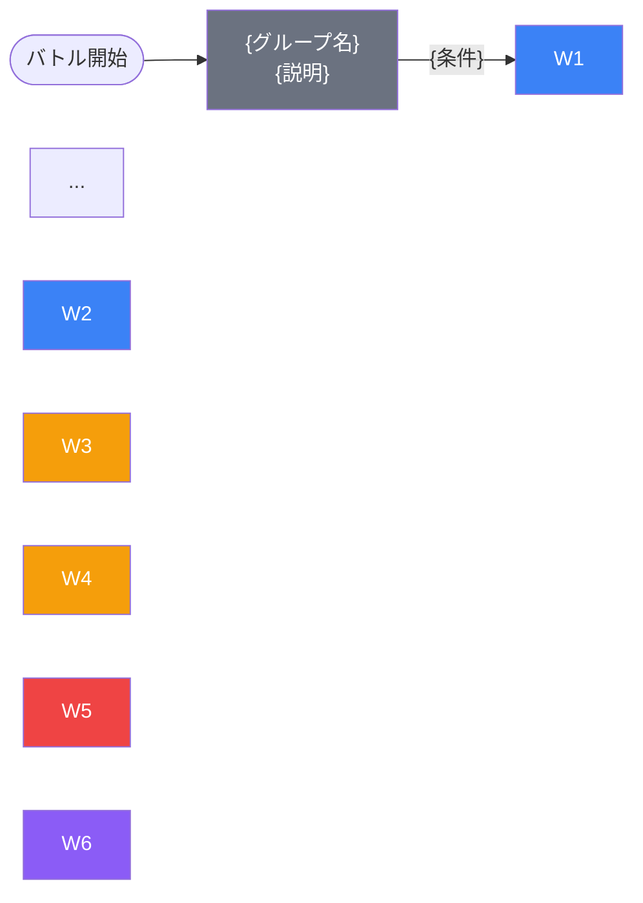

# ドキュメント構成テンプレート（必須8セクション）

生成ドキュメントは以下の8セクションを**この順序で必ず含める**。

---

## セクション1: 概要（ファイル冒頭）

```markdown
# {INGAME_ID} インゲームデータ詳細解説

> 参照リポジトリ: `projects/glow-masterdata`
> リリースキー: {RELEASE_KEY}
> 本ファイルはMstAutoPlayerSequenceが{N}行の{コンテンツタイプ}の全データ設定を解説する

---

## 概要

**{コンテンツ説明}**（{ゲームモード説明}）。

- 砦のHP: {hp} で{ダメージ有効/ダメージ無効}
- BGM: `{bgm_asset_key}`
- グループ: デフォルト + {グループ一覧}（{ループ情報}）
- 使用する敵の種類: {N}種類（`{kind}` {説明}）
- {特徴的なルール説明}
```

---

## セクション2: 関連テーブル設定

### MstInGame

| カラム | 値 |
|--------|-----|
| `id` | `{INGAME_ID}` |
| `mst_auto_player_sequence_set_id` | `{値}` |
| `bgm_asset_key` | `{値}` |
| `boss_bgm_asset_key` | `{値}` |
| `mst_page_id` | `{値}` |
| `mst_enemy_outpost_id` | `{値}` |
| `boss_mst_enemy_stage_parameter_id` | `{値}` |
| `normal_enemy_hp_coef` | `{値}` |
| `normal_enemy_attack_coef` | `{値}` |
| `normal_enemy_speed_coef` | `{値}` |
| `boss_enemy_hp_coef` | `{値}` |
| `boss_enemy_attack_coef` | `{値}` |
| `boss_enemy_speed_coef` | `{値}` |

### MstEnemyOutpost（敵砦）

| カラム | 値 | 意味 |
|--------|-----|------|
| `id` | `{値}` | |
| `hp` | `{値}` | {HP説明} |
| `is_damage_invalidation` | `{値}` | **{ダメージ有効/無効}** |
| `artwork_asset_key` | `{値}` | 背景アートワーク |

### MstPage + MstKomaLine（コマフィールド）

{行数}行構成。

```
row={N}  height={h}  layout={l}  ({N}コマ: {幅...})
  koma{N}: {asset}  width={w}  effect={効果}
```

> **コマ効果の補足**: {target説明}。

### MstInGameI18n（バトル説明文）

**result_tips（バトルヒント）:**
> {テキスト}

**description（ステージ説明）:**
> {テキスト}

---

## セクション3: 使用する敵パラメータ（MstEnemyStageParameter）一覧

{N}種類の敵パラメータを使用。`c_` プレフィックスはキャラ個別ID、`e_` は汎用敵。
IDの命名規則: `{c_/e_}{キャラID}_{コンテンツID}_{kind}_{color}`

### カラム解説

| カラム名（略称） | DBカラム名 | 説明 |
|---------------|-----------|------|
| id | id | MstEnemyStageParameterの主キー |
| キャラID | mst_enemy_character_id | 紐付くキャラモデル・スキルの参照元 |
| kind | character_unit_kind | `Normal`（通常敵）/ `Boss`（ボス）。UIオーラ表示に影響 |
| role | role_type | 属性相性の役職（Attack/Technical/Defense/Support） |
| color | color | 属性色（Red/Yellow/Green/Blue/Colorless） |
| sort_order | sort_order | ゲーム内表示順 |
| base_hp | hp | ベースHP（`enemy_hp_coef` 乗算前の素値） |
| base_atk | attack_power | ベース攻撃力（`enemy_attack_coef` 乗算前の素値） |
| base_spd | move_speed | 移動速度（数値が大きいほど速い） |
| well_dist | well_distance | 攻撃射程（コマ単位） |
| combo | attack_combo_cycle | 攻撃コンボ数（1=単発） |
| knockback | damage_knock_back_count | 被攻撃時ノックバック回数（0=ノックバックなし） |
| ability | mst_unit_ability_id1 | 特殊アビリティID |
| drop_bp | drop_battle_point | 基本ドロップバトルポイント |

### 全{N}種類の詳細パラメータ

| MstEnemyStageParameter ID | 日本語名 | キャラID | kind | role | color | sort | base_hp | base_atk | base_spd | well_dist | combo | knockback | ability | drop_bp |
|--------------------------|---------|---------|------|------|-------|------|---------|---------|---------|-----------|-------|-----------|---------|---------|
| ... |

> **実際のHP・ATKは `base × MstAutoPlayerSequence.enemy_hp_coef` で決まる。**

### 敵パラメータの特性解説

{ボスと雑魚の比較表・特筆すべき設計上の特徴を記載}

---

## セクション4: グループ構造の全体フロー（Mermaid）



> **Mermaid スタイルカラー規則**:
> - デフォルトグループ: `#6b7280`（グレー）
> - w1〜w2: `#3b82f6`（青）
> - w3〜w4: `#f59e0b`（橙）
> - w5以降: `#ef4444`（赤）
> - ループ起点直前のグループ: `#8b5cf6`（紫）

---

## セクション5: 全{N}行の詳細データ（グループ単位）

各グループのデータを以下の形式でまとめる。
**全グループ分を省略なく記載すること。**

### {グループ名}グループ（elem {n}〜{n}, groupchange_{n}）

{グループ概説}

| id | elem | 条件 | アクション | 召喚数 | interval | aura | hp倍 | atk倍 | override_bp | 説明 |
|----|------|------|-----------|--------|---------|------|------|------|------------|------|
| ... |

**ポイント:**
- {注目すべき設定の解説}

---

## セクション6: グループ切り替えまとめ表

| 切り替え | 条件 | 遷移先 |
|---------|------|--------|
| デフォルト → w1 | **FriendUnitDead({n})** | w1 |
| w1 → w2 | **FriendUnitDead({n})** | w2 |
| ... |

各グループで倒すべき目安:
- デフォルト: {n}体
- w1: {n}体
- ...

---

## セクション7: スコア体系

バトルポイントは `override_drop_battle_point`（MstAutoPlayerSequence設定値）が優先される。

| 敵の種類 | override_bp（獲得バトルポイント） | 備考 |
|---------|----------------------------------|------|
| ... |

---

## セクション8: この設定から読み取れる設計パターン

### 1. {パターン名}
{説明}

### 2. {パターン名}
{説明}

{3〜6項目記載。具体的なデータを引用し、設計意図を読み解く}
```

---

## 留意事項

- セクション5の詳細データは**全行省略なし**で記載する（DuckDBで取得した全行を反映）
- セクション8の設計パターンは最低3項目、最大6項目
- 数値は3桁区切りカンマ（例: `100,000`）で統一
- condition_typeの値はそのまま記載（例: `GroupActivated(300)` = 3,000ms = 3秒）
