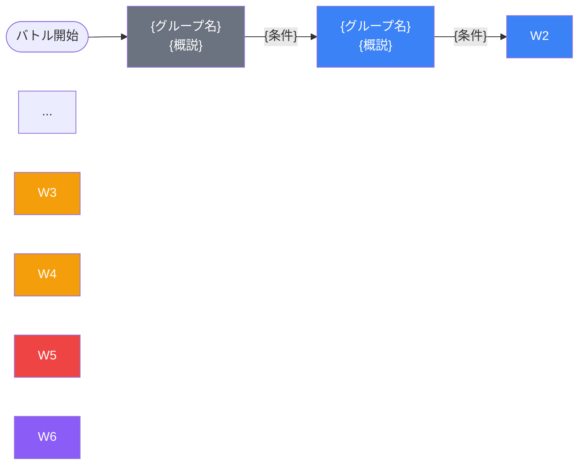

# ドキュメント構成テンプレート（v2フォーマット）

生成ドキュメントは以下の構成を**この順序で必ず含める**。

---

## ファイルヘッダー

```markdown
# {INGAME_ID} インゲームデータ詳細解説

> 参照リポジトリ: `projects/glow-masterdata`
> リリースキー: {RELEASE_KEY}
```

---

## インゲーム要件テキスト（冒頭散文）

```markdown
## インゲーム要件テキスト

{第1段落: シリーズ・コンテンツ種別（砦破壊型/スコアアタック型）・砦HP設定・ダメージ有効/無効の意味。}

{第2段落: フィールド構成（行数・コマ数・効果有無）・BGM設定・コマアセット概要。}

{第3段落: グループ構成概要（デフォルト + wN グループ数・ループ有無）・グループ遷移条件の種類（時間/撃破数/砦HP）・累計値リセットの仕様など設計上の注意点。}

{第4段落: 登場する敵の種類・各敵の役割と特性（spd/drop_bp/kindなど特筆点）。}

{第5段落（必要に応じて）: 演出意図・InitialSummon の有無・属性テーマ・フェーズ別の難度変化など。}
```

> **インゲーム要件テキスト記述ガイドライン**
>
> - **箇条書きを使わず、散文のみで記述する**
> - 段落ごとに1つのテーマを扱う（目的/フィールド/グループ構造/敵特性/演出など）
> - 段落数は内容量に応じて自由（4〜6段落が目安）
> - 数値は具体的に記載する（「spd=70」「累計103体撃破」など）
> - 記述例は [overview-examples.md](overview-examples.md) の散文部分を参考にすること

---

## レベルデザイン

### 敵キャラ設計

#### 敵キャラ選定（MstEnemyCharacter）

```markdown
### 敵キャラ設計

#### 敵キャラ選定（MstEnemyCharacter）

本ステージで使用する敵キャラクターモデルは{N}種類。

| mst_enemy_character_id | 日本語名 | 役割 | 備考 |
|------------------------|---------|------|------|
| `{id}` | {名前} | {役割} | {特記事項（spd・drop_bp・kindの特徴など）} |
```

> - `mst_enemy_character_id` はMstEnemyStageParameterの `mst_enemy_character_id` カラムから取得
> - 同一キャラモデルで Normal/Boss 両方存在する場合は同じ行に「kindがNormal/Bossの両方で同一モデル」と備考記載
> - 日本語名はMstEnemyCharacterI18n（language='ja'）から取得

#### 敵キャラステータス調整（MstEnemyStageParameter → MstInGame基本設定）

```markdown
#### 敵キャラステータス調整（MstEnemyStageParameter → MstInGame基本設定）

**MstInGameのcoef状態**: {全て1.0（無調整） / または変更あり（変更箇所を明記）}
{coef≠1.0の場合: 「normal_enemy_hp_coef={値}・boss_enemy_hp_coef={値}（全敵に乗算）」などを明記}

MstEnemyStageParameterに定義された{N}種類の素値：

| MstEnemyStageParameter ID | 日本語名 | kind | role | color | base_hp | base_atk | base_spd | well_dist | drop_bp |
|--------------------------|---------|------|------|-------|---------|---------|---------|-----------|---------|
| `{id}` | {名前} | {Normal/Boss} | {role} | {color} | {数値} | {数値} | {数値} | {数値} | {数値} |

> {共通特性があれば補足。例: 全敵のノックバック=0、コンボ数=1 など}
```

> - `base_hp` = DBカラム `hp`、`base_atk` = `attack_power`、`base_spd` = `move_speed`
> - `well_dist` = `well_distance`（コマ単位の攻撃射程）
> - 数値は3桁区切りカンマで統一（例: `1,000`、`300,000`）

---

### コマ設計

```markdown
### コマ設計

{概要一行（N行Nコマ構成、effectの有無・アセット名）}

```mermaid
block-beta
  columns 10
  A["row=1 / koma1\n幅={幅}\nasset: {asset}\noffset: {値}\neffect: {効果}"]:N
  B["row=1 / koma2\n幅={幅}\nasset: {asset}\noffset: {値}\neffect: {効果}"]:N
  C["row=2 / koma1\n幅={幅}\nasset: {asset}\noffset: {値}\neffect: {効果}"]:10
  ...
```
```

> **block-beta 幅比率指定ルール（columns 10 基準）**:
>
> | MstKomaLine.width | block-beta の末尾 `:N` |
> |------|-------|
> | 0.4 | `:4` |
> | 0.6 | `:6` |
> | 0.5 | `:5` |
> | 0.25 | `:3`（端数切り上げ）|
> | 0.33 | `:3` |
> | 0.34 | `:4` |
> | 1.0（全幅） | `:10` |
>
> - `columns 10` を固定として、各コマの幅を10分割で表現する
> - 1行の全コマの `:N` の合計が必ず10になるよう調整する
> - コマ効果がある場合は `effect:` パラメータに効果名を記載し、後続の演出セクションとの対応を明記すること
> - `offset` は `bg_offset` カラムの値をそのまま記載

---

### 敵キャラシーケンス設計

#### どのフェーズで、どの敵を、いつ、どこに、どのくらい出現させるか

```markdown
### 敵キャラシーケンス設計

#### どのフェーズで、どの敵を、いつ、どこに、どのくらい出現させるか

{グループ構成サマリー（例: デフォルト + w1〜w5の6グループ構成。w5完了後にw1へループ。）}


```mermaid
flowchart LR
    START([バトル開始]) --> DEF

    DEF["{グループ名}<br/>{概説}"]
    DEF -- "{条件}" --> W1

    W1["{グループ名}<br/>{概説}"]
    W1 -- "{条件}" --> W2
    ...

    style DEF fill:#6b7280,color:#fff
    style W1 fill:#3b82f6,color:#fff
    style W2 fill:#3b82f6,color:#fff
    style W3 fill:#f59e0b,color:#fff
    style W4 fill:#f59e0b,color:#fff
    style W5 fill:#ef4444,color:#fff
    style W6 fill:#8b5cf6,color:#fff
```

**{グループ名}グループ**（{条件・遷移説明}）

| elem | 出現タイミング | 敵 | 数 | 召喚位置 | interval |
|------|-------------|---|---|---------|---------|
| {番号} | {条件} | {敵名}（{color}/{kind}） | {数} | {位置またはランダム} | {値} |
```

> **Mermaid スタイルカラー規則**:
> - デフォルトグループ: `#6b7280`（グレー）
> - w1〜w2: `#3b82f6`（青）
> - w3〜w4: `#f59e0b`（橙）
> - w5以降: `#ef4444`（赤）
> - ループ起点直前のグループ: `#8b5cf6`（紫）
>
> **グループ別テーブル記載ガイドライン**:
> - 各グループについてヘッダー + テーブルを記載（全グループ省略なし）
> - `InitialSummon` の場合は出現タイミング列に `**InitialSummon({N})**` と太字で記載し、召喚位置を `**位置{N}（固定初期配置）**` と明記
> - `FriendUnitDead(条件値)` の場合、条件値がsequence_element_idを指していることに注意（体数ではなく元素IDの参照）
> - `GroupActivated({N})` の N は ms 単位（100=1秒）

#### 敵キャラの固有ステータス調整（hp_coef / atk_coef）

```markdown
#### 敵キャラの固有ステータス調整（hp_coef / atk_coef）

MstAutoPlayerSequenceのhp_coef・atk_coefによる実HP・ATK（MstInGameのcoef状態を再掲）：

| フェーズ | 敵 | base_hp | hp_coef | 実HP | base_atk | atk_coef | 実ATK | override_bp | defeated_score |
|---------|---|---------|---------|------|---------|---------|-------|------------|----------------|
| {グループ名} | {敵名}（{color}/{kind}） | {数値} | {数値} | {計算値} | {数値} | {数値} | {計算値} | {値または—} | {値} |
```

> - `実HP` = `base_hp × hp_coef`（MstInGameのcoef≠1.0の場合はさらに乗算）
> - `実ATK` = `base_atk × atk_coef`（同上）
> - `override_bp` は `override_drop_battle_point` カラムの値。空なら `—` 表記
> - `defeated_score` は `defeated_score` カラムの値
> - 特に高倍率・注目すべき値は **太字** で強調する（例: `**450,000**`）

#### フェーズ切り替えはあるか

```markdown
#### フェーズ切り替えはあるか

**{あり（N段階 + ループ）/ あり（N段階）/ なし（デフォルトグループのみ）}**

| 切り替え | 条件 | 遷移先 |
|---------|------|--------|
| {グループA} → {グループB} | **{condition_type}（{値}）**（{条件の意味}） | {遷移先グループ} |

> {注意点。例: FriendUnitDeadは累計値でリセットされない。ループ2周目はw1起動直後に条件が既に満たされているため即w2へ遷移する など}
```

---

## 演出

### アセット

#### コマ背景

```markdown
### アセット

#### コマ背景

{コマ効果なしの場合（effect=Noneのみ）:}
コマ効果なし（全コマeffect=None）のため、**背景アセットの調整が必要**。

| 設定箇所 | アセットキー | 備考 |
|---------|------------|------|
| 全{N}コマ（MstKomaLine） | `{asset_key}` | {シリーズ説明・統一/個別の別} |
| 砦背景（MstEnemyOutpost） | `{artwork_asset_key}` | {シリーズ説明} |

{コマ効果ありの場合（effect≠Noneが含まれる）:}
コマ効果あり。効果のあるコマは個別に記載する。

| 設定箇所 | アセットキー | コマ効果 | 備考 |
|---------|------------|---------|------|
| koma_{N}（MstKomaLine） | `{asset_key}` | `{koma_effect}` | {効果の説明} |
| koma_{N}（MstKomaLine） | `{asset_key}` | `None` | 効果なし |
| 砦背景（MstEnemyOutpost） | `{artwork_asset_key}` | — | {シリーズ説明} |
```

#### BGM

```markdown
#### BGM

| 設定 | 値 | 備考 |
|------|-----|------|
| 通常BGM（bgm_asset_key） | `{値}` | |
| ボスBGM（boss_bgm_asset_key） | {`値` または `なし`} | {boss_bgm_asset_keyが未設定なら「boss_bgm_asset_keyは未設定」と記載} |
```

---

### 敵キャラオーラ

```markdown
### 敵キャラオーラ

| オーラ種別 | 演出ランク | 使用箇所 |
|---------|----------|---------|
| `Default` | 標準（オーラなし） | {全Normal敵・groupchange行など共通情報} |
| `AdventBoss1` | ボス演出 Lv1 | {使用箇所} |
| `AdventBoss2` | ボス演出 Lv2 | {使用箇所} |
| `AdventBoss3` | ボス演出 Lv3（最高） | {使用箇所} |

{特記事項があれば記載。例: 同一敵がグループによって異なるオーラランクを持つ場合など}
```

> - オーラ種別は MstAutoPlayerSequence の `aura` カラムから取得
> - `Default` 以外が使用されていない場合は「全敵 `Default`（オーラなし）」と一文で済ませてよい

---

### 敵キャラ召喚アニメーション

```markdown
### 敵キャラ召喚アニメーション

{全Noneの場合:}
全敵の`summon_animation_type`が`None`（アニメーションなし）。

{Noneでない設定がある場合:}
| 対象 | summon_animation_type | 備考 |
|------|----------------------|------|
| {敵名}/{グループ} | `{値}` | {説明} |
```

---

## 留意事項

- インゲーム要件テキストは**箇条書きなし・散文のみ**で記述する
- `MstEnemyStageParameter`の全行は省略せず記載する
- グループ別テーブルは全グループ分を省略なく記載する
- 数値は3桁区切りカンマ（例: `100,000`）で統一
- `condition_type = GroupActivated(N)` の N は ms単位（例: `GroupActivated(300)` = 300ms = 0.3秒）
- `FriendUnitDead(N)` の N は `sequence_element_id` の値（累計体数ではなく元素IDへの参照）
- `InitialSummon(1)` はバトル開始時の固定位置配置を示す特殊トリガー
- `override_drop_battle_point` が設定されている場合はその値が `drop_bp` に優先される
