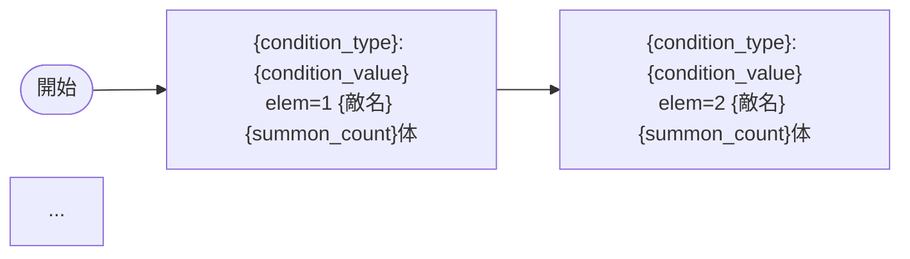

# Step 04: 敵キャラシーケンス設計

VDインゲーム設計書（design.md）の **`### 敵キャラシーケンス設計`** セクションを生成・更新する手順。

- **担当セクション**: `## レベルデザイン > ### 敵キャラシーケンス設計`
- 生成物: Mermaid flowchart 図 + elemテーブル

---

## VD固有の禁止ルール（必ず守ること）

| 禁止項目 | 理由 |
|---------|------|
| `InitialSummon` の使用 | VDでは使用禁止 |
| `ElapsedTime` の使用 | VDでは使用禁止 |
| `SwitchSequenceGroup` の使用 | フェーズ切り替え禁止 |
| c_キャラの同時2体以上出現 | フィールドに同時に複数体出現不可 |
| c_キャラの `summon_count` ≥ 2 | 1体ずつ召喚必須 |

---

## Step 0: 準備・ドキュメント読み込み

以下を読み込む。

**参照ドキュメント（必須）**:
- `.claude/skills/vd-masterdata-ingame-designer/references/MstAutoPlayerSequence_具体例集.md` — 過去実例集
- `.claude/skills/vd-masterdata-ingame-designer/references/MstAutoPlayerSequence_設計パターン集.md` — 設計パターン解説
- `domain/knowledge/masterdata/table-docs/MstAutoPlayerSequence.md` — テーブル定義

## Step 1: シーケンス設計

#### 使用可能な condition_type（VD）

以下から選択する（`InitialSummon` / `ElapsedTime` は禁止）:

| condition_type | 説明 | 活用例 |
|---------------|------|--------|
| `FriendUnitDead` | 友軍キャラが倒されたとき | N体倒したら強化雑魚追加 / c_キャラチェーン |
| `OutpostHpPercentage` | 拠点HPが指定%以下になったとき | 拠点50%でボス登場 |
| `EnterTargetKomaIndex` | 対象コマインデックスに入ったとき | コマ進行連動の伏兵 |
| `DarknessKomaCleared` | 闇コマをクリアした数に応じて | 難易度自動調整 |
| `FriendUnitTransform` | フレンドキャラが変身したとき | 変身後に大量召喚 |
| `OutpostDamage` | 拠点がダメージを受けたとき | ダメージ連動トリガー |
| `FriendUnitSummoned` | 友軍キャラが召喚されたとき | 召喚連動トリガー |
| `FoeEnterSameKomaLine` | 同コマラインに敵対者が入ったとき | 行侵入連動 |
| `OnFieldPlayerCharacterCount` | フィールド上の通常プレイヤーキャラ数 | 人数連動難易度調整 |

#### 推奨設計パターン（normalブロック）

具体例集・設計パターン集から適切なパターンを選択:

- **A. FriendUnitDead型**: FriendUnitDead で段階強化 → 終盤 summon_count=99 無限補充
- **B. 拠点防衛型**: OutpostHpPercentage で残HP連動 → c_キャラ最終ボス
- **D. キャラ変身型**: FriendUnitTransform=1 で変身後に大量召喚

#### 召喚位置の設定

| ブロック種別 | 有効範囲 | 推奨値 |
|------------|---------|--------|
| normal（3行） | `1.0〜3.0` | 各行に分散。0付近はプレイヤー陣地のため使用しない |
| boss（1行） | `0.0〜1.0` | ボスは `0.7` 推奨（1.0以上は画面はみ出し） |

#### normalブロックの体数設計

雑魚キャラの合計出現数が **最低15体以上** になるよう設計する:
- `summon_count=99` + 適切な interval = 実質無限補充（終盤強化に有効）
- `summon_count=10〜20` = 大規模ラッシュ
- `summon_count=1` = c_キャラ・特殊キャラの確実な1体出現

#### c_キャラのチェーンルール

c_キャラ（`c_` プレフィックス）が複数体登場する場合:
1. 最初の c_キャラ: 任意の condition_type で召喚
2. 2体目以降: 必ず `FriendUnitDead`（前の c_キャラの `sequence_element_id` を condition_value に指定）でチェーン
3. c_キャラのすべてのエントリは `summon_count = 1`（2以上は禁止）
4. `e_glo_*` はこの制約の対象外

## Step 2: 設計テーブル・図の生成

以下のフォーマットでMarkdownを生成する。

````markdown
### 敵キャラシーケンス設計

> **c_キャラ同時出現ルール（プランナー確認済み）**: c_キャラ（`c_` プレフィックス）が複数体登場する場合、
> 2体目以降は必ず `FriendUnitDead`（前の c_キャラの sequence_element_id を condition_value に指定）で
> チェーンすること。また c_キャラの `summon_count` は必ず `1` とすること。`e_glo_*` は対象外。

#### どのフェーズで、どの敵を、いつ、どこに、どのくらい出現させるか



| elem | 出現タイミング | 敵 | 数 | 召喚位置 | 累計出現数 | 備考 |
|------|-------------|---|---|---------|----------|------|
| {値} | {condition_type}:{condition_value} | {敵名} | {summon_count} | {summon_position} | {累計} | {備考} |

#### 敵キャラの固有ステータス調整（hp_coef / atk_coef）
| 波/フェーズ | 敵 | base_hp | hp_coef | 実HP | base_atk | atk_coef | 実ATK |
|-----------|---|---------|---------|------|----------|----------|-------|
| {値} | {敵名} | {値} | {値} | {値} | {値} | {値} | {値} |

#### フェーズ切り替えはあるか
なし（VDではSwitchSequenceGroup使用禁止）
````

## Step 3: c_キャラ検証

設計完了前に以下を必ず確認する:
1. `c_` プレフィックスのキャラが2体以上ある場合、2体目以降が `FriendUnitDead` でチェーンされているか
2. c_キャラ全エントリの `summon_count` が `1` であるか
3. `InitialSummon` / `ElapsedTime` / `SwitchSequenceGroup` が使用されていないか

## Step 4: 確認・更新

`--batch` フラグがない場合:
```
敵キャラシーケンスを設計しました。内容をご確認ください。

修正がなければ「OK」または「承認」とお伝えください。
修正がある場合は具体的にご指示ください。
```

承認後（または `--batch` 時）、design.md の該当セクションを更新する。

---

## ガードレール

1. **`InitialSummon` / `ElapsedTime` / `SwitchSequenceGroup` は使用禁止**
2. **c_キャラは FriendUnitDead でチェーン**: 2体目以降は必ず前の c_キャラの撃破を待つ
3. **c_キャラの summon_count は必ず 1**: 2以上にすると同時複数体が出現する
4. **normalブロックは15体以上**: 雑魚キャラ合計出現数が最低15体
5. **bossブロックはボスのみ**: 雑魚キャラを出現させない
6. **condition_value の整合性**: FriendUnitDead 等の condition_value は同一シーケンスセット内の sequence_element_id を参照する

---

## リファレンス

- `.claude/skills/vd-masterdata-ingame-designer/references/MstAutoPlayerSequence_具体例集.md` — 過去15ステージの実例集
- `.claude/skills/vd-masterdata-ingame-designer/references/MstAutoPlayerSequence_設計パターン集.md` — condition_type・summon_count・aura_type等の設計パターン
- `domain/knowledge/masterdata/table-docs/MstAutoPlayerSequence.md` — テーブル定義
