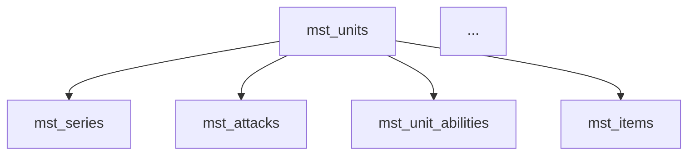

# マスタデータ生成カスタムコマンド実装計画

## 概要

**目的**: ユーザーが要件を引数に渡すだけで、GLOWプロジェクトのマスタデータ（CSV形式）を自動生成するカスタムコマンド `/generate-masterdata` を実装します。

**ユーザー要件**:
- コマンド名: `generate-masterdata`
- 実装方法: 段階的実装（Phase 1→2→3）
- 対象テーブル: **mst、opr、mngの全テーブル（計177テーブル）**
- 引数形式: 全て一括で受け取る（例: `/generate-masterdata mst_units 新シリーズabc Attack 3体 UR`）

**調査結果のサマリ**:
- マスタデータ総数: 199テーブル（mst: 152、opr: 14、mng: 11、その他: 22）
- ユーザー要望: mst + opr + mng = **177テーブル**をドキュメント化
- 形式: CSV（ENABLE列、release_key、I18n分離）
- 依存関係: 複雑なテーブル間依存あり
- DDLファイル: 67862トークン（Grepで部分取得が必要）

## 実装アプローチ

### 課題: 177テーブルの効率的なドキュメント化

全テーブルを手作業でドキュメント化するのは非現実的（推定30-50日）。以下のハイブリッドアプローチを採用：

**段階的 + 自動生成アプローチ**:
1. **Tier1（最重要4テーブル）**: 手動で詳細ドキュメント作成
2. **残り173テーブル**: DDL解析 + 調査結果を元に半自動生成
3. **コマンド実行時**: ドキュメントを参照しつつ、DDLから動的に補完

## Phase 1: ドキュメント基盤構築（推定5-7日）

### 1.1 ディレクトリ構造作成

```
docs/マスタデータ作成/
├── README.md                          # 総合ガイド
├── 01_基本ルール.md                    # CSV形式、ENABLE、NULL、日時
├── 02_命名規則.md                      # ID命名パターン、シリーズ略称
├── 03_依存関係マップ.md                # テーブル間依存関係
├── 04_バージョン管理.md                # release_keyの運用
├── 05_全テーブル一覧.md                # 177テーブルの概要リスト
├── tables/                            # テーブル別詳細
│   ├── tier1_最重要/
│   │   ├── mst_units.md              # 詳細版（手動作成）
│   │   ├── mst_items.md
│   │   ├── mst_stages.md
│   │   └── mst_configs.md
│   ├── mst/                           # mstテーブル群（148テーブル）
│   │   └── [自動生成されたドキュメント]
│   ├── opr/                           # oprテーブル群（14テーブル）
│   │   └── [自動生成されたドキュメント]
│   └── mng/                           # mngテーブル群（11テーブル）
│       └── [自動生成されたドキュメント]
├── generated/                         # 生成CSV保存先
└── plans/                             # 生成計画保存先
```

### 1.2 基礎ドキュメント作成（2日）

**優先順位**:
1. **01_基本ルール.md** - CSV形式仕様、ENABLE列、NULL表現、日時フォーマット
2. **02_命名規則.md** - ID命名パターン、シリーズ略称、連番ルール
3. **04_バージョン管理.md** - release_keyの形式と運用
4. **README.md** - 全体の使い方

**情報ソース**: 3つのExploreエージェント調査結果を活用

### 1.3 Tier1詳細ドキュメント作成（2日）

**対象テーブル**:
- `mst_units` - キャラクター（最重要）
- `mst_items` - アイテム
- `mst_stages` - ステージ
- `mst_configs` - システム設定

**含める情報**:
- 概要と役割
- glow-server影響範囲（リポジトリ、サービス、API）
- glow-client影響範囲（リポジトリ、UseCase、UI）
- DDLスキーマ定義
- フィールド詳細説明
- サンプルデータ
- 依存関係
- データ生成時の注意点

### 1.4 全テーブル一覧作成（1日）

**05_全テーブル一覧.md**:

177テーブルの簡易リストを作成：

| テーブル名 | カテゴリ | 概要 | 重要度 | ドキュメント |
|-----------|---------|------|--------|-------------|
| mst_units | mst | キャラクターマスタ | 高 | [詳細](tables/tier1_最重要/mst_units.md) |
| mst_items | mst | アイテムマスタ | 高 | [詳細](tables/tier1_最重要/mst_items.md) |
| ... | ... | ... | ... | ... |

**情報ソース**:
- DDLファイルのテーブル定義とコメント
- glow-server調査結果（使用頻度）
- glow-client調査結果（使用箇所）

### 1.5 依存関係マップ作成（1-2日）

**03_依存関係マップ.md**:

DDLから外部キー制約を抽出してMermaid図を作成：



**抽出方法**:
```bash
Grep "FOREIGN KEY" projects/glow-server/api/database/schema/master_tables_ddl.sql
```

## Phase 2: カスタムコマンド実装（推定4-5日）

### 2.1 コマンドファイル作成

**ファイルパス**: `.claude/commands/general/generate-masterdata.md`

**フロントマター**:
```yaml
---
description: 要件からマスタデータを自動生成
argument-hint: "[要件の詳細説明]"
allowed-tools:
  - Bash(ls:*)
  - Bash(head:*)
  - Bash(tail:*)
  - Bash(wc:*)
  - Bash(date:*)
  - Bash(grep:*)
  - Bash(cut:*)
  - Bash(awk:*)
  - Read
  - Grep
  - Glob
---
```

### 2.2 コマンドの実行フロー

```
1. 引数解析
   - テーブル名の抽出（mst_units, MstUnit など）
   - 要件テキストの解析
   ↓
2. ドキュメント参照
   - docs/マスタデータ作成/tables/ 内を検索
   - 該当ドキュメントがあれば読み込み
   ↓
3. DDLからスキーマ取得
   - Grepでテーブル定義を部分取得
   - カラム情報、制約、コメントを解析
   ↓
4. 既存データ分析
   - projects/glow-masterdata/[MstTable].csv を読み込み
   - 最新ID連番を取得
   - 既存パターンを分析
   ↓
5. データ生成
   - 要件に基づいてCSV行を生成
   - ID自動採番（既存最大値+1）
   - release_keyの自動設定
   - 命名規則の適用
   ↓
6. I18n対応
   - *I18nファイルの存在確認
   - I18nレコードの自動生成
   ↓
7. 依存関係チェック
   - 外部キー参照先の存在確認
   - 警告表示
   ↓
8. CSV出力
   - docs/マスタデータ作成/generated/[timestamp]_[table].csv
   - Googleスプレッドシート対応形式
   ↓
9. 生成ログとガイダンス
   - 生成内容のサマリ
   - コピペ手順
   - 次のステップ提案
```

### 2.3 重要なロジック

#### ID採番ロジック
```bash
# 既存最大IDを検索（シリーズ別）
Grep "^e,${PREFIX}_${SERIES}_" projects/glow-masterdata/[MstTable].csv | \
  tail -1 | \
  cut -d',' -f2 | \
  sed 's/.*_//'  # 連番部分を抽出

# 次のIDを計算
NEXT_NUM=$((MAX_NUM + 1))
NEXT_ID=$(printf "%s_%s_%05d" "${PREFIX}" "${SERIES}" "${NEXT_NUM}")
```

#### release_key生成
```bash
# 現在日付を取得
TODAY=$(date +%y%m%d)

# 既存の同日release_keyを検索
EXISTING=$(Grep ",${TODAY}" projects/glow-masterdata/[MstTable].csv | \
  tail -1 | \
  cut -d',' -f[RELEASE_KEY_COL] | \
  sed 's/.*\(..\)$/\1/')  # 末尾2桁（バージョン）

# バージョン番号をインクリメント
VERSION=$((EXISTING + 1))
RELEASE_KEY="${TODAY}$(printf "%02d" "${VERSION}")"
```

#### I18n自動生成
```bash
# I18nファイルの存在確認
if [ -f "projects/glow-masterdata/[MstTable]I18n.csv" ]; then
  # I18nレコード生成
  # language=ja, 表示名と説明を設定
fi
```

### 2.4 コマンドプロンプト構造

詳細なステップバイステップの指示を含む：
- ドキュメント参照手順
- DDL取得手順
- 既存データ分析手順
- データ生成ルール
- 出力形式
- エラーハンドリング

## Phase 3: テスト・検証（推定2-3日）

### 3.1 機能テスト

**テストケース**:
1. **mst_units** - 新キャラ3体生成（Attack/Defense/Support、全てUR）
2. **mst_items** - 強化素材10個生成
3. **mst_stages** - イベントステージ5個生成
4. **opr_gachas** - 新ガチャ設定生成
5. **I18n自動生成** - *I18nファイルが正しく生成されるか

### 3.2 エッジケーステスト

- 存在しないテーブル指定
- 依存データが不足している場合
- ID連番の衝突防止
- 大量データ生成（100件以上）
- 複雑な依存関係のテーブル

### 3.3 出力形式検証

- CSV形式の正確性
- Googleスプレッドシートへのコピペ動作確認
- 特殊文字のエスケープ
- 改行コードの確認

### 3.4 ドキュメント改善

- テスト結果を元に修正
- よくあるエラーと対処法を追記
- 成功事例を追加
- FAQ作成

## 成果物

### Phase 1完了時
- [x] docs/マスタデータ作成/README.md
- [x] docs/マスタデータ作成/01_基本ルール.md
- [x] docs/マスタデータ作成/02_命名規則.md
- [x] docs/マスタデータ作成/03_依存関係マップ.md
- [x] docs/マスタデータ作成/04_バージョン管理.md
- [x] docs/マスタデータ作成/05_全テーブル一覧.md
- [x] docs/マスタデータ作成/tables/tier1_最重要/mst_units.md
- [x] docs/マスタデータ作成/tables/tier1_最重要/mst_items.md
- [x] docs/マスタデータ作成/tables/tier1_最重要/mst_stages.md
- [x] docs/マスタデータ作成/tables/tier1_最重要/mst_configs.md

### Phase 2完了時
- [x] .claude/commands/general/generate-masterdata.md
- [x] docs/マスタデータ作成/generated/ ディレクトリ
- [x] 動作する基本的なマスタデータ生成機能

### Phase 3完了時
- [x] テスト済みのコマンド
- [x] 改善されたドキュメント
- [x] 使用例とサンプルデータ
- [x] FAQ

## 重要な設計判断

### 1. 177テーブル全てのドキュメント化について

**判断**: Tier1（4テーブル）のみ詳細ドキュメント化、残りは簡易版

**理由**:
- 全テーブルの詳細ドキュメント化は30-50日必要（非現実的）
- コマンド実行時にDDLから動的に情報取得可能
- 使用頻度の高いTier1を優先することで実用性を確保
- 全テーブル一覧（05_全テーブル一覧.md）で概要は把握可能

**代替策（Phase 4以降）**:
- 需要が高いテーブルから順次詳細化
- DDL + 調査結果を元にした半自動ドキュメント生成スクリプト

### 2. DDLファイルの扱い

**判断**: Grepで部分取得、全体は読み込まない

**理由**:
- 67862トークンは大きすぎる
- 1テーブルあたり50-200行程度で十分
- コンテキストを節約

### 3. 引数形式

**判断**: 全て一括で受け取る

**理由**:
- ユーザーの要望に一致
- 自然言語での要件記述が可能
- AIによる柔軟な解釈が可能

## 次のステップ

### 即座に実行可能なアクション

1. **ディレクトリ構造の作成**
   ```bash
   mkdir -p docs/マスタデータ作成/{tables/{tier1_最重要,mst,opr,mng},generated,plans}
   ```

2. **README.md作成** - プロジェクト概要と使い方

3. **01_基本ルール.md作成** - 調査結果1をベースに

4. **02_命名規則.md作成** - ID命名パターンとシリーズ略称

5. **04_バージョン管理.md作成** - release_keyの運用ルール

### Phase 1の詳細タスク

- [ ] ディレクトリ構造作成
- [ ] README.md作成
- [ ] 01_基本ルール.md作成
- [ ] 02_命名規則.md作成
- [ ] 04_バージョン管理.md作成
- [ ] 03_依存関係マップ.md作成（DDLからFOREIGN KEY抽出）
- [ ] 05_全テーブル一覧.md作成（177テーブルの簡易リスト）
- [ ] mst_units.md作成（詳細版）
- [ ] mst_items.md作成（詳細版）
- [ ] mst_stages.md作成（詳細版）
- [ ] mst_configs.md作成（詳細版）

## 重要ファイル

### 実装に必須のファイル

1. **projects/glow-server/api/database/schema/master_tables_ddl.sql**
   - 全テーブルのスキーマ定義
   - Grepで部分取得して使用

2. **projects/glow-masterdata/MstUnit.csv**
   - 最重要テーブルの実データ
   - ID採番、命名規則、データ構造の参考

3. **projects/glow-masterdata/MstItem.csv**
   - 第2の重要テーブル
   - アイテム系の命名規則参考

4. **Exploreエージェント調査結果**
   - glow-masterdataの構造とルール
   - glow-serverでの使用状況
   - glow-clientでの使用状況

## 見積もり

- **Phase 1**: 5-7日（ドキュメント基盤）
- **Phase 2**: 4-5日（コマンド実装）
- **Phase 3**: 2-3日（テスト・検証）
- **合計**: 11-15日

## リスクと対策

| リスク | 影響 | 対策 |
|--------|------|------|
| 177テーブルのドキュメント化に時間がかかる | 大 | Tier1のみ詳細化、残りは簡易版 |
| DDLファイルが大きすぎる | 中 | Grepで部分取得 |
| 依存関係が複雑 | 中 | 段階的な実装（警告表示→提案→自動解決） |
| ID採番の重複 | 高 | 既存最大値の確実な確認ロジック |
| CSV形式の不整合 | 中 | 厳格な形式チェック |

## 成功指標

- [x] Phase 1完了: Tier1の4テーブルが完全にドキュメント化されている
- [x] Phase 2完了: mst_unitsで新キャラ生成が動作する
- [x] Phase 3完了: 複数テーブルで安定した生成が可能

---

**このプランに従って実装を進めます。Phase 1から開始します。**
