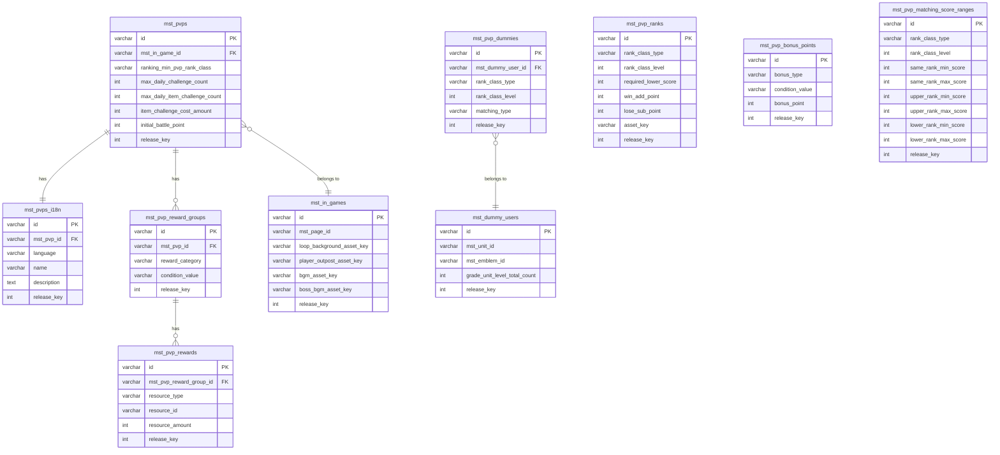

# PVP機能 - マスタデータリレーション

## 概要

PVP（Player vs Player）機能に関連するマスタテーブルとそのリレーション関係をまとめたドキュメントです。

## 関連テーブル一覧

| テーブル名 | 説明 | 主キー | 備考 |
|-----------|------|--------|------|
| mst_pvps | PVPマスタ | id | PVP全体の設定 |
| mst_pvps_i18n | PVP多言語マスタ | id | PVP名称・説明の多言語対応 |
| mst_pvp_ranks | PVPランククラスマスタ | id | ランククラス定義（ブロンズ、シルバー等） |
| mst_pvp_reward_groups | PVP報酬グループマスタ | id | 報酬の条件グループ |
| mst_pvp_rewards | PVP報酬マスタ | id | 具体的な報酬内容 |
| mst_pvp_bonus_points | PVPボーナスポイントマスタ | id | ボーナスポイント設定 |
| mst_pvp_matching_score_ranges | PVPマッチングスコア範囲マスタ | id | ランククラス別マッチング範囲 |
| mst_pvp_dummies | PVPダミーユーザーマスタ | id | ダミー対戦相手設定 |
| mst_in_games | インゲームマスタ | id | PVPで使用するゲーム設定 |
| mst_dummy_users | ダミーユーザーマスタ | id | ダミーユーザー情報 |

## テーブルリレーション図

## リレーション詳細

### mst_pvps → mst_pvps_i18n

- **関係**: 1対1（One to One）
- **外部キー**: `mst_pvps_i18n.mst_pvp_id` → `mst_pvps.id`
- **説明**: 各PVP設定は1つの多言語情報を持ちます
- **コード参照**:
  - Laravel Admin: `projects/glow-server/admin/app/Models/Mst/MstPvp.php:12-15`

### mst_pvps → mst_pvp_reward_groups

- **関係**: 1対多（One to Many）
- **外部キー**: `mst_pvp_reward_groups.mst_pvp_id` → `mst_pvps.id`
- **説明**: 1つのPVP設定は複数の報酬グループを持つことができます（ランククラス報酬、デイリー報酬など）
- **特記事項**: `reward_category`カラムで報酬種別を区別します

### mst_pvp_reward_groups → mst_pvp_rewards

- **関係**: 1対多（One to Many）
- **外部キー**: `mst_pvp_rewards.mst_pvp_reward_group_id` → `mst_pvp_reward_groups.id`
- **説明**: 1つの報酬グループは複数の報酬アイテムを持つことができます
- **コード参照**:
  - Laravel Admin: `projects/glow-server/admin/app/Models/Mst/MstPvpRewardGroup.php:13-16`

### mst_pvps → mst_in_games

- **関係**: 多対1（Many to One）
- **外部キー**: `mst_pvps.mst_in_game_id` → `mst_in_games.id`
- **説明**: 各PVP設定は1つのインゲーム設定を参照します（バトルフィールド、BGMなど）
- **コード参照**:
  - Laravel API: `projects/glow-server/api/app/Domain/Resource/Mst/Models/MstPvp.php:53-56`

### mst_pvp_dummies → mst_dummy_users

- **関係**: 多対1（Many to One）
- **外部キー**: `mst_pvp_dummies.mst_dummy_user_id` → `mst_dummy_users.id`
- **説明**: PVPダミー設定はダミーユーザー情報を参照します（ユニット、エンブレムなど）

### mst_pvp_ranks（独立テーブル）

- **関係**: なし（独立）
- **説明**: ランククラス（ブロンズ、シルバー、ゴールドなど）を定義します
- **特記事項**: `rank_class_type`と`rank_class_level`で各ランクを一意に識別します

### mst_pvp_bonus_points（独立テーブル）

- **関係**: なし（独立）
- **説明**: ボーナスポイントの条件と付与ポイント数を定義します
- **特記事項**: `bonus_type`でボーナス種別、`condition_value`で条件を指定します

### mst_pvp_matching_score_ranges（独立テーブル）

- **関係**: なし（独立）
- **説明**: ランククラス別のマッチング可能なスコア範囲を定義します
- **特記事項**: `rank_class_type`と`rank_class_level`で対象ランクを指定し、同ランク・上位ランク・下位ランクそれぞれのマッチング範囲を設定します

## データ構造の特徴

### ランククラスの表現

ランククラスは以下の2つのカラムで表現されます：
- `rank_class_type`: ランクの種類（例: BRONZE, SILVER, GOLD）
- `rank_class_level`: ランク内のレベル（例: 1, 2, 3）

これにより「ブロンズ1」「シルバー3」などの細かいランク分けが可能です。

### 報酬グループの仕組み

報酬は2段階で管理されます：

1. **mst_pvp_reward_groups**: 報酬グループの条件定義
   - `reward_category`: 報酬種別（ランククラス報酬、デイリー報酬など）
   - `condition_value`: 条件値（ランククラスIDや達成回数など）

2. **mst_pvp_rewards**: 具体的な報酬内容
   - `resource_type`: リソースタイプ（アイテム、通貨など）
   - `resource_id`: リソースID
   - `resource_amount`: 数量

### 独立テーブルの設計思想

以下のテーブルは他テーブルへの直接的な外部キー参照を持たず、独立して定義されています：

- **mst_pvp_ranks**: 汎用的なランク定義として使用
- **mst_pvp_bonus_points**: ボーナス計算ロジックから参照
- **mst_pvp_matching_score_ranges**: マッチングロジックから参照

これらはアプリケーションコードから`rank_class_type`や`rank_class_level`などの値をキーとして検索されます。

## 注意事項

- `mst_pvps_i18n`は多言語対応のため、`language`カラムで言語を区別します
- `mst_pvp_reward_groups`の`reward_category`は定数`PvpRewardCategory`で管理されています（`projects/glow-server/admin/app/Models/Mst/MstPvpRewardGroup.php:18-21`）
- ランククラス関連のテーブルは、DB外部キー制約ではなく、アプリケーション層でのロジック的な関連付けとなっています
- `release_key`は全テーブルに存在し、リリース管理に使用されます

## 生成情報

- **生成日時**: 2025-12-27
- **分析対象機能**: pvp
- **スキーマバージョン**: debug
