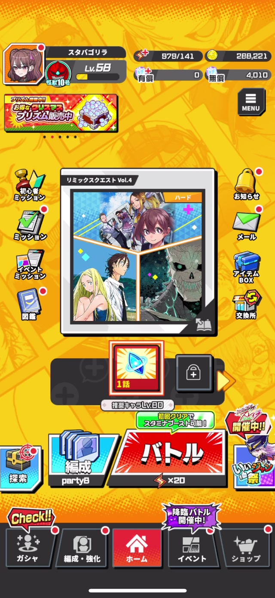
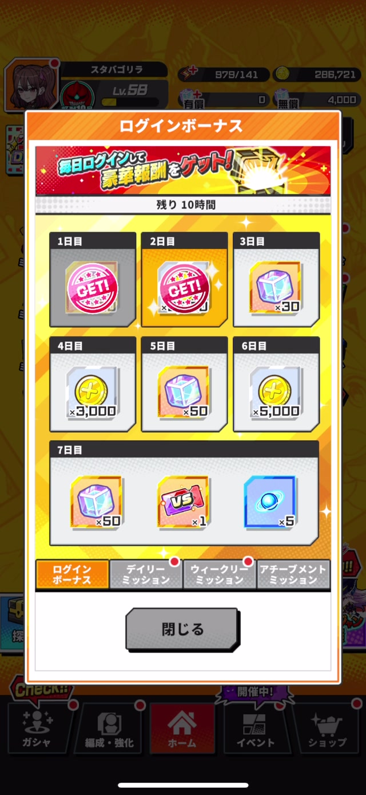
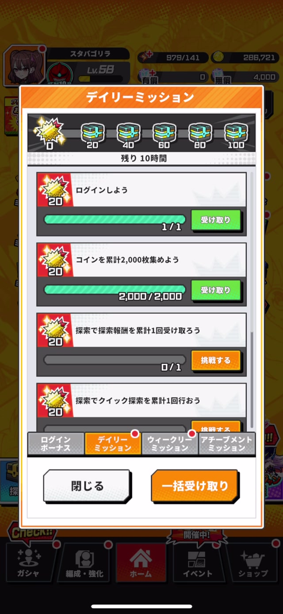
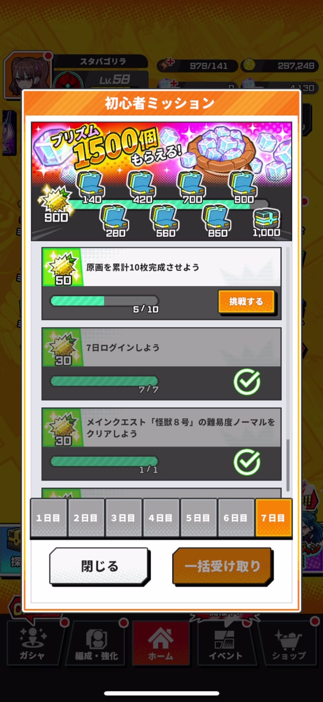
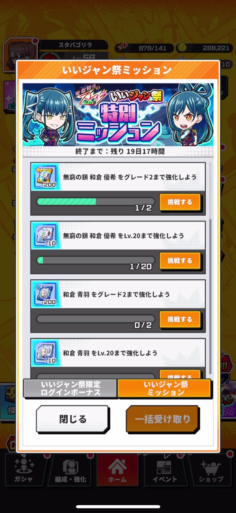
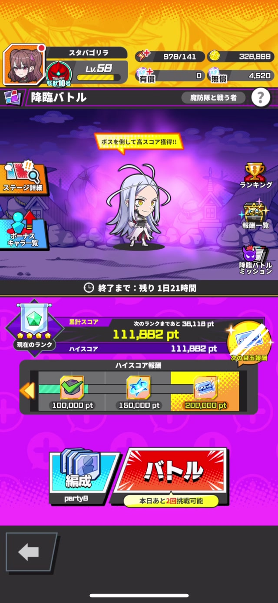

# 機能仕様書: ミッション機能

---

## 1. 機能概要・ライフサイクル概要

### 機能概要

- **機能名**: ミッション機能
- **機能ID / 管理キー**: `Mission`
- **この機能でユーザーができること**:
  - 様々な達成条件（ログイン、クエストクリア、ユニット強化など）を持つミッションに挑戦
  - ミッション達成時に報酬（プリズム、アイテム、ユニットなど）を獲得
  - デイリー/ウィークリーミッションでボーナスポイントを貯めて追加報酬を獲得
  - 初心者ミッション、イベントミッション、降臨バトルミッションなど多様なミッション種別を利用

- **想定される利用シーン**:
  - 毎日のログイン時（ログインボーナス、デイリーミッション確認）
  - ゲームプレイ後（達成したミッションの報酬受け取り）
  - イベント期間中（イベント専用ミッションへの挑戦）
  - 新規ユーザーのチュートリアル進行（初心者ミッション）

- **利用開始条件 / 解放条件**:
  - 基本的にゲーム開始直後から利用可能
  - 一部ミッション（アチーブメント、イベントミッションなど）は特定条件や期間で開放

### 機能ライフサイクル概要

ミッション機能は、**「ミッションの確認 → 挑戦 → 達成 → 報酬受け取り」**という循環的な流れを持つ。

#### 1. ミッション一覧の確認
ユーザーはホーム画面や各コンテンツ画面のミッションアイコンをタップし、ミッション一覧画面を開く。この時、サーバーから最新のミッション進捗・達成状態・報酬受け取り状態を取得する。

- **デイリー/ウィークリー/アチーブメント/初心者ミッション**: `POST /api/mission/update_and_fetch`
- **イベントミッション**: `POST /api/mission/event_update_and_fetch`
- **降臨バトルミッション**: `POST /api/mission/advent_battle_fetch`

#### 2. ミッションに挑戦
ユーザーはミッション一覧で達成条件を確認し、「挑戦する」ボタンから対象コンテンツ（クエスト、ガチャ、ユニット強化など）へ遷移してプレイする。各コンテンツでの行動により、ミッションの進捗が更新される。

#### 3. ミッション達成
達成条件を満たすと、ミッションは**「達成済み・報酬未受け取り」**状態になる。この時点で報酬は付与されず、ユーザーが明示的に受け取る必要がある（ログインボーナスは例外で自動受け取り）。

#### 4. バッジ通知
達成済みで未受け取りの報酬が1つ以上ある場合、ホーム画面や各コンテンツ画面のミッションアイコンに赤いバッジが表示される。バッジ情報は以下のタイミングで更新される:

- ホーム画面表示時
- 他の画面から戻った時
- 10秒ごとの自動更新（ホーム画面表示中）

バッジ情報取得API: `GET /api/game/badge`

#### 5. 報酬受け取り
ユーザーはバッジを見てミッション一覧を開き、「受け取り」ボタンまたは「一括受け取り」ボタンで報酬を受け取る。報酬受け取り後、ミッションは**「報酬受け取り済み」**状態になり、バッジが消える。

報酬受け取りAPI: `POST /api/mission/bulk_receive_reward`

#### 6. リセット・期間終了
- **デイリーミッション**: 毎日リセット（未達成ミッションは消失、新しいミッションが開放）
- **ウィークリーミッション**: 毎週リセット
- **ログインボーナス**: 7日間で1サイクル、達成後は次のサイクルへ
- **初心者ミッション**: 期間終了後は表示されなくなる
- **イベントミッション**: イベント期間終了後は表示されなくなる
- **アチーブメント**: 永続的（リセットなし）

---

## 2. 機能ライフサイクルと状態遷移（詳細）

### 状態一覧

| 状態 | 説明 |
|----|-------|
| **未開放** | ミッションがまだ利用できない（依存関係のあるミッション未達成、期間外など） |
| **開放済み・未達成** | ミッションが表示され、達成条件に向けて進行中（進捗0〜99%） |
| **達成済み・報酬未受け取り** | 達成条件を満たしたが、報酬をまだ受け取っていない（バッジ表示対象） |
| **報酬受け取り済み** | 報酬を受け取り完了。デイリー/ウィークリーの場合は次回リセットまで再挑戦不可 |
| **期間終了 / リセット** | イベント終了、日次/週次リセットにより初期状態に戻る（またはミッション自体が非表示） |

### 状態遷移

```text
未開放
  └─(依存ミッション達成 / 期間開始)→ 開放済み・未達成

開放済み・未達成
  └─(達成条件を満たす)→ 達成済み・報酬未受け取り

達成済み・報酬未受け取り
  └─(報酬受け取り実行)→ 報酬受け取り済み

報酬受け取り済み
  └─(日次/週次リセット / イベント終了)→ 未開放 or 開放済み・未達成
```

### 状態遷移に関与する要素

- **ユーザー操作（UI）**:
  - ミッション一覧の表示
  - 「挑戦する」ボタンタップ → 対象コンテンツへ遷移
  - 「受け取り」「一括受け取り」ボタンタップ → 報酬受け取り

- **APIの実行結果**:
  - `mission/update_and_fetch` - 進捗・達成状態の取得・更新
  - `mission/bulk_receive_reward` - 報酬受け取り
  - `mission/clear_on_call` - Webミッション達成判定
  - `game/badge` - バッジ情報取得

- **マスタデータ設定**:
  - ミッション定義（達成条件、報酬、依存関係、開放日数など）
  - ログインボーナススケジュール
  - イベント期間設定

- **時間経過 / 回数制限**:
  - デイリーミッションの日次リセット
  - ウィークリーミッションの週次リセット
  - イベント期間の開始・終了
  - 初心者ミッションの期間終了

---

## 3. 対象画面一覧

| 画面ID | 画面名 | 説明 |
|------|------|------|
| `Home` | ホーム画面 | ミッションアイコン（初心者/デイリー/イベント）からミッション画面へ遷移 |
| `MissionMain` | ミッションメイン画面 | タブ切り替えで各種ミッション（ログインボーナス/デイリー/ウィークリー/アチーブメント）にアクセス |
| `LoginBonus` | ログインボーナス画面 | 7日間のスタンプカード形式、自動受け取り |
| `DailyMission` | デイリーミッション画面 | 日次リセットのミッション一覧、ボーナスポイントゲージ |
| `WeeklyMission` | ウィークリーミッション画面 | 週次リセットのミッション一覧 |
| `AchievementMission` | アチーブメントミッション画面 | 永続的な達成目標、グループごとに段階開放 |
| `BeginnerMission` | 初心者ミッション画面 | 新規ユーザー向け期間限定ミッション、7日間の日付タブ |
| `EventMission` | イベントミッション画面 | イベント期間中のみ表示、イベント専用ミッション |
| `AdventBattleMission` | 降臨バトルミッション画面 | 降臨バトルトップ画面からアクセス |

---

## 4. 画面・UI仕様

### 4.1 ホーム画面



#### UI要素と挙動

| UI要素 | 操作 | 挙動 | 備考 |
|------|------|------|------|
| 初心者ミッションアイコン | タップ | ミッション画面（初心者ミッションタブ）へ遷移 | 受け取られていない初心者ミッション報酬がある場合、赤バッジ表示 |
| デイリーミッションアイコン | タップ | ミッション画面（デイリーミッションタブ）へ遷移 | 受け取られていないデイリーミッション報酬がある場合、赤バッジ表示 |
| イベントミッションアイコン | タップ | ミッション画面（イベントミッションタブ）へ遷移 | 受け取られていないイベントミッション報酬がある場合、赤バッジ表示 |

**バッジの更新タイミング**:
- ホーム画面表示時
- 他の画面から戻ってきた時（報酬受け取り後など）
- 10秒ごとの自動更新（ホーム画面表示中）

### 4.2 ログインボーナス画面



#### UI要素と挙動

| UI要素 | 操作 | 挙動 | 備考 |
|------|------|------|------|
| 7日間スタンプカード | - | 毎日ログインで自動達成、報酬を即座に表示 | 報酬は自動受け取り（ユーザー操作不要） |
| 閉じるボタン | タップ | ミッション画面を閉じてホーム画面へ戻る | - |

### 4.3 デイリーミッション画面



#### UI要素と挙動

| UI要素 | 操作 | 挙動 | 備考 |
|------|------|------|------|
| ボーナスポイントゲージ | - | デイリーミッション達成で貯まるポイントを表示 | ポイントが一定値に達すると宝箱報酬を開放 |
| 宝箱報酬 | タップ | ボーナスポイント報酬を受け取る | 「プリズム1500個もらえる!」等の報酬 |
| ミッション進捗ゲージ | - | 各ミッションの達成進捗を表示（例: 3/5） | - |
| 受け取りボタン | タップ | 達成済みミッションの報酬を個別に受け取る | 報酬確認ポップアップ表示 → バッジとボタン状態が自動更新 |
| 挑戦するボタン | タップ | ミッション達成に関連する画面へ遷移 | 遷移先はマスタデータ設定（QuestSelect, UnitList, Gacha等） |
| 一括受け取りボタン | タップ | 達成済みミッションをまとめて受け取る | 画面下部に配置 |
| 次回更新時刻 | - | 「残り10時間」等、リアルタイムカウントダウン | デイリーリセットまでの残り時間 |
| 閉じるボタン | タップ | ミッション画面を閉じてホーム画面へ戻る | - |

### 4.4 ウィークリーミッション画面

#### UI要素と挙動

デイリーミッション画面と同様のUI構成。違いは週次リセットである点。

### 4.5 アチーブメントミッション画面

#### UI要素と挙動

| UI要素 | 操作 | 挙動 | 備考 |
|------|------|------|------|
| ミッション一覧 | - | 永続的な達成目標を表示 | グループごとに段階的に開放（依存関係あり） |
| ボーナスポイント表示 | - | 表示なし | アチーブメントにはボーナスポイントシステムなし |
| 受け取りボタン | タップ | 達成済みミッションの報酬を受け取る | - |
| 挑戦するボタン | タップ | ミッション達成に関連する画面へ遷移 | 遷移先が `Web` の場合、外部Webサイト（ブラウザで開く） |

**Webミッション特有の挙動**:
- ブラウザで外部サイトを開く
- アプリに復帰すると自動的にミッション達成判定を実行（`POST /api/mission/clear_on_call`）

### 4.6 初心者ミッション画面



#### UI要素と挙動

| UI要素 | 操作 | 挙動 | 備考 |
|------|------|------|------|
| 7日間の日付タブ | タップ | 各日のミッション一覧を表示 | 下部に配置 |
| ボーナスポイント宝箱 | タップ | ボーナスポイント報酬を受け取る | 「プリズム1500個もらえる!」等 |
| ミッション一覧 | - | 新規ユーザー向けの期間限定ミッションを表示 | 開放日数に応じて段階的に開放 |

### 4.7 イベントミッション画面



#### UI要素と挙動

| UI要素 | 操作 | 挙動 | 備考 |
|------|------|------|------|
| イベント専用タブ | タップ | 「いいジャン祭限定ログインボーナス」と「いいジャン祭ミッション」の2タブを切り替え | イベント期間中のみ表示 |
| イベント終了までの残り時間 | - | リアルタイムカウントダウン表示 | - |
| ミッション一覧 | - | イベント専用のミッションを表示 | - |

### 4.8 降臨バトルトップ画面



#### UI要素と挙動

| UI要素 | 操作 | 挙動 | 備考 |
|------|------|------|------|
| 降臨バトルミッションアイコン | タップ | ミッション画面（降臨バトルミッション）へ遷移 | 受け取られていない降臨バトルミッション報酬がある場合、赤バッジ表示 |

**バッジの更新タイミング**:
- 降臨バトル画面表示時
- ミッション画面から戻る時（報酬受け取り後など）

### 共通UI要素

- **タブ切り替え**: ログインボーナス / デイリー / ウィークリー / アチーブメント
- **バッジ表示**: 受け取り可能な報酬があるタブに赤丸通知
- **次回更新時刻**: 「残り10時間」等、リアルタイムカウントダウン
- **一括受け取りボタン**: 達成済みミッションをまとめて受け取り
- **閉じるボタン**: ミッション画面を閉じてホーム画面へ戻る

---

## 5. 画面遷移

### ミッション画面への遷移

```text
ホーム画面
  ├─ 初心者ミッションアイコン → ミッション画面（初心者ミッションタブ）
  ├─ デイリーミッションアイコン → ミッション画面（デイリーミッションタブ）
  └─ イベントミッションアイコン → ミッション画面（イベントミッションタブ）

降臨バトル画面
  └─ 降臨バトルミッションアイコン → ミッション画面（降臨バトルミッション）
```

### タブ切り替え

```text
ミッションメイン画面
  ├─ ログインボーナスタブ → ログインボーナス画面
  ├─ デイリーミッションタブ → デイリーミッション一覧
  ├─ ウィークリーミッションタブ → ウィークリーミッション一覧
  └─ アチーブメントタブ → アチーブメント一覧
```

### ミッションからの遷移（チャレンジボタン）

各ミッションの「チャレンジする」ボタンから、達成条件に関連する画面へ遷移します。

| From | 操作 | To | 条件 |
|------|------|----|------|
| ミッション一覧 | 「挑戦する」ボタンタップ | ホーム画面 | 遷移先設定が `Home` / `StageSelect` |
| ミッション一覧 | 「挑戦する」ボタンタップ | クエスト選択画面 | 遷移先設定が `QuestSelect` |
| ミッション一覧 | 「挑戦する」ボタンタップ | ユニット一覧画面 | 遷移先設定が `UnitList` |
| ミッション一覧 | 「挑戦する」ボタンタップ | 探索画面 | 遷移先設定が `IdleIncentive` |
| ミッション一覧 | 「挑戦する」ボタンタップ | アウトポスト強化画面 | 遷移先設定が `OutpostEnhance` |
| ミッション一覧 | 「挑戦する」ボタンタップ | ガチャ画面 | 遷移先設定が `Gacha` |
| ミッション一覧 | 「挑戦する」ボタンタップ | イベント画面 | 遷移先設定が `Event` |
| ミッション一覧 | 「挑戦する」ボタンタップ | PvP画面 | 遷移先設定が `Pvp` |
| ミッション一覧 | 「挑戦する」ボタンタップ | 外部Webサイト（ブラウザ） | 遷移先設定が `Web` |

※ `Web` の場合、ブラウザからアプリに戻ると自動的にミッション達成判定を実行

### 報酬受け取り後の遷移

```text
ミッション一覧画面
  ↓ 受け取りボタンをタップ
報酬確認ポップアップ
  ↓ 閉じる
ミッション一覧画面（バッジとボタン状態が自動更新）
```

---

## 6. API仕様（利用概要）

※ APIの詳細仕様はAPI仕様書に委譲する

| API | メソッド | 用途 | 呼び出し元画面 |
|-----|--------|------|--------------|
| `/api/mission/update_and_fetch` | POST | 全ミッション種別（Achievement/DailyBonus/Daily/Weekly/Beginner）の進捗・達成状態・報酬受け取り状態を取得。ローカル通知スケジュールも更新。 | ミッションメイン画面表示時 |
| `/api/mission/event_update_and_fetch` | POST | イベントミッション（Event/EventDaily）の進捗・達成状態を取得。 | イベントミッション画面表示時 |
| `/api/mission/advent_battle_fetch` | POST | 降臨バトル関連のミッション（EventとLimitedTerm）を取得。 | 降臨バトルミッション画面表示時 |
| `/api/mission/bulk_receive_reward` | POST | 選択したミッション種別（missionType）と複数のミッションID（mstMissionIds）を指定して、達成済みミッションの報酬を一括取得。レスポンスに全報酬とボーナスポイント報酬を含む。 | 一括報酬受け取り時 |
| `/api/mission/clear_on_call` | POST | アチーブメントミッションの「Web」遷移先を持つミッションで、ユーザーがWebサイトを訪問後にアプリへ復帰した際に自動実行。サーバー側で達成判定を行う。 | Webミッション達成判定時 |
| `/api/mission/event_daily_bonus_update` | POST | イベント期間中のデイリーログインボーナスを更新・受け取り。 | イベントデイリーボーナス受け取り時 |
| `/api/game/badge` | GET | 各種ミッションの未受け取り報酬数を取得し、ホーム画面や各画面のバッジ表示を更新。ホーム画面表示時、他画面から戻った時、10秒ごとの定期更新で実行。 | バッジ情報更新時 |

### API呼び出しフロー

#### ミッション画面表示フロー

```text
ユーザーがミッション画面を開く
  ↓
API: POST /api/mission/update_and_fetch
  ↓
レスポンス：
  - usrMissionAchievements（アチーブメント進捗）
  - usrMissionDailyBonuses（ログインボーナス進捗）
  - usrMissionDailies（デイリーミッション進捗）
  - usrMissionWeeklies（ウィークリーミッション進捗）
  - usrMissionBeginners（初心者ミッション進捗）
  - usrMissionBonusPoints（ボーナスポイント状態）
  ↓
画面描画
  - ミッション一覧表示
  - バッジ表示更新
  - ボーナスポイントゲージ表示
  - 次回更新時刻表示
```

#### 報酬受け取りフロー

```text
ユーザーが「一括受け取り」ボタンをタップ
  ↓
API: POST /api/mission/bulk_receive_reward
  Body: { missionType: "Daily", mstMissionIds: ["daily_001", "daily_002", ...] }
  ↓
レスポンス：
  - missionReceiveRewards（受け取り結果、未受取理由を含む）
  - missionRewards（報酬詳細）
  - usrParameter（更新されたユーザーパラメータ）
  - usrItems（更新されたアイテム所持数）
  - usrUnits（更新されたユニット所持数）
  - userLevel（レベルアップ情報）
  ↓
報酬確認ポップアップ表示
  ↓
ボーナスポイント報酬確認（宝箱を開けた場合）
  ↓
画面再描画
  - バッジ表示更新
  - 一括受け取りボタンの状態更新
```

#### Webミッション達成判定フロー

```text
ユーザーがアチーブメントミッションの「チャレンジする」をタップ
  ↓
遷移先が "Web" の場合
  ↓
外部ブラウザでWebサイトを開く
  ↓
ユーザーがアプリに復帰
  ↓
API: POST /api/mission/clear_on_call
  Body: { missionType: "Achievement", mstMissionId: "ach_web_001" }
  ↓
レスポンス：
  - usrMissionAchievements（更新された進捗）
  ↓
画面再描画（進捗ゲージ更新）
```

#### バッジ情報更新フロー

```text
ホーム画面表示時 / 他画面から戻った時 / 10秒ごとの定期更新
  ↓
API: GET /api/game/badge
  ↓
レスポンス：
  - badges
    - unreceivedMissionRewardCount（通常ミッション未受け取り数）
    - unreceivedMissionBeginnerRewardCount（初心者ミッション未受け取り数）
    - unreceivedMissionEventRewardCounts[]（イベントごとのミッション未受け取り数）
      - mstEventId
      - count
    - unreceivedMissionAdventBattleRewardCount（降臨バトルミッション未受け取り数）
    - unopenedMessageCount（未開封メッセージ数）
  ↓
バッジ情報をキャッシュに保存
  ↓
各画面のバッジ表示を更新
  - ホーム画面：ミッションアイコンのバッジ（初心者/デイリー/イベント）
  - クエストコンテンツトップ：イベントごとのミッションバッジ
  - 降臨バトル画面：降臨バトルミッションバッジ
```

---

## 7. データ設定概要（マスタデータ）

### 基本マスタテーブル

| テーブル名 | 役割 | 主な利用箇所 |
|-----------|------|-------------|
| `MstMissionAchievement` | アチーブメントミッション定義（達成条件、報酬グループID、ソート順、遷移先） | アチーブメントミッション画面 |
| `MstMissionAchievementI18n` | アチーブメントミッションの多言語テキスト（説明文） | アチーブメントミッション画面 |
| `MstMissionAchievementDependency` | アチーブメントミッションの依存関係（グループ内の開放順序） | アチーブメントミッション画面 |
| `MstMissionDaily` | デイリーミッション定義（達成条件、ボーナスポイント、報酬グループID） | デイリーミッション画面 |
| `MstMissionDailyI18n` | デイリーミッションの多言語テキスト | デイリーミッション画面 |
| `MstMissionWeekly` | ウィークリーミッション定義 | ウィークリーミッション画面 |
| `MstMissionWeeklyI18n` | ウィークリーミッションの多言語テキスト | ウィークリーミッション画面 |
| `MstMissionBeginner` | 初心者ミッション定義（開放日数、達成条件、ボーナスポイント） | 初心者ミッション画面 |
| `MstMissionBeginnerI18n` | 初心者ミッションの多言語テキスト（タイトル、説明文） | 初心者ミッション画面 |
| `MstMissionBeginnerPromptPhraseI18n` | 初心者ミッション促進フレーズ（期間指定で表示） | 初心者ミッション画面 |

### イベントミッション用マスタテーブル

| テーブル名 | 役割 | 主な利用箇所 |
|-----------|------|-------------|
| `MstMissionEvent` | イベントミッション定義（イベントID、達成条件、カテゴリ） | イベントミッション画面 |
| `MstMissionEventI18n` | イベントミッションの多言語テキスト | イベントミッション画面 |
| `MstMissionEventDependency` | イベントミッションの依存関係 | イベントミッション画面 |
| `MstMissionEventDaily` | イベントデイリーミッション定義 | イベントミッション画面 |
| `MstMissionEventDailyI18n` | イベントデイリーミッションの多言語テキスト | イベントミッション画面 |
| `MstMissionLimitedTerm` | 期間限定ミッション定義（開始・終了日時、カテゴリ） | 降臨バトルミッション画面等 |
| `MstMissionLimitedTermDependency` | 期間限定ミッションの依存関係 | 降臨バトルミッション画面等 |
| `MstMissionLimitedTermI18n` | 期間限定ミッションの多言語テキスト | 降臨バトルミッション画面等 |

### 報酬とボーナス用マスタテーブル

| テーブル名 | 役割 | 主な利用箇所 |
|-----------|------|-------------|
| `MstMissionReward` | ミッション報酬定義（報酬グループID、リソースタイプ、リソースID、数量） | 全ミッション画面 |
| `MstMissionDailyBonus` | デイリーログインボーナス定義（ログイン日数、報酬グループID） | ログインボーナス画面 |
| `MstMissionEventDailyBonus` | イベントデイリーログインボーナス定義 | イベントミッション画面 |
| `MstMissionEventDailyBonusSchedule` | イベントデイリーログインボーナススケジュール（開始・終了日時） | イベントミッション画面 |
| `MstDailyBonusReward` | デイリーボーナス報酬定義（グループID、リソースタイプ、数量） | ログインボーナス画面 |

### カムバックボーナス用マスタテーブル

| テーブル名 | 役割 | 主な利用箇所 |
|-----------|------|-------------|
| `MstComebackBonus` | カムバックボーナス定義（ログイン日数、報酬グループID） | ログインボーナス画面（復帰ユーザー） |
| `MstComebackBonusSchedule` | カムバックボーナススケジュール（休眠条件日数、有効期間、開始・終了日時） | ログインボーナス画面（復帰ユーザー） |

---

## 8. 補足・注意事項

### 仕様上の注意点

- **ログインボーナスは自動受け取り**: 他のミッション種別と異なり、ユーザー操作なしで報酬が付与される
- **バッジ更新タイミング**: `game/badge` APIは定期的に呼ばれるが、サーバー負荷を考慮して10秒間隔に制限されている
- **Webミッション特有の挙動**: アプリ復帰時に自動でミッション達成判定が走るため、ユーザーは明示的な操作を必要としない
- **ボーナスポイントシステム**: デイリー/ウィークリー/初心者ミッションで利用され、ミッション達成時にポイントが加算される。一定ポイントで宝箱報酬を獲得可能。

### 例外ケース

- **ミッション達成条件が満たせない場合**: 達成条件に関連するコンテンツが利用不可（メンテナンス、期間外など）の場合、ミッション達成が不可能になる。この場合、サポート対応が必要。
- **報酬受け取り失敗**: ネットワークエラーやサーバーエラーにより報酬受け取りが失敗した場合、ミッションは「達成済み・報酬未受け取り」状態のままとなり、再度受け取り可能。
- **リセットタイミングの誤差**: デイリー/ウィークリーリセット時刻がサーバー時刻に依存するため、ユーザーのタイムゾーンによっては表示される残り時間にわずかな誤差が生じる場合がある。

### 将来的な拡張予定

- **ミッション種別の追加**: 新しいコンテンツや施策に応じて、新しいミッション種別を追加する可能性がある
- **依存関係の複雑化**: 現在はグループ内の線形依存関係のみだが、将来的には複数ミッションを前提条件とする複雑な依存関係を実装する可能性がある
- **ボーナスポイントシステムの拡張**: 現在のポイント加算型に加え、連続達成ボーナスやコンボシステムなどの拡張を検討

---

## 参考資料

- [ミッション画面スクリーンショット](../../raw-data/app-screen/20251227/)
- [ホーム画面](../../raw-data/app-screen/20251227/ホーム.jpg) - ミッションアイコンとバッジ表示
- [降臨バトルトップ](../../raw-data/app-screen/20251227/降臨バトルトップ.jpg) - 降臨バトルミッションアイコン
- [API定義](../../projects/glow-schema/Schema/Mission.yml)
