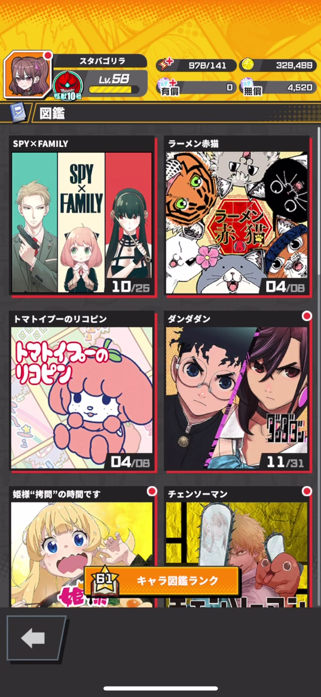
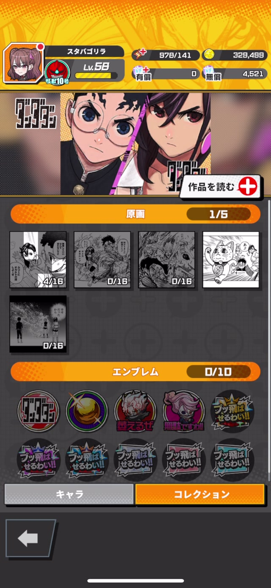
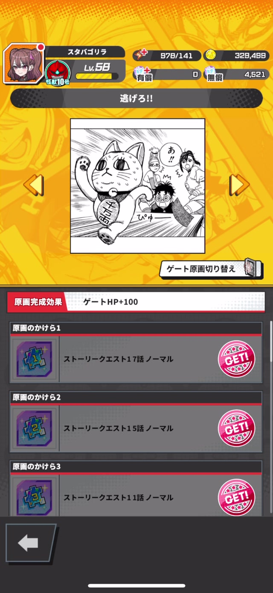
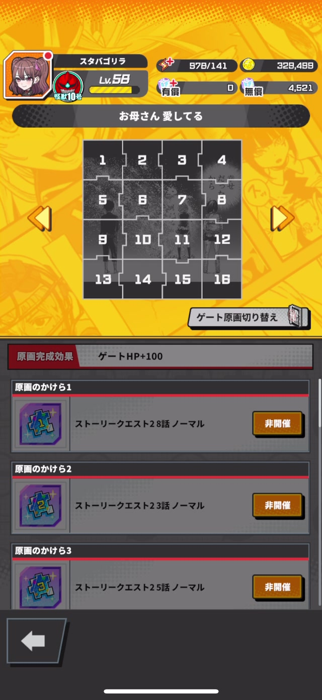

# 機能仕様書: 原画・原画のかけら機能

---

## 1. 機能概要・ライフサイクル概要

### 機能概要

- **機能名**: 原画・原画のかけら機能
- **機能ID / 管理キー**: `Artwork` / `ArtworkFragment`
- **この機能でユーザーができること**:
  - ストーリークエストをクリアして原画のかけらを収集
  - 原画のかけらを全て集めて原画を完成させる
  - 完成した原画を図鑑で閲覧
  - 原画をゲート（Outpost）に設定してゲートHPボーナスを獲得
  - 交換所で原画を直接獲得
  - 初回獲得時に無償プリズムを獲得

- **想定される利用シーン**:
  - ストーリークエストクリア時（原画のかけらがドロップ）
  - 原画のかけらが揃った時（原画完成の演出）
  - 図鑑を閲覧して収集状況を確認
  - ゲート（Outpost）の原画を変更してパーティ編成の調整
  - 交換所で原画を交換

- **利用開始条件 / 解放条件**:
  - 基本的にゲーム開始直後から利用可能
  - 原画のかけらはストーリークエストの進行に応じて獲得機会が増える
  - 各原画は対応するストーリークエストのステージに到達することで収集開始可能

### 機能ライフサイクル概要

原画機能は、**「原画のかけらの収集 → 原画完成 → 原画の閲覧・活用」**という流れを持つ。

#### 1. 原画のかけらの収集

ユーザーはストーリークエストをクリアすることで、原画のかけらを獲得できる。原画のかけらは各ステージに設定されたドロップ率に基づいて抽選され、クリア報酬として付与される。

- **ドロップ抽選**: 各原画のかけらには個別のドロップ率（0〜100%）が設定されている
- **重複獲得不可**: 既に獲得済みの原画のかけらは再度獲得しない（ドロップ抽選の対象外）
- **周回による収集**: 同じステージを繰り返しクリアすることで、未獲得の原画のかけらを収集可能
- **キャンペーン倍率**: 原画のかけらドロップ率アップキャンペーンが開催される場合がある

#### 2. 原画のかけら獲得演出

ストーリークエストクリア後、原画のかけらを獲得すると専用の獲得演出が表示される。この画面では、獲得した原画のかけらのビジュアルと、原画の完成状況（パズル形式）が表示される。

#### 3. 原画の完成

対象原画を構成する全ての原画のかけらを獲得すると、自動的に原画が完成する。原画完成時には以下が実行される：

- 原画データ（`UsrArtwork`）の生成
- 原画完成によるミッショントリガーの発動
- 図鑑の「NEW」バッジ表示

#### 4. 原画の閲覧

完成した原画は図鑑の「コレクション」タブから閲覧できる。原画詳細画面では以下が確認できる：

- 原画のビジュアル（フル表示）
- 原画の完成効果（ゲートHP+100など）
- 原画のかけら一覧と入手方法（ストーリークエストXX話/ノーマル）
- 各かけらの獲得状況（GET済み / 非開催）

#### 5. 原画のゲート設定

完成した原画は、ゲート（Outpost）に設定することができる。ゲートに原画を設定すると、設定された原画の効果（ゲートHP増加）が適用される。

- ゲート原画切り替えは、原画詳細画面から実行
- 既にゲートに設定されている原画は「設定中」として表示
- ゲートHP増加効果は、設定された原画に応じて変動

#### 6. 交換所での原画獲得

交換所機能の追加後、原画を直接報酬として配布できるようになった。交換所で原画を獲得する場合：

- 対象原画を構成する全ての原画のかけらを自動配布
- 原画データ（`UsrArtwork`）の生成
- 原画完成によるミッショントリガーの発動

#### 7. 重複獲得時の処理

既に所有している原画を再度獲得する場合（交換所やガチャなど）、原画は自動的にコインに変換される。

- 変換レート: 原画1つ = コイン（一定量）
- 初獲得分と重複分が同時に配布される場合、初獲得分は原画、重複分はコインに変換

#### 8. 初回コレクション報酬

原画を初めて獲得した際、図鑑に「NEW」バッジが表示される。このバッジをタップして報酬を受け取ると、無償プリズムが配布される。

---

## 2. 機能ライフサイクルと状態遷移（詳細）

### 状態一覧

#### 原画のかけら（ArtworkFragment）の状態

| 状態 | 説明 |
|----|----------|
| **未解放** | 原画のかけらが獲得可能なステージが未開放（前提ステージ未クリア、イベント期間外など） |
| **獲得可能** | 原画のかけらが獲得可能なステージが開放されている（ドロップ抽選対象） |
| **獲得済み** | 原画のかけらを既に獲得している（ドロップ抽選対象外） |

#### 原画（Artwork）の状態

| 状態 | 説明 |
|----|----------|
| **未完成** | 原画のかけらが不足しており、原画が完成していない状態 |
| **完成済み・未閲覧** | 原画が完成したが、図鑑でまだ閲覧していない状態（NEWバッジ表示） |
| **完成済み・閲覧済み** | 原画が完成し、図鑑で閲覧済みの状態 |
| **ゲート設定中** | 原画が完成し、現在ゲートに設定されている状態 |

### 状態遷移

#### 原画のかけらの状態遷移

```text
未解放
  └─(対象ステージ開放)→ 獲得可能

獲得可能
  └─(ステージクリア時のドロップ抽選で獲得)→ 獲得済み
```

#### 原画の状態遷移

```text
未完成
  └─(全ての原画のかけらを獲得)→ 完成済み・未閲覧

完成済み・未閲覧
  └─(図鑑で初回コレクション報酬を受け取り)→ 完成済み・閲覧済み

完成済み・閲覧済み
  └─(ゲート原画切り替え実行)→ ゲート設定中

ゲート設定中
  └─(別の原画に切り替え)→ 完成済み・閲覧済み
```

### 状態遷移に関与する要素

- **ユーザー操作（UI）**:
  - ストーリークエストのクリア
  - 図鑑の閲覧
  - 初回コレクション報酬の受け取り
  - ゲート原画切り替えボタンのタップ
  - 交換所での原画交換

- **APIの実行結果**:
  - `POST /api/stage/end` - ステージクリア時の原画のかけら獲得判定
  - `POST /api/game/update_and_fetch` または `GET /api/game/fetch` - ユーザーの原画・原画のかけら所持情報取得
  - `POST /api/encyclopedia/receive_first_collection_reward` - 初回コレクション報酬受け取り
  - `POST /api/outpost/change_artwork` - ゲート原画変更
  - `POST /api/exchange/trade` - 交換所で原画を交換

- **マスタデータ設定**:
  - 原画定義（`MstArtwork`）: 原画ID、シリーズID、ゲートHP増加量、アセットキー
  - 原画のかけら定義（`MstArtworkFragment`）: 原画のかけらID、原画ID、ドロップグループID、ドロップ率、レアリティ
  - 原画のかけら位置定義（`MstArtworkFragmentPosition`）: 原画のかけらの表示位置
  - ステージ定義（`MstStage`）: ステージごとの原画のかけらドロップグループID

- **時間経過 / 回数制限**:
  - イベント期間の開始・終了（期間限定ステージでの原画のかけらドロップ）

---

## 3. 対象画面一覧

| 画面ID | 画面名 | 説明 |
|------|------|------|
| `EncyclopediaSeries` | 図鑑シリーズ一覧画面 | 各シリーズ（作品）のコレクション進捗を表示 |
| `EncyclopediaSeriesCollection` | 図鑑コレクション画面 | シリーズ別の原画・エンブレム収集状況を表示 |
| `EncyclopediaArtworkDetail` | 原画詳細画面 | 原画のビジュアル、効果、かけら一覧を表示 |
| `ArtworkFragmentAcquisition` | 原画のかけら獲得画面 | ステージクリア後、原画のかけら獲得演出を表示 |
| `OutpostEnhance` | ゲート強化画面 | ゲートに設定する原画を選択 |
| `OutpostArtworkChangeConfirm` | ゲート原画切り替え確認画面 | ゲート原画変更の確認 |

---

## 4. 画面・UI仕様

### 4.1 図鑑シリーズ一覧画面



#### UI要素と挙動

| UI要素 | 操作 | 挙動 | 備考 |
|------|------|------|------|
| シリーズカード | タップ | 図鑑コレクション画面へ遷移（選択したシリーズのコレクションを表示） | カードに収集進捗が表示される（例：「10/25」） |
| 戻るボタン | タップ | ホーム画面へ戻る | - |

### 4.2 図鑑コレクション画面



#### UI要素と挙動

| UI要素 | 操作 | 挙動 | 備考 |
|------|------|------|------|
| 原画セクション | - | 原画の収集進捗とサムネイルを表示 | 収集進捗：「1/5」など |
| 原画サムネイル | タップ | 原画詳細画面へ遷移 | 未完成の原画は分割パズル状態で表示（例：「4/16」） |
| エンブレムセクション | - | エンブレムの収集進捗を表示 | - |
| キャラタブ | タップ | キャラ図鑑画面へ切り替え | - |
| コレクションタブ | - | 現在表示中のタブ（原画・エンブレムを表示） | - |
| 作品を読むボタン | タップ | 外部サイト（JUMP+など）へ遷移 | ブラウザで作品を閲覧 |
| 戻るボタン | タップ | 図鑑シリーズ一覧画面へ戻る | - |

### 4.3 原画詳細画面（完成済み）



#### UI要素と挙動

| UI要素 | 操作 | 挙動 | 備考 |
|------|------|------|------|
| 原画ビジュアル | - | 原画をフルサイズで表示 | 左右矢印で他の原画に切り替え可能 |
| 原画完成効果 | - | 原画の効果を表示（例：「ゲートHP+100」） | - |
| 原画のかけら一覧 | - | 原画を構成する全てのかけらをリスト表示 | 各かけらに「GET!」スタンプが表示 |
| 原画のかけらセル | タップ | 対象ステージへ遷移（未実装の可能性あり） | 入手方法（例：「ストーリークエスト17話/ノーマル」）が表示 |
| ゲート原画切り替えボタン | タップ | ゲート原画切り替え確認画面へ遷移 | 既にゲートに設定されている原画の場合は非活性 |
| 戻るボタン | タップ | 図鑑コレクション画面へ戻る | - |

### 4.4 原画詳細画面（未完成）



#### UI要素と挙動

| UI要素 | 操作 | 挙動 | 備考 |
|------|------|------|------|
| 原画ビジュアル（パズル） | - | 原画を分割パズル形式で表示（例：1〜16のマス目） | 未獲得のかけらはグレーアウト |
| 原画完成効果 | - | 原画の効果を表示（例：「ゲートHP+100」） | 未完成でも効果は確認可能 |
| 原画のかけら一覧 | - | 原画を構成する全てのかけらをリスト表示 | 未獲得のかけらには「非開催」と表示 |
| 原画のかけらセル | タップ | 対象ステージへ遷移（未開催の場合は遷移不可） | 入手方法（例：「ストーリークエスト28話/ノーマル」）が表示 |
| ゲート原画切り替えボタン | - | 未完成の場合は非表示または非活性 | - |
| 戻るボタン | タップ | 図鑑コレクション画面へ戻る | - |

### 4.5 原画のかけら獲得画面

ステージクリア後、原画のかけらを獲得した場合に表示される専用演出画面。

#### UI要素と挙動

| UI要素 | 操作 | 挙動 | 備考 |
|------|------|------|------|
| 原画のかけらビジュアル | - | 獲得した原画のかけらを表示 | アニメーション演出あり |
| 原画パズル | - | 原画の完成状況をパズル形式で表示 | 獲得したかけらがハイライト |
| 原画名 | - | 原画の名前を表示 | - |
| タップして続ける | タップ | ステージクリア結果画面へ遷移 | - |

### 4.6 ゲート強化画面

ゲートに設定する原画を選択する画面。

#### UI要素と挙動

| UI要素 | 操作 | 挙動 | 備考 |
|------|------|------|------|
| 原画一覧 | - | 完成済みの原画をリスト表示 | 現在設定中の原画にはチェックマーク表示 |
| 原画セル | タップ | ゲート原画切り替え確認画面へ遷移 | - |
| 戻るボタン | タップ | ゲート画面へ戻る | - |

### 4.7 ゲート原画切り替え確認画面

ゲート原画を変更する際の確認画面。

#### UI要素と挙動

| UI要素 | 操作 | 挙動 | 備考 |
|------|------|------|------|
| 変更前の原画 | - | 現在設定中の原画を表示 | ゲートHP増加量も表示 |
| 変更後の原画 | - | 変更後の原画を表示 | ゲートHP増加量も表示 |
| 決定ボタン | タップ | ゲート原画変更APIを実行し、ゲート強化画面へ戻る | - |
| キャンセルボタン | タップ | ゲート強化画面へ戻る | - |

---

## 5. 画面遷移

### 図鑑への遷移

```text
ホーム画面
  └─ 図鑑アイコン → 図鑑シリーズ一覧画面

図鑑シリーズ一覧画面
  └─ シリーズカードタップ → 図鑑コレクション画面

図鑑コレクション画面
  └─ 原画サムネイルタップ → 原画詳細画面
```

### 原画詳細からの遷移

```text
原画詳細画面（完成済み）
  ├─ ゲート原画切り替えボタン → ゲート原画切り替え確認画面
  └─ 原画のかけらセルタップ → 対象ステージ（クエスト選択画面）

原画詳細画面（未完成）
  └─ 原画のかけらセルタップ → 対象ステージ（クエスト選択画面）
```

### ステージクリア後の遷移

```text
ステージクリア
  ↓（原画のかけらドロップ）
原画のかけら獲得画面
  ↓ タップして続ける
ステージクリア結果画面
```

### ゲート強化画面からの遷移

```text
ゲート画面
  └─ 原画変更ボタン → ゲート強化画面

ゲート強化画面
  └─ 原画セルタップ → ゲート原画切り替え確認画面

ゲート原画切り替え確認画面
  ├─ 決定ボタン → ゲート強化画面
  └─ キャンセルボタン → ゲート強化画面
```

| From | 操作 | To | 条件 |
|------|------|----|------|
| ホーム画面 | 図鑑アイコンタップ | 図鑑シリーズ一覧画面 | - |
| 図鑑シリーズ一覧画面 | シリーズカードタップ | 図鑑コレクション画面 | - |
| 図鑑コレクション画面 | 原画サムネイルタップ | 原画詳細画面 | - |
| 原画詳細画面 | ゲート原画切り替えボタンタップ | ゲート原画切り替え確認画面 | 完成済み原画かつ未設定 |
| 原画詳細画面 | 原画のかけらセルタップ | 対象ステージ（クエスト選択画面） | 対象ステージが開放済み |
| ステージクリア | 原画のかけらドロップ | 原画のかけら獲得画面 | 原画のかけら獲得時 |
| 原画のかけら獲得画面 | タップして続ける | ステージクリア結果画面 | - |
| ゲート画面 | 原画変更ボタンタップ | ゲート強化画面 | - |
| ゲート強化画面 | 原画セルタップ | ゲート原画切り替え確認画面 | - |
| ゲート原画切り替え確認画面 | 決定ボタンタップ | ゲート強化画面 | - |

---

## 6. API仕様（利用概要）

※ APIの詳細仕様はAPI仕様書に委譲する

| API | メソッド | 用途 | 呼び出し元画面 |
|-----|--------|------|--------------|
| `/api/game/update_and_fetch` | POST | ゲーム起動時・日跨ぎ時にユーザーデータを更新して取得。`gameFetchOther.usrArtworks`と`gameFetchOther.usrArtworkFragments`にユーザーの原画・原画のかけら所持情報を含む。 | ホーム画面表示時 |
| `/api/game/fetch` | GET | ユーザーデータを取得。`gameFetchOther.usrArtworks`と`gameFetchOther.usrArtworkFragments`にユーザーの原画・原画のかけら所持情報を含む。 | 各種画面遷移時 |
| `/api/stage/end` | POST | ステージクリア時の処理。レスポンスに原画のかけら獲得情報（`stageEndResult.newUsrArtworkFragments`）と原画完成情報（`stageEndResult.newUsrArtworks`）を含む。 | ステージクリア時 |
| `/api/encyclopedia/receive_first_collection_reward` | POST | 原画・エンブレム・キャラ・敵図鑑の初回コレクション報酬（無償プリズム）を受け取る。パラメータ: `encyclopediaType`（"Artwork"など）、`encyclopediaId`（原画IDなど）。レスポンスに獲得したプリズム情報を含む。 | 原画詳細画面（初回閲覧時） |
| `/api/outpost/change_artwork` | POST | ゲートに設定する原画を変更する。パラメータ: `mstArtworkId`。レスポンスに変更後のゲートHP情報を含む。 | ゲート原画切り替え確認画面 |
| `/api/exchange/trade` | POST | 交換所でアイテムを交換する。交換対象に原画が含まれる場合、原画と全ての原画のかけらを自動配布。レスポンスに獲得した原画・原画のかけら情報を含む。 | 交換所画面 |

### API呼び出しフロー

#### ステージクリア時の原画のかけら獲得フロー

```text
ユーザーがステージをクリア
  ↓
API: POST /api/stage/end
  リクエスト: ステージID、クリアタイム、バトルログなど
  ↓
サーバー処理:
  1. ステージクリア処理（スタミナ消費、経験値・コイン配布など）
  2. 原画のかけらドロップ抽選
     - ステージに設定された原画のかけらドロップグループIDを取得
     - ドロップグループに属する全ての原画のかけらを抽選対象とする
     - 既に獲得済みの原画のかけらは抽選対象外
     - 各原画のかけらのドロップ率に基づいて抽選（キャンペーン倍率適用）
     - 抽選に成功した原画のかけらを `UsrArtworkFragment` テーブルに保存
  3. 原画完成判定
     - 新規獲得した原画のかけらが属する原画を特定
     - 対象原画の全ての原画のかけら（ドロップ設定あり）を取得
     - ユーザーが所有する原画のかけらと照合
     - 全てのかけらが揃っている場合、原画を完成させる
       - `UsrArtwork` テーブルに保存
       - ミッショントリガー発動（「原画を〇個獲得」など）
  4. ログ保存（`LogArtworkFragment`）
  ↓
レスポンス:
  - `stageEndResult.newUsrArtworkFragments`: 新規獲得した原画のかけら一覧
  - `stageEndResult.newUsrArtworks`: 新規完成した原画一覧
  - その他のクリア報酬、ユーザーステータス更新情報
  ↓
クライアント処理:
  1. 原画のかけらを獲得した場合、原画のかけら獲得画面を表示
  2. 原画が完成した場合、原画完成通知を表示（図鑑にNEWバッジ）
  3. ステージクリア結果画面へ遷移
```

#### 交換所で原画を獲得するフロー

```text
ユーザーが交換所で原画を交換
  ↓
API: POST /api/exchange/trade
  リクエスト: 交換所ID、交換回数など
  ↓
サーバー処理:
  1. 交換条件の検証（必要アイテム所持、交換回数制限など）
  2. 必要アイテムの消費
  3. 報酬配布処理
     - 報酬に原画が含まれる場合:
       a. 既に所有しているか確認
          - 未所有: 原画と全ての原画のかけらを配布
            - `grantArtworksWithFragments` メソッドを実行
            - 対象原画の全ての原画のかけらを `UsrArtworkFragment` テーブルに保存
            - 原画を `UsrArtwork` テーブルに保存
            - ミッショントリガー発動
          - 所有済み: 原画をコインに変換
            - 変換レート: EncyclopediaConstant::DUPLICATE_ARTWORK_CONVERT_COIN
  4. ログ保存
  ↓
レスポンス:
  - `exchangeTradeResult.usrArtworks`: 新規獲得した原画一覧
  - `exchangeTradeResult.usrArtworkFragments`: 新規獲得した原画のかけら一覧
  - `exchangeTradeResult.rewards`: その他の獲得報酬（コイン変換含む）
  - ユーザーステータス更新情報
  ↓
クライアント処理:
  1. 報酬確認画面を表示（獲得した原画・アイテムを表示）
  2. 図鑑にNEWバッジを表示
```

#### ゲート原画切り替えフロー

```text
ユーザーがゲート原画切り替え確認画面で「決定」をタップ
  ↓
API: POST /api/outpost/change_artwork
  リクエスト: 新しい原画のID（mstArtworkId）
  ↓
サーバー処理:
  1. 原画の所有確認（`UsrArtwork` テーブルに存在するか）
  2. ゲートに原画を設定する
  3. 変更後のゲートHP計算
     - 基礎HP + 原画のHP増加量（`MstArtwork.outpostAdditionalHp`）
  ↓
レスポンス:
  - 変更後のゲートHP情報
  ↓
クライアント処理:
  1. ゲート強化画面へ戻る
  2. ゲートHPを更新表示
```

#### 初回コレクション報酬受け取りフロー

```text
ユーザーが原画詳細画面でNEWバッジをタップ
  ↓
API: POST /api/encyclopedia/receive_first_collection_reward
  リクエスト: encyclopediaType="Artwork", encyclopediaId=原画ID
  ↓
サーバー処理:
  1. 原画の所有確認
  2. `UsrArtwork.isNewEncyclopedia` フラグを確認（1の場合のみ報酬配布）
  3. 無償プリズムを配布
     - 配布量: `MstConfig.key=ENCYCLOPEDIA_FIRST_COLLECTION_REWARD_COUNT`
  4. `UsrArtwork.isNewEncyclopedia` を 0 に更新
  ↓
レスポンス:
  - 獲得したプリズム情報
  - 更新後の `usrArtworks`
  ↓
クライアント処理:
  1. 報酬確認ポップアップ表示
  2. NEWバッジを非表示
```

---

## 7. データ設定概要（マスタデータ）

### 原画・原画のかけらマスタテーブル

| テーブル名 | 役割 | 主な利用箇所 |
|-----------|------|-------------|
| `MstSeries` | シリーズ（作品）定義（ID、Jump+URL、アセットキー） | 図鑑シリーズ一覧画面 |
| `MstSeriesI18n` | シリーズの多言語テキスト（名前、接頭辞） | 図鑑シリーズ一覧画面 |
| `MstArtwork` | 原画定義（ID、シリーズID、ゲートHP増加量、アセットキー、ソート順） | 原画詳細画面、ゲート設定 |
| `MstArtworkI18n` | 原画の多言語テキスト（名前、説明文） | 原画詳細画面 |
| `MstArtworkFragment` | 原画のかけら定義（ID、原画ID、ドロップグループID、ドロップ率、レアリティ、アセット番号） | ステージクリア時のドロップ抽選 |
| `MstArtworkFragmentI18n` | 原画のかけらの多言語テキスト（名前） | 原画詳細画面 |
| `MstArtworkFragmentPosition` | 原画のかけらの表示位置（ID、原画のかけらID、位置番号） | 原画詳細画面のパズル表示 |

### ステージマスタテーブル

| テーブル名 | 役割 | 主な利用箇所 |
|-----------|------|-------------|
| `MstStage` | ステージ定義（原画のかけらドロップグループIDを含む） | ステージクリア時の原画のかけらドロップ抽選 |

### ユーザーデータテーブル

| テーブル名 | 役割 | 主な利用箇所 |
|-----------|------|-------------|
| `UsrArtwork` | ユーザーが所有する原画（原画ID、初回閲覧フラグ） | 図鑑画面、ゲート設定 |
| `UsrArtworkFragment` | ユーザーが所有する原画のかけら（原画ID、原画のかけらID） | 原画完成判定、ドロップ抽選 |

### ログテーブル

| テーブル名 | 役割 | 主な利用箇所 |
|-----------|------|-------------|
| `LogArtworkFragment` | 原画のかけら獲得ログ（ユーザーID、原画のかけらID、獲得元コンテンツタイプ、獲得元ID、原画完成フラグ） | 運営分析 |

### 設定マスタテーブル

| テーブル名 | 役割 | 主な利用箇所 |
|-----------|------|-------------|
| `MstConfig` | 各種設定値（`ENCYCLOPEDIA_FIRST_COLLECTION_REWARD_COUNT`など） | 初回コレクション報酬配布 |

---

## 8. 補足・注意事項

### 仕様上の注意点

- **原画のかけらは重複獲得不可**: 既に獲得済みの原画のかけらは、ドロップ抽選の対象外となる。同じステージを繰り返しクリアしても、未獲得の原画のかけらのみが抽選される。
- **原画完成は自動**: 全ての原画のかけらが揃った時点で、自動的に原画が完成する。ユーザーが明示的に「完成」操作を行う必要はない。
- **交換所での原画配布**: 交換所で原画を報酬として配布する場合、対象原画を構成する全ての原画のかけらも同時に自動配布される。これにより、原画を直接獲得した場合でも、図鑑上で原画のかけらが全て「GET」状態になる。
- **重複原画のコイン変換**: 既に所有している原画を再度獲得する場合（交換所、ガチャなど）、原画は自動的にコインに変換される。変換レートは `EncyclopediaConstant::DUPLICATE_ARTWORK_CONVERT_COIN` で定義される。
- **ドロップ率キャンペーン**: 原画のかけらドロップ率アップキャンペーンが開催される場合、キャンペーン倍率がドロップ率に適用される。ただし、最大ドロップ率は100%に制限される。
- **非ドロップのかけら**: 一部の原画のかけらは `dropGroupId` が未設定（ドロップ対象外）の場合がある。これらのかけらは、交換所や特殊報酬でのみ獲得可能で、ステージクリア時のドロップ抽選には含まれない。原画完成判定では、ドロップ対象の原画のかけらのみが判定に使用される。
- **初回コレクション報酬**: 原画を初めて獲得した際、図鑑に「NEW」バッジが表示される。このバッジをタップして報酬を受け取ると、無償プリズムが配布される。報酬は1回のみ受け取り可能で、`UsrArtwork.isNewEncyclopedia` フラグで管理される。

### 例外ケース

- **原画のかけらドロップ抽選で全て外れる場合**: ドロップ率が低い場合、ステージクリア時に原画のかけらが1つも獲得できない場合がある。この場合、原画のかけら獲得画面は表示されず、通常のステージクリア結果画面へ遷移する。
- **期間限定ステージでの原画のかけら**: イベント期間中のみ開放されるステージで原画のかけらが設定されている場合、イベント終了後は該当ステージが非開放となり、原画のかけらの獲得機会が失われる。この場合、原画詳細画面で「非開催」と表示される。

### 将来的な拡張予定

- **原画の効果拡張**: 現在はゲートHP増加のみだが、将来的には攻撃力増加や特殊効果（スキルクールタイム短縮など）が追加される可能性がある。

---

## 参考資料

- [図鑑画面スクリーンショット](../../raw-data/app-screen/20251227/)
- [図鑑シリーズ一覧](../../raw-data/app-screen/20251227/図鑑.jpg)
- [図鑑コレクション画面](../../raw-data/app-screen/20251227/図鑑_ダンダダン_コレクション.jpg)
- [原画詳細画面（完成済み）](../../raw-data/app-screen/20251227/図鑑_ダンダダン_原画_完成済.jpg)
- [原画詳細画面（未完成）](../../raw-data/app-screen/20251227/図鑑_ダンダダン_原画_未完成.jpg)
- [API定義](../../projects/glow-schema/Schema/Encyclopedia.yml)
- [クライアント実装](../../projects/glow-client/Assets/GLOW/Scripts/Runtime/)
  - [原画のかけら獲得画面](../../projects/glow-client/Assets/GLOW/Scripts/Runtime/Scenes/ArtworkFragmentAcquisition/)
  - [原画詳細画面](../../projects/glow-client/Assets/GLOW/Scripts/Runtime/Scenes/EncyclopediaArtworkDetail/)
  - [図鑑シリーズ画面](../../projects/glow-client/Assets/GLOW/Scripts/Runtime/Scenes/EncyclopediaSeries/)
- [サーバー実装](../../projects/glow-server/api/app/Domain/)
  - [原画配布サービス](../../projects/glow-server/api/app/Domain/Reward/Services/ArtworkSendService.php)
  - [原画完成サービス](../../projects/glow-server/api/app/Domain/Encyclopedia/Services/EncyclopediaService.php)
  - [ステージクリア処理](../../projects/glow-server/api/app/Domain/Stage/Services/StageEndQuestService.php)
