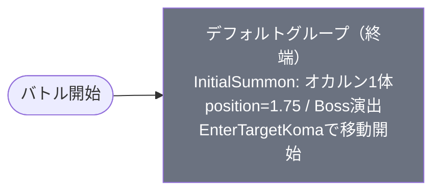

# event_dan1_1day_00001 インゲームデータ詳細解説

> 参照リポジトリ: `projects/glow-masterdata`
> リリースキー: 202510020
> 本ファイルはMstAutoPlayerSequenceが1行のイベントクエスト（1dayクエスト）の全データ設定を解説する

---

## 概要

**イベントクエスト・1dayイベント（段ボール箱人・第1弾）**（砦破壊型・毎日1回クリア型）。

- 砦のHP: `500` でダメージ有効（非常に低い砦HP・即時破壊想定）
- BGM: `SSE_SBG_003_002`
- グループ: デフォルトのみ（1グループ構成・終端グループ）
- 使用する敵の種類: 1種類（`c_dan_00001_1d1c_Normal_Colorless` オカルン）
- 特徴的なルール: **召喚移動開始トリガー**あり（`EnterTargetKoma` で最初のコマに到達したとき移動開始）
- 毎日1回クリアして「プリズム」を獲得する短期デイリークエスト

---

## 関連テーブル設定

### MstInGame

| カラム | 値 |
|--------|-----|
| `id` | `event_dan1_1day_00001` |
| `mst_auto_player_sequence_set_id` | `event_dan1_1day_00001` |
| `bgm_asset_key` | `SSE_SBG_003_002` |
| `boss_bgm_asset_key` | （空） |
| `loop_background_asset_key` | （空） |
| `player_outpost_asset_key` | （空） |
| `mst_page_id` | `event_dan1_1day_00001` |
| `mst_enemy_outpost_id` | `event_dan1_1day_00001` |
| `mst_defense_target_id` | （空） |
| `boss_mst_enemy_stage_parameter_id` | `1` |
| `boss_count` | （空） |
| `normal_enemy_hp_coef` | `1.0` |
| `normal_enemy_attack_coef` | `1.0` |
| `normal_enemy_speed_coef` | `1` |
| `boss_enemy_hp_coef` | `1.0` |
| `boss_enemy_attack_coef` | `1.0` |
| `boss_enemy_speed_coef` | `1` |
| `release_key` | `202510020` |

### MstEnemyOutpost（敵砦）

| カラム | 値 | 意味 |
|--------|-----|------|
| `id` | `event_dan1_1day_00001` | |
| `hp` | `500` | 非常に低い砦HP（一撃で破壊可能なレベル） |
| `is_damage_invalidation` | （空） | **ダメージ有効**（砦破壊型） |
| `outpost_asset_key` | （空） | |
| `artwork_asset_key` | `event_dan_0001` | 背景アートワーク |
| `release_key` | `202510020` | |

### MstPage + MstKomaLine（コマフィールド）

2行構成。

```
row=1  height=0.55  layout=2.0  （2コマ: 0.6, 0.4）
  koma1: glo_00011  width=0.6  effect=None（全対象）
  koma2: glo_00011  width=0.4  effect=None（全対象）

row=2  height=0.55  layout=3.0  （2コマ: 0.4, 0.6）
  koma1: glo_00011  width=0.4  effect=None（全対象）
  koma2: glo_00011  width=0.6  effect=None（全対象）
```

> **コマ効果の補足**: 全コマが `effect=None`（コマ効果なし）であり、暗闇や属性ブーストなどのギミックは一切存在しない。背景アセット `glo_00011` で統一されたシンプルな2行フィールド構成。1dayクエストとして余計なギミックを排除したクリーンな設計。

### MstInGameI18n（バトル説明文）

**result_tips（バトルヒント）:**
> キャラを召喚すると敵が動き始めるぞ!
> 最初にリーダーPを貯めてからキャラを召喚してみよう!

**description（ステージ説明）:**
> 【属性情報】
> 無属性の『オカルン』が登場するぞ!
>
> このステージでは、キャラを召喚すると『オカルン』が動き始めるぞ!
>
> 毎日1回クエストをクリアして、「プリズム」をGETしよう!

---

## 使用する敵パラメータ（MstEnemyStageParameter）一覧

1種類の敵パラメータを使用。`c_` プレフィックスはキャラ個別ID。
IDの命名規則: `c_{キャラID}_{コンテンツID}_{kind}_{color}`

### カラム解説

| カラム名（略称） | DBカラム名 | 説明 |
|---------------|-----------|------|
| id | id | MstEnemyStageParameterの主キー |
| 日本語名 | — | MstEnemyCharacterI18nから取得 |
| キャラID | mst_enemy_character_id | 紐付くキャラモデル・スキルの参照元 |
| kind | character_unit_kind | `Normal`（通常敵）/ `Boss`（ボス）。UIオーラ表示に影響 |
| role | role_type | 属性相性の役職（Attack/Technical/Defense/Support） |
| color | color | 属性色（Red/Yellow/Green/Blue/Colorless） |
| sort_order | sort_order | ゲーム内表示順 |
| base_hp | hp | ベースHP（`enemy_hp_coef` 乗算前の素値） |
| base_atk | attack_power | ベース攻撃力（`enemy_attack_coef` 乗算前の素値） |
| base_spd | move_speed | 移動速度（数値が大きいほど速い） |
| well_dist | well_distance | 攻撃射程（コマ単位） |
| combo | attack_combo_cycle | 攻撃コンボ数（1=単発） |
| knockback | damage_knock_back_count | 被攻撃時ノックバック回数（0=ノックバックなし） |
| ability | mst_unit_ability_id1 | 特殊アビリティID |
| drop_bp | drop_battle_point | 基本ドロップバトルポイント |

### 全1種類の詳細パラメータ

| MstEnemyStageParameter ID | 日本語名 | キャラID | kind | role | color | sort | base_hp | base_atk | base_spd | well_dist | combo | knockback | ability | drop_bp |
|--------------------------|---------|---------|------|------|-------|------|---------|---------|---------|-----------|-------|-----------|---------|---------|
| `c_dan_00001_1d1c_Normal_Colorless` | オカルン | `chara_dan_00001` | Normal | Defense | Colorless | 1 | 30,000 | 100 | 20 | 0.15 | 4 | 1 | （空） | 1,000 |

> **実際のHP・ATKは `base × MstAutoPlayerSequence.enemy_hp_coef` で決まる。**
> 例: オカルン デフォルトグループ hp倍1 → 実HP `30,000 × 1 = 30,000`

### 敵パラメータの特性解説

| 比較項目 | オカルン |
|---------|---------|
| kind | Normal（通常敵扱い） |
| role | Defense（防御型） |
| base_hp | 30,000（高い） |
| base_atk | 100 |
| base_spd | 20（低速） |
| well_dist | 0.15（短射程） |
| combo | 4（4連コンボ） |
| knockback | 1回 |
| aura_type | Boss（オーラ演出あり） |

**設計上の特徴**:
- `kind=Normal` だがシーケンスの `aura_type=Boss` が設定されており、ボスオーラ演出を持つ特別な敵として見せている。`character_unit_kind` と `aura_type` を組み合わせることで、見た目上はボスのように見せながら仕組み上は通常敵として扱う設計。
- `move_speed=20` と非常に低速。砦への到達まで十分な時間があり、プレイヤーがリーダーPを貯める猶予を与えている。result_tipsで「最初にリーダーPを貯めてからキャラを召喚してみよう!」と案内しているのはこの遅い移動速度が前提。
- `base_hp=30,000` は1day向けとしては高めの数値だが、砦HP=500という超低設定により、オカルンが砦に到達する前に砦が少しのダメージで崩壊するため、実質的な難易度は低い。
- `drop_battle_point=1,000` はメインクエスト系（100）と比べて10倍高く設定されており、イベント報酬コンテンツとしての価値を示している。

---

## グループ構造の全体フロー（Mermaid）



> **Mermaid スタイルカラー規則**:
> - デフォルトグループ: `#6b7280`（グレー）
>
> **注意**: このコンテンツはデフォルトグループのみ（グループ切り替えなし）の最シンプルな構成。1dayクエストとして意図的にフロー複雑化を排除した設計。

---

## 全1行の詳細データ（グループ単位）

### デフォルトグループ（elem 1、終端グループ）

バトル開始時から動作する唯一のグループ。`InitialSummon` でオカルンが1体配置され、プレイヤーがキャラを召喚してターゲットコマ番号0に入ると移動開始する（`move_start_condition_type = EnterTargetKoma`）。groupchange行なしの終端グループ。

| id | elem | 条件 | action_type | action_value | 召喚数 | interval | position | aura | hp倍 | atk倍 | spd倍 | override_bp | defeated_score | 移動開始条件 |
|----|------|------|-------------|--------------|--------|----------|---------|------|------|------|------|------------|----------------|------------|
| event_dan1_1day_00001_1 | 1 | InitialSummon(1) | SummonEnemy | c_dan_00001_1d1c_Normal_Colorless | 1 | 0 | 1.75 | Boss | 1 | 1 | 1 | （空） | 0 | EnterTargetKoma(0) |

**ポイント:**
- `InitialSummon(1)` はバトル開始時の初期配置トリガー。condition_valueの`1`は初期召喚グループ識別番号。
- `position=1.75` はフィールドの中央やや手前の位置に配置されることを意味する。
- `move_start_condition_type = EnterTargetKoma`、`move_start_condition_value = 0` は「プレイヤーキャラがコマ0番目（最初のコマ）に入ったとき移動開始」を意味する。バトル開始直後は静止しており、プレイヤーが最初のキャラを召喚して前進させたタイミングで初めてオカルンが動き始める。
- `aura=Boss` が設定されているため、`kind=Normal` にもかかわらずボスオーラ演出で登場する。
- `enemy_hp_coef=1`（MstAutoPlayerSequence側）かつ `normal_enemy_hp_coef=1.0`（MstInGame側）で全倍率が1倍。`base_hp=30,000` がそのまま実HPとなる。
- `override_drop_battle_point` は未設定のため、MstEnemyStageParameterの `drop_battle_point=1,000` が使用される。

---

## グループ切り替えまとめ表

| 切り替え | 条件 | 遷移先 |
|---------|------|--------|
| （なし） | — | — |

このコンテンツにはグループ切り替えが存在しない。デフォルトグループが唯一のグループであり、オカルン1体を撃破すれば終了となる。

各グループで倒すべき目安:
- デフォルト: 1体（オカルンを撃破するとバトル終了）

> **補足**: 1dayクエストとして「毎日1回クリアしてプリズムを獲得」という目的から、バトルは1体の敵を倒すだけのシンプルな設計になっている。複雑なウェーブ構成を排除することで、デイリー消化の負担を最小化している。

---

## スコア体系

バトルポイントは `override_drop_battle_point` が設定されていない場合、MstEnemyStageParameterの `drop_battle_point` が使用される。

| 敵の種類 | override_bp（設定値） | base drop_bp | 備考 |
|---------|---------------------|--------------|------|
| オカルン | （空・未設定） | 1,000 | デフォルトグループのみ（全体で1体のみ） |

- 全行の `defeated_score` は `0`（リザルト画面スコア表示なし）
- `override_drop_battle_point` は未設定のため、`drop_battle_point = 1,000` が撃破時に獲得される
- 1dayクエストはスコア競争ではなく「クリア報酬（プリズム）の獲得」が目的のため、スコア体系はシンプル
- メインクエスト（drop_bp=100）の10倍のバトルポイントが設定されており、イベントクエストとしての報酬価値を示している

---

## この設定から読み取れる設計パターン

### 1. 召喚トリガー移動開始による「準備時間」の保証

`move_start_condition_type = EnterTargetKoma(0)` という設定により、プレイヤーが最初のキャラを召喚してコマ0に入るまでオカルンが静止する。これは result_tips の「最初にリーダーPを貯めてからキャラを召喚してみよう!」という案内と完全に対応している。バトルシステムの学習（リーダーP蓄積 → タイミング良く召喚）を自然に促すチュートリアル的な設計。

### 2. 砦HP=500 という超低設定による即時クリア設計

砦HPが `500` と通常のイベントクエスト（100,000 程度）と比べて200分の1程度しかない。一方でオカルンの `base_hp=30,000` は高めに設定されており、「砦を守るのではなくオカルンを倒すゲーム」として機能させている。実質的な勝利条件は「オカルンを撃破する」ことであり、砦はほぼ形式的な存在。

### 3. kind=Normal × aura=Boss の組み合わせによる演出設計

MstEnemyStageParameterの `character_unit_kind=Normal` に対し、MstAutoPlayerSequenceの `aura_type=Boss` を設定することで、ゲームシステム上は「通常敵」として扱いながら見た目上はボスオーラで登場させる。IPコラボキャラクター（オカルン）を印象的に演出するための技法。

### 4. 最小構成（1グループ・1行）による確実な毎日消化

MstAutoPlayerSequenceが1行のみという最小構成は、1dayクエストの運用思想を体現している。グループ切り替えなし・ウェーブなし・ギミックなしのシンプル設計により、プレイヤーが毎日数十秒以内にクリアできるよう設計されている。コマフィールドも2行・全コマ効果なしと最小化。

### 5. drop_battle_point=1,000 によるイベント報酬の差別化

通常マスタ系コンテンツの `drop_bp=100` に対して10倍の `1,000` を設定することで、1dayイベントとしての報酬価値を明示している。バトルポイントは「プリズム」などのイベント通貨換算に使われるため、毎日クリアするモチベーションとして機能する。

### 6. 無属性（Colorless）敵による属性フリーな設計

オカルンが `color=Colorless`（無属性）のため、プレイヤーはどの属性のキャラを使っても属性相性ペナルティを受けない。毎日プレイするデイリーコンテンツとして、デッキ選択に制約を課さないフレンドリーな設計。新規プレイヤーでも自分の手持ちキャラで無難にクリアできるよう配慮されている。
