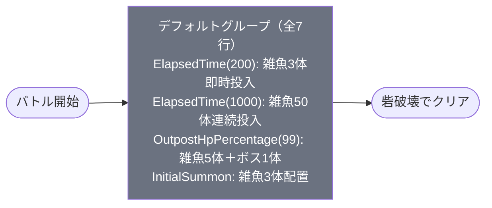

# event_dan1_challenge01_00001 インゲームデータ詳細解説

> 参照リポジトリ: `projects/glow-masterdata`
> リリースキー: 202510020
> 本ファイルはMstAutoPlayerSequenceが7行のイベントチャレンジクエストの全データ設定を解説する

---

## 概要

**イベントチャレンジクエスト（dan1シリーズ・チャレンジ01）**（砦破壊型）。

- 砦のHP: 40,000 でダメージ有効（`is_damage_invalidation` = 空）
- BGM: `SSE_SBG_003_001`（通常）/ `SSE_SBG_003_004`（ボス）
- グループ: デフォルトのみ（グループ切り替えなし）
- 使用する敵の種類: 2種類（`Normal_Blue`雑魚 + `Boss_Blue`ボス）
- スピードアタックルールあり（早クリアで報酬獲得）
- 青属性の敵が登場するため、黄属性キャラが有利

---

## 関連テーブル設定

### MstInGame

| カラム | 値 |
|--------|-----|
| `id` | `event_dan1_challenge01_00001` |
| `mst_auto_player_sequence_set_id` | `event_dan1_challenge01_00001` |
| `bgm_asset_key` | `SSE_SBG_003_001` |
| `boss_bgm_asset_key` | `SSE_SBG_003_004` |
| `loop_background_asset_key` | （空） |
| `player_outpost_asset_key` | （空） |
| `mst_page_id` | `event_dan1_challenge01_00001` |
| `mst_enemy_outpost_id` | `event_dan1_challenge01_00001` |
| `mst_defense_target_id` | （空） |
| `boss_mst_enemy_stage_parameter_id` | `1`（直接参照なし） |
| `boss_count` | （空） |
| `normal_enemy_hp_coef` | `1.0` |
| `normal_enemy_attack_coef` | `1.0` |
| `normal_enemy_speed_coef` | `1` |
| `boss_enemy_hp_coef` | `1.0` |
| `boss_enemy_attack_coef` | `1.0` |
| `boss_enemy_speed_coef` | `1` |
| `release_key` | `202510020` |

### MstEnemyOutpost（敵砦）

| カラム | 値 | 意味 |
|--------|-----|------|
| `id` | `event_dan1_challenge01_00001` | |
| `hp` | `40,000` | 砦のHP（破壊目的の目標値） |
| `is_damage_invalidation` | （空） | **ダメージ有効**（砦を壊せる） |
| `artwork_asset_key` | `dan_0001` | 背景アートワーク（danシリーズ） |
| `release_key` | `202510020` | |

### MstPage + MstKomaLine（コマフィールド）

3行構成（row=1〜3）。

```
row=1  height=0.55  layout=2.0  (2コマ: 幅0.6 + 幅0.4)
  koma1: dan_00007  width=0.6  offset=-1.0  effect=None
  koma2: dan_00007  width=0.4  offset=-1.0  effect=None

row=2  height=0.55  layout=1.0  (1コマ: 幅1.0)
  koma1: dan_00007  width=1.0  offset=-0.4  effect=None

row=3  height=0.55  layout=3.0  (2コマ: 幅0.4 + 幅0.6)
  koma1: dan_00007  width=0.4  offset=0.3  effect=None
  koma2: dan_00007  width=0.6  offset=0.3  effect=None
```

> **コマ効果の補足**: 全コマ `effect=None` でコマ効果なし。アセットキーは `dan_00007` でdanシリーズ統一背景を使用。

### MstInGameI18n（バトル説明文）

**result_tips（バトルヒント）:**
> 黄属性のキャラを編成してみよう!

**description（ステージ説明）:**
> 【属性情報】
> 青属性の敵が登場するので黄属性のキャラは有利に戦うこともできるぞ!
>
> また、このステージではスピードアタックルールがあるぞ!
> 早くクリアすると報酬ゲット!

---

## 使用する敵パラメータ（MstEnemyStageParameter）一覧

2種類の敵パラメータを使用。`e_` プレフィックスは汎用敵IDを示す。
IDの命名規則: `e_{キャラID}_{コンテンツID}_{kind}_{color}`

### カラム解説

| カラム名（略称） | DBカラム名 | 説明 |
|---------------|-----------|------|
| id | id | MstEnemyStageParameterの主キー |
| キャラID | mst_enemy_character_id | 紐付くキャラモデル・スキルの参照元 |
| kind | character_unit_kind | `Normal`（通常敵）/ `Boss`（ボス）。UIオーラ表示に影響 |
| role | role_type | 属性相性の役職（Attack/Technical/Defense/Support） |
| color | color | 属性色（Red/Yellow/Green/Blue/Colorless） |
| sort_order | sort_order | ゲーム内表示順 |
| base_hp | hp | ベースHP（`enemy_hp_coef` 乗算前の素値） |
| base_atk | attack_power | ベース攻撃力（`enemy_attack_coef` 乗算前の素値） |
| base_spd | move_speed | 移動速度（数値が大きいほど速い） |
| well_dist | well_distance | 攻撃射程（コマ単位） |
| combo | attack_combo_cycle | 攻撃コンボ数（1=単発） |
| knockback | damage_knock_back_count | 被攻撃時ノックバック回数 |
| ability | mst_unit_ability_id1 | 特殊アビリティID |
| drop_bp | drop_battle_point | 基本ドロップバトルポイント |

### 全2種類の詳細パラメータ

| MstEnemyStageParameter ID | 日本語名 | キャラID | kind | role | color | sort | base_hp | base_atk | base_spd | well_dist | combo | knockback | ability | drop_bp |
|--------------------------|---------|---------|------|------|-------|------|---------|---------|---------|-----------|-------|-----------|---------|---------|
| `e_dan_00001_dan1challenge_Normal_Blue` | セルポ星人 | `enemy_dan_00001` | Normal | Attack | Blue | 24 | 10,000 | 100 | 28 | 0.23 | 1 | 3 | （空） | 100 |
| `e_dan_00201_dan1challenge_Boss_Blue` | ターボババア | `enemy_dan_00201` | Boss | Attack | Blue | 31 | 10,000 | 100 | 55 | 0.25 | 1 | 2 | （空） | 200 |

> **実際のHP・ATKは `base × MstAutoPlayerSequence.enemy_hp_coef` で決まる。**
> このコンテンツでは雑魚: hp_coef=1.3・atk_coef=3.2、ボス: hp_coef=13・atk_coef=5.5 が適用される。

### 敵パラメータの特性解説

| 項目 | セルポ星人（雑魚） | ターボババア（ボス） |
|------|-------------------|------------------|
| 実際のHP | 10,000 × 1.3 = **13,000** | 10,000 × 13 = **130,000** |
| 実際のATK | 100 × 3.2 = **320** | 100 × 5.5 = **550** |
| 移動速度 | 28（低速） | 55（高速、雑魚の約2倍） |
| ノックバック | 3回 | 2回 |
| 特徴 | 大量出現（最大50体）・ノックバックしやすい | 強力なHP・高速移動・初期配置なし |

ボス（ターボババア）は雑魚の10倍のhp_coefが設定されており、砦HP（40,000）の3.25倍のHPを持つ高耐久型。初期配置ではなく砦HPが99%以下になった瞬間に登場するため、砦を1ダメージ与えただけで出現する設計となっている。

---

## グループ構造の全体フロー（Mermaid）

このコンテンツはグループ切り替え（groupchange行）が存在しないシンプルな**デフォルトグループのみ**の構成。



> **Mermaid スタイルカラー規則**:
> - デフォルトグループ: `#6b7280`（グレー）
> - グループ切り替えなしのため、デフォルトグループのみ表示

---

## 全7行の詳細データ（グループ単位）

### デフォルトグループ（sequence_group_id=空、elem 1〜7）

グループ切り替えなし。バトル開始からクリアまで全7行のシーケンスで構成。前半2行はタイマートリガー、後半5行は砦HP条件と初期配置で制御。

| id | elem | 条件 | アクション | 召喚数 | interval | aura | hp倍 | atk倍 | override_bp | 説明 |
|----|------|------|-----------|--------|---------|------|------|------|------------|------|
| `event_dan1_challenge01_00001_1` | 1 | `ElapsedTime(200)` | `SummonEnemy` `e_dan_00001_dan1challenge_Normal_Blue` | 3 | 200 | Default | 1.3 | 3.2 | （空） | バトル開始から2秒後に雑魚3体を200ms間隔で投入 |
| `event_dan1_challenge01_00001_2` | 2 | `ElapsedTime(1000)` | `SummonEnemy` `e_dan_00001_dan1challenge_Normal_Blue` | 50 | 800 | Default | 1.3 | 3.2 | （空） | バトル開始から10秒後に雑魚50体を800ms間隔で連続投入 |
| `event_dan1_challenge01_00001_3` | 3 | `OutpostHpPercentage(99)` | `SummonEnemy` `e_dan_00001_dan1challenge_Normal_Blue` | 5 | 500 | Default | 1.3 | 3.2 | （空） | 砦HP99%以下（1ダメージ）で雑魚5体を500ms間隔で投入 |
| `event_dan1_challenge01_00001_4` | 4 | `OutpostHpPercentage(99)` | `SummonEnemy` `e_dan_00201_dan1challenge_Boss_Blue` | 1 | 0 | Default | 13 | 5.5 | （空） | 砦HP99%以下でボス1体を即時投入（elem3と同条件・並行） |
| `event_dan1_challenge01_00001_5` | 5 | `InitialSummon(1)` | `SummonEnemy` `e_dan_00001_dan1challenge_Normal_Blue` | 1 | 0 | Default | 1.3 | 3.2 | （空） | 初期配置・優先度1：コマ0番目(0.75位置)に雑魚1体を配置、コマ0入場でEnterTargetKoma |
| `event_dan1_challenge01_00001_6` | 6 | `InitialSummon(2)` | `SummonEnemy` `e_dan_00001_dan1challenge_Normal_Blue` | 1 | 0 | Default | 1.3 | 3.2 | （空） | 初期配置・優先度2：コマ1番目(1.25位置)に雑魚1体を配置、コマ1入場でEnterTargetKoma |
| `event_dan1_challenge01_00001_7` | 7 | `InitialSummon(2)` | `SummonEnemy` `e_dan_00001_dan1challenge_Normal_Blue` | 1 | 0 | Default | 1.3 | 3.2 | （空） | 初期配置・優先度2：コマ1番目(1.66位置)に雑魚1体を配置、コマ1入場でEnterTargetKoma（elem6と同位置・2体配置） |

**ポイント:**
- elem 1: `ElapsedTime(200)` = 2,000ms = 2秒後に3体。序盤の即時プレッシャー。
- elem 2: `ElapsedTime(1000)` = 10,000ms = 10秒後に50体。間隔800ms（8秒）で投入するため、50体全部出終わるまで最大で10秒 + 49 × 8秒 = 402秒かかる設計だが、砦を削れば自動終了。
- elem 3＋4: `OutpostHpPercentage(99)` で砦に1ダメージが入った瞬間（実質バトル開始直後）にボスと追加雑魚が同時出現。
- elem 5〜7: `InitialSummon` は `summon_position` と `move_start_condition_type=EnterTargetKoma` の組み合わせ。プレイヤーが特定コマに入った瞬間に移動開始する「待機型」の敵配置。

---

## グループ切り替えまとめ表

このコンテンツにはグループ切り替え（`SwitchSequenceGroup` アクション）が存在しない。

| 切り替え | 条件 | 遷移先 |
|---------|------|--------|
| （なし） | - | - |

デフォルトグループのみで完結するシンプル構成。グループ切り替えがないため、敵出現ロジックは全てタイマー・砦HP・初期配置の3種トリガーのみで制御される。

---

## スコア体系

このコンテンツでは `override_drop_battle_point` が全行で設定されていない（空）。そのため、各敵の `drop_battle_point`（MstEnemyStageParameter基本値）がそのまま適用される。

| 敵の種類 | override_bp | 基本drop_bp | 実際の獲得BP | 備考 |
|---------|------------|------------|------------|------|
| セルポ星人（雑魚） | （空・未設定） | 100 | 100 | 全グループ共通 |
| ターボババア（ボス） | （空・未設定） | 200 | 200 | ボス撃破時 |

スピードアタックルールによる別途スコアボーナスがあるが、そちらはインゲームシステム側（MstSpeedAttack等）で管理される。defeated_score は全行 `0` のため、リザルト画面への個別スコア加算はなし。

---

## この設定から読み取れる設計パターン

### 1. 「砦に1ダメージ入れたら即ボス出現」の難度設計

`OutpostHpPercentage(99)` というトリガー値は、砦HP=40,000 の1%=400ダメージではなく、**99%以下＝実質1ダメージで発動**する。チャレンジクエストの特性として、初期配置の雑魚を突破してフィールドを進んだ瞬間にボスが出現する設計。プレイヤーへの心理的プレッシャーを最大化している。

### 2. 大量召喚（50体）によるインフレ設計

elem 2 の `summon_count=50`・`summon_interval=800` は、10秒後から始まる「終わりのない雑魚ラッシュ」を表現する。実際には砦を削ればバトルが終わるため、この50体が全て出現することはほぼない。プレイヤーの「早く終わらせなければ」という焦燥感を演出するデザインパターン。

### 3. InitialSummonとEnterTargetKomaの組み合わせ

elem 5〜7 の `move_start_condition_type=EnterTargetKoma` は、プレイヤーがコマに入場するまで敵が静止する「待ち伏せ型」配置。コマ0と1にそれぞれ配置されており、プレイヤーが前進するたびに眠っていた敵が動き出す体験を作る。同一コマ（コマ1）に2体（位置1.25と1.66）を配置することで、コマ幅を効率的に使った分散配置を実現している。

### 4. スピードアタックルールとの相乗効果

ステージ説明に「早くクリアすると報酬ゲット」とあるように、このコンテンツはスピードを競うチャレンジ設計。タイマートリガー（ElapsedTime）で時間が経つほど雑魚が増え続け、ボスも即出現する構成は「速攻クリア」への動機付けとして機能している。グループ切り替えなしのシンプルな構成と合わせ、「実力差が直接クリアタイムに反映される」設計を実現している。

### 5. MstInGameのhp_coef統一（全1.0）とSequence側でのスケーリング

MstInGameの `normal_enemy_hp_coef=1.0` / `boss_enemy_hp_coef=1.0` はデフォルト値のまま。実際のスケーリングはMstAutoPlayerSequence側の `enemy_hp_coef`（雑魚=1.3、ボス=13）と `enemy_attack_coef`（雑魚=3.2、ボス=5.5）で行っている。MstInGameを変えずにシーケンス側で細かく調整できる設計パターンで、同じ敵キャラを異なる強さで再利用しやすい構造になっている。
