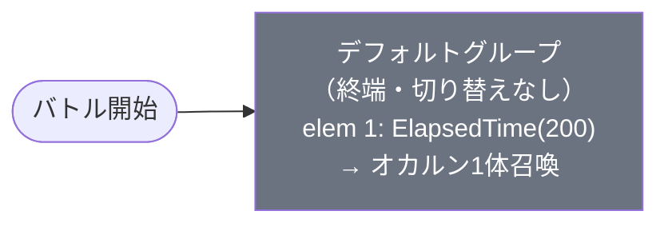

# event_dan1_charaget01_00001 インゲームデータ詳細解説

> 参照リポジトリ: `projects/glow-masterdata`
> リリースキー: `202510020`
> 本ファイルはMstAutoPlayerSequenceが1行のキャラクター育成チュートリアル（charaget01）の全データ設定を解説する

---

## 概要

**キャラクター育成チュートリアルコンテンツ（charaget01）**（砦破壊型・簡易バトル）。

- 砦のHP: `5,000` でダメージ有効（`is_damage_invalidation` 空 = 破壊可能）
- BGM: 通常 `SSE_SBG_003_001` / ボス登場時 `SSE_SBG_003_004`
- アートワーク: `event_dan_0001`
- グループ: デフォルトのみ（グループ切り替えなし・終端構造）
- 使用する敵の種類: 1種類（`c_dan_00001_bbaget_Boss_Colorless`：オカルン）
- シーケンス構造: 極めてシンプルな1行構成。バトル開始2秒後にキャラクター1体召喚のみ
- 対象キャラクター：`chara_dan_00001`（オカルン）の育成進捗確認コンテンツ

---

## 関連テーブル設定

### MstInGame

| カラム | 値 |
|--------|-----|
| `id` | `event_dan1_charaget01_00001` |
| `mst_auto_player_sequence_id` | `event_dan1_charaget01_00001` |
| `mst_auto_player_sequence_set_id` | `event_dan1_charaget01_00001` |
| `bgm_asset_key` | `SSE_SBG_003_001` |
| `boss_bgm_asset_key` | `SSE_SBG_003_004` |
| `loop_background_asset_key` | （空） |
| `player_outpost_asset_key` | （空） |
| `mst_page_id` | `event_dan1_charaget01_00001` |
| `mst_enemy_outpost_id` | `event_dan1_charaget01_00001` |
| `mst_defense_target_id` | （空） |
| `boss_mst_enemy_stage_parameter_id` | `1` |
| `boss_count` | （空） |
| `normal_enemy_hp_coef` | `1.0` |
| `normal_enemy_attack_coef` | `1.0` |
| `normal_enemy_speed_coef` | `1` |
| `boss_enemy_hp_coef` | `1.0` |
| `boss_enemy_attack_coef` | `1.0` |
| `boss_enemy_speed_coef` | `1` |
| `release_key` | `202510020` |

### MstEnemyOutpost（敵砦）

| カラム | 値 | 意味 |
|--------|-----|------|
| `id` | `event_dan1_charaget01_00001` | |
| `hp` | `5,000` | 砦HP（通常イベントの100,000より大幅に低い） |
| `is_damage_invalidation` | （空） | **ダメージ有効**（砦破壊可能） |
| `outpost_asset_key` | （空） | |
| `artwork_asset_key` | `event_dan_0001` | 背景アートワーク（danシリーズ共通） |
| `release_key` | `202510020` | |

### MstPage + MstKomaLine（コマフィールド）

2行構成。

```
row=1  height=0.55  layout=10.0  （3コマ: 幅0.25 / 0.25 / 0.50）
  koma1: glo_00011  width=0.25  offset=-1.0  effect=None
  koma2: glo_00011  width=0.25  offset=-1.0  effect=None
  koma3: glo_00011  width=0.50  offset=-1.0  effect=None

row=2  height=0.55  layout=1.0  （1コマ: 幅1.00）
  koma1: glo_00011  width=1.00  offset=-0.4  effect=None
```

> **コマ効果の補足**: 全コマでエフェクトなし（`effect_type = None`）。全属性・全ロール対象（`target_side = All`）。`glo_00011` は汎用グロウコマアセット。

### MstInGameI18n（バトル説明文）

**result_tips（バトルヒント）:**
> キャラを強化してみよう!

**description（ステージ説明）:**
> 【属性情報】
> 無属性の『オカルン』が登場するぞ!
>
> 強化したキャラで挑んでみよう!

---

## 使用する敵パラメータ（MstEnemyStageParameter）一覧

1種類の敵パラメータを使用。`c_` プレフィックスはキャラ個別ID。
IDの命名規則: `c_{キャラID}_{コンテンツID}_{kind}_{color}`

### カラム解説

| カラム名（略称） | DBカラム名 | 説明 |
|---------------|-----------|------|
| id | id | MstEnemyStageParameterの主キー |
| キャラID | mst_enemy_character_id | 紐付くキャラモデル・スキルの参照元 |
| kind | character_unit_kind | `Normal`（通常敵）/ `Boss`（ボス）。UIオーラ表示に影響 |
| role | role_type | 属性相性の役職（Attack/Technical/Defense/Support） |
| color | color | 属性色（Red/Yellow/Green/Blue/Colorless） |
| sort_order | sort_order | ゲーム内表示順 |
| base_hp | hp | ベースHP（`enemy_hp_coef` 乗算前の素値） |
| base_atk | attack_power | ベース攻撃力（`enemy_attack_coef` 乗算前の素値） |
| base_spd | move_speed | 移動速度（数値が大きいほど速い） |
| well_dist | well_distance | 攻撃射程（コマ単位） |
| combo | attack_combo_cycle | 攻撃コンボ数（1=単発） |
| knockback | damage_knock_back_count | 被攻撃時ノックバック回数（0=ノックバックなし） |
| ability | mst_unit_ability_id1 | 特殊アビリティID |
| drop_bp | drop_battle_point | 基本ドロップバトルポイント |

### 全1種類の詳細パラメータ

| MstEnemyStageParameter ID | 日本語名 | キャラID | kind | role | color | sort | base_hp | base_atk | base_spd | well_dist | combo | knockback | ability | drop_bp |
|--------------------------|---------|---------|------|------|-------|------|---------|---------|---------|-----------|-------|-----------|---------|---------|
| `c_dan_00001_bbaget_Boss_Colorless` | オカルン | `chara_dan_00001` | Boss | Defense | Colorless | 3 | 20,000 | 100 | 30 | 0.2 | 4 | 2 | （空） | 250 |

> **実際のHP・ATKは `base × MstAutoPlayerSequence.enemy_hp_coef` で決まる。**
> - 実際のHP: 20,000 × 1 = **20,000**
> - 実際のATK: 100 × 2.8 = **280**

### 敵パラメータの特性解説

| 項目 | 値 | 解説 |
|------|----|------|
| `kind = Boss` | ボス判定 | UIのオーラ演出が適用される |
| `role_type = Defense` | 防御型 | ATKは100と低めだが、HPが20,000と高め |
| `color = Colorless` | 無属性 | 全属性から等倍ダメージを受ける |
| `move_speed = 30` | 移動速度 | 標準的な速度 |
| `well_distance = 0.2` | 攻撃射程 | 近接型（0.2コマ） |
| `attack_combo_cycle = 4` | コンボ4 | 4連続攻撃パターン |
| `damage_knock_back_count = 2` | ノックバック2 | 被弾時に2回ノックバック発生 |

> MstAutoPlayerSequenceで `enemy_attack_coef = 2.8` が設定されており、ATKは通常の2.8倍（280）となっている。育成チュートリアルとしてはやや高め（キャラ強化の効果を実感させるための設定と推察）。

---

## グループ構造の全体フロー（Mermaid）



> **Mermaid スタイルカラー規則**:
> - デフォルトグループ: `#6b7280`（グレー）
> - グループ切り替えなし（終端構造）のため、デフォルトのみ

---

## 全1行の詳細データ（グループ単位）

### デフォルトグループ（elem 1）

バトル開始2秒後にオカルン1体を召喚する、シンプルな終端グループ。

| id | elem | 条件 | action_type | action_value | 召喚数 | interval | aura | hp倍 | atk倍 | override_bp | 説明 |
|----|------|------|------------|--------------|--------|---------|------|------|------|------------|------|
| `event_dan1_charaget01_00001_1` | 1 | `ElapsedTime(200)` | `SummonEnemy` | `c_dan_00001_bbaget_Boss_Colorless` | 1 | 0 | Default | 1 | 2.8 | （空） | バトル開始2秒後にオカルン(Boss)を1体召喚 |

**ポイント:**
- `ElapsedTime(200)` = 2,000ms = バトル開始2秒後に発動
- `aura_type = Default` でオーラ演出はデフォルト表示
- `enemy_hp_coef = 1` → HPは素値のまま（20,000）
- `enemy_attack_coef = 2.8` → ATKは素値の2.8倍（280）
- `override_drop_battle_point` が空のため、`drop_battle_point（250）` がそのまま適用
- `defeated_score = 0` → リザルトスコア表示なし
- グループ切り替え行（`groupchange_N`）が存在しない → 完全な終端グループ

---

## グループ切り替えまとめ表

| 切り替え | 条件 | 遷移先 |
|---------|------|--------|
| （なし） | グループ切り替えなし | — |

**本コンテンツはグループ切り替えが一切ない単純終端構造。**

各グループで倒すべき目安:
- デフォルト: 1体（オカルン1体を撃破すればバトル終了）

---

## スコア体系

バトルポイントは `override_drop_battle_point`（MstAutoPlayerSequence設定値）が優先される。

| 敵の種類 | override_bp（獲得バトルポイント） | drop_battle_point（素値） | 備考 |
|---------|----------------------------------|--------------------------|------|
| オカルン（Boss, Colorless） | （空） = 素値適用 | 250 | override未設定のため素値250が適用 |

> charaget01コンテンツは育成チュートリアルのため、バトルポイント獲得量は少なめに設定されている。

---

## この設定から読み取れる設計パターン

### 1. 育成チュートリアル専用の超シンプル構造

通常のイベントクエストが30行以上のシーケンスを持つのに対し、本コンテンツはわずか**1行**。グループ切り替えもなく、バトル開始から2秒後に1体の敵を召喚するだけ。これはゲーム内でキャラクターの強化結果を確認させるための「お試しバトル」としての設計意図を示している。

### 2. 砦HPを意図的に低く設定（5,000）

通常のイベントクエストは砦HP 100,000 が標準的であるのに対し、本コンテンツは **5,000**（1/20）。育成チュートリアルのため、プレイヤーが強化済みキャラで素早くクリアできるよう配慮した設定。敵を倒さずとも短時間で砦を破壊できる。

### 3. ATK倍率2.8倍で「強化の手ごたえ」を演出

`enemy_hp_coef = 1`（HP据え置き）に対して `enemy_attack_coef = 2.8`（ATK2.8倍）という非対称な設定。敵のHPは変えずにATKだけ高くすることで、「強くなったキャラなら素早く倒せるが、弱いキャラだと手こずる」という強化体験を演出している。

### 4. charaget01シリーズ共通の設計テンプレート

MstInGameのカラム（BGM、砦設定、全倍率1.0）はシリーズ全体（kai1/dan1等）で共通。`boss_mst_enemy_stage_parameter_id = '1'`（固定値）も共通設定。異なるのは召喚する敵ID・砦HP・ATK倍率のみであり、コンテンツ量産を効率化したテンプレート設計が確認できる。

### 5. 無属性（Colorless）敵で属性不問のクリアを保証

`color = Colorless` により、どの属性のキャラクターでも等倍ダメージが通る。育成チュートリアルである以上、プレイヤーが属性対策を考えずにクリアできる設計になっている。

### 6. `last_boss_trigger` 未設定 = ラストボス演出なし

シンプルな1体召喚のため、ラストボス演出（最後の敵が登場する際の特殊演出）は設定されていない。ボスオーラ（`aura_type = Default`）も最小設定であり、演出コストを抑えた軽量コンテンツとして実装されている。
