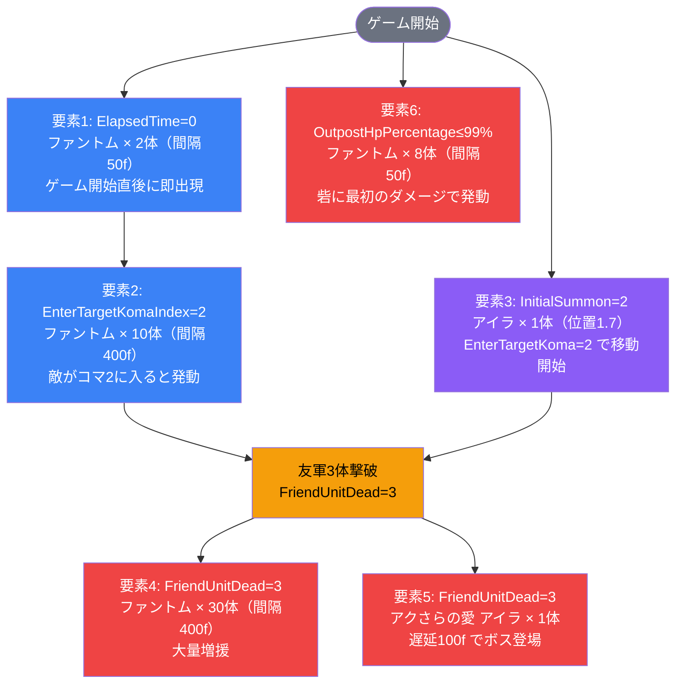

# インゲーム詳細解説: event_dan1_savage_00001

**生成日**: 2026-03-06
**対象ID**: `event_dan1_savage_00001`
**コンテンツタイプ**: event（砦破壊型）
**リリースキー**: 202510020

---

## 1. 概要

`event_dan1_savage_00001` はダン1サベージイベントのインゲームステージ設定。**赤属性**の敵が登場し、砦HP 100,000 を削り切ることがクリア条件となる砦破壊型ステージ。

ゲーム開始直後に雑魚ファントムが2体出現し、コマインデックス2（突風コマライン）に敵が入ると追加の10体が湧く。ステージ序盤は中ボス「アイラ」が砦前方に待機しつつ、一定数の撃破をトリガーにファントムが大量増援（30体）とボス「アクさらの愛 アイラ」が登場する二段展開構成。さらに砦HP が99%以下になった瞬間にもファントム8体が追加湧きするため、火力維持と砦防衛の両立が求められる。

フィールドには**突風コマ**が配置されており（Row 2: Gust / 速度0.5低下 / 400フレーム / Player側）、青属性キャラが有利。「突風コマ無効化」特性持ちキャラを編成することが推奨される。**スピードアタックルール**適用ステージであり、早期クリアで追加報酬を取得できる。

---

## 2. 関連テーブル設定

### MstInGame
| カラム | 値 |
|--------|-----|
| id | event_dan1_savage_00001 |
| mst_auto_player_sequence_id | event_dan1_savage_00001 |
| mst_auto_player_sequence_set_id | event_dan1_savage_00001 |
| bgm_asset_key | SSE_SBG_003_007 |
| boss_bgm_asset_key | （なし） |
| mst_page_id | event_dan1_savage_00001 |
| mst_enemy_outpost_id | event_dan1_savage_00001 |
| boss_mst_enemy_stage_parameter_id | 1（ボスあり） |
| normal_enemy_hp_coef | 1.0 |
| normal_enemy_attack_coef | 1.0 |
| normal_enemy_speed_coef | 1 |
| boss_enemy_hp_coef | 1.0 |
| boss_enemy_attack_coef | 1.0 |
| boss_enemy_speed_coef | 1 |
| release_key | 202510020 |

### MstEnemyOutpost（砦設定）
| カラム | 値 |
|--------|-----|
| id | event_dan1_savage_00001 |
| hp | 100,000 |
| is_damage_invalidation | （空 = ダメージ有効） |
| artwork_asset_key | dan_0001 |
| release_key | 202510020 |

**砦ダメージが有効**なため、敵の攻撃が砦HPを削る砦破壊ゲームモード。

### MstPage + MstKomaLine（コマライン設定）

**MstPage**: `event_dan1_savage_00001`（release_key: 202510020）

| Row | height | layout | koma1（asset / 幅） | koma1_effect | koma2（asset / 幅） | 備考 |
|-----|--------|--------|---------------------|--------------|---------------------|------|
| 1 | 0.55 | 2.0 | glo_00016 / 0.6 | None | glo_00016 / 0.4 | 通常2コマライン |
| 2 | 0.55 | 1.0 | glo_00016 / 1.0 | **Gust** (400f, 0.5倍, Player側) | — | **突風コマ（1コマ全幅）** |
| 3 | 0.55 | 3.0 | glo_00016 / 0.4 | None | glo_00016 / 0.6 | 通常2コマライン |

> **Row 2（突風コマ）**: `koma1_effect_type=Gust` / `parameter1=400`（持続フレーム）/ `parameter2=0.5`（速度低下率50%）/ `target=Player側` → プレイヤーの駒が突風で減速する危険なライン。

### MstInGameI18n（日本語テキスト）
| カラム | 値 |
|--------|-----|
| language | ja |
| result_tips | 各種ゲートLvを強化してみよう! |
| description | 【属性情報】赤属性の敵が登場するので青属性のキャラは有利に戦うこともできるぞ! / 【コマ効果情報】突風コマが登場するぞ! 特性で突風コマ無効化を持っているキャラを編成しよう! / また、このステージではスピードアタックルールがあるぞ! 早くクリアすると報酬ゲット! |

---

## 3. 使用する敵パラメータ一覧

### カラム解説
| カラム | 説明 |
|--------|------|
| id | MstEnemyStageParameter の一意ID |
| mst_enemy_character_id | キャラクターマスタID（外観・アニメ参照） |
| character_unit_kind | `Normal`=雑魚 / `Boss`=ボス |
| role_type | `Attack`=砦攻撃型 / `Carrier`=コマ搬送型 など |
| color | 属性色 |
| hp | 基礎HP |
| damage_knock_back_count | ノックバック発生に必要なヒット数 |
| move_speed | 移動速度（単位: px/frame相当） |
| well_distance | 砦への近接距離閾値 |
| attack_power | 基礎攻撃力 |
| attack_combo_cycle | コンボ攻撃のサイクル数 |
| mst_unit_ability_id1 | アビリティID（空=なし） |
| drop_battle_point | 撃破時獲得バトルポイント |
| enemy_hp_coef / enemy_attack_coef / enemy_speed_coef | MstAutoPlayerSequenceでのステージ倍率 |

### 全パラメータ表

| id | 日本語名 | kind | role | color | HP | KB | 速度 | 射程 | 攻撃力 | combo | アビリティ | BP |
|----|----------|------|------|-------|----|----|------|------|--------|-------|-----------|-----|
| e_glo_00001_savage_Normal_Red | ファントム | Normal | Attack | Red | 10,000 | 2 | 45 | 0.22 | 500 | 1 | なし | 50 |
| c_dan_00201_savage_Normal_Red | アイラ | Normal | Attack | Red | 20,000 | 3 | 25 | 0.27 | 200 | 4 | なし | 250 |
| c_dan_00202_dan1challenge_Boss_Red | アクさらの愛 アイラ | Boss | Attack | Red | 50,000 | 2 | 33 | 0.25 | 500 | 4 | なし | 300 |

### 特性解説

| キャラ | 特記事項 |
|--------|---------|
| ファントム（雑魚） | 高速（速度45）・低HP（10,000）の消耗型。攻撃力500と1コンボのため砦ダメージ効率が高い。大量出現（最大50体超）でプレイヤーを圧倒する設計。 |
| アイラ（中ボス） | 低速（速度25）・中HP（20,000）・4コンボ攻撃。コマインデックス2入場で前線移動開始。3体撃破まで前方に壁として機能する。 |
| アクさらの愛 アイラ（ボス） | 中速（速度33）・高HP（50,000）・4コンボ攻撃。FriendUnitDead=3のタイミングで遅延100f後に出現。撃破時バトルポイント300と高報酬。 |

---

## 4. グループ構造の全体フロー

本ステージは **シングルグループ構成**（sequence_group_id = デフォルト）のため、グループ切り替えは発生しない。各シーケンス要素はそれぞれの `condition_type` によって独立して管理される。

---

## 5. 全6行の詳細データ（デフォルトグループ）

> **注**: 本ステージは単一のデフォルトグループで構成。

### 要素1
| カラム | 値 |
|--------|-----|
| sequence_element_id | 1 |
| condition_type | ElapsedTime |
| condition_value | 0（即時） |
| action_type | SummonEnemy |
| action_value | e_glo_00001_savage_Normal_Red（ファントム） |
| summon_count | 2 |
| summon_interval | 50f |
| enemy_hp_coef | 2.5 |
| enemy_attack_coef | 2.1 |
| enemy_speed_coef | 1 |
| drop_battle_point（override） | 25 |

ゲーム開始直後（ElapsedTime=0）に発動。ファントム2体が即座に出現し、突風コマラインへ向かう。HPコーフ2.5・攻撃コーフ2.1でサベージ難度の強化がかかっている。

---

### 要素2
| カラム | 値 |
|--------|-----|
| sequence_element_id | 2 |
| condition_type | EnterTargetKomaIndex |
| condition_value | 2（コマインデックス2） |
| action_type | SummonEnemy |
| action_value | e_glo_00001_savage_Normal_Red（ファントム） |
| summon_count | 10 |
| summon_interval | 400f |
| enemy_hp_coef | 2.5 |
| enemy_attack_coef | 2.1 |
| enemy_speed_coef | 1 |
| drop_battle_point（override） | 25 |

敵ユニットがコマインデックス2（突風コマライン）に入ると発動。ファントム10体が400fの長い間隔で順次出現。突風コマ通過中の敵に対してプレイヤーが対処している隙を突く形。

---

### 要素3
| カラム | 値 |
|--------|-----|
| sequence_element_id | 3 |
| condition_type | InitialSummon |
| condition_value | 2 |
| action_type | SummonEnemy |
| action_value | c_dan_00201_savage_Normal_Red（アイラ） |
| summon_count | 1 |
| summon_interval | 0 |
| summon_position | 1.7 |
| move_start_condition_type | EnterTargetKoma |
| move_start_condition_value | 2 |
| enemy_hp_coef | 15 |
| enemy_attack_coef | 7 |
| enemy_speed_coef | 1 |
| drop_battle_point（override） | 100 |

`InitialSummon=2` は「位置2にあらかじめ配置」を意味。アイラが砦手前（position 1.7）に最初から佇み、コマインデックス2（突風コマライン）に敵が入ったタイミングで前線移動を開始する。HPコーフ15・攻撃コーフ7という極めて高い強化値で、サベージ難度の中ボスとして機能。

---

### 要素4
| カラム | 値 |
|--------|-----|
| sequence_element_id | 4 |
| condition_type | FriendUnitDead |
| condition_value | 3 |
| action_type | SummonEnemy |
| action_value | e_glo_00001_savage_Normal_Red（ファントム） |
| summon_count | 30 |
| summon_interval | 400f |
| enemy_hp_coef | 2.5 |
| enemy_attack_coef | 2.1 |
| enemy_speed_coef | 1 |
| drop_battle_point（override） | 25 |

友軍3体撃破後に発動する大量増援。ファントム30体が400fごとに出現し続ける。ボス戦と並行して大量の雑魚が押し寄せる「二正面作戦」状態を作り出す。

---

### 要素5
| カラム | 値 |
|--------|-----|
| sequence_element_id | 5 |
| condition_type | FriendUnitDead |
| condition_value | 3 |
| action_type | SummonEnemy |
| action_value | c_dan_00202_dan1challenge_Boss_Red（アクさらの愛 アイラ） |
| summon_count | 1 |
| summon_interval | 0 |
| enemy_hp_coef | 10 |
| enemy_attack_coef | 3 |
| enemy_speed_coef | 1 |
| action_delay | 100f |
| drop_battle_point（override） | 150 |

友軍3体撃破後、100f遅延してボスが登場。`action_delay=100` によりファントム大量増援（要素4）と同タイミングでありながら僅かに後から出現する演出的工夫。HPコーフ10・攻撃コーフ3の強化あり。

---

### 要素6
| カラム | 値 |
|--------|-----|
| sequence_element_id | 6 |
| condition_type | OutpostHpPercentage |
| condition_value | 99 |
| action_type | SummonEnemy |
| action_value | e_glo_00001_savage_Normal_Red（ファントム） |
| summon_count | 8 |
| summon_interval | 50f |
| enemy_hp_coef | 2.5 |
| enemy_attack_coef | 2.1 |
| enemy_speed_coef | 1 |
| drop_battle_point（override） | 25 |

砦HPが99%以下（つまりほぼゲーム開始直後に最初のダメージが入った瞬間）に発動するトリガー。事実上「ゲーム開始後すぐ」に発動し、ファントム8体が50fの短い間隔で連続出現する緊急増援として機能。

---

## 6. グループ切り替えまとめ表

本ステージはシングルグループ構成のため、グループ切り替えは**なし**。

| グループ名 | 説明 |
|-----------|------|
| デフォルト（空） | 全6要素が所属。各要素は独立したトリガー条件で管理される。 |

---

## 7. スコア体系

| 撃破対象 | override_drop_battle_point |
|----------|---------------------------|
| ファントム | 25 |
| アイラ（中ボス） | 100 |
| アクさらの愛 アイラ（ボス） | 150 |

> スピードアタックルール適用ステージ。早期クリアで追加報酬を獲得できる。

---

## 8. この設定から読み取れる設計パターン

1. **「砦ダメージトリガー」によるほぼ即時緊急増援**: OutpostHpPercentage=99 は実質ゲーム開始直後に発動するため、プレイヤーは開始から一切気を抜けない常時プレッシャー構造になっている。

2. **InitialSummon による待機型中ボス配置**: アイラはゲーム開始時から砦手前に配置済み（position 1.7）で、特定コマに敵が入るまで動かない「待ち伏せ」設計。これにより序盤の緊張感を高めつつ、突風コマへの侵入を対処が必要なトリガーとして機能させている。

3. **FriendUnitDead=3 での同時二重発動**: 要素4（ファントム30体大量増援）と要素5（ボス登場）が同じ `FriendUnitDead=3` で発動し、雑魚処理とボス対処を同時に要求する「崩壊フェーズ」を作り出している。

4. **突風コマの戦略的配置**: Row 2（中央ライン）を1コマ全幅の突風コマにすることで、プレイヤーはコマを配置する際にリスクのある中央ラインを避けるか、突風無効化特性を活用するかの選択を迫られる。属性有利（青属性）との組み合わせでデッキ構築に深みが出る設計。

5. **サベージ難度の強化倍率設計**: ファントムはHP×2.5・攻撃×2.1、アイラはHP×15・攻撃×7という大幅強化。特にアイラの倍率が極端に高く、中ボスがボスより実質的に硬く強い場面も起きうる「逆転強化」パターン。

6. **シンプルなシングルグループでの密度**: グループ切り替えなし・単一フェーズでも6つの独立トリガーを組み合わせることで、実際の戦闘密度を高度に維持できるイベント型の典型設計。
