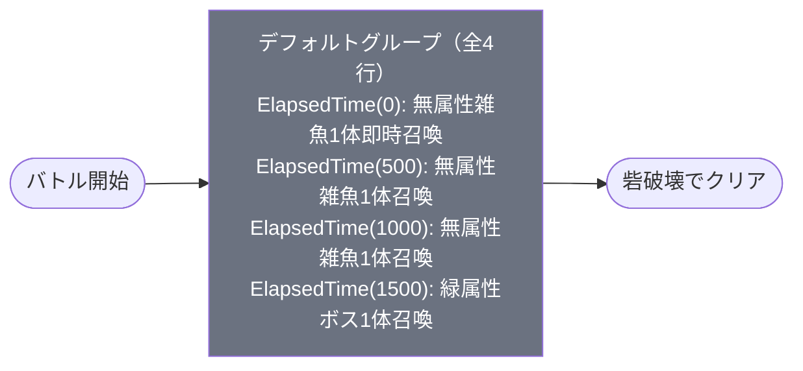

# event_hut1_challenge_00001 インゲームデータ詳細解説

> 参照リポジトリ: `projects/glow-masterdata`
> リリースキー: 202603010
> 本ファイルはMstAutoPlayerSequenceが4行のイベントチャレンジクエスト（hut1シリーズ）の全データ設定を解説する

---

## 概要

**『ふつうの軽音部』イベントチャレンジクエスト（hut1シリーズ）**（砦破壊型）。

このステージはeventコンテンツのチャレンジステージとして設計されており、通常ステージと比べて難易度が高め。砦HP 30,000（`is_damage_invalidation` = 空でダメージ有効）はキャラゲットステージの2倍程度の耐久値に相当し、やや硬い構成となっている。さらに**スピードアタックルール**が適用されており、早期クリアで追加報酬を獲得できる設計のため、攻撃的な編成が求められる。

敵の出現はElapsedTime（経過時間）トリガーで段階的に制御される。バトル開始と同時（0ms）に無属性雑魚（`enemy_glo_00001`）が1体召喚され、500ms後・1000ms後にも同じ雑魚が1体ずつ追加される。そして1500ms後（1.5秒後）に緑属性ボス（`chara_hut_00001`）が登場する。グループ切り替えはなく、デフォルトグループのみのシンプルな4行構成。

ボスキャラ（`chara_hut_00001`）はロールがDefenseで、`damage_knock_back_count=1` という低いノックバック耐性値を持つ（この値は被ノックバック回数ではなく、ノックバックまでに必要なダメージ受付回数を示す仕様のため、実質的にはノックバックしにくい耐久型）。ステージ説明文でもノックバック攻撃への対策として**ノックバック無効化特性キャラ**の編成が推奨されている。属性相性の観点では緑属性の敵が登場するため、**赤属性のキャラが有利**。また特別ギミックとして『ふつうの軽音部』作品の味方キャラの体力・攻撃ステータスが永続20%UPするバフが適用されており、同作品のキャラを積極的に編成することが推奨される。

---

## 関連テーブル設定

### MstInGame

| カラム | 値 |
|--------|-----|
| `id` | `event_hut1_challenge_00001` |
| `mst_auto_player_sequence_id` | `event_hut1_challenge_00001` |
| `mst_auto_player_sequence_set_id` | `event_hut1_challenge_00001` |
| `bgm_asset_key` | `SSE_SBG_003_009` |
| `boss_bgm_asset_key` | `SSE_SBG_003_007` |
| `loop_background_asset_key` | （空） |
| `mst_page_id` | `event_hut1_challenge_00001` |
| `mst_enemy_outpost_id` | `event_hut1_challenge_00001` |
| `boss_mst_enemy_stage_parameter_id` | `1` |
| `normal_enemy_hp_coef` | `1.0` |
| `normal_enemy_attack_coef` | `1.0` |
| `normal_enemy_speed_coef` | `1.0` |
| `boss_enemy_hp_coef` | `1.0` |
| `boss_enemy_attack_coef` | `1.0` |
| `boss_enemy_speed_coef` | `1.0` |
| `release_key` | `202603010` |

### MstEnemyOutpost（敵砦）

| カラム | 値 | 意味 |
|--------|-----|------|
| `id` | `event_hut1_challenge_00001` | |
| `hp` | `30,000` | 砦のHP（破壊目的の目標値） |
| `is_damage_invalidation` | （空） | **ダメージ有効**（砦を壊せる・砦破壊型） |
| `artwork_asset_key` | `event_hut_0001` | 背景アートワーク（hut1シリーズ） |

### MstPage + MstKomaLine（コマフィールド）

3行構成（row=1〜3）。全コマで `glo_00014` アセットを使用。

```
row=1  height=0.55  コマ数=2
  koma1: glo_00014  width=0.6  effect=なし
  koma2: glo_00014  width=0.4  effect=なし

row=2  height=0.55  コマ数=3
  koma1: glo_00014  width=0.5   effect=なし
  koma2: glo_00014  width=0.25  effect=なし
  koma3: glo_00014  width=0.25  effect=なし

row=3  height=0.55  コマ数=1
  koma1: glo_00014  width=1.0  effect=なし
```

> **コマ効果の補足**: 全コマ `effect=なし` でコマ効果なし。アセットキーは `glo_00014` で統一。row=3 は1コマで幅1.0の横断レイアウト。

### MstInGameI18n（バトル説明文）

**result_tips（バトルヒント）:**
> キャラを強化してみよう!
> 赤属性のキャラを編成してみよう!

**description（ステージ説明）:**
> 【特別ギミック】
> 永続で、『ふつうの軽音部』作品の味方キャラの体力・攻撃ステータスを20%UP
>
> 【属性情報】
> 緑属性の敵が登場するので赤属性のキャラは有利に戦うこともできるぞ!
>
> 【ギミック情報】
> 強敵の『ひたむきギタリスト 鳩野 ちひろ』がノックバック攻撃をしてくるぞ!
> 特性でノックバック無効化を持っているキャラを編成しよう!
>
> また、このステージではスピードアタックルールがあるぞ!
> 早くクリアすると報酬ゲット!

---

## 使用する敵パラメータ（MstEnemyStageParameter）一覧

2種類の敵パラメータを使用。`c_` プレフィックスはキャラ（ボス）、`e_` プレフィックスは汎用敵IDを示す。

### カラム解説

| カラム名（略称） | DBカラム名 | 説明 |
|---------------|-----------|------|
| id | id | MstEnemyStageParameterの主キー |
| キャラID | mst_enemy_character_id | 紐付くキャラモデル・スキルの参照元 |
| kind | character_unit_kind | `Normal`（通常敵）/ `Boss`（ボス）。UIオーラ表示に影響 |
| role | role_type | 属性相性の役職（Attack/Technical/Defense/Support） |
| color | color | 属性色（Red/Yellow/Green/Blue/Colorless） |
| hp | hp | ベースHP（`enemy_hp_coef` 乗算前の素値） |
| attack_power | attack_power | ベース攻撃力（`enemy_attack_coef` 乗算前の素値） |
| move_speed | move_speed | 移動速度（数値が大きいほど速い） |
| knockback | damage_knock_back_count | 被ノックバックまでの受付回数（小さいほどノックバックしにくい） |
| ability | mst_unit_ability_id1 | 特殊アビリティID |
| drop_bp | drop_battle_point | 基本ドロップバトルポイント |

### 全2種類の詳細パラメータ

| MstEnemyStageParameter ID | キャラID | kind | role | color | hp | attack_power | move_speed | knockback | ability | drop_bp |
|--------------------------|---------|------|------|-------|-----|-------------|------------|-----------|---------|---------|
| `c_hut_00001_hut1_challenge1_Boss_Green` | `chara_hut_00001` | Boss | Defense | Green | 10,000 | 100 | 35 | 1 | （空） | 200 |
| `e_glo_00001_hut1_challenge_Normal_Colorless` | `enemy_glo_00001` | Normal | Attack | Colorless | 1,000 | 100 | 40 | 2 | （空） | 30 |

> **MstInGame の全コエフが1.0のため、上記の hp・attack_power がそのまま実戦値として適用される。**

### 敵パラメータの特性解説

| 項目 | glo雑魚（Normal） | hut_00001ボス（Boss） |
|------|-----------------|----------------------|
| HP | 1,000 | 10,000（雑魚の10倍） |
| 攻撃力 | 100 | 100（同値） |
| 移動速度 | 40 | 35（ボスの方がやや低速） |
| ノックバック受付回数 | 2 | 1（ボスの方が受付が少ない＝ノックバックしにくい） |
| ロール | Attack | Defense |
| 属性 | Colorless（属性相性なし） | Green（赤キャラが有利） |
| 特徴 | 無属性・複数体連続登場 | 高耐久・ノックバック耐性強め・緑属性 |

ボス（`chara_hut_00001` = ひたむきギタリスト 鳩野 ちひろ）は `damage_knock_back_count=1` でノックバックまでの受付回数が最小値に近い設定。Defenseロールとの組み合わせで高耐久性を発揮する。ノックバック攻撃への対抗として、プレイヤー側でノックバック無効化特性を持つキャラの編成が有効。

---

## グループ構造の全体フロー（Mermaid）

このコンテンツはグループ切り替え（groupchange行）が存在しないシンプルな**デフォルトグループのみ**の構成。



> **Mermaid スタイルカラー規則**:
> - デフォルトグループ: `#6b7280`（グレー）
> - グループ切り替えなしのため、デフォルトグループのみ表示

---

## 全シーケンス詳細データ（グループ単位）

### デフォルトグループ（sequence_group_id=空、elem 1〜4）

グループ切り替えなし。バトル開始からクリアまで全4行のシーケンスで構成。全行 ElapsedTime トリガーで時間経過とともに段階的に敵が追加される。

| seq_element_id | action_type | 召喚キャラ | condition_type | condition_value | 召喚タイミング | 説明 |
|----------------|-------------|-----------|----------------|-----------------|--------------|------|
| 1 | `SummonEnemy` | `e_glo_00001_hut1_challenge_Normal_Colorless` | `ElapsedTime` | 0 | 0ms（即時） | バトル開始と同時に無属性雑魚1体を即時召喚 |
| 2 | `SummonEnemy` | `e_glo_00001_hut1_challenge_Normal_Colorless` | `ElapsedTime` | 500 | 500ms後 | 0.5秒後に無属性雑魚1体を追加召喚 |
| 3 | `SummonEnemy` | `e_glo_00001_hut1_challenge_Normal_Colorless` | `ElapsedTime` | 1000 | 1000ms後 | 1.0秒後に無属性雑魚1体を追加召喚 |
| 4 | `SummonEnemy` | `c_hut_00001_hut1_challenge1_Boss_Green` | `ElapsedTime` | 1500 | 1500ms後 | 1.5秒後に緑属性ボス（鳩野ちひろ）1体を召喚 |

**ポイント:**
- elem 1: `ElapsedTime=0` = バトル開始直後に即時召喚。プレイヤーへの即時プレッシャーを与える設計。
- elem 2〜3: 500ms間隔で雑魚を1体ずつ追加。最初の1.5秒間で合計3体の雑魚が段階的に登場。
- elem 4: `ElapsedTime=1500` = 1.5秒後にボス登場。雑魚の展開が完了するタイミングに合わせてボスが出現する。スピードアタックルール下では、早期クリアを目指すプレイヤーが雑魚対処とボス処理を同時に行う必要がある設計。

---

## グループ切り替えまとめ表

このコンテンツにはグループ切り替え（`SwitchSequenceGroup` アクション）が存在しない。

| 切り替え | 条件 | 遷移先 |
|---------|------|--------|
| （なし） | - | - |

デフォルトグループのみで完結するシンプル構成。グループ切り替えがないため、敵出現ロジックは全てElapsedTimeトリガーのみで制御される。

---

## スコア体系

このコンテンツでは `override_drop_battle_point` の設定はなく、各敵の `drop_battle_point`（MstEnemyStageParameter基本値）がそのまま適用される。

| 敵の種類 | override_bp | 基本drop_bp | 実際の獲得BP | 備考 |
|---------|------------|------------|------------|------|
| glo雑魚（Normal・Colorless） | （空・未設定） | 30 | 30 | 最大3体出現 |
| hut_00001ボス（Boss・Green） | （空・未設定） | 200 | 200 | 1体出現 |

スピードアタックルールによる別途スコアボーナスがあるが、そちらはインゲームシステム側（MstSpeedAttack等）で管理される。全3体の雑魚を倒した場合のドロップBP合計は `30 × 3 = 90`、ボス撃破で `200` の計 `290` BP が基本値となる。

---

## この設定から読み取れる設計パターン

### 1. ElapsedTimeによる段階的敵出現（0ms → 500ms → 1000ms → 1500ms）

500ms単位の等間隔でシーケンスが展開されるシンプルな構成。`ElapsedTime=0` の即時召喚から始まり、1.5秒かけて雑魚3体＋ボス1体が出揃う。グループ切り替えや条件分岐がない代わりに、タイミング設計だけで「序盤の雑魚処理 → ボス登場」という流れを実現している。短時間で全員が登場するため、スピードアタックルールとの相性が良い設計。

### 2. 砦HP 30,000 = チャレンジステージとしての高難度化

通常のキャラゲットステージの砦HP（概ね10,000〜15,000程度）と比べて、30,000はチャレンジステージとして高めの設定。ボスHP（10,000）の3倍に相当し、プレイヤーは砦を削りながらボスへの継続ダメージも維持する必要がある。Defenseロールボスの耐久力と合わせ、攻撃力の高い編成が求められる。

### 3. スピードアタックルール = クリア速度に応じた追加報酬設計

ステージ説明文に「早くクリアすると報酬ゲット!」と明記されており、単なるクリアではなく速度への動機付けが設計に組み込まれている。ElapsedTimeで敵が短期間に一斉登場する構成は「速攻クリアしなければ不利になる」というプレッシャーを与え、スピードアタックルールへの自然な誘導として機能している。

### 4. 特別ギミック（作品バフ）による作品内キャラの優遇

『ふつうの軽音部』作品の味方キャラに永続20%バフを付与する特別ギミックは、イベントのIP（知的財産）と編成インセンティブを直結させる設計パターン。新キャラを使ってほしいイベントコンテンツに多く見られる。赤属性有利・ノックバック無効化推奨・作品バフの3要素が重なることで、推奨編成の方向性が明確に絞られている。

### 5. ボスのDefenseロール＋ノックバック耐性1でのギミック体験

ボスが `damage_knock_back_count=1` のDefenseロールであることをステージ説明文で明示し、「ノックバック無効化を持つキャラを編成しよう」という対策を提示している。プレイヤーに特定の特性・スキルの活用を促し、キャラコレクションへの動機付けと教育的な役割を兼ねる設計パターン。

### 6. 全コエフ1.0によるシーケンス値そのままの実戦適用

MstInGameの全`enemy_*_coef`が1.0であるため、MstEnemyStageParameterの `hp=10,000`・`attack_power=100` が調整なしで実戦値となる。シンプルな調整構造で、個別シーケンスによる複雑なスケーリングを行わないストレートな難易度設定パターン。
