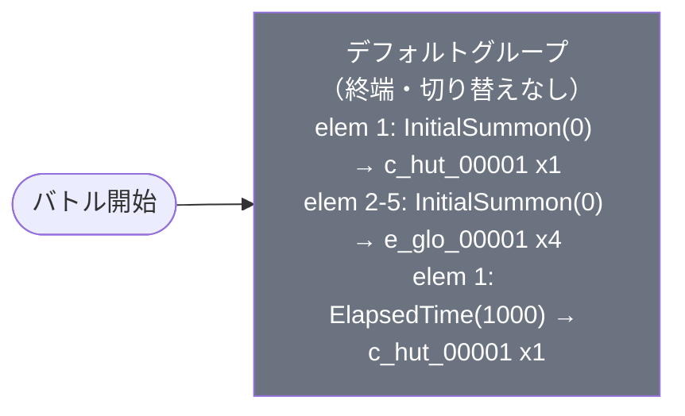

# event_hut1_charaget01_00001 インゲームデータ詳細解説

> 参照リポジトリ: `projects/glow-masterdata`
> リリースキー: `202603010`
> 本ファイルは『ふつうの軽音部』イベント向けキャラゲットステージ（charaget01）の全データ設定を解説する

---

## 概要

**『ふつうの軽音部』イベント・キャラゲットステージ（charaget01）**（砦破壊型・eventコンテンツ）。

本ステージは『ふつうの軽音部』作品のキャラクター獲得を目的としたイベント専用コンテンツで、難易度は低めに設定されている。砦HP 15,000（`is_damage_invalidation` 空 = ダメージ有効 = 破壊可能）と比較的低い数値で、初心者プレイヤーでも短時間でクリアできる設計となっている。

バトル開始と同時に、青属性の攻撃型雑魚敵（`e_glo_00001`）4体が `InitialSummon` で即時召喚される。条件値 `0` は同一バッチ番号を示しており、4体が一斉に登場する「開幕密集設計」が採用されている。加えてゲーム開始1,000ms（1秒）後には Defense 無属性キャラ（`c_hut_00001`）が `ElapsedTime` 条件で追加召喚され、合計5体の敵と戦うことになる。

推奨編成ヒントとして、ステージ説明文では「黄属性キャラが青属性の敵に対して有利」であること、そして「多数出現する敵に対応するため必殺ワザで範囲攻撃できるキャラ」の編成が推奨されている。また、特別ギミックとして『ふつうの軽音部』作品の味方キャラクターの体力・攻撃ステータスが永続で20%アップする強化効果が適用されるため、当該作品のキャラを編成することで有利に進めることができる。BGMは通常戦闘が `SSE_SBG_003_002`、ボス登場時が `SSE_SBG_003_004`。

---

## 関連テーブル設定

### MstInGame

| カラム | 値 |
|--------|-----|
| `id` | `event_hut1_charaget01_00001` |
| `mst_auto_player_sequence_id` | `event_hut1_charaget01_00001` |
| `mst_auto_player_sequence_set_id` | `event_hut1_charaget01_00001` |
| `bgm_asset_key` | `SSE_SBG_003_002` |
| `boss_bgm_asset_key` | `SSE_SBG_003_004` |
| `loop_background_asset_key` | （空） |
| `player_outpost_asset_key` | （空） |
| `mst_page_id` | `event_hut1_charaget01_00001` |
| `mst_enemy_outpost_id` | `event_hut1_charaget01_00001` |
| `boss_mst_enemy_stage_parameter_id` | `1` |
| `normal_enemy_hp_coef` | `1.0` |
| `normal_enemy_attack_coef` | `1.0` |
| `normal_enemy_speed_coef` | `1.0` |
| `boss_enemy_hp_coef` | `1.0` |
| `boss_enemy_attack_coef` | `1.0` |
| `boss_enemy_speed_coef` | `1.0` |
| `release_key` | `202603010` |

### MstEnemyOutpost（敵砦）

| カラム | 値 | 意味 |
|--------|-----|------|
| `id` | `event_hut1_charaget01_00001` | |
| `hp` | `15,000` | 砦HP（初心者向けに低めに設定） |
| `is_damage_invalidation` | （空） | **ダメージ有効**（砦破壊可能） |
| `outpost_asset_key` | （空） | |
| `artwork_asset_key` | `event_hut_0001` | 背景アートワーク（hutシリーズ共通） |

### MstPage + MstKomaLine（コマフィールド）

2段構成。

```
row=1  height=3.0  （2コマ）
  koma1: glo_00024  width=0.4  effect=None
  koma2: glo_00024  width=0.6  effect=None

row=2  height=1.0  （1コマ）
  koma1: glo_00024  width=1.0  effect=None
```

> **コマ効果の補足**: 全コマでエフェクトなし（`effect = None`）。`glo_00024` は汎用グロウコマアセット。

### MstInGameI18n（バトル説明文）

**result_tips（バトルヒント）:**
> キャラを強化してみよう!

**description（ステージ説明）:**
> 【特別ギミック】
> 永続で、『ふつうの軽音部』作品の味方キャラの体力・攻撃ステータスを20%UP
>
> 【属性情報】
> 青属性の敵が登場するので黄属性のキャラは有利に戦うこともできるぞ!
>
> 【ギミック情報】
> 敵が多く出現しているぞ!
> 必殺ワザで範囲攻撃ができるキャラを編成しよう!

---

## 使用する敵パラメータ（MstEnemyStageParameter）一覧

2種類の敵パラメータを使用。`c_` プレフィックスはキャラ個別ID、`e_` プレフィックスは汎用敵ID。
IDの命名規則: `{c|e}_{キャラID}_{コンテンツID}_{kind}_{color}`

### カラム解説

| カラム名（略称） | DBカラム名 | 説明 |
|---------------|-----------|------|
| id | id | MstEnemyStageParameterの主キー |
| キャラID | mst_enemy_character_id | 紐付くキャラモデル・スキルの参照元 |
| kind | character_unit_kind | `Normal`（通常敵）/ `Boss`（ボス）。UIオーラ表示に影響 |
| role | role_type | 属性相性の役職（Attack/Technical/Defense/Support） |
| color | color | 属性色（Red/Yellow/Green/Blue/Colorless） |
| base_hp | hp | ベースHP（コエフ乗算前の素値） |
| base_atk | attack_power | ベース攻撃力（コエフ乗算前の素値） |
| base_spd | move_speed | 移動速度（数値が大きいほど速い） |
| knockback | damage_knock_back_count | 被攻撃時ノックバック回数 |
| ability | mst_unit_ability_id1 | 特殊アビリティID |
| drop_bp | drop_battle_point | 基本ドロップバトルポイント |

### 全2種類の詳細パラメータ

| MstEnemyStageParameter ID | キャラID | kind | role | color | base_hp | base_atk | base_spd | knockback | ability | drop_bp |
|--------------------------|---------|------|------|-------|---------|---------|---------|-----------|---------|---------|
| `c_hut_00001_hut1_charaget01_Normal_Colorless` | `chara_hut_00001` | Normal | Defense | Colorless | 10,000 | 100 | 35 | 1 | （空） | 200 |
| `e_glo_00001_hut1_charaget01_Normal_Blue` | `enemy_glo_00001` | Normal | Attack | Blue | 1,000 | 100 | 40 | 3 | （空） | 50 |

### 敵パラメータの特性解説

| 項目 | 値 | 解説 |
|------|----|------|
| `c_hut_00001` role_type = Defense | 防御型 | HP 10,000 と耐久力が高め。無属性のため全属性から等倍ダメージを受ける |
| `c_hut_00001` color = Colorless | 無属性 | 属性有利・不利が発生しない。全編成でクリア可能 |
| `c_hut_00001` move_speed = 35 | 移動速度 | 標準的な速度 |
| `c_hut_00001` knockback = 1 | ノックバック1 | 被弾時のノックバック回数が少なく耐久型らしい挙動 |
| `e_glo_00001` role_type = Attack | 攻撃型 | 青属性・攻撃型。黄属性キャラが属性有利で戦える |
| `e_glo_00001` color = Blue | 青属性 | 黄属性キャラから有利ダメージを受ける（ステージ推奨編成の根拠） |
| `e_glo_00001` hp = 1,000 | 低HP雑魚 | 1,000 と非常に低く、範囲攻撃で一掃しやすい設定 |
| `e_glo_00001` move_speed = 40 | 移動速度（高め） | 雑魚の中では速い部類。開幕で一斉に押し寄せる密集設計と相性が良い |
| `e_glo_00001` knockback = 3 | ノックバック3 | 攻撃を受けると3回ノックバック。範囲攻撃で複数をまとめてノックバックさせやすい |

---

## グループ構造の全体フロー（Mermaid）



> **Mermaid スタイルカラー規則**:
> - デフォルトグループ: `#6b7280`（グレー）
> - グループ切り替えなし（終端構造）のため、デフォルトのみ

---

## 全シーケンス詳細データ（グループ単位）

### デフォルトグループ（elem 1〜5）

バトル開始と同時に青属性雑魚4体を一斉召喚し、1秒後にDefense無属性キャラを追加召喚するシンプルな終端グループ。

| seq_element_id | condition_type | condition_value | action_type | action_value | 説明 |
|----------------|----------------|-----------------|-------------|--------------|------|
| 1 | `ElapsedTime` | 1000 | `SummonEnemy` | `c_hut_00001_hut1_charaget01_Normal_Colorless` | 開始1秒後に軽音部キャラ(Defense, Colorless) 1体召喚 |
| 2 | `InitialSummon` | 0 | `SummonEnemy` | `e_glo_00001_hut1_charaget01_Normal_Blue` | 開始と同時に青属性雑魚を召喚（バッチ0: 一斉召喚） |
| 3 | `InitialSummon` | 0 | `SummonEnemy` | `e_glo_00001_hut1_charaget01_Normal_Blue` | 開始と同時に青属性雑魚を召喚（バッチ0: 一斉召喚） |
| 4 | `InitialSummon` | 0 | `SummonEnemy` | `e_glo_00001_hut1_charaget01_Normal_Blue` | 開始と同時に青属性雑魚を召喚（バッチ0: 一斉召喚） |
| 5 | `InitialSummon` | 0 | `SummonEnemy` | `e_glo_00001_hut1_charaget01_Normal_Blue` | 開始と同時に青属性雑魚を召喚（バッチ0: 一斉召喚） |

**condition_type の補足:**

| condition_type | 発動タイミング | condition_value の意味 |
|---------------|-------------|----------------------|
| `InitialSummon` | ゲーム開始直後（即座） | 同時召喚のバッチ番号（同じ値 = 一斉召喚） |
| `ElapsedTime` | ゲーム開始からの経過時間（ミリ秒） | `1000` = 1,000ms = 1秒後 |

---

## グループ切り替えまとめ表

| 切り替え | 条件 | 遷移先 |
|---------|------|--------|
| （なし） | グループ切り替えなし | — |

**本コンテンツはグループ切り替えが一切ない単純終端構造。**

バトルの流れ:
- 開始直後: 青属性雑魚（`e_glo_00001`）4体が一斉登場
- 開始1秒後: Defense無属性キャラ（`c_hut_00001`）1体が追加登場
- 砦HPを0にするか、制限時間終了でバトル終了

---

## スコア体系

| 敵の種類 | drop_battle_point（素値） | 備考 |
|---------|--------------------------|------|
| `c_hut_00001`（Defense, Colorless） | 200 | 耐久型のため倒すのに時間がかかる場合あり |
| `e_glo_00001`（Attack, Blue）× 4 | 50 × 4 = 200（合計） | 低HPのため一掃しやすい |
| **合計最大** | **400** | 全敵撃破時の合計バトルポイント |

> 砦破壊型ステージのため、バトルポイント獲得よりも砦HPを削りきることがクリアの優先目標となる。全倍率（コエフ）がすべて1.0のため、drop_battle_point の素値がそのまま適用される。

---

## この設定から読み取れる設計パターン

### 1. InitialSummon × 4 = 開幕から多数の敵が登場する「密集設計」

4体の青属性雑魚が `InitialSummon(0)` で一斉に召喚されるため、バトル開始直後からフィールドが敵で埋まる。これはステージ説明文「敵が多く出現しているぞ!」の設計的根拠であり、範囲攻撃キャラの有効性を体感させるための意図的なレイアウト。HP 1,000 と低い雑魚を大量配置することで、範囲攻撃の爽快感を演出している。

### 2. 特別ギミック（作品キャラ強化）による難易度調整

『ふつうの軽音部』作品キャラクターの体力・攻撃が永続20%アップするギミックは、当該イベントで獲得したキャラ（または既存のhutシリーズキャラ）を編成することを強く動機付ける設計。これによりキャラゲット目的のプレイヤーが、そのキャラ自身を使ってステージをクリアする体験ループが生まれる。

### 3. 砦HP 15,000（低め）= 初心者向けキャラゲット設計

通常のイベントクエストでは砦HP 100,000 が標準的であるのに対し、本コンテンツは **15,000**（1/6以下）。キャラゲットステージとしての位置づけを反映した低難度設定で、範囲攻撃キャラや黄属性キャラがいなくても短時間でクリア可能。プレイヤーに「とにかく試しにクリアできる」体験を提供する。

### 4. 青属性雑魚 + 黄属性キャラ推奨の属性誘導設計

雑魚4体を `Blue`（青属性）に統一し、説明文で「黄属性キャラが有利」と明示することで、プレイヤーに特定属性キャラの編成を自然に促す。Defense キャラ（`c_hut_00001`）を無属性にしているのは、属性に関係なく必ず倒せる（詰まない）保険設計として機能している。

### 5. ElapsedTime 1000 での遅延追加召喚による難度の緩急

全員 `InitialSummon` にせず、Defense キャラを1秒遅延させた `ElapsedTime(1000)` で召喚しているのは、プレイヤーに「最初の4体を処理してから次に対応する」時間的猶予を与えるためと考えられる。いきなり5体同時召喚にしないことで、初心者でも混乱せずに対応できる難易度設計となっている。

### 6. charaget01 シリーズ共通の設計テンプレート踏襲

MstInGame の全コエフが `1.0`、`boss_mst_enemy_stage_parameter_id = 1`、BGM設定などは他の charaget01 シリーズ（`event_dan1_charaget01_00001` など）と共通するテンプレート構造。作品ごとに異なるのは敵ID・砦HP・ギミック内容のみであり、コンテンツ量産を効率化したテンプレート設計が確認できる。
