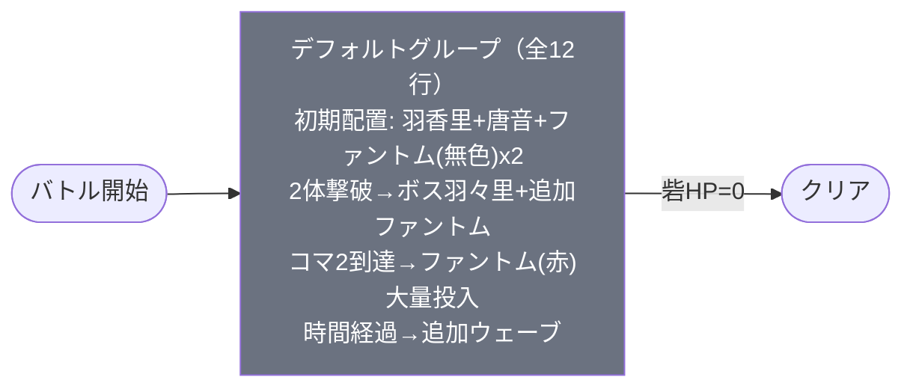

# event_kim1_challenge_00004 インゲームデータ詳細解説

> 参照リポジトリ: `projects/glow-masterdata`
> リリースキー: 202602020
> 本ファイルはMstAutoPlayerSequenceが12行・デフォルトグループのみで構成される砦破壊型チャレンジイベントの全データ設定を解説する

---

## 概要

本ステージ `event_kim1_challenge_00004` は、キメツ学園コラボのチャレンジクエスト第4ステージとして設計された砦破壊型コンテンツである。砦HPは80,000でダメージ有効の破壊目的ステージであり、赤属性と緑属性の敵が登場するため青属性と赤属性のキャラが有利に戦える構成となっている。ボスBGM（`SSE_SBG_003_007`）が設定されており、強敵「溢れる母性 花園 羽々里」の登場時にBGMが切り替わる演出が組み込まれている。

本ステージの最大の特徴は、グループ切り替えを一切使用せずデフォルトグループのみの12行で全ウェーブを構成している点にある。初期配置で花園 羽香里（緑/Normal）、院田 唐音（赤/Normal）、ファントム（無色/Normal）2体の計4体が即座に出現し、累計2体撃破を条件としてボスの花園 羽々里（赤/Boss）が出現する。ボスには `is_summon_unit_outpost_damage_invalidation=1` が設定されており、ボスが場に存在する間は砦HPが削れないという制約がある。

敵キャラの花園 羽香里はbase_hp=10,000にhp倍率28で実HP=280,000の高耐久、院田 唐音もhp倍率20で実HP=200,000と標準的な耐久力を持つ。ボスの花園 羽々里はbase_hp=50,000にhp倍率10で実HP=500,000、攻撃力倍率3.6で実攻撃力360と高火力かつ高速（move_speed=40）のボスとして君臨する。ボスにはスタン攻撃が設定されており、スタン無効化特性を持つキャラの編成が推奨される。

さらに、プレイヤーがコマ2に到達するとファントム（赤）が落下演出（Fall0）で2体出現し、加えて13体が1.1秒間隔で継続投入される大量ウェーブが発動する。時間経過条件でも70秒後にファントム（赤）10体、8秒後にファントム（無色）1体が追加される。スピードアタックルールが適用されており、早期クリアによる追加報酬が設定されている。

---

## 関連テーブル設定

### MstInGame

| カラム | 値 |
|--------|-----|
| `id` | `event_kim1_challenge_00004` |
| `mst_auto_player_sequence_set_id` | `event_kim1_challenge_00004` |
| `bgm_asset_key` | `SSE_SBG_003_009` |
| `boss_bgm_asset_key` | `SSE_SBG_003_007` |
| `mst_page_id` | `event_kim1_challenge_00004` |
| `mst_enemy_outpost_id` | `event_kim1_challenge_00004` |
| `boss_mst_enemy_stage_parameter_id` | `1` |
| `normal_enemy_hp_coef` | `1.0` |
| `normal_enemy_attack_coef` | `1.0` |
| `normal_enemy_speed_coef` | `1` |
| `boss_enemy_hp_coef` | `1.0` |
| `boss_enemy_attack_coef` | `1.0` |
| `boss_enemy_speed_coef` | `1` |
| `release_key` | `202602020` |

### MstEnemyOutpost（敵砦）

| カラム | 値 | 意味 |
|--------|-----|------|
| `id` | `event_kim1_challenge_00004` | |
| `hp` | `80,000` | 砦HP（ダメージ有効・破壊目的） |
| `is_damage_invalidation` | （空） | **ダメージ有効**（砦破壊型） |
| `outpost_asset_key` | `kim_enemy_0001` | 砦アセット |

### MstPage + MstKomaLine（コマフィールド）

4行構成。

```
row=1  height=0.55  layout=5.0  (2コマ: 幅0.25 + 幅0.75)
  koma1: kim_00001  width=0.25  background_offset=0.7   effect=None
  koma2: kim_00001  width=0.75  background_offset=0.0   effect=None

row=2  height=0.55  layout=1.0  (1コマ: 幅1.0)
  koma1: kim_00001  width=1.0   background_offset=0.3   effect=None

row=3  height=0.55  layout=7.0  (3コマ: 幅0.33 + 幅0.34 + 幅0.33)
  koma1: kim_00001  width=0.33  background_offset=0.5   effect=None
  koma2: kim_00001  width=0.34  background_offset=0.0   effect=None
  koma3: kim_00001  width=0.33  background_offset=0.0   effect=None

row=4  height=0.55  layout=4.0  (2コマ: 幅0.75 + 幅0.25)
  koma1: kim_00001  width=0.75  background_offset=-1.0  effect=None
  koma2: kim_00001  width=0.25  background_offset=0.0   effect=None
```

> **コマ効果の補足**: 全コマの `effect_type = None`。4行8コマの構成で、上下2行が2コマ、中段が1コマと3コマという非対称レイアウト。コマ効果による属性バフ・デバフなし。すべてのコマが `kim_00001` アセットで統一されている。

### MstInGameI18n（バトル説明文）

**result_tips（バトルヒント）:**
> キャラを強化してみよう!
> 青属性のキャラを編成してみよう!

**description（ステージ説明）:**
> 【属性情報】
> 赤属性と緑属性の敵が登場するので、青属性と赤属性のキャラは有利に戦うこともできるぞ!
>
> 【ギミック情報】
> 特定の敵を倒すと強敵の『溢れる母性 花園 羽々里』が出現するぞ!
> 強敵の『溢れる母性 花園 羽々里』はスタン攻撃をしてくるぞ!
> 特性でスタン攻撃無効化を持っているキャラを編成しよう!
>
> このステージでは、強敵の『溢れる母性 花園 羽々里』が登場している時は、
> ファントムゲートHPは削れないぞ!
>
> また、このステージではスピードアタックルールがあるぞ!
> 早くクリアすると報酬ゲット!

---

## 使用する敵パラメータ（MstEnemyStageParameter）一覧

5種類の敵パラメータを使用。`c_` プレフィックスはキャラ個別ID、`e_` は汎用敵。
IDの命名規則: `{c_/e_}{キャラID}_{コンテンツID}_{kind}_{color}`

### カラム解説

| カラム名（略称） | DBカラム名 | 説明 |
|---------------|-----------|------|
| id | id | MstEnemyStageParameterの主キー |
| キャラID | mst_enemy_character_id | 紐付くキャラモデル・スキルの参照元 |
| kind | character_unit_kind | `Normal`（通常敵）/ `Boss`（ボス）。UIオーラ表示に影響 |
| role | role_type | 属性相性の役職（Attack/Technical/Defense/Support） |
| color | color | 属性色（Red/Yellow/Green/Blue/Colorless） |
| sort_order | sort_order | ゲーム内表示順 |
| base_hp | hp | ベースHP（`enemy_hp_coef` 乗算前の素値） |
| base_atk | attack_power | ベース攻撃力（`enemy_attack_coef` 乗算前の素値） |
| base_spd | move_speed | 移動速度（数値が大きいほど速い） |
| well_dist | well_distance | 攻撃射程（コマ単位） |
| combo | attack_combo_cycle | 攻撃コンボ数（1=単発） |
| knockback | damage_knock_back_count | 被攻撃時ノックバック回数（0=ノックバックなし） |
| ability | mst_unit_ability_id1 | 特殊アビリティID |
| drop_bp | drop_battle_point | 基本ドロップバトルポイント |

### 全5種類の詳細パラメータ

| MstEnemyStageParameter ID | 日本語名 | キャラID | kind | role | color | sort | base_hp | base_atk | base_spd | well_dist | combo | knockback | ability | drop_bp |
|--------------------------|---------|---------|------|------|-------|------|---------|---------|---------|-----------|-------|-----------|---------|---------|
| `c_kim_00001_kim1_challenge_Boss_Red` | 溢れる母性 花園 羽々里 | chara_kim_00001 | Boss | Defense | Red | 1 | 50,000 | 100 | 40 | 0.18 | 5 | 2 | -- | 300 |
| `c_kim_00101_kim1_challenge_Normal_Green` | 花園 羽香里 | chara_kim_00101 | Normal | Attack | Green | 2 | 10,000 | 300 | 35 | 0.23 | 4 | 2 | -- | 100 |
| `c_kim_00201_kim1_challenge_Normal_Red` | 院田 唐音 | chara_kim_00201 | Normal | Technical | Red | 3 | 10,000 | 300 | 32 | 0.27 | 4 | 2 | -- | 100 |
| `e_glo_00001_kim1_challenge_Normal_Red` | ファントム（赤） | enemy_glo_00001 | Normal | Attack | Red | 5 | 10,000 | 100 | 40 | 0.18 | 1 | 2 | -- | 50 |
| `e_glo_00001_kim1_challenge_Normal_Colorless` | ファントム（無色） | enemy_glo_00001 | Normal | Attack | Colorless | 6 | 10,000 | 100 | 40 | 0.18 | 1 | 2 | -- | 50 |

> **実際のHP・ATKは `base × MstAutoPlayerSequence.enemy_hp_coef` で決まる。**

### 敵パラメータの特性解説

**ボス（溢れる母性 花園 羽々里）の特殊性:**
- kind=Boss で `aura_type=Boss`（ボスオーラ演出あり）
- `attack_combo_cycle=5`（5連コンボ）で高い連打力
- 移動速度40（非常に高速）、射程0.18で近接戦闘型
- `is_summon_unit_outpost_damage_invalidation=1` により、ボスが場に存在する間は砦HPが削れない
- ステージ説明文にスタン攻撃が明記されており、スタン無効化特性キャラの編成が推奨

**キャラ（花園 羽香里・院田 唐音）の中間性能:**
- kind=Normal でも base_hp=10,000（ファントムと同じ素値だがhp倍率が28/20と高い）
- 花園 羽香里（緑/Attack）は `attack_combo_cycle=4`、射程0.23で中距離攻撃型
- 院田 唐音（赤/Technical）は `attack_combo_cycle=4`、射程0.27で花園 羽香里よりやや長射程
- 両者とも `move_start_condition_type=Damage` で、ダメージを受けるまで移動開始しない配置型

**汎用ファントムの設計:**
- 赤・無色の2種類で属性相性バリエーションを構成
- base_hp=10,000・base_atk=100 と低ステータスだが、hp倍率7〜13で調整される
- `attack_combo_cycle=1`（単発攻撃）で個体の脅威度は低いが、大量投入で物量圧力を形成

---

## グループ構造の全体フロー（Mermaid）



> **Mermaid スタイルカラー規則**:
> - デフォルトグループ: `#6b7280`（グレー）
> - 本ステージはデフォルトグループのみで構成されるため、グループ切り替えは存在しない
> - 各condition_type（InitialSummon / FriendUnitDead / EnterTargetKomaIndex / ElapsedTime）の条件により段階的に敵が投入される

---

## 全12行の詳細データ（デフォルトグループ）

### 初期配置フェーズ（elem 2〜5: InitialSummon）

バトル開始直後に4体が即座に出現。花園 羽香里と院田 唐音はキャラ敵として高耐久で配置され、ファントム（無色）2体が護衛として付く。全4体とも `move_start_condition_type=Damage`（ダメージを受けるまで待機）で、プレイヤーが接近するまでは静止している。

| id | elem | 条件 | アクション | action_value | 召喚数 | interval | anim | position | move_start | aura | hp倍 | atk倍 | spd倍 | outpost_inv | 説明 |
|----|------|------|-----------|-------------|--------|---------|------|----------|------------|------|------|------|------|-------------|------|
| _2 | 2 | InitialSummon(0) | SummonEnemy | c_kim_00101_..._Normal_Green | 1 | 0 | None | 2.45 | Damage(1) | Default | 28 | 3 | 1 | -- | 花園 羽香里（緑）。実HP=280,000。4連コンボ・中速。ダメージを受けるまで待機 |
| _3 | 3 | InitialSummon(0) | SummonEnemy | c_kim_00201_..._Normal_Red | 1 | 0 | None | 2.6 | Damage(1) | Default | 20 | 3 | 1 | -- | 院田 唐音（赤）。実HP=200,000。4連コンボ・中速。ダメージを受けるまで待機 |
| _4 | 4 | InitialSummon(0) | SummonEnemy | e_glo_00001_..._Normal_Colorless | 1 | 0 | None | 2.8 | Damage(1) | Default | 9 | 4 | 1 | -- | ファントム（無色）。実HP=90,000。単発攻撃。ダメージを受けるまで待機 |
| _5 | 5 | InitialSummon(0) | SummonEnemy | e_glo_00001_..._Normal_Colorless | 1 | 0 | None | 2.25 | Damage(1) | Default | 9 | 4 | 1 | -- | ファントム（無色）。実HP=90,000。単発攻撃。ダメージを受けるまで待機 |

**ポイント:**
- 花園 羽香里（hp倍28、実HP=280,000）と院田 唐音（hp倍20、実HP=200,000）が最も高耐久の初期配置敵
- 4体すべてが `Damage(1)` 条件で待機しており、プレイヤーが攻撃を仕掛けない限り動かない
- position=2.25〜2.8 の範囲に密集配置されており、接近すると複数体と同時交戦になる

---

### ボス出現＋追加投入フェーズ（elem 1, 9, 10: FriendUnitDead(2)）

累計2体撃破をトリガーとして、ボスの花園 羽々里と追加ファントムが出現する。ボスには砦ダメージ無効化が設定されており、ボスを撃破しなければ砦を破壊できない。

| id | elem | 条件 | アクション | action_value | 召喚数 | interval | anim | position | move_start | aura | hp倍 | atk倍 | spd倍 | outpost_inv | 説明 |
|----|------|------|-----------|-------------|--------|---------|------|----------|------------|------|------|------|------|-------------|------|
| _1 | 1 | FriendUnitDead(2) | SummonEnemy | c_kim_00001_..._Boss_Red | 1 | 0 | None | 3.65 | EnterTargetKoma(6) | Boss | 10 | 3.6 | 1 | **1** | 花園 羽々里（赤/Boss）。実HP=500,000。5連コンボ・非常に高速(40)。**砦ダメージ無効化**。コマ6到達まで移動開始せず |
| _9 | 9 | FriendUnitDead(2) | SummonEnemy | e_glo_00001_..._Normal_Colorless | 1 | 0 | None | 3.6 | FoeEnterSameKoma(6) | Default | 13 | 4 | 1 | -- | ファントム（無色）。実HP=130,000。敵がコマ6に入ると移動開始 |
| _10 | 10 | FriendUnitDead(2) | SummonEnemy | e_glo_00001_..._Normal_Red | 10 | 1500 | None | -- | None | Default | 7 | 5 | 1 | -- | ファントム（赤）10体。1.5秒間隔で継続投入。実HP=70,000。即座に移動開始 |

**ポイント:**
- ボス花園 羽々里の `is_summon_unit_outpost_damage_invalidation=1` が本ステージ最大のギミック。ボスが場にいる間は砦HPが削れないため、ボス撃破が必須
- ボスの `move_start_condition_type=EnterTargetKoma(6)` は、プレイヤーユニットがコマ6に到達するまでボスが移動を開始しないことを意味する
- elem 10 で赤ファントム10体が1.5秒間隔で投入される大量ウェーブが同時発動。ボス処理中にファントムの物量圧力がかかる
- ファントム（無色、elem 9）は position=3.6 でボス（position=3.65）の近くに配置。`FoeEnterSameKoma(6)` でプレイヤーがコマ6に入ると移動開始

---

### コマ2到達トリガーフェーズ（elem 6〜8: EnterTargetKomaIndex(2)）

プレイヤーがコマ2に到達した時点でファントム（赤）が大量出現。落下演出（Fall0）付きの2体と、13体の連続投入で一気に戦場が激化する。

| id | elem | 条件 | アクション | action_value | 召喚数 | interval | anim | position | move_start | aura | hp倍 | atk倍 | spd倍 | outpost_inv | 説明 |
|----|------|------|-----------|-------------|--------|---------|------|----------|------------|------|------|------|------|-------------|------|
| _6 | 6 | EnterTargetKomaIndex(2) | SummonEnemy | e_glo_00001_..._Normal_Red | 1 | 0 | Fall0 | 1.85 | None | Default | 7 | 5 | 1 | -- | ファントム（赤）。実HP=70,000。落下演出（Fall0）。position=1.85でプレイヤー側に近い |
| _7 | 7 | EnterTargetKomaIndex(2) | SummonEnemy | e_glo_00001_..._Normal_Red | 1 | 0 | Fall0 | 1.7 | None | Default | 7 | 5 | 1 | -- | ファントム（赤）。実HP=70,000。落下演出（Fall0）。position=1.7でさらにプレイヤー側 |
| _8 | 8 | EnterTargetKomaIndex(2) | SummonEnemy | e_glo_00001_..._Normal_Red | 13 | 1100 | None | -- | None | Default | 7 | 5 | 1 | -- | ファントム（赤）13体。1.1秒間隔で連続投入。実HP=70,000。即座に移動開始 |

**ポイント:**
- elem 6, 7 の `summon_animation_type=Fall0` により、ファントムが空中から落下する演出で出現。position=1.85/1.7はプレイヤー前線付近で、奇襲的な配置
- elem 8 の13体×1.1秒間隔は約14.3秒間にわたるファントム（赤）の継続投入。合計15体のファントム（赤）がコマ2到達をきっかけに投入される
- atk倍5で実攻撃力=500と高火力。物量と火力の両面でプレイヤーに圧力をかける

---

### 時間経過トリガーフェーズ（elem 11〜12: ElapsedTime）

バトル開始から一定時間経過で追加のファントムが投入される。長期戦に対するペナルティ的な役割を果たす。

| id | elem | 条件 | アクション | action_value | 召喚数 | interval | anim | position | move_start | aura | hp倍 | atk倍 | spd倍 | outpost_inv | 説明 |
|----|------|------|-----------|-------------|--------|---------|------|----------|------------|------|------|------|------|-------------|------|
| _11 | 11 | ElapsedTime(7000) | SummonEnemy | e_glo_00001_..._Normal_Red | 10 | 2000 | None | -- | None | Default | 9 | 8 | 1 | -- | バトル開始70秒後にファントム（赤）10体。2秒間隔。実HP=90,000、実ATK=800。高火力の時限ウェーブ |
| _12 | 12 | ElapsedTime(800) | SummonEnemy | e_glo_00001_..._Normal_Colorless | 1 | 0 | None | -- | None | Default | 4 | 4 | 1 | -- | バトル開始8秒後にファントム（無色）1体。実HP=40,000。早期の追加投入 |

**ポイント:**
- elem 11 の `ElapsedTime(7000)` = 70秒後に赤ファントム10体投入。hp倍9・atk倍8は本ステージ最高の攻撃力設定（実ATK=800）で、長期戦への明確なペナルティ
- elem 12 の `ElapsedTime(800)` = 8秒後は比較的早期の追加投入。hp倍4で実HP=40,000と軽めの追加圧力
- 70秒の時限ウェーブはスピードアタックルールと連動し、プレイヤーに速攻クリアを促す設計

---

## グループ切り替えまとめ表

| 切り替え | 条件 | 遷移先 |
|---------|------|--------|
| （なし） | -- | -- |

> 本ステージにはSwitchSequenceGroupが存在しない。全12行がデフォルトグループに属し、condition_type（InitialSummon / FriendUnitDead / EnterTargetKomaIndex / ElapsedTime）による条件分岐で段階的に敵が投入される構造となっている。

**条件トリガーまとめ:**

| トリガー | 条件 | 対象elem | 投入内容 |
|---------|------|---------|---------|
| バトル開始 | InitialSummon(0) | 2, 3, 4, 5 | 花園 羽香里 + 院田 唐音 + ファントム(無色)x2 |
| 2体撃破 | FriendUnitDead(2) | 1, 9, 10 | ボス花園 羽々里 + ファントム(無色)x1 + ファントム(赤)x10 |
| コマ2到達 | EnterTargetKomaIndex(2) | 6, 7, 8 | ファントム(赤)x2(落下) + ファントム(赤)x13(連続) |
| 8秒経過 | ElapsedTime(800) | 12 | ファントム(無色)x1 |
| 70秒経過 | ElapsedTime(7000) | 11 | ファントム(赤)x10(高火力) |

---

## スコア体系

バトルポイントは `override_drop_battle_point` が設定されていないため、MstEnemyStageParameterの `drop_battle_point` が基本値として使用される。

| 敵の種類 | drop_bp（獲得バトルポイント） | 備考 |
|---------|-------------------------------|------|
| 溢れる母性 花園 羽々里（Boss） | **300** | ボス敵・最高bp |
| 花園 羽香里（Normal/Green） | 100 | キャラ敵・標準bp |
| 院田 唐音（Normal/Red） | 100 | キャラ敵・標準bp |
| ファントム（赤） | 50 | 汎用敵・低bp |
| ファントム（無色） | 50 | 汎用敵・低bp |

> **設計上の特徴**: `override_drop_battle_point` が全行未設定で `defeated_score` もすべて `0` のため、MstEnemyStageParameterの `drop_battle_point` がそのまま適用される。ボスの花園 羽々里が300bpと最も高く、ボス撃破が最大のバトルポイント獲得源となる。ファントムは個体あたり50bpだが、大量投入される赤ファントム（最大33体以上）の累計bpは無視できない。

---

## この設定から読み取れる設計パターン

### 1. 砦ダメージ無効化ボスによる「撃破必須」ギミック

ボスの花園 羽々里に `is_summon_unit_outpost_damage_invalidation=1` が設定されており、ボスが場に存在する間は砦HPを削ることができない。砦破壊型コンテンツでありながらボス撃破が前提条件となるこの設計は、単純な砦集中攻撃を許さず、ボス処理→砦破壊という2段階の戦略をプレイヤーに要求する。ステージ説明文でもこのギミックが明示されており、プレイヤーへの事前告知が徹底されている。

### 2. 累計撃破トリガーによるボス出現の段階構成

初期配置4体のうち2体を撃破すると即座にボスが出現する `FriendUnitDead(2)` 条件は、プレイヤーの戦闘準備状況を問わず早期にボスと対峙させる設計。初期配置の花園 羽香里（実HP=280,000）・院田 唐音（実HP=200,000）・ファントム（無色）2体（各実HP=90,000）のうち、ファントム2体を先に処理するのが最も自然な流れとなり、ボス出現をコントロールしやすい構造になっている。

### 3. コマ到達トリガーによる「落下奇襲」演出

`EnterTargetKomaIndex(2)` でファントム（赤）が `summon_animation_type=Fall0`（落下演出）付きでプレイヤー前線に出現する設計は、進軍するプレイヤーへの奇襲を演出する。position=1.85/1.7とプレイヤー側に近い配置で、さらに13体の連続投入（elem 8）が重なることで、コマ2到達が一種のトラップとして機能する。プレイヤーは進軍速度と戦力配分のバランスを考慮する必要がある。

### 4. 時限ウェーブによるスピードアタック促進

`ElapsedTime(7000)` = 70秒後の赤ファントム10体投入（atk倍8・実ATK=800）は、本ステージで最も高火力のウェーブであり、長期戦への明確なペナルティとなっている。スピードアタックルールとの相乗効果により、70秒以内にボス撃破＋砦破壊を完了することが最適プレイとなる設計。8秒後のファントム（無色）1体（elem 12）は序盤の軽い追加圧力として機能する。

### 5. デフォルトグループ単一構成によるシンプルなフロー

本ステージはSwitchSequenceGroupを一切使用せず、全12行がデフォルトグループのみで構成されている。これは他のチャレンジステージ（4グループ構成が多い）と比較して異例のシンプルさであり、condition_type（InitialSummon / FriendUnitDead / EnterTargetKomaIndex / ElapsedTime）の多様な条件分岐のみで段階的な敵投入を実現している。グループ切り替えの複雑さを排しつつ、砦ダメージ無効化ギミックで戦略性を確保するという設計方針が見て取れる。
