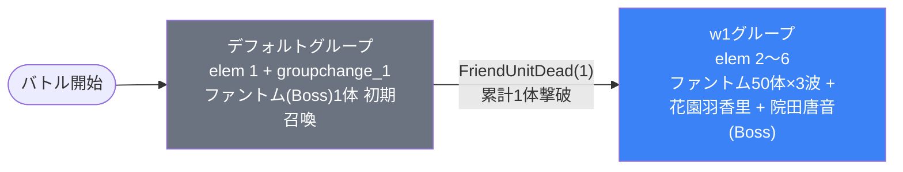

# event_kim1_savage_00001 インゲームデータ詳細解説

> 参照リポジトリ: `projects/glow-masterdata`
> リリースキー: 202602020
> 本ファイルはMstAutoPlayerSequenceが7行のイベントクエスト（savage）全データ設定を解説する

---

## 概要

event_kim1_savage_00001はkim1シリーズのイベントクエスト・サベッジ（上級）難度であり、砦破壊型バトルとして設計されている。砦HPは120,000に設定され、ダメージ有効（is_damage_invalidationが空）のため、プレイヤーは敵をさばきつつ砦を直接攻撃して破壊することがクリア条件となる。BGMにはSSE_SBG_003_007が使用され、ボス専用BGMは設定されていない。

グループ構成はデフォルトグループとw1の2グループというシンプルな構造をとる。デフォルトグループではバトル開始6秒後にBossオーラ付きのファントム（青属性）が1体出現し、累計1体撃破でw1グループへ切り替わる。w1グループではファントム雑魚が大量に押し寄せ、時間差でボス級キャラクター2種（花園羽香里・院田唐音）が投入される構成となっている。

使用する敵は3種類で、すべて青属性で統一されている。MstInGameI18nの説明文では「青属性の敵が登場するので黄属性のキャラは有利に戦うこともできるぞ!」と案内されており、黄属性パーティが推奨される。ファントム（雑魚）はhp倍率0.6・atk倍率2.5と控えめだが、50体を短間隔で連続召喚するため物量で圧迫する設計である。一方、花園羽香里はhp倍率6・atk倍率3.4のやや強めの耐久型、院田唐音はhp倍率7・atk倍率2.5かつBossオーラ付きの高耐久ボスとして登場する。

さらに、コマフィールドには攻撃DOWNコマが多数配置されており、3行10コマ中5コマにAttackPowerDown（50%）が設定されている。攻撃DOWNコマ無効化の特性を持つキャラクターの編成が推奨される。また、スピードアタックルールが適用されているため、早くクリアするほど報酬が増える仕組みとなっている。

---

## 関連テーブル設定

### MstInGame

| カラム | 値 |
|--------|-----|
| `id` | `event_kim1_savage_00001` |
| `mst_auto_player_sequence_set_id` | `event_kim1_savage_00001` |
| `bgm_asset_key` | `SSE_SBG_003_007` |
| `boss_bgm_asset_key` | （空） |
| `loop_background_asset_key` | （空） |
| `player_outpost_asset_key` | （空） |
| `mst_page_id` | `event_kim1_savage_00001` |
| `mst_enemy_outpost_id` | `event_kim1_savage_00001` |
| `mst_defense_target_id` | （空） |
| `boss_mst_enemy_stage_parameter_id` | `1` ← ボスはシーケンスで出す |
| `boss_count` | （空） |
| `normal_enemy_hp_coef` | `1.0` |
| `normal_enemy_attack_coef` | `1.0` |
| `normal_enemy_speed_coef` | `1` |
| `boss_enemy_hp_coef` | `1.0` |
| `boss_enemy_attack_coef` | `1.0` |
| `boss_enemy_speed_coef` | `1` |
| `release_key` | `202602020` |

### MstEnemyOutpost（敵砦）

| カラム | 値 | 意味 |
|--------|-----|------|
| `id` | `event_kim1_savage_00001` | |
| `hp` | `120,000` | 12万HP（破壊可能） |
| `is_damage_invalidation` | （空） | **ダメージ有効**（砦が壊れる砦破壊モード） |
| `outpost_asset_key` | `kim_enemy_0001` | 敵砦アセット |
| `artwork_asset_key` | （空） | |
| `release_key` | `202602020` | |

### MstPage + MstKomaLine（コマフィールド）

3行構成。攻撃DOWNコマが多数配置されている。

```
row=1  height=0.55  layout=12.0  (4コマ: 0.25 / 0.25 / 0.25 / 0.25)
  koma1: glo_00011  width=0.25  bg_offset=-1.0  effect=None
  koma2: glo_00011  width=0.25  bg_offset=-1.0  effect=None
  koma3: glo_00011  width=0.25  bg_offset=-1.0  effect=AttackPowerDown  ← 攻撃DOWN（param1=50, target=Player）
  koma4: glo_00011  width=0.25  bg_offset=-1.0  effect=AttackPowerDown  ← 攻撃DOWN（param1=50, target=Player）

row=2  height=0.55  layout=7.0  (3コマ: 0.33 / 0.34 / 0.33)  ← コマ効果あり
  koma1: glo_00011  width=0.33  bg_offset=+0.3  effect=AttackPowerDown  ← 攻撃DOWN（param1=50, target=Player）
  koma2: glo_00011  width=0.34  bg_offset=+0.3  effect=None
  koma3: glo_00011  width=0.33  bg_offset=+0.3  effect=AttackPowerDown  ← 攻撃DOWN（param1=50, target=Player）

row=3  height=0.55  layout=8.0  (3コマ: 0.5 / 0.25 / 0.25)  ← コマ効果あり
  koma1: glo_00011  width=0.5   bg_offset=+0.7  effect=AttackPowerDown  ← 攻撃DOWN（param1=50, target=Player）
  koma2: glo_00011  width=0.25  bg_offset=+0.7  effect=None
  koma3: glo_00011  width=0.25  bg_offset=+0.7  effect=None
```

> **全10コマ中5コマに攻撃DOWNコマ（param1=50, target=Player）が配置**。プレイヤーキャラが通過すると攻撃力が50%DOWNする。MstInGameI18nでも「攻撃DOWNコマが登場するぞ! 特性で攻撃DOWNコマ無効化を持っているキャラを編成しよう!」と明記されている。

### MstInGameI18n（バトル説明文）

**result_tips（バトルヒント）:**
> 攻撃DOWNコマ無効を持っているキャラを強化して編成してみよう!

**description（ステージ説明）:**
> 【属性情報】
> 青属性の敵が登場するので黄属性のキャラは有利に戦うこともできるぞ!
>
> 【コマ効果情報】
> 攻撃DOWNコマが登場するぞ!
> 特性で攻撃DOWNコマ無効化を持っているキャラを編成しよう!
>
> また、このステージではスピードアタックルールがあるぞ!
> 早くクリアすると報酬ゲット!

---

## 使用する敵パラメータ（MstEnemyStageParameter）一覧

3種類の敵パラメータを使用。`c_` プレフィックスはキャラ個別ID、`e_` は汎用敵。すべて**青属性**で統一されている。
IDの命名規則: `{c_/e_}{キャラID}_kim1_savage_{kind}_{color}`

### カラム解説

| カラム名（略称） | DBカラム名 | 説明 |
|---------------|-----------|------|
| id | id | MstEnemyStageParameterの主キー |
| キャラID | mst_enemy_character_id | 紐付くキャラモデル・スキルの参照元 |
| kind | character_unit_kind | `Normal`（通常敵）/ `Boss`（ボス）。UIオーラ表示に影響 |
| role | role_type | 属性相性の役職（Attack/Technical/Defense/Support） |
| color | color | 属性色（Red/Yellow/Green/Blue/Colorless） |
| sort_order | sort_order | ゲーム内表示順 |
| base_hp | hp | ベースHP（`enemy_hp_coef` 乗算前の素値） |
| base_atk | attack_power | ベース攻撃力（`enemy_attack_coef` 乗算前の素値） |
| base_spd | move_speed | 移動速度（数値が大きいほど速い） |
| well_dist | well_distance | 攻撃射程（コマ単位） |
| combo | attack_combo_cycle | 攻撃コンボ数（1=単発） |
| knockback | damage_knock_back_count | 被攻撃時ノックバック回数（0=ノックバックなし） |
| ability | mst_unit_ability_id1 | 特殊アビリティID |
| drop_bp | drop_battle_point | 基本ドロップバトルポイント |

### 全3種類の詳細パラメータ

| MstEnemyStageParameter ID | 日本語名 | キャラID | kind | role | color | sort | base_hp | base_atk | base_spd | well_dist | combo | knockback | ability | drop_bp |
|--------------------------|---------|---------|------|------|-------|------|---------|---------|---------|-----------|-------|-----------|---------|---------|
| `e_glo_00001_kim1_savage_Normal_Blue` | ファントム | enemy_glo_00001 | Normal | Defense | Blue | 1 | 100,000 | 200 | 32 | 0.17 | 1 | 2 | （空） | 30 |
| `c_kim_00101_kim1_savage01_Boss_Blue` | 花園 羽香里 | chara_kim_00101 | Boss | Attack | Blue | 2 | 100,000 | 500 | 30 | 0.27 | 7 | 2 | （空） | 200 |
| `c_kim_00201_kim1_savage01_Boss_Blue` | 院田 唐音 | chara_kim_00201 | Boss | Technical | Blue | 3 | 100,000 | 500 | 35 | 0.30 | 5 | 2 | （空） | 200 |

> **実際のHP・ATKは `base × MstAutoPlayerSequence.enemy_hp_coef` で決まる。**
> 例: ファントム（base_hp=100,000）を hp倍0.6 で出すと実HP = **60,000**

### 敵パラメータの特性解説

#### ファントム（雑魚）vs ボス2種比較

| 項目 | ファントム（Normal_Blue） | 花園 羽香里（Boss_Blue） | 院田 唐音（Boss_Blue） |
|------|--------------------------|-------------------------|------------------------|
| kind | Normal（オーラなし） | **Boss**（オーラUI表示あり） | **Boss**（オーラUI表示あり） |
| base_hp | 100,000 | 100,000 | 100,000 |
| role | **Defense**（防御型） | **Attack**（攻撃型） | **Technical**（技巧型） |
| color | Blue | Blue | Blue |
| base_spd | 32（中速） | 30（中速） | **35**（高速） |
| well_dist | 0.17 | **0.27**（射程やや長い） | **0.30**（射程最長） |
| combo | 1（単発） | **7**（7コンボ） | **5**（5コンボ） |
| knockback | 2 | 2 | 2 |
| ability | なし | なし | なし |
| drop_bp | 30 | 200 | 200 |

> **ファントムの特徴**: base_hp=100,000だがhp倍率0.6で使用されるため実HP=60,000と控えめ。ただし50体を短間隔で連続召喚するため物量が脅威。Defense型で防御寄りのステータス。

> **花園 羽香里の特徴**: Attack型ボスで7コンボの連続攻撃が強力。base_atk=500 × atk倍率3.4 で実攻撃力1,700。hp倍率6で実HP=600,000の高耐久。

> **院田 唐音の特徴**: Technical型ボスでBossオーラ付き。base_spd=35（高速）で最も移動が速く、well_dist=0.30の最長射程を持つ。hp倍率7で実HP=700,000と3種中最も高耐久。5コンボの連撃を繰り出す。

---

## グループ構造の全体フロー



> **シンプルな2グループ構成**: デフォルトグループで初期ボス1体が出現し、1体撃破でw1へ即座に移行。w1では大量のファントム雑魚と2種のボスが時間差で投入される直線的な構造。ループや並行グループは存在しない。

---

## 全7行の詳細データ（グループ単位）

### デフォルトグループ（elem 1, groupchange_1）

バトル開始と同時にBossオーラ付きファントムが1体召喚される。**累計1体撃破でw1へ切り替わる**。

| id | elem | 条件 | アクション | 召喚数 | interval(ms) | summon_anim | summon_pos | move_start | aura | hp倍 | atk倍 | spd倍 | override_bp | defeated_score | 説明 |
|----|------|------|-----------|--------|-------------|-------------|------------|-----------|------|------|------|------|------------|----------------|------|
| `_1` | 1 | InitialSummon(0) | `e_glo_00001_kim1_savage_Normal_Blue` | 1 | 0 | None | 1.8 | ElapsedTime(600) | **Boss** | 3 | 13 | 1 | 0 | 0 | バトル開始直後にファントム（Boss）1体召喚。pos=1.8の遠方に配置、6,000ms後に移動開始。実HP=300,000 |
| `_2` | groupchange_1 | **FriendUnitDead(1)** | SwitchSequenceGroup(**w1**) | — | — | — | — | — | — | — | — | — | — | — | 累計1体撃破でw1グループへ切り替え |

**ポイント:**
- elem1はInitialSummon条件で、バトル開始と同時に1体だけ出現する。Bossオーラ付きだがファントム（雑魚モデル）を使用
- hp倍率3で実HP=300,000（base_hp=100,000 × 3）、atk倍率13で実攻撃力=2,600（base_atk=200 × 13）と高火力
- summon_position=1.8の遠方に出現し、move_start_condition=ElapsedTime(600)で6秒後に移動開始。プレイヤーに準備時間を与える設計
- この1体を倒すだけでw1へ移行するため、実質的にはウォーミングアップフェーズ

---

### w1グループ（elem 2〜6）← メインバトルフェーズ

デフォルトからの切り替え直後にファントム雑魚が大量に押し寄せ、9〜10秒後にボス2種が登場。**グループ切り替え条件なし（終端グループ）**。

| id | elem | 条件 | アクション | 召喚数 | interval(ms) | summon_anim | summon_pos | aura | hp倍 | atk倍 | spd倍 | override_bp | defeated_score | 説明 |
|----|------|------|-----------|--------|-------------|-------------|------------|------|------|------|------|------------|----------------|------|
| `_3` | 2 | GroupActivated(0) | `e_glo_00001_kim1_savage_Normal_Blue` | 50 | 450 | None | — | Default | 0.6 | 2.5 | 1 | 0 | 0 | グループ開始直後にファントム（Normal）を450ms間隔で50体召喚。実HP=60,000 |
| `_4` | 3 | GroupActivated(500) | `e_glo_00001_kim1_savage_Normal_Blue` | 5 | 1,250 | **Fall4** | 0.6 | Default | 0.6 | 2.5 | 1 | 0 | 0 | グループ開始5,000ms後にファントム（Normal）をFall4演出でpos=0.6に1,250ms間隔で5体召喚 |
| `_5` | 4 | GroupActivated(700) | `e_glo_00001_kim1_savage_Normal_Blue` | 50 | 725 | None | — | Default | 0.6 | 2.5 | 1 | 0 | 0 | グループ開始7,000ms後にファントム（Normal）を725ms間隔で50体召喚。実HP=60,000 |
| `_6` | 5 | GroupActivated(1000) | `c_kim_00101_kim1_savage01_Boss_Blue` | 1 | 0 | None | — | Default | 6 | 3.4 | 1 | 0 | 0 | グループ開始10,000ms後に花園 羽香里（Boss）1体召喚。実HP=600,000 |
| `_7` | 6 | GroupActivated(900) | `c_kim_00201_kim1_savage01_Boss_Blue` | 1 | 0 | None | — | **Boss** | 7 | 2.5 | 1 | 0 | 0 | グループ開始9,000ms後に院田 唐音（Boss）1体召喚。実HP=700,000。Bossオーラ付き |

**ポイント:**
- elem2とelem5で合計100体のファントムを連続召喚する大量投入設計。elem2は450ms間隔（約22.5秒で50体）、elem5は725ms間隔（約36.2秒で50体）
- elem3はFall4（落下演出）でpos=0.6に5体を1,250ms間隔で追加。5秒後に前線付近に敵が降ってくる仕掛け
- elem6（花園 羽香里）は10秒後、elem7（院田 唐音）は9秒後に登場。院田唐音の方が1秒早く出現する
- 院田 唐音にBossオーラが付与されており、ステージのメインボスとして位置づけられている
- **w1にはgroupchangeがない**（終端グループ）。このグループの敵をすべてさばいて砦を破壊するまでバトルが続く

---

## グループ切り替えまとめ表

| 切り替え | 条件 | 遷移先 | action_delay |
|---------|------|--------|-------------|
| デフォルト → w1 | **FriendUnitDead(1)** | w1 | — |

> **極めてシンプルな遷移構造**: 初期ボス1体を撃破するだけでメインフェーズ（w1）に突入する。ループや並行グループは存在せず、w1が終端グループとして機能する。

---

## スコア体系

バトルポイントは `override_drop_battle_point` と `defeated_score` がすべて0に設定されている。ドロップバトルポイントはMstEnemyStageParameterの `drop_battle_point` 基本値が使用される。

| 敵の種類 | drop_bp（基本バトルポイント） | 備考 |
|---------|------------------------------|------|
| ファントム（Normal_Blue） | 30 | 雑魚。合計105体以上出現するため総ポイントは大きい |
| 花園 羽香里（Boss_Blue） | 200 | ボス。w1で1体のみ |
| 院田 唐音（Boss_Blue） | 200 | ボス。w1で1体のみ。Bossオーラ付き |

> **スピードアタックルール**: クリアまでの時間が早いほど追加報酬がある（description記載）。砦HP 120,000 を早期に削ることが高報酬の鍵。攻撃DOWNコマの影響を受けない編成が速度クリアのポイントとなる。

---

## この設定から読み取れる設計パターン

### 1. 砦破壊型 + スピードアタックの二重目標

`is_damage_invalidation` が空（通常ダメージ有効）で砦HP=120,000。プレイヤーは砦を**破壊することが目的**。さらにスピードアタックルールで「速さ」も評価される二重の目標設計。攻撃DOWNコマが多数配置されているため、コマ効果無効化の特性を持たないキャラクターは砦破壊速度が大幅に低下する。速度と編成の両面で戦略が問われる。

### 2. 大量召喚による物量圧殺設計

w1グループでは合計105体以上の敵（ファントム50体+5体+50体 + ボス2体）が投入される。個々の雑魚は実HP=60,000（hp倍率0.6）と控えめだが、450ms〜725ms間隔の短い召喚インターバルで次々と押し寄せる。数で圧倒する設計であり、範囲攻撃や貫通攻撃を持つキャラクターが有効となる。

### 3. 攻撃DOWNコマによるDPS制限

全10コマ中5コマにAttackPowerDown（50%）が配置されており、フィールドの半分がプレイヤーの火力を半減させるコマで構成されている。row1の後半2コマ、row2の1番目と3番目、row3の1番目に配置されており、コマ移動ルートによっては連続して攻撃DOWNを受ける可能性がある。result_tipsでも「攻撃DOWNコマ無効を持っているキャラを強化して編成してみよう!」と明示されている。

### 4. 初期ボスのウォーミングアップ設計

デフォルトグループのファントム（Bossオーラ付き）はsummon_position=1.8の遠方に配置され、6秒後に移動開始する。これによりプレイヤーに準備時間が与えられる。hp倍率3（実HP=300,000）・atk倍率13（実攻撃力=2,600）と高いパラメータだが、1体だけなので集中攻撃で倒しやすい。この1体を撃破するとすぐにw1の大量敵フェーズに突入するため、実質的なウォーミングアップとして機能している。

### 5. 時間差ボス投入による段階的圧力

w1グループでは9秒後に院田唐音（実HP=700,000, Bossオーラ）、10秒後に花園羽香里（実HP=600,000）と時間差でボスが投入される。ファントム雑魚の物量に対処している最中にボスが合流するため、プレイヤーは雑魚処理とボス対応を同時に求められる。院田唐音はbase_spd=35の高速で射程0.30と最長のため、素早く前線に到達して攻撃を開始する脅威となる。

### 6. 青属性統一による属性戦略の明確化

全敵が青属性で統一されているため、黄属性キャラクターで編成すれば全敵に対して属性有利で戦える。属性の駆け引きが複雑にならない分、コマ効果（攻撃DOWN）への対策と物量への対処に集中できるシンプルな設計となっている。
