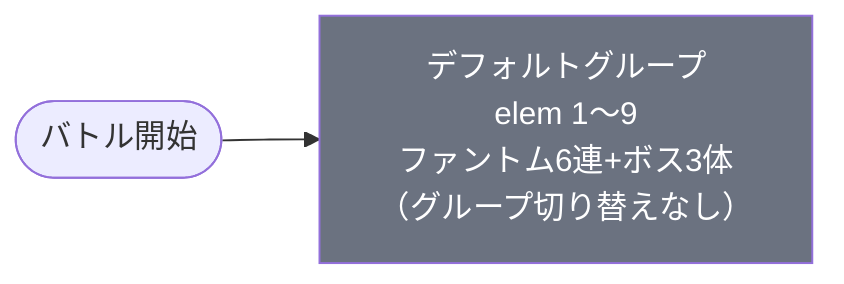

# event_kim1_savage_00002 インゲームデータ詳細解説

> 参照リポジトリ: `projects/glow-masterdata`
> リリースキー: 202602020
> 本ファイルはMstAutoPlayerSequenceが9行のイベントクエスト（savage）全データ設定を解説する

---

## 概要

event_kim1_savage_00002はkim1シリーズのイベントクエスト・サベッジ（上級）難度の砦破壊型バトルである。砦HPは150,000に設定されており、ダメージ有効の砦を破壊してクリアする形式となっている。BGMにはSSE_SBG_003_007が使用され、ボス専用BGMは設定されていない。全体の敵構成は4種類で、ファントム（黄属性雑魚）が大量に召喚される中、3体のボスキャラクター――花園羽香里（Defense）、院田唐音（Technical）、好本静（Support）――が時間差で登場する。

本ステージ最大の特徴は、花園羽香里が生存している間は砦へのダメージが無効化される「砦ダメージ無効化」ギミックである。is_summon_unit_outpost_damage_invalidationフラグが花園羽香里にのみ設定されており、この強敵を倒さない限り砦HPを削ることができない。プレイヤーはまず花園羽香里の撃破を優先し、その後に砦を攻撃するという二段階の戦略が求められる。

敵のステータス面では、ファントムのHP倍率は0.5と控えめながら、攻撃倍率が4.25と高火力に設定されている。一方でボス3体はそれぞれHP倍率3.0〜7.0と標準からやや強めの耐久力を持ち、攻撃倍率は2.2〜3.2と高火力寄りである。ファントムは速度40の非常に高速な移動力を持ち、ボス3体は速度30〜35の中速〜高速で進軍してくる。全敵が黄属性で統一されているため、緑属性キャラクターで挑むと属性有利に戦うことができる。

本ステージはデフォルトグループのみの単一グループ構成であり、ウェーブ切り替えは発生しない。バトル開始直後からファントムが連続召喚され、12秒後・20秒後・25秒後にボスが順次登場する時間経過型のシンプルな構成となっている。スピードアタックルールが適用されており、早くクリアするほど報酬が得られる。好本静が敵を回復してくるため、範囲攻撃で好本静を優先的に倒すことがバトルヒントとして提示されている。

---

## 関連テーブル設定

### MstInGame

| カラム | 値 |
|--------|-----|
| `id` | `event_kim1_savage_00002` |
| `mst_auto_player_sequence_set_id` | `event_kim1_savage_00002` |
| `bgm_asset_key` | `SSE_SBG_003_007` |
| `boss_bgm_asset_key` | （空） |
| `loop_background_asset_key` | （空） |
| `player_outpost_asset_key` | （空） |
| `mst_page_id` | `event_kim1_savage_00002` |
| `mst_enemy_outpost_id` | `event_kim1_savage_00002` |
| `mst_defense_target_id` | （空） |
| `boss_mst_enemy_stage_parameter_id` | `1` <- ボスはシーケンスで出す |
| `boss_count` | （空） |
| `normal_enemy_hp_coef` | `1.0` |
| `normal_enemy_attack_coef` | `1.0` |
| `normal_enemy_speed_coef` | `1` |
| `boss_enemy_hp_coef` | `1.0` |
| `boss_enemy_attack_coef` | `1.0` |
| `boss_enemy_speed_coef` | `1` |
| `release_key` | `202602020` |

### MstEnemyOutpost（敵砦）

| カラム | 値 | 意味 |
|--------|-----|------|
| `id` | `event_kim1_savage_00002` | |
| `hp` | `150,000` | 15万HP（破壊可能） |
| `is_damage_invalidation` | （空） | **ダメージ有効**（砦が壊れる砦破壊モード） |
| `outpost_asset_key` | `kim_enemy_0001` | 砦アセット |
| `artwork_asset_key` | （空） | |
| `release_key` | `202602020` | |

### MstPage + MstKomaLine（コマフィールド）

4行構成。全コマ効果なしのシンプルなフィールド。

```
row=1  height=0.55  layout=8.0  (3コマ: 0.5 / 0.25 / 0.25)
  koma1: glo_00011  width=0.5   bg_offset=-1.0  effect=None
  koma2: glo_00011  width=0.25  bg_offset=-1.0  effect=None
  koma3: glo_00011  width=0.25  bg_offset=-1.0  effect=None

row=2  height=0.55  layout=7.0  (3コマ: 0.33 / 0.34 / 0.33)
  koma1: glo_00011  width=0.33  bg_offset=-0.2  effect=None
  koma2: glo_00011  width=0.34  bg_offset=-0.2  effect=None
  koma3: glo_00011  width=0.33  bg_offset=-0.2  effect=None

row=3  height=0.55  layout=8.0  (3コマ: 0.5 / 0.25 / 0.25)
  koma1: glo_00011  width=0.5   bg_offset=+0.3  effect=None
  koma2: glo_00011  width=0.25  bg_offset=+0.3  effect=None
  koma3: glo_00011  width=0.25  bg_offset=+0.3  effect=None

row=4  height=0.55  layout=7.0  (3コマ: 0.33 / 0.34 / 0.33)
  koma1: glo_00011  width=0.33  bg_offset=+0.7  effect=None
  koma2: glo_00011  width=0.34  bg_offset=+0.7  effect=None
  koma3: glo_00011  width=0.33  bg_offset=+0.7  effect=None
```

> **全コマ効果なし**。毒や突風などのコマギミックは配置されておらず、純粋な戦闘に集中できるフィールド構成。

### MstInGameI18n（バトル説明文）

**result_tips（バトルヒント）:**
> 『好本 静』が敵を回復してくるぞ!範囲攻撃で『好本 静』を倒そう!

**description（ステージ説明）:**
> 【属性情報】
> 黄属性の敵が登場するので緑属性のキャラは有利に戦うこともできるぞ!
>
> 【ギミック情報】
> 時間経過でファントムが大量に出現するぞ!
> このステージでは、強敵の『花園 羽香里』が登場している時は、
> ファントムゲートHPは削れないぞ!
>
> また、このステージではスピードアタックルールがあるぞ!
> 早くクリアすると報酬ゲット!

---

## 使用する敵パラメータ（MstEnemyStageParameter）一覧

4種類の敵パラメータを使用。`c_` プレフィックスはキャラ個別ID、`e_` は汎用敵。
IDの命名規則: `{c_/e_}{キャラID}_kim1_savage{N}_{kind}_{color}`

### カラム解説

| カラム名（略称） | DBカラム名 | 説明 |
|---------------|-----------|------|
| id | id | MstEnemyStageParameterの主キー |
| キャラID | mst_enemy_character_id | 紐付くキャラモデル・スキルの参照元 |
| kind | character_unit_kind | `Normal`（通常敵）/ `Boss`（ボス）。UIオーラ表示に影響 |
| role | role_type | 属性相性の役職（Attack/Technical/Defense/Support） |
| color | color | 属性色（Red/Yellow/Green/Blue/Colorless） |
| sort_order | sort_order | ゲーム内表示順 |
| base_hp | hp | ベースHP（`enemy_hp_coef` 乗算前の素値） |
| base_atk | attack_power | ベース攻撃力（`enemy_attack_coef` 乗算前の素値） |
| base_spd | move_speed | 移動速度（数値が大きいほど速い） |
| well_dist | well_distance | 攻撃射程（コマ単位） |
| combo | attack_combo_cycle | 攻撃コンボ数（1=単発） |
| knockback | damage_knock_back_count | 被攻撃時ノックバック回数（0=ノックバックなし） |
| ability | mst_unit_ability_id1 | 特殊アビリティID |
| drop_bp | drop_battle_point | 基本ドロップバトルポイント |

### 全4種類の詳細パラメータ

| MstEnemyStageParameter ID | 日本語名 | キャラID | kind | role | color | sort | base_hp | base_atk | base_spd | well_dist | combo | knockback | ability | drop_bp |
|--------------------------|---------|---------|------|------|-------|------|---------|---------|---------|-----------|-------|-----------|---------|---------|
| `e_glo_00001_kim1_savage_Normal_Yellow` | ファントム | enemy_glo_00001 | Normal | Attack | Yellow | 4 | 100,000 | 200 | 40 | 0.2 | 1 | 2 | （空） | 30 |
| `c_kim_00101_kim1_savage02_Boss_Yellow` | 花園 羽香里 | chara_kim_00101 | Boss | Defense | Yellow | 5 | 100,000 | 500 | 30 | 0.17 | 5 | 2 | （空） | 200 |
| `c_kim_00201_kim1_savage02_Boss_Yellow` | 院田 唐音 | chara_kim_00201 | Boss | Technical | Yellow | 6 | 100,000 | 500 | 35 | 0.25 | 5 | 2 | （空） | 200 |
| `c_kim_00301_kim1_savage02_Boss_Yellow` | 好本 静 | chara_kim_00301 | Boss | Support | Yellow | 7 | 100,000 | 300 | 32 | 0.3 | 4 | 3 | （空） | 200 |

> **実際のHP・ATKは `base × MstAutoPlayerSequence.enemy_hp_coef` で決まる。**
> 例: ファントム（base_hp=100,000）を hp倍0.5 で出すと実HP = **50,000**

### 敵パラメータの特性解説

#### ボス3体の比較

| 項目 | 花園 羽香里（Defense） | 院田 唐音（Technical） | 好本 静（Support） |
|------|---------------------|----------------------|-------------------|
| kind | **Boss**（オーラUI表示あり） | **Boss**（オーラUI表示あり） | **Boss**（オーラUI表示あり） |
| base_hp | 100,000 | 100,000 | 100,000 |
| role | **Defense**（防御型） | **Technical**（技巧型） | **Support**（サポート型） |
| color | Yellow | Yellow | Yellow |
| base_spd | 30（中速） | **35**（高速） | 32（中速） |
| well_dist | **0.17**（短射程） | 0.25 | **0.3**（長射程） |
| combo | 5コンボ | 5コンボ | 4コンボ |
| knockback | 2 | 2 | **3**（ノックバックされやすい） |
| drop_bp | 200 | 200 | 200 |
| 特殊フラグ | **砦ダメージ無効化** | なし | なし |

> **花園羽香里の最大の特徴**: MstAutoPlayerSequenceの `is_summon_unit_outpost_damage_invalidation=1` が設定されており、花園羽香里が生存中はプレイヤーが砦にダメージを与えられない。花園羽香里を倒すことがクリアへの必須条件。HP倍率7.0で実HP=700,000と3体中最高の耐久力を持つ。

> **好本静の役割**: result_tipsで「敵を回復してくる」と明記されている。Support型として他の敵を回復する能力を持ち、放置すると戦線が膠着する。well_dist=0.3と長射程で後方から支援するタイプ。knockback=3でノックバックされやすく、範囲攻撃で倒すことが推奨されている。

> **院田唐音の特徴**: 3体中最速のbase_spd=35。Technical型で攻撃力base_atk=500と花園羽香里と同等。HP倍率3.0で実HP=300,000と3体中最低の耐久力だが、攻撃倍率3.2と最高火力。

#### ファントム（汎用雑魚）の特徴

| 項目 | ファントム（黄属性/Normal） |
|------|--------------------------|
| role | **Attack**（攻撃型） |
| color | Yellow |
| base_spd | **40**（非常に高速） |
| combo | 1（単発） |
| knockback | 2 |
| drop_bp | 30 |

> ファントムはbase_spd=40と非常に高速で、大量に召喚される。HP倍率0.5で実HP=50,000と控えめだが、攻撃倍率4.25で実ATK=850と高火力。数の暴力でプレイヤーを圧倒する設計。

---

## グループ構造の全体フロー



> **単一グループ構成**: 本ステージはデフォルトグループのみで構成されており、SwitchSequenceGroupによるグループ切り替えは一切発生しない。全9行のシーケンスがすべてデフォルトグループに属し、ElapsedTime条件による時間経過で敵が順次登場する。ウェーブ制ではなく、タイムライン型の敵出現パターンとなっている。

---

## 全9行の詳細データ（グループ単位）

### デフォルトグループ（elem 1〜9）

バトル開始直後からファントムが連続召喚され、12秒後・20秒後・25秒後にボス3体が順次登場する。グループ切り替えなし。

| id | elem | 条件 | アクション | 召喚数 | interval(ms) | aura | hp倍 | atk倍 | spd倍 | override_bp | 砦ダメージ無効 | 説明 |
|----|------|------|-----------|--------|-------------|------|------|------|------|------------|------------|------|
| `_1` | 1 | ElapsedTime(0) | `e_glo_00001_..._Normal_Yellow` | 60 | 500 | Default | 0.5 | 4.25 | 1 | 5 | — | バトル開始直後にファントム（黄/Normal）を500ms間隔で60体召喚。実HP=50,000 |
| `_2` | 2 | ElapsedTime(1000) | `e_glo_00001_..._Normal_Yellow` | 60 | 800 | Default | 0.5 | 4.25 | 1 | 5 | — | 10秒後にファントムを800ms間隔で60体召喚 |
| `_3` | 3 | ElapsedTime(1600) | `e_glo_00001_..._Normal_Yellow` | 60 | 820 | Default | 0.5 | 4.25 | 1 | 5 | — | 16秒後にファントムを820ms間隔で60体召喚 |
| `_4` | 4 | ElapsedTime(2100) | `e_glo_00001_..._Normal_Yellow` | 60 | 830 | Default | 0.5 | 4.25 | 1 | 5 | — | 21秒後にファントムを830ms間隔で60体召喚 |
| `_5` | 5 | ElapsedTime(2800) | `e_glo_00001_..._Normal_Yellow` | 60 | 900 | Default | 0.5 | 4.25 | 1 | 5 | — | 28秒後にファントムを900ms間隔で60体召喚 |
| `_6` | 6 | ElapsedTime(3600) | `e_glo_00001_..._Normal_Yellow` | 60 | 920 | Default | 0.5 | 4.25 | 1 | 5 | — | 36秒後にファントムを920ms間隔で60体召喚 |
| `_7` | 7 | ElapsedTime(1200) | `c_kim_00101_..._Boss_Yellow` | 1 | — | Default | 7 | 2.2 | 1 | — | **あり** | **12秒後に花園羽香里（Boss/Defense）1体出現。実HP=700,000。砦ダメージ無効化** |
| `_8` | 8 | ElapsedTime(2000) | `c_kim_00201_..._Boss_Yellow` | 1 | — | Default | 3 | 3.2 | 1 | — | — | 20秒後に院田唐音（Boss/Technical）1体出現。実HP=300,000 |
| `_9` | 9 | ElapsedTime(2500) | `c_kim_00301_..._Boss_Yellow` | 1 | — | Default | 4 | 2.2 | 1 | — | — | 25秒後に好本静（Boss/Support）1体出現。実HP=400,000 |

**ポイント:**
- elem1〜6: ファントム6連召喚ライン。合計最大360体が時間差で投入される。開始直後（0秒）から36秒後まで段階的に召喚レーンが追加されていく
- elem1のinterval=500msが最も短く、最初のレーンから最速でファントムが流れてくる。後半のレーンほどintervalが800〜920msに緩やかになる
- elem7: 花園羽香里は12秒後に登場。`is_summon_unit_outpost_damage_invalidation=1` により、生存中は砦へのダメージが完全無効化される。HP倍率7.0で実HP=700,000は本ステージ最高の耐久力
- elem8: 院田唐音は20秒後に登場。HP倍率3.0（実HP=300,000）だが攻撃倍率3.2で最高火力
- elem9: 好本静は25秒後に最後に登場。HP倍率4.0（実HP=400,000）で敵回復能力を持つ。早期撃破が推奨される
- 全敵のspd倍は1で、MstEnemyStageParameterのbase_spdがそのまま適用される

**タイムライン:**
```
 0秒: ファントムレーン1開始（500ms間隔×60体）
10秒: ファントムレーン2開始（800ms間隔×60体）
12秒: 花園羽香里 登場（砦ダメージ無効化開始）
16秒: ファントムレーン3開始（820ms間隔×60体）
20秒: 院田唐音 登場
21秒: ファントムレーン4開始（830ms間隔×60体）
25秒: 好本静 登場（敵回復開始）
28秒: ファントムレーン5開始（900ms間隔×60体）
36秒: ファントムレーン6開始（920ms間隔×60体）
```

---

## グループ切り替えまとめ表

| 切り替え | 条件 | 遷移先 | action_delay |
|---------|------|--------|-------------|
| （なし） | — | — | — |

> **本ステージにはグループ切り替えが存在しない。** デフォルトグループのみの単一構成であり、SwitchSequenceGroup行は0行。すべての敵がElapsedTime条件で時間経過に基づいて召喚される。

---

## スコア体系

バトルポイントは `override_drop_battle_point`（MstAutoPlayerSequence設定値）が優先される。

| 敵の種類 | override_bp（獲得バトルポイント） | 備考 |
|---------|----------------------------------|------|
| ファントム（Normal_Yellow）全レーン | 5 | 各レーン共通。低単価だが大量に出現 |
| 花園 羽香里（Boss_Yellow） | —（MstEnemyStageParameterのdrop_bp=200を使用） | override未設定のためベース値 |
| 院田 唐音（Boss_Yellow） | —（MstEnemyStageParameterのdrop_bp=200を使用） | override未設定のためベース値 |
| 好本 静（Boss_Yellow） | —（MstEnemyStageParameterのdrop_bp=200を使用） | override未設定のためベース値 |

> **スピードアタックルール**: クリアまでの時間が早いほど追加報酬がある（description記載）。花園羽香里を素早く倒し、砦HP 150,000 を早期に削ることが高報酬の鍵。

---

## この設定から読み取れる設計パターン

### 1. 砦ダメージ無効化ギミックによるボス撃破強制

花園羽香里に `is_summon_unit_outpost_damage_invalidation=1` が設定されており、花園羽香里が生存している間は砦へのダメージが一切通らない。プレイヤーは砦を直接攻撃するのではなく、まず花園羽香里を撃破することが必須となる。HP倍率7.0で実HP=700,000の高耐久であり、倒すにはかなりの戦力が必要。この「砦を壊す前にボスを倒す」という二段階目標がステージの核心となっている。

### 2. 大量召喚による時間圧力

ファントムが6レーンから最大360体召喚される超大量召喚設計。各レーンのintervalは500ms〜920msと短く、画面上に常に多数のファントムが存在する状態が続く。ファントムのbase_spd=40は非常に高速で、atk倍4.25で実ATK=850と高火力のため、処理が追いつかないとプレイヤーは圧倒される。スピードアタックルールと相まって、効率的な範囲攻撃が求められる。

### 3. 敵回復ギミックによる持久戦化

好本静がSupport型として敵を回復する能力を持ち、result_tipsで「範囲攻撃で好本静を倒そう!」と対処法が示されている。好本静を放置すると花園羽香里や院田唐音のHPが回復され、撃破に時間がかかり砦攻撃がさらに遅延する。好本静はknockback=3でノックバックされやすく、well_dist=0.3の長射程から後方で回復するため、範囲攻撃で効率的に処理する設計意図が読み取れる。

### 4. ボスの役割分担による多面的脅威

3体のボスがDefense（花園羽香里）・Technical（院田唐音）・Support（好本静）と異なるrole_typeで役割分担されている。花園羽香里は砦ダメージ無効化で進行を阻止し、院田唐音はatk倍3.2で最高火力のダメージディーラーとして機能し、好本静は敵回復で持久戦に持ち込む。3体が連携して多面的にプレイヤーを脅威にさらす設計。

### 5. 単一グループ構成によるシンプルさ

グループ切り替えが一切なく、全敵がElapsedTime条件で時間経過に基づいて登場する。ウェーブ制の複雑なグループ遷移がないため、プレイヤーは「いつ何が来るか」をタイムラインで予測しやすい。その代わりにファントムの大量召喚と砦ダメージ無効化ギミックで難易度を確保しており、「構造はシンプル、ギミックで難しい」というアプローチを取っている。

### 6. 属性統一による明確な攻略指針

全敵が黄属性（Yellow）で統一されており、descriptionで「緑属性のキャラは有利に戦うこともできるぞ!」と明示されている。属性相性がシンプルかつ明確で、プレイヤーの編成判断を容易にしている。savage難度の上級コンテンツでありながら、属性選択という基本的な攻略指針を提供する設計となっている。
