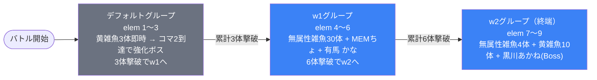

# event_osh1_savage_00001 インゲームデータ詳細解説

> 参照リポジトリ: `projects/glow-masterdata`
> リリースキー: 202512020
> 本ファイルはMstAutoPlayerSequenceが11行のイベントクエスト（savage）全データ設定を解説する

---

## 概要

**osh1シリーズのイベントクエスト・サベッジ（上級）難度**（砦破壊型バトル）。

- 砦のHP: 100,000 でダメージ有効（砦を壊してクリアするモード）
- BGM: `SSE_SBG_003_009` / ボスBGMなし
- MstInGame の `boss_mst_enemy_stage_parameter_id` に `1` が設定されているが、ボスはすべてMstAutoPlayerSequenceから召喚
- グループ: デフォルト + w1〜w2 の3グループ（ループなし・直列遷移型）
- 使用する敵の種類: 5種類（`c_osh_00501` ボス1種 + `c_osh_00401` / `c_osh_00301` 中ボス2種 + `e_glo_00002` 雑魚2種）
- コマに火傷効果あり。スタン攻撃・攻撃UPギミックを持つ敵が登場
- このステージには「特別ルール」の記載あり（result_tips に火傷軽減キャラ推奨）

---

## 関連テーブル設定

### MstInGame

| カラム | 値 |
|--------|-----|
| `id` | `event_osh1_savage_00001` |
| `mst_auto_player_sequence_set_id` | `event_osh1_savage_00001` |
| `bgm_asset_key` | `SSE_SBG_003_009` |
| `boss_bgm_asset_key` | （空） |
| `mst_page_id` | `event_osh1_savage_00001` |
| `mst_enemy_outpost_id` | `event_osh1_savage_00001` |
| `boss_mst_enemy_stage_parameter_id` | `1` ← ボスはシーケンスで出す |
| `boss_count` | （空） |
| `normal_enemy_hp_coef` | `1` |
| `normal_enemy_attack_coef` | `1` |
| `normal_enemy_speed_coef` | `1` |
| `boss_enemy_hp_coef` | `1` |
| `boss_enemy_attack_coef` | `1` |
| `boss_enemy_speed_coef` | `1` |

### MstEnemyOutpost（敵砦）

| カラム | 値 | 意味 |
|--------|-----|------|
| `id` | `event_osh1_savage_00001` | |
| `hp` | `100,000` | 10万HP（破壊可能） |
| `is_damage_invalidation` | （空） | **ダメージ有効**（砦が壊れるノーマルモード） |
| `artwork_asset_key` | `osh_0001` | 背景アートワーク |

### MstPage + MstKomaLine（コマフィールド）

4行構成。1行目はシンプル2コマ、2行目は1コマ（火傷あり）、3行目は3コマ（火傷2つ）、4行目は3コマ。

```
row=1  height=0.55  layout=1   (2コマ: 0.25 / 0.75)
  koma1: osh_00001  width=0.25  bg_offset=-1.0  effect=None
  koma2: osh_00001  width=0.75  bg_offset=-1.0  effect=None

row=2  height=0.55  layout=1   (1コマ: 1.0)             ← 火傷コマあり
  koma1: osh_00001  width=1.0   bg_offset=+0.3  effect=Burn  ← 火傷（param1=100, param2=1000, target=Player）

row=3  height=0.55  layout=10  (3コマ: 0.25 / 0.25 / 0.5)  ← 火傷コマ2つ
  koma1: osh_00001  width=0.25  bg_offset=+0.7  effect=Burn  ← 火傷（param1=100, param2=1000, target=Player）
  koma2: osh_00001  width=0.25  bg_offset=+0.7  effect=Burn  ← 火傷（param1=100, param2=1000, target=Player）
  koma3: osh_00001  width=0.5   bg_offset=+0.7  effect=None

row=4  height=0.55  layout=11  (3コマ: 0.4 / 0.2 / 0.4)
  koma1: osh_00001  width=0.4   bg_offset=-0.6  effect=Burn  ← 火傷（param1=100, param2=1000, target=Player）
  koma2: osh_00001  width=0.2   bg_offset=-0.6  effect=None
  koma3: osh_00001  width=0.4   bg_offset=-0.6  effect=None
```

> **コマ効果はすべて `target=Player`（自軍への影響）**。プレイヤーキャラが通過すると火傷ダメージを受ける。result_tips でも「火傷ダメージ軽減のキャラを編成しよう!」と明記されている。

### MstInGameI18n（バトル説明文）

**result_tips（バトルヒント）:**
> 火傷ダメージ軽減のキャラを編成してみよう!

**description（ステージ説明）:**
> 【属性情報】
> 黄属性の敵が登場するので緑属性のキャラは有利に戦うこともできるぞ!
> さらに、無属性の敵も登場するぞ!
>
> 【コマ効果情報】
> 火傷コマが登場するぞ!
> 特性で火傷ダメージ軽減を持っているキャラを編成しよう!
>
> 【ギミック情報】
> 敵自身の攻撃UPをしてくる敵や
> スタン攻撃をしてくる敵が登場するぞ!
> 特性でスタン攻撃無効化を持っているキャラを編成しよう!
>
> また、このステージでは特別ルールがあるぞ!

---

## 使用する敵パラメータ（MstEnemyStageParameter）一覧

5種類の敵パラメータを使用。`c_` プレフィックスはキャラ個別ID、`e_` は汎用敵。
IDの命名規則: `{c_/e_}{キャラID}_osh1savage01_{kind}_{color}`

### カラム解説

| カラム名（略称） | DBカラム名 | 説明 |
|---------------|-----------|------|
| id | id | MstEnemyStageParameterの主キー |
| キャラID | mst_enemy_character_id | 紐付くキャラモデル・スキルの参照元 |
| kind | character_unit_kind | `Normal`（通常敵）/ `Boss`（ボス）。UIオーラ表示に影響 |
| role | role_type | 属性相性の役職（Attack/Technical/Defense/Support） |
| color | color | 属性色（Red/Yellow/Green/Blue/Colorless） |
| sort_order | sort_order | ゲーム内表示順 |
| base_hp | hp | ベースHP（`enemy_hp_coef` 乗算前の素値） |
| base_atk | attack_power | ベース攻撃力（`enemy_attack_coef` 乗算前の素値） |
| base_spd | move_speed | 移動速度（数値が大きいほど速い） |
| well_dist | well_distance | 攻撃射程（コマ単位） |
| combo | attack_combo_cycle | 攻撃コンボ数（1=単発） |
| knockback | damage_knock_back_count | 被攻撃時ノックバック回数（0=ノックバックなし） |
| ability | mst_unit_ability_id1 | 特殊アビリティID |
| drop_bp | drop_battle_point | 基本ドロップバトルポイント |

### 全5種類の詳細パラメータ

| MstEnemyStageParameter ID | 日本語名 | キャラID | kind | role | color | sort | base_hp | base_atk | base_spd | well_dist | combo | knockback | ability | drop_bp |
|--------------------------|---------|---------|------|------|-------|------|---------|---------|---------|-----------|-------|-----------|---------|---------|
| `c_osh_00501_osh1savage01_Boss_Yellow` | 黒川あかね | chara_osh_00501 | Boss | Technical | Yellow | 40 | 100,000 | 300 | 30 | 0.26 | 8 | 1 | （空） | 200 |
| `c_osh_00401_osh1savage01_Normal_Yellow` | 有馬 かな | chara_osh_00401 | Normal | Technical | Yellow | 38 | 50,000 | 300 | 36 | 0.24 | 6 | 2 | （空） | 200 |
| `c_osh_00301_osh1savage01_Normal_Yellow` | MEMちょ | chara_osh_00301 | Normal | Support | Yellow | 35 | 50,000 | 300 | 30 | 0.27 | 5 | 2 | （空） | 200 |
| `e_glo_00002_osh1savage01_Normal_Yellow` | 推し活ファントム（黄） | enemy_glo_00002 | Normal | Attack | Yellow | 28 | 10,000 | 500 | 35 | 0.17 | 1 | 2 | （空） | 100 |
| `e_glo_00002_osh1savage01_Normal_Colorless` | 推し活ファントム（無属性） | enemy_glo_00002 | Normal | Defense | Colorless | 30 | 50,000 | 100 | 32 | 0.12 | 1 | 1 | （空） | 100 |

> **実際のHP・ATKは `base × MstAutoPlayerSequence.enemy_hp_coef` で決まる。**
> 例: 黒川あかね（base_hp=100,000）を hp倍4 で出すと実HP = **400,000**

### 敵パラメータの特性解説

#### ボス（黒川あかね）vs 中ボス2種（有馬 かな / MEMちょ）比較

| 項目 | 黒川あかね（Boss_Yellow） | 有馬 かな（Normal_Yellow） | MEMちょ（Normal_Yellow） |
|------|--------------------------|--------------------------|--------------------------|
| kind | **Boss** | Normal | Normal |
| base_hp | **100,000** | 50,000 | 50,000 |
| role | Technical | Technical | Support |
| color | Yellow | Yellow | Yellow |
| base_spd | 30（遅め） | **36**（最速） | 30（遅め） |
| well_dist | 0.26 | 0.24 | **0.27**（最長射程） |
| combo | **8**（8コンボ） | **6**（6コンボ） | **5**（5コンボ） |
| knockback | 1 | 2 | 2 |
| drop_bp | 200 | 200 | 200 |

> **3キャラすべてがYellow属性**（osh1シリーズ統一）。緑属性のプレイヤーキャラが属性有利となる。
> **ボス 黒川あかね** は base_hp=100,000 で MstEnemyStageParameter 単体でも砦と同HP。combo=8 の連続攻撃が特徴的。
> **有馬 かな** は move_speed=36 でキャラ中最速。距離を詰めるのが速い。
> **MEMちょ** は well_distance=0.27 で最長射程のサポートキャラ。

#### 雑魚2種（推し活ファントム）の比較

| 項目 | 推し活ファントム（黄/Normal） | 推し活ファントム（無属性/Normal） |
|------|------------------------------|----------------------------------|
| role | **Attack**（攻撃型） | **Defense**（防御型） |
| color | Yellow | Colorless |
| base_hp | 10,000（低HP） | **50,000**（5倍高HP） |
| base_atk | **500**（高火力） | 100（低火力） |
| base_spd | **35**（速い） | 32 |
| well_dist | 0.17 | 0.12 |
| combo | 1（単発） | 1（単発） |
| knockback | **2** | 1 |
| drop_bp | 100 | 100 |

> 黄属性ファントムは **低HP・高ATK・高速** のアタッカー型。base_hp=10,000 と低いが enemy_hp_coef 倍率で強化される。
> 無属性ファントムは **高HP・低ATK** の壁役（Defense型）。突破されにくい囮として機能する。

---

## グループ構造の全体フロー



> **ループなし・直列型**: このコンテンツはデフォルト → w1 → w2 の3グループを一方向に進む。w2は終端グループ（groupchange行なし）。
>
> **デフォルトグループの注意点**: elem2（`EnterTargetKomaIndex(2)` / 30体）とelem3（同条件 / Boss aura強化体）が同一のコマ到達条件。条件が成立した瞬間に両者が同時に処理される。
>
> **w1の大量召喚**: elem4 で無属性雑魚を30体、600ms間隔で連続召喚（interval=600）。合計約18秒かけて送り込む。

---

## 全11行の詳細データ（グループ単位）

### デフォルトグループ（elem 1〜3, groupchange_1）

バトル開始直後に黄属性ファントム3体を100ms間隔で召喚。コマ2番目に到達すると追加で30体+強化体が出現。**累計3体撃破でw1へ切り替わる**。

| id | elem | 条件 | アクション | 召喚数 | interval | aura | hp倍 | atk倍 | override_bp | 説明 |
|----|------|------|-----------|--------|----------|------|------|-------|-------------|------|
| `_1` | 1 | ElapsedTime(0) | `e_glo_00002_osh1savage01_Normal_Yellow` | 3 | 100 | Default | 3.5 | 1.5 | （空） | バトル開始直後に黄ファントム3体を100ms間隔で召喚。実HP=35,000 |
| `_2` | 2 | EnterTargetKomaIndex(2) | `e_glo_00002_osh1savage01_Normal_Yellow` | 30 | 650 | Default | 3.5 | 1.5 | （空） | コマ2番目到達時に黄ファントム30体を650ms間隔で連続召喚。実HP=35,000 |
| `_3` | 3 | EnterTargetKomaIndex(2) | `e_glo_00002_osh1savage01_Normal_Yellow` | 1 | 0 | **Boss** | 7 | 3 | （空） | コマ2番目到達時に黄ファントム強化版（Boss aura）を1体召喚。action_delay=120ms。実HP=70,000 |
| `_4` | groupchange_1 | **FriendUnitDead(3)** | SwitchSequenceGroup(w1) | — | — | — | — | — | — | 累計3体撃破でw1グループへ切り替え |

**ポイント:**
- elem1: バトル開始直後（ElapsedTime=0）に黄ファントム3体を即時送り込む。条件値が0なのでバトル開始と同時に発動
- elem2とelem3は同じ `EnterTargetKomaIndex(2)` 条件。コマ2番目到達で同時発動する（elem3はaction_delay=120msの微小遅延）
- elem3はaura=Boss（ボスオーラ演出）で hp倍7 = 実HP=70,000。黄ファントムの base_hp=10,000 なので倍率7倍で強化
- groupchange_1 の FriendUnitDead(3) は elem1の3体が撃破されるだけで発動するため、コマ2到達前にw1に移行するケースもある

---

### w1グループ（elem 4〜7, groupchange_1）

グループ切り替え直後に無属性ファントム30体の大量召喚がスタート。3秒後にMEMちょ、5秒後に有馬 かなが登場。**累計6体撃破でw2へ切り替わる**。

| id | elem | 条件 | アクション | 召喚数 | interval | aura | hp倍 | atk倍 | override_bp | 説明 |
|----|------|------|-----------|--------|----------|------|------|-------|-------------|------|
| `_5` | 4 | ElapsedTimeSinceSequenceGroupActivated(0) | `e_glo_00002_osh1savage01_Normal_Colorless` | 30 | 600 | Default | 1.4 | 6 | （空） | グループ起動直後に無属性ファントム30体を600ms間隔で連続召喚。実HP=70,000 |
| `_6` | 5 | ElapsedTimeSinceSequenceGroupActivated(300) | `c_osh_00301_osh1savage01_Normal_Yellow` | 1 | 0 | **Boss** | 3 | 3 | （空） | グループ起動3,000ms後にMEMちょ（Normal_Yellow）1体。Boss aura。実HP=150,000 |
| `_7` | 6 | ElapsedTimeSinceSequenceGroupActivated(500) | `c_osh_00401_osh1savage01_Normal_Yellow` | 1 | 0 | **Boss** | 4 | 3 | （空） | グループ起動5,000ms後に有馬 かな（Normal_Yellow）1体。Boss aura。実HP=200,000 |
| `_8` | groupchange_1 | **FriendUnitDead(6)** | SwitchSequenceGroup(w2) | — | — | — | — | — | — | 累計6体撃破でw2グループへ切り替え |

**ポイント:**
- elem4の無属性ファントム30体は600ms間隔で計29,400ms（約29秒）かけて出現し続ける。interval設定があるため前の体を倒すと次が来る形式
- 無属性ファントムの実HP = base_hp(50,000) × hp倍(1.4) = **70,000**。Defense型で壁役を担う
- MEMちょは hp倍3 → 実HP = base_hp(50,000) × 3 = **150,000**。Boss auraで演出あり
- 有馬 かなは hp倍4 → 実HP = base_hp(50,000) × 4 = **200,000**。最速キャラ（spd=36）なので素早く前線に現れる
- w1 → w2 の条件 FriendUnitDead(6) は、elem4の大量召喚の序盤（6体撃破）で達成される

---

### w2グループ（elem 8〜11）← 終端グループ

グループ切り替え直後に無属性ファントム4体が召喚され、500ms後に黄ファントム10体の波状攻撃。そして最終ボス 黒川あかね が登場。**このグループにgroupchangeはなく終端**。

| id | elem | 条件 | アクション | 召喚数 | interval | aura | hp倍 | atk倍 | override_bp | 説明 |
|----|------|------|-----------|--------|----------|------|------|-------|-------------|------|
| `_9` | 7 | ElapsedTimeSinceSequenceGroupActivated(0) | `e_glo_00002_osh1savage01_Normal_Colorless` | 4 | 300 | Default | 1.4 | 6 | （空） | グループ起動直後に無属性ファントム4体を300ms間隔で召喚。実HP=70,000 |
| `_10` | 8 | ElapsedTimeSinceSequenceGroupActivated(50) | `e_glo_00002_osh1savage01_Normal_Yellow` | 10 | 800 | Default | 3.5 | 1.5 | （空） | グループ起動500ms後に黄ファントム10体を800ms間隔で召喚。実HP=35,000 |
| `_11` | 9 | ElapsedTimeSinceSequenceGroupActivated(0) | `c_osh_00501_osh1savage01_Boss_Yellow` | 1 | 0 | Default | 4 | 3.5 | （空） | グループ起動直後に黒川あかね（Boss_Yellow）1体。実HP=400,000 |

**ポイント:**
- elem7（無属性ファントム4体）と elem9（黒川あかね）はどちらも `ElapsedTimeSinceSequenceGroupActivated(0)` で同時発動。ボス登場と同時に壁役が配置される
- elem8の condition_value=50 は 50×10ms=500ms後。elem7の4体召喚が完了するタイミング（4体×300ms=1,200ms）より前に黄ファントムの召喚が始まる
- 黒川あかね（Boss）の実HP = base_hp(100,000) × hp倍(4) = **400,000**。砦HP(100,000)の4倍の超強敵
- w2はgroupchangeなし（終端グループ）。黒川あかねを倒した後もバトルは砦破壊を目指して継続

---

## グループ切り替えまとめ表

| 切り替え | 条件 | 遷移先 |
|---------|------|--------|
| デフォルト → w1 | **FriendUnitDead(3)**（累計3体撃破） | w1 |
| w1 → w2 | **FriendUnitDead(6)**（累計6体撃破） | w2 |

各グループで倒すべき目安:
- デフォルト: 3体（3体撃破でw1へ）
- w1: 6-3=3体（追加3体撃破でw2へ）
- w2: 撃破数条件なし（終端グループ）

> **ループなし構造**: jig1_savage_00001 のような「w4→w1タイマーループ」は存在しない。デフォルト→w1→w2を一方向に進む直列型設計。

---

## スコア体系

バトルポイントは `override_drop_battle_point`（MstAutoPlayerSequence設定値）が優先される。

| 敵の種類 | override_bp（獲得バトルポイント） | 備考 |
|---------|----------------------------------|------|
| ボス 黒川あかね（Boss_Yellow） | （空）→ base の drop_bp=200 が適用 | w2のみ登場 |
| 中ボス MEMちょ（Normal_Yellow） | （空）→ base の drop_bp=200 が適用 | w1のみ登場 |
| 中ボス 有馬 かな（Normal_Yellow） | （空）→ base の drop_bp=200 が適用 | w1のみ登場 |
| 推し活ファントム（黄/Normal） | （空）→ base の drop_bp=100 が適用 | デフォルト・w2に登場 |
| 推し活ファントム（無属性/Normal） | （空）→ base の drop_bp=100 が適用 | w1・w2に登場 |

> **全行で `override_drop_battle_point` は空**。すべての敵が `MstEnemyStageParameter.drop_battle_point`（基本値）をそのまま使用する。
>
> **`defeated_score` もすべて0**。リザルト表示用のスコアは設定なし（砦破壊型なのでスコアアタックなし）。
>
> **特別ルールあり**: description に「このステージでは特別ルールがあるぞ!」の記載があるが、シーケンスデータ上の対応設定（スピードアタックなど）は確認されない。別テーブル（例: OprInGameSpecialRule）で管理されている可能性がある。

---

## この設定から読み取れる設計パターン

### 1. 直列3グループ構造（jig1_savage_00001との差異）

event_jig1_savage_00001 がデフォルト+w1〜w5の6グループ（w4→w1ループあり）であるのに対し、本コンテンツはデフォルト+w1〜w2の3グループのみでループなし。MstAutoPlayerSequence総行数も32行→11行と大幅に少ない。よりシンプルな構造で、グループ切り替えに必要な撃破数（3体→6体）も少なく、前半の難易度を抑えた設計と読める。

### 2. 大量連続召喚による持続圧力

w1の elem4 で無属性ファントムを **30体・600ms間隔** で送り込む。単一グループで最大30体が波状に来るため、撃破しても途切れなく次の敵が現れる持続的な圧力戦術。jig1_savage_00001 では多くても3体×複数回の分割召喚だったのと対照的。

### 3. 敵全員がYellow（黄属性）統一

本コンテンツで登場する全5種の敵はすべて Yellow（黄属性）または Colorless（無属性）のみ。Yellow属性に有利な Green（緑属性）キャラを軸に編成を組めば有利を取れる単純明快な属性設計。result_tips も「緑属性のキャラは有利」と直接記載している。

### 4. 終盤に集中するHP総量

w2 の黒川あかね（実HP=400,000）は砦HP=100,000 の4倍。中ボス2体（MEMちょ実HP=150,000・有馬 かな実HP=200,000）も高倍率。バトルの難易度は後半グループに集中しており、デフォルトグループは軽い初手でゲームフローを整理する役割を担っている。

### 5. コマ到達トリガーによる序盤の展開加速

デフォルトグループの elem2・elem3 がともに `EnterTargetKomaIndex(2)` を条件に設定されており、バトル開始後にプレイヤーキャラが2番コマに到達すると同時に黄ファントム30体+強化ボスが一気に放出される。少数の初期配置からコマ進入をトリガーに局面を急変させる演出設計。

### 6. override_drop_battle_point が全行空の設計

jig1_savage_00001 では中ボス（亜左 弔兵衛）やコマ侵入トリガー追加敵に対して個別の override_bp が設定されていたが、本コンテンツは全行で空。MstEnemyStageParameter の base drop_bp のみで統一されており、シンプルなポイント設計を採用している。
