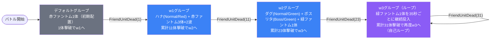

# event_you1_challenge_00004 インゲームデータ詳細解説

> 参照リポジトリ: `projects/glow-masterdata`
> リリースキー: 202602015
> 本ファイルはMstAutoPlayerSequenceが12行の砦破壊型チャレンジイベントの全データ設定を解説する

---

## 概要

**ブラック幼稚園コラボのチャレンジクエスト**（砦破壊型・`event_you1_challenge_00004`）。

- 砦のHP: 80,000 でダメージ有効（破壊目的）
- BGM: `SSE_SBG_003_001`（通常）/ `SSE_SBG_003_004`（ボス戦）
- グループ: デフォルト + w1〜w3（4グループ構成・w3自己ループ）
- 使用する敵の種類: 5種類（赤・緑ファントム×各1、ハナ・ダグ・リタ）
- スピードアタックルールあり（早期クリアで追加報酬）
- 赤属性のハナはスタン攻撃、緑属性のダグは毒攻撃を持つ
- 最初の1体撃破で大量リーダーPが獲得できる特殊ドロップ設計（override_bp=1400）

---

## 関連テーブル設定

### MstInGame

| カラム | 値 |
|--------|-----|
| `id` | `event_you1_challenge_00004` |
| `mst_auto_player_sequence_set_id` | `event_you1_challenge_00004` |
| `bgm_asset_key` | `SSE_SBG_003_001` |
| `boss_bgm_asset_key` | `SSE_SBG_003_004` |
| `mst_page_id` | `event_you1_challenge_00004` |
| `mst_enemy_outpost_id` | `event_you1_challenge_00004` |
| `boss_mst_enemy_stage_parameter_id` | `1` |
| `normal_enemy_hp_coef` | `1.0` |
| `normal_enemy_attack_coef` | `1.0` |
| `normal_enemy_speed_coef` | `1` |
| `boss_enemy_hp_coef` | `1.0` |
| `boss_enemy_attack_coef` | `1.0` |
| `boss_enemy_speed_coef` | `1` |
| `release_key` | `202602015` |

### MstEnemyOutpost（敵砦）

| カラム | 値 | 意味 |
|--------|-----|------|
| `id` | `event_you1_challenge_00004` | |
| `hp` | `80,000` | 砦HP（ダメージ有効・破壊目的） |
| `is_damage_invalidation` | （空） | **ダメージ有効**（砦破壊型） |
| `artwork_asset_key` | `event_you_0001` | 背景アートワーク |

### MstPage + MstKomaLine（コマフィールド）

3行構成。

```
row=1  height=0.55  layout=3.0  (2コマ: 幅0.4 + 幅0.6)
  koma1: you_00003  width=0.4  background_offset=0.0   effect=None
  koma2: you_00003  width=0.6  background_offset=0.02  effect=None

row=2  height=0.55  layout=1.0  (1コマ: 幅1.0)
  koma1: you_00003  width=1.0  background_offset=1.0   effect=None

row=3  height=0.55  layout=3.0  (2コマ: 幅0.4 + 幅0.6)
  koma1: you_00003  width=0.4  background_offset=-1.0  effect=None
  koma2: you_00003  width=0.6  background_offset=-1.02 effect=None
```

> **コマ効果の補足**: 全コマの `effect_type = None`。上下2行が2コマ構成、中段が1コマの対称レイアウト。コマ効果による属性バフ・デバフなし。

### MstInGameI18n（バトル説明文）

**result_tips（バトルヒント）:**
> 最初に出現する敵を倒すと、大量のリーダーPを獲得できるぞ!
>
> 高コストのキャラを召喚して強敵と戦おう!

**description（ステージ説明）:**
> 【属性情報】
> 赤属性と緑属性の敵が登場するので、青属性と赤属性のキャラは有利に戦うこともできるぞ!
>
> 【ギミック情報】
> 最初に登場する敵を倒すと、大量のリーダーPを獲得できるぞ!
> 高コストのキャラを編成しよう!
>
> 赤属性のハナはスタン攻撃をしてくるぞ!
> 特性でスタン攻撃無効化を持っているキャラを編成しよう!
>
> 緑属性のダグは毒攻撃をしてくるぞ!
> 特性で毒ダメージ軽減を持っているキャラを編成しよう!
>
> また、このステージではスピードアタックルールがあるぞ!
> 早くクリアすると報酬ゲット!

---

## 使用する敵パラメータ（MstEnemyStageParameter）一覧

5種類の敵パラメータを使用。`c_` プレフィックスはキャラ個別ID、`e_` は汎用敵。
IDの命名規則: `{c_/e_}{キャラID}_{コンテンツID}_{kind}_{color}`

### カラム解説

| カラム名（略称） | DBカラム名 | 説明 |
|---------------|-----------|------|
| id | id | MstEnemyStageParameterの主キー |
| キャラID | mst_enemy_character_id | 紐付くキャラモデル・スキルの参照元 |
| kind | character_unit_kind | `Normal`（通常敵）/ `Boss`（ボス）。UIオーラ表示に影響 |
| role | role_type | 属性相性の役職（Attack/Technical/Defense/Support） |
| color | color | 属性色（Red/Yellow/Green/Blue/Colorless） |
| sort_order | sort_order | ゲーム内表示順 |
| base_hp | hp | ベースHP（`enemy_hp_coef` 乗算前の素値） |
| base_atk | attack_power | ベース攻撃力（`enemy_attack_coef` 乗算前の素値） |
| base_spd | move_speed | 移動速度（数値が大きいほど速い） |
| well_dist | well_distance | 攻撃射程（コマ単位） |
| combo | attack_combo_cycle | 攻撃コンボ数（1=単発） |
| knockback | damage_knock_back_count | 被攻撃時ノックバック回数（0=ノックバックなし） |
| ability | mst_unit_ability_id1 | 特殊アビリティID |
| drop_bp | drop_battle_point | 基本ドロップバトルポイント |

### 全5種類の詳細パラメータ

| MstEnemyStageParameter ID | 日本語名 | キャラID | kind | role | color | sort | base_hp | base_atk | base_spd | well_dist | combo | knockback | ability | drop_bp |
|--------------------------|---------|---------|------|------|-------|------|---------|---------|---------|-----------|-------|-----------|---------|---------|
| `e_glo_00001_you1_challenge_Normal_Red` | ファントム（赤） | enemy_glo_00001 | Normal | Attack | Red | 12 | 1,000 | 100 | 30 | 0.17 | 1 | 2 | — | 100 |
| `c_you_00301_you1_challenge_Normal_Red` | ハナ | chara_you_00301 | Normal | Defense | Red | 5 | 10,000 | 500 | 35 | 0.16 | 1 | 2 | — | 100 |
| `c_you_00201_you1_challenge_Normal_Green` | ダグ | chara_you_00201 | Normal | Technical | Green | 6 | 10,000 | 500 | 32 | 0.45 | 1 | 2 | — | 100 |
| `c_you_00001_you1_challenge_Boss_Green` | 元殺し屋の新人教諭 リタ | chara_you_00001 | Boss | Attack | Green | 4 | 10,000 | 500 | 45 | 0.20 | 5 | 0 | — | 100 |
| `e_glo_00001_you1_challenge_Normal_Green` | ファントム（緑） | enemy_glo_00001 | Normal | Defense | Green | 10 | 1,000 | 100 | 30 | 0.17 | 1 | 2 | — | 100 |

> **実際のHP・ATKは `base × MstAutoPlayerSequence.enemy_hp_coef` で決まる。**

### 敵パラメータの特性解説

**ボス（リタ）の特殊性:**
- kind=Boss で `damage_knock_back_count=0`（ノックバック無効）
- `attack_combo_cycle=5`（5連コンボ）と高い連打力
- 移動速度45は今コンテンツ最高値（ファントムの1.5倍速）

**キャラ（ハナ・ダグ）の中間性能:**
- kind=Normal でも base_hp=10,000（ファントムの10倍）
- ダグの `well_distance=0.45` は最大射程クラス（遠距離から攻撃可能）
- ハナのスタン攻撃・ダグの毒攻撃は `mst_unit_ability_id1` 非記載だが説明文に明記

**汎用ファントムの設計:**
- 赤・緑の色違いが各役職（Attack/Defense）に割り当てられ属性相性を強調
- base_hp=1,000・base_atk=100 と低ステータスだが、高 `enemy_hp_coef` 倍率で強化される

---

## グループ構造の全体フロー（Mermaid）



> **Mermaid スタイルカラー規則**:
> - デフォルトグループ: `#6b7280`（グレー）
> - w1〜w2: `#3b82f6`（青）
> - w3: `#8b5cf6`（紫）← 自己ループグループ

---

## 全12行の詳細データ（グループ単位）

### デフォルトグループ（elem 1、groupchange_1）

バトル開始直後に赤ファントムを1体投入。この1体が撃破されると即座にw1へ遷移する。1体撃破でoverride_bp=1,400という大量リーダーPが獲得できる仕掛け。

| id | elem | 条件 | アクション | action_value | 召喚数 | interval | aura | hp倍 | atk倍 | override_bp | 説明 |
|----|------|------|-----------|-------------|--------|---------|------|------|------|------------|------|
| _1 | 1 | ElapsedTime(100) | SummonEnemy | e_glo_00001_..._Red | 1 | 10 | Default | 0.1 | 5 | 1,400 | バトル開始1秒後に赤ファントム1体投入。hp=100（hp倍0.1×base1,000）。大量リーダーP獲得トリガー |
| _2 | groupchange_1 | FriendUnitDead(1) | SwitchSequenceGroup | w1 | — | — | Default | 0 | 0 | — | 累計1体撃破でw1へ遷移 |

**ポイント:**
- `enemy_hp_coef=0.1` で実HP=100という極端に低い設定。プレイヤーが容易に撃破できる「起爆剤」として機能
- override_bp=1,400 は他の敵（base 5〜50）と比べて圧倒的に高い。「最初の1体を倒すと大量リーダーP獲得」というゲームプレイ上の動機づけ

---

### w1グループ（elem 11〜13、groupchange_2）

ハナ（赤・Normal）と赤ファントム計7体で構成。w1起動直後（50ms）にハナ登場、70ms後に赤ファントム3体、10秒後にさらに赤ファントム3体が継続投入される。

| id | elem | 条件 | アクション | action_value | 召喚数 | interval | aura | hp倍 | atk倍 | override_bp | 説明 |
|----|------|------|-----------|-------------|--------|---------|------|------|------|------------|------|
| _3 | 11 | GroupActivated(5) | SummonEnemy | c_you_00301_..._Red | 1 | 0 | Default | 55 | 0.7 | 50 | w1起動50ms後にハナ1体。実HP=550,000。スタン攻撃持ち。atk倍0.7で攻撃は控えめ |
| _4 | 12 | GroupActivated(7) | SummonEnemy | e_glo_00001_..._Red | 3 | 40 | Default | 24 | 6 | 5 | w1起動70ms後に赤ファントム3体（interval=40=400ms間隔）。実HP=24,000。atk倍6で高攻撃力 |
| _5 | 13 | GroupActivated(1000) | SummonEnemy | e_glo_00001_..._Red | 3 | 1,500 | Default | 24 | 6 | 5 | w1起動10秒後に赤ファントム3体追加（interval=1,500=15秒間隔）。持続的な圧力 |
| _6 | groupchange_2 | FriendUnitDead(11) | SwitchSequenceGroup | w2 | — | — | Default | 0 | 0 | — | 累計11体撃破でw2へ遷移 |

**ポイント:**
- w1では合計7体（ハナ1+ファントム6）が投入されるが、groupchange_2の条件は `FriendUnitDead(11)` = 累計11体。デフォルトグループの1体を含めても10体しかいないため、elem13（継続投入）で追加される3体のうち一部を撃破してはじめてw2へ進む設計
- ハナの `enemy_hp_coef=55` → 実HP=550,000 と高耐久。スタン攻撃への対策キャラ編成を促す

---

### w2グループ（elem 21〜23、groupchange_3）

ダグ（緑・Normal）・リタ（緑・Boss）・緑ファントム1体の3体構成。w2起動から750ms後にダグ、50ms後にリタ（ボスオーラ）、即座に緑ファントムが登場する。

| id | elem | 条件 | アクション | action_value | 召喚数 | interval | aura | hp倍 | atk倍 | override_bp | 説明 |
|----|------|------|-----------|-------------|--------|---------|------|------|------|------------|------|
| _7 | 21 | GroupActivated(75) | SummonEnemy | c_you_00201_..._Green | 1 | 0 | Default | 34 | 1.3 | 50 | w2起動750ms後にダグ1体。実HP=340,000。毒攻撃持ち。射程0.45で遠距離攻撃 |
| _8 | 22 | GroupActivated(5) | SummonEnemy | c_you_00001_..._Boss_Green | 1 | 0 | Boss | 44.5 | 1.9 | 50 | w2起動50ms後にリタ（ボス）1体。実HP=445,000。aura=Bossでオーラ演出。5連コンボ・ノックバック無効 |
| _9 | 23 | GroupActivated(0) | SummonEnemy | e_glo_00001_..._Green | 1 | 0 | Default | 38.5 | 4.2 | 5 | w2起動直後に緑ファントム1体。実HP=38,500。atk倍4.2で高攻撃力 |
| _10 | groupchange_3 | FriendUnitDead(23) | SwitchSequenceGroup | w3 | — | — | Default | 0 | 0 | — | 累計23体撃破でw3へ遷移 |

**ポイント:**
- リタ（Boss）の登場が elem22 で `GroupActivated(5)` = 50ms、ダグより先に起動（elem21の750ms後より早い）。実際の登場タイミングはリタ→ダグの順
- ダグの `well_distance=0.45` はコンテンツ内最長射程。後方からの攻撃で回避が困難
- w2では3体しか投入されないが、groupchange_3 は `FriendUnitDead(23)` = 累計23体。w1の残り体数消化も条件に含む

---

### w3グループ（elem 31、groupchange_4）【ループ終端】

緑ファントム1体を35秒ごとに投入し続けるエンドレスグループ。`groupchange_4` が w3 自身へのループ遷移であり、事実上のエンドレスウェーブを形成する。

| id | elem | 条件 | アクション | action_value | 召喚数 | interval | aura | hp倍 | atk倍 | override_bp | 説明 |
|----|------|------|-----------|-------------|--------|---------|------|------|------|------------|------|
| _11 | 31 | GroupActivated(350) | SummonEnemy | e_glo_00001_..._Green | 1 | 0 | Default | 38.5 | 4.2 | 5 | w3起動3,500ms（3.5秒）後に緑ファントム1体。実HP=38,500 |
| _12 | groupchange_4 | FriendUnitDead(31) | SwitchSequenceGroup | w3 | — | — | Default | 0 | 0 | — | 累計31体撃破でw3へ再遷移（自己ループ）。w3が再起動するたびに elem31が再実行される |

**ポイント:**
- `SwitchSequenceGroup(w3)` で自グループへのループを実現。w3が再起動されると elem31 も再評価され、3.5秒後にまた緑ファントムが投入される
- `FriendUnitDead(31)` = 累計31体。w2完了時点（23体）から8体追加撃破でループ継続
- 砦破壊型コンテンツでは砦を壊すとバトル終了のため、砦破壊に集中すれば無限ループ前に決着がつく設計

---

## グループ切り替えまとめ表

| 切り替え | 条件 | 遷移先 | 累計撃破数 |
|---------|------|--------|----------|
| デフォルト → w1 | **FriendUnitDead(1)** | w1 | 1体 |
| w1 → w2 | **FriendUnitDead(11)** | w2 | 11体 |
| w2 → w3 | **FriendUnitDead(23)** | w3 | 23体 |
| w3 → w3（ループ） | **FriendUnitDead(31)** | w3（自己） | 31体ごと |

各グループで撃破すべき目安:
- デフォルト: 1体（赤ファントム1体）
- w1: 10体（ハナ1体 + 赤ファントム最低9体）
- w2: 12体（ダグ・リタ・緑ファントム各1体 + w1残りを含む）
- w3以降: 8体ごとにループ継続（緑ファントムが3.5秒ごとに投入）

---

## スコア体系

バトルポイントは `override_drop_battle_point`（MstAutoPlayerSequence設定値）が優先される。

| 敵の種類 | override_bp（獲得バトルポイント） | 備考 |
|---------|----------------------------------|------|
| 赤ファントム（デフォルトグループ） | **1,400** | 最初の1体。圧倒的な高リーダーP獲得 |
| ハナ（w1） | 50 | キャラ敵・標準bp |
| 赤ファントム（w1） | 5 | 雑魚敵・低bp |
| ダグ（w2） | 50 | キャラ敵・標準bp |
| リタ（w2・Boss） | 50 | ボス敵・キャラと同じbp（ボスプレミアムなし） |
| 緑ファントム（w2・w3） | 5 | 雑魚敵・低bp |

> **設計上の特徴**: デフォルトグループの赤ファントム1体 (override_bp=1,400) が突出して高い。これは「最初の1体を倒すと大量のリーダーPを獲得」というコンテンツコンセプトに直結した数値設定。
> `defeated_score` はすべて `0` で、スコアはバトルポイントのみで評価される。

---

## この設定から読み取れる設計パターン

### 1. 初期高報酬による「お試し参加」の動機づけ

デフォルトグループに `enemy_hp_coef=0.1`（実HP=100）の赤ファントムを1体配置し、撃破時 override_bp=1,400 を付与する設計は、新規・ライトプレイヤーへの参加動機を創出する仕掛け。バトルヒントにも「最初に出現する敵を倒すと、大量のリーダーPを獲得できるぞ!」と明記されており、コンテンツ序盤の敷居を下げつつリワードを確約する設計パターン。

### 2. 4グループ構成による段階的キャラ導入（赤→緑の2段階構成）

- デフォルト・w1: 赤属性（赤ファントム・ハナ）で統一
- w2〜w3: 緑属性（緑ファントム・ダグ・リタ）で統一

属性を2段階で切り替えることで、プレイヤーは前半は青属性キャラが有効・後半は赤属性キャラが有効という異なる戦略を迫られる。同一バトル内で属性対策の組み換えを意識させる設計。

### 3. w3自己ループによる「砦破壊レース」の緊張感

w3 の `groupchange_4` が自グループに遷移するループ構造は、砦HPが残っている限り緑ファントム（実HP=38,500・高攻撃力atk倍4.2）が継続投入される無限ウェーブを意味する。プレイヤーは敵を殲滅しつつ砦ダメージを与えるというマルチタスクを強いられ、スピードアタックルールとの相乗効果でタイム短縮への圧力が高まる。

### 4. hp倍率のウェーブごとのスケーリング設計

| グループ | 敵種別 | hp倍 | 実HP |
|---------|------|------|------|
| デフォルト | 赤ファントム | 0.1 | 100 |
| w1 | ハナ | 55 | 550,000 |
| w1 | 赤ファントム | 24 | 24,000 |
| w2 | ダグ | 34 | 340,000 |
| w2 | リタ（Boss） | 44.5 | 445,000 |
| w2 | 緑ファントム | 38.5 | 38,500 |
| w3 | 緑ファントム | 38.5 | 38,500 |

デフォルトの「極端に弱い敵（HP=100）」から一転してw1以降は高HPキャラが連続登場する急激な難度上昇が特徴的。初期の高報酬で参加を促したうえで、高難度バトルへ誘導する段階設計。

### 5. ボス（リタ）の特殊演出とステータス設計

リタは `aura_type=Boss`（ボスオーラ演出あり）・`attack_combo_cycle=5`（5連コンボ）・`damage_knock_back_count=0`（ノックバック無効）・`move_speed=45`（最高速）を兼ね備える全能型ボス設定。キャラの「元殺し屋」という設定をゲームメカニクスで表現している。w2以降で最後の大きな障壁として機能するよう設計されている。

### 6. スピードアタックルールとループ設計の相互作用

スピードアタックルール（早期クリアで追加報酬）と w3 の自己ループ無限ウェーブは、プレイヤーに「早く倒してバトルを終わらせるほど有利」という一貫したゲームプレイ動機を与える。w3 ループに入るほど時間が経過し報酬効率が落ちるため、w2 でのボス撃破後は砦へのダメージを最優先する行動選択が最適解となる設計。
