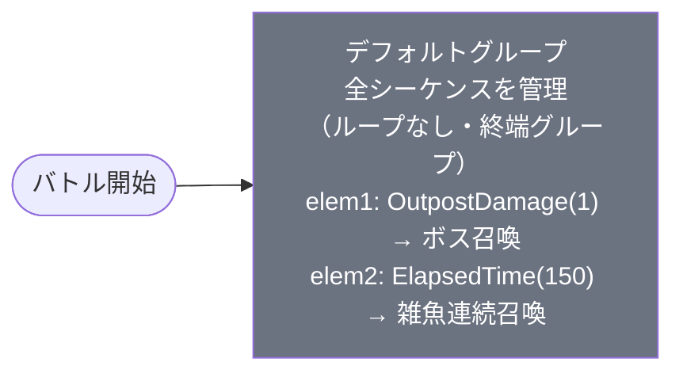

# event_yuw1_savage02_00001 インゲームデータ詳細解説

> 参照リポジトリ: `projects/glow-masterdata`
> リリースキー: 202512015
> 本ファイルはMstAutoPlayerSequenceが2行のイベントクエスト（SAVAGE02/上級派生）の全データ設定を解説する

---

## 概要

**イベントクエスト・ゆうわ編 SAVAGE02（上級派生難度）**（砦破壊型）。

- 砦のHP: `500,000` でダメージ有効（通常SAVAGE比4.2倍）
- BGM: `SSE_SBG_003_006`（ボスBGM: `SSE_SBG_003_007`）
- グループ: デフォルトグループのみ（1グループ構成・ループなし・終端グループ）
- 使用する敵の種類: 2種類（ボス1種 + 雑魚1種。全員Yellow属性）
- 特徴的なルール: **スピードアタックルール**あり（早クリアで報酬獲得）。**OutpostDamage(1)** でボスが砦へのダメージ発生と同時に即召喚される
- 敵属性: 全員 **Yellow属性**（緑属性のキャラが有利に戦える）
- 設計上の特徴: シーケンス行数がわずか2行という極めてシンプルな構成で、無限ウェーブ・グループ切り替えなしの「砦削り特化型」バトル

---

## 関連テーブル設定

### MstInGame

| カラム | 値 |
|--------|-----|
| `id` | `event_yuw1_savage02_00001` |
| `mst_auto_player_sequence_set_id` | `event_yuw1_savage02_00001` |
| `bgm_asset_key` | `SSE_SBG_003_006` |
| `boss_bgm_asset_key` | `SSE_SBG_003_007` |
| `mst_page_id` | `event_yuw1_savage02_00001` |
| `mst_enemy_outpost_id` | `event_yuw1_savage02_00001` |
| `boss_mst_enemy_stage_parameter_id` | `1` |
| `normal_enemy_hp_coef` | `1.0` |
| `normal_enemy_attack_coef` | `1.0` |
| `normal_enemy_speed_coef` | `1` |
| `boss_enemy_hp_coef` | `1.0` |
| `boss_enemy_attack_coef` | `1.0` |
| `boss_enemy_speed_coef` | `1` |

> **注意**: `bgm_asset_key` が `SSE_SBG_003_006` でボスBGM `SSE_SBG_003_007` が別途設定されている点は、`event_yuw1_savage_*`（savageシリーズ）と逆転している（savageは `SSE_SBG_003_007` がメインBGMでボスBGM未設定）。

### MstEnemyOutpost（敵砦）

| カラム | 値 | 意味 |
|--------|-----|------|
| `id` | `event_yuw1_savage02_00001` | |
| `hp` | `500,000` | **通常SAVAGE（120,000）の約4.2倍**の高耐久砦 |
| `is_damage_invalidation` | `（空）` | **ダメージ有効**（砦破壊型） |
| `artwork_asset_key` | `tutorial_0002` | 背景アートワーク |

### MstPage + MstKomaLine（コマフィールド）

3行構成。

```
row=1  height=0.55  layout=1.0  (1コマ: width=1.0)
  koma1: glo_00033  width=1.0  effect=None

row=2  height=0.55  layout=6.0  (2コマ: width=0.5, 0.5)
  koma1: glo_00033  width=0.5  effect=None
  koma2: glo_00033  width=0.5  effect=None

row=3  height=0.55  layout=7.0  (3コマ: width=0.33, 0.34, 0.33)
  koma1: glo_00033  width=0.33  effect=None
  koma2: glo_00033  width=0.34  effect=None
  koma3: glo_00033  width=0.33  effect=None
```

> **コマ効果の補足**: 全コマが `effect=None`（特殊効果なし）かつ `target_side=All / target_colors=All / target_roles=All`。コマアセットはすべて `glo_00033`（グロー汎用背景）で統一されており、特定のコマ侵入トリガーやコマ効果ギミックはない。

### MstInGameI18n（バトル説明文）

**result_tips（バトルヒント）:**
> キャラを強化してみよう!

**description（ステージ説明）:**
> 【属性情報】
> 黄属性の敵が登場するので緑属性のキャラは有利に戦うこともできるぞ!
>
> 【ギミック情報】
> 特性で根性を持つ敵が登場するぞ!
> 必殺ワザで連続攻撃をすることができるキャラを編成しよう!
> JUMBLE RUSHの発動をするタイミングも重要だ!
>
> また、このステージではスピードアタックルールがあるぞ!
> 早くクリアすると報酬ゲット!

---

## 使用する敵パラメータ（MstEnemyStageParameter）一覧

2種類の敵パラメータを使用。`c_` プレフィックスはキャラ個別ID、`e_` は汎用敵。
IDの命名規則: `{c_/e_}{キャラID}_{コンテンツID}_{kind}_{color}`

> **注意**: ボスIDに `savege02`（typo: `savage02` が正しい）が含まれているが、これは意図的ではなくデータ側の表記ゆれ。

### カラム解説

| カラム名（略称） | DBカラム名 | 説明 |
|---------------|-----------|------|
| id | id | MstEnemyStageParameterの主キー |
| キャラID | mst_enemy_character_id | 紐付くキャラモデル・スキルの参照元 |
| kind | character_unit_kind | `Normal`（通常敵）/ `Boss`（ボス）。UIオーラ表示に影響 |
| role | role_type | 属性相性の役職（Attack/Technical/Defense/Support） |
| color | color | 属性色（Red/Yellow/Green/Blue/Colorless） |
| sort_order | sort_order | ゲーム内表示順 |
| base_hp | hp | ベースHP（`enemy_hp_coef` 乗算前の素値） |
| base_atk | attack_power | ベース攻撃力（`enemy_attack_coef` 乗算前の素値） |
| base_spd | move_speed | 移動速度（数値が大きいほど速い） |
| well_dist | well_distance | 攻撃射程（コマ単位） |
| combo | attack_combo_cycle | 攻撃コンボ数（1=単発） |
| knockback | damage_knock_back_count | 被攻撃時ノックバック回数（0=ノックバックなし） |
| ability | mst_unit_ability_id1 | 特殊アビリティID |
| drop_bp | drop_battle_point | 基本ドロップバトルポイント |

### 全2種類の詳細パラメータ

| MstEnemyStageParameter ID | 日本語名 | キャラID | kind | role | color | sort | base_hp | base_atk | base_spd | well_dist | combo | knockback | ability | drop_bp |
|--------------------------|---------|---------|------|------|-------|------|---------|---------|---------|-----------|-------|-----------|---------|---------|
| `c_yuw_00601_savege02_yuw_Boss_Yellow` | 奥村 正宗 | `chara_yuw_00601` | Boss | Defense | Yellow | 32 | 10,000 | 500 | 30 | 0.21 | 4 | 2 | `enemy_ability_gust_3_zombie` | 100 |
| `e_glo_00001_savage02_yuw_tank_Normal_Yellow` | ファントム | `enemy_glo_00001` | Normal | Attack | Yellow | 33 | 10,000 | 500 | 37 | 0.21 | 1 | 2 | （なし） | 100 |

> **実際のHP・ATKは `base × MstAutoPlayerSequence.enemy_hp_coef` で決まる。**
> - ボス（奥村 正宗）: hp_coef=150 → 実質HP `10,000 × 150 = 1,500,000`、atk_coef=4 → 実質ATK `500 × 4 = 2,000`
> - 雑魚（ファントム）: hp_coef=10 → 実質HP `10,000 × 10 = 100,000`、atk_coef=1.5 → 実質ATK `500 × 1.5 = 750`

### 敵パラメータの特性解説

| 項目 | ボス（奥村 正宗） | 雑魚（ファントム） |
|------|-----------------|-----------------|
| HP倍率 | 150倍（実質150万HP） | 10倍（実質10万HP） |
| 攻撃力倍率 | 4倍（実質2,000） | 1.5倍（実質750） |
| 移動速度 | 30（低速） | 37（やや高速） |
| コンボ数 | 4（4連続攻撃） | 1（単発） |
| ノックバック | 2回 | 2回 |
| アビリティ | **根性3**（`ability_guts`、HP30%以下3回まで1HPで耐える） | なし |
| 召喚形式 | 砦ダメージ発生と同時に1体召喚 | 1.5秒後から100体を間隔3.5秒で連続召喚 |

> **根性アビリティについて**: `enemy_ability_gust_3_zombie` は `ability_guts`（根性）を `ability_parameter1=3` で設定。ボスが致死ダメージを受けても3回までHP1で生存する。連続攻撃できるキャラや必殺技によるJUMBLE RUSH（一斉攻撃）が有効なのはこのため。

---

## グループ構造の全体フロー（Mermaid）



> **グループ構成についての注記**:
> - デフォルトグループのみの1グループ構成。グループ切り替え（SwitchSequenceGroup）は存在しない
> - `groupchange_N` 行なし（終端グループとして動作）
> - savage（通常上級）とは異なりウェーブループがなく、バトル開始から終了まで同一グループが継続する

> **Mermaid スタイルカラー規則**:
> - デフォルトグループ: `#6b7280`（グレー）
> - w1〜w2: `#3b82f6`（青）
> - w3〜w4: `#f59e0b`（橙）
> - w5以降: `#ef4444`（赤）
> - ループ起点直前のグループ: `#8b5cf6`（紫）

---

## 全2行の詳細データ（グループ単位）

### デフォルトグループ（elem 1〜2）

デフォルトグループのみ。グループ切り替えなしの終端グループ。
- elem1: 砦にダメージが入った瞬間（OutpostDamage=1）にボス「奥村 正宗」を1体召喚。砦ダメージ無効化フラグ（`is_summon_unit_outpost_damage_invalidation=1`）が設定されており、ボス召喚後も砦ダメージは継続して有効。
- elem2: バトル開始から1.5秒後（ElapsedTime=150、150×10ms=1,500ms）から「ファントム」を3.5秒間隔（interval=350、350×10ms=3,500ms）で最大100体を連続召喚。

| id | elem | 条件 | アクション | 召喚数 | interval | aura | hp倍 | atk倍 | override_bp | 説明 |
|----|------|------|-----------|--------|---------|------|------|------|------------|------|
| `event_yuw1_savage02_00001_1` | 1 | OutpostDamage(1) | SummonEnemy: `c_yuw_00601_savege02_yuw_Boss_Yellow` | 1 | 0 | Boss | 150 | 4 | （なし） | 砦へのダメージ発生と同時にボス1体召喚。砦ダメージ無効化なし（invalidation=1） |
| `event_yuw1_savage02_00001_2` | 2 | ElapsedTime(150) | SummonEnemy: `e_glo_00001_savage02_yuw_tank_Normal_Yellow` | 100 | 350 | Default | 10 | 1.5 | （なし） | バトル開始1.5秒後から3.5秒間隔で雑魚ファントムを最大100体連続投入 |

**ポイント:**
- elem1の `is_summon_unit_outpost_damage_invalidation = 1` はボス召喚トリガーが砦ダメージと同時発動するにもかかわらず、砦へのダメージを無効化しないという意味。砦は最初から削れ続ける。
- elem2の `summon_count = 100` は上限値として設定されており、現実的にはバトルクリア（砦HP0）で終了するため全100体が召喚されることはまれ。
- `defeated_score` はどちらも `0`、`override_drop_battle_point` は空。バトルポイントはMstEnemyStageParameterの `drop_battle_point`（両者とも100）が適用される。

---

## グループ切り替えまとめ表

| 切り替え | 条件 | 遷移先 |
|---------|------|--------|
| （グループ切り替えなし） | — | — |

> このコンテンツはデフォルトグループのみの1グループ構成であり、グループ遷移は発生しない。
> savage（通常上級）と比較した場合、savage_00001は10行・複数条件での無限ウェーブ設計であるのに対し、savage02_00001はウェーブ管理を完全に省略している。

各グループで倒すべき目安:
- デフォルト: ボス1体（根性3回）を撃破しつつ砦を500,000削る

---

## スコア体系

バトルポイントは `override_drop_battle_point`（MstAutoPlayerSequence設定値）が優先されるが、本コンテンツでは両行とも未設定のため、MstEnemyStageParameterの `drop_battle_point` が適用される。

| 敵の種類 | override_bp（獲得バトルポイント） | MstEnemyStageParameter.drop_bp | 備考 |
|---------|----------------------------------|--------------------------------|------|
| ボス（奥村 正宗） | （設定なし → 100を使用） | 100 | 1体のみ召喚 |
| 雑魚（ファントム） | （設定なし → 100を使用） | 100 | 最大100体まで召喚可能 |

> **スピードアタックルール**: `description` に「早くクリアすると報酬ゲット!」と記載されているとおり、クリアタイムに応じた追加報酬がある。スコア体系のメインはBP獲得より「どれだけ早く砦500,000を削り切れるか」に置かれている設計。

---

## この設定から読み取れる設計パターン

### 1. savage02 は「高耐久砦・シンプルシーケンス」型の派生バリアント

通常の `savage`（例: `event_yuw1_savage_00001`）は砦HP 120,000 + 10行のシーケンス（複数条件の無限ウェーブループ）という設計だが、`savage02` は砦HP 500,000 + 2行のシーケンスという対照的な設計を取る。

| 項目 | savage_00001 | savage02_00001 |
|------|-------------|----------------|
| 砦HP | 120,000 | 500,000（**約4.2倍**） |
| シーケンス行数 | 10行 | **2行** |
| グループ数 | 1（デフォルトのみ） | 1（デフォルトのみ） |
| ボス登場条件 | `ElapsedTime(1500)` = 15秒後 | **`OutpostDamage(1)`** = 砦ダメージ発生と同時 |
| BGMメイン | `SSE_SBG_003_007` | `SSE_SBG_003_006`（ボスBGMに`007`を割り当て） |
| release_key | 202511020 | 202512015（後発） |

savage02のコンセプトは「ウェーブ管理の複雑さをなくし、砦耐久力と即時ボス召喚によってプレイヤーへの圧力を高める」シンプル化・高難度化の変形型と読み取れる。

### 2. OutpostDamage(1) によるボス即時召喚という独自トリガー設計

`condition_type = OutpostDamage` は「砦にダメージが入った回数」をカウントする条件。`condition_value = 1` は「1回目のダメージ発生直後」を意味し、バトル開始後プレイヤーが最初に攻撃を当てた瞬間にボスが出現する仕組みである。これにより「バトル開始と同時にボスと向き合う」というプレッシャーが発生し、時間管理より対ボス戦闘スキルが問われる。

### 3. 根性3（enemy_ability_guts）+ 連続召喚雑魚による二重圧力設計

ボスが根性3を持つため、致死ダメージ3回分を耐える。同時に雑魚ファントムが1.5秒後から3.5秒間隔で100体連続投入されるため、プレイヤーは「ボスの根性を突破するための連続攻撃・JUMBLE RUSH」と「無限に来る雑魚の処理」を同時並行しなければならない。`description` がこの二重圧力を明示的に説明文として案内している点は、難度設計の意図が運営テキストと対応していると言える。

### 4. スピードアタックルールと砦500,000の組み合わせによる上級者向けチャレンジ設計

砦HP 500,000という高耐久は「クリア可能な難度設計」であると同時に、スピードアタックルールと組み合わせることで「どれだけ効率よく砦を削り切れるか」という上級者向けのタイムアタックコンテンツとして機能する。根性3ボスを素早く突破し、砦ダメージを継続して与え続けるプレイが最高評価に直結する。

### 5. 全てのコマ効果がNoneという「ギミックレス」フィールド設計

`event_yuw1_savage_00001` でも同様だが、savage02でもコマ効果（属性強化・弱体化・回復等）は全コマNone。フィールドによる有利不利ではなく「キャラの属性（Yellow対策の緑属性）とスキル構成」のみで難度が調整されている純粋な対敵バトルとなっている。コマ効果ギミックを省くことで、初回プレイでも「黄属性対策に緑を入れる」というシンプルな方針を提示できる設計意図がある。

### 6. BGMキーの逆転（savage と savage02 で役割が入れ替わり）

`savage_00001` はメインBGMが `SSE_SBG_003_007` でボスBGM未設定（通常BGMのみ）。一方 `savage02_00001` はメインBGMが `SSE_SBG_003_006`、ボスBGMが `SSE_SBG_003_007`。savage02では砦戦闘開始時から軽めのBGM（006）が流れ、ボスが出現した瞬間に盛り上がりのあるBGM（007）へ切り替わる演出を意図していると解釈できる。savage ではこの演出がなく単一BGMで完結していたのとは対照的。
