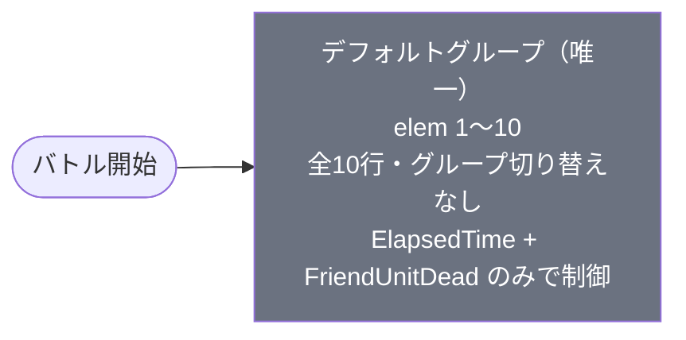

# event_yuw1_savage_00001 インゲームデータ詳細解説

> 参照リポジトリ: `projects/glow-masterdata`
> リリースキー: 202511020
> 本ファイルはMstAutoPlayerSequenceが10行のイベントクエスト（savage）の全データ設定を解説する

---

## 概要

**yuw1シリーズのイベントクエスト・サベッジ（上級）難度**（砦破壊型バトル）。

- 砦のHP: `120,000` でダメージ有効（砦を壊してクリアするモード）
- BGM: `SSE_SBG_003_007`（ボスBGMなし）
- グループ: **デフォルトグループのみ**（1グループ構成・グループ切り替えなし・終端グループ）
- 使用する敵の種類: 3種類（`c_yuw_00501` ボス1種 + `e_glo_00001` 雑魚2種）
- **スピードアタックルールあり**（早くクリアすると報酬獲得）
- 敵属性: **赤属性 + 無属性**（青属性のキャラが赤属性に有利。無属性は属性関係なし）
- 敵ギミック: **火傷攻撃**（火傷ダメージ軽減特性を持つキャラ推奨）

> **event_jig1_savage_00001との大きな違い**: jig1は6グループ（デフォルト+w1〜w5）の複雑なウェーブ構造を持つのに対し、本コンテンツは**デフォルトグループのみ**のシンプルな構成。グループ切り替えが存在せず、ElapsedTime（バトル開始後の経過時間）とFriendUnitDead（撃破数）のみでシーケンスを制御する。砦HPも120,000と高めに設定されている。

---

## 関連テーブル設定

### MstInGame

| カラム | 値 |
|--------|-----|
| `id` | `event_yuw1_savage_00001` |
| `mst_auto_player_sequence_set_id` | `event_yuw1_savage_00001` |
| `bgm_asset_key` | `SSE_SBG_003_007` |
| `boss_bgm_asset_key` | （空） |
| `loop_background_asset_key` | （空） |
| `player_outpost_asset_key` | （空） |
| `mst_page_id` | `event_yuw1_savage_00001` |
| `mst_enemy_outpost_id` | `event_yuw1_savage_00001` |
| `mst_defense_target_id` | （空） |
| `boss_mst_enemy_stage_parameter_id` | `1` ← ボスはシーケンスで出す |
| `boss_count` | （空） |
| `normal_enemy_hp_coef` | `1.0` |
| `normal_enemy_attack_coef` | `1.0` |
| `normal_enemy_speed_coef` | `1` |
| `boss_enemy_hp_coef` | `1.0` |
| `boss_enemy_attack_coef` | `1.0` |
| `boss_enemy_speed_coef` | `1` |
| `release_key` | `202511020` |

### MstEnemyOutpost（敵砦）

| カラム | 値 | 意味 |
|--------|-----|------|
| `id` | `event_yuw1_savage_00001` | |
| `hp` | `120,000` | 12万HP（破壊可能）← jig1の100,000より2万多い |
| `is_damage_invalidation` | （空） | **ダメージ有効**（砦が壊れる砦破壊モード） |
| `outpost_asset_key` | （空） | |
| `artwork_asset_key` | `event_yuw_0002` | 背景アートワーク |
| `release_key` | `202511020` | |

### MstPage + MstKomaLine（コマフィールド）

3行構成。全コマに効果なし（`None`）。

```
row=1  height=0.55  layout=4.0  (2コマ: 0.75 / 0.25)
  koma1: glo_00024  width=0.75  bg_offset=-1.0  effect=None
  koma2: glo_00024  width=0.25  bg_offset=-1.0  effect=None

row=2  height=0.55  layout=11.0  (3コマ: 0.4 / 0.2 / 0.4)
  koma1: glo_00024  width=0.4   bg_offset=+0.3  effect=None
  koma2: glo_00024  width=0.2   bg_offset=+0.3  effect=None
  koma3: glo_00024  width=0.4   bg_offset=+0.3  effect=None

row=3  height=0.55  layout=3.0  (2コマ: 0.4 / 0.6)
  koma1: glo_00024  width=0.4   bg_offset=+0.7  effect=None
  koma2: glo_00024  width=0.6   bg_offset=+0.7  effect=None
```

> **コマ効果なし**: 全コマが `effect=None`。event_jig1_savage_00001にあった毒・突風コマは存在しない。プレイヤーはコマ効果を気にせずバトルに集中できるシンプルなフィールド構成。全コマアセットが `glo_00024` で統一されている。

### MstInGameI18n（バトル説明文）

**result_tips（バトルヒント）:**
> 火傷ダメージ軽減キャラを編成してみよう!

**description（ステージ説明）:**
> 【属性情報】
> 赤属性の敵が登場するので青属性のキャラは有利に戦うこともできるぞ!
> さらに、無属性の敵も登場するぞ!
>
> 【ギミック情報】
> 火傷攻撃をしてくる敵が登場するぞ!
> 特性で火傷ダメージ軽減を持っているキャラを編成しよう!
>
> また、このステージではスピードアタックルールがあるぞ!
> 早くクリアすると報酬ゲット!

---

## 使用する敵パラメータ（MstEnemyStageParameter）一覧

3種類の敵パラメータを使用。`c_` プレフィックスはキャラ個別ID、`e_` は汎用敵。
IDの命名規則: `{c_/e_}{キャラID}_savage{タイプ}_{kind}_{color}`

### カラム解説

| カラム名（略称） | DBカラム名 | 説明 |
|---------------|-----------|------|
| id | id | MstEnemyStageParameterの主キー |
| キャラID | mst_enemy_character_id | 紐付くキャラモデル・スキルの参照元 |
| kind | character_unit_kind | `Normal`（通常敵）/ `Boss`（ボス）。UIオーラ表示に影響 |
| role | role_type | 属性相性の役職（Attack/Technical/Defense/Support） |
| color | color | 属性色（Red/Yellow/Green/Blue/Colorless） |
| sort_order | sort_order | ゲーム内表示順 |
| base_hp | hp | ベースHP（`enemy_hp_coef` 乗算前の素値） |
| base_atk | attack_power | ベース攻撃力（`enemy_attack_coef` 乗算前の素値） |
| base_spd | move_speed | 移動速度（数値が大きいほど速い） |
| well_dist | well_distance | 攻撃射程（コマ単位） |
| combo | attack_combo_cycle | 攻撃コンボ数（1=単発） |
| knockback | damage_knock_back_count | 被攻撃時ノックバック回数（0=ノックバックなし） |
| ability | mst_unit_ability_id1 | 特殊アビリティID |
| drop_bp | drop_battle_point | 基本ドロップバトルポイント |

### 全3種類の詳細パラメータ

| MstEnemyStageParameter ID | 日本語名 | キャラID | kind | role | color | sort | base_hp | base_atk | base_spd | well_dist | combo | knockback | ability | drop_bp |
|--------------------------|---------|---------|------|------|-------|------|---------|---------|---------|-----------|-------|-----------|---------|---------|
| `c_yuw_00501_savage_Boss_Red` | 753♡ | chara_yuw_00501 | Boss | Attack | Red | 24 | 100,000 | 500 | 28 | 0.3 | 4 | 2 | （空） | 50 |
| `e_glo_00001_savagetank_Normal_Colorless` | ファントム（無属性・タンク） | enemy_glo_00001 | Normal | Defense | Colorless | 99 | 100,000 | 200 | 30 | 0.15 | 1 | 2 | （空） | 30 |
| `e_glo_00001_savageyuwburn_Normal_Red` | ファントム（赤属性・火傷） | enemy_glo_00001 | Normal | Technical | Red | 99 | 80,000 | 500 | 35 | 0.2 | 1 | 3 | （空） | 25 |

> **実際のHP・ATKは `base_hp × MstAutoPlayerSequence.enemy_hp_coef` で決まる。**
> 例: ファントム（タンク・base_hp=100,000）を hp倍0.8 で出すと実HP = **80,000**

### 敵パラメータの特性解説

#### ボス 753♡ vs 雑魚2種 比較

| 項目 | 753♡（Boss_Red） | ファントム・タンク（Normal_Colorless） | ファントム・火傷（Normal_Red） |
|------|-----------------|--------------------------------------|-------------------------------|
| kind | **Boss** | Normal | Normal |
| base_hp | 100,000 | 100,000（同じ！） | 80,000 |
| role | **Attack（攻撃型）** | Defense（防御型） | Technical（技巧型） |
| color | **Red** | **Colorless** | **Red** |
| base_atk | **500**（高い） | 200（低い） | 500（ボスと同値） |
| base_spd | 28（遅め） | 30 | **35**（最速） |
| well_dist | **0.3**（最長射程） | 0.15（最短） | 0.2 |
| combo | **4**（4コンボ） | 1（単発） | 1（単発） |
| knockback | 2 | 2 | **3**（弾かれやすい） |
| ability | なし | なし | なし |
| drop_bp | **50** | 30 | 25 |

> **ボス 753♡ の特徴**: `kind=Boss` でオーラ表示あり。4コンボ攻撃と広い射程（0.3コマ）を持つ高火力ボス。ただし移動速度は28と遅く、`hp倍5` で召喚されると実HP=500,000の超強敵になる。
>
> **ファントム・タンク（無属性）の特徴**: `base_hp=100,000` とボスと同じ高HPを持ちながら、`role=Defense` で耐久特化。`base_atk=200` と攻撃力は低く、移動速度も中程度（30）。大量召喚（summon_count=40）で数で圧倒する設計。
>
> **ファントム・火傷（赤属性）の特徴**: `base_atk=500` とボスと同じ攻撃力を持つ高火力雑魚。`role=Technical`（技巧型）で火傷攻撃を行う（MstInGameI18nに「火傷攻撃をしてくる敵」と記載）。移動速度35と最速で、`knockback=3` と弾かれやすい。

#### event_jig1_savage_00001との敵設計比較

| 項目 | event_yuw1（本コンテンツ） | event_jig1 |
|------|--------------------------|------------|
| 敵の種類数 | **3種類** | 4種類 |
| 中ボス的キャラ | **なし** | 亜左 弔兵衛（Normal_Colorless・ノックバック無効） |
| 雑魚のbase_hp | **80,000〜100,000**（高め） | 1,000（低く、hp倍で調整） |
| 雑魚のbase_atk | **200〜500** | 100（低く、atk倍で調整） |
| 特殊アビリティ | **なし** | ノックバック無効（亜左 弔兵衛） |
| ギミック | **火傷攻撃** | 敵全体攻撃UP・被ダメカット・HP回復・弱体化 |

> **設計の差異**: jig1は base_hp=1,000 の雑魚を `hp倍`で調整する設計だが、yuw1は雑魚自体の base_hp が80,000〜100,000と高く設定されており、`hp倍`は0.45〜0.8の範囲で**低下補正**として使われている。これにより雑魚のHP調整の粒度が異なる。

---

## グループ構造の全体フロー



> **本コンテンツはグループ切り替えなし**。デフォルトグループのみの終端グループ構成。
>
> MstAutoPlayerSequenceの全10行がすべて `sequence_group_id` が空（デフォルトグループ所属）であり、`SwitchSequenceGroup` アクションは一切存在しない。
>
> **event_jig1_savage_00001との対比**: jig1は START→DEF→W1→W2→W3→W4→W1（ループ）＋W5（並行）という複雑な6グループ構成だったが、yuw1は完全に1グループで完結する。プレイヤーの操作体験は「波状攻撃への対処」ではなく「持続的な圧力への耐久」となる。

---

## 全10行の詳細データ

### デフォルトグループ（elem 1〜10）← 唯一のグループ・終端グループ

バトル開始直後から ElapsedTime（バトル経過時間）でファントム（火傷）と無属性タンクを交互に送り込み、15秒後にボス 753♡ が登場。5体撃破後はさらに大量の敵が追加投入される。

| id | elem | 条件 | アクション（action_value） | 召喚数 | interval(ms) | summon_pos | aura | hp倍 | atk倍 | override_bp | delay(ms) | 説明 |
|----|------|------|--------------------------|--------|--------------|------------|------|------|------|-------------|-----------|------|
| `_1` | 1 | ElapsedTime(0) ← 開始直後 | `e_glo_00001_savagetank_Normal_Colorless` | 2 | 1,000ms | — | Default | 0.8 | 2.5 | 20 | — | 開始直後に無属性タンク2体。実HP=80,000（0.8×100,000） |
| `_2` | 2 | ElapsedTime(800) ← 8秒後 | `e_glo_00001_savageyuwburn_Normal_Red` | 10 | 1,200ms | — | Default | 0.45 | 2.2 | 10 | — | 8秒後に赤火傷10体を1.2秒間隔。実HP=36,000。完走に約12秒かかる |
| `_3` | 3 | ElapsedTime(600) ← 6秒後 | `e_glo_00001_savageyuwburn_Normal_Red` | 10 | 900ms | — | Default | 0.45 | 2.2 | 10 | — | 6秒後に赤火傷10体を0.9秒間隔。実HP=36,000。elem2と重複起動 |
| `_4` | 4 | ElapsedTime(500) ← 5秒後 | `e_glo_00001_savagetank_Normal_Colorless` | 40 | 800ms | — | Default | 0.8 | 2.5 | 20 | — | 5秒後に無属性タンク**40体**を0.8秒間隔。実HP=80,000。完走に約32秒 |
| `_5` | 5 | ElapsedTime(1500) ← 15秒後 | `c_yuw_00501_savage_Boss_Red` | 1 | — | — | Default | **5** | 3 | 100 | — | 15秒後にボス753♡1体。hp倍5で実HP=**500,000** |
| `_6` | 6 | FriendUnitDead(5) ← 5体撃破 | `e_glo_00001_savagetank_Normal_Colorless` | 3 | 200ms | **0.6** | Default | 0.8 | 2.5 | 20 | — | 累計5体撃破でタンク3体がpos=0.6からFall4演出で降下 |
| `_7` | 7 | FriendUnitDead(0) ← 即時 | `e_glo_00001_savageyuwburn_Normal_Red` | 40 | 800ms | — | Default | 0.45 | 2.6 | 10 | — | 開始直後から赤火傷**40体**を0.8秒間隔。完走に約32秒 |
| `_8` | 8 | FriendUnitDead(5) ← 5体撃破 | `e_glo_00001_savageyuwburn_Normal_Red` | 3 | 100ms | **0.7** | Default | 0.45 | 2.6 | 10 | 200ms | 累計5体撃破で赤火傷3体がpos=0.7からFall4演出で降下。delay=200ms |
| `_9` | 9 | FriendUnitDead(5) ← 5体撃破 | `c_yuw_00501_savage_Boss_Red` | 1 | — | — | Default | **7** | 3 | 100 | 500ms | 累計5体撃破でボス753♡再出現。hp倍**7**で実HP=**700,000**。delay=500ms |
| `_10` | 10 | FriendUnitDead(5) ← 5体撃破 | `e_glo_00001_savagetank_Normal_Colorless` | 40 | 650ms | — | Default | 0.8 | 2.5 | 20 | 100ms | 累計5体撃破で無属性タンク**40体**を0.65秒間隔。delay=100ms |

**ポイント:**
- elem7（FriendUnitDead(0)）: 0体撃破条件 = **バトル開始直後からトリガー**。赤火傷40体という大量のキューがバトル開始時に積まれる
- elem4 と elem7 の組み合わせで、バトル開始時点で「タンク40体 + 赤火傷40体」の合計80体のキューが同時に処理される構成
- 5体撃破後は elem6/8/9/10 が同時にトリガーし、ボス再登場（hp倍7=実HP700,000）+ タンク40体 + 赤火傷3体（Fall4演出）が押し寄せる
- `action_delay`（delay）は elem8=200ms・elem9=500ms・elem10=100ms と微妙にずらされており、同時起動の中でも演出上の発火順序が調整されている

---

## グループ切り替えまとめ表

本コンテンツにはグループ切り替えが存在しない。

| 切り替え | 条件 | 遷移先 |
|---------|------|--------|
| （なし） | — | — |

> **デフォルトグループが終端グループとして機能する。** `SwitchSequenceGroup` アクションを含む行は0行。バトルはデフォルトグループの全10行が評価され続け、砦HPが0になるまで（または全敵を撃破するまで）継続する。
>
> **撃破の節目**: 5体撃破時（FriendUnitDead(5)）が事実上の「フェーズ変化」。elem6/8/9/10 の4行が同時にトリガーし、ボス再登場 + 大量援軍が発動する。

---

## スコア体系

バトルポイントは `override_drop_battle_point`（MstAutoPlayerSequence設定値）が優先される。

| 敵の種類 | override_bp（獲得バトルポイント） | 備考 |
|---------|----------------------------------|------|
| ボス 753♡（Boss_Red） | 100 | elem5（hp倍5）・elem9（hp倍7）の両方。基本drop_bpは50 |
| ファントム・タンク（Normal_Colorless） | 20 | 全召喚行で統一 |
| ファントム・火傷（Normal_Red） | 10 | 全召喚行で統一 |

> **スコア優先度**: override_drop_battle_point が設定されている場合、MstEnemyStageParameter の drop_battle_point より優先される。
>
> **スピードアタックルール**: `description` に「このステージではスピードアタックルールがあるぞ！早くクリアすると報酬ゲット！」と明記。砦HP 120,000 を早期に削ることが高報酬の鍵。
>
> **大量召喚とスコア**: タンク（40体×2キュー = 最大80体想定）と火傷（40体 + 10体×2 = 最大60体想定）が大量に召喚されるが、各個のBPは10〜20と低い。累積すると大量スコアになりうるが、砦破壊型なので砦を先に壊す戦略が主。

---

## この設定から読み取れる設計パターン

### 1. 大量召喚キュー + 単一グループによる「持続圧力型」設計

event_jig1_savage_00001のようなグループ切り替えによるウェーブ制御ではなく、**開始時点で大量の召喚キューを積み上げる**設計。elem4（タンク40体）とelem7（火傷40体）が合計80体のキューをバトル開始時に処理し始め、数分間かけて継続的に敵が登場し続ける。プレイヤーは「ウェーブの切れ目」を利用できず、常に前線に圧力がかかり続ける。

### 2. ElapsedTime と FriendUnitDead の二段階制御

前半はElapsedTime（バトル経過時間）で敵を送り込み、後半はFriendUnitDead(5)（5体撃破）でフェーズが変わる構成。

```
バトル開始: ElapsedTime(0)  → タンク2体
5秒後:      ElapsedTime(500) → タンク40体キュー開始
6秒後:      ElapsedTime(600) → 赤火傷10体キュー開始（0.9秒間隔）
8秒後:      ElapsedTime(800) → 赤火傷10体キュー開始（1.2秒間隔）
15秒後:     ElapsedTime(1500) → ボス753♡（hp倍5・実HP500,000）登場
累計5体撃破: FriendUnitDead(5) → ボス再登場（hp倍7・実HP700,000）+ 大量援軍
```

ElapsedTimeで序盤の流れを作り、5体撃破という実績をトリガーに一気に難度が跳ね上がる設計。

### 3. ボスのhp倍率エスカレーション（5 → 7）

ボス 753♡ は2回召喚されるが、hp倍が大幅に上昇する。

```
elem5（初回・ElapsedTime(1500)）: hp倍 5 → 実HP = 500,000
elem9（再登場・FriendUnitDead(5)）: hp倍 7 → 実HP = 700,000
```

1回目のボスを倒すことが5体撃破条件の達成でもあるため、「ボスを倒したら更に強いボスが来る」という演出になっている。実HP=700,000 は砦HP=120,000 の約5.8倍という圧倒的な数値。

### 4. action_delay による演出タイミング調整

FriendUnitDead(5) で同時にトリガーされるelem6/8/9/10 には `action_delay` が設定されており、発火順序が微妙にずれる。

```
elem10（タンク40体）: action_delay = 100ms
elem8（火傷3体・Fall4）: action_delay = 200ms
elem9（ボス再登場）: action_delay = 500ms
```

5体撃破 → 100ms後にタンク大量発生 → 200ms後に火傷3体が上から降下 → 500ms後にボスが登場という演出順序が計算されている。プレイヤーへの「圧倒感」を最大化するための設計。

### 5. 敵の役割分担（タンク vs 火傷）

2種類の雑魚が対照的な設計を持つ。

| 役割 | ファントム・タンク（無属性） | ファントム・火傷（赤属性） |
|------|--------------------------|-------------------------|
| base_hp | 100,000（高耐久） | 80,000 |
| base_atk | 200（低火力） | 500（高火力） |
| base_spd | 30（中速） | 35（高速・最速） |
| role | Defense | Technical |
| ギミック | なし | **火傷攻撃** |

タンクは「数と耐久で前線を埋める壁役」、火傷雑魚は「速く移動して火傷を付与する妨害役」として機能する。プレイヤーはこの2種を同時に相手にしながら砦を攻める必要がある。

### 6. コマ効果なしによる「純粋な戦力勝負」設計

event_jig1_savage_00001 には毒コマ・突風コマが存在したが、本コンテンツでは全コマが `effect=None`。プレイヤーはコマ効果への対策（特性選択）が不要で、「火傷ダメージ軽減」1つのギミック対策に集中できる。コマ効果の複雑さを排除することで、大量召喚による圧力型のバトル感を前面に出したシンプルな設計といえる。
