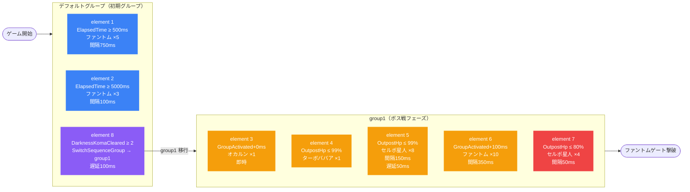

# hard_dan_00001 インゲーム詳細解説

> 生成日: 2026-03-01

---

## 1. 概要

`hard_dan_00001` は、ダンジョン系コンテンツにおける「ハード」難易度の第1ステージとして設計されたインゲーム設定である。BGMには `SSE_SBG_003_001` が使用され、ボスBGMは設定されていないため、ボス出現時も通常BGMが継続する。ファントムゲートのHPは **50,000** であり、アートワークキーとして `dan_0002` が割り当てられている。プレイヤー拠点や防衛対象のカスタム設定は行われておらず、全体係数（HP・ATK・SPD）はすべて 1.0 の素の値が適用される。

ステージ構成の核心は「**暗闇コマ**」を活用したフェーズ移行メカニズムである。前半フェーズ（デフォルトグループ）では、経過時間トリガーでファントム（雑魚）が断続的に召喚され、並行して暗闇コマが2枚クリアされるとグループ切り替えが発火する。暗闇コマのクリアには味方ユニットのコマ侵入が必要であり、プレイヤーが積極的に盤面を制御することで後半のボス戦へ突入できる設計になっている。これにより、単純な耐久戦ではなく能動的なコマ管理が要求される。

後半フェーズ（group1）に移行すると、キャラクターボスの「オカルン」（`c_dan_00001_general_h_Boss_Colorless`）が即座に登場し、ファントムゲート残HP 99% 以下を条件として「ターボババア」（`e_dan_00201_general_n_Boss_Colorless`）と「セルポ星人」（`e_dan_00001_general_h_Normal_Colorless`）の大規模ウェーブが始まる。さらに group1 突入から 100ms 以内に、追加のファントムが10体（インターバル350ms）で出現し続けるため、ボス戦でもファントムによる継続プレッシャーが維持される。

スペシャルルールとして `SpeedAttack: 1000` が設定されており、一定速度以上の高速撃破にボーナスが発生する仕組みがある。ステージ全体を通じて属性はすべて「無属性 (Colorless)」で統一されており、属性カウンターによる有利不利が生じない。コマ構成は2行からなり、1行目には暗闇効果のない通常コマと暗闇コマが並び、2行目には全幅の暗闇コマが1枚配置される。この非対称なコマ配置が、プレイヤーに戦略的なルートを選択させる設計意図を体現している。

---

## 2. 関連テーブル設定

### MstInGame

| カラム | 値 |
|-------|-----|
| id | `hard_dan_00001` |
| ENABLE | `e` |
| mst_auto_player_sequence_id | `hard_dan_00001` |
| mst_auto_player_sequence_set_id | `hard_dan_00001` |
| bgm_asset_key | `SSE_SBG_003_001` |
| boss_bgm_asset_key | （未設定） |
| loop_background_asset_key | （未設定） |
| player_outpost_asset_key | （未設定） |
| mst_page_id | `hard_dan_00001` |
| mst_enemy_outpost_id | `hard_dan_00001` |
| mst_defense_target_id | （未設定） |
| boss_mst_enemy_stage_parameter_id | `1` |
| boss_count | （未設定） |
| normal_enemy_hp_coef | `1.0` |
| normal_enemy_attack_coef | `1.0` |
| normal_enemy_speed_coef | `1` |
| boss_enemy_hp_coef | `1.0` |
| boss_enemy_attack_coef | `1.0` |
| boss_enemy_speed_coef | `1` |
| release_key | `202509010` |

### MstEnemyOutpost

| カラム | 値 |
|-------|-----|
| id | `hard_dan_00001` |
| ENABLE | `e` |
| hp | `50,000` |
| is_damage_invalidation | （未設定） |
| outpost_asset_key | （未設定） |
| artwork_asset_key | `dan_0002` |
| release_key | `202509010` |

### MstPage + MstKomaLine

MstPageはシンプルな構造（id・release_keyのみ）で、コマ詳細はMstKomaLine側に保持される。

#### row 1（高さ: 0.55、レイアウト: 3.0）

| koma | asset_key | width | bg_offset | effect_type | effect_param1 | effect_param2 | effect_target_side |
|------|-----------|-------|-----------|-------------|---------------|---------------|--------------------|
| koma1 | `dan_00005` | 0.4 | 0.5 | None | 0 | 0.0 | All |
| koma2 | `dan_00005` | 0.6 | 0.5 | Darkness | 0 | 0.0 | Player |

#### row 2（高さ: 0.55、レイアウト: 1.0）

| koma | asset_key | width | bg_offset | effect_type | effect_param1 | effect_param2 | effect_target_side |
|------|-----------|-------|-----------|-------------|---------------|---------------|--------------------|
| koma1 | `dan_00005` | 1.0 | 0.5 | Darkness | 0 | 0.0 | Player |

### MstInGameI18n（日本語）

| カラム | 値 |
|-------|-----|
| id | `hard_dan_00001_ja` |
| language | `ja` |
| result_tips | （未設定） |
| description | 【属性情報】無属性の敵が登場するぞ！ / 【コマ効果情報】暗闇コマが登場するぞ！ / 味方がコマに侵入すると出現する敵やファントムゲートにダメージを与えると出現する敵もいるぞ！ |

### MstInGameSpecialRule

| カラム | 値 |
|-------|-----|
| id | `hard_dan_00001` |
| content_type | `Stage` |
| target_id | `hard_dan_00001` |
| rule_type | `SpeedAttack` |
| rule_value | `1000` |
| start_at | `2025-05-01 12:00:00` |
| end_at | `2037-12-31 23:59:59` |

---

## 3. 使用する敵パラメータ一覧

### カラム解説

| カラム名 | 説明 |
|---------|------|
| id | MstEnemyStageParameter の一意識別子 |
| mst_enemy_character_id | 対応するキャラクターID |
| character_unit_kind | ユニット種別（Normal / Boss） |
| role_type | 役割（Attack / Defense） |
| color | 属性色（Colorless = 無属性） |
| sort_order | 表示ソート順 |
| hp | 基礎HP |
| damage_knock_back_count | ノックバック発生するまでのダメージ蓄積数 |
| move_speed | 移動速度 |
| well_distance | ウェル距離（攻撃射程に関連） |
| attack_power | 攻撃力 |
| attack_combo_cycle | 攻撃コンボサイクル数 |
| mst_unit_ability_id1 | 特殊能力ID1 |
| drop_battle_point | 撃破時のバトルポイントドロップ量 |
| mstTransformationEnemyStageParameterId | 変身後パラメータID |
| transformationConditionType | 変身条件タイプ |
| transformationConditionValue | 変身条件値 |

### 全パラメータ表

| id | 日本語名 | unit_kind | role_type | HP | move_speed | well_distance | attack_power | combo_cycle | drop_bp | knock_back |
|---|---------|-----------|-----------|-----|-----------|---------------|-------------|------------|---------|------------|
| `e_glo_00001_general_n_Normal_Colorless` | ファントム | Normal | Attack | 1,000 | 40 | 0.2 | 50 | 1 | 100 | 1 |
| `e_dan_00001_general_h_Normal_Colorless` | セルポ星人 | Normal | Defense | 10,000 | 34 | 0.24 | 100 | 1 | 100 | （未設定） |
| `e_dan_00201_general_n_Boss_Colorless` | ターボババア | Boss | Attack | 100,000 | 75 | 0.24 | 1,000 | 1 | 500 | （未設定） |
| `c_dan_00001_general_h_Boss_Colorless` | オカルン | Boss | Defense | 10,000 | 31 | 0.2 | 100 | 5 | 200 | （未設定） |

### 特性解説

- **ファントム（`e_glo_00001_general_n_Normal_Colorless`）**: 前半フェーズおよび後半フェーズ双方で継続召喚される汎用雑魚。HP 1,000 と最も脆弱だが、ノックバック持ち（1カウント）で連打に弱い。移動速度 40 はこのステージで唯一ノックバックが設定されているユニット。role_type は Attack でファントムゲートに向かって進軍する。
- **セルポ星人（`e_dan_00001_general_h_Normal_Colorless`）**: ダンジョン固有の防衛型ノーマル敵。HP 10,000 で高耐久、role_type が Defense のため拠点前に留まり防衛ラインを形成する。group1 移行後に大量（最大8体・4体）召喚される。
- **ターボババア（`e_dan_00201_general_n_Boss_Colorless`）**: ボス種別の高速アタッカー。HP 100,000・移動速度 75（ステージ最速）・攻撃力 1,000 と圧倒的なスペックを持ち、撃破ボーナスも 500 と最高値。sort_order=6 でシーケンス序盤に定義。
- **オカルン（`c_dan_00001_general_h_Boss_Colorless`）**: キャラクタータイプのボスで5連撃コンボが特徴的。HP 10,000・移動速度 31（ステージ最遅）で前線に留まりやすい。group1 突入時に即時（t=0）召喚される主役ボス。

---

## 4. グループ構造の全体フロー

---

## 5. 全行の詳細データ（グループ単位・省略なし）

### デフォルトグループ（sequence_group_id = 空）

#### element 1 — `hard_dan_00001_1`

| カラム | 値 |
|-------|-----|
| condition_type | `ElapsedTime` |
| condition_value | `500`（ms） |
| action_type | `SummonEnemy` |
| action_value | `e_glo_00001_general_n_Normal_Colorless`（ファントム） |
| summon_count | `5` |
| summon_interval | `750`（ms） |
| summon_animation_type | `None` |
| aura_type | `Default` |
| death_type | `Normal` |
| enemy_hp_coef | `21` |
| enemy_attack_coef | `20` |
| enemy_speed_coef | `1` |
| override_drop_battle_point | `30` |
| defeated_score | `0` |
| action_delay | （未設定） |
| deactivation_condition_type | `None` |

**解説**: ゲーム開始から500ms後にファントムが5体、750msインターバルで召喚される最初のウェーブ。enemy_hp_coef=21・enemy_attack_coef=20 という高倍率がかかっており、見た目のHP/ATKは素の値より大幅に強化される。ドロップBPは30にオーバーライドされている。

---

#### element 2 — `hard_dan_00001_2`

| カラム | 値 |
|-------|-----|
| condition_type | `ElapsedTime` |
| condition_value | `5000`（ms） |
| action_type | `SummonEnemy` |
| action_value | `e_glo_00001_general_n_Normal_Colorless`（ファントム） |
| summon_count | `3` |
| summon_interval | `100`（ms） |
| summon_animation_type | `None` |
| aura_type | `Default` |
| death_type | `Normal` |
| enemy_hp_coef | `21` |
| enemy_attack_coef | `20` |
| enemy_speed_coef | `1` |
| override_drop_battle_point | `30` |
| defeated_score | `0` |
| action_delay | （未設定） |
| deactivation_condition_type | `None` |

**解説**: 開始5秒後にファントムがさらに3体、100msという高速インターバルで連続召喚される。element1と係数設定は同一だが、インターバルが大幅に短縮されており追い打ちウェーブの性質が強い。

---

#### element 8 — `hard_dan_00001_8`（グループ切り替えトリガー）

| カラム | 値 |
|-------|-----|
| condition_type | `DarknessKomaCleared` |
| condition_value | `2` |
| action_type | `SwitchSequenceGroup` |
| action_value | `group1` |
| aura_type | `Default` |
| death_type | `Normal` |
| enemy_speed_coef | `1` |
| override_drop_battle_point | `30` |
| defeated_score | `0` |
| action_delay | `100`（ms） |
| deactivation_condition_type | `None` |

**解説**: 暗闇コマが累計2枚クリアされると100ms後にgroup1へ切り替わる。このトリガーがステージの核心であり、プレイヤーが暗闇コマを踏破するペースによって後半フェーズ突入タイミングが決まる。

---

### group1

#### element 3 — `hard_dan_00001_3`

| カラム | 値 |
|-------|-----|
| condition_type | `ElapsedTimeSinceSequenceGroupActivated` |
| condition_value | `0`（ms） |
| action_type | `SummonEnemy` |
| action_value | `c_dan_00001_general_h_Boss_Colorless`（オカルン） |
| summon_count | `1` |
| summon_interval | `0`（ms） |
| summon_animation_type | `None` |
| aura_type | `Boss` |
| death_type | `Normal` |
| enemy_hp_coef | `45` |
| enemy_attack_coef | `3` |
| enemy_speed_coef | `1` |
| override_drop_battle_point | `100` |
| defeated_score | `0` |
| action_delay | （未設定） |
| deactivation_condition_type | `None` |

**解説**: group1 移行と同時（t=0）にオカルンが1体召喚される。aura_type=Boss によりボスオーラが付与。enemy_hp_coef=45 と最大倍率が設定されており非常に高耐久。attack_coef=3 は抑えられており、持久戦向けの設計。

---

#### element 4 — `hard_dan_00001_4`

| カラム | 値 |
|-------|-----|
| condition_type | `OutpostHpPercentage` |
| condition_value | `99` |
| action_type | `SummonEnemy` |
| action_value | `e_dan_00201_general_n_Boss_Colorless`（ターボババア） |
| summon_count | `1` |
| summon_interval | `0`（ms） |
| summon_animation_type | `None` |
| aura_type | `Default` |
| death_type | `Normal` |
| enemy_hp_coef | `2.8` |
| enemy_attack_coef | `1.5` |
| enemy_speed_coef | `1` |
| override_drop_battle_point | `200` |
| defeated_score | `0` |
| action_delay | （未設定） |
| deactivation_condition_type | `None` |

**解説**: ファントムゲートのHPが99%以下になった瞬間（実質的にgroup1突入後、初撃を受けた時点）にターボババアが1体出現する。条件値99%は「ほぼ即時」を意味する疑似的な即時トリガー。drop_bp=200 と高いため撃破メリットも大きい。

---

#### element 5 — `hard_dan_00001_5`

| カラム | 値 |
|-------|-----|
| condition_type | `OutpostHpPercentage` |
| condition_value | `99` |
| action_type | `SummonEnemy` |
| action_value | `e_dan_00001_general_h_Normal_Colorless`（セルポ星人） |
| summon_count | `8` |
| summon_interval | `150`（ms） |
| summon_animation_type | `None` |
| aura_type | `Default` |
| death_type | `Normal` |
| enemy_hp_coef | `4.9` |
| enemy_attack_coef | `4` |
| enemy_speed_coef | `1` |
| override_drop_battle_point | `30` |
| defeated_score | `0` |
| action_delay | `50`（ms） |
| deactivation_condition_type | `None` |

**解説**: element4と同トリガー（OutpostHp≤99%）だが50msの遅延があり、ターボババア召喚の直後にセルポ星人8体が150msインターバルで連続出現する。防衛役の大量投入により、攻撃役のターボババアを守るような配置が形成される。

---

#### element 6 — `hard_dan_00001_6`

| カラム | 値 |
|-------|-----|
| condition_type | `ElapsedTimeSinceSequenceGroupActivated` |
| condition_value | `100`（ms） |
| action_type | `SummonEnemy` |
| action_value | `e_glo_00001_general_n_Normal_Colorless`（ファントム） |
| summon_count | `10` |
| summon_interval | `350`（ms） |
| summon_animation_type | `None` |
| aura_type | `Default` |
| death_type | `Normal` |
| enemy_hp_coef | `21` |
| enemy_attack_coef | `20` |
| enemy_speed_coef | `1` |
| override_drop_battle_point | `30` |
| defeated_score | `0` |
| action_delay | （未設定） |
| deactivation_condition_type | `None` |

**解説**: group1 突入から100ms後にファントムが10体（インターバル350ms）で出現し始める。前半フェーズと同じ高倍率のファントムが継続的にプレッシャーをかけることで、ボス戦中も盤面管理が必要になる。

---

#### element 7 — `hard_dan_00001_7`

| カラム | 値 |
|-------|-----|
| condition_type | `OutpostHpPercentage` |
| condition_value | `80` |
| action_type | `SummonEnemy` |
| action_value | `e_dan_00001_general_h_Normal_Colorless`（セルポ星人） |
| summon_count | `4` |
| summon_interval | `50`（ms） |
| summon_animation_type | `None` |
| aura_type | `Default` |
| death_type | `Normal` |
| enemy_hp_coef | `4.9` |
| enemy_attack_coef | `4` |
| enemy_speed_coef | `1` |
| override_drop_battle_point | `30` |
| defeated_score | `0` |
| action_delay | （未設定） |
| deactivation_condition_type | `None` |

**解説**: ファントムゲートが20%ダメージを受けた時点（HP≤80%）でセルポ星人が追加で4体、50ms超高速インターバルでなだれ込む。終盤の追い打ちウェーブで、防衛ラインの崩壊を防ぐためのさらなる強化手段となる。

---

## 6. グループ切り替えまとめ表

| 行ID | 発火グループ | element_id | 条件タイプ | 条件値 | 切り替え先 | 遅延（ms） |
|------|------------|------------|-----------|--------|-----------|-----------|
| `hard_dan_00001_8` | デフォルト | 8 | DarknessKomaCleared | 2 | group1 | 100 |

このステージで定義されているグループ切り替えは1件のみ。デフォルトグループからgroup1への一方向遷移であり、ループや逆遷移は存在しない。暗闇コマ2枚のクリアという明確な達成条件が、ステージのターニングポイントを形成している。

---

## 7. スコア体系

`MstInGameSpecialRule` によるスコア設定のみが適用される。`defeated_score` はシーケンスの全行で `0` に設定されているため、敵撃破によるスコア加算はない。

| 項目 | 値 | 説明 |
|-----|-----|------|
| rule_type | `SpeedAttack` | 高速撃破ボーナスルール |
| rule_value | `1000` | 閾値となるスピード指標 |
| 適用期間 | 2025-05-01 〜 2037-12-31 | 長期有効 |
| defeated_score | `0`（全行） | 敵撃破スコアは付与されない |
| override_drop_battle_point（ファントム） | `30` | 通常撃破時BPドロップ |
| override_drop_battle_point（セルポ星人） | `30` | 通常撃破時BPドロップ |
| override_drop_battle_point（ターボババア） | `200` | ボス撃破時BPドロップ |
| override_drop_battle_point（オカルン） | `100` | キャラボス撃破時BPドロップ |

スコア設計の特徴として、敵撃破スコアをゼロに固定することで純粋な「速度」でプレイヤーを評価するシンプルな仕組みが採用されている。SpeedAttack ルールの value=1000 が具体的にどのような速度指標と紐づくかはゲームロジック側に依存する。

---

## 8. この設定から読み取れる設計パターン

1. **コマ管理をフェーズトリガーに使う「能動的フェーズ移行」パターン**
   暗闇コマのクリア数（`DarknessKomaCleared = 2`）をグループ切り替えの発火条件にすることで、時間経過だけでなくプレイヤーの行動そのものがステージ進行を決める構造になっている。プレイヤーが暗闇コマを迂回すれば前半フェーズが長引き、積極的に踏めばボス戦が早期に始まるというトレードオフを生み出している。

2. **「OutpostHp ≤ 99%」を実質的な即時トリガーとして活用するパターン**
   group1 内の element 4・5 で `OutpostHpPercentage = 99` が使われており、これはファントムゲートに1点でもダメージが入れば発火する疑似即時条件として機能する。ElapsedTime=0 では実現できない「HPへの攻撃が発生した瞬間」への反応を、HPパーセンテージ条件で代替している。

3. **同一条件に複数のアクションをstaggeringで重ねる「波状召喚」パターン**
   element 4（ターボババア・遅延なし）と element 5（セルポ星人・遅延50ms）は同一条件 `OutpostHp ≤ 99%` で発火し、`action_delay` の差によって出現タイミングがずれる。これにより、単一トリガーで攻守の役割が異なる複数種の敵が連続出現し、密度の高い攻勢を演出できる。

4. **前半・後半で同一ユニットの役割を引き継ぐ「継続プレッシャー」パターン**
   ファントム（`e_glo_00001_general_n_Normal_Colorless`）はデフォルトグループとgroup1の両方で召喚設定されており、フェーズが変わっても同じ係数（hp_coef=21、atk_coef=20）で出現し続ける。ボス戦中も前半フェーズと同質の雑魚が継続することで、プレイヤーは終始盤面の制御を求められる。

5. **係数の非対称設計によるキャラクター役割の明確化**
   - ファントム: hp_coef=21、atk_coef=20（均等強化・汎用雑魚）
   - セルポ星人: hp_coef=4.9、atk_coef=4（高耐久防衛型）
   - ターボババア: hp_coef=2.8、atk_coef=1.5（スピード型、素の性能をそのまま活かす）
   - オカルン: hp_coef=45、atk_coef=3（超高耐久・低火力の壁型ボス）
   各ユニットの素ステータスと係数を組み合わせることで、最終的な役割（壁・高速突撃・防衛ライン形成）が明確に分化している。

6. **スコアを撃破点ゼロにしてSpeedAttackに一本化するシンプル評価設計**
   全シーケンス行の `defeated_score = 0` とすることで、個別撃破によるスコア稼ぎを排除している。評価軸を「速度」の1点に絞ることで、プレイヤーに「敵を倒すより早く決着をつけること」を動機づけるクリーンな設計になっている。
