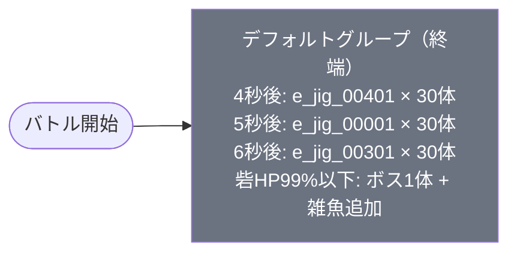

# hard_jig_00005 インゲームデータ詳細解説

> 参照リポジトリ: `projects/glow-masterdata`
> リリースキー: 202509010
> 本ファイルはMstAutoPlayerSequenceが6行のメインクエスト（hard難度）の全データ設定を解説する

---

## 概要

**メインクエスト・ジグ編 Hard難度**（砦破壊型・hard難度）。

- 砦のHP: `50,000` でダメージ有効
- BGM: `SSE_SBG_003_003`（ボスBGMなし）
- グループ: デフォルトグループのみ（1グループ構成・ループなし・終端グループ）
- 使用する敵の種類: 4種類（全員Green属性。雑魚3種 + ボス1種）
- 特徴的なルール: **砦HPギミック**あり（`OutpostHpPercentage(99)` でバトル開始直後にボス＋追加雑魚が出現）
- 敵属性: 全員**Green属性**（赤属性のキャラが有利に戦える）

---

## 関連テーブル設定

### MstInGame

| カラム | 値 |
|--------|-----|
| `id` | `hard_jig_00005` |
| `mst_auto_player_sequence_set_id` | `hard_jig_00005` |
| `bgm_asset_key` | `SSE_SBG_003_003` |
| `boss_bgm_asset_key` | （空） |
| `loop_background_asset_key` | （空） |
| `player_outpost_asset_key` | （空） |
| `mst_page_id` | `hard_jig_00005` |
| `mst_enemy_outpost_id` | `hard_jig_00005` |
| `mst_defense_target_id` | （空） |
| `boss_mst_enemy_stage_parameter_id` | `1` |
| `boss_count` | （空） |
| `normal_enemy_hp_coef` | `1.0` |
| `normal_enemy_attack_coef` | `1.0` |
| `normal_enemy_speed_coef` | `1` |
| `boss_enemy_hp_coef` | `1.0` |
| `boss_enemy_attack_coef` | `1.0` |
| `boss_enemy_speed_coef` | `1` |
| `release_key` | `202509010` |

### MstEnemyOutpost（敵砦）

| カラム | 値 | 意味 |
|--------|-----|------|
| `id` | `hard_jig_00005` | |
| `hp` | `50,000` | Hard難度の砦HP（normal難度より大幅に高い） |
| `is_damage_invalidation` | （空） | **ダメージ有効**（砦破壊型） |
| `outpost_asset_key` | （空） | |
| `artwork_asset_key` | `jig_0002` | 背景アートワーク（ジグ編） |

### MstPage + MstKomaLine（コマフィールド）

2行構成。

```
row=1  height=0.75  layout=4.0  （2コマ: 0.75, 0.25）
  koma1: jig_00003  width=0.75  effect=None（全対象）
  koma2: jig_00003  width=0.25  effect=None（全対象）

row=2  height=0.75  layout=1.0  （1コマ: 1.0）
  koma1: jig_00003  width=1.0   effect=None（全対象）
```

> **コマ効果の補足**: 全コマ `effect=None` のためコマ効果ギミックなし。ジグ編の背景アセット（`jig_00003`）を使用した2行レイアウト。row=1は2コマ（幅0.75と0.25の非対称配置）、row=2は1コマ（全幅）の構成。

### MstInGameI18n（バトル説明文）

**result_tips（バトルヒント）:**
> （空）

**description（ステージ説明）:**
> 【属性情報】
> 緑属性の敵が登場するので赤属性のキャラは有利に戦うこともできるぞ!
>
> 【ギミック情報】
> ファントムゲートHPを削ると敵が追加で登場するぞ!
> ファントムゲートのHPを削るタイミングに気をつけよう!

---

## 使用する敵パラメータ（MstEnemyStageParameter）一覧

4種類の敵パラメータを使用。`e_` プレフィックスは汎用敵。
IDの命名規則: `e_{シリーズID}_mainquest_{kind}_{color}`

### カラム解説

| カラム名（略称） | DBカラム名 | 説明 |
|---------------|-----------|------|
| id | id | MstEnemyStageParameterの主キー |
| 日本語名 | — | MstEnemyCharacterI18nから取得 |
| キャラID | mst_enemy_character_id | 紐付くキャラモデル・スキルの参照元 |
| kind | character_unit_kind | `Normal`（通常敵）/ `Boss`（ボス）。UIオーラ表示に影響 |
| role | role_type | 属性相性の役職（Attack/Technical/Defense/Support） |
| color | color | 属性色（Red/Yellow/Green/Blue/Colorless） |
| sort_order | sort_order | ゲーム内表示順 |
| base_hp | hp | ベースHP（`enemy_hp_coef` 乗算前の素値） |
| base_atk | attack_power | ベース攻撃力（`enemy_attack_coef` 乗算前の素値） |
| base_spd | move_speed | 移動速度（数値が大きいほど速い） |
| well_dist | well_distance | 攻撃射程（コマ単位） |
| combo | attack_combo_cycle | 攻撃コンボ数（1=単発） |
| knockback | damage_knock_back_count | 被攻撃時ノックバック回数（0=ノックバックなし） |
| ability | mst_unit_ability_id1 | 特殊アビリティID |
| drop_bp | drop_battle_point | 基本ドロップバトルポイント |

### 全4種類の詳細パラメータ

| MstEnemyStageParameter ID | キャラID | kind | role | color | sort | base_hp | base_atk | base_spd | well_dist | combo | knockback | ability | drop_bp |
|--------------------------|---------|------|------|-------|------|---------|---------|---------|-----------|-------|-----------|---------|---------|
| `e_jig_00401_mainquest_Normal_Green` | `enemy_jig_00401` | Normal | Technical | Green | 402 | 3,000 | 100 | 25 | 0.22 | 1 | 4 | （空） | 150 |
| `e_jig_00001_mainquest_Normal_Green` | `enemy_jig_00001` | Normal | Defense | Green | 11 | 10,000 | 50 | 27 | 0.22 | 1 | 2 | （空） | 150 |
| `e_jig_00301_mainquest_Normal_Green` | `enemy_jig_00301` | Normal | Attack | Green | 302 | 5,000 | 100 | 35 | 0.2 | 1 | 3 | （空） | 200 |
| `e_jig_00201_mainquest_Boss_Green` | `enemy_jig_00201` | Boss | Defense | Green | 201 | 10,000 | 50 | 20 | 0.3 | 1 | 1 | （空） | 300 |

> **実際のHP・ATKは `base × MstAutoPlayerSequence.enemy_hp_coef` で決まる。**
> 例: ボス（e_jig_00201） hp倍55 → 実HP `10,000 × 55 = 550,000`

### 敵パラメータの特性解説

| 比較項目 | e_jig_00401（Technical） | e_jig_00001（Defense） | e_jig_00301（Attack） | e_jig_00201（Boss） |
|---------|------------------------|-----------------------|----------------------|---------------------|
| kind | Normal | Normal | Normal | **Boss** |
| role | Technical | Defense | Attack | Defense |
| base_hp | 3,000（低い） | 10,000（最高） | 5,000（中） | 10,000（最高） |
| base_atk | 100（高い） | 50（低い） | 100（高い） | 50（低い） |
| base_spd | 25（やや遅い） | 27（標準） | 35（最速） | 20（最遅） |
| well_dist | 0.22 | 0.22 | 0.2（最小） | 0.3（最大） |
| knockback | **4回**（最多） | 2回 | 3回 | 1回 |
| 登場グループ | デフォルト（elem 1・5） | デフォルト（elem 2・6） | デフォルト（elem 3） | デフォルト（elem 4） |

**設計上の特徴**:
- `e_jig_00401`（Technical）は `base_hp=3,000` と低HPだが、ノックバック回数4回が最多。`enemy_hp_coef=7.8` の大倍率で実HP 23,400に引き上げられており、タフで撃ち合いが続く敵として設計されている。
- `e_jig_00001`（Defense）は `base_hp=10,000` とbase値最高。2回のノックバック設定で堅実に前進する防御型。`enemy_hp_coef=5.5` で実HP 55,000と砦HP（50,000）を超えており、放置すると砦を壊される脅威度。
- `e_jig_00301`（Attack）は `move_speed=35` と4種中最速で短い射程（0.2）。前線に素早く到達する突撃型。`enemy_hp_coef=8.0` で実HP 40,000。
- `e_jig_00201`（Boss）は kind=Boss でオーラあり。`enemy_hp_coef=55` の超高倍率設定で実HP 550,000と圧倒的なHPを持つボス。`move_speed=20` と最遅だが、`well_distance=0.3` と射程が広く遠くから攻撃できる。`OutpostHpPercentage(99)` トリガーで砦にダメージを与えた直後に登場する。
- 全員 **Green属性** で統一されており、赤属性キャラが属性有利を生かせるステージ設計。

---

## グループ構造の全体フロー（Mermaid）



> **Mermaid スタイルカラー規則**:
> - デフォルトグループ: `#6b7280`（グレー）
>
> **注意**: `hard_jig_00005` はデフォルトグループのみの1グループ構成。SwitchSequenceGroup（グループ切り替え）行が存在しないため、フロー遷移はなく終端グループとして機能する。バトル開始から終了まで同一グループが動作し続ける設計。

---

## 全6行の詳細データ（グループ単位）

### デフォルトグループ（elem 1〜6、終端グループ）

バトル開始から動作する唯一のグループ。タイマー（4〜6秒後）で雑魚3種を大量投入し、砦に1ダメージを与えた直後に発動する `OutpostHpPercentage(99)` でボス1体＋雑魚追加が登場。グループ切り替えなし・ループなしのシンプルな構成。

| id | elem | 条件 | action_type | action_value | 召喚数 | interval | aura | hp倍 | atk倍 | spd倍 | override_bp | defeated_score | 説明 |
|----|------|------|-------------|--------------|--------|---------|------|------|------|------|------------|----------------|------|
| hard_jig_00005_1 | 1 | ElapsedTime(400) | SummonEnemy | e_jig_00401_mainquest_Normal_Green | 30 | 1,000 | Default | 7.8 | 5 | 1 | 75 | 0 | 4秒後にTechnical/Green雑魚を30体、1秒間隔で投入 |
| hard_jig_00005_2 | 2 | ElapsedTime(500) | SummonEnemy | e_jig_00001_mainquest_Normal_Green | 30 | 850 | Default | 5.5 | 10 | 1 | 80 | 0 | 5秒後にDefense/Green雑魚を30体、0.85秒間隔で投入 |
| hard_jig_00005_3 | 3 | ElapsedTime(600) | SummonEnemy | e_jig_00301_mainquest_Normal_Green | 30 | 750 | Default | 8 | 10 | 1 | 70 | 0 | 6秒後にAttack/Green雑魚を30体、0.75秒間隔で投入 |
| hard_jig_00005_4 | 4 | OutpostHpPercentage(99) | SummonEnemy | e_jig_00201_mainquest_Boss_Green | 1 | 0 | Default | 55 | 28 | 1 | 100 | 0 | 砦HP99%以下でBoss/Greenボス1体（実HP 550,000） |
| hard_jig_00005_5 | 5 | OutpostHpPercentage(99) | SummonEnemy | e_jig_00401_mainquest_Normal_Green | 5 | 150 | Default | 7.8 | 5 | 1 | 75 | 0 | 砦HP99%以下でTechnical/Green雑魚を5体追加 |
| hard_jig_00005_6 | 6 | OutpostHpPercentage(99) | SummonEnemy | e_jig_00001_mainquest_Normal_Green | 5 | 250 | Default | 5.5 | 10 | 1 | 80 | 0 | 砦HP99%以下でDefense/Green雑魚を5体追加 |

**ポイント:**
- `ElapsedTime(400)` = 4,000ms = 4秒後、`ElapsedTime(500)` = 5,000ms = 5秒後、`ElapsedTime(600)` = 6,000ms = 6秒後と1秒刻みで3種の雑魚投入が始まる。バトル開始直後から多数の敵が押し寄せる高圧設計。
- 各雑魚の召喚数が **30体** と非常に多い。interval（召喚間隔）も750〜1,000（7.5〜10秒ごとに1体）と計算すると、30体全員が登場し終えるまで約225〜300秒かかることになる。実質的に「無限湧き」に近い持続圧力。
- `OutpostHpPercentage(99)` は砦HPが99%以下、すなわち砦に **1ダメージ** を与えた直後に発動する。ゲーム開始直後のほぼ確実なタイミングで elem 4〜6 が起動する仕組み。
- elem 4 のボス（e_jig_00201）は `enemy_hp_coef=55` で実HP **550,000**。砦HP 50,000の **11倍** という超高耐久ボス。
- elem 5・6 は砦HP条件発動後に追加投入される雑魚部隊。elem 5 は5体を0.15秒間隔（interval=150=1.5秒おきに1体）、elem 6 は5体を0.25秒間隔（interval=250=2.5秒おきに1体）で出現させる。
- `override_drop_battle_point` が全行に設定されている（70〜100）。MstEnemyStageParameterの `drop_battle_point` は使用されず、すべてここで上書きされる。

---

## グループ切り替えまとめ表

| 切り替え | 条件 | 遷移先 |
|---------|------|--------|
| （なし） | — | — |

> **補足**: `hard_jig_00005` はグループ切り替えが一切存在しない。デフォルトグループのみで構成される終端グループであり、バトル開始から終了まで同一グループが継続動作する。グループ遷移ではなく **タイマー** と **砦HP閾値** の2種類のトリガーで敵出現を制御するシンプルな設計。

各グループの概要:
- デフォルト: バトル全体を通じて動作する唯一のグループ（終端グループ）

---

## スコア体系

バトルポイントは `override_drop_battle_point`（MstAutoPlayerSequence設定値）が優先される。全6行すべてに `override_drop_battle_point` が設定されているため、MstEnemyStageParameterの `drop_battle_point` は使用されない。

| 敵の種類 | MstEnemyStageParameter ID | override_bp（獲得バトルポイント） | 召喚数 | 備考 |
|---------|--------------------------|----------------------------------|--------|------|
| e_jig_00401（Technical/Green） | e_jig_00401_mainquest_Normal_Green | 75 | 30体（タイマー）+ 5体（砦HP条件） | drop_bp=150 → override_bp=75（半減） |
| e_jig_00001（Defense/Green） | e_jig_00001_mainquest_Normal_Green | 80 | 30体（タイマー）+ 5体（砦HP条件） | drop_bp=150 → override_bp=80（半減強） |
| e_jig_00301（Attack/Green） | e_jig_00301_mainquest_Normal_Green | 70 | 30体（タイマー） | drop_bp=200 → override_bp=70（65%減） |
| e_jig_00201（Boss/Green） | e_jig_00201_mainquest_Boss_Green | 100 | 1体（砦HP条件） | drop_bp=300 → override_bp=100（67%減） |

- 全行の `defeated_score` は `0`（リザルト画面スコア表示なし）
- `override_drop_battle_point` がすべての行に設定されており、MstEnemyStageParameterの素の `drop_battle_point` より低い値に調整されている
- ボス（e_jig_00201）は override_bp=100 と最高値だが、召喚数が1体のため総獲得量は雑魚より少ない
- メインクエスト系コンテンツはスコア競争ではなく砦破壊が目的のため、`defeated_score` は全件0

---

## この設定から読み取れる設計パターン

### 1. 砦HP99%閾値による即時ボス召喚ギミック

`OutpostHpPercentage(99)` = 砦HPが99%以下になった瞬間（= 1ダメージを与えた直後）にボスと追加雑魚が出現するトリガーは、事実上「バトル開始直後に必ず発動」するギミックとして機能する。「ファントムゲートHPを削るタイミングに気をつけよう!」という説明文は、このトリガーを意識したプレイングを促す記述。ボスが突然現れる演出効果と、「いつ砦を攻撃するか」というストラテジー要素を生み出している。

### 2. 30体大量召喚による「無限湧き」的圧力設計

雑魚3種がそれぞれ30体というHard難度ならではの大量召喚設定。interval 750〜1,000（7.5〜10秒に1体ペース）で継続的に投入されるため、理論上300秒（5分）以上にわたって敵が出現し続ける。砦HP 50,000と高めに設定されていることと合わせて、素早く砦を破壊しないと永続的な圧力にさらされる設計。

### 3. タイマー1秒刻みの連続投入による難度演出

elem 1〜3 の条件が `ElapsedTime(400)` / `ElapsedTime(500)` / `ElapsedTime(600)` と **1秒刻み** で設定されており、バトル開始後4秒・5秒・6秒と立て続けに3種の敵が投入される。コンテンツタイプガイドのイベントクエスト型と異なり、ウェーブ切り替えではなく同一グループ内でタイマー制御を使い分けるシンプルな手法。

### 4. 三役職（Attack/Technical/Defense）の同時配置で多様な対処を要求

雑魚3種がそれぞれ Attack / Technical / Defense の異なる role_type を持ち、すべて Green属性。属性は統一しつつ役職を分散させることで、単一の属性有利に頼るだけでは崩せない複合的な敵構成を作り出している。Hard難度の難度調整手法として、属性統一 + 役職多様化という組み合わせが使われている。

### 5. override_drop_battle_pointによるBP調整

全行に `override_drop_battle_point` が設定されており、MstEnemyStageParameterの素値（150〜300）より低い値（70〜100）に一律調整されている。30体という大量召喚を行うメインクエストで1体あたりのBP獲得量を抑えることで、レイド・イベントなどスコアアタック型コンテンツとのBP経済バランスを保つ設計思想が読み取れる。

### 6. ボスの超高HP設計（実HP 550,000）と砦破壊優先の攻略誘導

ボス（e_jig_00201）の `enemy_hp_coef=55` による実HP 550,000は、砦HP 50,000の11倍。砦破壊型コンテンツにおいてボスを倒すことを現実的に困難にすることで、プレイヤーを「ボスと戦いながら砦を削る」ではなく「砦を最優先で破壊する」戦略に誘導している。ボスの `move_speed=20`（最遅）と `well_distance=0.3`（最長射程）の組み合わせにより、遠距離から攻撃を継続するタフな存在として機能する。
