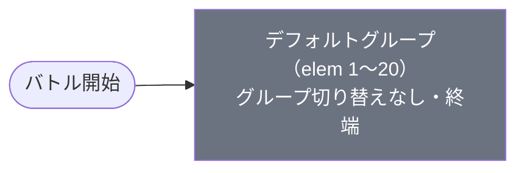

# normal_chi_00001 インゲームデータ詳細解説

> 参照リポジトリ: `projects/glow-masterdata`
> リリースキー: 202509010
> 本ファイルはMstAutoPlayerSequenceが20行のメインクエスト（normal難度）の全データ設定を解説する

---

## 概要

チェンソーマン（chi）シリーズのメインクエスト第1弾（normal難度）。砦HPは50,000でダメージ有効（砦破壊型）。BGMは`SSE_SBG_003_001`、ループ背景は`glo_00016`。2行構成のコマフィールドを使用し、行1は2コマ（幅0.4＋幅0.6）、行2は1コマ（幅1.0）で、いずれのコマにも特殊効果は設定されていない。

登場する敵は2種類。いずれもゾンビ（enemy_chi_00101）をベースとした敵で、無属性（Colorless）版はHP5,000・攻撃320・速度35の防衛型（Defense）、黄属性（Yellow）版はHP13,000・攻撃720・速度35のテクニカル型（Technical）。どちらも中速で接近するが、黄属性は無属性の2.5倍以上の火力を持ち実質的な主力として機能する。

グループ切り替えはなく、全20行がデフォルトグループに収まる単一グループ構成。開始直後から時間経過で無属性ゾンビが召喚され、早期に3体を倒すと追加大波が発生する。序盤は時間条件と撃破数条件を交互に使いながら無属性→黄属性と徐々に移行し、12体撃破後は黄属性ゾンビが3列に整列して降り注ぐ密集攻勢が展開される。砦にダメージが入ると99体×2ライン（elem19・20）という無限に近い量の黄属性ゾンビが押し寄せる設計で、砦HPの維持が最大のポイントとなる。

バトルヒントは未設定。ステージ説明では「黄属性の敵に対して緑属性有利、無属性も登場する」ことが案内されており、緑属性キャラをパーティに組み込むことが推奨されている。

---

## 関連テーブル設定

### MstInGame

| カラム | 値 |
|--------|-----|
| `id` | `normal_chi_00001` |
| `mst_auto_player_sequence_set_id` | `normal_chi_00001` |
| `bgm_asset_key` | `SSE_SBG_003_001` |
| `boss_bgm_asset_key` | （空） |
| `loop_background_asset_key` | `glo_00016` |
| `mst_page_id` | `normal_chi_00001` |
| `mst_enemy_outpost_id` | `normal_chi_00001` |
| `boss_mst_enemy_stage_parameter_id` | `1` |
| `normal_enemy_hp_coef` | `1.0` |
| `normal_enemy_attack_coef` | `1.0` |
| `normal_enemy_speed_coef` | `1` |
| `boss_enemy_hp_coef` | `1.0` |
| `boss_enemy_attack_coef` | `1.0` |
| `boss_enemy_speed_coef` | `1` |

### MstEnemyOutpost（敵砦）

| カラム | 値 | 意味 |
|--------|-----|------|
| `id` | `normal_chi_00001` | |
| `hp` | `50,000` | 通常ブロックの標準砦HP |
| `is_damage_invalidation` | （空） | **ダメージ有効**（砦破壊型） |
| `artwork_asset_key` | `chi_0001` | 背景アートワーク |

### MstPage + MstKomaLine（コマフィールド）

2行構成。

```
row=1  height=0.55  layout=3.0  (2コマ: 0.4, 0.6)
  koma1: glo_00016  width=0.4  bg_offset=0.6  effect=None
  koma2: glo_00016  width=0.6  bg_offset=0.6  effect=None

row=2  height=0.75  layout=1.0  (1コマ: 1.0)
  koma1: glo_00016  width=1.0  bg_offset=-1.0  effect=None
```

> **コマ効果の補足**: コマ効果は設定されていない。全コマが通常コマとして機能する。

### MstInGameI18n（バトル説明文）

**result_tips（バトルヒント）:**
> （未設定）

**description（ステージ説明）:**
> 【属性情報】\n黄属性の敵が登場するので緑属性のキャラは有利に戦うこともできるぞ!\nさらに、無属性の敵も登場するぞ!

---

## 使用する敵パラメータ（MstEnemyStageParameter）一覧

2種類の敵パラメータを使用。`e_` プレフィックスは汎用敵。
IDの命名規則: `e_{キャラID}_general_Normal_{color}`

### カラム解説

| カラム名（略称） | DBカラム名 | 説明 |
|---------------|-----------|------|
| id | id | MstEnemyStageParameterの主キー |
| キャラID | mst_enemy_character_id | 紐付くキャラモデル・スキルの参照元 |
| kind | character_unit_kind | `Normal`（通常敵）/ `Boss`（ボス）。UIオーラ表示に影響 |
| role | role_type | 属性相性の役職（Attack/Technical/Defense/Support） |
| color | color | 属性色（Red/Yellow/Green/Blue/Colorless） |
| sort_order | sort_order | ゲーム内表示順 |
| base_hp | hp | ベースHP（`enemy_hp_coef` 乗算前の素値） |
| base_atk | attack_power | ベース攻撃力（`enemy_attack_coef` 乗算前の素値） |
| base_spd | move_speed | 移動速度（数値が大きいほど速い） |
| well_dist | well_distance | 攻撃射程（コマ単位） |
| combo | attack_combo_cycle | 攻撃コンボ数（1=単発） |
| knockback | damage_knock_back_count | 被攻撃時ノックバック回数（0=ノックバックなし） |
| ability | mst_unit_ability_id1 | 特殊アビリティID |
| drop_bp | drop_battle_point | 基本ドロップバトルポイント |

### 全2種類の詳細パラメータ

| MstEnemyStageParameter ID | 日本語名 | キャラID | kind | role | color | sort | base_hp | base_atk | base_spd | well_dist | combo | knockback | ability | drop_bp |
|--------------------------|---------|---------|------|------|-------|------|---------|----------|---------|-----------|-------|-----------|---------|---------|
| e_chi_00101_general_Normal_Colorless | ゾンビ | enemy_chi_00101 | Normal | Defense | Colorless | 801 | 5,000 | 320 | 35 | 0.11 | 1 | 1 | （なし） | 50 |
| e_chi_00101_general_Normal_Yellow | ゾンビ | enemy_chi_00101 | Normal | Technical | Yellow | 802 | 13,000 | 720 | 35 | 0.11 | 1 | 1 | （なし） | 50 |

> **実際のHP・ATKは `base × MstAutoPlayerSequence.enemy_hp_coef` で決まる。** 本ステージはすべて 1.0 倍。

### 敵パラメータの特性解説

- **無属性ゾンビ（Colorless）**: 序盤の主役。HPが控えめ（5,000）・攻撃も控えめ（320）だが初動で大量召喚される。撃破ポイントは50点。
- **黄属性ゾンビ（Yellow）**: 中盤以降の主役。HPはやや強め（13,000）・攻撃は高火力（720）。属性対策なしだと継続ダメージが大きい。緑属性キャラで有利に処理できる。
- 両敵とも速度35（中速）・射程0.11・単発攻撃（コンボ1）・ノックバック1回と基本的なステータス構成。アビリティは持たない。

---

## グループ構造の全体フロー（Mermaid）



> グループ切り替えは存在しない。全20行がデフォルトグループで完結する。

---

## 全20行の詳細データ（デフォルトグループ）

### デフォルトグループ（elem 1〜20）

単一グループですべての召喚が完結する。時間経過（ElapsedTime）と撃破数（FriendUnitDead）、砦ダメージ（OutpostDamage）の3条件を組み合わせて段階的に召喚量が増加する設計。

| id | elem | 条件 | アクション | 召喚数 | interval | anim | 位置 | hp倍 | atk倍 | override_bp | 説明 |
|----|------|------|-----------|--------|---------|------|------|------|------|------------|------|
| normal_chi_00001_1 | 1 | ElapsedTime 250 | SummonEnemy: e_chi_00101_general_Normal_Colorless | 2 | 350ms | None | — | 1.0 | 1.0 | — | 開始250ms、無属性ゾンビ2体を0.35秒間隔で召喚 |
| normal_chi_00001_2 | 2 | ElapsedTime 700 | SummonEnemy: e_chi_00101_general_Normal_Colorless | 2 | 350ms | None | — | 1.0 | 1.0 | — | 700ms経過、無属性ゾンビ追加2体 |
| normal_chi_00001_3 | 3 | ElapsedTime 1200 | SummonEnemy: e_chi_00101_general_Normal_Colorless | 1 | — | None | — | 1.0 | 1.0 | — | 1200ms経過、無属性ゾンビ単体追加 |
| normal_chi_00001_4 | 4 | FriendUnitDead 3 | SummonEnemy: e_chi_00101_general_Normal_Colorless | 10 | 500ms | None | — | 1.0 | 1.0 | — | 3体撃破、無属性ゾンビ10体を0.5秒間隔で大量召喚 |
| normal_chi_00001_5 | 5 | ElapsedTime 1500 | SummonEnemy: e_chi_00101_general_Normal_Yellow | 1 | — | None | — | 1.0 | 1.0 | — | 1500ms経過、黄ゾンビ初登場1体 |
| normal_chi_00001_6 | 6 | ElapsedTime 1700 | SummonEnemy: e_chi_00101_general_Normal_Yellow | 2 | 500ms | None | — | 1.0 | 1.0 | — | 1700ms経過、黄ゾンビ2体追加 |
| normal_chi_00001_7 | 7 | FriendUnitDead 5 | SummonEnemy: e_chi_00101_general_Normal_Yellow | 2 | 500ms | None | — | 1.0 | 1.0 | — | 5体撃破、黄ゾンビ2体追加 |
| normal_chi_00001_8 | 8 | ElapsedTime 2300 | SummonEnemy: e_chi_00101_general_Normal_Yellow | 1 | — | None | — | 1.0 | 1.0 | — | 2300ms経過、黄ゾンビ1体追加 |
| normal_chi_00001_9 | 9 | FriendUnitDead 8 | SummonEnemy: e_chi_00101_general_Normal_Yellow | 3 | 350ms | Fall | 1.9 | 1.0 | 1.0 | — | 8体撃破、黄ゾンビ3体が上から落下（位置1.9） |
| normal_chi_00001_10 | 10 | FriendUnitDead 8 | SummonEnemy: e_chi_00101_general_Normal_Yellow | 3 | 350ms | Fall | 1.8 | 1.0 | 1.0 | — | 8体撃破（同条件）、黄ゾンビ3体が落下（位置1.8） |
| normal_chi_00001_11 | 11 | FriendUnitDead 8 | SummonEnemy: e_chi_00101_general_Normal_Colorless | 20 | 500ms | None | — | 1.0 | 1.0 | — | 8体撃破（同条件）、無属性ゾンビ20体を大量追加 |
| normal_chi_00001_12 | 12 | ElapsedTime 3000 | SummonEnemy: e_chi_00101_general_Normal_Yellow | 1 | — | None | — | 1.0 | 1.0 | — | 3000ms経過、黄ゾンビ1体 |
| normal_chi_00001_13 | 13 | FriendUnitDead 12 | SummonEnemy: e_chi_00101_general_Normal_Yellow | 3 | 750ms | None | 1.83 | 1.0 | 1.0 | — | 12体撃破、黄ゾンビ3体（位置1.83） |
| normal_chi_00001_14 | 14 | FriendUnitDead 12 | SummonEnemy: e_chi_00101_general_Normal_Yellow | 3 | 750ms | None | 1.86 | 1.0 | 1.0 | — | 12体撃破（同条件）、黄ゾンビ3体（位置1.86） |
| normal_chi_00001_15 | 15 | FriendUnitDead 12 | SummonEnemy: e_chi_00101_general_Normal_Yellow | 3 | 750ms | None | 1.88 | 1.0 | 1.0 | — | 12体撃破（同条件）、黄ゾンビ3体（位置1.88） |
| normal_chi_00001_16 | 16 | ElapsedTime 4500 | SummonEnemy: e_chi_00101_general_Normal_Yellow | 3 | 750ms | None | 1.83 | 1.0 | 1.0 | — | 4500ms経過、黄ゾンビ3体（位置1.83） |
| normal_chi_00001_17 | 17 | ElapsedTime 4600 | SummonEnemy: e_chi_00101_general_Normal_Yellow | 3 | 750ms | None | 1.86 | 1.0 | 1.0 | — | 4600ms経過、黄ゾンビ3体（位置1.86） |
| normal_chi_00001_18 | 18 | ElapsedTime 4700 | SummonEnemy: e_chi_00101_general_Normal_Yellow | 3 | 750ms | None | 1.88 | 1.0 | 1.0 | — | 4700ms経過、黄ゾンビ3体（位置1.88） |
| normal_chi_00001_19 | 19 | OutpostDamage 1 | SummonEnemy: e_chi_00101_general_Normal_Yellow | 99 | 250ms | None | 1.9 | 1.0 | 1.0 | — | 砦ダメージ発生、黄ゾンビ99体を0.25秒間隔（位置1.9） |
| normal_chi_00001_20 | 20 | OutpostDamage 1 | SummonEnemy: e_chi_00101_general_Normal_Yellow | 99 | 250ms | None | 1.8 | 1.0 | 1.0 | — | 砦ダメージ発生（同条件）、黄ゾンビ99体（位置1.8） |

**ポイント:**
- elem 9〜10: `FriendUnitDead 8` が2行あり、同条件で2ラインの落下ゾンビが同時トリガーされる
- elem 13〜15: `FriendUnitDead 12` が3行あり、異なる位置（1.83/1.86/1.88）から3列同時に黄ゾンビが列をなして到来
- elem 19〜20: 砦ダメージトリガーで無限に近い黄ゾンビが2ラインから連続出現。砦を守り切ることがクリアの鍵

---

## グループ切り替えまとめ表

グループ切り替えは存在しない（単一デフォルトグループのみ）。

| 項目 | 内容 |
|------|------|
| グループ数 | 1（デフォルトのみ） |
| SwitchSequenceGroup | なし |
| 実質的な節目 | 3体撃破 / 5体撃破 / 8体撃破 / 12体撃破 / 砦ダメージ発生 |

---

## スコア体系

バトルポイントは`override_drop_battle_point`（MstAutoPlayerSequence設定値）が優先される。本ステージは全行に`override_drop_battle_point`が設定されていないため、MstEnemyStageParameterの`drop_battle_point`が使用される。

| 敵の種類 | override_bp（MstAutoPlayerSequence） | drop_bp（MstEnemyStageParameter） | 備考 |
|---------|--------------------------------------|----------------------------------|------|
| 無属性ゾンビ（Colorless） | — | 50 | override未設定のため50pt固定 |
| 黄属性ゾンビ（Yellow） | — | 50 | override未設定のため50pt固定 |

---

## この設定から読み取れる設計パターン

### 1. 「時間 × 撃破数」の複合条件で段階的難度設計
序盤は`ElapsedTime`（時間経過）で定期召喚しながら、`FriendUnitDead`（撃破数）でプレイヤーの進捗に合わせて次の波を出す二重トリガー設計。倒すのが速ければ速いほど次の波も早く来る、スピードに応じた難度スケーリングが実現されている。

### 2. 同一条件の複数行で多列同時展開
`FriendUnitDead 8`や`FriendUnitDead 12`を複数行に設定し、同一条件で複数ラインの敵を同時起動する。`summon_position`（1.83/1.86/1.88など）を微妙にずらすことで、3列の敵が一斉に押し寄せる密集効果を生み出している。

### 3. 無属性→黄属性への段階的移行
序盤は低コスト（HP5,000・低火力）の無属性ゾンビで基礎難度を設定し、中盤以降は高火力（攻撃720）の黄属性ゾンビに主役を移す設計。緑属性対策を持つプレイヤーには後半が有利になる「属性対策の報酬」機能を持つ。

### 4. 砦ダメージによる「ゲームオーバー加速」トリガー
`OutpostDamage 1`条件で99体×2ラインの大量召喚がトリガーされる。砦を破られかけると敵が一気に押し寄せ、逆転が困難になる設計。砦HPを維持することを最優先に促すゲームプレイ誘導になっている。
