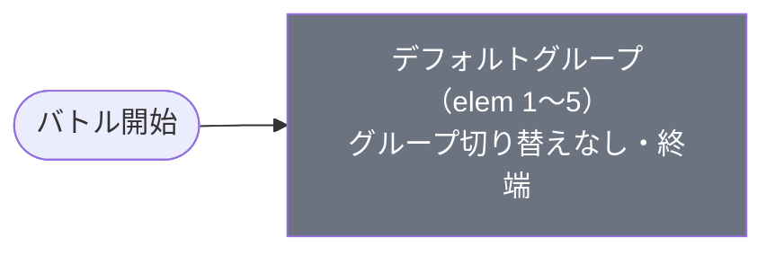

# normal_chi_00006 インゲームデータ詳細解説

> 参照リポジトリ: `projects/glow-masterdata`
> リリースキー: 202509010
> 本ファイルはMstAutoPlayerSequenceが5行のメインクエスト（normal難度）の全データ設定を解説する

---

## 概要

チェンソーマン（chi）シリーズのメインクエスト第6弾（normal難度）。砦HPは60,000でダメージ有効（砦破壊型）。BGMは`SSE_SBG_003_001`、ループ背景は`glo_00016`。3行構成のコマフィールドを使用し、行1は2コマ（幅0.6＋幅0.4）、行2は1コマ（幅1.0）、行3は2コマ（幅0.75＋幅0.25）で、コマ効果は設定されていない。

4種類の敵が登場する。開幕直後に早川アキ（chara_chi_00201、HP100,000・攻撃240・速度45・コンボ7回・アタック型・kind=Normal）が1体降り立ち、1体撃破後にパワー（chara_chi_00301、HP250,000・攻撃400・速度45・コンボ7回・アタック型・kind=Normal）が続く。さらに2体撃破後にボスクラスのチェンソーマン（chara_chi_00002、HP400,000・攻撃450・速度50・コンボ5回・テクニカル型・kind=Boss）が現れる。これら強力な敵の援護として、ゾンビ（e_chi_00101_general_Normal_Colorless、HP5,000・攻撃320）が開始500ms後から大量に継続出現する。

グループ切り替えはなく、全5行がデフォルトグループに収まる単一グループ構成。わずか5行ながら、撃破数条件（FriendUnitDead）によって「早川アキ → パワー → チェンソーマン」と強敵が順次ステージに登場するシンプルかつ密度の高い設計。ボス系敵にはoverride_drop_battle_pointが設定されており（早川アキ=400pt、パワー=700pt）、1体1体を確実に撃破することがスコアアップにつながる。

バトルヒントは未設定。ステージ説明では黄属性・無属性の敵に加え、自己回復・攻撃UP・スタン攻撃というギミック持ち敵の存在が予告されている。緑属性での黄属性対策と、状態異常への備えが求められる。

---

## 関連テーブル設定

### MstInGame

| カラム | 値 |
|--------|-----|
| `id` | `normal_chi_00006` |
| `mst_auto_player_sequence_set_id` | `normal_chi_00006` |
| `bgm_asset_key` | `SSE_SBG_003_001` |
| `boss_bgm_asset_key` | （空） |
| `loop_background_asset_key` | `glo_00016` |
| `mst_page_id` | `normal_chi_00006` |
| `mst_enemy_outpost_id` | `normal_chi_00006` |
| `boss_mst_enemy_stage_parameter_id` | `1` |
| `normal_enemy_hp_coef` | `1.0` |
| `normal_enemy_attack_coef` | `1.0` |
| `normal_enemy_speed_coef` | `1` |
| `boss_enemy_hp_coef` | `1.0` |
| `boss_enemy_attack_coef` | `1.0` |
| `boss_enemy_speed_coef` | `1` |

### MstEnemyOutpost（敵砦）

| カラム | 値 | 意味 |
|--------|-----|------|
| `id` | `normal_chi_00006` | |
| `hp` | `60,000` | 通常ブロック第6弾の砦HP |
| `is_damage_invalidation` | （空） | **ダメージ有効**（砦破壊型） |
| `artwork_asset_key` | `chi_0001` | 背景アートワーク |

### MstPage + MstKomaLine（コマフィールド）

3行構成。

```
row=1  height=0.55  layout=2.0  (2コマ: 0.6, 0.4)
  koma1: glo_00016  width=0.6  bg_offset=0.6  effect=None
  koma2: glo_00016  width=0.4  bg_offset=0.6  effect=None

row=2  height=0.55  layout=1.0  (1コマ: 1.0)
  koma1: glo_00016  width=1.0  bg_offset=-1.0  effect=None

row=3  height=0.55  layout=4.0  (2コマ: 0.75, 0.25)
  koma1: glo_00016  width=0.75  bg_offset=0.6  effect=None
  koma2: glo_00016  width=0.25  bg_offset=0.6  effect=None
```

> **コマ効果の補足**: コマ効果は設定されていない。全コマが通常コマとして機能する。

### MstInGameI18n（バトル説明文）

**result_tips（バトルヒント）:**
> （未設定）

**description（ステージ説明）:**
> 【属性情報】\n黄属性の敵が登場するので緑属性のキャラは有利に戦うこともできるぞ!\nさらに、無属性の敵も登場するぞ!\n\n【ギミック情報】\n自身の体力を回復する攻撃をしてくる敵や\n敵自身の攻撃UPをしてくる敵や\nスタン攻撃をしてくる敵が登場するぞ!

---

## 使用する敵パラメータ（MstEnemyStageParameter）一覧

4種類の敵パラメータを使用。`c_` プレフィックスはキャラ個別ID、`e_` は汎用敵。
IDの命名規則: `{c_/e_}_{キャラID}_general_{kind}_{color}`

### カラム解説

| カラム名（略称） | DBカラム名 | 説明 |
|---------------|-----------|------|
| id | id | MstEnemyStageParameterの主キー |
| キャラID | mst_enemy_character_id | 紐付くキャラモデル・スキルの参照元 |
| kind | character_unit_kind | `Normal`（通常敵）/ `Boss`（ボス）。UIオーラ表示に影響 |
| role | role_type | 属性相性の役職（Attack/Technical/Defense/Support） |
| color | color | 属性色（Red/Yellow/Green/Blue/Colorless） |
| sort_order | sort_order | ゲーム内表示順 |
| base_hp | hp | ベースHP（`enemy_hp_coef` 乗算前の素値） |
| base_atk | attack_power | ベース攻撃力（`enemy_attack_coef` 乗算前の素値） |
| base_spd | move_speed | 移動速度（数値が大きいほど速い） |
| well_dist | well_distance | 攻撃射程（コマ単位） |
| combo | attack_combo_cycle | 攻撃コンボ数（1=単発） |
| knockback | damage_knock_back_count | 被攻撃時ノックバック回数（0=ノックバックなし） |
| ability | mst_unit_ability_id1 | 特殊アビリティID |
| drop_bp | drop_battle_point | 基本ドロップバトルポイント |

### 全4種類の詳細パラメータ

| MstEnemyStageParameter ID | 日本語名 | キャラID | kind | role | color | sort | base_hp | base_atk | base_spd | well_dist | combo | knockback | ability | drop_bp |
|--------------------------|---------|---------|------|------|-------|------|---------|----------|---------|-----------|-------|-----------|---------|---------|
| e_chi_00101_general_Normal_Colorless | ゾンビ | enemy_chi_00101 | Normal | Defense | Colorless | 801 | 5,000 | 320 | 35 | 0.11 | 1 | 1 | （なし） | 50 |
| c_chi_00201_general_Normal_Yellow | 早川 アキ | chara_chi_00201 | Normal | Attack | Yellow | 807 | 100,000 | 240 | 45 | 0.11 | 7 | 2 | （なし） | 50 |
| c_chi_00301_general_Normal_Yellow | パワー | chara_chi_00301 | Normal | Attack | Yellow | 808 | 250,000 | 400 | 45 | 0.20 | 7 | 2 | （なし） | 50 |
| c_chi_00002_general_Boss_Yellow | 悪魔が恐れる悪魔 チェンソーマン | chara_chi_00002 | Boss | Technical | Yellow | 809 | 400,000 | 450 | 50 | 0.15 | 5 | 2 | （なし） | 50 |

> **実際のHP・ATKは `base × MstAutoPlayerSequence.enemy_hp_coef` で決まる。** 本ステージはすべて 1.0 倍。

### 敵パラメータの特性解説

- **ゾンビ（Colorless）**: サポート役の量産型。HPが控えめ（5,000）・攻撃控えめ（320）だが大量に継続出現し、override_bp=20の低ポイント設定。主役を倒すための時間を奪う役割。
- **早川アキ（Yellow/Normal）**: 第1の強敵。HPはやや強め（100,000）・攻撃控えめ（240）・コンボ7回・高速（45）。overrideポイント400ptで撃破報酬が高い。
- **パワー（Yellow/Normal）**: 第2の強敵。HPが非常に高耐久（250,000）・攻撃控えめ（400）・コンボ7回・高速（45）・射程0.2。override=700ptと高スコア。
- **チェンソーマン（Yellow/Boss）**: 最終ボス的存在。HPが突出した耐久力（400,000）・攻撃控えめ（450）・速度50（高速）・コンボ5回。kind=Bossでオーラ表示が変わる。

---

## グループ構造の全体フロー（Mermaid）



> グループ切り替えは存在しない。全5行がデフォルトグループで完結する。

---

## 全5行の詳細データ（デフォルトグループ）

### デフォルトグループ（elem 1〜5）

撃破数条件（FriendUnitDead）によって強敵が順次登場し、時間経過でゾンビが大量サポートとして継続出現する設計。全5行という最小限の構成で「ボス討伐型」のゲームプレイを実現している。

| id | elem | 条件 | アクション | 召喚数 | interval | aura | hp倍 | atk倍 | override_bp | 説明 |
|----|------|------|-----------|--------|---------|------|------|------|------------|------|
| normal_chi_00006_1 | 1 | ElapsedTime 250 | SummonEnemy: c_chi_00201_general_Normal_Yellow | 1 | — | **Boss** | 1.0 | 1.0 | **400** | 開始250ms、早川アキ登場。override_bp=400pt |
| normal_chi_00006_2 | 2 | FriendUnitDead 1 | SummonEnemy: c_chi_00301_general_Normal_Yellow | 1 | — | **Boss** | 1.0 | 1.0 | **700** | 1体撃破後、パワー登場。override_bp=700pt |
| normal_chi_00006_3 | 3 | FriendUnitDead 2 | SummonEnemy: c_chi_00002_general_Boss_Yellow | 1 | — | Default | 1.0 | 1.0 | 20 | 2体撃破後、チェンソーマン登場。override_bp=20pt |
| normal_chi_00006_4 | 4 | ElapsedTime 500 | SummonEnemy: e_chi_00101_general_Normal_Colorless | 99 | 800ms | Default | 1.0 | 1.0 | 20 | 500ms経過、ゾンビ99体を0.8秒間隔で継続出現（実質無限） |
| normal_chi_00006_5 | 5 | ElapsedTime 3000 | SummonEnemy: e_chi_00101_general_Normal_Colorless | 99 | 1200ms | Default | 1.0 | 1.0 | 20 | 3000ms経過、ゾンビ99体を1.2秒間隔で追加継続出現 |

**ポイント:**
- elem 1〜3: `aura_type=Boss` 設定の早川アキ・パワーが「ボス感のある演出」で登場する（kind=Normalでもaura=Bossが設定可能）
- elem 4: 99体×800ms間隔で実質無限に近いゾンビが出現し続ける。ボス戦の妨害と難度向上を担う
- elem 5: 3秒後に出現間隔を1200msに変更した別ライン追加（elem4と並行稼働）
- チェンソーマン（elem3）のoverride_bp=20は低く設定されており、「ボスを撃破してもポイントは小さい」設計

---

## グループ切り替えまとめ表

グループ切り替えは存在しない（単一デフォルトグループのみ）。

| 項目 | 内容 |
|------|------|
| グループ数 | 1（デフォルトのみ） |
| SwitchSequenceGroup | なし |
| 実質的な節目 | 1体撃破（パワー登場）/ 2体撃破（チェンソーマン登場）/ 砦到達は終局 |

---

## スコア体系

バトルポイントは`override_drop_battle_point`（MstAutoPlayerSequence設定値）が優先される。

| 敵の種類 | override_bp（MstAutoPlayerSequence） | drop_bp（MstEnemyStageParameter） | 備考 |
|---------|--------------------------------------|----------------------------------|------|
| 早川アキ（Yellow/Normal） | **400** | 50 | override優先で400pt |
| パワー（Yellow/Normal） | **700** | 50 | override優先で700pt |
| チェンソーマン（Yellow/Boss） | 20 | 50 | overrideが低い設定（20pt） |
| ゾンビ（Colorless/Normal） | 20 | 50 | overrideが低い設定（20pt） |

---

## この設定から読み取れる設計パターン

### 1. 「強敵撃破→次の強敵」の連鎖リレー型設計
5行という最小限の行数で、`FriendUnitDead 1` → `FriendUnitDead 2` の連鎖によって早川アキ・パワー・チェンソーマンが順次登場するリレー設計。プレイヤーは常に新しい強敵と対峙し続けるテンポ感が実現されている。

### 2. aura=BossとoverrideBPによる「強敵ハイライト」演出
early川アキとパワーは`kind=Normal`だが`aura=Boss`が設定されており、UIのオーラ演出でボス感を醸し出す。さらにoverride_bp=400/700と高いスコアが設定されており、「こいつを倒せ！」というプレイヤー誘導が自然に生まれる。

### 3. 量産ゾンビによる「妨害と難度上乗せ」
elem4・5のゾンビ99体（×2条件）は、強力な強敵との戦いに横槍を入れる妨害役。ゾンビのoverride_bp=20と低いため、ゾンビを倒してもスコアにならず「強敵に集中しろ」というメッセージになっている。

### 4. 後半強敵のスコア設計の非対称性
チェンソーマン（最強敵）のoverride_bp=20と低く設定されているのに対し、パワー（中間）が700ptと最高スコア。「早めに倒した方がスコアが高い」設計で、高速クリアよりも「序盤強敵を素早く処理する」プレイを促している可能性がある。
