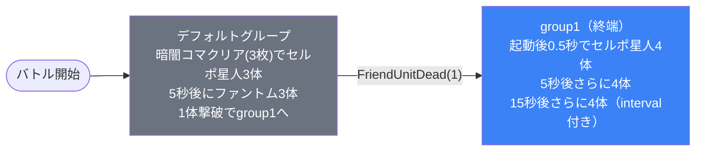

# normal_dan_00002 インゲームデータ詳細解説

> 参照リポジトリ: `projects/glow-masterdata`
> リリースキー: 202509010
> 本ファイルはMstAutoPlayerSequenceが8行のメインクエスト（normal難度）の全データ設定を解説する

---

## 概要

**メインクエスト・段階ステージ2**（砦破壊型・normal難度）。

- 砦のHP: `15,000` でダメージ有効
- BGM: `SSE_SBG_003_001`
- ループ背景: `dan_00006`
- グループ: デフォルト + group1（2グループ構成。group1は終端グループ）
- 使用する敵の種類: 2種類（`e_dan_00001_general_n_Normal_Red`セルポ星人 / `e_glo_00001_general_n_Normal_Red`ファントム）
- 特徴的なルール: **暗闇コマギミック**あり（`DarknessKomaCleared(3)` でセルポ星人が追加出現）

---

## 関連テーブル設定

### MstInGame

| カラム | 値 |
|--------|-----|
| `id` | `normal_dan_00002` |
| `mst_auto_player_sequence_set_id` | `normal_dan_00002` |
| `bgm_asset_key` | `SSE_SBG_003_001` |
| `boss_bgm_asset_key` | （空） |
| `loop_background_asset_key` | `dan_00006` |
| `mst_page_id` | `normal_dan_00002` |
| `mst_enemy_outpost_id` | `normal_dan_00002` |
| `boss_mst_enemy_stage_parameter_id` | `1` |
| `boss_count` | （空） |
| `normal_enemy_hp_coef` | `1.0` |
| `normal_enemy_attack_coef` | `1.0` |
| `normal_enemy_speed_coef` | `1` |
| `boss_enemy_hp_coef` | `1.0` |
| `boss_enemy_attack_coef` | `1.0` |
| `boss_enemy_speed_coef` | `1` |
| `release_key` | `202509010` |

### MstEnemyOutpost（敵砦）

| カラム | 値 | 意味 |
|--------|-----|------|
| `id` | `normal_dan_00002` | |
| `hp` | `15,000` | ステージの砦HP（比較的低め） |
| `is_damage_invalidation` | （空） | **ダメージ有効**（砦破壊型） |
| `artwork_asset_key` | `dan_0001` | 背景アートワーク |

### MstPage + MstKomaLine（コマフィールド）

3行構成。

```
row=1  height=0.55  layout=2.0  （2コマ: 0.6, 0.4）
  koma1: dan_00006  width=0.6  effect=None（全対象）
  koma2: dan_00006  width=0.4  effect=Darkness（プレイヤー側 / 全色・全役職）

row=2  height=0.55  layout=5.0  （2コマ: 0.25, 0.75）
  koma1: dan_00006  width=0.25  effect=Darkness（プレイヤー側 / 全色・全役職）
  koma2: dan_00006  width=0.75  effect=Darkness（プレイヤー側 / 全色・全役職）

row=3  height=0.55  layout=7.0  （3コマ: 0.33, 0.34, 0.33）
  koma1: dan_00006  width=0.33  effect=None（全対象）
  koma2: dan_00006  width=0.34  effect=None（全対象）
  koma3: dan_00006  width=0.33  effect=None（全対象）
```

> **コマ効果の補足**: `Darkness`（暗闇）エフェクトはプレイヤー側のコマに適用される。row=1のkoma2（幅0.4）、row=2の両コマが暗闇コマ。合計3枚の暗闇コマが存在し、これをクリアすることで `DarknessKomaCleared(3)` トリガーが発火してセルポ星人が出現する。

### MstInGameI18n（バトル説明文）

**result_tips（バトルヒント）:**
> （空）

**description（ステージ説明）:**
> 【属性情報】
> 赤属性の敵が登場するので青属性のキャラは有利に戦うこともできるぞ!
>
> 【コマ効果情報】
> 暗闇コマが登場するぞ!
> 暗闇コマの中には注意しよう!

---

## 使用する敵パラメータ（MstEnemyStageParameter）一覧

2種類の敵パラメータを使用。`e_` プレフィックスは汎用敵。
IDの命名規則: `e_{シリーズID}_{コンテンツID}_{kind}_{color}`

### カラム解説

| カラム名（略称） | DBカラム名 | 説明 |
|---------------|-----------|------|
| id | id | MstEnemyStageParameterの主キー |
| 日本語名 | — | MstEnemyCharacterI18nから取得 |
| キャラID | mst_enemy_character_id | 紐付くキャラモデル・スキルの参照元 |
| kind | character_unit_kind | `Normal`（通常敵）/ `Boss`（ボス）。UIオーラ表示に影響 |
| role | role_type | 属性相性の役職（Attack/Technical/Defense/Support） |
| color | color | 属性色（Red/Yellow/Green/Blue/Colorless） |
| sort_order | sort_order | ゲーム内表示順 |
| base_hp | hp | ベースHP（`enemy_hp_coef` 乗算前の素値） |
| base_atk | attack_power | ベース攻撃力（`enemy_attack_coef` 乗算前の素値） |
| base_spd | move_speed | 移動速度（数値が大きいほど速い） |
| well_dist | well_distance | 攻撃射程（コマ単位） |
| combo | attack_combo_cycle | 攻撃コンボ数（1=単発） |
| knockback | damage_knock_back_count | 被攻撃時ノックバック回数（0=ノックバックなし） |
| ability | mst_unit_ability_id1 | 特殊アビリティID |
| drop_bp | drop_battle_point | 基本ドロップバトルポイント |

### 全2種類の詳細パラメータ

| MstEnemyStageParameter ID | 日本語名 | キャラID | kind | role | color | sort | base_hp | base_atk | base_spd | well_dist | combo | knockback | ability | drop_bp |
|--------------------------|---------|---------|------|------|-------|------|---------|---------|---------|-----------|-------|-----------|---------|---------|
| `e_dan_00001_general_n_Normal_Red` | セルポ星人 | `enemy_dan_00001` | Normal | Defense | Red | 2 | 10,000 | 50 | 34 | 0.24 | 1 | （空・なし） | （空） | 100 |
| `e_glo_00001_general_n_Normal_Red` | ファントム | `enemy_glo_00001` | Normal | Attack | Red | 12 | 1,000 | 50 | 40 | 0.2 | 1 | 1 | （空） | 100 |

> **実際のHP・ATKは `base × MstAutoPlayerSequence.enemy_hp_coef` で決まる。**
> 例: セルポ星人 デフォルトグループ hp倍0.55 → 実HP `10,000 × 0.55 = 5,500`

### 敵パラメータの特性解説

| 比較項目 | セルポ星人 | ファントム |
|---------|-----------|-----------|
| kind | Normal | Normal |
| role | Defense（防御型） | Attack（攻撃型） |
| base_hp | 10,000（高い） | 1,000（低い） |
| base_atk | 50（同じ） | 50（同じ） |
| base_spd | 34（やや遅い） | 40（速い） |
| well_dist | 0.24 | 0.2 |
| knockback | なし（タフ） | 1回 |
| 登場グループ | デフォルト・group1両方 | デフォルトのみ |

**設計上の特徴**:
- セルポ星人は `base_hp=10,000` と高HPで ノックバックなし。デフォルトではhp倍0.55で出現（実HP 5,500）。ただし暗闇コマクリア特典として低倍率で配置されているため、実際には控えめな強さに設定されている。
- ファントムは `base_hp=1,000` と低いが `move_speed=40` と最速クラス。`enemy_hp_coef=9.5` 設定で実HP 9,500と大幅に引き上げられており、速く・硬い壁役として機能する。
- 両方とも赤属性のみで統一されており、青属性のキャラが有利に戦えるという説明文と一致している。

---

## グループ構造の全体フロー（Mermaid）



> **Mermaid スタイルカラー規則**:
> - デフォルトグループ: `#6b7280`（グレー）
> - group1（w1相当）: `#3b82f6`（青）
>
> **注意**: group1にはgroupchange行がなく、終端グループとして機能する。ループ構造なし。

---

## 全8行の詳細データ（グループ単位）

### デフォルトグループ（elem 1〜2, groupchange_6）

バトル開始時から動作するグループ。暗闇コマ3枚クリアでセルポ星人3体、5秒後にファントム3体が登場。1体撃破でgroup1へ遷移する。

| id | elem | 条件 | action_type | action_value | 召喚数 | interval | position | aura | hp倍 | atk倍 | spd倍 | override_bp | defeated_score | 移動開始条件 |
|----|------|------|-------------|--------------|--------|----------|---------|------|------|------|------|------------|----------------|------------|
| normal_dan_00002_1（1行目） | 1 | DarknessKomaCleared(3) | SummonEnemy | e_dan_00001_general_n_Normal_Red | 1 | 0 | 1.8 | Default | 0.55 | 5 | 1 | （空） | 0 | FoeEnterSameKoma |
| normal_dan_00002_2（2行目） | 1 | DarknessKomaCleared(3) | SummonEnemy | e_dan_00001_general_n_Normal_Red | 1 | 0 | 1.7 | Default | 0.55 | 5 | 1 | （空） | 0 | FoeEnterSameKoma |
| normal_dan_00002_3（3行目） | 1 | DarknessKomaCleared(3) | SummonEnemy | e_dan_00001_general_n_Normal_Red | 1 | 0 | 1.6 | Default | 0.55 | 5 | 1 | （空） | 0 | FoeEnterSameKoma |
| normal_dan_00002_4 | 2 | ElapsedTime(500) | SummonEnemy | e_glo_00001_general_n_Normal_Red | 3 | 500 | （空） | Default | 9.5 | 8 | 1 | （空） | 0 | None |
| normal_dan_00002_8 | 6 | FriendUnitDead(1) | SwitchSequenceGroup | group1 | （空） | （空） | （空） | Default | （空） | （空） | 1 | （空） | 0 | None |

**ポイント:**
- elem 1 は同一 `sequence_element_id` で3行存在する（位置1.8 / 1.7 / 1.6 にそれぞれ1体ずつ配置）。これは「同一タイミングで異なる位置に分散配置するテクニック」。
- `DarknessKomaCleared(3)` は暗闇コマを3枚クリアしたタイミングが発動条件。
- `move_start_condition_type = FoeEnterSameKoma` は「敵が同じコマに侵入した時に移動開始」を意味し、セルポ星人が前進を開始するタイミングを敵同士のコマ侵入に依存させている。
- elem 2 のファントムは `ElapsedTime(500)` = 5,000ms = 5秒後に3体同時出現（interval=500、つまり5秒おきに1体ずつ）。`enemy_hp_coef=9.5` で実HP 9,500の硬い壁役。
- elem 6 は `FriendUnitDead(1)` → group1への遷移トリガー（1体撃破でwave移行）。

---

### group1グループ（elem 3〜5、終端グループ）

group1は終端グループ（groupchange行なし）。起動後タイマーでセルポ星人を段階的に追加投入し続ける持続攻撃フェーズ。

| id | elem | 条件 | action_type | action_value | 召喚数 | interval | position | aura | hp倍 | atk倍 | spd倍 | override_bp | defeated_score | 移動開始条件 |
|----|------|------|-------------|--------------|--------|----------|---------|------|------|------|------|------------|----------------|------------|
| normal_dan_00002_5 | 3 | ElapsedTimeSinceSequenceGroupActivated(50) | SummonEnemy | e_dan_00001_general_n_Normal_Red | 4 | 100 | （空） | Default | 0.55 | 5 | 1 | （空） | 0 | None |
| normal_dan_00002_6 | 4 | ElapsedTimeSinceSequenceGroupActivated(500) | SummonEnemy | e_dan_00001_general_n_Normal_Red | 4 | 500 | （空） | Default | 0.55 | 5 | 1 | （空） | 0 | None |
| normal_dan_00002_7 | 5 | ElapsedTimeSinceSequenceGroupActivated(1500) | SummonEnemy | e_dan_00001_general_n_Normal_Red | 4 | 750 | （空） | Default | 0.55 | 5 | 1 | （空） | 0 | None |

**ポイント:**
- `ElapsedTimeSinceSequenceGroupActivated(50)` = 500ms = 0.5秒後に4体（interval=100=1秒おきに1体ずつ）
- `ElapsedTimeSinceSequenceGroupActivated(500)` = 5,000ms = 5秒後に4体（interval=500=5秒おきに1体ずつ）
- `ElapsedTimeSinceSequenceGroupActivated(1500)` = 15,000ms = 15秒後に4体（interval=750=7.5秒おきに1体ずつ）
- group1は終端グループのため、3回のウェーブ（最大12体）を投入したあとはグループ切り替えなし。
- 全て `enemy_hp_coef=0.55`、`enemy_attack_coef=5` で統一されており、デフォルトグループのセルポ星人と同じ強さ設定。

---

## グループ切り替えまとめ表

| 切り替え | 条件 | 遷移先 |
|---------|------|--------|
| デフォルト → group1 | **FriendUnitDead(1)** | group1 |

各グループで倒すべき目安:
- デフォルト: 1体（最初の1体を倒したらgroup1へ移行）
- group1: 終端グループ（以降は撃破数ベースの遷移なし）

> **補足**: デフォルトグループでは暗闇コマギミック（3枚クリア）でセルポ星人3体が出現し、5秒後にファントム3体が出現する。最初の1体を倒した瞬間にgroup1が起動する。デフォルトとgroup1は同時並行で動作する可能性がある（group1起動後もデフォルトグループは停止しない）。

---

## スコア体系

バトルポイントは `override_drop_battle_point` が設定されていない場合、MstEnemyStageParameterの `drop_battle_point` が使用される。

| 敵の種類 | override_bp（設定値） | base drop_bp | 備考 |
|---------|---------------------|--------------|------|
| セルポ星人 | （空・未設定） | 100 | 全グループ共通 |
| ファントム | （空・未設定） | 100 | デフォルトグループのみ登場 |

- 全行の `defeated_score` は `0`（リザルト画面スコア表示なし）
- `override_drop_battle_point` は全行で未設定のため、`drop_battle_point = 100` が各敵から得られる
- メインクエスト系コンテンツはスコア競争ではなく砦破壊が目的のため、スコア体系はシンプル

---

## この設定から読み取れる設計パターン

### 1. 暗闇コマギミックによる敵出現トリガー
`DarknessKomaCleared(3)` という条件でセルポ星人3体が出現する設計は、プレイヤーが暗闇コマをクリアするという能動的なアクションへの報酬（あるいはリスク）として機能する。コマ効果情報に「暗闇コマの中には注意しよう!」と明記されており、ゲーム内で意図的に伝えているギミック。

### 2. 分散配置テクニック（elem 1の3行展開）
デフォルトグループのelem 1が同一`sequence_element_id`で3行存在し、位置1.6 / 1.7 / 1.8 にそれぞれ1体ずつ配置する。これはraidタイプでも見られる「同一タイミングで異なる位置に分散配置するテクニック」であり、敵の固まりを演出的に自然に見せる手法。

### 3. 高hp倍率のファントムで壁役を演出
ファントムは `enemy_hp_coef=9.5`（実HP 9,500）と `move_speed=40`（高速）を組み合わせ、素早く・硬い壁役として機能する。base_hp=1,000 と素のHPは低いが、倍率9.5倍という高い補正値でノーマルクエストとしての難度を調整している。MstInGame側の `normal_enemy_hp_coef=1.0` とは独立した個別設定であることに注意。

### 4. group1（終端グループ）による持続圧力設計
group1は0.5秒後・5秒後・15秒後と段階的にセルポ星人を4体ずつ投入（最大12体）し、グループ切り替えなしで継続圧力をかける。砦HP 15,000と低めに設定されており、大量のセルポ星人に砦を攻撃させ続けることで自然なタイムプレッシャーを生み出す設計。

### 5. シンプルな2グループ構成によるチュートリアル的難度
`normal` 難度・`dan_00002`（ステージ2）という位置づけを反映して、グループ構成はデフォルト + group1の2グループのみ。ループなし・w5並行なし・複雑なマルチトリガーなしのシンプル設計。初期ステージとして、暗闘コマギミックの使い方を学ぶための入門的なステージ構成といえる。

### 6. 赤属性統一による属性システム学習
全敵が赤属性（Red）で統一されており、「青属性のキャラが有利」という属性相性の仕組みをプレイヤーが体験できるシナリオ設計になっている。MstInGameI18nの説明文で属性情報を明示しているのも初心者向けの配慮。
