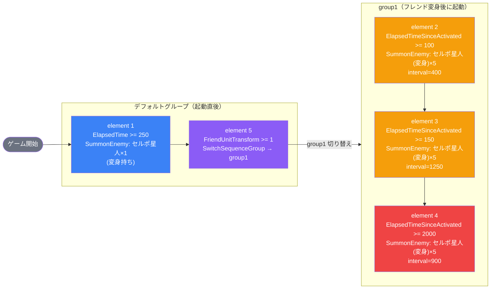

# normal_dan_00003 インゲーム詳細解説

## 1. 概要

`normal_dan_00003` は、ノーマル段位戦の第3ステージとして定義されたインゲームステージである。BGMには `SSE_SBG_003_001` が使用され、ループ背景アセットには `dan_00007` が設定されている。敵拠点のHPは15,000に設定されており、ダメージ無効化は適用されていない。ボスBGMは設定されておらず、通常のBGMが全編にわたって流れ続ける構成となっている。

インゲームの説明文（日本語）によると、本ステージの特徴は「無属性の敵」と「ダメージを受けると変身する敵」の2点である。この変身ギミックがステージの核心的な設計要素であり、序盤に出現する `セルポ星人`（`e_dan_00001_general_n_trans_Normal_Colorless`）はHPが50%以下になると `セルポ星人 (変身)` へ変身する仕様となっている。プレイヤーはこの変身タイミングを意識した戦略立案が求められる。

シーケンス構成は「デフォルトグループ」と「group1」の2段階で成り立っており、デフォルトグループではゲーム開始から250フレーム後に変身持ちセルポ星人を1体召喚した後、フレンドユニットの変身（`FriendUnitTransform` が1回発生した時点）をトリガーとして `group1` へ切り替える。group1では大量の変身後セルポ星人（`e_dan_00101_general_n_Normal_Colorless`）を3つのウェーブに分けて波状投入する設計となっている。

スコア設定はすべて `defeated_score = 0` であり、敵を倒すことによる直接スコア加算は行われない。全体的なHP係数・攻撃係数・速度係数がいずれも1.0（デフォルト）に設定されている点からも、このステージは段位戦の基礎ステージとして位置づけられていると考えられる。リリースキーは `202509010` で統一されている。

---

## 2. 関連テーブル設定

### MstInGame

| カラム | 値 |
|---|---|
| id | `normal_dan_00003` |
| mst_auto_player_sequence_id | `normal_dan_00003` |
| mst_auto_player_sequence_set_id | `normal_dan_00003` |
| bgm_asset_key | `SSE_SBG_003_001` |
| boss_bgm_asset_key | （なし） |
| loop_background_asset_key | `dan_00007` |
| player_outpost_asset_key | （なし） |
| mst_page_id | `normal_dan_00003` |
| mst_enemy_outpost_id | `normal_dan_00003` |
| mst_defense_target_id | （なし） |
| boss_mst_enemy_stage_parameter_id | `1` |
| boss_count | （なし） |
| normal_enemy_hp_coef | 1.0 |
| normal_enemy_attack_coef | 1.0 |
| normal_enemy_speed_coef | 1 |
| boss_enemy_hp_coef | 1.0 |
| boss_enemy_attack_coef | 1.0 |
| boss_enemy_speed_coef | 1 |
| release_key | 202509010 |

### MstEnemyOutpost

| カラム | 値 |
|---|---|
| id | `normal_dan_00003` |
| hp | 15,000 |
| is_damage_invalidation | （なし） |
| outpost_asset_key | （なし） |
| artwork_asset_key | `dan_0001` |
| release_key | 202509010 |

### MstPage + MstKomaLine

#### MstPage

| カラム | 値 |
|---|---|
| id | `normal_dan_00003` |
| release_key | 202509010 |

#### MstKomaLine（コマ配置）

| row | id | height | layout | koma1_asset | koma1_width | koma1_bg_offset | koma1_effect | koma2_asset | koma2_width | koma2_bg_offset | koma2_effect | koma3_asset | koma3_width | koma3_bg_offset | koma3_effect |
|---|---|---|---|---|---|---|---|---|---|---|---|---|---|---|---|
| 1 | normal_dan_00003_1 | 0.75 | 2.0 | dan_00007 | 0.6 | -1.0 | None | dan_00007 | 0.4 | -1.0 | None | — | — | — | — |
| 2 | normal_dan_00003_2 | 0.75 | 9.0 | dan_00007 | 0.25 | 0.6 | None | dan_00007 | 0.5 | 0.6 | None | dan_00007 | 0.25 | 0.6 | None |
| 3 | normal_dan_00003_3 | 0.75 | 2.0 | dan_00007 | 0.6 | 0.6 | None | dan_00007 | 0.4 | 0.6 | None | — | — | — | — |

- 全3行、各行 height=0.75
- 使用アセットはすべて `dan_00007` で統一
- コマエフェクトは全コマ `None`（エフェクトなし）

### MstInGameI18n

| カラム | 値 |
|---|---|
| id | `normal_dan_00003_ja` |
| mst_in_game_id | `normal_dan_00003` |
| language | `ja` |
| result_tips | （なし） |
| description | 【属性情報】\n無属性の敵が登場するぞ!\n\n【ギミック情報】\nダメージを受けると変身する敵が登場するぞ! |

---

## 3. 使用する敵パラメータ一覧

### カラム解説

| カラム | 説明 |
|---|---|
| id | MstEnemyStageParameter の識別子 |
| mst_enemy_character_id | 紐付く敵キャラクターID |
| character_unit_kind | ユニット種別（Normal / Boss等） |
| role_type | 役割種別（Attack / Defense等） |
| color | 属性色（Colorless=無属性） |
| sort_order | 表示・出現順序 |
| hp | 敵のHP |
| damage_knock_back_count | ノックバック発生までのダメージ回数 |
| move_speed | 移動速度 |
| well_distance | 射程距離 |
| attack_power | 攻撃力 |
| attack_combo_cycle | 攻撃コンボサイクル |
| mst_unit_ability_id1 | 特殊アビリティID |
| drop_battle_point | 撃破時に獲得できるバトルポイント |
| mstTransformationEnemyStageParameterId | 変身後の EnemyStageParameter ID |
| transformationConditionType | 変身発動条件の種別 |
| transformationConditionValue | 変身発動条件の値 |

### 全パラメータ表

| id | キャラクター名 | character_unit_kind | role_type | color | sort_order | HP | ノックバック数 | 移動速度 | 射程 | 攻撃力 | コンボサイクル | アビリティ | drop_bp | 変身先ID | 変身条件Type | 変身条件Value |
|---|---|---|---|---|---|---|---|---|---|---|---|---|---|---|---|---|
| e_dan_00001_general_n_trans_Normal_Colorless | セルポ星人 | Normal | Attack | Colorless | 1 | 1,000 | 1 | 34 | 0.24 | 50 | 1 | （なし） | 100 | e_dan_00101_general_n_Normal_Colorless | HpPercentage | 50 |
| e_dan_00101_general_n_Normal_Colorless | セルポ星人 (変身) | Normal | Attack | Colorless | 4 | 10,000 | （なし） | 47 | 0.24 | 50 | 1 | （なし） | 120 | （なし） | None | — |

### 特性解説

**セルポ星人** (`e_dan_00001_general_n_trans_Normal_Colorless`)
- HPが1,000と低く、序盤の単体出現時は比較的素早く倒せる
- HP50%（500以下）になると `セルポ星人 (変身)` へ変身するため、倒しきれない場合は変身後の高HPユニットが出現する
- ノックバック回数が1と設定されており、1回の攻撃でノックバックが発生する

**セルポ星人 (変身)** (`e_dan_00101_general_n_Normal_Colorless`)
- HPが10,000と高く、変身後は大幅に耐久力が増す
- 移動速度が34から47に上昇し、変身前より高速で拠点に向かって突進する
- ノックバック設定なし（ノックバックが発生しない）
- group1で大量投入され、ステージ後半の主力敵となる

---

## 4. グループ構造の全体フロー

---

## 5. 全行の詳細データ（グループ単位）

### デフォルトグループ

#### element 1（`normal_dan_00003_1`）

| カラム | 値 |
|---|---|
| sequence_set_id | normal_dan_00003 |
| sequence_group_id | （デフォルト） |
| sequence_element_id | 1 |
| priority_sequence_element_id | （なし） |
| condition_type | ElapsedTime |
| condition_value | 250 |
| action_type | SummonEnemy |
| action_value | e_dan_00001_general_n_trans_Normal_Colorless |
| action_value2 | （なし） |
| summon_count | 1 |
| summon_interval | 0 |
| summon_animation_type | None |
| summon_position | （なし） |
| move_start_condition_type | None |
| move_stop_condition_type | None |
| move_restart_condition_type | None |
| move_loop_count | （なし） |
| is_summon_unit_outpost_damage_invalidation | （なし） |
| last_boss_trigger | （なし） |
| aura_type | Default |
| death_type | Normal |
| enemy_hp_coef | 3 |
| enemy_attack_coef | 2 |
| enemy_speed_coef | 1 |
| override_drop_battle_point | （なし） |
| defeated_score | 0 |
| action_delay | （なし） |
| deactivation_condition_type | None |
| deactivation_condition_value | （なし） |

**備考**: ゲーム開始から250フレーム後にセルポ星人を1体召喚。HP係数3・攻撃係数2が適用されており、基本ステータスより強化された状態で出現する。

---

#### element 5（`normal_dan_00003_5`）

| カラム | 値 |
|---|---|
| sequence_set_id | normal_dan_00003 |
| sequence_group_id | （デフォルト） |
| sequence_element_id | 5 |
| priority_sequence_element_id | （なし） |
| condition_type | FriendUnitTransform |
| condition_value | 1 |
| action_type | SwitchSequenceGroup |
| action_value | group1 |
| action_value2 | （なし） |
| summon_count | （なし） |
| summon_interval | （なし） |
| summon_animation_type | None |
| summon_position | （なし） |
| move_start_condition_type | None |
| move_stop_condition_type | None |
| move_restart_condition_type | None |
| move_loop_count | （なし） |
| is_summon_unit_outpost_damage_invalidation | （なし） |
| last_boss_trigger | （なし） |
| aura_type | Default |
| death_type | Normal |
| enemy_hp_coef | （なし） |
| enemy_attack_coef | （なし） |
| enemy_speed_coef | 1 |
| override_drop_battle_point | （なし） |
| defeated_score | 0 |
| action_delay | （なし） |
| deactivation_condition_type | None |
| deactivation_condition_value | （なし） |

**備考**: フレンドユニットが1回変身したタイミングで group1 へ切り替える。プレイヤー側の変身行動がトリガーとなるリアクティブな設計。

---

### group1

#### element 2（`normal_dan_00003_2`）

| カラム | 値 |
|---|---|
| sequence_set_id | normal_dan_00003 |
| sequence_group_id | group1 |
| sequence_element_id | 2 |
| priority_sequence_element_id | （なし） |
| condition_type | ElapsedTimeSinceSequenceGroupActivated |
| condition_value | 100 |
| action_type | SummonEnemy |
| action_value | e_dan_00101_general_n_Normal_Colorless |
| action_value2 | （なし） |
| summon_count | 5 |
| summon_interval | 400 |
| summon_animation_type | None |
| summon_position | （なし） |
| move_start_condition_type | None |
| move_stop_condition_type | None |
| move_restart_condition_type | None |
| move_loop_count | （なし） |
| is_summon_unit_outpost_damage_invalidation | （なし） |
| last_boss_trigger | （なし） |
| aura_type | Default |
| death_type | Normal |
| enemy_hp_coef | 0.65 |
| enemy_attack_coef | 7 |
| enemy_speed_coef | 1 |
| override_drop_battle_point | （なし） |
| defeated_score | 0 |
| action_delay | （なし） |
| deactivation_condition_type | None |
| deactivation_condition_value | （なし） |

**備考**: group1 起動から100フレーム後に開始。セルポ星人(変身)を5体、400フレーム間隔で連続召喚する第1ウェーブ。HP係数0.65（基本HPの65%）、攻撃係数7（攻撃力7倍）という高攻撃・低耐久の設定。

---

#### element 3（`normal_dan_00003_3`）

| カラム | 値 |
|---|---|
| sequence_set_id | normal_dan_00003 |
| sequence_group_id | group1 |
| sequence_element_id | 3 |
| priority_sequence_element_id | （なし） |
| condition_type | ElapsedTimeSinceSequenceGroupActivated |
| condition_value | 150 |
| action_type | SummonEnemy |
| action_value | e_dan_00101_general_n_Normal_Colorless |
| action_value2 | （なし） |
| summon_count | 5 |
| summon_interval | 1250 |
| summon_animation_type | None |
| summon_position | （なし） |
| move_start_condition_type | None |
| move_stop_condition_type | None |
| move_restart_condition_type | None |
| move_loop_count | （なし） |
| is_summon_unit_outpost_damage_invalidation | （なし） |
| last_boss_trigger | （なし） |
| aura_type | Default |
| death_type | Normal |
| enemy_hp_coef | 0.65 |
| enemy_attack_coef | 7 |
| enemy_speed_coef | 1 |
| override_drop_battle_point | （なし） |
| defeated_score | 0 |
| action_delay | （なし） |
| deactivation_condition_type | None |
| deactivation_condition_value | （なし） |

**備考**: group1 起動から150フレーム後に開始。セルポ星人(変身)を5体、1250フレーム間隔で召喚する第2ウェーブ。element 2 とほぼ同時期に開始されるが、召喚間隔が長いため持続的な脅威として機能する。

---

#### element 4（`normal_dan_00003_4`）

| カラム | 値 |
|---|---|
| sequence_set_id | normal_dan_00003 |
| sequence_group_id | group1 |
| sequence_element_id | 4 |
| priority_sequence_element_id | （なし） |
| condition_type | ElapsedTimeSinceSequenceGroupActivated |
| condition_value | 2000 |
| action_type | SummonEnemy |
| action_value | e_dan_00101_general_n_Normal_Colorless |
| action_value2 | （なし） |
| summon_count | 5 |
| summon_interval | 900 |
| summon_animation_type | None |
| summon_position | （なし） |
| move_start_condition_type | None |
| move_stop_condition_type | None |
| move_restart_condition_type | None |
| move_loop_count | （なし） |
| is_summon_unit_outpost_damage_invalidation | （なし） |
| last_boss_trigger | （なし） |
| aura_type | Default |
| death_type | Normal |
| enemy_hp_coef | 0.65 |
| enemy_attack_coef | 7 |
| enemy_speed_coef | 1 |
| override_drop_battle_point | （なし） |
| defeated_score | 0 |
| action_delay | （なし） |
| deactivation_condition_type | None |
| deactivation_condition_value | （なし） |

**備考**: group1 起動から2000フレーム後に開始。セルポ星人(変身)を5体、900フレーム間隔で召喚する第3ウェーブ（最終ウェーブ）。間隔を狭めた中密度の押し込みとして、終盤の圧力を高める設計となっている。

---

## 6. グループ切り替えまとめ表

| 発火グループ | element_id | 条件Type | 条件Value | 遷移先グループ |
|---|---|---|---|---|
| デフォルト | 5 | FriendUnitTransform | 1 | group1 |

- グループ切り替えは1回のみ（デフォルト → group1）
- トリガーはプレイヤーフレンドユニットの変身（1回目）
- group1 への一方向遷移のみで、ループや逆遷移は存在しない

---

## 7. スコア体系

| 対象 | defeated_score |
|---|---|
| element 1（セルポ星人×1） | 0 |
| element 2（セルポ星人(変身)×5） | 0 |
| element 3（セルポ星人(変身)×5） | 0 |
| element 4（セルポ星人(変身)×5） | 0 |

- 全エレメントの `defeated_score = 0`
- 敵撃破によるスコア加算は本ステージでは実施されない
- バトルポイントは drop_battle_point として各敵に設定あり（セルポ星人=100BP、セルポ星人(変身)=120BP）
- スコアはバトルポイント外の別経路（拠点ダメージ等）で決まる可能性がある

---

## 8. この設定から読み取れる設計パターン

1. **変身連動グループ切り替えパターン**  
   デフォルトグループで「変身持ち敵を単体出現させてプレイヤーに変身を強制的に引き出させ」、フレンドユニットの変身（`FriendUnitTransform >= 1`）を検知してgroup1に切り替える。プレイヤー行動をトリガーとしたリアクティブな難易度制御を実現している。

2. **序盤単体・後半大量投入の2段構成**  
   序盤は変身持ち敵を1体のみ登場させる低負荷設計で、変身ギミックの理解をプレイヤーに促す。group1 移行後は同一キャラクターを3ウェーブ15体投入し、一気に難易度を引き上げる非対称構成を採用している。

3. **高攻撃・低耐久のバランス設定**  
   group1 の全ウェーブで `enemy_hp_coef = 0.65 / enemy_attack_coef = 7` が統一適用されており、「素早く倒さないと大ダメージを受ける」という速攻必須の緊張感を演出している。変身後セルポ星人の素HP=10,000×0.65=6,500、攻撃力=50×7=350となる。

4. **属性統一による汎用戦略の封殺回避**  
   全敵キャラクターが `Colorless（無属性）` で統一されており、属性有利・不利による簡単な攻略を排除している。インゲーム説明文でも「無属性」を明示することで、プレイヤーに属性依存ではなく純粋な戦術力を問うステージとして位置づけられている。

5. **ノックバック差異による役割分担**  
   変身前セルポ星人はノックバック回数=1（ノックバックあり）、変身後はノックバックなし。この差異により、変身後は足を止めることができず一直線に拠点へ向かって突進するという強敵としての特性が際立つ。

6. **defeated_score 統一ゼロによるシンプルな評価基準**  
   全敵の `defeated_score = 0` により、「どれだけ多く敵を倒したか」ではなく「拠点をいかに守り切るか」という拠点防衛の純粋な結果でプレイヤーを評価する設計方針が読み取れる。

