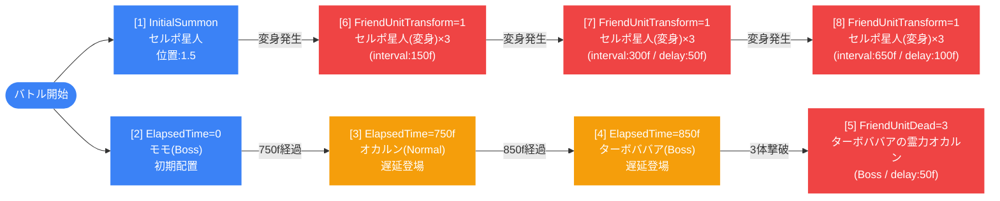

# normal_dan_00006 インゲーム詳細解説

## 1. 概要

`normal_dan_00006` は、ダンジョン系ノーマルステージの第6弾として設計されたインゲームバトル設定である。全敵キャラクターが赤属性で統一されており、青属性キャラクターを編成するプレイヤーが属性相性を活かして有利に戦えるよう誘導されている。敵拠点のHPは15,000に設定されており、序盤〜中盤クラスのステージとして相応しいスケール感を持つ。

バトルの構造はシングルグループ（グループ切り替えなし）で完結しており、条件分岐によって複数の召喚イベントが発生する仕様となっている。初期召喚ではHP50%で変身するセルポ星人（`e_dan_00001_general_n_trans_Normal_Red`）が敵拠点前に配置され、750フレーム経過後にはオカルン（`c_dan_00001_general_n_Normal_Red`）、850フレーム経過後にはターボババア（`e_dan_00201_general_n_Boss_Red`）が順番に登場する。さらに3体撃破後にはターボババアの霊力を持つオカルン（`c_dan_00002_general_n_Boss_Red`）が出現し、戦局が一変する。

このステージの最大のギミックはセルポ星人の変身システムである。セルポ星人のHPが50%以下になると変身形態（`e_dan_00101_general_n_Normal_Red`）へ移行し、その変身イベントをトリガーとして最大3ウェーブにわたって変身後のセルポ星人が追加召喚される。各ウェーブは遅延（0フレーム、50フレーム、100フレーム）を持ち、計9体の変身セルポ星人が順次出現するため、変身前に敵を仕留めるタイミング管理が重要な戦略ポイントとなる。

BGMには `SSE_SBG_003_001`、ループ背景には `dan_00007` アセットが使用され、ビジュアル面でも他のダンジョンステージと差別化されている。コマページは4行構成（レイアウト3.0/9.0/2.0/1.0）で設計されており、各コマにはダンジョン専用背景オフセットが設定されている。

---

## 2. 関連テーブル設定

### MstInGame

| カラム | 値 |
|---|---|
| ENABLE | e |
| id | normal_dan_00006 |
| mst_auto_player_sequence_id | normal_dan_00006 |
| mst_auto_player_sequence_set_id | normal_dan_00006 |
| bgm_asset_key | SSE_SBG_003_001 |
| boss_bgm_asset_key | （なし） |
| loop_background_asset_key | dan_00007 |
| player_outpost_asset_key | （なし） |
| mst_page_id | normal_dan_00006 |
| mst_enemy_outpost_id | normal_dan_00006 |
| mst_defense_target_id | （なし） |
| boss_mst_enemy_stage_parameter_id | 1 |
| boss_count | （なし） |
| normal_enemy_hp_coef | 1.0 |
| normal_enemy_attack_coef | 1.0 |
| normal_enemy_speed_coef | 1 |
| boss_enemy_hp_coef | 1.0 |
| boss_enemy_attack_coef | 1.0 |
| boss_enemy_speed_coef | 1 |
| release_key | 202509010 |

### MstEnemyOutpost

| カラム | 値 |
|---|---|
| ENABLE | e |
| id | normal_dan_00006 |
| hp | 15,000 |
| is_damage_invalidation | （なし） |
| outpost_asset_key | （なし） |
| artwork_asset_key | dan_0001 |
| release_key | 202509010 |

### MstPage + MstKomaLine

| row | height | layout | koma1_asset_key | koma1_width | koma1_bg_offset | koma2_asset_key | koma2_width | koma2_bg_offset | koma3_asset_key | koma3_width | koma3_bg_offset |
|---|---|---|---|---|---|---|---|---|---|---|---|
| 1 | 0.55 | 3.0 | dan_00007 | 0.4 | -1.0 | dan_00007 | 0.6 | -1.0 | — | — | — |
| 2 | 0.55 | 9.0 | dan_00007 | 0.25 | 0.6 | dan_00007 | 0.5 | 0.6 | dan_00007 | 0.25 | 0.6 |
| 3 | 0.55 | 2.0 | dan_00007 | 0.6 | -1.0 | dan_00007 | 0.4 | -1.0 | — | — | — |
| 4 | 0.55 | 1.0 | dan_00007 | 1.0 | -1.0 | — | — | — | — | — | — |

全コマで `koma_effect = None`（エフェクトなし）、アセットキーは `dan_00007` 統一。

### MstInGameI18n（language = ja）

| カラム | 値 |
|---|---|
| id | normal_dan_00006_ja |
| language | ja |
| result_tips | （なし） |
| description | 【属性情報】赤属性の敵が登場するので青属性のキャラは有利に戦うこともできるぞ! 【ギミック情報】ダメージを受けると変身する敵が登場するぞ! セルポ星人が変身すると追加で敵が出現するようになるぞ! 攻撃するタイミングに注意しよう! |

---

## 3. 使用する敵パラメータ一覧

### カラム解説

| カラム | 説明 |
|---|---|
| id | ステージパラメータID |
| mst_enemy_character_id | 敵キャラクターマスタID |
| character_unit_kind | ユニット種別（Boss / Normal） |
| role_type | 役割（Attack / Defense） |
| color | 属性色 |
| sort_order | 表示順（召喚順の目安） |
| hp | HP |
| damage_knock_back_count | ノックバック発生に必要なダメージ回数 |
| move_speed | 移動速度 |
| well_distance | 攻撃射程 |
| attack_power | 攻撃力 |
| attack_combo_cycle | 攻撃コンボサイクル |
| mst_unit_ability_id1 | アビリティID |
| drop_battle_point | 撃破時ドロップバトルポイント |
| mstTransformationEnemyStageParameterId | 変身後パラメータID |
| transformationConditionType | 変身条件種別 |
| transformationConditionValue | 変身条件値 |

### 全パラメータ表

| id | キャラ名 | unit_kind | role | color | sort | hp | knock_back | speed | distance | atk | combo | drop_bp | 変身先 | 変身条件 |
|---|---|---|---|---|---|---|---|---|---|---|---|---|---|---|
| e_dan_00001_general_n_trans_Normal_Red | セルポ星人 | Normal | Attack | Red | 3 | 1,000 | — | 34 | 0.24 | 50 | 1 | 100 | e_dan_00101_general_n_Normal_Red | HpPercentage 50% |
| e_dan_00101_general_n_Normal_Red | セルポ星人 (変身) | Normal | Attack | Red | 5 | 10,000 | — | 47 | 0.24 | 50 | 1 | 120 | — | — |
| e_dan_00201_general_n_Boss_Red | ターボババア | Boss | Attack | Red | 7 | 10,000 | 1 | 65 | 0.24 | 50 | 1 | 500 | — | — |
| c_dan_00001_general_n_Normal_Red | オカルン | Normal | Defense | Red | 8 | 10,000 | — | 31 | 0.20 | 50 | 6 | 100 | — | — |
| c_dan_00002_general_n_Boss_Red | ターボババアの霊力 オカルン | Boss | Attack | Red | 9 | 10,000 | 1 | 65 | 0.32 | 50 | 7 | 500 | — | — |
| c_dan_00101_general_n_Boss_Red | モモ | Boss | Attack | Red | 10 | 10,000 | 2 | 40 | 0.39 | 50 | 6 | 500 | — | — |

### 特性解説

- **セルポ星人**（`e_dan_00001`）: HP1,000と低耐久だが、HP50%以下で自動変身する。変身前に素早く倒すか、変身させてしまうかで戦局が大きく変わる。変身トリガーは3ウェーブの追加召喚を引き起こすため注意が必要。
- **セルポ星人（変身）**（`e_dan_00101`）: 変身後はHP10,000・速度47と大幅強化される。変身前と比較してHP10倍・速度38%増となる強敵。ノックバック耐性あり（knock_back未設定）。
- **ターボババア**（`e_dan_00201`）: Boss種別・速度65の高速Bossユニット。ノックバック1回耐性を持ち、撃破で500BPを獲得できる。
- **オカルン**（`c_dan_00001`）: Defense roleで速度31と低速。攻撃コンボサイクル6と長く、防衛寄りのキャラクター。
- **ターボババアの霊力 オカルン**（`c_dan_00002`）: Boss種別・速度65・コンボ7。最高火力の攻撃型Bossで、3体撃破後に登場する最大の脅威。
- **モモ**（`c_dan_00101`）: Boss種別・射程0.39（全敵中最長）・ノックバック2回耐性。バトル開始直後に出現する実質的なボスユニット。

---

## 4. グループ構造の全体フロー

グループ切り替え（SwitchSequenceGroup）は存在しないため、すべての行はデフォルトグループ（sequence_group_id = 空）で処理される。

---

## 5. 全行の詳細データ（デフォルトグループ）

### sequence_element_id: 1

| カラム | 値 |
|---|---|
| id | normal_dan_00006_1 |
| sequence_group_id | （デフォルト） |
| condition_type | InitialSummon |
| condition_value | 1 |
| action_type | SummonEnemy |
| action_value | e_dan_00001_general_n_trans_Normal_Red |
| summon_count | 1 |
| summon_interval | 0 |
| summon_animation_type | None |
| summon_position | 1.5 |
| move_start_condition_type | FoeEnterSameKoma |
| move_stop_condition_type | None |
| move_restart_condition_type | None |
| aura_type | Default |
| death_type | Normal |
| enemy_hp_coef | 1.5 |
| enemy_attack_coef | 4 |
| enemy_speed_coef | 1 |
| defeated_score | 0 |
| action_delay | — |

**解説**: バトル開始時に初期召喚されるセルポ星人。敵拠点前（position=1.5）に配置され、FoeEnterSameKoma条件で移動開始する。HPは基本値の1.5倍、攻撃力は4倍に強化されている。HP50%で変身し、変身が以降のウェーブ6〜8のトリガーとなる。

---

### sequence_element_id: 2

| カラム | 値 |
|---|---|
| id | normal_dan_00006_2 |
| sequence_group_id | （デフォルト） |
| condition_type | ElapsedTime |
| condition_value | 0 |
| action_type | SummonEnemy |
| action_value | c_dan_00101_general_n_Boss_Red |
| summon_count | 1 |
| summon_interval | 0 |
| summon_animation_type | None |
| summon_position | — |
| move_start_condition_type | None |
| move_stop_condition_type | None |
| move_restart_condition_type | None |
| aura_type | Default |
| death_type | Normal |
| enemy_hp_coef | 4.5 |
| enemy_attack_coef | 4 |
| enemy_speed_coef | 1 |
| defeated_score | 0 |
| action_delay | — |

**解説**: バトル開始直後（ElapsedTime=0）に召喚されるモモ（Boss）。HP4.5倍・攻撃力4倍と大幅強化されており、実質的なボスとして機能する。shot_range 0.39 の長射程が特徴。

---

### sequence_element_id: 3

| カラム | 値 |
|---|---|
| id | normal_dan_00006_3 |
| sequence_group_id | （デフォルト） |
| condition_type | ElapsedTime |
| condition_value | 750 |
| action_type | SummonEnemy |
| action_value | c_dan_00001_general_n_Normal_Red |
| summon_count | 1 |
| summon_interval | 0 |
| summon_animation_type | None |
| summon_position | — |
| move_start_condition_type | None |
| aura_type | Boss |
| death_type | Normal |
| enemy_hp_coef | 1.4 |
| enemy_attack_coef | 2.4 |
| enemy_speed_coef | 1 |
| defeated_score | 0 |

**解説**: 750フレーム経過後に登場するオカルン（Normal/Defense）。aura_type=Bossが設定されており、オーラ演出を伴って登場する。HP1.4倍・攻撃2.4倍と控えめな補正。

---

### sequence_element_id: 4

| カラム | 値 |
|---|---|
| id | normal_dan_00006_4 |
| sequence_group_id | （デフォルト） |
| condition_type | ElapsedTime |
| condition_value | 850 |
| action_type | SummonEnemy |
| action_value | e_dan_00201_general_n_Boss_Red |
| summon_count | 1 |
| summon_interval | 0 |
| summon_animation_type | None |
| summon_position | — |
| move_start_condition_type | None |
| aura_type | Default |
| death_type | Normal |
| enemy_hp_coef | 4.5 |
| enemy_attack_coef | 7 |
| enemy_speed_coef | 1 |
| defeated_score | 0 |

**解説**: 850フレーム経過後に登場するターボババア（Boss）。HP4.5倍・攻撃力7倍と全敵中最高の攻撃補正を持つ高速Boss。速度65の突進型で、後衛まで届く脅威となる。

---

### sequence_element_id: 5

| カラム | 値 |
|---|---|
| id | normal_dan_00006_5 |
| sequence_group_id | （デフォルト） |
| condition_type | FriendUnitDead |
| condition_value | 3 |
| action_type | SummonEnemy |
| action_value | c_dan_00002_general_n_Boss_Red |
| summon_count | 1 |
| summon_interval | 0 |
| summon_animation_type | None |
| aura_type | Default |
| death_type | Normal |
| enemy_hp_coef | 5.5 |
| enemy_attack_coef | 5 |
| enemy_speed_coef | 1 |
| defeated_score | 0 |
| action_delay | 50 |

**解説**: 味方ユニット3体撃破後（FriendUnitDead=3）に登場するターボババアの霊力オカルン（Boss）。HP5.5倍・攻撃5倍と最強クラスの補正を持ち、action_delay=50フレームで出現する。コンボ7のBossアタッカー。

---

### sequence_element_id: 6

| カラム | 値 |
|---|---|
| id | normal_dan_00006_6 |
| sequence_group_id | （デフォルト） |
| condition_type | FriendUnitTransform |
| condition_value | 1 |
| action_type | SummonEnemy |
| action_value | e_dan_00101_general_n_Normal_Red |
| summon_count | 3 |
| summon_interval | 150 |
| summon_animation_type | None |
| aura_type | Default |
| death_type | Normal |
| enemy_hp_coef | 0.65 |
| enemy_attack_coef | 5 |
| enemy_speed_coef | 1 |
| defeated_score | 0 |
| action_delay | — |

**解説**: セルポ星人の変身（FriendUnitTransform=1）をトリガーとして、変身後セルポ星人を3体召喚（interval=150フレーム）。HP補正0.65倍と低めだが攻撃力5倍。第1ウェーブ。

---

### sequence_element_id: 7

| カラム | 値 |
|---|---|
| id | normal_dan_00006_7 |
| sequence_group_id | （デフォルト） |
| condition_type | FriendUnitTransform |
| condition_value | 1 |
| action_type | SummonEnemy |
| action_value | e_dan_00101_general_n_Normal_Red |
| summon_count | 3 |
| summon_interval | 300 |
| summon_animation_type | None |
| aura_type | Default |
| death_type | Normal |
| enemy_hp_coef | 0.65 |
| enemy_attack_coef | 5 |
| enemy_speed_coef | 1 |
| defeated_score | 0 |
| action_delay | 50 |

**解説**: 変身トリガー第2ウェーブ。interval=300フレームでやや間隔を空けて3体召喚。action_delay=50フレームのズレで第1ウェーブとタイミングが分散される。

---

### sequence_element_id: 8

| カラム | 値 |
|---|---|
| id | normal_dan_00006_8 |
| sequence_group_id | （デフォルト） |
| condition_type | FriendUnitTransform |
| condition_value | 1 |
| action_type | SummonEnemy |
| action_value | e_dan_00101_general_n_Normal_Red |
| summon_count | 3 |
| summon_interval | 650 |
| summon_animation_type | None |
| aura_type | Default |
| death_type | Normal |
| enemy_hp_coef | 0.65 |
| enemy_attack_coef | 5 |
| enemy_speed_coef | 1 |
| defeated_score | 0 |
| action_delay | 100 |

**解説**: 変身トリガー第3ウェーブ。interval=650フレームと最も長い間隔で3体召喚。action_delay=100フレームで最も遅れて出現し、長時間にわたって変身後セルポ星人の波状攻撃が続く。

---

## 6. グループ切り替えまとめ表

グループ切り替え（SwitchSequenceGroup）は定義されていない。全ての行がデフォルトグループ（sequence_group_id = 空文字）内で処理される。

| グループID | 役割 | 行数 |
|---|---|---|
| （デフォルト） | 全シーケンス処理 | 8行 |

---

## 7. スコア体系

本ステージでは全行の `defeated_score = 0` に設定されており、撃破によるスコア加点は行われない。バトルポイントはドロップベースで取得する形式。

| キャラクター | drop_battle_point |
|---|---|
| セルポ星人（変身前） | 100 |
| セルポ星人（変身後） | 120 |
| ターボババア | 500 |
| オカルン | 100 |
| ターボババアの霊力 オカルン | 500 |
| モモ | 500 |

最大獲得バトルポイント試算（全体召喚数ベース）:
- 変身前セルポ星人×1: 100 BP（ただし変身後は変身後として計上）
- 変身後セルポ星人×9（3ウェーブ×3体）: 1,080 BP
- モモ×1: 500 BP
- オカルン×1: 100 BP
- ターボババア×1: 500 BP
- ターボババアの霊力 オカルン×1: 500 BP
- **合計（参考値）**: 約2,780 BP

---

## 8. この設定から読み取れる設計パターン

1. **変身ギミックによる難易度非線形化**: セルポ星人のHP50%変身が9体の変身後セルポ星人召喚を引き起こす。プレイヤーが変身前に倒せるかどうかで難易度が劇的に変化するため、「倒すタイミングのマネジメント」が核心的スキルとなる設計。

2. **時間経過トリガーと死亡トリガーの組み合わせ**: ElapsedTime（750f/850f）による時間依存召喚と FriendUnitDead=3 による撃破依存召喚を組み合わせることで、戦闘の進行状況に応じて敵構成が変化する動的なバトル体験を実現している。

3. **3ウェーブ分散設計**: 変身トリガーに対して interval=150/300/650フレーム・delay=0/50/100フレームの3ウェーブを紐付けることで、変身後の追加出現が一度に集中せず、長時間にわたる波状攻撃として機能する。これによりプレイヤーへの負荷が持続的に分散される。

4. **全敵赤属性統一による属性誘導**: 全6種の敵パラメータが `color = Red` で統一されており、青属性キャラクターを編成する明確な動機を与えている。初心者がメタゲームを学ぶ教育的コンテンツとしても機能する設計。

5. **ボスクラス複数展開**: モモ（c_dan_00101）・ターボババア（e_dan_00201）・ターボババアの霊力オカルン（c_dan_00002）と3体のBossキャラが段階的に登場する構成。後半に向けて敵の脅威度が段階的にエスカレートする構成となっている。

6. **HP係数の非線形設定**: ウェーブ1で HP_coef=4.5、ウェーブ2で HP_coef=1.4、変身後は HP_coef=0.65 と意図的に非均一に設定されている。これにより「強い敵から素早く倒す優先順位判断」をプレイヤーに求める設計となっている。
