# normal_gom_00002 インゲーム詳細解説

## 1. 概要

`normal_gom_00002` は、**無属性（Colorless）の敵のみで構成されたスタンダードなインゲームステージ**である。ステージのBGMには `SSE_SBG_003_006` が採用され、ループ背景アセット `gom_00001` と味方アウトポストアセット `gom_ally_0001` の組み合わせにより、ゴムをテーマとしたビジュアル世界観が表現されている。敵アウトポストには `gom_enemy_0001` が使用され、HP 5000 のシンプルな構成となっている。

シーケンス設計は**2グループ構造**（デフォルトグループ → group1）を採用しており、最初のゲーム開始から 250 フレーム経過後に雑魚敵（たこ焼き）を1体召喚し、味方ユニットが1体死亡した瞬間を起点として group1 へ移行する仕組みになっている。これにより序盤は少ない敵でプレイヤーがゲームに慣れる時間を与えつつ、ユニット損失をトリガーとした段階的な難易度上昇が実現されている。

group1 に移行すると、**ボスユニット「たこ焼きくん」が即座に1体召喚**されると同時に、複数の雑魚敵「たこ焼き」が時間差で大量に出現し始める。雑魚敵の召喚は最大99体まで設定された複数の召喚行動が重なり合い、インターバル 300〜750 フレームの間隔で継続的に戦場を圧迫する設計となっている。ボスは Normal 敵の 2 倍の HP（10000）と広い待機距離（0.26）を持ち、移動速度は雑魚より低いが存在感のある前衛として機能する。

全体のインゲームパラメータはすべて係数 1.0（HP・攻撃・速度すべて等倍）で設定されており、外部からのパラメータ調整を加えない**素の難易度値**で運用されるステージである。リリースキーは `202509010` で管理されており、同一キーを持つ関連テーブル群と統一したリリースタイミングで公開される構成となっている。

---

## 2. 関連テーブル設定

### MstInGame

| カラム | 値 |
|---|---|
| `ENABLE` | e |
| `id` | normal_gom_00002 |
| `mst_auto_player_sequence_id` | normal_gom_00002 |
| `mst_auto_player_sequence_set_id` | normal_gom_00002 |
| `bgm_asset_key` | SSE_SBG_003_006 |
| `boss_bgm_asset_key` | （未設定） |
| `loop_background_asset_key` | gom_00001 |
| `player_outpost_asset_key` | gom_ally_0001 |
| `mst_page_id` | normal_gom_00002 |
| `mst_enemy_outpost_id` | normal_gom_00002 |
| `mst_defense_target_id` | （未設定） |
| `boss_mst_enemy_stage_parameter_id` | 1 |
| `boss_count` | （未設定） |
| `normal_enemy_hp_coef` | 1.0 |
| `normal_enemy_attack_coef` | 1.0 |
| `normal_enemy_speed_coef` | 1 |
| `boss_enemy_hp_coef` | 1.0 |
| `boss_enemy_attack_coef` | 1.0 |
| `boss_enemy_speed_coef` | 1 |
| `release_key` | 202509010 |

### MstEnemyOutpost

| カラム | 値 |
|---|---|
| `ENABLE` | e |
| `id` | normal_gom_00002 |
| `hp` | 5000 |
| `is_damage_invalidation` | （未設定） |
| `outpost_asset_key` | gom_enemy_0001 |
| `artwork_asset_key` | （未設定） |
| `release_key` | 202509010 |

### MstPage + MstKomaLine

`MstPage` には `normal_gom_00002` が1行登録されており、`MstKomaLine` で2行（row 1, row 2）のコマ構成が定義されている。

#### row 1（id: normal_gom_00002_1）

| カラム | koma1 | koma2 |
|---|---|---|
| `asset_key` | gom_00001 | gom_00001 |
| `width` | 0.6 | 0.4 |
| `background_offset` | -1.0 | -1.0 |
| `effect_type` | None | None |
| `layout（koma_line_layout_asset_key）` | 2.0 | — |
| `height` | 0.55 | — |

#### row 2（id: normal_gom_00002_2）

| カラム | koma1 | koma2 |
|---|---|---|
| `asset_key` | gom_00001 | gom_00001 |
| `width` | 0.5 | 0.5 |
| `background_offset` | 0.6 | 0.6 |
| `effect_type` | None | None |
| `layout（koma_line_layout_asset_key）` | 6.0 | — |
| `height` | 0.55 | — |

### MstInGameI18n（language: ja）

| カラム | 値 |
|---|---|
| `id` | normal_gom_00002_ja |
| `mst_in_game_id` | normal_gom_00002 |
| `language` | ja |
| `result_tips` | （未設定） |
| `description` | 【属性情報】\n無属性の敵が登場するぞ! |

---

## 3. 使用する敵パラメータ一覧

### カラム解説

| カラム名 | 説明 |
|---|---|
| `id` | ステージパラメータの識別子 |
| `mst_enemy_character_id` | 紐づく敵キャラクターID |
| `character_unit_kind` | ユニット種別（Normal / Boss） |
| `role_type` | 役割（Attack / Defense 等） |
| `color` | 属性色（Colorless = 無属性） |
| `sort_order` | 表示順序 |
| `hp` | 体力値 |
| `damage_knock_back_count` | ノックバックを与えるダメージ回数 |
| `move_speed` | 移動速度 |
| `well_distance` | 待機距離（アウトポストから離れる距離） |
| `attack_power` | 攻撃力 |
| `attack_combo_cycle` | 攻撃コンボサイクル |
| `mst_unit_ability_id1` | 特殊アビリティID |
| `drop_battle_point` | 撃破時のバトルポイント |
| `mstTransformationEnemyStageParameterId` | 変身先パラメータID |
| `transformationConditionType` | 変身条件タイプ |
| `transformationConditionValue` | 変身条件値 |

### 全パラメータ表

| id | 日本語名 | character_unit_kind | role_type | color | sort_order | hp | damage_knock_back_count | move_speed | well_distance | attack_power | attack_combo_cycle | drop_battle_point |
|---|---|---|---|---|---|---|---|---|---|---|---|---|
| e_gom_00402_general_n_Normal_Colorless | たこ焼き | Normal | Attack | Colorless | 20 | 1000 | （なし） | 34 | 0.11 | 50 | 1 | 100 |
| e_gom_00401_general_n_Boss_Colorless | たこ焼きくん | Boss | Attack | Colorless | 25 | 10000 | 1 | 20 | 0.26 | 50 | 1 | 100 |

### 特性解説

- **たこ焼き（Normal）**: 雑魚ユニット。HP 1000 と低めで速度 34 と速く、短い待機距離（0.11）で果敢に前線へ押し寄せる。序盤の初回召喚と group1 移行後の波状攻撃で使われる主力量産型敵。
- **たこ焼きくん（Boss）**: ボスユニット。HP 10000 と雑魚の10倍の耐久力を持ち、ノックバックカウント 1 が設定されている。速度 20 とゆっくり進むが待機距離 0.26 で後方にとどまり、雑魚の群れと組み合わせることで防御ラインを崩しにかかる。
- **両敵ともに攻撃力 50、コンボサイクル 1、撃破バトルポイント 100** で統一されており、シンプルで明快なパラメータ設計となっている。

---

## 4. グループ構造の全体フロー

```mermaid
flowchart LR
    START([ゲーム開始]) --> DEF

    subgraph DEF["デフォルトグループ（group なし）"]
        direction TB
        D1["elem 1\nElapsedTime >= 250\nSummonEnemy: たこ焼き × 1\n（hp_coef:2, atk_coef:2.4）\ndrop_bp: 500"]
        D9["elem 9\nFriendUnitDead >= 1\nSwitchSequenceGroup → group1\ndelay: 50"]
    end

    DEF -->|FriendUnitDead >= 1\n+50フレーム後| G1

    subgraph G1["group1"]
        direction TB
        G2["elem 2\n起動0フレーム\nSummonEnemy: たこ焼きくん × 1\n（hp_coef:2, atk_coef:4）"]
        G3["elem 3\n起動0フレーム\nSummonEnemy: たこ焼き × 99\n間隔300フレーム"]
        G4["elem 4\n起動150フレーム\nSummonEnemy: たこ焼き × 99\n間隔750フレーム"]
        G5["elem 5\n起動25フレーム\nSummonEnemy: たこ焼き × 99\n間隔500フレーム"]
        G6["elem 6\n起動50フレーム\nSummonEnemy: たこ焼き × 1"]
        G7["elem 7\n起動75フレーム\nSummonEnemy: たこ焼き × 1"]
        G8["elem 8\n起動200フレーム\nSummonEnemy: たこ焼き × 1"]
    end

    style DEF fill:#6b7280,color:#fff
    style G1 fill:#ef4444,color:#fff
    style D1 fill:#6b7280,color:#fff
    style D9 fill:#8b5cf6,color:#fff
    style G2 fill:#ef4444,color:#fff
    style G3 fill:#ef4444,color:#fff
    style G4 fill:#ef4444,color:#fff
    style G5 fill:#ef4444,color:#fff
    style G6 fill:#ef4444,color:#fff
    style G7 fill:#ef4444,color:#fff
    style G8 fill:#ef4444,color:#fff
```

---

## 5. 全行の詳細データ

### デフォルトグループ（sequence_group_id: 空）

#### elem 1 — id: normal_gom_00002_1

| カラム | 値 |
|---|---|
| `sequence_group_id` | （デフォルト） |
| `sequence_element_id` | 1 |
| `condition_type` | ElapsedTime |
| `condition_value` | 250 |
| `action_type` | SummonEnemy |
| `action_value` | e_gom_00402_general_n_Normal_Colorless（たこ焼き） |
| `summon_count` | 1 |
| `summon_interval` | 0 |
| `enemy_hp_coef` | 2 |
| `enemy_attack_coef` | 2.4 |
| `enemy_speed_coef` | 1 |
| `override_drop_battle_point` | 500 |
| `defeated_score` | 0 |
| `action_delay` | （なし） |
| `aura_type` | Default |
| `death_type` | Normal |

> ゲーム開始から250フレーム後に「たこ焼き」を1体召喚する。HPは通常の2倍（2000）、攻撃は2.4倍（120）に強化されており、初回召喚にもかかわらず強めのパラメータが設定されている。撃破バトルポイントも500と通常の5倍に設定。

---

#### elem 9 — id: normal_gom_00002_9

| カラム | 値 |
|---|---|
| `sequence_group_id` | （デフォルト） |
| `sequence_element_id` | 9 |
| `condition_type` | FriendUnitDead |
| `condition_value` | 1 |
| `action_type` | SwitchSequenceGroup |
| `action_value` | group1 |
| `action_delay` | 50 |
| `enemy_speed_coef` | 1 |
| `defeated_score` | 0 |
| `aura_type` | Default |
| `death_type` | Normal |

> 味方ユニットが1体死亡したことを検知し、50フレームの遅延後に group1 へ切り替える。このトリガーにより、プレイヤーのユニット喪失が即座に難易度上昇につながる設計となっている。

---

### group1

#### elem 2 — id: normal_gom_00002_2

| カラム | 値 |
|---|---|
| `sequence_group_id` | group1 |
| `sequence_element_id` | 2 |
| `condition_type` | ElapsedTimeSinceSequenceGroupActivated |
| `condition_value` | 0 |
| `action_type` | SummonEnemy |
| `action_value` | e_gom_00401_general_n_Boss_Colorless（たこ焼きくん） |
| `summon_count` | 1 |
| `summon_interval` | 0 |
| `enemy_hp_coef` | 2 |
| `enemy_attack_coef` | 4 |
| `enemy_speed_coef` | 1 |
| `defeated_score` | 0 |
| `action_delay` | （なし） |
| `aura_type` | Default |
| `death_type` | Normal |

> group1 に切り替わった瞬間（0フレーム）にボス「たこ焼きくん」を1体即座に召喚。HP係数2（20000）、攻撃係数4（200）と大幅に強化されており、group1 移行の強さを明示するユニット。

---

#### elem 3 — id: normal_gom_00002_3

| カラム | 値 |
|---|---|
| `sequence_group_id` | group1 |
| `sequence_element_id` | 3 |
| `condition_type` | ElapsedTimeSinceSequenceGroupActivated |
| `condition_value` | 0 |
| `action_type` | SummonEnemy |
| `action_value` | e_gom_00402_general_n_Normal_Colorless（たこ焼き） |
| `summon_count` | 99 |
| `summon_interval` | 300 |
| `enemy_hp_coef` | 2 |
| `enemy_attack_coef` | 2.4 |
| `enemy_speed_coef` | 1 |
| `defeated_score` | 0 |
| `action_delay` | （なし） |
| `aura_type` | Default |
| `death_type` | Normal |

> group1 起動0フレームから「たこ焼き」を最大99体、300フレーム間隔で継続召喚。ボス召喚と同タイミングで始まる持続的な波状攻撃の主軸。

---

#### elem 4 — id: normal_gom_00002_4

| カラム | 値 |
|---|---|
| `sequence_group_id` | group1 |
| `sequence_element_id` | 4 |
| `condition_type` | ElapsedTimeSinceSequenceGroupActivated |
| `condition_value` | 150 |
| `action_type` | SummonEnemy |
| `action_value` | e_gom_00402_general_n_Normal_Colorless（たこ焼き） |
| `summon_count` | 99 |
| `summon_interval` | 750 |
| `enemy_hp_coef` | 2 |
| `enemy_attack_coef` | 2.4 |
| `enemy_speed_coef` | 1 |
| `defeated_score` | 0 |
| `action_delay` | （なし） |
| `aura_type` | Default |
| `death_type` | Normal |

> group1 起動から150フレーム後に開始し、最大99体を750フレーム間隔で召喚するゆったりした補充ストリーム。elem 3 の密な波と組み合わさり、異なるリズムで敵を供給する。

---

#### elem 5 — id: normal_gom_00002_5

| カラム | 値 |
|---|---|
| `sequence_group_id` | group1 |
| `sequence_element_id` | 5 |
| `condition_type` | ElapsedTimeSinceSequenceGroupActivated |
| `condition_value` | 25 |
| `action_type` | SummonEnemy |
| `action_value` | e_gom_00402_general_n_Normal_Colorless（たこ焼き） |
| `summon_count` | 99 |
| `summon_interval` | 500 |
| `enemy_hp_coef` | 2 |
| `enemy_attack_coef` | 2.4 |
| `enemy_speed_coef` | 1 |
| `defeated_score` | 0 |
| `action_delay` | （なし） |
| `aura_type` | Default |
| `death_type` | Normal |

> group1 起動から25フレーム後に開始し、最大99体を500フレーム間隔で召喚する中間ペースのストリーム。elem 3（300フレーム）、elem 4（750フレーム）と合わせた3系統の異なる間隔が複雑な敵密度変化を生み出す。

---

#### elem 6 — id: normal_gom_00002_6

| カラム | 値 |
|---|---|
| `sequence_group_id` | group1 |
| `sequence_element_id` | 6 |
| `condition_type` | ElapsedTimeSinceSequenceGroupActivated |
| `condition_value` | 50 |
| `action_type` | SummonEnemy |
| `action_value` | e_gom_00402_general_n_Normal_Colorless（たこ焼き） |
| `summon_count` | 1 |
| `summon_interval` | 0 |
| `enemy_hp_coef` | 2 |
| `enemy_attack_coef` | 2.4 |
| `enemy_speed_coef` | 1 |
| `defeated_score` | 0 |
| `action_delay` | （なし） |
| `aura_type` | Default |
| `death_type` | Normal |

> group1 起動から50フレーム後に「たこ焼き」を1体単発召喚。group1 切り替え直後の短い時間に複数の単発召喚が挿入されており、序盤の圧力を急激に高める役割を持つ。

---

#### elem 7 — id: normal_gom_00002_7

| カラム | 値 |
|---|---|
| `sequence_group_id` | group1 |
| `sequence_element_id` | 7 |
| `condition_type` | ElapsedTimeSinceSequenceGroupActivated |
| `condition_value` | 75 |
| `action_type` | SummonEnemy |
| `action_value` | e_gom_00402_general_n_Normal_Colorless（たこ焼き） |
| `summon_count` | 1 |
| `summon_interval` | 0 |
| `enemy_hp_coef` | 2 |
| `enemy_attack_coef` | 2.4 |
| `enemy_speed_coef` | 1 |
| `defeated_score` | 0 |
| `action_delay` | （なし） |
| `aura_type` | Default |
| `death_type` | Normal |

> group1 起動から75フレーム後に「たこ焼き」を1体単発召喚。elem 6（50フレーム）と elem 8（200フレーム）の間を埋める追加圧力。

---

#### elem 8 — id: normal_gom_00002_8

| カラム | 値 |
|---|---|
| `sequence_group_id` | group1 |
| `sequence_element_id` | 8 |
| `condition_type` | ElapsedTimeSinceSequenceGroupActivated |
| `condition_value` | 200 |
| `action_type` | SummonEnemy |
| `action_value` | e_gom_00402_general_n_Normal_Colorless（たこ焼き） |
| `summon_count` | 1 |
| `summon_interval` | 0 |
| `enemy_hp_coef` | 2 |
| `enemy_attack_coef` | 2.4 |
| `enemy_speed_coef` | 1 |
| `defeated_score` | 0 |
| `action_delay` | （なし） |
| `aura_type` | Default |
| `death_type` | Normal |

> group1 起動から200フレーム後に「たこ焼き」を1体単発召喚。比較的落ち着いたタイミングに追加の単発敵を投入し、継続的な緊張感を維持する。

---

## 6. グループ切り替えまとめ表

| 発火元 group | elem | 条件タイプ | 条件値 | 切り替え先 group | delay (フレーム) |
|---|---|---|---|---|---|
| デフォルト | 9 | FriendUnitDead | 1 | group1 | 50 |

このステージでは、グループ切り替えは1回のみ発生する。デフォルトグループから group1 への一方向の遷移であり、group1 からのさらなる切り替えは定義されていない。group1 の継続的な召喚ストリーム（summon_count: 99）によって、ステージはほぼ無限に持続する設計となっている。

---

## 7. スコア体系

| 敵 | 通常撃破スコア（defeated_score） | override_drop_battle_point |
|---|---|---|
| たこ焼き（デフォルトグループ elem 1） | 0 | 500 |
| たこ焼きくん（group1 elem 2） | 0 | 100（テーブルデフォルト） |
| たこ焼き（group1 elem 3〜8） | 0 | 100（テーブルデフォルト） |

- `defeated_score` はすべて 0 に設定されており、撃破直接スコアは付与されない。
- デフォルトグループの初回召喚たこ焼きのみ `override_drop_battle_point: 500` が設定されており、通常（100）の5倍のバトルポイントを獲得できる。
- group1 移行後の敵はすべて `MstEnemyStageParameter` のデフォルト `drop_battle_point: 100` が適用される。
- ボス（たこ焼きくん）も `drop_battle_point: 100` で雑魚と同額となっている点は特徴的。

---

## 8. この設定から読み取れる設計パターン

1. **ユニット喪失連鎖トリガーパターン**: デフォルトグループの `FriendUnitDead >= 1` をトリガーとした group1 切り替えは、プレイヤーが最初の損失を出したタイミングで即座に難易度を跳ね上げる「ペナルティ加速」の設計思想を体現している。ミスが次のミスを呼ぶ連鎖構造でステージの緊張感を演出する。

2. **多重召喚ストリームによる密度変動パターン**: group1 では summon_count 99 の召喚行動が異なるインターバル（300, 500, 750 フレーム）で3系統並走することで、単一の波ではなく複数の波が干渉し合う複雑な敵密度変動を実現している。一定でない敵の流れがプレイヤーの対応リズムを崩す効果を持つ。

3. **group1 移行直後の即時単発召喚クラスター**: group1 の elem 6（50フレーム）・elem 7（75フレーム）・elem 8（200フレーム）の単発召喚は、ストリーム系召喚の本格稼働前に短期間で複数の敵を個別に送り込む「冒頭ラッシュ」パターンである。プレイヤーに切り替えを意識させる明確な圧力変化を与える役割を持つ。

4. **ボス+雑魚同時展開パターン**: group1 の elem 2（ボス）と elem 3（雑魚99体ストリーム）が同一の条件値 0（即時）で発動することで、ボスが前線に出る前から雑魚が波を形成し、ボスが戦線に合流する頃には既に乱戦状態になる設計が読み取れる。防衛ラインを雑魚で揺さぶりながらボスが突破を狙う多層圧力の演出。

5. **係数統一によるシンプルな難易度管理**: `MstInGame` のすべての係数（HP / 攻撃 / 速度 = 1.0）を等倍に統一しつつ、個々の `MstAutoPlayerSequence` の `enemy_hp_coef: 2`・`enemy_attack_coef: 2.4 or 4` で実際の強化を行うパターンにより、テーブルレベルでのグローバル調整と行レベルの局所調整を分離した保守性の高い構造となっている。

6. **単一方向グループ遷移によるシンプルなフロー設計**: グループ遷移はデフォルト → group1 の1回のみで、group1 から先のさらなる遷移は定義されていない。複雑なステートマシンを持たず、group1 の大量召喚ストリーム（summon_count: 99）が事実上の無限継続として機能する設計は、ステージ進行管理のシンプルさを優先した実装パターンといえる。
