# normal_gom_00005 インゲーム詳細解説

## 1. 概要

`normal_gom_00005` は無属性（Colorless）の敵のみで構成されたノーマルステージである。BGMには `SSE_SBG_003_006` を使用し、ループ背景には `gom_00002` が設定されている。ボスBGMは未設定であり、プレイ中はBGMの切り替えが発生しない設計となっている。リリースキーは `202509010` であり、2025年9月1日以降の配信を想定した運営施策ステージである。

敵の出現構成は3種類のキャラクター（ラーメン / ライス / ライス（海苔））で成り立ち、いずれもボスパラメータ `1`（`boss_mst_enemy_stage_parameter_id = 1`）が設定されている。ノーマル・ボス双方のHP/攻撃/速度係数はすべて1.0倍（無補正）に設定されており、ゲームバランスの基準値として機能している。敵拠点のHPは5000で、ダメージ無効化は無効である。

ウェーブ制御は `MstAutoPlayerSequence` によって管理され、デフォルトグループ → group1 → group2 の3段階で進行する。グループの切り替えはいずれも「味方ユニットの死亡数」をトリガーとしており、段階ごとに敵の召喚間隔が短縮され、難易度が漸進的に上昇する設計となっている。各グループで必ずボスキャラクター（ラーメン）を先頭に召喚し、その後に通常キャラクターを波状投入するパターンが繰り返される。

ページ構成（`MstPage` / `MstKomaLine`）は3行のコマラインで構成されており、すべてのコマには `gom_00002` アセットを使用し、エフェクトはすべて `None` となっている。レイアウトはrow1が2コマ構成（layout=3）、row2が1コマ構成（layout=1）、row3が2コマ構成（layout=2）のバリエーションを持つ。コマの幅は0.4〜1.0の範囲で設定されており、背景オフセットを活用して奥行き感のある表示を実現している。

---

## 2. 関連テーブル設定

### MstInGame

| カラム | 値 |
|--------|-----|
| ENABLE | e |
| id | normal_gom_00005 |
| mst_auto_player_sequence_id | normal_gom_00005 |
| mst_auto_player_sequence_set_id | normal_gom_00005 |
| bgm_asset_key | SSE_SBG_003_006 |
| boss_bgm_asset_key | （未設定） |
| loop_background_asset_key | gom_00002 |
| player_outpost_asset_key | gom_ally_0001 |
| mst_page_id | normal_gom_00005 |
| mst_enemy_outpost_id | normal_gom_00005 |
| mst_defense_target_id | （未設定） |
| boss_mst_enemy_stage_parameter_id | 1 |
| boss_count | （未設定） |
| normal_enemy_hp_coef | 1.0 |
| normal_enemy_attack_coef | 1.0 |
| normal_enemy_speed_coef | 1 |
| boss_enemy_hp_coef | 1.0 |
| boss_enemy_attack_coef | 1.0 |
| boss_enemy_speed_coef | 1 |
| release_key | 202509010 |

### MstEnemyOutpost

| カラム | 値 |
|--------|-----|
| ENABLE | e |
| id | normal_gom_00005 |
| hp | 5000 |
| is_damage_invalidation | （未設定） |
| outpost_asset_key | gom_enemy_0001 |
| artwork_asset_key | （未設定） |
| release_key | 202509010 |

### MstPage + MstKomaLine

| row | line_id | height | layout_key | koma番号 | asset_key | width | bg_offset | effect_type |
|-----|---------|--------|------------|---------|-----------|-------|-----------|-------------|
| 1 | normal_gom_00005_1 | 0.55 | 3.0 | koma1 | gom_00002 | 0.4 | -1.0 | None |
| 1 | normal_gom_00005_1 | 0.55 | 3.0 | koma2 | gom_00002 | 0.6 | -1.0 | None |
| 2 | normal_gom_00005_2 | 0.55 | 1.0 | koma1 | gom_00002 | 1.0 | 0.6 | None |
| 3 | normal_gom_00005_3 | 0.55 | 2.0 | koma1 | gom_00002 | 0.6 | -0.2 | None |
| 3 | normal_gom_00005_3 | 0.55 | 2.0 | koma2 | gom_00002 | 0.4 | -0.2 | None |

> - すべてのコマでエフェクト（koma_effect）は `None`
> - `koma_effect_target_side` / `koma_effect_target_colors` / `koma_effect_target_roles` はすべて `All`

### MstInGameI18n（language=ja）

| カラム | 値 |
|--------|-----|
| id | normal_gom_00005_ja |
| mst_in_game_id | normal_gom_00005 |
| language | ja |
| description | 【属性情報】\n無属性の敵が登場するぞ! |
| result_tips | （未設定） |

---

## 3. 使用する敵パラメータ一覧

### カラム解説

| カラム名 | 意味 |
|---------|------|
| id | MstAutoPlayerSequenceのaction_valueから参照されるパラメータID |
| mst_enemy_character_id | 敵キャラクターの参照ID |
| character_unit_kind | ユニット種別（Boss / Normal） |
| role_type | 役割タイプ（Attack / Defense） |
| color | 属性（Colorless=無属性） |
| sort_order | 表示ソート順 |
| hp | 基礎HP |
| move_speed | 移動速度 |
| well_distance | 射程距離 |
| attack_power | 攻撃力 |
| attack_combo_cycle | 攻撃コンボサイクル数 |
| mst_unit_ability_id1 | アビリティ参照ID（未設定の場合は無し） |
| drop_battle_point | 撃破時に付与されるバトルポイント |
| transformationConditionType | 変身条件タイプ |

### 全パラメータ表

| id | 日本語名 | character_unit_kind | role_type | color | hp | move_speed | well_distance | attack_power | attack_combo_cycle | drop_battle_point | sort_order |
|----|---------|---------------------|-----------|-------|-----|-----------|--------------|-------------|-------------------|-------------------|-----------|
| e_gom_00701_general_n_Boss_Colorless | ラーメン | Boss | Attack | Colorless | 10000 | 34 | 0.11 | 50 | 1 | 100 | 34 |
| e_gom_00801_general_n_Normal_Colorless | ライス | Normal | Defense | Colorless | 1000 | 34 | 0.11 | 50 | 1 | 100 | 37 |
| e_gom_00901_general_n_Normal_Colorless | ライス（海苔） | Normal | Attack | Colorless | 1000 | 34 | 0.11 | 50 | 1 | 100 | 41 |

### 特性解説

- **ラーメン（Boss）**: HPが10000と通常の10倍であり、ボスユニットとして各グループ開始時に先頭召喚される。ロール `Attack`。変身条件は `None`（変身なし）。
- **ライス（Normal/Defense）**: HPは1000、ロールは `Defense`。大量召喚（count=99）が前提で、間隔を変えながら波状投入される。守備役として前線を維持する役割を持つ。
- **ライス（海苔）（Normal/Attack）**: HPは1000、ロールは `Attack`。ライスと同様に大量召喚される攻撃役ユニット。グループが進むにつれ召喚間隔が短縮され圧力が増す。
- 全3種の移動速度（34）・射程（0.11）・攻撃力（50）・コンボサイクル（1）は統一されており、ステータス的な差異はHP・role_type・unit_kindのみである。

---

## 4. グループ構造の全体フロー

```mermaid
flowchart LR
    START([ステージ開始]) --> D1

    subgraph DEFAULT["デフォルトグループ（default）"]
        D1["[el=1] T+0\nSummonEnemy\nラーメン×1\nhp_coef=2, atk_coef=4"]
        D2["[el=2] T+50\nSummonEnemy\nライス×99\nhp_coef=9, atk_coef=0.8\ninterval=500"]
        D3["[el=3] T+100\nSummonEnemy\nライス(海苔)×99\nhp_coef=2, atk_coef=2.4\ninterval=500"]
        D13["[el=13] FriendUnitDead≥1\nSwitchSequenceGroup→group1\ndelay=50"]
        D1 --> D2 --> D3 --> D13
    end

    subgraph G1["group1"]
        G1_4["[el=4] T+0\nSummonEnemy\nラーメン×1\nhp_coef=2, atk_coef=4"]
        G1_5["[el=5] T+50\nSummonEnemy\nライス×99\nhp_coef=9, atk_coef=0.8\ninterval=550"]
        G1_6["[el=6] T+100\nSummonEnemy\nライス(海苔)×99\nhp_coef=1, atk_coef=2.4\ninterval=450"]
        G1_7["[el=7] T+150\nSummonEnemy\nライス(海苔)×99\nhp_coef=2, atk_coef=2.4\ninterval=500"]
        G1_14["[el=14] FriendUnitDead≥4\nSwitchSequenceGroup→group2\ndelay=50"]
        G1_4 --> G1_5 --> G1_6 --> G1_7 --> G1_14
    end

    subgraph G2["group2"]
        G2_8["[el=8] T+0\nSummonEnemy\nラーメン×1\nhp_coef=2, atk_coef=4"]
        G2_9["[el=9] T+50\nSummonEnemy\nライス×99\nhp_coef=9, atk_coef=0.8\ninterval=400"]
        G2_10["[el=10] T+100\nSummonEnemy\nライス×99\nhp_coef=9, atk_coef=0.8\ninterval=450"]
        G2_11["[el=11] T+150\nSummonEnemy\nライス(海苔)×99\nhp_coef=2, atk_coef=2.4\ninterval=500"]
        G2_12["[el=12] T+200\nSummonEnemy\nライス(海苔)×99\nhp_coef=2, atk_coef=2.4\ninterval=550"]
        G2_8 --> G2_9 --> G2_10 --> G2_11 --> G2_12
    end

    D13 -->|"味方1体死亡"| G1_4
    G1_14 -->|"味方4体死亡"| G2_8

    style D1 fill:#6b7280,color:#fff
    style D2 fill:#6b7280,color:#fff
    style D3 fill:#6b7280,color:#fff
    style D13 fill:#8b5cf6,color:#fff
    style G1_4 fill:#3b82f6,color:#fff
    style G1_5 fill:#3b82f6,color:#fff
    style G1_6 fill:#3b82f6,color:#fff
    style G1_7 fill:#3b82f6,color:#fff
    style G1_14 fill:#8b5cf6,color:#fff
    style G2_8 fill:#f59e0b,color:#fff
    style G2_9 fill:#f59e0b,color:#fff
    style G2_10 fill:#f59e0b,color:#fff
    style G2_11 fill:#f59e0b,color:#fff
    style G2_12 fill:#f59e0b,color:#fff
```

> **カラー凡例**
> - グレー（#6b7280）: デフォルトグループ
> - 青（#3b82f6）: group1（w1〜w2相当）
> - 橙（#f59e0b）: group2（w3〜w4相当）
> - 紫（#8b5cf6）: グループ切り替えトリガー行

---

## 5. 全行の詳細データ

### デフォルトグループ（sequence_group_id = ""）

| el | id | condition_type | condition_value | action_type | action_value | summon_count | summon_interval | hp_coef | atk_coef | spd_coef | action_delay |
|----|-----|---------------|----------------|-------------|-------------|-------------|----------------|---------|---------|---------|------------|
| 1 | normal_gom_00005_1 | ElapsedTime | 0 | SummonEnemy | e_gom_00701_general_n_Boss_Colorless（ラーメン） | 1 | 0 | 2 | 4 | 1 | — |
| 2 | normal_gom_00005_2 | ElapsedTime | 50 | SummonEnemy | e_gom_00801_general_n_Normal_Colorless（ライス） | 99 | 500 | 9 | 0.8 | 1 | — |
| 3 | normal_gom_00005_3 | ElapsedTime | 100 | SummonEnemy | e_gom_00901_general_n_Normal_Colorless（ライス(海苔)） | 99 | 500 | 2 | 2.4 | 1 | — |
| 13 | normal_gom_00005_13 | FriendUnitDead | 1 | SwitchSequenceGroup | group1 | — | — | — | — | 1 | 50 |

> - el=1: ステージ開始直後（T+0）にボスのラーメンを1体召喚。hp_coef=2でHP2倍、atk_coef=4で攻撃力4倍。
> - el=2: T+50からライスを最大99体、500msごとに継続召喚。HP係数9倍・攻撃係数0.8倍の大量防衛ユニット。
> - el=3: T+100からライス(海苔)を最大99体、500msごとに継続召喚。HP係数2倍・攻撃係数2.4倍。
> - el=13: 味方が1体死亡した時点でgroup1へ切り替え（50ms遅延）。

---

### group1

| el | id | condition_type | condition_value | action_type | action_value | summon_count | summon_interval | hp_coef | atk_coef | spd_coef | action_delay |
|----|-----|---------------|----------------|-------------|-------------|-------------|----------------|---------|---------|---------|------------|
| 4 | normal_gom_00005_4 | ElapsedTimeSinceSequenceGroupActivated | 0 | SummonEnemy | e_gom_00701_general_n_Boss_Colorless（ラーメン） | 1 | 0 | 2 | 4 | 1 | — |
| 5 | normal_gom_00005_5 | ElapsedTimeSinceSequenceGroupActivated | 50 | SummonEnemy | e_gom_00801_general_n_Normal_Colorless（ライス） | 99 | 550 | 9 | 0.8 | 1 | — |
| 6 | normal_gom_00005_6 | ElapsedTimeSinceSequenceGroupActivated | 100 | SummonEnemy | e_gom_00901_general_n_Normal_Colorless（ライス(海苔)） | 99 | 450 | 1 | 2.4 | 1 | — |
| 7 | normal_gom_00005_7 | ElapsedTimeSinceSequenceGroupActivated | 150 | SummonEnemy | e_gom_00901_general_n_Normal_Colorless（ライス(海苔)） | 99 | 500 | 2 | 2.4 | 1 | — |
| 14 | normal_gom_00005_14 | FriendUnitDead | 4 | SwitchSequenceGroup | group2 | — | — | — | — | 1 | 50 |

> - el=4: グループ起動直後（T+0）に再びラーメンを1体召喚。hp_coef=2, atk_coef=4はデフォルトと同一。
> - el=5: T+50からライスを最大99体。召喚間隔はデフォルトの500から**550に増加**（やや緩やか）。
> - el=6: T+100からライス(海苔)を最大99体。間隔450ms（デフォルトより短縮）。hp_coefは**1に低下**（HP等倍）。
> - el=7: T+150から2度目のライス(海苔)召喚。間隔500ms、hp_coef=2。ライス(海苔)を二重波で投入する強化フェーズ。
> - el=14: 味方が合計4体死亡した時点でgroup2へ切り替え（50ms遅延）。

---

### group2

| el | id | condition_type | condition_value | action_type | action_value | summon_count | summon_interval | hp_coef | atk_coef | spd_coef | action_delay |
|----|-----|---------------|----------------|-------------|-------------|-------------|----------------|---------|---------|---------|------------|
| 8 | normal_gom_00005_8 | ElapsedTimeSinceSequenceGroupActivated | 0 | SummonEnemy | e_gom_00701_general_n_Boss_Colorless（ラーメン） | 1 | 0 | 2 | 4 | 1 | — |
| 9 | normal_gom_00005_9 | ElapsedTimeSinceSequenceGroupActivated | 50 | SummonEnemy | e_gom_00801_general_n_Normal_Colorless（ライス） | 99 | 400 | 9 | 0.8 | 1 | — |
| 10 | normal_gom_00005_10 | ElapsedTimeSinceSequenceGroupActivated | 100 | SummonEnemy | e_gom_00801_general_n_Normal_Colorless（ライス） | 99 | 450 | 9 | 0.8 | 1 | — |
| 11 | normal_gom_00005_11 | ElapsedTimeSinceSequenceGroupActivated | 150 | SummonEnemy | e_gom_00901_general_n_Normal_Colorless（ライス(海苔)） | 99 | 500 | 2 | 2.4 | 1 | — |
| 12 | normal_gom_00005_12 | ElapsedTimeSinceSequenceGroupActivated | 200 | SummonEnemy | e_gom_00901_general_n_Normal_Colorless（ライス(海苔)） | 99 | 550 | 2 | 2.4 | 1 | — |

> - el=8: グループ起動直後にラーメンを1体召喚。全グループ共通パターン。
> - el=9: T+50からライスを最大99体。召喚間隔は**400msとステージ最短**。最終フェーズの猛攻。
> - el=10: T+100から2度目のライス召喚。間隔450ms。ライスを二重波で投入し前線に圧力をかける。
> - el=11: T+150からライス(海苔)を最大99体、間隔500ms。
> - el=12: T+200から2度目のライス(海苔)召喚。間隔550ms。ライス(海苔)も二重波で全4波の連続投入となる。

---

## 6. グループ切り替えまとめ表

| 発火グループ | element_id | condition_type | condition_value | 切り替え先 | action_delay |
|------------|-----------|----------------|----------------|-----------|-------------|
| デフォルト（""） | 13 | FriendUnitDead | 1 | group1 | 50ms |
| group1 | 14 | FriendUnitDead | 4 | group2 | 50ms |

> - `FriendUnitDead` は味方ユニットの累計死亡数を参照する条件タイプ。
> - デフォルト→group1: 味方1体死亡で即座に移行。序盤の素早い難度上昇。
> - group1→group2: 味方4体死亡で移行。group1中に3体の追加死亡が必要。
> - すべての切り替えに `action_delay=50ms` が付与されており、切り替え後の即時召喚との間に短いバッファが入る。

---

## 7. スコア体系

| パラメータ | 値 | 備考 |
|-----------|-----|------|
| defeated_score | 0 | 全シーケンス行でスコア付与なし |
| drop_battle_point | 100 | 全3種の敵共通（MstEnemyStageParameterより） |
| override_drop_battle_point | （未設定） | シーケンスによる上書きなし |

> - `defeated_score` はすべての行で `0` であり、このステージでは敵撃破によるスコア加算は設定されていない。
> - `drop_battle_point` は全敵共通で `100` pt。ボスも通常敵も撃破報酬は同一。
> - バトルポイントの累積がステージ評価や報酬に影響する場合は別テーブルの設定を参照すること。

---

## 8. この設定から読み取れる設計パターン

1. **ボス先行召喚パターンの統一**: 全3グループ（デフォルト・group1・group2）において、グループ開始T+0に必ずボス（ラーメン）を1体召喚してから通常敵を投入する構造が徹底されている。これにより各フェーズの「開始シグナル」としてボスが機能し、プレイヤーに明確な段階遷移を体感させる設計となっている。

2. **FriendUnitDeadによる動的難度調整**: グループ切り替え条件として時間経過ではなく「味方ユニット死亡数」を採用している。これにより、プレイヤーの実力に応じてフェーズ進行速度が変わる動的難度設計となっており、強いプレイヤーほど長くデフォルトグループに留まって被害が少ない構造になっている。

3. **グループ進行に伴う召喚波数の増加**: デフォルト（3種）→ group1（4種）→ group2（5種）と召喚波数が段階的に増加する。最終フェーズのgroup2ではライス2波・ライス(海苔)2波の計4波が並走して押し寄せる設計であり、敵の密度が最大化される。

4. **召喚間隔の短縮による圧力増大**: ライスの召喚間隔はデフォルト（500ms）→ group1（550ms）→ group2（400ms）と推移している。group1で一度緩んだ後にgroup2で最短となることで、最終フェーズの突破感・緊張感を高める意図が読み取れる。

5. **無属性統一によるカウンター封じ**: 全敵が `Colorless`（無属性）で統一されており、属性有利による攻略法が成立しない。プレイヤーはロール（Attack/Defense）や戦術的配置でのみ対応する必要があり、ステージの難易度が純粋な戦力値に依存する設計となっている。

6. **全係数のデフォルト維持（インゲームレベル補正なし）**: `MstInGame` のノーマル・ボス双方のHP/攻撃/速度係数がすべて1.0倍であり、ステージ固有の難度補正を行わない基準ステージとして機能している。難度調整はシーケンスのhp_coef/atk_coefで個別に実施されている点が特徴的で、インゲーム側とシーケンス側の二層構造で難度を制御する設計パターンが確認できる。
