# normal_gom_00006 インゲーム詳細解説

## 1. 概要

`normal_gom_00006` は、gomシリーズのノーマルダンジョン第6ステージである。全敵が黄属性で構成されており、緑属性キャラクターが属性有利をいかして戦える設計になっている。ステージ全体を通じてダメージコマが配置されており、ダメージコマ無効化特性を持つキャラクターを編成することでその影響を抑制できる。

ゲームプレイの主軸は2段階の進行フローで成立している。デフォルトグループでは開幕から複数種の敵が時間差でウェーブ状に登場し、プレイヤーに継続的な対応を求める。敵ユニットが2体撃破されるとグループが `group1` へ切り替わり、そこから先は強力なボスとさらに大量の雑魚敵が押し寄せる高強度フェーズへと移行する。

敵の特性面では、味方の攻撃力をダウンさせる効果を持つ敵と、自身への被ダメージをカットする効果を付与する敵が登場する。被ダメージカット持ちの敵に対しては遠距離攻撃キャラクターが効果的であり、前衛を固める構成よりも遠距離主体の編成が推奨される。group1フェーズで登場する「囚われの王女 姫様」（`c_gom_00001`）はHPが基準の10倍にまで増強されており、このステージの最終ボスとして機能する。

コマレイアウトは3行構成で、2行目と3行目にSlipDamage（持続ダメージ）コマが配置されている。持続ダメージはいずれもPlayer側（味方）を対象とするため、継続的なHP管理が求められる。release_keyは `202509010` で管理されており、2025年9月1日時点のリリースバージョンに紐づく。

---

## 2. 関連テーブル設定

### MstInGame

| カラム | 値 |
|--------|-----|
| ENABLE | e |
| id | normal_gom_00006 |
| mst_auto_player_sequence_id | normal_gom_00006 |
| mst_auto_player_sequence_set_id | normal_gom_00006 |
| bgm_asset_key | SSE_SBG_003_006 |
| boss_bgm_asset_key | （空） |
| loop_background_asset_key | gom_00002 |
| player_outpost_asset_key | （空） |
| mst_page_id | normal_gom_00006 |
| mst_enemy_outpost_id | normal_gom_00006 |
| mst_defense_target_id | （空） |
| boss_mst_enemy_stage_parameter_id | 1 |
| boss_count | （空） |
| normal_enemy_hp_coef | 1.0 |
| normal_enemy_attack_coef | 1.0 |
| normal_enemy_speed_coef | 1 |
| boss_enemy_hp_coef | 1.0 |
| boss_enemy_attack_coef | 1.0 |
| boss_enemy_speed_coef | 1 |
| release_key | 202509010 |

### MstEnemyOutpost

| カラム | 値 |
|--------|-----|
| ENABLE | e |
| id | normal_gom_00006 |
| hp | 5000 |
| is_damage_invalidation | （空） |
| outpost_asset_key | （空） |
| artwork_asset_key | gom_0001 |
| release_key | 202509010 |

### MstPage + MstKomaLine

MstPageにはid・release_keyのみ定義（行番号等のカラムはMstKomaLine側で管理）。

| id | row | height | layout (koma_line_layout_asset_key) | コマ1 | コマ1 width | コマ1 effect | コマ2 | コマ2 width | コマ2 effect | コマ3 | コマ3 width |
|----|-----|--------|--------------------------------------|-------|------------|--------------|-------|------------|--------------|-------|------------|
| normal_gom_00006_1 | 1 | 0.55 | 9.0 | gom_00002 | 0.25 | None | gom_00002 | 0.5 | None | gom_00002 | 0.25 |
| normal_gom_00006_2 | 2 | 0.55 | 6.0 | gom_00002 | 0.5 | SlipDamage(100, Player) | gom_00002 | 0.5 | None | — | — |
| normal_gom_00006_3 | 3 | 0.55 | 2.0 | gom_00002 | 0.6 | SlipDamage(100, Player) | gom_00002 | 0.4 | None | — | — |

- Row1: 3コマ構成（layout 9.0）、全コマ None エフェクト
- Row2: 2コマ構成（layout 6.0）、コマ1にSlipDamage 100、対象Player
- Row3: 2コマ構成（layout 2.0）、コマ1にSlipDamage 100、対象Player

### MstInGameI18n（language: ja）

| カラム | 値 |
|--------|-----|
| id | normal_gom_00006_ja |
| mst_in_game_id | normal_gom_00006 |
| language | ja |
| result_tips | （空） |
| description | 【属性情報】黄属性の敵が登場するので緑属性のキャラは有利に戦うこともできるぞ!\n\n【コマ効果情報】ダメージコマが登場するぞ!\n特性でダメージコマ無効化を持っているキャラを編成しよう!\n\n【ギミック情報】味方の攻撃DOWNをしてくる敵や\n敵自身に被ダメージカットを付与する敵が登場するぞ!\n遠距離攻撃のキャラが活躍するぞ! |

---

## 3. 使用する敵パラメータ一覧

### カラム解説

| カラム名 | 説明 |
|----------|------|
| id | MstEnemyStageParameterの識別子 |
| mst_enemy_character_id | キャラクターマスタID |
| character_unit_kind | ユニット種別（Normal / Boss） |
| role_type | 役割（Attack / Defense / Technical） |
| color | 属性色 |
| sort_order | 表示ソート順 |
| hp | 基本HP |
| damage_knock_back_count | ノックバック耐性（空=無し） |
| move_speed | 移動速度 |
| well_distance | 射程距離 |
| attack_power | 攻撃力 |
| attack_combo_cycle | コンボサイクル数 |
| mst_unit_ability_id1 | 特殊能力ID1 |
| drop_battle_point | ドロップバトルポイント |

### 全パラメータ表

| id | 日本語名 | kind | role | color | sort | HP | KB | speed | range | atk | combo | ability | drop_pt |
|----|----------|------|------|-------|------|----|----|-------|-------|-----|-------|---------|---------|
| e_gom_01002_general_n_Normal_Yellow | トーストあんぱん | Normal | Defense | Yellow | 8 | 1000 | — | 25 | 0.15 | 50 | 1 | — | 50 |
| e_gom_01001_general_n_Normal_Yellow | あんぱん | Normal | Attack | Yellow | 2 | 1000 | — | 25 | 0.20 | 50 | 1 | — | 50 |
| e_gom_00501_general_n_Normal_Yellow | バタートースト | Normal | Defense | Yellow | 13 | 1000 | — | 34 | 0.14 | 50 | 1 | — | 200 |
| e_gom_00502_general_n_Normal_Yellow | 割きトースト | Normal | Attack | Yellow | 17 | 1000 | — | 34 | 0.19 | 50 | 1 | — | 200 |
| e_gom_00402_general_n_Normal_Yellow | たこ焼き | Normal | Attack | Yellow | 21 | 1000 | — | 34 | 0.11 | 50 | 1 | — | 100 |
| e_gom_00401_general_n_Boss_Yellow | たこ焼きくん | Boss | Attack | Yellow | 26 | 10000 | 1 | 20 | 0.26 | 50 | 1 | — | 100 |
| e_gom_00301_general_n_Boss_Yellow | キュイ | Boss | Defense | Yellow | 29 | 10000 | — | 20 | 0.18 | 50 | 1 | — | 500 |
| c_gom_00201_general_n_Boss_Yellow | クロル | Boss | Attack | Yellow | 30 | 10000 | 2 | 50 | 0.60 | 50 | 6 | — | 500 |
| c_gom_00101_general_n_Boss_Yellow | トーチャー・トルチュール | Boss | Technical | Yellow | 32 | 10000 | — | 25 | 0.39 | 50 | 6 | — | 500 |
| e_gom_00701_general_n_Boss_Yellow | ラーメン | Boss | Attack | Yellow | 35 | 10000 | — | 34 | 0.11 | 50 | 1 | — | 100 |
| e_gom_00801_general_n_Normal_Yellow | ライス | Normal | Defense | Yellow | 38 | 1000 | — | 34 | 0.11 | 50 | 1 | — | 100 |
| e_gom_00901_general_n_Normal_Yellow | ライス (海苔) | Normal | Attack | Yellow | 42 | 1000 | — | 34 | 0.11 | 50 | 1 | — | 100 |
| c_gom_00001_general_n_Boss_Yellow | 囚われの王女 姫様 | Boss | Defense | Yellow | 45 | 10000 | 1 | 25 | 0.16 | 50 | 6 | — | 500 |

### 特性解説

- **クロル（c_gom_00201）**: ノックバック耐性2、移動速度50（最速）、コンボ6回。高火力の突撃型ボス。
- **トーチャー・トルチュール（c_gom_00101）**: コンボ6回、射程0.39。Technical枠で攻撃DOWNや被ダメカットを付与する可能性のあるボス。
- **たこ焼きくん（e_gom_00401）**: ノックバック耐性1のBossクラス。射程0.26と比較的長め。
- **囚われの王女 姫様（c_gom_00001）**: group1のフィナーレを飾るボス。シーケンス上のenemy_hp_coef=10倍指定により実効HPが10万となる最強個体。ノックバック耐性1、コンボ6回。
- **バタートースト / 割きトースト / たこ焼き / ライス / ライス(海苔)**: Normalクラス雑魚。移動速度34の高速ユニット群。
- **あんぱん / トーストあんぱん**: Normalクラス雑魚。移動速度25のやや低速ユニット。

---

## 4. グループ構造の全体フロー

```mermaid
flowchart LR
    START([ゲーム開始]) --> DEFAULT

    subgraph DEFAULT ["デフォルトグループ (無名)"]
        direction TB
        E1["[el:1] t=0\nSummonEnemy\nc_gom_00101 x1\nhp×2.5 atk×2"]:::blue
        E2["[el:2] t=3000\nSummonEnemy\nc_gom_00201 x1\nhp×2 atk×6"]:::blue
        E3["[el:3] t=3050\nSummonEnemy\ne_gom_00301 x1\nhp×8 atk×0.8"]:::blue
        E4["[el:4] t=500\nSummonEnemy\ne_gom_00701 x1\nhp×1.5 atk×4"]:::blue
        E5["[el:5] t=50\nSummonEnemy\ne_gom_00501 x4\n間隔300ms"]:::blue
        E6["[el:6] t=100\nSummonEnemy\ne_gom_00502 x4\n間隔500ms"]:::blue
        E7["[el:7] t=1100\nSummonEnemy\ne_gom_01001 x5\n間隔500ms"]:::orange
        E8["[el:8] t=1150\nSummonEnemy\ne_gom_01002 x5\n間隔750ms"]:::orange
        E9["[el:9] t=3000\nSummonEnemy\ne_gom_00402 x5\n間隔1000ms"]:::orange
        E10["[el:10] t=3100\nSummonEnemy\ne_gom_00801 x3\n間隔500ms"]:::orange
        E11["[el:11] t=3150\nSummonEnemy\ne_gom_00901 x3\n間隔250ms"]:::orange
        SW["[el:19] FriendUnitDead=2\nSwitchSequenceGroup\n→ group1\ndelay:50ms"]:::purple
    end

    subgraph GROUP1 ["group1"]
        direction TB
        G1["[el:12] t=0\nSummonEnemy\nc_gom_00001 x1\nhp×10 atk×1.6"]:::red
        G2["[el:13] t=50\nSummonEnemy\ne_gom_00401 x1\nhp×2 atk×2.4"]:::red
        G3["[el:14] t=100\nSummonEnemy\ne_gom_00402 x3\n間隔100ms"]:::red
        G4["[el:15] t=150\nSummonEnemy\ne_gom_00402 x5\n間隔150ms"]:::red
        G5["[el:16] t=800\nSummonEnemy\ne_gom_00402 x10\n間隔400ms"]:::red
        G6["[el:17] t=600\nSummonEnemy\ne_gom_00501 x10\n間隔300ms"]:::red
        G7["[el:18] t=850\nSummonEnemy\ne_gom_00502 x10\n間隔500ms"]:::red
    end

    DEFAULT -- "敵2体撃破時 (delay 50ms)" --> GROUP1

    classDef blue fill:#3b82f6,color:#fff,stroke:none
    classDef orange fill:#f59e0b,color:#fff,stroke:none
    classDef red fill:#ef4444,color:#fff,stroke:none
    classDef purple fill:#8b5cf6,color:#fff,stroke:none
    classDef gray fill:#6b7280,color:#fff,stroke:none
```

---

## 5. 全行の詳細データ（グループ単位）

### デフォルトグループ（sequence_group_id: 空）

| el | condition_type | condition_value | action_type | action_value | summon_count | summon_interval | hp_coef | atk_coef | spd_coef | action_delay | defeated_score |
|----|---------------|----------------|-------------|--------------|-------------|----------------|---------|---------|---------|-------------|---------------|
| 1 | ElapsedTime | 0 | SummonEnemy | c_gom_00101_general_n_Boss_Yellow | 1 | 0 | 2.5 | 2 | 1 | — | 0 |
| 2 | ElapsedTime | 3000 | SummonEnemy | c_gom_00201_general_n_Boss_Yellow | 1 | 0 | 2 | 6 | 1 | — | 0 |
| 3 | ElapsedTime | 3050 | SummonEnemy | e_gom_00301_general_n_Boss_Yellow | 1 | 0 | 8 | 0.8 | 1 | — | 0 |
| 4 | ElapsedTime | 500 | SummonEnemy | e_gom_00701_general_n_Boss_Yellow | 1 | 0 | 1.5 | 4 | 1 | — | 0 |
| 5 | ElapsedTime | 50 | SummonEnemy | e_gom_00501_general_n_Normal_Yellow | 4 | 300 | 9 | 0.8 | 1 | — | 0 |
| 6 | ElapsedTime | 100 | SummonEnemy | e_gom_00502_general_n_Normal_Yellow | 4 | 500 | 2 | 2.4 | 1 | — | 0 |
| 7 | ElapsedTime | 1100 | SummonEnemy | e_gom_01001_general_n_Normal_Yellow | 5 | 500 | 2 | 2.4 | 1 | — | 0 |
| 8 | ElapsedTime | 1150 | SummonEnemy | e_gom_01002_general_n_Normal_Yellow | 5 | 750 | 9 | 0.8 | 1 | — | 0 |
| 9 | ElapsedTime | 3000 | SummonEnemy | e_gom_00402_general_n_Normal_Yellow | 5 | 1000 | 2 | 2.4 | 1 | — | 0 |
| 10 | ElapsedTime | 3100 | SummonEnemy | e_gom_00801_general_n_Normal_Yellow | 3 | 500 | 9 | 0.8 | 1 | — | 0 |
| 11 | ElapsedTime | 3150 | SummonEnemy | e_gom_00901_general_n_Normal_Yellow | 3 | 250 | 2 | 2.4 | 1 | — | 0 |
| 19 | FriendUnitDead | 2 | SwitchSequenceGroup | group1 | — | — | — | — | 1 | 50 | 0 |

**デフォルトグループの出現タイムライン**

| 経過時間(ms) | 出現敵 | 体数 | 備考 |
|-------------|--------|------|------|
| 0 | トーチャー・トルチュール (Boss) | 1 | 開幕即出現、HP×2.5 ATK×2 |
| 50 | バタートースト (Normal) | 4 | 300ms間隔 |
| 100 | 割きトースト (Normal) | 4 | 500ms間隔 |
| 500 | ラーメン (Boss) | 1 | HP×1.5 ATK×4 |
| 1100 | あんぱん (Normal) | 5 | 500ms間隔 |
| 1150 | トーストあんぱん (Normal) | 5 | 750ms間隔 |
| 3000 | クロル (Boss) | 1 | HP×2 ATK×6 |
| 3000 | たこ焼き (Normal) | 5 | 1000ms間隔 |
| 3050 | キュイ (Boss) | 1 | HP×8 ATK×0.8 |
| 3100 | ライス (Normal) | 3 | 500ms間隔 |
| 3150 | ライス(海苔) (Normal) | 3 | 250ms間隔 |

### group1（ElapsedTimeSinceSequenceGroupActivated 基準）

| el | condition_type | condition_value | action_type | action_value | summon_count | summon_interval | hp_coef | atk_coef | spd_coef | action_delay | defeated_score |
|----|---------------|----------------|-------------|--------------|-------------|----------------|---------|---------|---------|-------------|---------------|
| 12 | ElapsedTimeSinceSequenceGroupActivated | 0 | SummonEnemy | c_gom_00001_general_n_Boss_Yellow | 1 | 0 | 10 | 1.6 | 1 | — | 0 |
| 13 | ElapsedTimeSinceSequenceGroupActivated | 50 | SummonEnemy | e_gom_00401_general_n_Boss_Yellow | 1 | 0 | 2 | 2.4 | 1 | — | 0 |
| 14 | ElapsedTimeSinceSequenceGroupActivated | 100 | SummonEnemy | e_gom_00402_general_n_Normal_Yellow | 3 | 100 | 2 | 2.4 | 1 | — | 0 |
| 15 | ElapsedTimeSinceSequenceGroupActivated | 150 | SummonEnemy | e_gom_00402_general_n_Normal_Yellow | 5 | 150 | 2 | 2.4 | 1 | — | 0 |
| 16 | ElapsedTimeSinceSequenceGroupActivated | 800 | SummonEnemy | e_gom_00402_general_n_Normal_Yellow | 10 | 400 | 2 | 2.4 | 1 | — | 0 |
| 17 | ElapsedTimeSinceSequenceGroupActivated | 600 | SummonEnemy | e_gom_00501_general_n_Normal_Yellow | 10 | 300 | 9 | 0.8 | 1 | — | 0 |
| 18 | ElapsedTimeSinceSequenceGroupActivated | 850 | SummonEnemy | e_gom_00502_general_n_Normal_Yellow | 10 | 500 | 2 | 2.4 | 1 | — | 0 |

**group1の出現タイムライン（グループ切り替え後からの経過時間）**

| 経過時間(ms) | 出現敵 | 体数 | 備考 |
|-------------|--------|------|------|
| 0 | 囚われの王女 姫様 (Boss) | 1 | HP×10（実効HP: 100,000）、ATK×1.6 |
| 50 | たこ焼きくん (Boss) | 1 | HP×2 ATK×2.4 |
| 100 | たこ焼き (Normal) | 3 | 100ms間隔 |
| 150 | たこ焼き (Normal) | 5 | 150ms間隔 |
| 600 | バタートースト (Normal) | 10 | 300ms間隔 |
| 800 | たこ焼き (Normal) | 10 | 400ms間隔 |
| 850 | 割きトースト (Normal) | 10 | 500ms間隔 |

group1フェーズだけで最大39体（Boss 2体 + Normal 37体相当）が登場する大規模ウェーブとなる。

---

## 6. グループ切り替えまとめ表

| 発火元グループ | element_id | condition_type | condition_value | 切り替え先 | action_delay |
|--------------|-----------|---------------|----------------|-----------|-------------|
| デフォルト（空） | 19 | FriendUnitDead | 2 | group1 | 50ms |

- **FriendUnitDead = 2**: 敵ユニット（enemy側から見た「Friend」はプレイヤー側ではなく敵軍の仲間）が2体撃破された時点でトリガー。
- 50msのdelay後にgroup1が起動し、直ちに「囚われの王女 姫様」が出現する。

---

## 7. スコア体系

本ステージでは全行のdefeated_score=0が設定されており、**撃破による直接スコア加点は存在しない**。スコアはドロップバトルポイント（drop_battle_point）によって計算される。

### ドロップバトルポイント一覧

| 敵名 | kind | drop_battle_point | 登場総数概算 |
|------|------|------------------|------------|
| あんぱん | Normal | 50 | 5 |
| トーストあんぱん | Normal | 50 | 5 |
| バタートースト | Normal | 200 | 4 + 10 = 14 |
| 割きトースト | Normal | 200 | 4 + 10 = 14 |
| たこ焼き | Normal | 100 | 5 + 3 + 5 + 10 = 23 |
| たこ焼きくん | Boss | 100 | 1 |
| キュイ | Boss | 500 | 1 |
| クロル | Boss | 500 | 1 |
| トーチャー・トルチュール | Boss | 500 | 1 |
| ラーメン | Boss | 100 | 1 |
| ライス | Normal | 100 | 3 |
| ライス(海苔) | Normal | 100 | 3 |
| 囚われの王女 姫様 | Boss | 500 | 1 |

ボスクラスは500pt/体が多く、全敵撃破した場合の合計バトルポイントは高額になる。group1での「たこ焼き」10体（計1,000pt）・「バタートースト」10体（計2,000pt）・「割きトースト」10体（計2,000pt）の大量出現がスコアの主要な供給源となる。

---

## 8. この設定から読み取れる設計パターン

1. **属性固定による難易度の整理**: 全13種の敵パラメータがすべてYellow（黄属性）に統一されている。これにより、属性有利な緑属性編成を誘導しつつ、属性のばらつきによる複雑性を排除し、ギミック（攻撃DOWN・被ダメカット）で難易度を表現している。

2. **2フェーズ設計（時間経過型 → 撃破トリガー型）**: デフォルトグループはElapsedTime（絶対時間）で進行し、2体撃破でgroup1へ移行する。時間では切り替わらないため、プレイヤーが敵を早く倒すほど早くgroup1が発動するデザインになっている。プレイヤーの行動が進行速度に影響する動的な難易度設計である。

3. **group1での指数的な兵力増大**: デフォルトグループの最大同時出現は10体程度だが、group1では同一種（たこ焼き）を3体→5体→10体と段階的に増量する設計が採用されている。さらにバタートースト10体、割きトースト10体が重なり、group1の最後のウェーブは瞬間出現密度が非常に高くなる。

4. **ボスのコスト調整によるHP・ATKのチューニング**: MstEnemyStageParameterのhp/attack_powerはすべて基準値（HP:1000 or 10000、ATK:50）で統一し、シーケンス側のenemy_hp_coef・enemy_attack_coefで個別調整している。これにより、基底マスタを共有しながらシーン固有の強さを柔軟に表現できる再利用性の高い設計となっている。

5. **コマの持続ダメージによる消耗戦設計**: Row2・Row3にSlipDamage(100)コマが配置されており、プレイヤー全体（Player対象）に持続ダメージが発生する。group1の長期戦を見越した体力消耗の強制であり、ダメージコマ無効化特性キャラクターの編成価値を高める設計意図が読み取れる。

6. **ボスHP係数の大幅な変動**: デフォルトグループでは c_gom_00101（×2.5）、c_gom_00201（×2）、e_gom_00301（×8）、e_gom_00701（×1.5）と係数が大きく異なる。これはHPが高いボスを倒しにくくしつつも攻撃力は低め（×0.8）に抑えるなど、HP高・ATK低やHP低・ATK高を組み合わせてバリエーションを持たせた多様な脅威を演出している。
