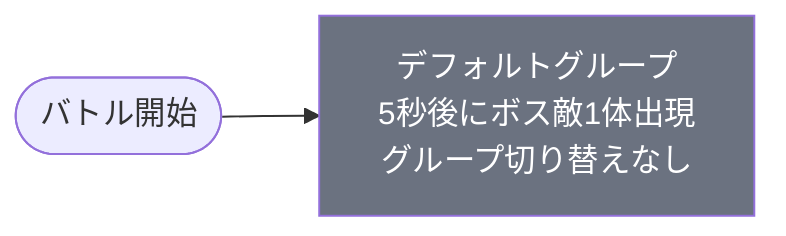

# normal_jig_00001 インゲームデータ詳細解説

> 参照リポジトリ: `projects/glow-masterdata`
> リリースキー: 202509010
> 本ファイルはMstAutoPlayerSequenceが1行のメインクエスト（normal難度）の全データ設定を解説する

---

## 概要

**メインクエスト・ジグザウステージ1**（砦破壊型・normal難度）。

このステージはシンプルな単一グループ構成で、デフォルトグループのみが存在する入門的な設計のステージである。砦HP 15,000 のダメージ有効型で、敵はボス種別のグリーン属性1種類のみが登場する。5,000ms（5秒）経過後に `c_jig_00101_mainquest_Boss_Green`（ボス敵）が1体召喚されるという極めてシンプルな構成で、グループ切り替えも存在しない。

ループ背景には `jig_00003`、BGMには `SSE_SBG_003_003` が使用されており、ジグザウシリーズ独特の世界観を演出する。コマフィールドは2段構成で、row=1（height=5.0）に2コマ、row=2（height=2.0）に2コマが配置されている。コマ効果は一切なく、純粋な戦闘フィールドとして機能する。

説明文によると「緑属性の敵が登場するので赤属性のキャラは有利に戦うこともできる」とあり、属性相性システムの学習を促す設計になっている。また「敵は範囲攻撃をしてくるぞ！ディフェンスキャラを前線に出し、遠距離攻撃キャラで攻撃しよう！」というギミック情報が提示されており、編成の基本戦術（前衛ディフェンス・後衛遠距離アタッカー）をプレイヤーに教えるチュートリアル的役割を担うステージといえる。メインクエストの序盤として属性相性・編成戦術の両方をシンプルな構成で体験させる設計パターンである。

---

## 関連テーブル設定

### MstInGame

| カラム | 値 |
|--------|-----|
| `id` | `normal_jig_00001` |
| `mst_auto_player_sequence_id` | `normal_jig_00001` |
| `mst_auto_player_sequence_set_id` | `normal_jig_00001` |
| `bgm_asset_key` | `SSE_SBG_003_003` |
| `boss_bgm_asset_key` | （空） |
| `loop_background_asset_key` | `jig_00003` |
| `player_outpost_asset_key` | （空） |
| `mst_page_id` | `normal_jig_00001` |
| `mst_enemy_outpost_id` | `normal_jig_00001` |
| `boss_mst_enemy_stage_parameter_id` | `1` |
| `normal_enemy_hp_coef` | `1.0` |
| `normal_enemy_attack_coef` | `1.0` |
| `normal_enemy_speed_coef` | `1` |
| `boss_enemy_hp_coef` | `1.0` |
| `boss_enemy_attack_coef` | `1.0` |
| `boss_enemy_speed_coef` | `1` |
| `release_key` | `202509010` |

### MstEnemyOutpost（敵砦）

| カラム | 値 | 意味 |
|--------|-----|------|
| `id` | `normal_jig_00001` | |
| `hp` | `15,000` | ステージの砦HP |
| `is_damage_invalidation` | （空） | **ダメージ有効**（砦破壊型） |
| `outpost_asset_key` | （空） | 砦アセット（デフォルト） |
| `artwork_asset_key` | `jig_0001` | 背景アートワーク |

### MstPage + MstKomaLine（コマフィールド）

2段構成。

```
row=1  height=5.0  （2コマ: 0.25, 0.75）
  koma1: jig_00003  width=0.25  effect=None
  koma2: jig_00003  width=0.75  effect=None

row=2  height=2.0  （2コマ: 0.6, 0.4）
  koma1: jig_00003  width=0.6   effect=None
  koma2: jig_00003  width=0.4   effect=None
```

> **コマ効果の補足**: コマ効果は全コマで`None`（なし）。特殊ギミックは存在しない標準的なフィールド構成。全コマのアセットは `jig_00003` で統一されており、ジグザウシリーズの背景テクスチャが使用される。

### MstInGameI18n（バトル説明文）

**result_tips（バトルヒント）:**
> （空）

**description（ステージ説明）:**
> 【属性情報】
> 緑属性の敵が登場するので赤属性のキャラは有利に戦うこともできるぞ!
>
> 【ギミック情報】
> 敵は範囲攻撃をしてくるぞ!
> ディフェンスキャラを前線に出し、遠距離攻撃キャラで攻撃しよう!

---

## 使用する敵パラメータ（MstEnemyStageParameter）一覧

1種類の敵パラメータを使用。`c_` プレフィックスはコンテンツ固有の敵。
IDの命名規則: `c_{シリーズID}_{コンテンツID}_{kind}_{color}`

### カラム解説

| カラム名（略称） | DBカラム名 | 説明 |
|---------------|-----------|------|
| id | id | MstEnemyStageParameterの主キー |
| キャラID | mst_enemy_character_id | 紐付くキャラモデル・スキルの参照元 |
| kind | character_unit_kind | `Normal`（通常敵）/ `Boss`（ボス）。UIオーラ表示に影響 |
| role | role_type | 属性相性の役職（Attack/Technical/Defense/Support） |
| color | color | 属性色（Red/Yellow/Green/Blue/Colorless） |
| base_hp | hp | ベースHP（`enemy_hp_coef` 乗算前の素値） |
| base_atk | attack_power | ベース攻撃力（`enemy_attack_coef` 乗算前の素値） |
| base_spd | move_speed | 移動速度（数値が大きいほど速い） |
| knockback | damage_knock_back_count | 被攻撃時ノックバック回数（0=ノックバックなし） |
| ability | mst_unit_ability_id1 | 特殊アビリティID |
| drop_bp | drop_battle_point | 基本ドロップバトルポイント |

### 全1種類の詳細パラメータ

| MstEnemyStageParameter ID | キャラID | kind | role | color | base_hp | base_atk | base_spd | knockback | ability | drop_bp |
|--------------------------|---------|------|------|-------|---------|---------|---------|-----------|---------|---------|
| `c_jig_00101_mainquest_Boss_Green` | `chara_jig_00101` | Boss | Attack | Green | 5,000 | 200 | 34 | 3 | （空） | 500 |

> **実際のHP・ATKは `base × MstAutoPlayerSequence.enemy_hp_coef` で決まる。**
> 本ステージはシーケンスに個別の `enemy_hp_coef` 指定がない場合、MstInGameの `boss_enemy_hp_coef=1.0` が適用される。

### 敵パラメータの特性解説

| 比較項目 | c_jig_00101_mainquest_Boss_Green |
|---------|----------------------------------|
| kind | Boss（ボス種別） |
| role | Attack（攻撃型） |
| color | Green（緑属性） |
| base_hp | 5,000 |
| base_atk | 200（高め） |
| base_spd | 34（標準） |
| knockback | 3回（ノックバック耐性あり・3回まで） |
| 登場グループ | デフォルトグループのみ |

**設計上の特徴**:
- `character_unit_kind = Boss` であるためボス種別のUIオーラが表示される。メインクエスト序盤のステージにボス敵を1体配置するシンプルな構成。
- `damage_knock_back_count = 3` で3回のノックバック耐性を持つ。通常敵より粘り強く前線を維持できる設計。
- `attack_power = 200` は高い攻撃力を持ち、ディフェンスキャラを前線に置かないと砦への被害が大きくなる。説明文の「ディフェンスキャラを前線に出し」という指示と連動した設定。
- 緑属性（Green）のため赤属性キャラが有利（1.5倍ダメージ相当）。説明文の属性情報と一致している。
- `drop_battle_point = 500` とボス敵らしい高いドロップポイントが設定されている。

---

## グループ構造の全体フロー（Mermaid）



> **Mermaid スタイルカラー規則**:
> - デフォルトグループ: `#6b7280`（グレー）
>
> **注意**: グループが1つ（デフォルト）のみで終端。ループ構造なし、グループ切り替えなし。

---

## 全1行の詳細データ（グループ単位）

### デフォルトグループ（elem 1）

バトル開始時から動作する唯一のグループ。5秒（500ティック）経過後にボス敵が1体出現する。グループ切り替えは存在しない。

| seq_element_id | 条件 | condition_value | action_type | action_value |
|----------------|------|----------------|-------------|--------------|
| 1 | ElapsedTime | 500 | SummonEnemy | c_jig_00101_mainquest_Boss_Green |

**ポイント:**
- `ElapsedTime(500)` = 5,000ms = 5秒後にボス敵1体を召喚する。バトル開始直後に猶予を設けることでプレイヤーがキャラを配置する時間を確保している。
- デフォルトグループのみで構成されており、グループ切り替えトリガーが存在しない。1体のボス敵を倒すか砦を破壊するまで継続するシンプルな設計。
- 全シーケンスが1行という最小構成のステージ。メインクエストの最序盤ステージとして、プレイヤーがインゲームの基本操作を習得するための設計といえる。

---

## グループ切り替えまとめ表

グループ切り替えは存在しない。

| 切り替え | 条件 | 遷移先 |
|---------|------|--------|
| — | — | — |

> **補足**: 本ステージはデフォルトグループのみで構成されており、グループ切り替えは発生しない。ボス敵1体が出現し、砦を破壊するか敵を撃破するまでバトルが継続する。

---

## スコア体系

バトルポイントは `override_drop_battle_point` が設定されていない場合、MstEnemyStageParameterの `drop_battle_point` が使用される。

| 敵の種類 | override_bp（設定値） | base drop_bp | 備考 |
|---------|---------------------|--------------|------|
| c_jig_00101_mainquest_Boss_Green（ボス） | （空・未設定） | 500 | デフォルトグループのみ登場 |

- `drop_battle_point = 500` とボス敵らしい高いポイントが設定されている
- `override_drop_battle_point` は未設定のため、`drop_battle_point = 500` がそのまま適用される
- メインクエスト系コンテンツはスコア競争ではなく砦破壊が目的のため、スコア体系はシンプル

---

## この設定から読み取れる設計パターン

### 1. 最小構成（1グループ・1シーケンス行）によるチュートリアル的設計
全シーケンスが1グループ・1行という最小構成のステージ。メインクエスト `normal_jig_00001`（ジグザウシリーズ第1ステージ）として、インゲームの基本操作・属性相性・編成戦術の習得を目的とした入門的設計になっている。複雑なグループ切り替えやギミックを排除することでプレイヤーの学習負荷を最小化している。

### 2. ボス単体配置による攻略の明確さ
`character_unit_kind = Boss` の敵1体のみを配置することで、プレイヤーが「何を倒せばよいか」を直感的に理解できる設計になっている。ボス種別はUIオーラ表示が異なるため視認性が高く、初めてプレイするユーザーでも攻略目標が明確になる。

### 3. 高攻撃力（attack_power=200）とノックバック耐性（3回）の組み合わせ
ボス敵の `attack_power=200` と `damage_knock_back_count=3` の組み合わせにより、「前線に壁役（ディフェンス）を出さないと砦が素早く削られる」という状況を自然に作り出している。これが説明文の「ディフェンスキャラを前線に出し、遠距離攻撃キャラで攻撃しよう！」という編成戦術のチュートリアルと機能的に連動している。

### 4. 5秒の出現猶予による編成時間の確保
`ElapsedTime(500)` = 5秒後に敵が出現する設計で、バトル開始直後にプレイヤーがキャラを配置する時間を確保している。特にメインクエスト序盤のステージでは、初めてインゲームを体験するプレイヤーが慌てずにキャラを配置できるよう配慮した設計パターンといえる。

### 5. 属性相性システムの学習促進
全敵が緑属性（Green）で統一されており、MstInGameI18nの説明文で「赤属性のキャラは有利に戦える」と明示している。属性相性の恩恵（ダメージ増加）をプレイヤーが体験できるシナリオ設計になっており、GLOWの基本システムである属性相性の概念を序盤ステージで自然に学べるよう工夫されている。

### 6. コマ効果なしのシンプルなフィールド構成
2段・4コマ構成で全コマの effect が `None`。暗闇コマや特殊ギミックなどの追加要素を一切持たない純粋な戦闘フィールドであり、プレイヤーがコマ効果の概念に混乱することなく基本的な戦闘フローを習得できる環境を提供している。
