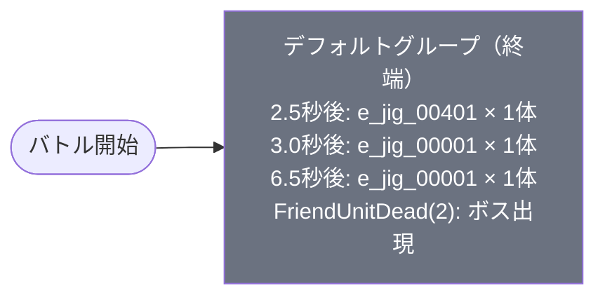

# normal_jig_00004 インゲームデータ詳細解説

> 参照リポジトリ: `projects/glow-masterdata`
> リリースキー: 202509010
> 本ファイルはMstAutoPlayerSequenceが4行のメインクエスト（normal難度）の全データ設定を解説する

---

## 概要

**メインクエスト・ジグ編 ステージ4**（砦破壊型・normal難度）。

砦HP 20,000でダメージ有効な砦破壊型ステージ。BGMは `SSE_SBG_003_003`（ボスBGMなし）を使用し、ループ背景に `jig_00002` が設定されている。グループ構成はデフォルトグループのみの1グループ構成（ループなし・終端グループ）であり、シーケンス切り替えは一切発生しない。使用する敵は3種類で、Colorless属性の雑魚2種（Attackロール・Defenseロール）とGreen属性のボス1種を組み合わせた構成。MstInGameI18nの説明文には「緑属性の敵が登場するので赤属性のキャラは有利に戦うこともできるぞ!」と記載されており、ボスがGreen属性であることを意識した編成を促している。

特徴的な設計として、ボス（`e_jig_00301_mainquest_Boss_Green`）の出現トリガーに `FriendUnitDead(2)` を採用している。これはプレイヤーユニットが2体撃破された際に初めてボスが登場する仕組みであり、序盤の雑魚戦闘を通じてプレイヤーの戦力が削られたタイミングでボスが出現するという、圧力強化設計パターンを採用している。推奨編成としては、赤属性のキャラクターをメインに据えつつ、序盤に出現するColorless属性の雑魚（Colorlessは属性相性が均一）に対応できるバランス型を選ぶとよい。FriendUnitDeadトリガーへの対策として、防御・回復系キャラクターを編成に加えてユニットの生存率を高めることが攻略の鍵となる。

---

## 関連テーブル設定

### MstInGame

| カラム | 値 |
|--------|-----|
| `id` | `normal_jig_00004` |
| `mst_auto_player_sequence_id` | `normal_jig_00004` |
| `mst_auto_player_sequence_set_id` | `normal_jig_00004` |
| `bgm_asset_key` | `SSE_SBG_003_003` |
| `boss_bgm_asset_key` | （空） |
| `loop_background_asset_key` | `jig_00002` |
| `mst_page_id` | `normal_jig_00004` |
| `mst_enemy_outpost_id` | `normal_jig_00004` |
| `boss_mst_enemy_stage_parameter_id` | `1` |
| `normal_enemy_hp_coef` | `1.0` |
| `normal_enemy_attack_coef` | `1.0` |
| `normal_enemy_speed_coef` | `1` |
| `boss_enemy_hp_coef` | `1.0` |
| `boss_enemy_attack_coef` | `1.0` |
| `boss_enemy_speed_coef` | `1` |
| `release_key` | `202509010` |

### MstEnemyOutpost（敵砦）

| カラム | 値 | 意味 |
|--------|-----|------|
| `id` | `normal_jig_00004` | |
| `hp` | `20,000` | Normal難度の砦HP |
| `is_damage_invalidation` | （空） | **ダメージ有効**（砦破壊型） |
| `artwork_asset_key` | `jig_0001` | 背景アートワーク（ジグ編） |

### MstPage + MstKomaLine（コマフィールド）

3行構成。

```
row=1  height=8.0  （3コマ: 0.5, 0.25, 0.25）
  koma1: jig_00002  width=0.5   effect=None（全対象）
  koma2: jig_00002  width=0.25  effect=None（全対象）
  koma3: jig_00002  width=0.25  effect=None（全対象）

row=2  height=6.0  （2コマ: 0.5, 0.5）
  koma1: jig_00002  width=0.5  effect=None（全対象）
  koma2: jig_00002  width=0.5  effect=None（全対象）

row=3  height=3.0  （2コマ: 0.4, 0.6）
  koma1: jig_00002  width=0.4  effect=None（全対象）
  koma2: jig_00002  width=0.6  effect=None（全対象）
```

> **コマ効果の補足**: 全コマ `effect=None` のためコマ効果ギミックなし。row=1 は3コマ構成（幅0.5 + 0.25 + 0.25の非対称配置）、row=2 は均等2コマ、row=3 は非対称2コマ（幅0.4と0.6）。背景アセットは全コマ `jig_00002` を使用。

### MstInGameI18n（バトル説明文）

**result_tips（バトルヒント）:**
> （空）

**description（ステージ説明）:**
> 【属性情報】
> 緑属性の敵が登場するので赤属性のキャラは有利に戦うこともできるぞ!

---

## 使用する敵パラメータ（MstEnemyStageParameter）一覧

3種類の敵パラメータを使用。`e_` プレフィックスは汎用敵。
IDの命名規則: `e_{シリーズID}_mainquest_{kind}_{color}`

### カラム解説

| カラム名（略称） | DBカラム名 | 説明 |
|---------------|-----------|------|
| id | id | MstEnemyStageParameterの主キー |
| キャラID | mst_enemy_character_id | 紐付くキャラモデル・スキルの参照元 |
| kind | character_unit_kind | `Normal`（通常敵）/ `Boss`（ボス）。UIオーラ表示に影響 |
| role | role_type | 属性相性の役職（Attack/Technical/Defense/Support） |
| color | color | 属性色（Red/Yellow/Green/Blue/Colorless） |
| base_hp | hp | ベースHP（`enemy_hp_coef` 乗算前の素値） |
| base_atk | attack_power | ベース攻撃力（`enemy_attack_coef` 乗算前の素値） |
| base_spd | move_speed | 移動速度（数値が大きいほど速い） |
| knockback | damage_knock_back_count | 被攻撃時ノックバック回数 |
| ability | mst_unit_ability_id1 | 特殊アビリティID |
| drop_bp | drop_battle_point | 基本ドロップバトルポイント |

### 全3種類の詳細パラメータ

| MstEnemyStageParameter ID | キャラID | kind | role | color | base_hp | base_atk | base_spd | knockback | ability | drop_bp |
|--------------------------|---------|------|------|-------|---------|---------|---------|-----------|---------|---------|
| `e_jig_00401_mainquest_Normal_Colorless` | `enemy_jig_00401` | Normal | Attack | Colorless | 3,000 | 100 | 32 | 4 | （空） | 100 |
| `e_jig_00001_mainquest_Normal_Colorless` | `enemy_jig_00001` | Normal | Defense | Colorless | 3,500 | 50 | 31 | 2 | （空） | 150 |
| `e_jig_00301_mainquest_Boss_Green` | `enemy_jig_00301` | Boss | Attack | Green | 5,000 | 100 | 37 | 3 | （空） | 500 |

### 敵パラメータの特性解説

| 比較項目 | e_jig_00401（Attack/Colorless） | e_jig_00001（Defense/Colorless） | e_jig_00301（Boss/Green） |
|---------|--------------------------------|---------------------------------|--------------------------|
| kind | Normal | Normal | **Boss** |
| role | Attack（攻撃型） | Defense（防御型） | Attack（攻撃型） |
| color | **Colorless** | **Colorless** | **Green** |
| base_hp | 3,000（低め） | 3,500（中程度） | 5,000（ボスとして中程度） |
| base_atk | 100（高い） | 50（低い） | 100（高い） |
| base_spd | 32（やや速い） | 31（標準） | **37（最速）** |
| knockback | **4回**（最多） | 2回 | 3回 |
| 登場条件 | ElapsedTime（タイマー） | ElapsedTime（タイマー） | **FriendUnitDead(2)** |

**設計上の特徴**:
- `e_jig_00401`（Attack/Colorless）は `base_hp=3,000` と低HPだが、ノックバック回数4回が最多。攻撃型でありながらノックバックが多いため、撃ち合いが長引きやすい敵。
- `e_jig_00001`（Defense/Colorless）は `base_hp=3,500` とやや高め。防御型・低攻撃力でじっくり前進するタフな敵。同一シーケンス（ElapsedTime(650)）で2回出現する設計になっており、後半の主力として機能する。
- `e_jig_00301`（Boss/Green）は `kind=Boss` でオーラあり。`move_speed=37` と3種中最速。`FriendUnitDead(2)` トリガーで登場するため、プレイヤーが2ユニット失った後に猛スピードで迫ってくる。Green属性のため赤属性キャラが属性有利を活かせる唯一の敵。

---

## グループ構造の全体フロー（Mermaid）



> **Mermaid スタイルカラー規則**:
> - デフォルトグループ: `#6b7280`（グレー）
>
> **注意**: `normal_jig_00004` はデフォルトグループのみの1グループ構成。SwitchSequenceGroup（グループ切り替え）行が存在しないため、フロー遷移はなく終端グループとして機能する。バトル開始から終了まで同一グループが動作し続ける設計。

---

## 全4行の詳細データ（グループ単位）

### デフォルトグループ（elem 1〜4、終端グループ）

バトル開始から動作する唯一のグループ。タイマーで雑魚2種を順次投入し、プレイヤーユニットが2体撃破された時点でボスが出現する。グループ切り替えなし・ループなしのシンプルな構成。

| seq_element_id | 条件 | action_type | action_value | 召喚数 | 備考 |
|----------------|------|-------------|--------------|--------|------|
| 1 | ElapsedTime(250) | SummonEnemy | e_jig_00401_mainquest_Normal_Colorless | 1 | 2.5秒後にAttack/Colorless雑魚を1体出現 |
| 2 | ElapsedTime(300) | SummonEnemy | e_jig_00001_mainquest_Normal_Colorless | 1 | 3.0秒後にDefense/Colorless雑魚を1体出現 |
| 3 | ElapsedTime(650) | SummonEnemy | e_jig_00001_mainquest_Normal_Colorless | 1 | 6.5秒後にDefense/Colorless雑魚を再度1体出現 |
| 4 | FriendUnitDead(2) | SummonEnemy | e_jig_00301_mainquest_Boss_Green | 1 | フレンドユニット2体撃破でBoss/Green出現 |

**ポイント:**
- `ElapsedTime(250)` = 2,500ms = 2.5秒後に Attack/Colorless 雑魚（e_jig_00401）が1体出現。
- `ElapsedTime(300)` = 3,000ms = 3.0秒後に Defense/Colorless 雑魚（e_jig_00001）が1体出現。
- `ElapsedTime(650)` = 6,500ms = 6.5秒後に再度 e_jig_00001 が1体出現。同じ敵種を間隔を置いて2回投入することで持続的な圧力をかける。
- `FriendUnitDead(2)` はプレイヤーユニットが累計2体撃破された時点が発動条件。タイマーとは独立したトリガーであり、プレイヤーの被ダメージ状況によって発動タイミングが変化する。消耗した状態でボスが出現するという難度設計。
- ボス（e_jig_00301）は `move_speed=37` と最速かつ `base_atk=100` と高攻撃力。ユニットが削られた直後に高速ボスが出現するため、立て直しが難しい状況が生まれる。

---

## グループ切り替えまとめ表

| 切り替え | 条件 | 遷移先 |
|---------|------|--------|
| （なし） | — | — |

> **補足**: `normal_jig_00004` はグループ切り替えが一切存在しない。デフォルトグループのみで構成される終端グループであり、バトル開始から終了まで同一グループが継続動作する。グループ遷移ではなく **タイマー**（ElapsedTime）と **プレイヤーユニット撃破数**（FriendUnitDead）の2種類のトリガーで敵出現を制御する設計。

各グループの概要:
- デフォルト: バトル全体を通じて動作する唯一のグループ（終端グループ）

---

## スコア体系

バトルポイントは `override_drop_battle_point` が設定されていない場合、MstEnemyStageParameterの `drop_battle_point` が使用される。

| 敵の種類 | MstEnemyStageParameter ID | override_bp（設定値） | base drop_bp |
|---------|--------------------------|---------------------|--------------|
| e_jig_00401（Attack/Colorless） | e_jig_00401_mainquest_Normal_Colorless | （空・未設定） | 100 |
| e_jig_00001（Defense/Colorless） | e_jig_00001_mainquest_Normal_Colorless | （空・未設定） | 150 |
| e_jig_00301（Boss/Green） | e_jig_00301_mainquest_Boss_Green | （空・未設定） | 500 |

- 全行の `defeated_score` は `0`（リザルト画面スコア表示なし）
- `override_drop_battle_point` は全行で未設定のため、MstEnemyStageParameterの `drop_battle_point` がそのまま使用される
- ボス（e_jig_00301）は `drop_battle_point=500` と最高値。倒せた場合に大きなポイントが得られる設計
- メインクエスト系コンテンツはスコア競争ではなく砦破壊が目的のため、`defeated_score` は全件0

---

## この設定から読み取れる設計パターン

### 1. FriendUnitDeadトリガーを使ったボス登場設計

`FriendUnitDead(2)` という条件でボスが出現するトリガー設計は、プレイヤーが受けたダメージ（ユニット2体の撃破）を起点に難度が上がる仕組み。タイマーベースのトリガーとは異なり、プレイヤーの戦況に応じてボスの登場タイミングが変化する動的な設計。戦力が2ユニット分削られた状態でさらに強力なボスが出現するため、被ダメージが多いプレイヤーほど苦しい状況に追い込まれる。

### 2. 3種類の敵による属性・役割バリエーション

Colorless属性の雑魚2種（Attack型・Defense型）とGreen属性のボス1種という構成により、序盤は属性相性に依存しない均質な雑魚戦、後半はGreen属性ボスへの赤属性有利という2段階の戦略転換を要求する設計。MstInGameI18nで赤属性有利を明示しつつも、序盤のColorless雑魚には属性有利が適用されないため、編成の単一化を防いでいる。

### 3. 同一敵種の2回投入による持続圧力

`e_jig_00001`（Defense/Colorless）が ElapsedTime(300) と ElapsedTime(650) の2回にわたって出現する。3.0秒と6.5秒という間隔で同じ敵が繰り返し投入されることで、前の敵を倒しても次の敵が続く持続的なプレッシャーを生み出している。normal難度の小規模なステージにおいてウェーブ感を演出するシンプルな手法。

### 4. 小規模召喚数（各1体）によるnormal難度の調整

全4行の召喚数が全て1体と最小限に設定されている。hard難度（`hard_jig_00005`）の30体大量召喚とは対照的に、normal難度ではシーケンスの種類を増やすのではなく各召喚数を絞ることで難度を調整している。1体1体を丁寧に倒していくテンポのバトルになっており、メインクエスト序盤ステージとして適切な難度設計といえる。

### 5. ボスのdrop_bp=500による撃破インセンティブ

ボス（e_jig_00301）の `drop_battle_point=500` は雑魚の100〜150と比較して3〜5倍の高値。砦破壊型コンテンツでは砦を壊すことが主目的だが、ボスを倒せた場合のボーナスとして高いBP獲得を設定することで、ボスとの戦闘にも意味を持たせている。`FriendUnitDead(2)` でボスが出現するタイミングを考えると、被ダメージを最小限に抑えてボスを倒せるかどうかがBP効率に影響する設計になっている。
