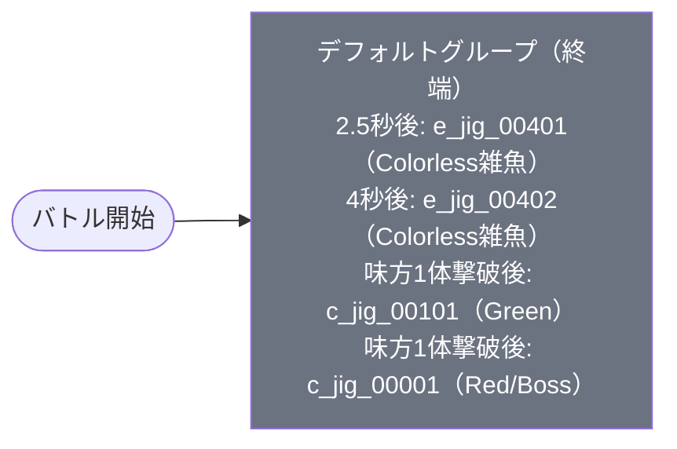

# normal_jig_00006 インゲーム詳細解説

## 1. 概要

`normal_jig_00006` は、ジグ編ノーマルメインクエストの第6弾として設計された砦破壊型インゲームバトル設定である。本ステージ最大の特徴は**複合属性構成**であり、赤属性・緑属性・無属性の3種類の敵が同時に登場する。通常のメインクエストステージでは属性を統一することが多いが、本ステージはあえて複数属性を混在させることで、単一の属性有利に頼ることができないプレイヤーへの駆け引きを生み出している。青属性キャラは赤属性の敵に対して有利に戦え、赤属性キャラは緑属性の敵に対して有利に戦えるが、無属性の敵には属性相性が適用されないため、複数属性を意識した編成の工夫が求められる。

バトル構造はシングルグループ（デフォルトグループのみ・グループ切り替えなし）で完結しており、4種類の敵がタイマートリガー（ElapsedTime）と撃破トリガー（FriendUnitDead）の組み合わせによって出現する。バトル序盤は2種類の無属性雑魚（`e_jig_00401`・`e_jig_00402`）がElapsedTimeトリガーで順次登場し、その後、味方ユニットの撃破が蓄積されると緑属性キャラ（`c_jig_00101`）と赤属性ボス（`c_jig_00001`）が段階的に出現する2段階エスカレーション構造を採用している。

ギミックとして**火傷攻撃**が実装されており、説明文では火傷ダメージ軽減特性を持つキャラクターの編成を推奨している。BGMには `SSE_SBG_003_003`（ジグ編共通）を使用し、敵砦HPは20,000に設定された序盤から中盤クラスのスケール感を持つステージである。推奨編成としては、赤属性に強い青属性キャラ・緑属性に強い赤属性キャラを揃えつつ、火傷ダメージ軽減の特性持ちキャラを加えるバランス型が有効となる。

---

## 2. 関連テーブル設定

### MstInGame

| カラム | 値 |
|---|---|
| id | normal_jig_00006 |
| mst_auto_player_sequence_id | normal_jig_00006 |
| mst_auto_player_sequence_set_id | normal_jig_00006 |
| bgm_asset_key | SSE_SBG_003_003 |
| boss_bgm_asset_key | （空） |
| loop_background_asset_key | jig_00003 |
| mst_page_id | normal_jig_00006 |
| mst_enemy_outpost_id | normal_jig_00006 |
| boss_mst_enemy_stage_parameter_id | 1 |
| normal_enemy_hp_coef | 1.0 |
| normal_enemy_attack_coef | 1.0 |
| normal_enemy_speed_coef | 1 |
| boss_enemy_hp_coef | 1.0 |
| boss_enemy_attack_coef | 1.0 |
| boss_enemy_speed_coef | 1 |
| release_key | 202509010 |

### MstEnemyOutpost（敵砦）

| カラム | 値 | 意味 |
|---|---|---|
| id | normal_jig_00006 | |
| hp | 20,000 | Normal難度の砦HP |
| is_damage_invalidation | （空） | ダメージ有効（砦破壊型） |
| artwork_asset_key | jig_0001 | 背景アートワーク（ジグ編） |

### MstPage + MstKomaLine（コマフィールド）

3行構成。全コマでアセットキーは `jig_00003`、コマエフェクトなし。

| row | height | コマ数 | koma1_asset_key | koma1_width | koma2_asset_key | koma2_width | koma3_asset_key | koma3_width |
|---|---|---|---|---|---|---|---|---|
| 1 | 3.0 | 2 | jig_00003 | 0.4 | jig_00003 | 0.6 | — | — |
| 2 | 9.0 | 3 | jig_00003 | 0.25 | jig_00003 | 0.5 | jig_00003 | 0.25 |
| 3 | 4.0 | 2 | jig_00003 | 0.75 | jig_00003 | 0.25 | — | — |

> 全コマ `koma_effect = None`（エフェクトなし）。ジグ編共通背景アセット（`jig_00003`）で統一。row=2は3コマ構成（中央コマが幅0.5の最大コマ）、row=1・3は2コマ構成の非対称レイアウト。

### MstInGameI18n（language = ja）

| カラム | 値 |
|---|---|
| language | ja |
| result_tips | （空） |
| description | 【属性情報】赤属性の敵が登場するので青属性のキャラは有利に戦うこともできるぞ! 緑属性の敵が登場するので赤属性のキャラは有利に戦うこともできるぞ! さらに、無属性の敵も登場するぞ! 【ギミック情報】火傷攻撃をしてくる敵が登場するぞ! 特性で火傷ダメージ軽減を持っているキャラを編成しよう! |

---

## 3. 使用する敵パラメータ一覧

### カラム解説

| カラム名 | DBカラム名 | 説明 |
|---|---|---|
| id | id | MstEnemyStageParameterの主キー |
| キャラID | mst_enemy_character_id | 紐付くキャラモデル・スキルの参照元 |
| kind | character_unit_kind | `Normal`（通常敵）/ `Boss`（ボス）。UIオーラ表示に影響 |
| role | role_type | 属性相性の役職（Attack / Technical / Defense / Support） |
| color | color | 属性色（Red / Yellow / Green / Blue / Colorless） |
| hp | hp | ベースHP |
| attack_power | attack_power | ベース攻撃力 |
| move_speed | move_speed | 移動速度（数値が大きいほど速い） |
| knockback | damage_knock_back_count | 被攻撃時ノックバック回数（空=ノックバックなし） |
| ability | mst_unit_ability_id1 | 特殊アビリティID |
| drop_bp | drop_battle_point | 基本ドロップバトルポイント |

### 全4種類の詳細パラメータ

| MstEnemyStageParameter ID | キャラID | kind | role | color | hp | attack_power | move_speed | knockback | ability | drop_bp |
|---|---|---|---|---|---|---|---|---|---|---|
| `e_jig_00401_mainquest_Normal_Colorless` | `enemy_jig_00401` | Normal | Attack | Colorless | 3,000 | 100 | 32 | 4 | （空） | 100 |
| `e_jig_00402_mainquest_Normal_Colorless` | `enemy_jig_00402` | Normal | Attack | Colorless | 3,000 | 100 | 33 | 3 | （空） | 150 |
| `c_jig_00101_mainquest_Normal_Green` | `chara_jig_00101` | Normal | Attack | Green | 5,000 | 200 | 34 | 3 | （空） | 300 |
| `c_jig_00001_mainquest_Boss_Red` | `chara_jig_00001` | Boss | Technical | Red | 5,000 | 100 | 41 | 2 | （空） | 400 |

### 特性解説

| 比較項目 | e_jig_00401（Colorless） | e_jig_00402（Colorless） | c_jig_00101（Green） | c_jig_00001（ボス/Red） |
|---|---|---|---|---|
| kind | Normal | Normal | Normal | **Boss** |
| role | Attack | Attack | Attack | **Technical** |
| color | Colorless | Colorless | **Green** | **Red** |
| hp | 3,000（最低） | 3,000（最低） | 5,000（中） | 5,000（中） |
| attack_power | 100（低） | 100（低） | **200（最高）** | 100（低） |
| move_speed | 32（標準） | 33（やや速い） | 34（やや速い） | 41（最速） |
| knockback | **4回**（最多） | 3回 | 3回 | 2回 |
| 登場トリガー | ElapsedTime（250） | ElapsedTime（400） | FriendUnitDead（1） | FriendUnitDead（1） |

**設計上の特徴**:

- `e_jig_00401`（Colorless/Attack）: hp=3,000と低耐久だが、ノックバック回数が4回と最多。被弾しても大きくは押し返されにくく、前進を続ける設計。ElapsedTime=250（2.5秒後）と最初に登場する先陣。
- `e_jig_00402`（Colorless/Attack）: hp・攻撃力は `e_jig_00401` と同値だが、move_speed=33とわずかに速く、ノックバックが3回に減る。ElapsedTime=400（4秒後）に追随する第2波として登場。drop_bp=150と無属性としては高めに設定。
- `c_jig_00101`（Green/Attack）: attack_power=200と全4種中最高の攻撃力を持つ緑属性キャラ。FriendUnitDead=1（味方が1体倒れた後）で出現し、戦況に応じてエスカレーションを起こす第2段階の脅威。drop_bp=300と高BPドロップ。
- `c_jig_00001`（Red/Boss）: kind=Boss でUIオーラ表示あり。role=Technical で役職相性が絡む。move_speed=41と4種中最速で、ノックバック回数2回と比較的少なく前進が速い。FriendUnitDead=1のトリガーで `c_jig_00101` と同タイミングで登場し、最終局面の核となる。drop_bp=400と最高値。

---

## 4. グループ構造の全体フロー（Mermaid）

> **Mermaid スタイルカラー規則**:
> - デフォルトグループ: `#6b7280`（グレー）
>
> **注意**: `normal_jig_00006` はデフォルトグループのみの1グループ構成。SwitchSequenceGroup（グループ切り替え）行は存在しない。バトル開始から終了まで同一グループが動作し続け、ElapsedTimeトリガーとFriendUnitDeadトリガーの2種類で敵出現を制御する。

---

## 5. 全シーケンス詳細データ（デフォルトグループ）

### デフォルトグループ（elem 1〜4、終端グループ）

バトル開始から動作する唯一のグループ。タイマー（ElapsedTime）で無属性雑魚2種を順次投入し、味方ユニットの撃破（FriendUnitDead）をトリガーとして緑属性キャラとボスが出現する2段階構成。

| seq_element_id | 条件 | action_type | action_value | 解説 |
|---|---|---|---|---|
| 1 | ElapsedTime(250) | SummonEnemy | e_jig_00401_mainquest_Normal_Colorless | 2.5秒後に無属性Attack雑魚（hp=3,000・knockback=4）を召喚 |
| 2 | ElapsedTime(400) | SummonEnemy | e_jig_00402_mainquest_Normal_Colorless | 4秒後に無属性Attack雑魚（hp=3,000・knockback=3）を召喚 |
| 3 | FriendUnitDead(1) | SummonEnemy | c_jig_00101_mainquest_Normal_Green | 味方1体撃破後に緑属性Attack（hp=5,000・atk=200）を召喚 |
| 4 | FriendUnitDead(1) | SummonEnemy | c_jig_00001_mainquest_Boss_Red | 味方1体撃破後に赤属性Technical/Bossを召喚 |

**ポイント:**

- `ElapsedTime(250)` = 2,500ms = 2.5秒後、`ElapsedTime(400)` = 4,000ms = 4秒後と1.5秒差で2種の無属性雑魚が投入される。バトル序盤に属性有利が使えない無属性敵で圧力をかける設計。
- elem 3 と elem 4 はともに `FriendUnitDead(1)` トリガーで設定されており、**味方が1体倒されると同時に** 緑属性キャラ（Green）と赤属性ボス（Red）が出現する。2体がほぼ同タイミングで登場することでエスカレーション強度が高い。
- デフォルトグループのみであり、グループ切り替えは存在しない。全シーケンスはこの1グループで完結する。

---

## 6. グループ切り替えまとめ表

| 切り替え | 条件 | 遷移先 |
|---|---|---|
| （なし） | — | — |

> **補足**: `normal_jig_00006` はグループ切り替えが一切存在しない。デフォルトグループのみで構成される終端グループであり、バトル開始から終了まで同一グループが継続動作する。グループ遷移ではなく **ElapsedTime（タイマー）** と **FriendUnitDead（撃破数）** の2種類のトリガーで敵出現を制御するシンプルな設計。

各グループの概要:

- デフォルト: バトル全体を通じて動作する唯一のグループ（終端グループ・4行構成）

---

## 7. スコア体系

本ステージでは MstAutoPlayerSequence に `override_drop_battle_point` の設定がない。各敵を撃破した際のバトルポイントは、MstEnemyStageParameter の `drop_battle_point` がそのまま使用される。

| 敵の種類 | MstEnemyStageParameter ID | color | drop_battle_point | 登場トリガー |
|---|---|---|---|---|
| e_jig_00401 | e_jig_00401_mainquest_Normal_Colorless | Colorless | 100 | ElapsedTime(250) |
| e_jig_00402 | e_jig_00402_mainquest_Normal_Colorless | Colorless | 150 | ElapsedTime(400) |
| c_jig_00101 | c_jig_00101_mainquest_Normal_Green | Green | 300 | FriendUnitDead(1) |
| c_jig_00001（ボス） | c_jig_00001_mainquest_Boss_Red | Red | **400**（最高） | FriendUnitDead(1) |

- ボス（`c_jig_00001`）は drop_bp=400 と全4種中最高のバトルポイントを持つ
- 緑属性キャラ（`c_jig_00101`）は drop_bp=300 と中間値
- 無属性雑魚2種は drop_bp=100〜150 と低め設定
- 全行の `defeated_score` は設定なし（スコア表示なし）

---

## 8. この設定から読み取れる設計パターン

### 1. 複合属性構成による属性有利の限定的利用設計

赤属性・緑属性・無属性の3属性が1ステージに混在する設計は、normalメインクエストとしては特徴的な構成である。無属性の敵（elem 1・2）には属性有利が存在しないため、序盤から属性外ダメージで対処せざるを得ない。後半のFriendUnitDeadトリガーで登場する緑（Green）と赤（Red）の敵に対してはそれぞれ属性有利を活かせるが、1つの属性だけで全敵をカバーできない設計となっている。プレイヤーに複数属性キャラの編成を促す難度設計として機能している。

### 2. FriendUnitDead条件2連設定による2段階エスカレーション

elem 3（`c_jig_00101`/Green）と elem 4（`c_jig_00001`/Boss/Red）がともに `FriendUnitDead(1)` で設定されており、**味方1体が倒された瞬間に2体同時** でエスカレーションが発生する。これは単体出現と比べて局面転換の衝撃度が高く、「1体倒された」という小さなミスが大きなリターン（強敵2体の同時出現）を引き起こす非線形なプレッシャーを作り出す。砦破壊型ステージにおいて、プレイヤーに敵を取り逃がさないよう意識させる設計意図が読み取れる。

### 3. ElapsedTimeトリガーによる序盤無属性2波投入

バトル開始後2.5秒・4秒と短いインターバルで無属性雑魚が2種類投入される。無属性は属性有利がないため、プレイヤーがどの属性で編成しても「確実に不利のつかない序盤プレッシャー」を与える効果がある。また、この2体の無属性雑魚をすぐに倒してしまうと FriendUnitDead=1 のトリガーが早期に発動し、後半2体（Green・Boss/Red）の出現を早めてしまうリスクを孕む構造になっている。

### 4. Technical/Bossロールの設計意図

ボス（`c_jig_00001`）の role_type が `Technical` に設定されている点は注目に値する。Technical ロールはロール相性（Attack > Technical の有利関係など）に基づくゲームメカニクスに影響し、単なる「ボス=倒しにくい」という耐久設計ではなく、編成のロール相性を意識させる高度な設計要素として機能している。move_speed=41と最速のボスが Technical ロールで登場することで、役割相性も加味した編成判断が求められる。

### 5. 無属性雑魚のノックバック設計差異

同じ Colorless/Attack 雑魚でありながら、`e_jig_00401`（knockback=4）と `e_jig_00402`（knockback=3）でノックバック回数が異なる。ノックバック回数が多いほど攻撃を受けて弾かれにくく前進力が高い。先陣（elem 1）のほうがノックバック耐性が強く設定されており、序盤から砦に届きやすい突破力の高い敵を配置するという設計思想が読み取れる。

### 6. 火傷ギミックによる特性編成誘導

説明文で「火傷ダメージ軽減」特性を持つキャラクターの編成を推奨しており、火傷攻撃を持つ敵が存在することを示唆している。しかし、MstEnemyStageParameter の `mst_unit_ability_id1` は全4種が空（アビリティ未設定）であり、火傷攻撃はキャラクター固有のスキル・能力として MstEnemyCharacter 側に定義されていると考えられる。特定特性持ちキャラの組み込みを促すことで、プレイヤーの編成幅拡大を誘導している。
