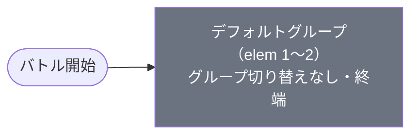

# normal_kai_00001 インゲームデータ詳細解説

> 参照リポジトリ: `projects/glow-masterdata`
> リリースキー: 202509010
> 本ファイルはMstAutoPlayerSequenceが2行のメインクエスト（normal難度）の全データ設定を解説する

---

## 概要

怪獣（kai）シリーズのメインクエスト第1弾（normal難度）。砦HPは60,000でダメージ有効（砦破壊型）。BGMは`SSE_SBG_003_001`、ループ背景は`glo_00010`。2行構成のコマフィールドを使用し、行1は2コマ（幅0.6＋幅0.4）、行2は2コマ（幅0.75＋幅0.25）で、いずれのコマにも特殊効果は設定されていない。

登場する敵は2種類。いずれも蜘蛛の怪獣（enemy_kai_00301）をベースとした敵で、無属性（Colorless）版はHP150,000・攻撃600・速度45の防衛型（Defense）、緑属性（Green）版はHP450,000・攻撃1,200・速度45の攻撃型（Attack）。両者とも非常に高速で接近し、緑属性版は無属性の3倍のHPと2倍の攻撃力を持つ実質ボス格として機能する。ノックバック耐性も緑属性のほうが高く（3回）、容易には押し返せない設計となっている。

グループ切り替えはなく、全2行がデフォルトグループに収まる単一グループ構成。開始後350ms経過で無属性の蜘蛛が落下アニメーション付きで出現し、1体を撃破すると緑属性の蜘蛛が追加で出現する。シーケンスが2行のみという極めてシンプルな構成のため、敵の種類と出現順序だけで難度を形成する直線的な設計である。

バトルヒントは未設定。ステージ説明では「緑属性の敵に対して赤属性有利、無属性も登場する」「ノックバック攻撃をしてくる敵が登場する」ことが案内されており、ノックバック無効化の特性を持つキャラの編成が推奨されている。

---

## 関連テーブル設定

### MstInGame

| カラム | 値 |
|--------|-----|
| `id` | `normal_kai_00001` |
| `mst_auto_player_sequence_set_id` | `normal_kai_00001` |
| `bgm_asset_key` | `SSE_SBG_003_001` |
| `boss_bgm_asset_key` | （空） |
| `loop_background_asset_key` | `glo_00010` |
| `mst_page_id` | `normal_kai_00001` |
| `mst_enemy_outpost_id` | `normal_kai_00001` |
| `boss_mst_enemy_stage_parameter_id` | `1` |
| `normal_enemy_hp_coef` | `1.0` |
| `normal_enemy_attack_coef` | `1.0` |
| `normal_enemy_speed_coef` | `1` |
| `boss_enemy_hp_coef` | `1.0` |
| `boss_enemy_attack_coef` | `1.0` |
| `boss_enemy_speed_coef` | `1` |

### MstEnemyOutpost（敵砦）

| カラム | 値 | 意味 |
|--------|-----|------|
| `id` | `normal_kai_00001` | |
| `hp` | `60,000` | 砦HP |
| `is_damage_invalidation` | （空） | **ダメージ有効**（砦破壊型） |
| `artwork_asset_key` | `kai_0001` | 背景アートワーク |

### MstPage + MstKomaLine（コマフィールド）

2行構成。

```
row=1  height=0.55  layout=2.0  (2コマ: 0.6, 0.4)
  koma1: glo_00010  width=0.6  bg_offset=-1.0  effect=None
  koma2: glo_00010  width=0.4  bg_offset=-1.0  effect=None

row=2  height=0.55  layout=4.0  (2コマ: 0.75, 0.25)
  koma1: glo_00010  width=0.75  bg_offset=0.6  effect=None
  koma2: glo_00010  width=0.25  bg_offset=0.6  effect=None
```

> **コマ効果の補足**: コマ効果は設定されていない。全コマが通常コマとして機能する。

### MstInGameI18n（バトル説明文）

**result_tips（バトルヒント）:**
> （未設定）

**description（ステージ説明）:**
> 【属性情報】\n緑属性の敵が登場するので赤属性のキャラは有利に戦うこともできるぞ!\nさらに、無属性の敵も登場するぞ!\n\n【ギミック情報】\nノックバック攻撃をしてくる敵が登場するぞ!\n特性でノックバック無効化を持っているキャラを編成しよう!

---

## 使用する敵パラメータ（MstEnemyStageParameter）一覧

2種類の敵パラメータを使用。`e_` プレフィックスは汎用敵。
IDの命名規則: `e_{キャラID}_general_{N}_{kind}_{color}`

### カラム解説

| カラム名（略称） | DBカラム名 | 説明 |
|---------------|-----------|------|
| id | id | MstEnemyStageParameterの主キー |
| キャラID | mst_enemy_character_id | 紐付くキャラモデル・スキルの参照元 |
| kind | character_unit_kind | `Normal`（通常敵）/ `Boss`（ボス）。UIオーラ表示に影響 |
| role | role_type | 属性相性の役職（Attack/Technical/Defense/Support） |
| color | color | 属性色（Red/Yellow/Green/Blue/Colorless） |
| sort_order | sort_order | ゲーム内表示順 |
| base_hp | hp | ベースHP（`enemy_hp_coef` 乗算前の素値） |
| base_atk | attack_power | ベース攻撃力（`enemy_attack_coef` 乗算前の素値） |
| base_spd | move_speed | 移動速度（数値が大きいほど速い） |
| well_dist | well_distance | 攻撃射程（コマ単位） |
| combo | attack_combo_cycle | 攻撃コンボ数（1=単発） |
| knockback | damage_knock_back_count | 被攻撃時ノックバック回数（0=ノックバックなし） |
| ability | mst_unit_ability_id1 | 特殊アビリティID |
| drop_bp | drop_battle_point | 基本ドロップバトルポイント |

### 全2種類の詳細パラメータ

| MstEnemyStageParameter ID | 日本語名 | キャラID | kind | role | color | sort | base_hp | base_atk | base_spd | well_dist | combo | knockback | ability | drop_bp |
|--------------------------|---------|---------|------|------|-------|------|---------|----------|---------|-----------|-------|-----------|---------|---------|
| e_kai_00301_general_1_Normal_Colorless | 蜘蛛の怪獣 | enemy_kai_00301 | Normal | Defense | Colorless | 1501 | 150,000 | 600 | 45 | 0.2 | 1 | 2 | （なし） | 10 |
| e_kai_00301_general_1_Boss_Green | 蜘蛛の怪獣 | enemy_kai_00301 | Boss | Attack | Green | 1502 | 450,000 | 1,200 | 45 | 0.2 | 1 | 3 | （なし） | 10 |

> **実際のHP・ATKは `base × MstAutoPlayerSequence.enemy_hp_coef` で決まる。** 本ステージはすべて 1.0 倍。

### 敵パラメータの特性解説

- **無属性蜘蛛（Normal/Colorless）**: 先遣隊。HPは非常に高耐久（150,000）だが攻撃は控えめ（600）の防衛型。ノックバック2回で一定の打たれ強さを持つ。撃破ポイントは10点。
- **緑属性蜘蛛（Boss/Green）**: 実質ボス。HP450,000と突出した耐久力を持ち、攻撃力も高火力（1,200）。ノックバック3回で非常に押し返しにくく、赤属性キャラによる属性有利を活かした集中攻撃が不可欠。
- 両敵とも速度45（非常に高速）・射程0.2・単発攻撃（コンボ1）。アビリティは持たないが、高速接近と高耐久の組み合わせにより、到達前に倒しきるのが困難な設計。

---

## グループ構造の全体フロー（Mermaid）



> グループ切り替えは存在しない。全2行がデフォルトグループで完結する。

---

## 全2行の詳細データ（デフォルトグループ）

### デフォルトグループ（elem 1〜2）

単一グループですべての召喚が完結する。時間経過（ElapsedTime）と撃破数（FriendUnitDead）の2条件で2体の敵を順次出現させるシンプルな構成。

| id | elem | 条件 | アクション | 召喚数 | interval | anim | 位置 | hp倍 | atk倍 | spd倍 | override_bp | 説明 |
|----|------|------|-----------|--------|---------|------|------|------|------|------|------------|------|
| normal_kai_00001_1 | 1 | ElapsedTime 350 | SummonEnemy: e_kai_00301_general_1_Normal_Colorless | 1 | — | Fall | 1.2 | 1.0 | 1.0 | 1.0 | 300 | 開始350ms、無属性蜘蛛1体が位置1.2に落下出現 |
| normal_kai_00001_2 | 2 | FriendUnitDead 1 | SummonEnemy: e_kai_00301_general_1_Boss_Green | 1 | — | None | — | 1.0 | 1.0 | 1.0 | 500 | 1体撃破、緑属性蜘蛛（ボス）1体が出現 |

**ポイント:**
- elem 1: `ElapsedTime 350`で無属性蜘蛛が落下アニメーション（Fall）付きで出現。override_bpが300に設定されている
- elem 2: `FriendUnitDead 1`で最初の敵を倒すと緑属性ボスが出現。override_bpが500に設定されている
- 全体として2体のみの出現で、1体ずつ順番に対処する直線的な構成

---

## グループ切り替えまとめ表

グループ切り替えは存在しない（単一デフォルトグループのみ）。

| 項目 | 内容 |
|------|------|
| グループ数 | 1（デフォルトのみ） |
| SwitchSequenceGroup | なし |
| 実質的な節目 | 1体撃破（ボス出現） |

---

## スコア体系

バトルポイントは`override_drop_battle_point`（MstAutoPlayerSequence設定値）が優先される。本ステージは全行に`override_drop_battle_point`が設定されているため、MstEnemyStageParameterの`drop_battle_point`（10pt）ではなくoverride値が使用される。

| 敵の種類 | override_bp（MstAutoPlayerSequence） | drop_bp（MstEnemyStageParameter） | 備考 |
|---------|--------------------------------------|----------------------------------|------|
| 無属性蜘蛛（Colorless） | 300 | 10 | override設定により300pt |
| 緑属性蜘蛛（Boss/Green） | 500 | 10 | override設定により500pt |

---

## この設定から読み取れる設計パターン

### 1. 超シンプルな2行構成による導入ステージ設計
シーケンスがわずか2行という最小構成で、プレイヤーに敵の出現と撃破の基本ループを体験させる設計。怪獣（kai）シリーズの第1ステージとして、余計な複雑さを排除し「敵を倒す→次の敵が出現する」という基本メカニクスの理解に集中させている。

### 2. Normal→Bossの段階的ステップアップ
最初に無属性のNormal敵を出現させ、それを撃破するとBoss格の緑属性敵が出現する設計。プレイヤーは低難度の敵で操作感を掴んだ後、高耐久・高火力のボスに挑む流れとなり、難度の段階的な上昇を自然に体験できる。

### 3. 高い基礎ステータスによる存在感の演出
通常のメインクエスト序盤と比較して敵のHP・攻撃力が高水準（無属性でHP150,000、ボスでHP450,000）に設定されている。少数精鋭型の設計で、1体1体の敵に重量感と脅威を持たせ、怪獣シリーズらしい「巨大な敵と戦う」体験を演出している。

### 4. override_bpによるスコア調整
MstEnemyStageParameterのdrop_bp（10pt）ではなく、MstAutoPlayerSequenceのoverride_drop_battle_point（300pt/500pt）で大幅にスコアを上書きしている。少数出現の敵に対して高いポイントを付与することで、撃破報酬のバランスを保っている。
