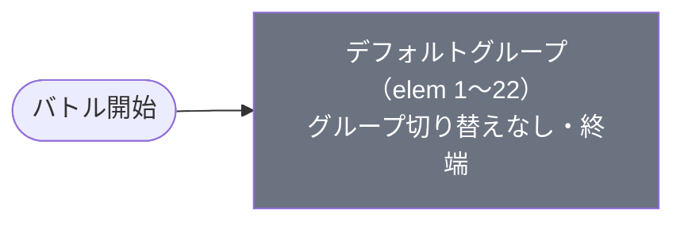

# normal_kai_00005 インゲームデータ詳細解説

> 参照リポジトリ: `projects/glow-masterdata`
> リリースキー: 202509010
> 本ファイルはMstAutoPlayerSequenceが22行のメインクエスト（normal難度）の全データ設定を解説する

---

## 概要

怪獣（kai）シリーズのメインクエスト第5弾（normal難度）。砦HPは68,000でダメージ有効（砦破壊型）。BGMは`SSE_SBG_003_001`、ループ背景は`kai_00001`。4行構成のコマフィールドを使用し、行1は2コマ（幅0.6＋幅0.4）、行2は2コマ（幅0.75＋幅0.25）、行3は3コマ（幅0.5＋幅0.25＋幅0.25）、行4は1コマ（幅1.0）で構成される。いずれのコマにも特殊効果は設定されていない。

登場する敵は3種類の通常敵と1種類のボス。怪獣 余獣（enemy_kai_00101）をベースとした無属性（Colorless）版はHP25,000・攻撃350・速度45の防衛型で、緑属性（Green）版はHP67,000・攻撃800・速度45の攻撃型。ボスとして怪獣９号（enemy_kai_00201）の黄属性版がHP450,000・攻撃1,200・速度55のテクニカル型で出現する。さらに、ギミックオブジェクト「本獣の卵」から変身する怪獣 本獣（enemy_kai_00001）の黄属性版はHP135,000・攻撃700・速度40の攻撃型として、時間経過で順次覚醒する。全体的に敵のHPは控えめから標準の範囲だが、攻撃力は控えめから高火力まで幅広く、速度は全敵が高速帯に位置する。

グループ切り替えはなく、全22行がデフォルトグループに収まる単一グループ構成。開始直後に5体の本獣の卵（ギミックオブジェクト）がフィールド各所に配置され、時間経過で無属性の余獣が波状召喚される。30秒経過から卵が順次黄属性の本獣に変身し始め、変身後0.5秒で行動を開始する。47秒経過以降は緑属性の余獣が99体規模の無限ループで押し寄せ、62秒でボスの怪獣９号（黄属性・逃走型）が登場する。砦にダメージが入ると緑属性の余獣が即座に追加される。

バトルヒントは未設定。ステージ説明では「緑属性の敵に対して赤属性有利、黄属性の敵に対して緑属性有利、さらに無属性の敵も登場する」ことが案内されている。また、一定時間でステージ上で倒れている敵が復活するギミック情報も記載されている。

---

## 関連テーブル設定

### MstInGame

| カラム | 値 |
|--------|-----|
| `id` | `normal_kai_00005` |
| `mst_auto_player_sequence_set_id` | `normal_kai_00005` |
| `bgm_asset_key` | `SSE_SBG_003_001` |
| `boss_bgm_asset_key` | （空） |
| `loop_background_asset_key` | `kai_00001` |
| `mst_page_id` | `normal_kai_00005` |
| `mst_enemy_outpost_id` | `normal_kai_00005` |
| `boss_mst_enemy_stage_parameter_id` | `1` |
| `normal_enemy_hp_coef` | `1.0` |
| `normal_enemy_attack_coef` | `1.0` |
| `normal_enemy_speed_coef` | `1` |
| `boss_enemy_hp_coef` | `1.0` |
| `boss_enemy_attack_coef` | `1.0` |
| `boss_enemy_speed_coef` | `1` |

### MstEnemyOutpost（敵砦）

| カラム | 値 | 意味 |
|--------|-----|------|
| `id` | `normal_kai_00005` | |
| `hp` | `68,000` | 砦HP |
| `is_damage_invalidation` | （空） | **ダメージ有効**（砦破壊型） |
| `artwork_asset_key` | `kai_0001` | 背景アートワーク |

### MstPage + MstKomaLine（コマフィールド）

4行構成。

```
row=1  height=0.55  layout=2.0  (2コマ: 0.6, 0.4)
  koma1: kai_00001  width=0.6  bg_offset=-1.0  effect=None
  koma2: kai_00001  width=0.4  bg_offset=-1.0  effect=None

row=2  height=0.55  layout=4.0  (2コマ: 0.75, 0.25)
  koma1: kai_00001  width=0.75  bg_offset=0.6  effect=None
  koma2: kai_00001  width=0.25  bg_offset=0.6  effect=None

row=3  height=0.55  layout=8.0  (3コマ: 0.5, 0.25, 0.25)
  koma1: kai_00001  width=0.5  bg_offset=-0.2  effect=None
  koma2: kai_00001  width=0.25  bg_offset=-0.2  effect=None
  koma3: kai_00001  width=0.25  bg_offset=-0.2  effect=None

row=4  height=0.55  layout=1.0  (1コマ: 1.0)
  koma1: kai_00001  width=1.0  bg_offset=-1.0  effect=None
```

> **コマ効果の補足**: コマ効果は設定されていない。全コマが通常コマとして機能する。

### MstInGameI18n（バトル説明文）

**result_tips（バトルヒント）:**
> （未設定）

**description（ステージ説明）:**
> 【属性情報】\n緑属性の敵が登場するので赤属性のキャラは有利に戦うこともできるぞ!\n黄属性の敵が登場するので緑属性のキャラは有利に戦うこともできるぞ!\nさらに、無属性の敵も登場するぞ!\n\n【ギミック情報】\n一定時間でステージ上で倒れている敵が復活するぞ!

---

## 使用する敵パラメータ（MstEnemyStageParameter）一覧

4種類の敵パラメータを使用。`e_` プレフィックスは汎用敵。
IDの命名規則: `e_{キャラID}_general_{kind}_{color}`

### カラム解説

| カラム名（略称） | DBカラム名 | 説明 |
|---------------|-----------|------|
| id | id | MstEnemyStageParameterの主キー |
| キャラID | mst_enemy_character_id | 紐付くキャラモデル・スキルの参照元 |
| kind | character_unit_kind | `Normal`（通常敵）/ `Boss`（ボス）。UIオーラ表示に影響 |
| role | role_type | 属性相性の役職（Attack/Technical/Defense/Support） |
| color | color | 属性色（Red/Yellow/Green/Blue/Colorless） |
| sort_order | sort_order | ゲーム内表示順 |
| base_hp | hp | ベースHP（`enemy_hp_coef` 乗算前の素値） |
| base_atk | attack_power | ベース攻撃力（`enemy_attack_coef` 乗算前の素値） |
| base_spd | move_speed | 移動速度（数値が大きいほど速い） |
| well_dist | well_distance | 攻撃射程（コマ単位） |
| combo | attack_combo_cycle | 攻撃コンボ数（1=単発） |
| knockback | damage_knock_back_count | 被攻撃時ノックバック回数（0=ノックバックなし） |
| ability | mst_unit_ability_id1 | 特殊アビリティID |
| drop_bp | drop_battle_point | 基本ドロップバトルポイント |

### 全4種類の詳細パラメータ

| MstEnemyStageParameter ID | 日本語名 | キャラID | kind | role | color | sort | base_hp | base_atk | base_spd | well_dist | combo | knockback | ability | drop_bp |
|--------------------------|---------|---------|------|------|-------|------|---------|----------|---------|-----------|-------|-----------|---------|---------|
| e_kai_00101_general_Normal_Colorless | 怪獣 余獣 | enemy_kai_00101 | Normal | Defense | Colorless | 1507 | 25,000 | 350 | 45 | 0.11 | 1 | 1 | （なし） | 10 |
| e_kai_00101_general_Normal_Green | 怪獣 余獣 | enemy_kai_00101 | Normal | Attack | Green | 1509 | 67,000 | 800 | 45 | 0.11 | 1 | 1 | （なし） | 10 |
| e_kai_00201_general_Boss_Yellow | 怪獣９号 | enemy_kai_00201 | Boss | Technical | Yellow | 1510 | 450,000 | 1,200 | 55 | 0.11 | 1 | 1 | （なし） | 10 |
| e_kai_00001_general_Normal_Yellow | 怪獣 本獣 | enemy_kai_00001 | Normal | Attack | Yellow | 1505 | 135,000 | 700 | 40 | 0.11 | 1 | 3 | （なし） | 10 |

> **実際のHP・ATKは `base × MstAutoPlayerSequence.enemy_hp_coef` で決まる。** 本ステージはすべて 1.0 倍。

### 敵パラメータの特性解説

- **無属性 余獣（Colorless / Defense）**: 序盤の波状召喚要員。HP25,000（控えめ）・攻撃350（控えめ）と数値は低いが、99体ループ召喚も含め大量に出現する。速度45（高速）で素早く接近し、ノックバック1回。
- **緑属性 余獣（Green / Attack）**: 中盤以降の主力。HP67,000（標準）・攻撃800（高火力）と無属性版の約2倍のスペック。赤属性キャラで有利に処理可能。99体ループ含め後半の主戦力として大量投入される。
- **黄属性 怪獣９号（Yellow / Boss）**: 終盤に出現するボス。HP450,000（標準〜やや強め）・攻撃1,200（高火力）・速度55（非常に高速）。death_type=Escapeで撃破せず逃走する特殊設計。緑属性キャラで有利に対処可能。
- **黄属性 本獣（Yellow / Attack）**: ギミックオブジェクト「本獣の卵」から変身。HP135,000（標準）・攻撃700（高火力）・速度40（高速）。ノックバック3回と他の敵より多い。5体の卵が時間差で順次覚醒するため、フィールドの複数地点から一斉に攻撃が始まる脅威。
- 全敵とも速度40〜55の高速帯に位置し、素早い判断が求められるステージ構成。

---

## グループ構造の全体フロー（Mermaid）



> グループ切り替えは存在しない。全22行がデフォルトグループで完結する。

---

## 全22行の詳細データ（デフォルトグループ）

### デフォルトグループ（elem 1〜22）

単一グループですべての召喚・ギミック変身が完結する。時間経過（ElapsedTime）・初期配置（InitialSummon）・砦ダメージ（OutpostDamage）の3条件を組み合わせ、ギミックオブジェクト配置→通常敵波状召喚→卵変身→大量ループ→ボス登場の流れを構成する設計。

| id | elem | 条件 | アクション | 召喚数 | interval | anim | 位置 | move_start | hp倍 | atk倍 | spd倍 | death | override_bp | score | 説明 |
|----|------|------|-----------|--------|---------|------|------|------------|------|------|------|-------|------------|-------|------|
| normal_kai_00005_12 | 12 | InitialSummon 2 | SummonGimmickObject: kai_honju_enemy | 1 | — | None | 0.9 | — | 1.0 | 1.0 | 1.0 | Normal | — | 0 | 開始時、本獣の卵を位置0.9に配置 |
| normal_kai_00005_13 | 13 | InitialSummon 2 | SummonGimmickObject: kai_honju_enemy | 1 | — | None | 1.8 | — | 1.0 | 1.0 | 1.0 | Normal | — | 0 | 開始時、本獣の卵を位置1.8に配置 |
| normal_kai_00005_14 | 14 | InitialSummon 2 | SummonGimmickObject: kai_honju_enemy | 1 | — | None | 1.4 | — | 1.0 | 1.0 | 1.0 | Normal | — | 0 | 開始時、本獣の卵を位置1.4に配置 |
| normal_kai_00005_15 | 15 | InitialSummon 2 | SummonGimmickObject: kai_honju_enemy | 1 | — | None | 3.6 | — | 1.0 | 1.0 | 1.0 | Normal | — | 0 | 開始時、本獣の卵を位置3.6に配置 |
| normal_kai_00005_16 | 16 | InitialSummon 2 | SummonGimmickObject: kai_honju_enemy | 1 | — | None | 2.2 | — | 1.0 | 1.0 | 1.0 | Normal | — | 0 | 開始時、本獣の卵を位置2.2に配置 |
| normal_kai_00005_1 | 1 | ElapsedTime 300 | SummonEnemy: e_kai_00101_general_Normal_Colorless | 2 | 50ms | None | — | — | 1.0 | 1.0 | 1.0 | Normal | 100 | 0 | 3秒経過、無属性 余獣2体を50ms間隔で召喚 |
| normal_kai_00005_2 | 2 | ElapsedTime 900 | SummonEnemy: e_kai_00101_general_Normal_Colorless | 10 | 700ms | None | — | — | 1.0 | 1.0 | 1.0 | Normal | 100 | 0 | 9秒経過、無属性 余獣10体を7秒間隔で召喚 |
| normal_kai_00005_3 | 3 | ElapsedTime 1800 | SummonEnemy: e_kai_00101_general_Normal_Colorless | 2 | 50ms | None | — | — | 1.0 | 1.0 | 1.0 | Normal | 100 | 0 | 18秒経過、無属性 余獣2体を50ms間隔で召喚 |
| normal_kai_00005_4 | 4 | ElapsedTime 2200 | SummonEnemy: e_kai_00101_general_Normal_Green | 1 | — | None | — | — | 1.0 | 1.0 | 1.0 | Normal | 150 | 0 | 22秒経過、緑属性 余獣1体を召喚 |
| normal_kai_00005_7 | 7 | ElapsedTime 2500 | SummonEnemy: e_kai_00101_general_Normal_Colorless | 99 | 750ms | None | — | — | 1.0 | 1.0 | 1.0 | Normal | 150 | 0 | 25秒経過、無属性 余獣99体を7.5秒間隔でループ召喚 |
| normal_kai_00005_5 | 5 | ElapsedTime 2900 | SummonEnemy: e_kai_00101_general_Normal_Colorless | 1 | — | None | — | — | 1.0 | 1.0 | 1.0 | Normal | 100 | 0 | 29秒経過、無属性 余獣1体を召喚 |
| normal_kai_00005_17 | 17 | ElapsedTime 3000 | TransformGimmickObjectToEnemy: e_kai_00001_general_Normal_Yellow (obj=12) | 1 | — | None | — | ElapsedTime 50 | 1.0 | 1.0 | 1.0 | Normal | 30 | 0 | 30秒経過、位置0.9の卵→黄属性 本獣に変身（0.5秒後行動開始） |
| normal_kai_00005_6 | 6 | ElapsedTime 3700 | SummonEnemy: e_kai_00101_general_Normal_Green | 1 | — | None | — | — | 1.0 | 1.0 | 1.0 | Normal | 150 | 0 | 37秒経過、緑属性 余獣1体を召喚 |
| normal_kai_00005_10 | 10 | ElapsedTime 4200 | SummonEnemy: e_kai_00101_general_Normal_Colorless | 1 | 900ms | None | — | — | 1.0 | 1.0 | 1.0 | Normal | 100 | 0 | 42秒経過、無属性 余獣1体を召喚 |
| normal_kai_00005_18 | 18 | ElapsedTime 4500 | TransformGimmickObjectToEnemy: e_kai_00001_general_Normal_Yellow (obj=13) | 1 | — | None | — | ElapsedTime 50 | 1.0 | 1.0 | 1.0 | Normal | 30 | 0 | 45秒経過、位置1.8の卵→黄属性 本獣に変身（0.5秒後行動開始） |
| normal_kai_00005_8 | 8 | ElapsedTime 4700 | SummonEnemy: e_kai_00101_general_Normal_Green | 99 | 1500ms | None | — | — | 1.0 | 1.0 | 1.0 | Normal | 150 | 0 | 47秒経過、緑属性 余獣99体を15秒間隔でループ召喚 |
| normal_kai_00005_9 | 9 | ElapsedTime 5200 | SummonEnemy: e_kai_00101_general_Normal_Green | 1 | — | None | — | — | 1.0 | 1.0 | 1.0 | Normal | 150 | 0 | 52秒経過、緑属性 余獣1体を追加 |
| normal_kai_00005_19 | 19 | ElapsedTime 5800 | TransformGimmickObjectToEnemy: e_kai_00001_general_Normal_Yellow (obj=14) | 1 | — | None | — | ElapsedTime 50 | 1.0 | 1.0 | 1.0 | Normal | 30 | 0 | 58秒経過、位置1.4の卵→黄属性 本獣に変身（0.5秒後行動開始） |
| normal_kai_00005_11 | 11 | ElapsedTime 6200 | SummonEnemy: e_kai_00201_general_Boss_Yellow | 1 | 900ms | None | — | — | 1.0 | 1.0 | 1.0 | Escape | 500 | 0 | 62秒経過、ボス怪獣９号（黄属性）登場。逃走型 |
| normal_kai_00005_20 | 20 | ElapsedTime 6700 | TransformGimmickObjectToEnemy: e_kai_00001_general_Normal_Yellow (obj=15) | 1 | — | None | — | ElapsedTime 50 | 1.0 | 1.0 | 1.0 | Normal | 30 | 0 | 67秒経過、位置3.6の卵→黄属性 本獣に変身（0.5秒後行動開始） |
| normal_kai_00005_21 | 21 | ElapsedTime 7500 | TransformGimmickObjectToEnemy: e_kai_00001_general_Normal_Yellow (obj=16) | 1 | — | None | — | ElapsedTime 50 | 1.0 | 1.0 | 1.0 | Normal | 30 | 0 | 75秒経過、位置2.2の卵→黄属性 本獣に変身（最後の卵、0.5秒後行動開始） |
| normal_kai_00005_22 | 22 | OutpostDamage 1 | SummonEnemy: e_kai_00101_general_Normal_Green | 1 | — | None | — | — | 1.0 | 1.0 | 1.0 | Normal | — | 0 | 砦ダメージ発生時、緑属性 余獣1体を即時追加 |

**ポイント:**
- elem 12〜16: `InitialSummon 2` で開戦直後に5体の本獣の卵をフィールドの異なる位置（0.9/1.4/1.8/2.2/3.6）に配置。これらは時間経過で順次変身する時限爆弾型ギミック
- elem 17〜21: 30秒〜75秒の間に15秒前後の間隔で卵が順次黄属性 本獣に変身。変身後0.5秒（move_start=ElapsedTime 50）で行動開始するため、プレイヤーに短い猶予しか与えない
- elem 7: 25秒で無属性 余獣99体のループ召喚が開始。7.5秒間隔で長時間にわたり押し寄せる
- elem 8: 47秒で緑属性 余獣99体のループ召喚が開始。15秒間隔で継続的に出現
- elem 11: 62秒でボス怪獣９号が登場。death_type=Escapeで撃破ではなく逃走する特殊なボス
- elem 22: 砦にダメージが入ると緑属性 余獣が即座に追加される防衛圧力

---

## グループ切り替えまとめ表

グループ切り替えは存在しない（単一デフォルトグループのみ）。

| 項目 | 内容 |
|------|------|
| グループ数 | 1（デフォルトのみ） |
| SwitchSequenceGroup | なし |
| 実質的な節目 | 3秒（初波）/ 25秒（無属性ループ開始）/ 30秒（卵変身開始）/ 47秒（緑ループ開始）/ 62秒（ボス登場）/ 75秒（最後の卵変身）/ 砦ダメージ発生 |

---

## スコア体系

バトルポイントは`override_drop_battle_point`（MstAutoPlayerSequence設定値）が優先される。本ステージでは多くの行にoverride値が設定されている。

| 敵の種類 | override_bp（MstAutoPlayerSequence） | drop_bp（MstEnemyStageParameter） | 備考 |
|---------|--------------------------------------|----------------------------------|------|
| 無属性 余獣（Colorless） | 100〜150 | 10 | overrideにより100pt（elem1,2,3,5,10）または150pt（elem7） |
| 緑属性 余獣（Green） | 150 / — | 10 | overrideにより150pt（elem4,6,8,9）。elem22はoverride未設定のため10pt |
| 黄属性 怪獣９号（Boss） | 500 | 10 | overrideにより500pt |
| 黄属性 本獣（変身） | 30 | 10 | overrideにより30pt（低ポイント設定） |
| 本獣の卵（ギミック） | — | — | ギミックオブジェクトのためポイント対象外 |

---

## この設定から読み取れる設計パターン

### 1. ギミックオブジェクト「卵」による時限変身メカニクス
5体の本獣の卵を開戦直後にフィールド各所（0.9/1.4/1.8/2.2/3.6）に配置し、30秒〜75秒の間に約15秒間隔で順次黄属性 本獣に変身させる。変身後のmove_start_condition（ElapsedTime 50=0.5秒）が極めて短いため、プレイヤーは変身タイミングを予測して対処する必要がある。通常の召喚とは異なる「すでにフィールド上にいる敵が覚醒する」体験を提供している。

### 2. 無属性→緑属性→黄属性の三段階属性展開
序盤は無属性（Colorless）の余獣で基礎難度を設定し、22秒から緑属性（Green）が混ざり始め、47秒以降は緑属性の99体ループが主戦力となる。並行して卵から黄属性（Yellow）の本獣が変身し、62秒でボスの黄属性 怪獣９号が登場する。赤属性（対緑）と緑属性（対黄）の両方をパーティに組み込む必要がある三色対応設計。

### 3. 逃走型ボス（death_type=Escape）による時間制約
怪獣９号はdeath_type=Escapeに設定されており、撃破せず逃走するボス。override_bp=500と高ポイントであるため、逃がさず倒すことがスコア上重要。ボス登場（62秒）時点で無属性・緑属性ループ、変身本獣が同時に攻めてくるため、ボスに集中しにくい混戦状況を作り出している。

### 4. 99体ループ召喚の二重レイヤー
無属性（elem7: interval 750ms=7.5秒）と緑属性（elem8: interval 1500ms=15秒）の2系統の99体ループが25秒と47秒でそれぞれ開始される。異なる属性・異なる間隔の大量召喚が重なることで、持続的な圧力がかかり続ける設計。

### 5. 砦ダメージトリガーによる追加圧力
砦にダメージが入ると緑属性 余獣が1体追加される（elem22）。単体ではあるが、ループ召喚や卵変身と組み合わさると砦HPの維持がますます困難になるペナルティ効果を持つ。
