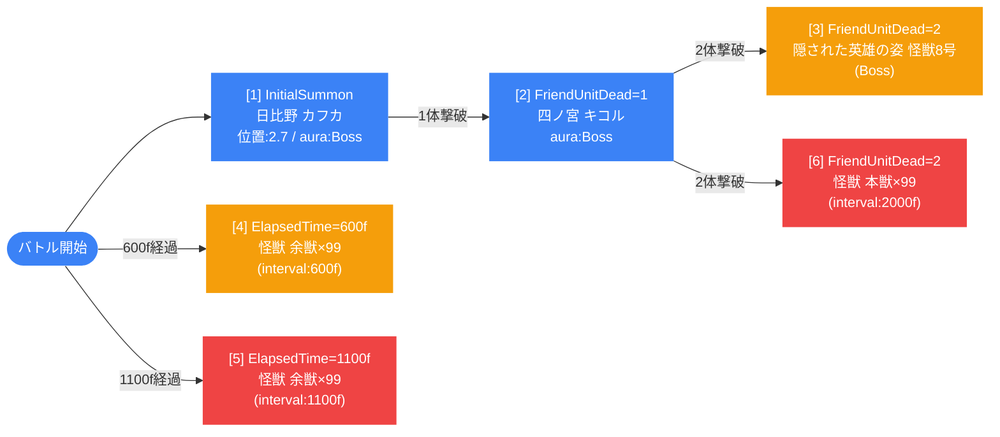

# normal_kai_00006 インゲーム詳細解説

## 1. 概要

`normal_kai_00006` は、怪獣8号シリーズのノーマルステージ第6弾として設計されたインゲームバトル設定である。黄属性と無属性の敵が混在するステージ構成となっており、緑属性キャラクターを編成することで黄属性の敵に対して属性有利を取れる設計になっている。敵拠点のHPは70,000と高めに設定されており、中盤以降のステージとしてふさわしい耐久値を持つ。

バトルの構造はシングルグループ（グループ切り替えなし）で完結しており、初期召喚・撃破トリガー・時間経過トリガーの3種類の条件で計6つの召喚イベントが制御される。序盤は日比野カフカ（`c_kai_00001`）が初期配置され、1体撃破後に四ノ宮キコル（`c_kai_00301`）、2体撃破後に隠された英雄の姿 怪獣8号（`c_kai_00002`、Boss）と怪獣 本獣（`e_kai_00001`）が同時に登場する。さらに時間経過で怪獣 余獣（`e_kai_00101`、無属性）が大量に繰り返し召喚される2系統のウェーブが走り、波状攻撃によるプレッシャーが持続する。

ギミック面ではスタン攻撃と味方攻撃DOWNを行う敵が登場し、特性でスタン攻撃無効化を持つキャラクターの編成が推奨されている。全敵のHP倍率・ATK倍率・速度倍率はいずれも1.0であり、基本パラメータそのままの標準的な強さで戦う構成となっている。ただし、四ノ宮キコルの移動速度55は非常に高速であり、隠された英雄の姿 怪獣8号のHP700,000・攻撃力1,700は高い脅威度を持つ。

BGMには `SSE_SBG_003_001`、ループ背景には `glo_00010` アセットが使用されている。コマページは3行構成（レイアウト3.0/5.0/12.0）で設計されており、各コマには `glo_00010` アセットが統一的に使用されている。

---

## 2. 関連テーブル設定

### MstInGame

| カラム | 値 |
|---|---|
| ENABLE | e |
| id | normal_kai_00006 |
| mst_auto_player_sequence_set_id | normal_kai_00006 |
| bgm_asset_key | SSE_SBG_003_001 |
| boss_bgm_asset_key | （なし） |
| loop_background_asset_key | glo_00010 |
| mst_page_id | normal_kai_00006 |
| mst_enemy_outpost_id | normal_kai_00006 |
| boss_mst_enemy_stage_parameter_id | 1 |
| normal_enemy_hp_coef | 1.0 |
| normal_enemy_attack_coef | 1.0 |
| normal_enemy_speed_coef | 1 |
| boss_enemy_hp_coef | 1.0 |
| boss_enemy_attack_coef | 1.0 |
| boss_enemy_speed_coef | 1 |
| release_key | 202509010 |

### MstEnemyOutpost

| カラム | 値 |
|---|---|
| ENABLE | e |
| id | normal_kai_00006 |
| hp | 70,000 |
| is_damage_invalidation | （なし） |
| outpost_asset_key | （なし） |
| artwork_asset_key | kai_0001 |
| release_key | 202509010 |

### MstPage + MstKomaLine

| row | height | layout | koma1_asset_key | koma1_width | koma1_bg_offset | koma2_asset_key | koma2_width | koma2_bg_offset | koma3_asset_key | koma3_width | koma3_bg_offset | koma4_asset_key | koma4_width | koma4_bg_offset |
|---|---|---|---|---|---|---|---|---|---|---|---|---|---|---|
| 1 | 0.55 | 3.0 | glo_00010 | 0.4 | -1.0 | glo_00010 | 0.6 | — | — | — | — | — | — | — |
| 2 | 0.55 | 5.0 | glo_00010 | 0.25 | 0.6 | glo_00010 | 0.75 | — | — | — | — | — | — | — |
| 3 | 0.55 | 12.0 | glo_00010 | 0.25 | -0.2 | glo_00010 | 0.25 | — | glo_00010 | 0.25 | — | glo_00010 | 0.25 | — |

全コマで `koma_effect = None`（エフェクトなし）、アセットキーは `glo_00010` 統一。

### MstInGameI18n（language = ja）

| カラム | 値 |
|---|---|
| id | normal_kai_00006_ja |
| language | ja |
| result_tips | （なし） |
| description | 【属性情報】黄属性の敵が登場するので緑属性のキャラは有利に戦うこともできるぞ! さらに、無属性の敵も登場するぞ! 【ギミック情報】スタン攻撃や味方の攻撃DOWNをしてくる敵が登場するぞ! 特性でスタン攻撃無効化を持っているキャラを編成しよう! |

---

## 3. 使用する敵パラメータ一覧

### カラム解説

| カラム | 説明 |
|---|---|
| id | ステージパラメータID |
| mst_enemy_character_id | 敵キャラクターマスタID |
| character_unit_kind | ユニット種別（Boss / Normal） |
| role_type | 役割（Attack / Defense / Technical / Support） |
| color | 属性色 |
| sort_order | 表示順（召喚順の目安） |
| hp | HP |
| damage_knock_back_count | ノックバック発生に必要なダメージ回数 |
| move_speed | 移動速度 |
| well_distance | 攻撃射程 |
| attack_power | 攻撃力 |
| attack_combo_cycle | 攻撃コンボサイクル |
| mst_unit_ability_id1 | アビリティID |
| drop_battle_point | 撃破時ドロップバトルポイント |
| mstTransformationEnemyStageParameterId | 変身後パラメータID |
| transformationConditionType | 変身条件種別 |
| transformationConditionValue | 変身条件値 |

### 全パラメータ表

| id | キャラ名 | unit_kind | role | color | sort | hp | knock_back | speed | distance | atk | combo | drop_bp | 変身先 | 変身条件 |
|---|---|---|---|---|---|---|---|---|---|---|---|---|---|---|
| e_kai_00001_general_Normal_Yellow | 怪獣 本獣 | Normal | Attack | Yellow | 1505 | 135,000 | 3 | 40 | 0.11 | 700 | 1 | 10 | — | — |
| e_kai_00101_general_Normal_Colorless | 怪獣 余獣 | Normal | Defense | Colorless | 1507 | 25,000 | 1 | 45 | 0.11 | 350 | 1 | 10 | — | — |
| c_kai_00001_general_Normal_Yellow | 日比野 カフカ | Normal | Technical | Yellow | 1511 | 150,000 | 2 | 35 | 0.11 | 700 | 5 | 10 | — | — |
| c_kai_00002_general_Boss_Yellow | 隠された英雄の姿 怪獣8号 | Boss | Support | Yellow | 1512 | 700,000 | 1 | 45 | 0.20 | 1,700 | 5 | 10 | — | — |
| c_kai_00301_general_Normal_Yellow | 四ノ宮 キコル | Normal | Attack | Yellow | 1513 | 300,000 | 2 | 55 | 0.11 | 800 | 8 | 10 | — | — |

### 特性解説

- **怪獣 本獣**（`e_kai_00001`）: HP135,000の黄属性Attackユニット。ノックバック3回耐性で速度40と高速。攻撃力700で短射程（0.11）の近接型。FriendUnitDead=2条件で登場し、override_drop_bpは100。
- **怪獣 余獣**（`e_kai_00101`）: HP25,000の無属性Defenseユニット。速度45と非常に高速で、ノックバック1回耐性。攻撃力350と控えめだが、99体×2系統の大量召喚で波状攻撃を行うザコ敵。override_drop_bpは50。
- **日比野 カフカ**（`c_kai_00001`）: HP150,000の黄属性Technicalユニット。速度35で中速、コンボサイクル5。初期召喚で拠点前（position=2.7）に配置される。override_drop_bpは100。
- **隠された英雄の姿 怪獣8号**（`c_kai_00002`）: HP700,000の黄属性Boss/Supportユニット。全敵中最高HPと最高攻撃力1,700を誇る。射程0.20で速度45と高速。ノックバック1回耐性。FriendUnitDead=2で登場し、override_drop_bpは400。
- **四ノ宮 キコル**（`c_kai_00301`）: HP300,000の黄属性Attackユニット。速度55は全敵中最速で、ノックバック2回耐性。攻撃力800・コンボサイクル8と高い攻撃性能。FriendUnitDead=1で登場し、override_drop_bpは100。

---

## 4. グループ構造の全体フロー

グループ切り替え（SwitchSequenceGroup）は存在しないため、すべての行はデフォルトグループ（sequence_group_id = 空）で処理される。

---

## 5. 全行の詳細データ（デフォルトグループ）

### sequence_element_id: 1

| カラム | 値 |
|---|---|
| id | normal_kai_00006_1 |
| sequence_group_id | （デフォルト） |
| condition_type | InitialSummon |
| condition_value | 2 |
| action_type | SummonEnemy |
| action_value | c_kai_00001_general_Normal_Yellow |
| summon_count | 1 |
| summon_interval | 0 |
| summon_animation_type | None |
| summon_position | 2.7 |
| move_start_condition_type | ElapsedTime |
| move_start_condition_value | 300 |
| move_stop_condition_type | None |
| move_restart_condition_type | None |
| is_summon_unit_outpost_damage_invalidation | （なし） |
| last_boss_trigger | （なし） |
| aura_type | Boss |
| death_type | Normal |
| enemy_hp_coef | 1 |
| enemy_attack_coef | 1 |
| enemy_speed_coef | 1 |
| override_drop_battle_point | 100 |
| defeated_score | 0 |
| action_delay | （なし） |
| deactivation_condition_type | None |

**解説**: バトル開始時に初期召喚される日比野カフカ（Normal/Technical/黄属性）。拠点前（position=2.7）に配置され、ElapsedTime=300フレーム（3秒）後に移動を開始する。aura_type=Bossが設定されておりオーラ演出を伴って登場する。HP・ATK・速度の補正はすべて1倍で基本値そのまま。

---

### sequence_element_id: 2

| カラム | 値 |
|---|---|
| id | normal_kai_00006_2 |
| sequence_group_id | （デフォルト） |
| condition_type | FriendUnitDead |
| condition_value | 1 |
| action_type | SummonEnemy |
| action_value | c_kai_00301_general_Normal_Yellow |
| summon_count | 1 |
| summon_interval | 0 |
| summon_animation_type | None |
| summon_position | （なし） |
| move_start_condition_type | None |
| move_stop_condition_type | None |
| move_restart_condition_type | None |
| aura_type | Boss |
| death_type | Normal |
| enemy_hp_coef | 1 |
| enemy_attack_coef | 1 |
| enemy_speed_coef | 1 |
| override_drop_battle_point | 100 |
| defeated_score | 0 |
| action_delay | （なし） |
| deactivation_condition_type | None |

**解説**: 味方ユニット1体撃破後（FriendUnitDead=1）に登場する四ノ宮キコル（Normal/Attack/黄属性）。aura_type=Bossでオーラ演出あり。速度55と全敵中最速で、HP300,000・攻撃力800の強力なアタッカー。コンボサイクル8による連続攻撃が脅威。

---

### sequence_element_id: 3

| カラム | 値 |
|---|---|
| id | normal_kai_00006_3 |
| sequence_group_id | （デフォルト） |
| condition_type | FriendUnitDead |
| condition_value | 2 |
| action_type | SummonEnemy |
| action_value | c_kai_00002_general_Boss_Yellow |
| summon_count | 1 |
| summon_interval | 0 |
| summon_animation_type | None |
| summon_position | （なし） |
| move_start_condition_type | None |
| move_stop_condition_type | None |
| move_restart_condition_type | None |
| aura_type | Default |
| death_type | Normal |
| enemy_hp_coef | 1 |
| enemy_attack_coef | 1 |
| enemy_speed_coef | 1 |
| override_drop_battle_point | 400 |
| defeated_score | 0 |
| action_delay | （なし） |
| deactivation_condition_type | None |

**解説**: 味方ユニット2体撃破後（FriendUnitDead=2）に登場する隠された英雄の姿 怪獣8号（Boss/Support/黄属性）。HP700,000・攻撃力1,700と全敵中最高スペックのメインボス。射程0.20・速度45で中〜長距離から高火力の攻撃を繰り出す。override_drop_bp=400と高報酬。

---

### sequence_element_id: 4

| カラム | 値 |
|---|---|
| id | normal_kai_00006_4 |
| sequence_group_id | （デフォルト） |
| condition_type | ElapsedTime |
| condition_value | 600 |
| action_type | SummonEnemy |
| action_value | e_kai_00101_general_Normal_Colorless |
| summon_count | 99 |
| summon_interval | 600 |
| summon_animation_type | None |
| summon_position | （なし） |
| move_start_condition_type | None |
| move_stop_condition_type | None |
| move_restart_condition_type | None |
| aura_type | Default |
| death_type | Normal |
| enemy_hp_coef | 1 |
| enemy_attack_coef | 1 |
| enemy_speed_coef | 1 |
| override_drop_battle_point | 50 |
| defeated_score | 0 |
| action_delay | （なし） |
| deactivation_condition_type | None |

**解説**: 600フレーム（6秒）経過後に開始される怪獣 余獣（Normal/Defense/無属性）の第1ウェーブ。99体を600フレーム間隔（6秒周期）で継続召喚する。HP25,000・速度45と高速で、属性相性がない無属性のためどのキャラでも等倍ダメージとなる。override_drop_bp=50。

---

### sequence_element_id: 5

| カラム | 値 |
|---|---|
| id | normal_kai_00006_5 |
| sequence_group_id | （デフォルト） |
| condition_type | ElapsedTime |
| condition_value | 1100 |
| action_type | SummonEnemy |
| action_value | e_kai_00101_general_Normal_Colorless |
| summon_count | 99 |
| summon_interval | 1100 |
| summon_animation_type | None |
| summon_position | （なし） |
| move_start_condition_type | None |
| move_stop_condition_type | None |
| move_restart_condition_type | None |
| aura_type | Default |
| death_type | Normal |
| enemy_hp_coef | 1 |
| enemy_attack_coef | 1 |
| enemy_speed_coef | 1 |
| override_drop_battle_point | 50 |
| defeated_score | 0 |
| action_delay | （なし） |
| deactivation_condition_type | None |

**解説**: 1100フレーム（11秒）経過後に開始される怪獣 余獣の第2ウェーブ。99体を1100フレーム間隔（11秒周期）で継続召喚する。第1ウェーブとは異なるタイミングで召喚されるため、2系統のウェーブが交互に余獣を送り込む形となり、時間が経つほど画面上の余獣数が増加する。

---

### sequence_element_id: 6

| カラム | 値 |
|---|---|
| id | normal_kai_00006_6 |
| sequence_group_id | （デフォルト） |
| condition_type | FriendUnitDead |
| condition_value | 2 |
| action_type | SummonEnemy |
| action_value | e_kai_00001_general_Normal_Yellow |
| summon_count | 99 |
| summon_interval | 2000 |
| summon_animation_type | None |
| summon_position | （なし） |
| move_start_condition_type | None |
| move_stop_condition_type | None |
| move_restart_condition_type | None |
| aura_type | Default |
| death_type | Normal |
| enemy_hp_coef | 1 |
| enemy_attack_coef | 1 |
| enemy_speed_coef | 1 |
| override_drop_battle_point | 100 |
| defeated_score | 0 |
| action_delay | （なし） |
| deactivation_condition_type | None |

**解説**: 味方ユニット2体撃破後（FriendUnitDead=2）に開始される怪獣 本獣（Normal/Attack/黄属性）の継続召喚。99体を2000フレーム間隔（20秒周期）で送り込む。HP135,000・攻撃力700・速度40・ノックバック3回耐性と、余獣より遥かに強力な個体が定期的に追加される。override_drop_bp=100。

---

## 6. グループ切り替えまとめ表

グループ切り替え（SwitchSequenceGroup）は定義されていない。全ての行がデフォルトグループ（sequence_group_id = 空文字）内で処理される。

| グループID | 役割 | 行数 |
|---|---|---|
| （デフォルト） | 全シーケンス処理 | 6行 |

---

## 7. スコア体系

本ステージでは全行の `defeated_score = 0` に設定されており、撃破によるスコア加点は行われない。バトルポイントは `override_drop_battle_point` で上書きされた値に基づいて取得する形式。

| キャラクター | drop_battle_point（基本） | override_drop_battle_point |
|---|---|---|
| 日比野 カフカ | 10 | 100 |
| 四ノ宮 キコル | 10 | 100 |
| 隠された英雄の姿 怪獣8号 | 10 | 400 |
| 怪獣 余獣（第1ウェーブ） | 10 | 50 |
| 怪獣 余獣（第2ウェーブ） | 10 | 50 |
| 怪獣 本獣 | 10 | 100 |

最大獲得バトルポイント試算（全体召喚数ベース）:
- 日比野 カフカ×1: 100 BP
- 四ノ宮 キコル×1: 100 BP
- 隠された英雄の姿 怪獣8号×1: 400 BP
- 怪獣 余獣×99（第1ウェーブ）: 4,950 BP
- 怪獣 余獣×99（第2ウェーブ）: 4,950 BP
- 怪獣 本獣×99: 9,900 BP
- **合計（参考値）**: 約20,400 BP（実際のバトル時間内に全数出現することはない）

---

## 8. この設定から読み取れる設計パターン

1. **撃破トリガーによる段階的エスカレーション**: 初期召喚のカフカ→1体撃破でキコル→2体撃破で怪獣8号（Boss）+本獣の継続召喚という3段階構成。プレイヤーの戦闘進行度に応じて敵の脅威度が段階的に上昇し、ボス登場時には雑魚の継続召喚も同時に始まるため圧力が一気に増大する。

2. **2系統ウェーブによる持続的圧力設計**: 怪獣 余獣が600f間隔と1100f間隔の2系統で並行召喚される。周期が異なるため同時出現と時間差出現が交互に発生し、プレイヤーが対処リズムを掴みにくい不規則な波状攻撃パターンを生み出している。

3. **黄属性+無属性の混合による属性戦略の複雑化**: メインの名前付き敵（カフカ・キコル・怪獣8号・本獣）は黄属性だが、大量召喚される余獣は無属性（Colorless）。緑属性キャラを編成すれば黄属性の敵には有利だが、無属性の余獣には等倍となるため、単純な属性一色編成では最適解にならない設計。

4. **Bossオーラ演出によるミスリード**: 初期召喚のカフカと1体撃破で登場するキコルにはaura_type=Bossが設定されているが、実際のunit_kindはNormalである。オーラ演出で強敵感を演出しつつ、真のBossは2体撃破後に登場する怪獣8号（unit_kind=Boss）という多段構成になっている。

5. **高速ユニットによる防衛線突破リスク**: 四ノ宮キコル（速度55）と怪獣 余獣（速度45）は非常に高速〜高速の部類に入り、プレイヤーの防衛ラインを素早く突破する。特にキコルはHP300,000・ノックバック2回耐性を持ち、高速かつ硬いため前線が崩壊しやすい。

6. **ギミック対策を要求する教育的設計**: ステージ説明文でスタン攻撃と攻撃DOWN対策を明示しており、特性によるスタン無効化キャラクターの編成を促している。これはプレイヤーにキャラクター特性の理解と編成の工夫を学ばせる教育的な意図を持つ設計である。
