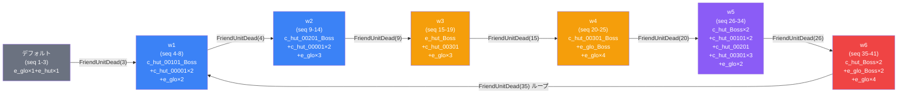

# raid_hut1_00001 インゲームデータ詳細解説

> 参照リポジトリ: `projects/glow-masterdata`
> リリースキー: `202603010`
> 本ファイルはMstAutoPlayerSequenceが41行のレイドバトル（スコアアタック型）の全データ設定を解説する

---

## 概要

**hut1シリーズのレイドバトル**（スコアアタック型）。砦ダメージが無効化されており、プレイヤーは制限時間内にできるだけ多くの敵を倒してバトルポイントを稼ぐことが目的のコンテンツ。

砦のHP は 1,000,000 に設定されているが `is_damage_invalidation = 1` により実質無限HPとして機能し、砦破壊によるゲーム終了はない。BGMには `SSE_SBG_003_008` を使用し、ボス専用BGMは設定されていない。グループ構造はデフォルト + w1〜w6 の 7 グループ構成で、w6 から w1 へのループバックにより無限に敵が出現し続ける設計となっている。フィールドは 4 段コマ構成で、後半の段に毒・ダメージ・火傷という 3 種の特殊コマ効果が配置されており、プレイヤーはコマ踏みによる継続ダメージ環境でのスコア稼ぎを強いられる。登場する敵は合計 13 種類と高複雑度であり、序盤から終盤にかけて Colorless と Yellow 属性が混在して出現する。また `enemy_ability_knockback_block` アビリティを持つボス敵が複数グループに登場するため、ノックバック戦略が通用しない局面への対応が求められる。グループ切り替えは全て `FriendUnitDead` トリガーで制御されており、倒した敵の累計数がフェーズ進行の鍵となる。

---

## 関連テーブル設定

### MstInGame

| カラム | 値 |
|--------|-----|
| `id` | `raid_hut1_00001` |
| `mst_auto_player_sequence_id` | `raid_hut1_00001` |
| `mst_auto_player_sequence_set_id` | `raid_hut1_00001` |
| `bgm_asset_key` | `SSE_SBG_003_008` |
| `boss_bgm_asset_key` | （なし） |
| `loop_background_asset_key` | （なし） |
| `mst_page_id` | `raid_hut1_00001` |
| `mst_enemy_outpost_id` | `raid_hut1_00001` |
| `boss_mst_enemy_stage_parameter_id` | （なし） |
| `normal_enemy_hp_coef` | `1.0` |
| `normal_enemy_attack_coef` | `1.0` |
| `normal_enemy_speed_coef` | `1.0` |
| `boss_enemy_hp_coef` | `1.0` |
| `boss_enemy_attack_coef` | `1.0` |
| `boss_enemy_speed_coef` | `1.0` |
| `release_key` | `202603010` |

### MstEnemyOutpost（敵砦）

| カラム | 値 | 意味 |
|--------|-----|------|
| `id` | `raid_hut1_00001` | |
| `hp` | `1,000,000` | 実質破壊不可能なHP |
| `is_damage_invalidation` | `1` | **ダメージ完全無効（スコアアタック型の証）** |
| `artwork_asset_key` | `event_hut_0002` | hut1シリーズ背景アートワーク |

### MstPage + MstKomaLine（コマフィールド）

4段構成。後半段に複数の特殊コマ効果（SlipDamage・Burn・Poison）が配置されている。

| row | height | コマ数 | コマ詳細（エフェクトなし） | コマ詳細（エフェクトあり） |
|-----|--------|--------|--------------------------|--------------------------|
| 1 | 5.0 | 2 | glo_00039 (25%) + glo_00039 (75%) | なし |
| 2 | 9.0 | 3 | glo_00039 (25%) + glo_00039 (50%) | koma3: SlipDamage 200 (25%) |
| 3 | 6.0 | 2 | glo_00039 (50%) | koma2: SlipDamage 200 (50%) |
| 4 | 10.0 | 3 | なし | koma1: SlipDamage 200 (25%) / koma2: Burn 1500/2000 (25%) / koma3: Poison 1500/15 (50%) |

#### コマエフェクト詳細

| row | koma | effect_type | parameter1 | parameter2 | target_side | 幅 |
|-----|------|-------------|------------|------------|-------------|-----|
| 2 | 3 | SlipDamage | 200 | — | Player | 25% |
| 3 | 2 | SlipDamage | 200 | — | Player | 50% |
| 4 | 1 | SlipDamage | 200 | — | Player | 25% |
| 4 | 2 | Burn | 1500 | 2000 | Player | 25% |
| 4 | 3 | Poison | 1500 | 15 | Player | 50% |

> **コマ構成の補足**: 全 5 箇所の特殊コマは全てプレイヤーサイドへの被ダメージ効果。SlipDamage は即時ダメージ（parameter1=200）、Burn は燃焼ダメージ（param1=1500, param2=2000 で持続）、Poison は毒ダメージ（param1=1500, param2=15 でスタック）。4段目はコマ3のうち全てに特殊効果が配置されており、最前線のフィールドで継続ダメージを受ける高難度環境。

### MstInGameI18n（バトル説明文）

**result_tips（バトルヒント）:**
> （なし）

**description（ステージ説明）:**
> このステージは、4段で構成されているぞ!
>
> 【コマ効果情報】
> 毒コマ、ダメージコマ、火傷コマが登場するぞ!
> 特性でダメージコマ無効化を持っているキャラを編成しよう!
>
> 【ギミック情報】
> ノックバック攻撃をしてくる敵や
> 敵全体の攻撃UPをしてくる敵や
> スタン攻撃をしてくる敵が登場するぞ!
> ノックバック無効化の特性を持つ敵が登場するぞ!
>
> 敵を多く倒して、スコアを稼ごう!

---

## 使用する敵パラメータ（MstEnemyStageParameter）一覧

合計 13 種類の敵パラメータを使用。`e_glo_` / `e_hut_` プレフィックスは汎用敵・hut系敵、`c_hut_` プレフィックスはキャラ型敵。

### カラム解説

| カラム名（略称） | DBカラム名 | 説明 |
|---------------|-----------|------|
| id | id | MstEnemyStageParameterの主キー |
| キャラID | mst_enemy_character_id | 紐付くキャラモデル・スキルの参照元 |
| kind | character_unit_kind | `Normal`（通常敵）/ `Boss`（ボス）。UIオーラ表示に影響 |
| role | role_type | 属性相性の役職（Attack/Technical/Defense/Support） |
| color | color | 属性色（Yellow/Colorless） |
| hp | hp | ベースHP（MstInGameのcoef乗算前の素値） |
| atk | attack_power | ベース攻撃力 |
| spd | move_speed | 移動速度（数値が大きいほど速い） |
| knockback | damage_knock_back_count | 被攻撃時ノックバック回数（0=ノックバックなし） |
| ability | mst_unit_ability_id1 | 特殊アビリティID |
| drop_bp | drop_battle_point | 基本ドロップバトルポイント |

### Normalユニット（7種）

| MstEnemyStageParameter ID | キャラID | role | color | hp | atk | spd | knockback | ability | drop_bp |
|--------------------------|---------|------|-------|-----|-----|-----|-----------|---------|---------|
| `e_glo_00001_hut1_advent_Normal_Colorless` | enemy_glo_00001 | Defense | Colorless | 1,000 | 100 | 40 | 1 | — | 50 |
| `e_hut_00001_hut1_advent_Normal_Yellow` | enemy_hut_00001 | Attack | Yellow | 1,000 | 100 | 35 | 1 | — | 50 |
| `c_hut_00001_hut1_advent_Normal_Colorless` | chara_hut_00001 | Defense | Colorless | 1,000 | 100 | 30 | 0 | — | 50 |
| `c_hut_00101_hut1_advent_Normal_Colorless` | chara_hut_00101 | Support | Colorless | 1,000 | 100 | 35 | 1 | — | 50 |
| `c_hut_00201_hut1_advent_Normal_Colorless` | chara_hut_00201 | Technical | Colorless | 1,000 | 100 | 35 | 3 | — | 50 |
| `c_hut_00301_hut1_advent_Normal_Yellow` | chara_hut_00301 | Attack | Yellow | 1,000 | 100 | 35 | 1 | — | 50 |
| `e_glo_00001_hut1_advent_Boss_Yellow` | enemy_glo_00001 | Attack | Yellow | 10,000 | 100 | 37 | 1 | — | 100 |

> ※ `e_glo_00001_hut1_advent_Boss_Yellow` はkind=Bossだが便宜上参照する。後述のBoss表にも掲載。

### Bossユニット（6種）

| MstEnemyStageParameter ID | キャラID | role | color | hp | atk | spd | knockback | ability | drop_bp |
|--------------------------|---------|------|-------|-----|-----|-----|-----------|---------|---------|
| `c_hut_00101_hut1_advent_Boss_Yellow` | chara_hut_00101 | Attack | Yellow | 10,000 | 100 | 35 | 1 | — | 100 |
| `c_hut_00201_hut1_advent_Boss_Colorless` | chara_hut_00201 | Technical | Colorless | 10,000 | 100 | 35 | 1 | — | 100 |
| `e_hut_00001_hut1_advent_Boss_Yellow` | enemy_hut_00001 | Attack | Yellow | 10,000 | 100 | 35 | 1 | — | 100 |
| `c_hut_00301_hut1_advent_Boss_Yellow` | chara_hut_00301 | Attack | Yellow | 10,000 | 100 | 35 | 1 | — | 100 |
| `e_glo_00001_hut1_advent_Boss_Colorless` | enemy_glo_00001 | Defense | Colorless | 10,000 | 100 | 40 | 1 | **enemy_ability_knockback_block** | 100 |
| `c_hut_00001_hut1_advent_Boss_Colorless` | chara_hut_00001 | Defense | Colorless | 10,000 | 100 | 30 | 0 | **enemy_ability_knockback_block** | 100 |
| `e_glo_00001_hut1_advent_Boss_Yellow` | enemy_glo_00001 | Attack | Yellow | 10,000 | 100 | 37 | 1 | — | 100 |

### 特性解説：enemy_ability_knockback_block

`enemy_ability_knockback_block` アビリティは、ノックバック攻撃を完全に無効化する特性。このアビリティを持つ敵（`e_glo_00001_hut1_advent_Boss_Colorless` と `c_hut_00001_hut1_advent_Boss_Colorless`）は、通常のノックバック戦略が通用しない。w4 グループの `e_glo_00001_hut1_advent_Boss_Colorless` や w5〜w6 の `c_hut_00001_hut1_advent_Boss_Colorless` などで登場し、ノックバック無効ボスへの対処戦略が求められる。ゲーム内の説明文でも「ノックバック無効化の特性を持つ敵が登場するぞ!」と明示されている。

---

## グループ構造の全体フロー（Mermaid）

> **Mermaid スタイルカラー規則**:
> - デフォルトグループ: `#6b7280`（グレー）
> - w1〜w2: `#3b82f6`（青）
> - w3〜w4: `#f59e0b`（橙）
> - w5: `#8b5cf6`（紫）← ループ起点直前のグループ
> - w6: `#ef4444`（赤）← ループバック元グループ（w6 → w1）

---

## 全シーケンス詳細データ（グループ単位）

### デフォルトグループ（seq 1-3, groupchange_1）

バトル開始直後に初期配置を行い、3体撃破を契機にw1へ移行する導入グループ。

| seq_element_id | action_type | action_value | condition_type | condition_value | 説明 |
|----------------|-------------|--------------|----------------|-----------------|------|
| 1 | SummonEnemy | e_glo_00001_hut1_advent_Normal_Colorless | ElapsedTime | 100 | 経過時間100でColorless防衛型を召喚 |
| 2 | SummonEnemy | e_glo_00001_hut1_advent_Normal_Colorless | InitialSummon | 0 | 初期召喚としてColorless防衛型を配置 |
| 3 | SummonEnemy | e_hut_00001_hut1_advent_Normal_Yellow | InitialSummon | 0 | 初期召喚としてYellow攻撃型を配置 |
| groupchange_1 | SwitchSequenceGroup | w1 | FriendUnitDead | 3 | 3体倒してw1へ遷移 |

**ポイント:**
- `InitialSummon` を使った初期配置（seq 2・3）が2体あり、バトル開始直後から戦闘状態
- seq 1 は `ElapsedTime(100)` で追加Colorless敵を召喚（遅延出現）
- 3体撃破という少ない条件でw1に移行し、本格的なグループ構造へ入る導入設計

---

### w1グループ（seq 4-8, groupchange_2）

c_hut_00101のBossと c_hut_00001 の Normal 2体、e_glo_00001 の Normal 2体が登場するグループ。

| seq_element_id | action_type | action_value | condition_type | condition_value | 説明 |
|----------------|-------------|--------------|----------------|-----------------|------|
| 4 | SummonEnemy | c_hut_00101_hut1_advent_Boss_Yellow | ElapsedTimeSinceSequenceGroupActivated | 150 | グループ起動後150でYellowボスを召喚 |
| 5 | SummonEnemy | c_hut_00001_hut1_advent_Normal_Colorless | ElapsedTimeSinceSequenceGroupActivated | 0 | グループ起動直後にColorless防衛型を召喚 |
| 6 | SummonEnemy | c_hut_00001_hut1_advent_Normal_Colorless | FriendUnitDead | 5 | 5体目撃破後に追加Colorless防衛型を召喚 |
| 7 | SummonEnemy | e_glo_00001_hut1_advent_Normal_Yellow | ElapsedTimeSinceSequenceGroupActivated | 500 | グループ起動後500でYellow汎用型を召喚 |
| 8 | SummonEnemy | e_glo_00001_hut1_advent_Normal_Yellow | ElapsedTimeSinceSequenceGroupActivated | 950 | グループ起動後950でYellow汎用型を追加召喚 |
| groupchange_2 | SwitchSequenceGroup | w2 | FriendUnitDead | 4 | w1内4体目倒してw2へ遷移 |

**ポイント:**
- グループ起動直後にColorless防衛型が出現し、Bossが150後に登場する順序設計
- `FriendUnitDead(5)` で追加敵が出現（撃破連鎖トリガー）
- Yellow汎用型が時間差（500/950）で2体出現し、継続的な押し込みを演出

---

### w2グループ（seq 9-14, groupchange_3）

c_hut_00201 のBoss（Technical/Colorless）と c_hut_00001 の Normal 2体、e_glo_00001 の Normal 3体が登場するグループ。

| seq_element_id | action_type | action_value | condition_type | condition_value | 説明 |
|----------------|-------------|--------------|----------------|-----------------|------|
| 9 | SummonEnemy | c_hut_00201_hut1_advent_Boss_Colorless | ElapsedTimeSinceSequenceGroupActivated | 300 | グループ起動後300でColorlessボスを召喚 |
| 10 | SummonEnemy | c_hut_00001_hut1_advent_Normal_Colorless | ElapsedTimeSinceSequenceGroupActivated | 0 | グループ起動直後にColorless防衛型を召喚 |
| 11 | SummonEnemy | c_hut_00001_hut1_advent_Normal_Colorless | FriendUnitDead | 10 | 10体目撃破後に追加Colorless防衛型を召喚 |
| 12 | SummonEnemy | e_glo_00001_hut1_advent_Normal_Yellow | ElapsedTimeSinceSequenceGroupActivated | 50 | グループ起動後50でYellow汎用型を召喚 |
| 13 | SummonEnemy | e_glo_00001_hut1_advent_Normal_Yellow | FriendUnitDead | 12 | 12体目撃破後にYellow汎用型を追加召喚 |
| 14 | SummonEnemy | e_glo_00001_hut1_advent_Normal_Yellow | ElapsedTimeSinceSequenceGroupActivated | 500 | グループ起動後500でYellow汎用型をさらに召喚 |
| groupchange_3 | SwitchSequenceGroup | w3 | FriendUnitDead | 9 | w2内9体目倒してw3へ遷移 |

**ポイント:**
- w2はknockback=3の chara_hut_00201（Technical）がボスとして登場（高ノックバック回数敵）
- seq 13 は `FriendUnitDead(12)` で連鎖召喚するパターン（Yellow汎用型の波状攻撃）
- 9体撃破でw3へ移行と比較的多い撃破要求

---

### w3グループ（seq 15-19, groupchange_4）

e_hut_00001 のBoss（Attack/Yellow）と c_hut_00301 の Normal、e_glo_00001 の Normal 3体が登場するグループ。

| seq_element_id | action_type | action_value | condition_type | condition_value | 説明 |
|----------------|-------------|--------------|----------------|-----------------|------|
| 15 | SummonEnemy | e_hut_00001_hut1_advent_Boss_Yellow | ElapsedTimeSinceSequenceGroupActivated | 0 | グループ起動直後にYellow攻撃型ボスを召喚 |
| 16 | SummonEnemy | c_hut_00301_hut1_advent_Normal_Yellow | ElapsedTimeSinceSequenceGroupActivated | 250 | グループ起動後250でYellow攻撃型Normalを召喚 |
| 17 | SummonEnemy | e_glo_00001_hut1_advent_Normal_Colorless | ElapsedTimeSinceSequenceGroupActivated | 0 | グループ起動直後にColorless防衛型を召喚 |
| 18 | SummonEnemy | e_glo_00001_hut1_advent_Normal_Colorless | FriendUnitDead | 17 | 17体目撃破後にColorless防衛型を追加召喚 |
| 19 | SummonEnemy | e_glo_00001_hut1_advent_Normal_Colorless | ElapsedTimeSinceSequenceGroupActivated | 500 | グループ起動後500でColorless防衛型をさらに召喚 |
| groupchange_4 | SwitchSequenceGroup | w4 | FriendUnitDead | 15 | w3内15体目倒してw4へ遷移 |

**ポイント:**
- グループ起動直後にBossとColorless防衛型が同時登場（0タイミング二重召喚）
- 15体撃破要求はw6→w1ループ後の最大要求値であり、w3が単独では最長グループ
- `FriendUnitDead(17)` という撃破数条件が15体移行条件を超えているため、seq18は実際にはw3内での発動はなく、グループが切り替わった後に持ち越しになる可能性がある点に注意

---

### w4グループ（seq 20-25, groupchange_5）

c_hut_00301 のBoss（Attack/Yellow）と e_glo_00001_Boss_Colorless（ノックバック無効）、e_glo_00001 Normal の Yellow 4体が登場するグループ。

| seq_element_id | action_type | action_value | condition_type | condition_value | 説明 |
|----------------|-------------|--------------|----------------|-----------------|------|
| 20 | SummonEnemy | c_hut_00301_hut1_advent_Boss_Yellow | ElapsedTimeSinceSequenceGroupActivated | 250 | グループ起動後250でYellow攻撃型ボスを召喚 |
| 21 | SummonEnemy | e_glo_00001_hut1_advent_Boss_Colorless | ElapsedTimeSinceSequenceGroupActivated | 0 | グループ起動直後にColorlessボス（ノックバック無効）を召喚 |
| 22 | SummonEnemy | e_glo_00001_hut1_advent_Normal_Yellow | FriendUnitDead | 21 | 21体目撃破後にYellow汎用型Normalを召喚 |
| 23 | SummonEnemy | e_glo_00001_hut1_advent_Normal_Yellow | ElapsedTimeSinceSequenceGroupActivated | 500 | グループ起動後500でYellow汎用型Normalを召喚 |
| 24 | SummonEnemy | e_glo_00001_hut1_advent_Normal_Yellow | FriendUnitDead | 23 | 23体目撃破後にYellow汎用型Normalを追加召喚 |
| 25 | SummonEnemy | e_glo_00001_hut1_advent_Normal_Yellow | EnterTargetKomaIndex | 7 | コマインデックス7到達時にYellow汎用型を召喚 |
| groupchange_5 | SwitchSequenceGroup | w5 | FriendUnitDead | 20 | w4内20体目倒してw5へ遷移 |

**ポイント:**
- `e_glo_00001_hut1_advent_Boss_Colorless` が起動直後に登場（`enemy_ability_knockback_block` 持ち）
- seq 25 は `EnterTargetKomaIndex(7)` というコマ到達トリガーを使用する珍しい条件（他グループにはない）
- FriendUnitDead での連鎖召喚（21体→22、23体→24）が組み込まれており波状的な出現を演出

---

### w5グループ（seq 26-34, groupchange_6）

c_hut_00001 の Boss（ノックバック無効）、c_hut_00101 の Normal 2体、c_hut_00201 の Normal、c_hut_00301 の Normal 3体、e_glo_00001 の Normal Yellow 2体が登場するグループ。

| seq_element_id | action_type | action_value | condition_type | condition_value | 説明 |
|----------------|-------------|--------------|----------------|-----------------|------|
| 26 | SummonEnemy | c_hut_00001_hut1_advent_Boss_Colorless | ElapsedTimeSinceSequenceGroupActivated | 0 | グループ起動直後にColorlessボス（ノックバック無効）を召喚 |
| 27 | SummonEnemy | c_hut_00101_hut1_advent_Normal_Colorless | ElapsedTimeSinceSequenceGroupActivated | 300 | グループ起動後300でColorless Support型を召喚 |
| 28 | SummonEnemy | c_hut_00101_hut1_advent_Normal_Colorless | FriendUnitDead | 27 | 27体目撃破後に追加Support型を召喚 |
| 29 | SummonEnemy | c_hut_00201_hut1_advent_Normal_Colorless | ElapsedTimeSinceSequenceGroupActivated | 350 | グループ起動後350でColorless Technical型を召喚 |
| 30 | SummonEnemy | c_hut_00301_hut1_advent_Normal_Yellow | ElapsedTimeSinceSequenceGroupActivated | 250 | グループ起動後250でYellow攻撃型を召喚 |
| 31 | SummonEnemy | c_hut_00301_hut1_advent_Normal_Yellow | FriendUnitDead | 30 | 30体目撃破後に追加Yellow攻撃型を召喚 |
| 32 | SummonEnemy | c_hut_00301_hut1_advent_Normal_Yellow | FriendUnitDead | 31 | 31体目撃破後にさらに追加Yellow攻撃型を召喚 |
| 33 | SummonEnemy | e_glo_00001_hut1_advent_Normal_Yellow | ElapsedTimeSinceSequenceGroupActivated | 500 | グループ起動後500でYellow汎用型を召喚 |
| 34 | SummonEnemy | e_glo_00001_hut1_advent_Normal_Yellow | FriendUnitDead | 27 | 27体目撃破後にYellow汎用型を追加召喚 |
| groupchange_6 | SwitchSequenceGroup | w6 | FriendUnitDead | 26 | w5内26体目倒してw6へ遷移 |

**ポイント:**
- w5はグループ内最多の9つのシーケンスを持つ最大規模グループ
- `c_hut_00001_hut1_advent_Boss_Colorless`（ノックバック無効/spd=30）が起動直後に登場
- seq 31→32 は `FriendUnitDead` による連鎖召喚パターン（30体→31、31体→32）
- 26体撃破でw6へ移行と、このステージ最大の単一グループ撃破要求

---

### w6グループ（seq 35-41, groupchange_7）

c_hut_00001 の Boss（ノックバック無効）、e_glo_00001 の Boss_Colorless（ノックバック無効）と Boss_Yellow、Normal_Yellow 4体が登場する最終グループ（ループバック元）。

| seq_element_id | action_type | action_value | condition_type | condition_value | 説明 |
|----------------|-------------|--------------|----------------|-----------------|------|
| 35 | SummonEnemy | c_hut_00001_hut1_advent_Boss_Colorless | ElapsedTimeSinceSequenceGroupActivated | 0 | グループ起動直後にColorlessボス（ノックバック無効）を召喚 |
| 36 | SummonEnemy | e_glo_00001_hut1_advent_Boss_Colorless | FriendUnitDead | 35 | 35体目撃破後にColorlessボス（ノックバック無効）を追加召喚 |
| 37 | SummonEnemy | e_glo_00001_hut1_advent_Boss_Yellow | ElapsedTimeSinceSequenceGroupActivated | 250 | グループ起動後250でYellow攻撃型ボスを召喚 |
| 38 | SummonEnemy | e_glo_00001_hut1_advent_Normal_Yellow | ElapsedTimeSinceSequenceGroupActivated | 500 | グループ起動後500でYellow汎用型Normalを召喚 |
| 39 | SummonEnemy | e_glo_00001_hut1_advent_Normal_Yellow | ElapsedTimeSinceSequenceGroupActivated | 1000 | グループ起動後1000でYellow汎用型Normalを召喚 |
| 40 | SummonEnemy | e_glo_00001_hut1_advent_Normal_Yellow | FriendUnitDead | 37 | 37体目撃破後にYellow汎用型Normalを召喚 |
| 41 | SummonEnemy | e_glo_00001_hut1_advent_Normal_Yellow | FriendUnitDead | 35 | 35体目撃破後にYellow汎用型Normalを召喚 |
| groupchange_7 | SwitchSequenceGroup | w1 | FriendUnitDead | 35 | w6内35体目倒してw1へループ遷移 |

**ポイント:**
- groupchange_7は `FriendUnitDead(35)` でw1へループバック（ループ構造の核）
- seq 36 と groupchange_7 が同じ `FriendUnitDead(35)` トリガーを持つ（同タイミングで召喚とループが発生）
- ノックバック無効ボスが2体（seq35の c_hut_00001_Boss + seq36の e_glo_00001_Boss_Colorless）登場する最高難度グループ
- seq 39 は `ElapsedTimeSinceSequenceGroupActivated(1000)` と本ステージ最長の時間条件

---

## グループ切り替えまとめ表

| 切り替え行 | 遷移先 | condition_type | condition_value | 意味 |
|-----------|--------|----------------|-----------------|------|
| groupchange_1 (Default→w1) | w1 | FriendUnitDead | 3 | 3体倒してw1へ |
| groupchange_2 (w1→w2) | w2 | FriendUnitDead | 4 | w1内4体目でw2へ |
| groupchange_3 (w2→w3) | w3 | FriendUnitDead | 9 | w2内9体目でw3へ |
| groupchange_4 (w3→w4) | w4 | FriendUnitDead | 15 | w3内15体目でw4へ |
| groupchange_5 (w4→w5) | w5 | FriendUnitDead | 20 | w4内20体目でw5へ |
| groupchange_6 (w5→w6) | w6 | FriendUnitDead | 26 | w5内26体目でw6へ |
| groupchange_7 (w6→w1) | w1 | FriendUnitDead | 35 | w6内35体目でw1へ（ループ） |

> **重要**: FriendUnitDeadの値は**各グループ内での累計撃破数**を示す。ループ2周目以降はw1移行時にカウンターがリセットされるかどうかはMstAutoPlayerSequenceSetの仕様に依存する。ループ構造により w6 完走後は再び w1 からの7グループが繰り返される。

---

## スコア体系

レイドバトルはスコアアタック型コンテンツ。敵を倒すことで `drop_battle_point` を獲得し、ゲーム終了時の累計ポイントがスコアとなる。

### 全敵のdrop_battle_point一覧

| ユニット種別 | 対象ID（代表例） | drop_battle_point |
|-------------|----------------|-------------------|
| Normal（全7種） | e_glo_00001_Normal_Colorless / e_hut_00001_Normal_Yellow / c_hut_各種_Normal | **50** |
| Boss（全6種） | c_hut_00101_Boss_Yellow / c_hut_00201_Boss_Colorless / e_hut_00001_Boss_Yellow / c_hut_00301_Boss_Yellow / e_glo_00001_Boss_Colorless / c_hut_00001_Boss_Colorless / e_glo_00001_Boss_Yellow | **100** |

### スコア設計の特徴

- **2段階得点構造**: Normal=50pt、Boss=100pt の明確な2段階
- **ボス効率**: Boss1体 = Normal2体分のスコア。ボスを素早く撃破するほどスコア効率が高い
- **無限ループ**: w6→w1のループにより、理論上は制限時間が続く限り無限にスコア獲得可能
- **MstInGameのcoefは全て1.0**: ステージパラメータによるHP/ATK倍率補正はなく、MstEnemyStageParameterの素値がそのまま適用される

---

## この設定から読み取れる設計パターン

### 1. スコアアタック型（is_damage_invalidation=1）の特徴的設計

砦HPを1,000,000に設定しつつ `is_damage_invalidation=1` でダメージを無効化する構成は、ゲームシステム上「砦破壊によるゲーム終了」を排除するための設計パターン。プレイヤーは砦を守ることではなく、制限時間内の最大スコアを目指すことにフォーカスできる。本ステージはこのレイドバトル設計の典型例として、hut1シリーズのスコアアタック型コンテンツを実現している。

### 2. w6→w1のループ構造による無限波設計

`groupchange_7` の `FriendUnitDead(35)` による w6→w1 ループバックにより、7グループが無限に繰り返される。ループ2周目以降はw1の撃破数条件（FriendUnitDead=4）がすでに達成されている場合に即w2へ遷移するなど、高速グループ移行が発生する可能性がある。このループ設計により制限時間が長い（または短い）場合でもスコア獲得の機会が均等化される。

### 3. FriendUnitDeadトリガーのみで全グループを制御

全7グループの切り替えが `FriendUnitDead` トリガーで統一されており（デフォルト→w1含む）、時間ベースのグループ移行は一切使用しない。これにより「倒す速さ」がグループ進行速度に直結し、強いチームほど早くより難しいグループへ到達してBoss出現頻度が上がる設計となっている。スコアアタック型において「撃破数 = フェーズ進行 = スコア」という一貫した設計思想を体現している。

### 4. 4段コマ（毒・ダメージ・火傷）による被ダメージ環境

フィールドの後半段（row2〜row4）に SlipDamage・Burn・Poison の3種特殊コマが配置されており、プレイヤーユニットが前進するほど継続ダメージを受ける環境。特に4段目はコマ全てに特殊効果があり、最前線での戦闘が困難。ゲーム内説明文で「特性でダメージコマ無効化を持っているキャラを編成しよう!」と明示的にカウンター戦略を示しており、コマ効果免疫キャラの編成価値が高まる設計。

### 5. enemy_ability_knockback_blockボスによるノックバック戦略封じ

`enemy_ability_knockback_block` アビリティを持つボスが w4（e_glo_00001_Boss_Colorless）、w5・w6（c_hut_00001_Boss_Colorless）に登場し、全体の後半グループでノックバック戦略が機能しない局面が継続する。ノックバック戦略に依存したチームはこれらのボスに対して有効打がなくなるため、プレイヤーはノックバック以外のダメージ手段やバースト攻撃手段を確保する必要がある。ゲーム内説明文でも明示的に警告されている。

### 6. Normal全種(50pt)とBoss全種(100pt)の2段階得点構造

全13種の敵を `drop_battle_point` で分類すると Normal=50pt / Boss=100pt の明確な2段階のみで構成されており、override_bp による個別調整がない設計。他のレイドステージ（raid_jig1_00001）のように override_bp で敵種ごとに得点を差別化するパターンと異なり、本ステージはシンプルな2段階得点を採用している。これによりスコア計算がシンプルになり、「より多くのBossを倒すほど効率的」という直感的なスコア戦略が成立する。
