# raid_jig1_00001 インゲームデータ詳細解説

> 参照リポジトリ: `projects/glow-masterdata`
> リリースキー: `202601010`
> 本ファイルはMstAutoPlayerSequenceが23行のレイドバトル（スコアアタック型）の全データ設定を解説する

---

## 概要

**jig1シリーズのレイドバトル**（スコアアタック型）。砦ダメージが無効化されており、プレイヤーは制限時間内にできるだけ多くの敵を倒してバトルポイントを稼ぐことが目的のコンテンツ。

- 砦のHP: 1,000,000 でダメージ無効（`is_damage_invalidation = 1`）
- BGM: `SSE_SBG_003_008`
- グループ: デフォルト + w1〜w5（6グループ構成）、w5 → w1 のループで無限に敵が出現
- 使用する敵の種類: 10種類（`e_jig_` プレフィックスの汎用敵、jig1シリーズ専用パラメータ）
- コンテンツ説明文: 「体力と攻撃の高い強敵が多く登場するぞ! 高ダメージを与えられるキャラを編成しよう! 敵を多く倒して、スコアを稼ごう!」

---

## 関連テーブル設定

### MstInGame

| カラム | 値 |
|--------|-----|
| `id` | `raid_jig1_00001` |
| `mst_auto_player_sequence_set_id` | `raid_jig1_00001` |
| `bgm_asset_key` | `SSE_SBG_003_008` |
| `boss_bgm_asset_key` | （なし） |
| `mst_page_id` | `raid_jig1_00001` |
| `mst_enemy_outpost_id` | `raid_jig1_00001` |
| `boss_mst_enemy_stage_parameter_id` | （なし） |
| `normal_enemy_hp_coef` | `1.0` |
| `normal_enemy_attack_coef` | `1.0` |
| `normal_enemy_speed_coef` | `1` |
| `boss_enemy_hp_coef` | `1.0` |
| `boss_enemy_attack_coef` | `1.0` |
| `boss_enemy_speed_coef` | `1` |
| `release_key` | `202601010` |

### MstEnemyOutpost（敵砦）

| カラム | 値 | 意味 |
|--------|-----|------|
| `id` | `raid_jig1_00001` | |
| `hp` | `1,000,000` | 実質破壊不可能なHP |
| `is_damage_invalidation` | `1` | **ダメージ完全無効（スコアアタック型の証）** |
| `artwork_asset_key` | `jig_0003` | jig1シリーズ背景アートワーク |

### MstPage + MstKomaLine（コマフィールド）

3行構成。

```
row=1  height=0.55  layout=3.0  (2コマ: 幅0.4 + 幅0.6)
  koma1: jig_00001  width=0.4  offset=-1.0  effect=None
  koma2: jig_00001  width=0.6  offset=-1.0  effect=None

row=2  height=0.55  layout=1.0  (1コマ: 幅1.0)
  koma1: jig_00001  width=1.0  offset=-0.4  effect=None

row=3  height=0.55  layout=3.0  (2コマ: 幅0.4 + 幅0.6)
  koma1: jig_00001  width=0.4  offset=0.7  effect=None
  koma2: jig_00001  width=0.6  offset=0.7  effect=None
```

> **コマ構成の補足**: 3行5コマ構成で、全コマにeffect=Noneが設定されており特殊効果なし。jig_00001アセットで統一されたjigシリーズ専用フィールド。レイドタイプのため砦突破ではなくスコア稼ぎに特化したシンプルなフィールド設計。

### MstInGameI18n（バトル説明文）

**result_tips（バトルヒント）:**
> （なし）

**description（ステージ説明）:**
> このステージは、3段で構成されているぞ!
>
> 【ギミック情報】
> 体力と攻撃の高い強敵が多く登場するぞ!
> 高ダメージを与えられるキャラを編成しよう!
>
> 敵を多く倒して、スコアを稼ごう!

---

## 使用する敵パラメータ（MstEnemyStageParameter）一覧

10種類の敵パラメータを使用。`e_jig_` プレフィックスはjigシリーズ汎用敵。
IDの命名規則: `e_{キャラID}_{コンテンツID}_{kind}_{color}`

### カラム解説

| カラム名（略称） | DBカラム名 | 説明 |
|---------------|-----------|------|
| id | id | MstEnemyStageParameterの主キー |
| 日本語名 | （MstEnemyCharacterI18n.name） | 敵キャラクターの日本語名 |
| キャラID | mst_enemy_character_id | 紐付くキャラモデル・スキルの参照元 |
| kind | character_unit_kind | `Normal`（通常敵）/ `Boss`（ボス）。UIオーラ表示に影響 |
| role | role_type | 属性相性の役職（Attack/Technical/Defense/Support） |
| color | color | 属性色（Red/Yellow/Green/Blue/Colorless） |
| sort_order | sort_order | ゲーム内表示順 |
| base_hp | hp | ベースHP（`enemy_hp_coef` 乗算前の素値） |
| base_atk | attack_power | ベース攻撃力（`enemy_attack_coef` 乗算前の素値） |
| base_spd | move_speed | 移動速度（数値が大きいほど速い） |
| well_dist | well_distance | 攻撃射程（コマ単位） |
| combo | attack_combo_cycle | 攻撃コンボ数（1=単発） |
| knockback | damage_knock_back_count | 被攻撃時ノックバック回数（0=ノックバックなし） |
| ability | mst_unit_ability_id1 | 特殊アビリティID |
| drop_bp | drop_battle_point | 基本ドロップバトルポイント |

### 全10種類の詳細パラメータ

| MstEnemyStageParameter ID | 日本語名 | キャラID | kind | role | color | sort | base_hp | base_atk | base_spd | well_dist | combo | knockback | ability | drop_bp |
|--------------------------|---------|---------|------|------|-------|------|---------|---------|---------|-----------|-------|-----------|---------|---------|
| `e_jig_00401_jig1_advent_Normal_Colorless` | 極楽蝶 | enemy_jig_00401 | Normal | Technical | Colorless | 1 | 1,000 | 400 | 70 | 0.15 | 1 | 0 | — | 0 |
| `e_jig_00401_jig1_advent_Normal_Yellow` | 極楽蝶 | enemy_jig_00401 | Normal | Technical | Yellow | 3 | 1,000 | 400 | 70 | 0.15 | 1 | 0 | — | 0 |
| `e_jig_00001_jig1_advent_Normal_Colorless` | 門神 | enemy_jig_00001 | Normal | Attack | Colorless | 5 | 10,000 | 300 | 30 | 0.20 | 1 | 0 | — | 100 |
| `e_jig_00001_jig1_advent_Normal_Red` | 門神 | enemy_jig_00001 | Normal | Attack | Red | 6 | 10,000 | 300 | 30 | 0.20 | 1 | 0 | — | 100 |
| `e_jig_00001_jig1_advent_Normal_Green` | 門神 | enemy_jig_00001 | Normal | Attack | Green | 8 | 10,000 | 300 | 30 | 0.20 | 1 | 0 | — | 100 |
| `e_jig_00201_jig1_advent_Boss_Yellow` | 門神 (大) | enemy_jig_00001 | Boss | Defense | Yellow | 102 | 300,000 | 500 | 31 | 0.19 | 1 | 0 | — | 100 |
| `e_jig_00201_jig1_advent_Boss_Red` | 門神 (大) | enemy_jig_00001 | Boss | Defense | Red | 101 | 300,000 | 500 | 31 | 0.19 | 1 | 0 | — | 100 |
| `e_jig_00301_jig1_advent_Boss_Colorless` | 竈神 魚 | enemy_jig_00301 | Boss | Defense | Colorless | 103 | 30,000 | 400 | 35 | 0.17 | 1 | 0 | — | 400 |
| `e_jig_00301_jig1_advent_Boss_Green` | 竈神 魚 | enemy_jig_00301 | Boss | Defense | Green | 104 | 30,000 | 400 | 35 | 0.17 | 1 | 0 | — | 400 |
| `e_jig_00601_jig1_advent_Boss_Yellow` | 朱槿 | enemy_jig_00601 | Boss | Technical | Yellow | 100 | 100,000 | 300 | 40 | 0.25 | 1 | 0 | — | 200 |

> **実際のHP・ATKは `base × MstAutoPlayerSequence.enemy_hp_coef` で決まる。** MstInGameの各coefは1.0なので、実際の倍率はMstAutoPlayerSequenceの`enemy_hp_coef`と`enemy_attack_coef`がそのまま適用される。

### 敵パラメータの特性解説

**速度別分類:**
- 最速（spd=70）: 極楽蝶（Normal）- デフォルトグループで多数出現する突撃型雑魚
- 中速（spd=35〜40）: 竈神 魚（Boss）・朱槿（Boss）- ボス系中速
- 低速（spd=30〜31）: 門神（Normal）・門神(大)（Boss）- 重厚なタンク型

**ベースHP比較:**
- 朱槿(Boss): 100,000（ベース最高。門神(大)の1/3だが素早く動く）
- 門神(大)(Boss): 300,000（ベース最大。ただしhp_coef低め設定で出現する）
- 竈神 魚(Boss): 30,000（drop_bp=400と高く、効率的なスコア源）
- 門神(Normal)/極楽蝶(Normal): 10,000/1,000（雑魚はhp_coef×高倍率で強化）

**特記事項:**
- 全敵のノックバック回数が0 → ノックバックなし設計でラッシュを維持
- 全敵のコンボ数が1 → 単発攻撃のみ
- 極楽蝶（enemy_jig_00401）のdrop_bp=0 → スコア貢献なし、数的プレッシャー要員
- `enemy_jig_00201`（門神(大)）はBossとして実装されているが、モデルは門神(enemy_jig_00001)を使用

---

## グループ構造の全体フロー（Mermaid）

```mermaid
flowchart LR
    START([バトル開始]) --> DEF

    DEF["デフォルト<br/>極楽蝶×5+門神×5+竈神魚ボス配置<br/>ElapsedTime(200)後にw1へ"]
    DEF -- "ElapsedTime(200)<br/>2秒後" --> W1

    W1["w1<br/>極楽蝶10体+門神(大)ボス"]
    W1 -- "FriendUnitDead(103)<br/>累計103体撃破" --> W2

    W2["w2<br/>極楽蝶40体+朱槿ボス"]
    W2 -- "FriendUnitDead(202)<br/>累計202体撃破" --> W3

    W3["w3<br/>門神(緑)30体+竈神魚(緑)ボス"]
    W3 -- "FriendUnitDead(304)<br/>累計304体撃破" --> W4

    W4["w4<br/>門神(赤)40体+門神(大)(赤)ボス"]
    W4 -- "FriendUnitDead(405)<br/>累計405体撃破" --> W5

    W5["w5（ループ起点直前）<br/>無属性・無属性門神+ボス3体ラッシュ"]
    W5 -- "FriendUnitDead(505)<br/>累計505体撃破" --> W1

    style DEF fill:#6b7280,color:#fff
    style W1 fill:#3b82f6,color:#fff
    style W2 fill:#3b82f6,color:#fff
    style W3 fill:#f59e0b,color:#fff
    style W4 fill:#f59e0b,color:#fff
    style W5 fill:#8b5cf6,color:#fff
```



> **Mermaid スタイルカラー規則**:
> - デフォルトグループ: `#6b7280`（グレー）
> - w1〜w2: `#3b82f6`（青）
> - w3〜w4: `#f59e0b`（橙）
> - w5: `#8b5cf6`（紫）← ループ起点直前のグループ（w5 → w1 のループバック）

---

## 全23行の詳細データ（グループ単位）

### デフォルトグループ（elem 1〜3, groupchange_1）

バトル開始直後に初期配置を行い、2秒後にw1へ移行する導入グループ。

| id | elem | 条件 | アクション | 召喚敵 | 召喚数 | interval | aura | 召喚位置 | 移動開始条件 | hp倍 | atk倍 | override_bp | defeated_score | 説明 |
|----|------|------|-----------|--------|--------|---------|------|---------|------------|------|------|------------|----------------|------|
| raid_jig1_00001_1 | 1 | ElapsedTime(0) | SummonEnemy | 極楽蝶(Colorless/Normal) | 5 | 100 | Default | — | None | 3 | 0.3 | 50 | 20 | 開始直後に極楽蝶5体を順次召喚 |
| raid_jig1_00001_2 | 2 | ElapsedTime(0) | SummonEnemy | 門神(Colorless/Normal) | 5 | 180 | Default | — | None | 0.7 | 0.6 | — | 20 | 開始直後に門神5体を順次召喚 |
| raid_jig1_00001_3 | 3 | InitialSummon(1) | SummonEnemy | 竈神 魚(Colorless/Boss) | 1 | 0 | AdventBoss2 | 1.7 | EnterTargetKoma(1) | 8 | 0.6 | 800 | 700 | 位置1.7に初期配置、コマ1到達で移動開始 |
| raid_jig1_00001_4 | groupchange_1 | ElapsedTime(200) | SwitchSequenceGroup | w1 | — | — | Default | — | None | 1 | 1 | — | — | 2秒後にw1へ遷移 |

**ポイント:**
- elem1・2は `ElapsedTime(0)` で即時召喚開始（interval有りで順次出現）
- elem3は `InitialSummon` で位置1.7に竈神 魚を初期配置し、コマ1到達まで待機
- 竈神 魚のhp倍=8 → 実HP = 30,000 × 8 = 240,000（デフォルトから高耐久ボスが鎮座）
- groupchange_1は `ElapsedTime(200)` = 2,000ms = 2秒後にw1へ自動遷移

---

### w1グループ（elem 101, 103, groupchange_2）

黄色属性の極楽蝶と門神(大)ボスが登場する序盤グループ。

| id | elem | 条件 | アクション | 召喚敵 | 召喚数 | interval | aura | 召喚位置 | 移動開始条件 | hp倍 | atk倍 | override_bp | defeated_score | 説明 |
|----|------|------|-----------|--------|--------|---------|------|---------|------------|------|------|------------|----------------|------|
| raid_jig1_00001_5 | 101 | GroupActivated(0) | SummonEnemy | 極楽蝶(Yellow/Normal) | 10 | 450 | Default | — | None | 5 | 0.4 | 50 | 30 | グループ起動直後から極楽蝶10体を順次召喚 |
| raid_jig1_00001_6 | 103 | GroupActivated(200) | SummonEnemy | 門神(大)(Yellow/Boss) | 1 | 0 | AdventBoss1 | — | None | 0.13 | 0.4 | 250 | 400 | 2秒後に門神(大)ボスを1体召喚 |
| raid_jig1_00001_7 | groupchange_2 | FriendUnitDead(103) | SwitchSequenceGroup | w2 | — | — | Default | — | None | 1 | 1 | — | — | 累計103体撃破でw2へ遷移 |

**ポイント:**
- 極楽蝶10体 + 門神(大)1体の計11体で構成
- 門神(大)(Yellow)のhp倍=0.13 → 実HP = 300,000 × 0.13 = 39,000（drop_bp=250と高め）
- groupchange_2は `FriendUnitDead(103)` = 累計103体撃破時にw2へ遷移

---

### w2グループ（elem 201, 202, groupchange_3）

黄色属性の極楽蝶大量波と朱槿ボスが登場するグループ。

| id | elem | 条件 | アクション | 召喚敵 | 召喚数 | interval | aura | 召喚位置 | 移動開始条件 | hp倍 | atk倍 | override_bp | defeated_score | 説明 |
|----|------|------|-----------|--------|--------|---------|------|---------|------------|------|------|------------|----------------|------|
| raid_jig1_00001_8 | 201 | GroupActivated(5) | SummonEnemy | 極楽蝶(Yellow/Normal) | 40 | 360 | Default | — | None | 7 | 0.7 | 50 | 50 | グループ起動0.05秒後から極楽蝶40体を順次召喚 |
| raid_jig1_00001_9 | 202 | GroupActivated(50) | SummonEnemy | 朱槿(Yellow/Boss) | 1 | 0 | AdventBoss2 | — | None | 0.7 | 1.3 | 250 | 500 | 0.5秒後に朱槿ボスを1体召喚 |
| raid_jig1_00001_10 | groupchange_3 | FriendUnitDead(202) | SwitchSequenceGroup | w3 | — | — | Default | — | None | 1 | 1 | — | — | 累計202体撃破でw3へ遷移 |

**ポイント:**
- 極楽蝶が40体と大量出現（hp倍=7 → 実HP = 1,000 × 7 = 7,000）
- 朱槿ボス(hp倍=0.7) → 実HP = 100,000 × 0.7 = 70,000、atk倍=1.3で攻撃力強化
- 累計202体撃破まで継続（w1から+99体分）

---

### w3グループ（elem 302, 304, groupchange_4）

緑属性の門神と竈神 魚ボスが登場するグループ。

| id | elem | 条件 | アクション | 召喚敵 | 召喚数 | interval | aura | 召喚位置 | 移動開始条件 | hp倍 | atk倍 | override_bp | defeated_score | 説明 |
|----|------|------|-----------|--------|--------|---------|------|---------|------------|------|------|------------|----------------|------|
| raid_jig1_00001_11 | 302 | GroupActivated(10) | SummonEnemy | 門神(Green/Normal) | 30 | 360 | Default | — | None | 1.7 | 1.5 | 50 | 60 | 0.1秒後から門神(緑)30体を順次召喚 |
| raid_jig1_00001_12 | 304 | GroupActivated(100) | SummonEnemy | 竈神 魚(Green/Boss) | 1 | 0 | AdventBoss1 | — | None | 1.5 | 0.8 | — | 500 | 1秒後に竈神 魚(緑)ボスを1体召喚 |
| raid_jig1_00001_13 | groupchange_4 | FriendUnitDead(304) | SwitchSequenceGroup | w4 | — | — | Default | — | None | 1 | 1 | — | — | 累計304体撃破でw4へ遷移 |

**ポイント:**
- 門神(Green)のhp倍=1.7 → 実HP = 10,000 × 1.7 = 17,000（雑魚HP増加）
- 竈神 魚(Green)のhp倍=1.5 → 実HP = 30,000 × 1.5 = 45,000（defeated_score=500だがoverride_bpなし）
- 累計304体撃破まで継続（w2から+102体分）

---

### w4グループ（elem 402, 405, groupchange_5）

赤属性の門神と門神(大)ボスが登場するグループ。

| id | elem | 条件 | アクション | 召喚敵 | 召喚数 | interval | aura | 召喚位置 | 移動開始条件 | hp倍 | atk倍 | override_bp | defeated_score | 説明 |
|----|------|------|-----------|--------|--------|---------|------|---------|------------|------|------|------------|----------------|------|
| raid_jig1_00001_14 | 402 | GroupActivated(10) | SummonEnemy | 門神(Red/Normal) | 40 | 360 | Default | — | None | 2 | 1.5 | 50 | 70 | 0.1秒後から門神(赤)40体を順次召喚 |
| raid_jig1_00001_15 | 405 | GroupActivated(100) | SummonEnemy | 門神(大)(Red/Boss) | 1 | 0 | AdventBoss2 | — | None | 0.3 | 1.3 | 200 | 500 | 1秒後に門神(大)(赤)ボスを1体召喚 |
| raid_jig1_00001_16 | groupchange_5 | FriendUnitDead(405) | SwitchSequenceGroup | w5 | — | — | Default | — | None | 1 | 1 | — | — | 累計405体撃破でw5へ遷移 |

**ポイント:**
- 門神(Red)のhp倍=2 → 実HP = 10,000 × 2 = 20,000
- 門神(大)(Red)のhp倍=0.3 → 実HP = 300,000 × 0.3 = 90,000（atk倍=1.3、override_bp=200）
- 累計405体撃破まで継続（w3から+101体分）

---

### w5グループ（elem 501〜506, groupchange_6）

ループ起点直前の最終グループ。無属性・複合属性の強敵が大挙して登場し、撃破後w1に戻ってループ。

| id | elem | 条件 | アクション | 召喚敵 | 召喚数 | interval | aura | 召喚位置 | 移動開始条件 | hp倍 | atk倍 | override_bp | defeated_score | 説明 |
|----|------|------|-----------|--------|--------|---------|------|---------|------------|------|------|------------|----------------|------|
| raid_jig1_00001_17 | 501 | FriendUnitDead(503) | SummonEnemy | 極楽蝶(Colorless/Normal) | 20 | 300 | Default | — | None | 15 | 1.7 | 50 | 60 | 503体撃破後に極楽蝶20体を召喚 |
| raid_jig1_00001_18 | 502 | FriendUnitDead(504) | SummonEnemy | 門神(Colorless/Normal) | 40 | 270 | Default | — | None | 5 | 2.6 | 50 | 60 | 504体撃破後に門神40体を召喚 |
| raid_jig1_00001_19 | 503 | GroupActivated(5) | SummonEnemy | 竈神 魚(Green/Boss) | 1 | 0 | AdventBoss2 | — | None | 15 | 3.3 | 200 | 600 | グループ起動0.05秒後に竈神 魚ボスを召喚 |
| raid_jig1_00001_20 | 504 | FriendUnitDead(503) | SummonEnemy | 門神(大)(Yellow/Boss) | 1 | 0 | AdventBoss2 | — | None | 1 | 2.1 | — | 700 | 503体撃破後に門神(大)(黄)ボスを召喚 |
| raid_jig1_00001_21 | 505 | FriendUnitDead(504) | SummonEnemy | 朱槿(Yellow/Boss) | 1 | 0 | AdventBoss3 | — | None | 6 | 5 | — | 1,200 | 504体撃破後に朱槿を召喚（最高オーラ） |
| raid_jig1_00001_22 | 506 | FriendUnitDead(504) | SummonEnemy | 門神(大)(Red/Boss) | 1 | 0 | AdventBoss2 | — | None | 1 | 2.1 | — | 700 | 504体撃破後に門神(大)(赤)ボスを召喚 |
| raid_jig1_00001_23 | groupchange_6 | FriendUnitDead(505) | SwitchSequenceGroup | w1 | — | — | Default | — | None | 1 | 1 | — | — | 累計505体撃破でw1へループ遷移 |

**ポイント:**
- w5の召喚順序は連鎖式: 503起動 → 503撃破で501・504・520発動 → 504撃破で502・505・506発動
- 竈神 魚(Green)ボスのhp倍=15 → 実HP = 30,000 × 15 = 450,000（最も高いHP）
- 朱槿のhp倍=6, atk倍=5 → 実HP = 100,000 × 6 = 600,000相当（`AdventBoss3` オーラ＝最高演出ランク）
- groupchange_6で `FriendUnitDead(505)` = 累計505体撃破時にw1へ戻るループ構造

---

## グループ切り替えまとめ表

| 切り替え | 条件 | 遷移先 |
|---------|------|--------|
| デフォルト → w1 | **ElapsedTime(200)**（バトル開始2秒後） | w1 |
| w1 → w2 | **FriendUnitDead(103)**（累計103体撃破） | w2 |
| w2 → w3 | **FriendUnitDead(202)**（累計202体撃破） | w3 |
| w3 → w4 | **FriendUnitDead(304)**（累計304体撃破） | w4 |
| w4 → w5 | **FriendUnitDead(405)**（累計405体撃破） | w5 |
| w5 → w1（ループ） | **FriendUnitDead(505)**（累計505体撃破） | w1 |

各グループで倒すべき目安（累計撃破数）:
- デフォルト: 2秒後に自動遷移（撃破数条件なし）
- w1: デフォルト分を含め累計103体まで
- w2: 累計103〜202体（w1で約99体）
- w3: 累計202〜304体（w2で約102体）
- w4: 累計304〜405体（w3で約101体）
- w5: 累計405〜505体（w4で約100体）
- w1（2周目以降）: 累計505体からリセット、再びw1の条件（103体→w2）でカウント継続

> **重要**: FriendUnitDeadの値は**累計撃破数**であり、各グループに入った時点でリセットされない。ループ2周目以降はw1の条件「FriendUnitDead(103)」がすでに満たされているため、w1起動直後に即w2へ遷移する。ループ2周目はw5 → w1 → w2と実質的にw2から開始となる点に注意。

---

## スコア体系

レイドバトルはスコアアタック型コンテンツ。`override_drop_battle_point`（獲得BPの実績値）と`defeated_score`（リザルト表示スコア）の両方を追跡する。

### override_drop_battle_point（実獲得バトルポイント）

| 敵の種類 | override_bp | drop_bp（素値） | 備考 |
|---------|-------------|---------------|------|
| 極楽蝶（Normal/Colorless） | 50 | 0 | drop_bp=0なのでoverride_bpが有効 |
| 極楽蝶（Normal/Yellow） | 50 | 0 | drop_bp=0なのでoverride_bpが有効 |
| 門神（Normal/Colorless） | — | 100 | override_bpなし→drop_bp適用 |
| 門神（Normal/Red） | 50 | 100 | override_bpが優先 |
| 門神（Normal/Green） | 50 | 100 | override_bpが優先 |
| 竈神 魚（Boss/Colorless） | 800 | 400 | デフォルトボスで最高BP |
| 門神(大)（Boss/Yellow） | 250 | 100 | override_bpが優先 |
| 朱槿（Boss/Yellow） | 250 | 200 | w2での朱槿 |
| 竈神 魚（Boss/Green）※w3 | — | 400 | w3ではoverride_bpなし→drop_bp適用 |
| 門神(大)（Boss/Red） | 200 | 100 | w4での門神(大) |
| 極楽蝶（Colorless）※w5 | 50 | 0 | w5雑魚 |
| 門神（Colorless）※w5 | 50 | 100 | w5雑魚 |
| 竈神 魚（Boss/Green）※w5 | 200 | 400 | w5ボスはoverride_bp=200 |
| 門神(大)（Boss/Yellow）※w5 | — | 100 | w5ではoverride_bpなし→drop_bp適用 |
| 朱槿（Boss/Yellow）※w5 | — | 200 | w5ではoverride_bpなし→drop_bp適用 |
| 門神(大)（Boss/Red）※w5 | — | 100 | w5ではoverride_bpなし→drop_bp適用 |

### defeated_score（リザルト表示スコア）

| 敵の種類 | defeated_score | グループ |
|---------|---------------|---------|
| 極楽蝶（Normal） | 20〜30 | デフォルト〜w1 |
| 極楽蝶（Normal/Yellow） | 50 | w2 |
| 門神（Normal） | 20 | デフォルト |
| 門神（Normal/Red・Green） | 60〜70 | w3〜w4 |
| 竈神 魚（Boss/Colorless） | 700 | デフォルト |
| 門神(大)（Boss/Yellow） | 400〜700 | w1・w5 |
| 朱槿（Boss/Yellow） | 500 | w2 |
| 竈神 魚（Boss/Green） | 500〜600 | w3・w5 |
| 門神(大)（Boss/Red） | 500〜700 | w4・w5 |
| 朱槿（Boss/Yellow）※w5 | 1,200 | w5（AdventBoss3） |

### スコア設計の特徴

- **極楽蝶（override_bp=50）vs 門神(大)（override_bp=250）**: 雑魚を5体倒してもボス1体分に過ぎず、ボス撃破効率が極めて重要
- **デフォルトボス（竈神 魚/Colorless）のoverride_bp=800**: 序盤から最高BPのボスが登場し、いかに早く倒せるかが重要
- **ループ設計**: 1ループ（デフォルト→w5完走）での最大BP = 雑魚のコンテンツ依存 + ボス撃破BP合計。2周目以降はw2スタートとなり効率が変化

---

## この設定から読み取れる設計パターン

### 1. 時間ではなく累計撃破数でフェーズを進める設計

他のraidタイプ（raid_osh1_00001）と同様に、フェーズ遷移を `FriendUnitDead`（累計撃破数）で制御している。ただし本コンテンツではデフォルト→w1のみ `ElapsedTime(200)` = 2秒後の自動遷移を使用しており、初期配置（竈神 魚）を2秒間静止させてからバトルを本格開始させる設計になっている。これによりプレイヤーが準備する猶予を作りつつ、高HPボスを「既に戦場にいる脅威」として演出できる。

### 2. ループ2周目以降の難度急上昇

`FriendUnitDead` の条件は累計値であり、ループしてもリセットされない。w5 → w1へループした際、w1の `groupchange_2: FriendUnitDead(103)` はすでに満たされているため、実質的にw1をスキップしてw2から再開する。さらにw2・w3の条件も即座に満たされている可能性があり、ループ後半は超高速でw5まで到達する設計。これにより制限時間内の後半はw5の高難度敵（朱槿/AdventBoss3）が連続出現し、スコア効率が急変動する。

### 3. w5の連鎖召喚システム

w5グループは `FriendUnitDead` を連鎖的に使用した特殊な召喚順序を持つ:
1. グループ起動直後: 竈神 魚(Green/Boss, id=503)が召喚される
2. 503体撃破時: 極楽蝶20体(501)と門神(大)(Yellow/Boss, id=504)が同時トリガー
3. 504体撃破時: 門神40体(502)・朱槿(Boss, id=505)・門神(大)(Red/Boss, id=506)が同時トリガー
4. 505体撃破時: groupchange_6が起動しw1へループ

これにより「ボスを倒すと次のボスが出現する」連鎖的な緊張感を演出しながら、プレイヤーが確実に全ボスを撃破しなければループできない仕組みになっている。

### 4. 属性で色分けされたフェーズ設計

各グループに属性テーマが割り当てられている:
- デフォルト: Colorless（属性なし、導入）
- w1: Yellow（黄）
- w2: Yellow（黄、強化版）
- w3: Green（緑）
- w4: Red（赤）
- w5: Colorless + Yellow + Green + Red（混合、ラッシュ）

プレイヤーは各フェーズで特定属性に対して有利なキャラを選択するという戦略性が生まれ、全属性対応の汎用デッキより属性特化デッキで高スコアを狙いやすい設計になっている。

### 5. 竈神 魚（enemy_jig_00301）の特異なBP設計

竈神 魚は`drop_bp=400`とBoss系の中でも高いベースBPを持つが、グループによってoverride_bpの有無が異なる:
- デフォルト: `override_bp=800`（ベースの2倍）
- w3: `override_bp`なし（drop_bp=400適用）
- w5: `override_bp=200`（ベースの半分）

同じボスでも出現グループによって獲得BPが最大4倍変化する。序盤で高HPボスを倒すほどBP効率が良く、スコアを伸ばしたいプレイヤーにとって「デフォルトグループの竈神 魚を素早く処理する」ことが序盤の最重要課題となる設計。

### 6. 極楽蝶（enemy_jig_00401）のdrop_bp=0設計

極楽蝶はベースの`drop_bp=0`だが、全出現シーンで`override_bp=50`が設定されている。これは「override_bpがない場合はBP0」というフォールバック設計ではなく、意図的にベースを0にしてoverride_bpで制御する設計パターン。ステージ側でBPを自由に調整できる柔軟性を確保しながら、キャラパラメータ単体では貢献しない雑魚として分類している。
