# raid_jig1_00001 インゲームデータ詳細解説

> 参照リポジトリ: `projects/glow-masterdata`
> リリースキー: `202601010`
> jig1シリーズのレイドバトル（スコアアタック型）。砦ダメージ無効、制限時間内の累計撃破スコアを競う

---

## レベルデザイン

### 敵キャラ設計

#### 敵キャラ選定（MstEnemyCharacter）

本ステージで使用する敵キャラクターモデルは4種類。

| mst_enemy_character_id | 日本語名 | 役割 | 備考 |
|------------------------|---------|------|------|
| `enemy_jig_00401` | 極楽蝶 | 高速雑魚 | spd=70。drop_bp=0のためスコア貢献なし、数的プレッシャー要員 |
| `enemy_jig_00001` | 門神 / 門神(大) | 低速タンク | kindがNormal（門神）とBoss（門神(大)）の両方で同一モデルを使用 |
| `enemy_jig_00301` | 竈神 魚 | 中速ボス | drop_bp=400と高く、効率的なスコア源 |
| `enemy_jig_00601` | 朱槿 | 中速ボス | w5ではAdventBoss3（最高オーラ）で登場 |

#### 敵キャラステータス調整（MstEnemyStageParameter → MstInGame基本設定）

**MstInGameのcoefは全て1.0（無調整）。**
実際のHP・ATKはMstAutoPlayerSequenceの`enemy_hp_coef` / `enemy_attack_coef`で設定。

MstEnemyStageParameterに定義された10種類の素値：

| MstEnemyStageParameter ID | 日本語名 | kind | role | color | base_hp | base_atk | base_spd | well_dist | drop_bp |
|--------------------------|---------|------|------|-------|---------|---------|---------|-----------|---------|
| `e_jig_00401_jig1_advent_Normal_Colorless` | 極楽蝶 | Normal | Technical | Colorless | 1,000 | 400 | 70 | 0.15 | 0 |
| `e_jig_00401_jig1_advent_Normal_Yellow` | 極楽蝶 | Normal | Technical | Yellow | 1,000 | 400 | 70 | 0.15 | 0 |
| `e_jig_00001_jig1_advent_Normal_Colorless` | 門神 | Normal | Attack | Colorless | 10,000 | 300 | 30 | 0.20 | 100 |
| `e_jig_00001_jig1_advent_Normal_Red` | 門神 | Normal | Attack | Red | 10,000 | 300 | 30 | 0.20 | 100 |
| `e_jig_00001_jig1_advent_Normal_Green` | 門神 | Normal | Attack | Green | 10,000 | 300 | 30 | 0.20 | 100 |
| `e_jig_00201_jig1_advent_Boss_Yellow` | 門神(大) | Boss | Defense | Yellow | 300,000 | 500 | 31 | 0.19 | 100 |
| `e_jig_00201_jig1_advent_Boss_Red` | 門神(大) | Boss | Defense | Red | 300,000 | 500 | 31 | 0.19 | 100 |
| `e_jig_00301_jig1_advent_Boss_Colorless` | 竈神 魚 | Boss | Defense | Colorless | 30,000 | 400 | 35 | 0.17 | 400 |
| `e_jig_00301_jig1_advent_Boss_Green` | 竈神 魚 | Boss | Defense | Green | 30,000 | 400 | 35 | 0.17 | 400 |
| `e_jig_00601_jig1_advent_Boss_Yellow` | 朱槿 | Boss | Technical | Yellow | 100,000 | 300 | 40 | 0.25 | 200 |

> 全敵のノックバック=0（ノックバックなし）、コンボ数=1（単発攻撃のみ）

---

### コマ設計

#### 行パターン

3行構成（全行height=0.55固定）。

| 行 | layout値 | コマ数 | 幅構成 |
|----|---------|--------|--------|
| row=1 | 3.0 | 2コマ | 幅0.4 + 幅0.6 |
| row=2 | 1.0 | 1コマ | 幅1.0（全幅） |
| row=3 | 3.0 | 2コマ | 幅0.4 + 幅0.6 |

合計: **3行5コマ構成**

#### コマ効果設定

**全コマeffect=None（コマ効果なし）**

どの行の何コマ目に、どのコマ効果を、どんなパラメータで設置するか：

| 行 | コマ番号 | アセット | 幅 | offset | コマ効果 |
|----|---------|---------|-----|--------|--------|
| row=1 | koma1 | `jig_00001` | 0.4 | -1.0 | **なし** |
| row=1 | koma2 | `jig_00001` | 0.6 | -1.0 | **なし** |
| row=2 | koma1 | `jig_00001` | 1.0 | -0.4 | **なし** |
| row=3 | koma1 | `jig_00001` | 0.4 | +0.7 | **なし** |
| row=3 | koma2 | `jig_00001` | 0.6 | +0.7 | **なし** |

レイドタイプのため砦突破ではなくスコア稼ぎに特化したシンプルなフィールド設計。

---

### 敵キャラシーケンス設計

#### どのフェーズで、どの敵を、いつ、どこに、どのくらい出現させるか

デフォルト + w1〜w5の**6グループ構成**。w5完了後にw1へループ。

```mermaid
flowchart LR
    START([バトル開始]) --> DEF

    DEF["デフォルト<br/>極楽蝶×5+門神×5+竈神魚ボス配置<br/>ElapsedTime(200)後にw1へ"]
    DEF -- "ElapsedTime(200)<br/>2秒後" --> W1

    W1["w1<br/>極楽蝶10体+門神(大)ボス"]
    W1 -- "FriendUnitDead(103)<br/>累計103体撃破" --> W2

    W2["w2<br/>極楽蝶40体+朱槿ボス"]
    W2 -- "FriendUnitDead(202)<br/>累計202体撃破" --> W3

    W3["w3<br/>門神(緑)30体+竈神魚(緑)ボス"]
    W3 -- "FriendUnitDead(304)<br/>累計304体撃破" --> W4

    W4["w4<br/>門神(赤)40体+門神(大)(赤)ボス"]
    W4 -- "FriendUnitDead(405)<br/>累計405体撃破" --> W5

    W5["w5（ループ起点直前）<br/>竈神魚→門神(大)+極楽蝶→朱槿+門神3体連鎖"]
    W5 -- "FriendUnitDead(505)<br/>累計505体撃破" --> W1

    style DEF fill:#6b7280,color:#fff
    style W1 fill:#3b82f6,color:#fff
    style W2 fill:#3b82f6,color:#fff
    style W3 fill:#f59e0b,color:#fff
    style W4 fill:#f59e0b,color:#fff
    style W5 fill:#8b5cf6,color:#fff
```



**デフォルトグループ**（バトル開始 → 2秒後にw1へ自動遷移）

| elem | 出現タイミング | 敵 | 数 | 召喚位置 | interval |
|------|-------------|---|---|---------|---------|
| 1 | ElapsedTime(0) | 極楽蝶（Colorless/Normal） | 5 | ランダム | 100 |
| 2 | ElapsedTime(0) | 門神（Colorless/Normal） | 5 | ランダム | 180 |
| 3 | **InitialSummon(1)** | 竈神 魚（Colorless/Boss） | 1 | **位置1.7（固定初期配置）** | 0 |

**w1グループ**（〜累計103体撃破）

| elem | 出現タイミング | 敵 | 数 | 召喚位置 | interval |
|------|-------------|---|---|---------|---------|
| 101 | GroupActivated(0) | 極楽蝶（Yellow/Normal） | 10 | ランダム | 450 |
| 103 | GroupActivated(200) | 門神(大)（Yellow/Boss） | 1 | ランダム | 0 |

**w2グループ**（累計103〜202体撃破）

| elem | 出現タイミング | 敵 | 数 | 召喚位置 | interval |
|------|-------------|---|---|---------|---------|
| 201 | GroupActivated(5) | 極楽蝶（Yellow/Normal） | 40 | ランダム | 360 |
| 202 | GroupActivated(50) | 朱槿（Yellow/Boss） | 1 | ランダム | 0 |

**w3グループ**（累計202〜304体撃破）

| elem | 出現タイミング | 敵 | 数 | 召喚位置 | interval |
|------|-------------|---|---|---------|---------|
| 302 | GroupActivated(10) | 門神（Green/Normal） | 30 | ランダム | 360 |
| 304 | GroupActivated(100) | 竈神 魚（Green/Boss） | 1 | ランダム | 0 |

**w4グループ**（累計304〜405体撃破）

| elem | 出現タイミング | 敵 | 数 | 召喚位置 | interval |
|------|-------------|---|---|---------|---------|
| 402 | GroupActivated(10) | 門神（Red/Normal） | 40 | ランダム | 360 |
| 405 | GroupActivated(100) | 門神(大)（Red/Boss） | 1 | ランダム | 0 |

**w5グループ**（累計405〜505体撃破 → w1ループ）

w5は撃破連鎖で次の敵が出現する特殊構造。

```
[グループ起動] → 503（竈神 魚）召喚
     ↓ 503撃破
 501（極楽蝶×20）+ 504（門神(大)/Yellow）同時出現
     ↓ 504撃破
 502（門神×40）+ 505（朱槿）+ 506（門神(大)/Red）同時出現
     ↓ 505撃破
[groupchange → w1ループ]
```

| elem | 出現条件 | 敵 | 数 | 召喚位置 | interval |
|------|---------|---|---|---------|---------|
| 503 | GroupActivated(5) | 竈神 魚（Green/Boss） | 1 | ランダム | 0 |
| 501 | FriendUnitDead(503) | 極楽蝶（Colorless/Normal） | 20 | ランダム | 300 |
| 504 | FriendUnitDead(503) | 門神(大)（Yellow/Boss） | 1 | ランダム | 0 |
| 502 | FriendUnitDead(504) | 門神（Colorless/Normal） | 40 | ランダム | 270 |
| 505 | FriendUnitDead(504) | 朱槿（Yellow/Boss） | 1 | ランダム | 0 |
| 506 | FriendUnitDead(504) | 門神(大)（Red/Boss） | 1 | ランダム | 0 |

#### 敵キャラの固有ステータス調整（hp_coef / atk_coef）

MstAutoPlayerSequenceのhp_coef・atk_coefによる実HP・ATK（MstInGameのcoefは全て1.0）：

| フェーズ | 敵 | base_hp | hp_coef | 実HP | base_atk | atk_coef | 実ATK | override_bp | defeated_score |
|---------|---|---------|---------|------|---------|---------|-------|------------|----------------|
| デフォルト | 極楽蝶（Colorless） | 1,000 | 3.0 | 3,000 | 400 | 0.3 | 120 | 50 | 20 |
| デフォルト | 門神（Colorless） | 10,000 | 0.7 | 7,000 | 300 | 0.6 | 180 | — | 20 |
| デフォルト | 竈神 魚（Colorless/Boss） | 30,000 | **8.0** | **240,000** | 400 | 0.6 | 240 | **800** | 700 |
| w1 | 極楽蝶（Yellow） | 1,000 | 5.0 | 5,000 | 400 | 0.4 | 160 | 50 | 30 |
| w1 | 門神(大)（Yellow/Boss） | 300,000 | 0.13 | 39,000 | 500 | 0.4 | 200 | 250 | 400 |
| w2 | 極楽蝶（Yellow） | 1,000 | 7.0 | 7,000 | 400 | 0.7 | 280 | 50 | 50 |
| w2 | 朱槿（Yellow/Boss） | 100,000 | 0.7 | 70,000 | 300 | 1.3 | 390 | 250 | 500 |
| w3 | 門神（Green） | 10,000 | 1.7 | 17,000 | 300 | 1.5 | 450 | 50 | 60 |
| w3 | 竈神 魚（Green/Boss） | 30,000 | 1.5 | 45,000 | 400 | 0.8 | 320 | — | 500 |
| w4 | 門神（Red） | 10,000 | 2.0 | 20,000 | 300 | 1.5 | 450 | 50 | 70 |
| w4 | 門神(大)（Red/Boss） | 300,000 | 0.3 | 90,000 | 500 | 1.3 | 650 | 200 | 500 |
| w5 | 竈神 魚（Green/Boss） | 30,000 | **15.0** | **450,000** | 400 | 3.3 | 1,320 | 200 | 600 |
| w5 | 門神(大)（Yellow/Boss） | 300,000 | 1.0 | 300,000 | 500 | 2.1 | 1,050 | — | 700 |
| w5 | 朱槿（Yellow/Boss） | 100,000 | **6.0** | **600,000** | 300 | **5.0** | 1,500 | — | 1,200 |
| w5 | 門神(大)（Red/Boss） | 300,000 | 1.0 | 300,000 | 500 | 2.1 | 1,050 | — | 700 |

#### フェーズ切り替えはあるか

**あり（6段階 + ループ）**

| 切り替え | 条件 | 遷移先 |
|---------|------|--------|
| デフォルト → w1 | **ElapsedTime(200)**（バトル開始2秒後、時間トリガー） | w1 |
| w1 → w2 | **FriendUnitDead(103)**（累計103体撃破） | w2 |
| w2 → w3 | **FriendUnitDead(202)**（累計202体撃破） | w3 |
| w3 → w4 | **FriendUnitDead(304)**（累計304体撃破） | w4 |
| w4 → w5 | **FriendUnitDead(405)**（累計405体撃破） | w5 |
| w5 → w1 | **FriendUnitDead(505)**（累計505体撃破）| **w1へループ** |

> FriendUnitDeadは**累計値でリセットされない**。ループ2周目はw1起動直後に条件（103体）が既に満たされているため即w2へ遷移し、実質w2スタートとなる。

---

## 演出

### アセット

#### コマ背景

コマ効果なし（全コマeffect=None）のため、**背景アセットの調整が必要**。

| 設定箇所 | アセットキー | 備考 |
|---------|------------|------|
| 全5コマ（MstKomaLine） | `jig_00001` | jigシリーズ専用フィールド。全コマ統一アセット |
| 砦背景（MstEnemyOutpost） | `jig_0003` | jig1シリーズ背景アートワーク |

#### BGM

| 設定 | 値 | 備考 |
|------|-----|------|
| 通常BGM（bgm_asset_key） | `SSE_SBG_003_008` | |
| ボスBGM（boss_bgm_asset_key） | なし | boss_bgm_asset_keyは未設定 |

---

### 敵キャラオーラ

| オーラ種別 | 演出ランク | 使用箇所 |
|---------|----------|---------|
| `Default` | 標準（オーラなし） | 全Normal敵、groupchange行など |
| `AdventBoss1` | ボス演出 Lv1 | 門神(大)（Yellow/w1）、竈神 魚（Green/w3） |
| `AdventBoss2` | ボス演出 Lv2 | 竈神 魚（Colorless/デフォルト）、朱槿（w2）、門神(大)（Red/w4）、竈神 魚（Green/w5）、門神(大)（Yellow/w5）、門神(大)（Red/w5） |
| `AdventBoss3` | ボス演出 Lv3（最高） | **朱槿（Yellow/w5）のみ** |

朱槿はw2では`AdventBoss2`、w5では`AdventBoss3`と、グループによってオーラランクが変化。

---

### 敵キャラ召喚方法

| 召喚方法 | 説明 | 使用箇所 |
|---------|------|--------|
| **SummonEnemy** | 通常の出現召喚（ランダム位置） | ほぼ全ての敵 |
| **InitialSummon** | バトル開始時に指定座標へ事前配置。移動開始条件が満たされるまで静止 | デフォルトグループの竈神 魚のみ |

デフォルトグループの竈神 魚は`InitialSummon`で**位置1.7**に配置され、コマ1到達まで静止（`EnterTargetKoma(1)`）。
バトル開始直後から「既に戦場にいる脅威」として高耐久ボスを演出する設計。
