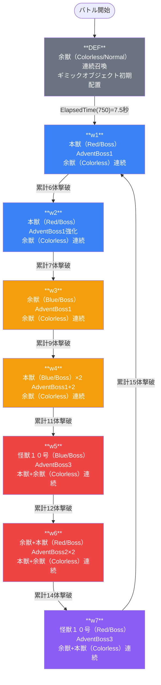

# raid_kai_00001 インゲームデータ詳細解説

> 参照リポジトリ: `projects/glow-masterdata`
> リリースキー: 202509010
> 本ファイルはMstAutoPlayerSequenceが40行のレイドバトルの全データ設定を解説する

---

## 概要

**怪獣（KAI）シリーズのレイドバトル**（スコアアタック型）。

- **砦HP**: `1,000,000`（ダメージ無効・`is_damage_invalidation=1`）・背景アセット=`kai_0001`
- **BGM**: 通常=`SSE_SBG_003_001`・ボス=`SSE_SBG_003_004`
- **コマ**: 4行構成（row1: 0.75+0.25コマ / row2: 1.0コマ / row3: 0.33+0.34+0.33コマ / row4: 0.25+0.75コマ・コマ効果なし）
- **グループ**: デフォルト + w1〜w7（デフォルト→w1はElapsedTime(750)=7.5秒経過で自動移行、w1以降はFriendUnitDead累積撃破数・w7→w1ループ・1ループあたり9体）
- **使用する敵**: 8種類（ボス3キャラ6種: 余獣（Red/Blue）・本獣（Red/Blue）・怪獣１０号（Red/Blue） / 雑魚2種: 余獣（Colorless/Normal）・本獣（Colorless/Normal））
- **特殊ルール**: `is_damage_invalidation=1` により砦ダメージ無効・制限時間内に多くの敵を倒してスコアを最大化するスコアアタック型
- デフォルト雑魚は hp_coef=0.2〜0.3（余獣Normal実HP=2,000〜3,000）・w7では hp_coef=5（余獣Normal実HP=50,000）・怪獣１０号は base_hp=100,000 で実HP=170,000〜350,000 となる大型ボス
- InitialSummonでギミックオブジェクト（`raid_kai_00001`）を位置0.75に初期配置（hp_coef=10, atk_coef=0.01）
- バトル説明: 「このステージは、4段で構成されているぞ! 敵を多く倒して、スコアを稼ごう!」

---

## 関連テーブル設定

### MstInGame

| カラム | 値 |
|--------|-----|
| `id` | `raid_kai_00001` |
| `mst_auto_player_sequence_set_id` | `raid_kai_00001` |
| `bgm_asset_key` | `SSE_SBG_003_001` |
| `boss_bgm_asset_key` | `SSE_SBG_003_004` |
| `mst_page_id` | `raid_kai_00001` |
| `mst_enemy_outpost_id` | `raid_kai_00001` |
| `boss_mst_enemy_stage_parameter_id` | （なし） |
| `normal_enemy_hp_coef` | `1.0` |
| `normal_enemy_attack_coef` | `1.0` |
| `normal_enemy_speed_coef` | `1` |
| `boss_enemy_hp_coef` | `1.0` |
| `boss_enemy_attack_coef` | `1.0` |
| `boss_enemy_speed_coef` | `1` |

### MstEnemyOutpost（敵砦）

| カラム | 値 | 意味 |
|--------|-----|------|
| `id` | `raid_kai_00001` | |
| `hp` | `1,000,000` | スコアアタック型で実質無限 |
| `is_damage_invalidation` | `1` | **ダメージ無効**（砦破壊不可） |
| `artwork_asset_key` | `kai_0001` | 背景アートワーク |

### MstPage + MstKomaLine（コマフィールド）

4行構成。全行 height=0.55、全コマアセット=`kai_00002`、コマ効果なし（effect=None）。

```
row=1  height=0.55  layout=4  (2コマ: 0.75 + 0.25)
  koma1: kai_00002  width=0.75  bg_offset=-1.0
  koma2: kai_00002  width=0.25  bg_offset=-1.0

row=2  height=0.55  layout=1  (1コマ: 1.0)
  koma1: kai_00002  width=1.0   bg_offset=0.0

row=3  height=0.55  layout=7  (3コマ: 0.33 + 0.34 + 0.33)
  koma1: kai_00002  width=0.33  bg_offset=-1.0
  koma2: kai_00002  width=0.34  bg_offset=-1.0
  koma3: kai_00002  width=0.33  bg_offset=-1.0

row=4  height=0.55  layout=5  (2コマ: 0.25 + 0.75)
  koma1: kai_00002  width=0.25  bg_offset=-1.0
  koma2: kai_00002  width=0.75  bg_offset=-1.0
```

> **コマ効果の補足**: 全コマ effect=None のためコマ効果なし。ゲームで言及する「4段」は MstKomaLine の row 数（4行）を指す。

### MstInGameI18n（バトル説明文）

**result_tips（バトルヒント）:**
> （なし）

**description（ステージ説明）:**
> このステージは、4段で構成されているぞ!\n敵を多く倒して、スコアを稼ごう!

---

## 使用する敵パラメータ（MstEnemyStageParameter）一覧

8種類の敵パラメータを使用。`e_` プレフィックスは汎用敵。
IDの命名規則: `e_{キャラID}_kai1_advent_{kind}_{color}`

### カラム解説

| カラム名（略称） | DBカラム名 | 説明 |
|---------------|-----------|------|
| id | id | MstEnemyStageParameterの主キー |
| キャラID | mst_enemy_character_id | 紐付くキャラモデル・スキルの参照元 |
| kind | character_unit_kind | `Normal`（通常敵）/ `AdventBattleBoss`（ボス）。UIオーラ表示に影響 |
| role | role_type | 属性相性の役職（Attack/Defense） |
| color | color | 属性色（Red/Blue/Colorless） |
| sort | sort_order | ゲーム内表示順 |
| base_hp | hp | ベースHP（`enemy_hp_coef` 乗算前の素値） |
| base_atk | attack_power | ベース攻撃力（`enemy_attack_coef` 乗算前の素値） |
| base_spd | move_speed | 移動速度（数値が大きいほど速い） |
| well_dist | well_distance | 攻撃射程（コマ単位） |
| combo | attack_combo_cycle | 攻撃コンボ数（1=単発） |
| knockback | damage_knock_back_count | 被攻撃時ノックバック回数 |
| ability | mst_unit_ability_id1 | 特殊アビリティID |
| drop_bp | drop_battle_point | 基本ドロップバトルポイント |

### 全8種類の詳細パラメータ

| MstEnemyStageParameter ID | 日本語名 | キャラID | kind | role | color | sort | base_hp | base_atk | base_spd | well_dist | combo | knockback | ability | drop_bp |
|--------------------------|---------|---------|------|------|-------|------|---------|---------|---------|-----------|-------|-----------|---------|---------|
| e_kai_00101_kai1_advent_Normal_Colorless | 怪獣 余獣 | enemy_kai_00101 | Normal | Defense | Colorless | 104 | 10,000 | 500 | 21 | 0.22 | 1 | 3 | なし | 200 |
| e_kai_00101_kai1_advent_Boss_Red | 怪獣 余獣 | enemy_kai_00101 | AdventBattleBoss | Attack | Red | 105 | 10,000 | 500 | 25 | 0.19 | 1 | 2 | なし | 100 |
| e_kai_00101_kai1_advent_Boss_Blue | 怪獣 余獣 | enemy_kai_00101 | AdventBattleBoss | Attack | Blue | 106 | 10,000 | 500 | 28 | 0.17 | 1 | 2 | なし | 100 |
| e_kai_00001_kai1_advent_Normal_Colorless | 怪獣 本獣 | enemy_kai_00001 | Normal | Attack | Colorless | 107 | 10,000 | 500 | 25 | 0.30 | 1 | 3 | なし | 100 |
| e_kai_00001_kai1_advent_Boss_Red | 怪獣 本獣 | enemy_kai_00001 | AdventBattleBoss | Attack | Red | 108 | 10,000 | 500 | 21 | 0.35 | 1 | 3 | なし | 300 |
| e_kai_00001_kai1_advent_Boss_Blue | 怪獣 本獣 | enemy_kai_00001 | AdventBattleBoss | Attack | Blue | 109 | 10,000 | 500 | 23 | 0.31 | 1 | 3 | なし | 300 |
| e_kai_00401_kai1_advent_Boss_Red | 怪獣１０号 | enemy_kai_00401 | AdventBattleBoss | Attack | Red | 110 | 100,000 | 2,000 | 65 | 0.22 | 1 | 2 | なし | 500 |
| e_kai_00401_kai1_advent_Boss_Blue | 怪獣１０号 | enemy_kai_00401 | AdventBattleBoss | Attack | Blue | 111 | 100,000 | 2,000 | 70 | 0.20 | 1 | 2 | なし | 500 |

> **実際のHP・ATKは `base × MstAutoPlayerSequence.enemy_hp_coef` で決まる。**

### 敵パラメータの特性解説

| キャラ | 特徴 |
|--------|------|
| 怪獣 余獣（Normal/Colorless） | Defense役・spd=21（最低速）・ノックバック3回・雑魚として大量召喚 |
| 怪獣 余獣（Boss/Red） | Attack役・spd=25・ノックバック2回・w1〜w2ボスとして登場 |
| 怪獣 余獣（Boss/Blue） | Attack役・spd=28（余獣系最速）・ノックバック2回・w3ボスとして登場 |
| 怪獣 本獣（Normal/Colorless） | Attack役・spd=25・射程0.30（長め）・w5〜w7の高hp_coef雑魚 |
| 怪獣 本獣（Boss/Red） | Attack役・spd=21・射程0.35（本獣系最長）・w1〜w2ボスが主役 |
| 怪獣 本獣（Boss/Blue） | Attack役・spd=23・射程0.31・w4でAdventBoss1+2の2体同時登場 |
| 怪獣１０号（Boss/Red） | base_hp=100,000・atk=2,000・spd=65（超高速）・w7最終ボス |
| 怪獣１０号（Boss/Blue） | base_hp=100,000・atk=2,000・spd=70（最高速）・w5ボス |

---

## グループ構造の全体フロー（Mermaid）



---

## 全40行の詳細データ（グループ単位）

### デフォルトグループ（elem 1〜3, 16, groupchange_1）

バトル開始直後に余獣（Colorless/Normal）を連続召喚し、ギミックオブジェクトを初期配置。7.5秒後にw1へ移行。hp_coefが低く（0.2〜0.3）、スコアは1体10と最小。

| id | elem | 条件 | アクション | 敵 | 召喚数 | interval | aura | hp倍 | atk倍 | score | 説明 |
|----|------|------|-----------|-----|--------|----------|------|------|------|-------|------|
| raid_kai_00001_1 | 1 | ElapsedTime(0) | SummonEnemy | 余獣(Colorless/Normal) | 3 | 100ms | Default | 0.2 | 0.24 | 10 | 開幕即時3体召喚（実HP=2,000） |
| raid_kai_00001_2 | 2 | ElapsedTime(300) | SummonEnemy | 余獣(Colorless/Normal) | 99 | 300ms | Default | 0.3 | 0.2 | 10 | 3秒後から無限連続召喚（実HP=3,000） |
| raid_kai_00001_3 | 3 | ElapsedTime(150) | SummonEnemy | 余獣(Colorless/Normal) | 99 | 400ms | Default | 0.2 | 0.24 | 10 | 1.5秒後から無限連続召喚（実HP=2,000） |
| raid_kai_00001_40 | 16 | InitialSummon | SummonGimmickObject | raid_kai_00001 | 1 | 0ms | Default | 10 | 0.01 | 0 | ギミックオブジェクト初期配置（位置0.75） |
| raid_kai_00001_32 | groupchange_1 | ElapsedTime(750) | SwitchSequenceGroup → **w1** | — | — | — | — | — | — | — | 7.5秒経過で自動移行 |

**ポイント:**
- elem1〜3は ElapsedTime 条件（タイマー）による呼び出し。デフォルトグループはraidタイプ特有のウォームアップフェーズ。
- GimmickObjectのhp_coef=10は砦オブジェクト用の設定（atk_coef=0.01と極めて低い）。

---

### w1グループ（elem 6, 16〜17, groupchange_2）

本獣（Red/Boss/AdventBoss1）が1体登場。余獣の連続召喚も継続。累計6体撃破でw2へ進行。

| id | elem | 条件 | アクション | 敵 | 召喚数 | interval | aura | hp倍 | atk倍 | score | 説明 |
|----|------|------|-----------|-----|--------|----------|------|------|------|-------|------|
| raid_kai_00001_6 | 6 | GroupActivated(100) | SummonEnemy | 本獣(Red/Boss) | 1 | 0ms | AdventBoss1 | 3 | 0.5 | 100 | 1秒後にボス召喚（実HP=30,000） |
| raid_kai_00001_7 | 16 | GroupActivated(300) | SummonEnemy | 余獣(Colorless/Normal) | 99 | 300ms | Default | 0.3 | 0.2 | 10 | 3秒後から無限連続召喚 |
| raid_kai_00001_8 | 17 | GroupActivated(150) | SummonEnemy | 余獣(Colorless/Normal) | 99 | 400ms | Default | 0.2 | 0.24 | 10 | 1.5秒後から無限連続召喚 |
| raid_kai_00001_33 | groupchange_2 | FriendUnitDead(6) | SwitchSequenceGroup → **w2** | — | — | — | — | — | — | — | 累計6体撃破で移行 |

**ポイント:**
- 本獣(Red/Boss)は hp_coef=3 で実HP=30,000。atk_coef=0.5と攻撃は控えめ。AdventBoss1オーラによる演出あり。

---

### w2グループ（elem 7, 18〜19, groupchange_3）

本獣（Red/Boss/AdventBoss1）が強化されて再登場。累計7体撃破（w2で1体）でw3へ。

| id | elem | 条件 | アクション | 敵 | 召喚数 | interval | aura | hp倍 | atk倍 | score | 説明 |
|----|------|------|-----------|-----|--------|----------|------|------|------|-------|------|
| raid_kai_00001_9 | 7 | GroupActivated(100) | SummonEnemy | 本獣(Red/Boss) | 1 | 0ms | AdventBoss1 | 4.5 | 1.1 | 120 | 1秒後にボス召喚（実HP=45,000） |
| raid_kai_00001_10 | 18 | GroupActivated(300) | SummonEnemy | 余獣(Colorless/Normal) | 99 | 300ms | Default | 2 | 0.4 | 20 | 3秒後から無限連続召喚（実HP=20,000） |
| raid_kai_00001_11 | 19 | GroupActivated(150) | SummonEnemy | 余獣(Colorless/Normal) | 99 | 400ms | Default | 2 | 0.4 | 20 | 1.5秒後から無限連続召喚（実HP=20,000） |
| raid_kai_00001_34 | groupchange_3 | FriendUnitDead(7) | SwitchSequenceGroup → **w3** | — | — | — | — | — | — | — | 累計7体撃破で移行 |

**ポイント:**
- w2から余獣(Colorless)のhp_coefが2倍（実HP=20,000）に急上昇。スコアも10→20と2倍に。
- 本獣(Red/Boss)もhp_coef=4.5（実HP=45,000）・atk_coef=1.1と強化。

---

### w3グループ（elem 8〜9, 20〜21, groupchange_4）

余獣（Colorless/Normal）1体先行召喚後、余獣（Blue/Boss/AdventBoss1）が登場。累計9体撃破（w3で2体）でw4へ。

| id | elem | 条件 | アクション | 敵 | 召喚数 | interval | aura | hp倍 | atk倍 | score | 説明 |
|----|------|------|-----------|-----|--------|----------|------|------|------|-------|------|
| raid_kai_00001_12 | 8 | GroupActivated(100) | SummonEnemy | 余獣(Colorless/Normal) | 1 | 0ms | Default | 2.5 | 0.65 | 30 | 1秒後に余獣1体先行（実HP=25,000） |
| raid_kai_00001_13 | 9 | GroupActivated(125) | SummonEnemy | 余獣(Blue/Boss) | 1 | 0ms | AdventBoss1 | 10 | 1.4 | 200 | 1.25秒後にボス召喚（実HP=100,000） |
| raid_kai_00001_14 | 20 | GroupActivated(300) | SummonEnemy | 余獣(Colorless/Normal) | 99 | 300ms | Default | 2.5 | 0.65 | 30 | 3秒後から無限連続召喚（実HP=25,000） |
| raid_kai_00001_15 | 21 | GroupActivated(150) | SummonEnemy | 余獣(Colorless/Normal) | 99 | 400ms | Default | 2.5 | 0.65 | 30 | 1.5秒後から無限連続召喚（実HP=25,000） |
| raid_kai_00001_35 | groupchange_4 | FriendUnitDead(9) | SwitchSequenceGroup → **w4** | — | — | — | — | — | — | — | 累計9体撃破で移行 |

**ポイント:**
- 余獣(Blue/Boss)はhp_coef=10で実HP=100,000の高耐久ボス。
- elem8の余獣(Colorless/Normal)はkind=Normalだがhp_coef=2.5で実HP=25,000と雑魚としては高HP。

---

### w4グループ（elem 10〜11, 22〜23, groupchange_5）

本獣（Blue/Boss）がAdventBoss1・AdventBoss2の2ランクで連続登場。累計11体撃破（w4で2体）でw5へ。

| id | elem | 条件 | アクション | 敵 | 召喚数 | interval | aura | hp倍 | atk倍 | score | 説明 |
|----|------|------|-----------|-----|--------|----------|------|------|------|-------|------|
| raid_kai_00001_16 | 10 | GroupActivated(100) | SummonEnemy | 本獣(Blue/Boss) | 1 | 0ms | AdventBoss1 | 11 | 1.25 | 200 | 1秒後にボス1体目（実HP=110,000） |
| raid_kai_00001_17 | 11 | GroupActivated(125) | SummonEnemy | 本獣(Blue/Boss) | 1 | 0ms | AdventBoss2 | 9 | 2.5 | 200 | 1.25秒後にボス2体目（実HP=90,000） |
| raid_kai_00001_18 | 22 | GroupActivated(300) | SummonEnemy | 余獣(Colorless/Normal) | 99 | 300ms | Default | 2.5 | 0.7 | 40 | 3秒後から無限連続召喚（実HP=25,000） |
| raid_kai_00001_19 | 23 | GroupActivated(150) | SummonEnemy | 余獣(Colorless/Normal) | 99 | 400ms | Default | 2.5 | 0.7 | 40 | 1.5秒後から無限連続召喚（実HP=25,000） |
| raid_kai_00001_36 | groupchange_5 | FriendUnitDead(11) | SwitchSequenceGroup → **w5** | — | — | — | — | — | — | — | 累計11体撃破で移行 |

**ポイント:**
- 同一キャラ（本獣Blue/Boss）をAdventBoss1・AdventBoss2の異なるオーラで2体連続召喚。
- elem10はhp_coef=11（実HP=110,000）、elem11はhp_coef=9（実HP=90,000）で微妙に差分あり。

---

### w5グループ（elem 4〜5, 12, 24〜25, groupchange_6）

初の怪獣１０号（Blue/Boss/AdventBoss3）が登場。本獣（Colorless/Normal）も高速・高密度で追加。累計12体撃破（w5で1体）でw6へ。

| id | elem | 条件 | アクション | 敵 | 召喚数 | interval | aura | hp倍 | atk倍 | score | 説明 |
|----|------|------|-----------|-----|--------|----------|------|------|------|-------|------|
| raid_kai_00001_5 | 5 | GroupActivated(0) | SummonEnemy | 本獣(Colorless/Normal) | 1 | 0ms | Default | 1.5 | 1.4 | 50 | 開始直後に本獣1体先行（実HP=15,000） |
| raid_kai_00001_4 | 4 | GroupActivated(100) | SummonEnemy | 本獣(Colorless/Normal) | 99 | 100ms | Default | 1.5 | 1.4 | 50 | 1秒後から本獣を超高速連続召喚（interval=100ms） |
| raid_kai_00001_20 | 12 | GroupActivated(100) | SummonEnemy | 怪獣１０号(Blue/Boss) | 1 | 0ms | AdventBoss3 | 1.7 | 0.48 | 300 | 1秒後に最強ボス召喚（実HP=170,000） |
| raid_kai_00001_21 | 24 | GroupActivated(300) | SummonEnemy | 余獣(Colorless/Normal) | 99 | 300ms | Default | 3 | 0.85 | 50 | 3秒後から余獣無限召喚（実HP=30,000） |
| raid_kai_00001_22 | 25 | GroupActivated(150) | SummonEnemy | 余獣(Colorless/Normal) | 99 | 400ms | Default | 3 | 0.85 | 50 | 1.5秒後から余獣無限召喚（実HP=30,000） |
| raid_kai_00001_37 | groupchange_6 | FriendUnitDead(12) | SwitchSequenceGroup → **w6** | — | — | — | — | — | — | — | 累計12体撃破で移行 |

**ポイント:**
- 怪獣１０号（Blue/Boss）はbase_hp=100,000にhp_coef=1.7で実HP=170,000。spd=70（本CSVで最速）。
- 本獣(Colorless/Normal)はinterval=100ms（デフォルト雑魚の300msより3倍速い）で高密度召喚。
- w5→w6の切り替えは1体撃破だけ（12体目でw6へ）という短いウィンドウ。

---

### w6グループ（elem 13〜14, 26〜28, groupchange_7）

余獣（Red/Boss/AdventBoss2）と本獣（Red/Boss/AdventBoss2）が2体登場。本獣(Colorless/Normal)も高速召喚継続。累計14体撃破（w6で2体）でw7へ。

| id | elem | 条件 | アクション | 敵 | 召喚数 | interval | aura | hp倍 | atk倍 | score | 説明 |
|----|------|------|-----------|-----|--------|----------|------|------|------|-------|------|
| raid_kai_00001_23 | 13 | GroupActivated(100) | SummonEnemy | 余獣(Red/Boss) | 1 | 0ms | AdventBoss2 | 2 | 2 | 200 | 1秒後に余獣Redボス（実HP=20,000） |
| raid_kai_00001_24 | 14 | GroupActivated(125) | SummonEnemy | 本獣(Red/Boss) | 1 | 0ms | AdventBoss2 | 2.5 | 1.6 | 200 | 1.25秒後に本獣Redボス（実HP=25,000） |
| raid_kai_00001_25 | 26 | GroupActivated(300) | SummonEnemy | 余獣(Colorless/Normal) | 99 | 300ms | Default | 4 | 1.15 | 60 | 3秒後から余獣無限召喚（実HP=40,000） |
| raid_kai_00001_26 | 27 | GroupActivated(150) | SummonEnemy | 余獣(Colorless/Normal) | 99 | 400ms | Default | 4 | 1.15 | 60 | 1.5秒後から余獣無限召喚（実HP=40,000） |
| raid_kai_00001_27 | 28 | GroupActivated(100) | SummonEnemy | 本獣(Colorless/Normal) | 99 | 100ms | Default | 2 | 1.5 | 60 | 1秒後から本獣超高速召喚（実HP=20,000） |
| raid_kai_00001_38 | groupchange_7 | FriendUnitDead(14) | SwitchSequenceGroup → **w7** | — | — | — | — | — | — | — | 累計14体撃破で移行 |

**ポイント:**
- 余獣(Red/Boss)はhp_coef=2（実HP=20,000）と比較的低HPだが、atk_coef=2.0と攻撃力が高い。
- 本獣(Colorless/Normal)のinterval=100msで本獣も超高速召喚。w5〜w7は本獣が雑魚として高密度登場。

---

### w7グループ（elem 15, 29〜31, groupchange_8）

最高ランクの怪獣１０号（Red/Boss/AdventBoss3）が登場。余獣・本獣ともに最大hp_coef=5。累計15体撃破でw1へループ。

| id | elem | 条件 | アクション | 敵 | 召喚数 | interval | aura | hp倍 | atk倍 | score | 説明 |
|----|------|------|-----------|-----|--------|----------|------|------|------|-------|------|
| raid_kai_00001_28 | 15 | GroupActivated(100) | SummonEnemy | 怪獣１０号(Red/Boss) | 1 | 0ms | AdventBoss3 | 3.5 | 0.8 | 400 | 1秒後に最強ボス召喚（実HP=350,000） |
| raid_kai_00001_29 | 29 | GroupActivated(300) | SummonEnemy | 余獣(Colorless/Normal) | 99 | 300ms | Default | 5 | 1.3 | 70 | 3秒後から余獣無限召喚（実HP=50,000） |
| raid_kai_00001_30 | 30 | GroupActivated(150) | SummonEnemy | 余獣(Colorless/Normal) | 99 | 400ms | Default | 5 | 1.3 | 70 | 1.5秒後から余獣無限召喚（実HP=50,000） |
| raid_kai_00001_31 | 31 | GroupActivated(100) | SummonEnemy | 本獣(Colorless/Normal) | 99 | 100ms | Default | 5 | 2.5 | 70 | 1秒後から本獣超高速召喚（実HP=50,000） |
| raid_kai_00001_39 | groupchange_8 | FriendUnitDead(15) | SwitchSequenceGroup → **w1** | — | — | — | — | — | — | — | 累計15体撃破でw1へループ |

**ポイント:**
- 怪獣１０号（Red/Boss）はhp_coef=3.5で実HP=350,000。このCSVで最高HP・最高スコア（400）。
- 余獣・本獣ともにhp_coef=5（実HP=50,000）と最大値。atk_coef=2.5の本獣は高火力。
- w7で15体撃破するとw1（6体撃破条件）に戻るループ。2周目以降は6体→w2→...と続く。

---

## グループ切り替えまとめ表

| 切り替え | 条件 | 遷移先 |
|---------|------|--------|
| デフォルト → w1 | **ElapsedTime(750)** = 7.5秒経過（自動移行） | w1 |
| w1 → w2 | **FriendUnitDead(6)** = 累計6体撃破 | w2 |
| w2 → w3 | **FriendUnitDead(7)** = 累計7体撃破 | w3 |
| w3 → w4 | **FriendUnitDead(9)** = 累計9体撃破 | w4 |
| w4 → w5 | **FriendUnitDead(11)** = 累計11体撃破 | w5 |
| w5 → w6 | **FriendUnitDead(12)** = 累計12体撃破 | w6 |
| w6 → w7 | **FriendUnitDead(14)** = 累計14体撃破 | w7 |
| w7 → w1 | **FriendUnitDead(15)** = 累計15体撃破 | w1（ループ） |

各グループで撃破が必要な体数:

| グループ | 累積撃破数 | グループ内で倒す体数 |
|---------|----------|----------------|
| デフォルト | — | 7.5秒間（時間経過） |
| w1 | 6体 | 6体 |
| w2 | 7体 | 1体 |
| w3 | 9体 | 2体 |
| w4 | 11体 | 2体 |
| w5 | 12体 | 1体 |
| w6 | 14体 | 2体 |
| w7 → w1 | 15体 | 1体（でw1へリセット） |

1ループ（w1→w7完了まで）: **15 - 6 = 9体** 撃破で1周。

---

## スコア体系

バトルポイントは `override_drop_battle_point`（MstAutoPlayerSequence設定値）が優先される。
本コンテンツではoverride_drop_battle_pointは設定なし（全行空欄）のため、デフォルトのdrop_battle_pointを使用。

`defeated_score` はスコアアタック用のスコア加算値。グループが進むにつれて増加する段階設計。

| 敵の種類 | グループ | defeated_score | drop_bp（MstEnemyStageParameter） |
|---------|---------|---------------|----------------------------------|
| 余獣(Colorless/Normal) | DEF・w1 | 10 | 200 |
| 余獣(Colorless/Normal) | w2 | 20 | 200 |
| 余獣(Colorless/Normal) | w3 | 30 | 200 |
| 余獣(Colorless/Normal) | w4 | 40 | 200 |
| 余獣(Colorless/Normal) | w5〜w6 | 50〜60 | 200 |
| 余獣(Colorless/Normal) | w7 | 70 | 200 |
| 本獣(Colorless/Normal) | w5 | 50 | 100 |
| 本獣(Colorless/Normal) | w6〜w7 | 60〜70 | 100 |
| 本獣(Red/Boss) | w1 | 100 | 300 |
| 余獣(Red/Boss) | w6 | 200 | 100 |
| 本獣(Red/Boss) | w2 | 120 | 300 |
| 余獣(Blue/Boss) | w3 | 200 | 100 |
| 本獣(Blue/Boss) | w4 | 200 | 300 |
| 本獣(Red/Boss) | w6 | 200 | 300 |
| 怪獣１０号(Blue/Boss) | w5 | 300 | 500 |
| 怪獣１０号(Red/Boss) | w7 | 400 | 500 |

---

## この設定から読み取れる設計パターン

### 1. ElapsedTime条件によるウォームアップフェーズ
デフォルトグループはElapsedTime条件（タイマー）で構成。バトル開始後7.5秒間は低難度の余獣を召喚し続けるウォームアップ設計。raidタイプ特有の「スコアを稼ぐ前の準備期間」として機能する。プレイヤーが陣形を整える猶予がある。

### 2. FriendUnitDeadの1〜2体ずつ進む高速グループ遷移
w1〜w7はFriendUnitDead（累積撃破数）6→7→9→11→12→14→15と1〜2体差で次々に移行する。ボスを1体倒すだけでグループが変わる設計で、テンポよくステージが進行する。スコア稼ぎのリズム感を生み出す高速グループ切り替え設計。

### 3. w7→w1ループによる無限スコア稼ぎ
w7で15体撃破するとw1（6体条件）に戻るループ。1周9体（w1〜w7）でw1から再スタート。時間が許す限り何周もループできる無限スコア稼ぎ構造。ループ周回を重ねるほど高スコアを狙える。

### 4. グループが上がるほどスコア倍率が増加する段階設計
余獣(Colorless/Normal)のdefeated_scoreがDEF=10 → w7=70と7倍に増加。高グループほど高いスコアが得られるため、プレイヤーはできるだけ早く高グループに到達することが重要になる。

### 5. 怪獣１０号の破格スペックと最高スコア
e_kai_00401系はbase_hp=100,000（通常の10倍）・spd=65-70（全敵中最高速）・atk=2,000（通常の4倍）という破格スペック。defeated_scoreも300〜400と群を抜いて高く、撃破すれば大量スコア獲得だが撃破難易度も最高。AdventBoss3オーラでビジュアル的にも最高ランクの演出。

### 6. w5〜w7で本獣(Colorless/Normal)が雑魚として追加
w5以降は従来の余獣(Colorless/Normal)に加えて本獣(Colorless/Normal)がinterval=100ms（3倍速）で高密度召喚される。雑魚のバリエーション増加と高速召喚で、後半ステージの密度感と処理の忙しさを演出している。
