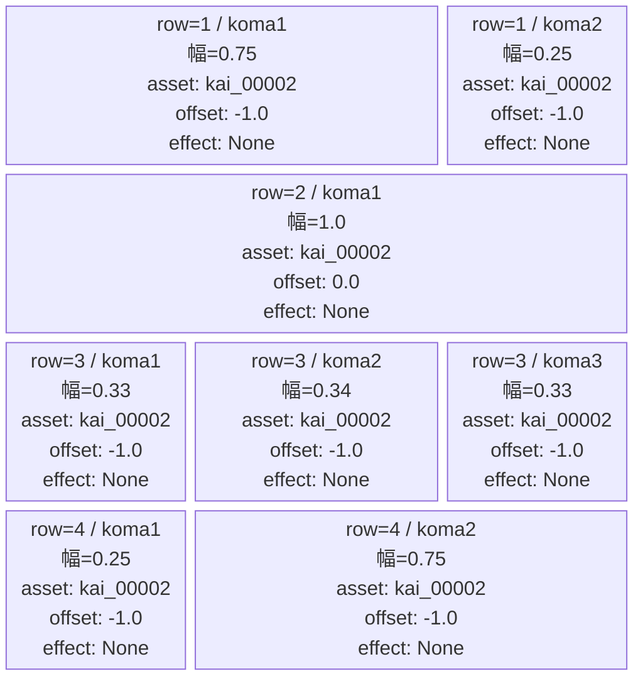

# raid_kai_00001 インゲームデータ詳細解説

> 参照リポジトリ: `projects/glow-masterdata`
> リリースキー: 202509010

---

## インゲーム要件テキスト

raid_kai_00001 は「怪獣」シリーズを題材としたスコアアタック型レイドコンテンツである。砦の `is_damage_invalidation=1` 設定により砦HPは実質無限（hp=1,000,000）で、敵を倒してもクリア条件は存在せず、時間内に敵を可能な限り多く撃破してスコアを稼ぐことがゲームの目的となる。

フィールドは4段構成で、MstInGameI18nの説明テキスト「このステージは、4段で構成されているぞ!敵を多く倒して、スコアを稼ごう!」が示す通り、各段の幅比率に変化があり、段ごとに異なる戦線幅が設定されている。コマ背景アセットはすべて `kai_00002`、砦背景は `kai_0001`（艦これシリーズに準じた怪獣テーマ）で統一されており、コマ効果（koma_effect）は全コマで `None`。BGMは通常戦闘 `SSE_SBG_003_001`、ボス出現時は `SSE_SBG_003_004` に切り替わる。

グループ構成はデフォルトグループ＋w1〜w7の計8グループである。デフォルトグループは ElapsedTime 750ms 後に一時間的な遷移トリガーとなり w1 へ移行する。w1 以降はすべて指定ボスの撃破（FriendUnitDead）を条件にグループが切り替わる仕組みで、w7 完了後は w1 へループする。ループ1周で w1〜w7 を経由し7体のボスを撃破することになる。FriendUnitDead の条件値は体数ではなく `sequence_element_id` を指しており、指定の元素 ID が示す敵が1体倒れると即座に次グループへ遷移する。

登場する敵は3種のモデル（怪獣 余獣・怪獣 本獣・怪獣１０号）で構成される。余獣（enemy_kai_00101）と本獣（enemy_kai_00001）はいずれも base_hp=10,000・base_atk=500 の同スペックだが役割が分かれており、余獣はDefenseロール（spd=21）、本獣はAttackロール（spd=25）である。怪獣１０号（enemy_kai_00401）は base_hp=100,000・base_atk=2,000 と別格のスペックを持ち、spd=65〜70 と非常に高速で、w5 以降のフェーズで召喚されるハイエンドボスとして機能する。各グループで hp_coef・atk_coef が段階的に強化されており、ループが進むほど雑魚の実HPも高くなる設計になっている。

InitialSummon（バトル開始時固定配置）によりデフォルトグループ開始と同時に `SummonGimmickObject raid_kai_00001` が位置0.75 に1体配置される。このギミックは hp_coef=10・atk_coef=0.01 が設定されており、実質的に装飾的存在として機能する。ボスの演出ランクは w1〜w3 が AdventBoss1、w4・w6 が AdventBoss2、w5・w7 の怪獣１０号が AdventBoss3（最高ランク）と、フェーズが進むにつれ演出強度が上がる構成となっている。

---

## レベルデザイン

### 敵キャラ設計

#### 敵キャラ選定（MstEnemyCharacter）

本ステージで使用する敵キャラクターモデルは3種類。

| mst_enemy_character_id | 日本語名 | 役割 | 備考 |
|------------------------|---------|------|------|
| `enemy_kai_00101` | 怪獣 余獣 | ザコ/小ボス | Defense ロール、spd=21（遅め）。Normal(Colorless)・Boss(Red/Blue)の3パラメータを持つ |
| `enemy_kai_00001` | 怪獣 本獣 | ザコ/中ボス | Attack ロール、spd=25。Normal(Colorless)・Boss(Red/Blue)の3パラメータを持つ |
| `enemy_kai_00401` | 怪獣１０号 | 大ボス | base_hp=100,000・base_atk=2,000、spd=65〜70 の超高速ボス。Boss(Red/Blue)のみ |

#### 敵キャラステータス調整（MstEnemyStageParameter → MstInGame基本設定）

**MstInGameのcoef状態**: 全て1.0（無調整）

MstEnemyStageParameterに定義された8種類の素値：

| MstEnemyStageParameter ID | 日本語名 | kind | role | color | base_hp | base_atk | base_spd | well_dist | drop_bp |
|--------------------------|---------|------|------|-------|---------|---------|---------|-----------|---------|
| `e_kai_00101_kai1_advent_Normal_Colorless` | 怪獣 余獣 | Normal | Defense | Colorless | 10,000 | 500 | 21 | 0.22 | 200 |
| `e_kai_00101_kai1_advent_Boss_Red` | 怪獣 余獣 | AdventBattleBoss | Attack | Red | 10,000 | 500 | 25 | 0.19 | 100 |
| `e_kai_00101_kai1_advent_Boss_Blue` | 怪獣 余獣 | AdventBattleBoss | Attack | Blue | 10,000 | 500 | 28 | 0.17 | 100 |
| `e_kai_00001_kai1_advent_Normal_Colorless` | 怪獣 本獣 | Normal | Attack | Colorless | 10,000 | 500 | 25 | 0.30 | 100 |
| `e_kai_00001_kai1_advent_Boss_Red` | 怪獣 本獣 | AdventBattleBoss | Attack | Red | 10,000 | 500 | 21 | 0.35 | 300 |
| `e_kai_00001_kai1_advent_Boss_Blue` | 怪獣 本獣 | AdventBattleBoss | Attack | Blue | 10,000 | 500 | 23 | 0.31 | 300 |
| `e_kai_00401_kai1_advent_Boss_Red` | 怪獣１０号 | AdventBattleBoss | Attack | Red | 100,000 | 2,000 | 65 | 0.22 | 500 |
| `e_kai_00401_kai1_advent_Boss_Blue` | 怪獣１０号 | AdventBattleBoss | Attack | Blue | 100,000 | 2,000 | 70 | 0.20 | 500 |

> 余獣・本獣ともに base_hp=10,000・base_atk=500 で素値は同一。ノックバック数は余獣Normal=3、余獣Boss=2、本獣=3、怪獣１０号=2。コンボ数は全敵1。

---

### コマ設計

4行7コマ構成。全コマ effect=None（コマ効果なし）、アセットはすべて `kai_00002` で統一。

---

### 敵キャラシーケンス設計

#### どのフェーズで、どの敵を、いつ、どこに、どのくらい出現させるか

デフォルト + w1〜w7 の計8グループ構成。w7 完了後に w1 へループ（w1〜w7 で 1セット）。デフォルトグループは ElapsedTime による時間遷移で、w1 以降はすべてボス撃破（FriendUnitDead）を条件にグループが切り替わる。

```mermaid
flowchart LR
    START([バトル開始]) --> DEF

    DEF["デフォルトグループ\n余獣Nml(Colorless)×3＋継続召喚\nGimmickObject配置"]
    DEF -- "ElapsedTime(750ms)" --> W1

    W1["w1グループ\n本獣BossRed + 余獣Nml(Colorless)"]
    W1 -- "FriendUnitDead(elem6撃破)" --> W2

    W2["w2グループ\n本獣BossRed(強化) + 余獣Nml(Colorless)"]
    W2 -- "FriendUnitDead(elem7撃破)" --> W3

    W3["w3グループ\n余獣BossBlue + 余獣Nml(Colorless)"]
    W3 -- "FriendUnitDead(elem9撃破)" --> W4

    W4["w4グループ\n本獣BossBlue×2 + 余獣Nml(Colorless)"]
    W4 -- "FriendUnitDead(elem11撃破)" --> W5

    W5["w5グループ\n怪獣１０号BossBlue + 本獣/余獣Nml"]
    W5 -- "FriendUnitDead(elem12撃破)" --> W6

    W6["w6グループ\n余獣BossRed + 本獣BossRed + 余獣/本獣Nml"]
    W6 -- "FriendUnitDead(elem14撃破)" --> W7

    W7["w7グループ\n怪獣１０号BossRed + 余獣/本獣Nml"]
    W7 -- "FriendUnitDead(elem15撃破)" --> W1

    style DEF fill:#6b7280,color:#fff
    style W1 fill:#3b82f6,color:#fff
    style W2 fill:#3b82f6,color:#fff
    style W3 fill:#f59e0b,color:#fff
    style W4 fill:#f59e0b,color:#fff
    style W5 fill:#ef4444,color:#fff
    style W6 fill:#ef4444,color:#fff
    style W7 fill:#8b5cf6,color:#fff
```

---

**デフォルトグループ**（ElapsedTime 750ms 経過後に w1 へ遷移）

| elem | 出現タイミング | 敵 | 数 | 召喚位置 | interval |
|------|-------------|---|---|---------|---------|
| 1 | ElapsedTime(0) | 怪獣 余獣（Colorless/Normal） | 3 | ランダム | 100ms |
| 16 | **InitialSummon(1)** | GimmickObject raid_kai_00001 | 1 | **位置0.75（固定初期配置）** | 0 |
| 2 | ElapsedTime(300ms) | 怪獣 余獣（Colorless/Normal） | 99 | ランダム | 300ms |
| 3 | ElapsedTime(150ms) | 怪獣 余獣（Colorless/Normal） | 99 | ランダム | 400ms |
| groupchange_1 | ElapsedTime(750ms) | → w1 へ遷移 | — | — | — |

---

**w1グループ**（本獣BossRed撃破で w2 へ遷移）

| elem | 出現タイミング | 敵 | 数 | 召喚位置 | interval |
|------|-------------|---|---|---------|---------|
| 6 | GroupActivated(100ms) | 怪獣 本獣（Red/AdventBattleBoss） | 1 | ランダム | 0 |
| 16 | GroupActivated(300ms) | 怪獣 余獣（Colorless/Normal） | 99 | ランダム | 300ms |
| 17 | GroupActivated(150ms) | 怪獣 余獣（Colorless/Normal） | 99 | ランダム | 400ms |
| groupchange_2 | FriendUnitDead(6) | → w2 へ遷移 | — | — | — |

---

**w2グループ**（本獣BossRed撃破で w3 へ遷移）

| elem | 出現タイミング | 敵 | 数 | 召喚位置 | interval |
|------|-------------|---|---|---------|---------|
| 7 | GroupActivated(100ms) | 怪獣 本獣（Red/AdventBattleBoss） | 1 | ランダム | 0 |
| 18 | GroupActivated(300ms) | 怪獣 余獣（Colorless/Normal） | 99 | ランダム | 300ms |
| 19 | GroupActivated(150ms) | 怪獣 余獣（Colorless/Normal） | 99 | ランダム | 400ms |
| groupchange_3 | FriendUnitDead(7) | → w3 へ遷移 | — | — | — |

---

**w3グループ**（余獣BossBlue撃破で w4 へ遷移）

| elem | 出現タイミング | 敵 | 数 | 召喚位置 | interval |
|------|-------------|---|---|---------|---------|
| 8 | GroupActivated(100ms) | 怪獣 余獣（Colorless/Normal） | 1 | ランダム | 0 |
| 9 | GroupActivated(125ms) | 怪獣 余獣（Blue/AdventBattleBoss） | 1 | ランダム | 0 |
| 20 | GroupActivated(300ms) | 怪獣 余獣（Colorless/Normal） | 99 | ランダム | 300ms |
| 21 | GroupActivated(150ms) | 怪獣 余獣（Colorless/Normal） | 99 | ランダム | 400ms |
| groupchange_4 | FriendUnitDead(9) | → w4 へ遷移 | — | — | — |

---

**w4グループ**（本獣BossBlue×2体目撃破で w5 へ遷移）

| elem | 出現タイミング | 敵 | 数 | 召喚位置 | interval |
|------|-------------|---|---|---------|---------|
| 10 | GroupActivated(100ms) | 怪獣 本獣（Blue/AdventBattleBoss） | 1 | ランダム | 0 |
| 11 | GroupActivated(125ms) | 怪獣 本獣（Blue/AdventBattleBoss） | 1 | ランダム | 0 |
| 22 | GroupActivated(300ms) | 怪獣 余獣（Colorless/Normal） | 99 | ランダム | 300ms |
| 23 | GroupActivated(150ms) | 怪獣 余獣（Colorless/Normal） | 99 | ランダム | 400ms |
| groupchange_5 | FriendUnitDead(11) | → w5 へ遷移 | — | — | — |

---

**w5グループ**（怪獣１０号BossBlue撃破で w6 へ遷移）

| elem | 出現タイミング | 敵 | 数 | 召喚位置 | interval |
|------|-------------|---|---|---------|---------|
| 5 | GroupActivated(0ms) | 怪獣 本獣（Colorless/Normal） | 1 | ランダム | 0 |
| 4 | GroupActivated(100ms) | 怪獣 本獣（Colorless/Normal） | 99 | ランダム | 100ms |
| 12 | GroupActivated(100ms) | 怪獣１０号（Blue/AdventBattleBoss） | 1 | ランダム | 0 |
| 24 | GroupActivated(300ms) | 怪獣 余獣（Colorless/Normal） | 99 | ランダム | 300ms |
| 25 | GroupActivated(150ms) | 怪獣 余獣（Colorless/Normal） | 99 | ランダム | 400ms |
| groupchange_6 | FriendUnitDead(12) | → w6 へ遷移 | — | — | — |

---

**w6グループ**（本獣BossRed撃破で w7 へ遷移）

| elem | 出現タイミング | 敵 | 数 | 召喚位置 | interval |
|------|-------------|---|---|---------|---------|
| 13 | GroupActivated(100ms) | 怪獣 余獣（Red/AdventBattleBoss） | 1 | ランダム | 0 |
| 14 | GroupActivated(125ms) | 怪獣 本獣（Red/AdventBattleBoss） | 1 | ランダム | 0 |
| 26 | GroupActivated(300ms) | 怪獣 余獣（Colorless/Normal） | 99 | ランダム | 300ms |
| 27 | GroupActivated(150ms) | 怪獣 余獣（Colorless/Normal） | 99 | ランダム | 400ms |
| 28 | GroupActivated(100ms) | 怪獣 本獣（Colorless/Normal） | 99 | ランダム | 100ms |
| groupchange_7 | FriendUnitDead(14) | → w7 へ遷移 | — | — | — |

---

**w7グループ**（怪獣１０号BossRed撃破で w1 へループ）

| elem | 出現タイミング | 敵 | 数 | 召喚位置 | interval |
|------|-------------|---|---|---------|---------|
| 15 | GroupActivated(100ms) | 怪獣１０号（Red/AdventBattleBoss） | 1 | ランダム | 0 |
| 29 | GroupActivated(300ms) | 怪獣 余獣（Colorless/Normal） | 99 | ランダム | 300ms |
| 30 | GroupActivated(150ms) | 怪獣 余獣（Colorless/Normal） | 99 | ランダム | 400ms |
| 31 | GroupActivated(100ms) | 怪獣 本獣（Colorless/Normal） | 99 | ランダム | 100ms |
| groupchange_8 | FriendUnitDead(15) | → w1 へループ | — | — | — |

---

#### 敵キャラの固有ステータス調整（hp_coef / atk_coef）

MstAutoPlayerSequenceのhp_coef・atk_coefによる実HP・ATK（MstInGameのcoef状態: 全て1.0）：

| フェーズ | 敵 | base_hp | hp_coef | 実HP | base_atk | atk_coef | 実ATK | override_bp | defeated_score |
|---------|---|---------|---------|------|---------|---------|-------|------------|----------------|
| デフォルト | 余獣（Colorless/Normal）elem1 | 10,000 | 0.2 | 2,000 | 500 | 0.24 | 120 | — | 10 |
| デフォルト | 余獣（Colorless/Normal）elem2 | 10,000 | 0.3 | 3,000 | 500 | 0.20 | 100 | — | 10 |
| デフォルト | 余獣（Colorless/Normal）elem3 | 10,000 | 0.2 | 2,000 | 500 | 0.24 | 120 | — | 10 |
| w1 | 本獣（Red/Boss）elem6 | 10,000 | 3.0 | **30,000** | 500 | 0.50 | 250 | — | 100 |
| w1 | 余獣（Colorless/Normal）elem16 | 10,000 | 0.3 | 3,000 | 500 | 0.20 | 100 | — | 10 |
| w1 | 余獣（Colorless/Normal）elem17 | 10,000 | 0.2 | 2,000 | 500 | 0.24 | 120 | — | 10 |
| w2 | 本獣（Red/Boss）elem7 | 10,000 | 4.5 | **45,000** | 500 | 1.10 | 550 | — | 120 |
| w2 | 余獣（Colorless/Normal）elem18 | 10,000 | 2.0 | 20,000 | 500 | 0.40 | 200 | — | 20 |
| w2 | 余獣（Colorless/Normal）elem19 | 10,000 | 2.0 | 20,000 | 500 | 0.40 | 200 | — | 20 |
| w3 | 余獣（Colorless/Normal）elem8 | 10,000 | 2.5 | 25,000 | 500 | 0.65 | 325 | — | 30 |
| w3 | 余獣（Blue/Boss）elem9 | 10,000 | 10.0 | **100,000** | 500 | 1.40 | 700 | — | 200 |
| w3 | 余獣（Colorless/Normal）elem20 | 10,000 | 2.5 | 25,000 | 500 | 0.65 | 325 | — | 30 |
| w3 | 余獣（Colorless/Normal）elem21 | 10,000 | 2.5 | 25,000 | 500 | 0.65 | 325 | — | 30 |
| w4 | 本獣（Blue/Boss）elem10 | 10,000 | 11.0 | **110,000** | 500 | 1.25 | 625 | — | 200 |
| w4 | 本獣（Blue/Boss）elem11 | 10,000 | 9.0 | **90,000** | 500 | 2.50 | **1,250** | — | 200 |
| w4 | 余獣（Colorless/Normal）elem22 | 10,000 | 2.5 | 25,000 | 500 | 0.70 | 350 | — | 40 |
| w4 | 余獣（Colorless/Normal）elem23 | 10,000 | 2.5 | 25,000 | 500 | 0.70 | 350 | — | 40 |
| w5 | 本獣（Colorless/Normal）elem5 | 10,000 | 1.5 | 15,000 | 500 | 1.40 | 700 | — | 50 |
| w5 | 本獣（Colorless/Normal）elem4 | 10,000 | 1.5 | 15,000 | 500 | 1.40 | 700 | — | 50 |
| w5 | 怪獣１０号（Blue/Boss）elem12 | 100,000 | 1.7 | **170,000** | 2,000 | 0.48 | 960 | — | 300 |
| w5 | 余獣（Colorless/Normal）elem24 | 10,000 | 3.0 | 30,000 | 500 | 0.85 | 425 | — | 50 |
| w5 | 余獣（Colorless/Normal）elem25 | 10,000 | 3.0 | 30,000 | 500 | 0.85 | 425 | — | 50 |
| w6 | 余獣（Red/Boss）elem13 | 10,000 | 2.0 | 20,000 | 500 | 2.00 | **1,000** | — | 200 |
| w6 | 本獣（Red/Boss）elem14 | 10,000 | 2.5 | 25,000 | 500 | 1.60 | 800 | — | 200 |
| w6 | 余獣（Colorless/Normal）elem26 | 10,000 | 4.0 | 40,000 | 500 | 1.15 | 575 | — | 60 |
| w6 | 余獣（Colorless/Normal）elem27 | 10,000 | 4.0 | 40,000 | 500 | 1.15 | 575 | — | 60 |
| w6 | 本獣（Colorless/Normal）elem28 | 10,000 | 2.0 | 20,000 | 500 | 1.50 | 750 | — | 60 |
| w7 | 怪獣１０号（Red/Boss）elem15 | 100,000 | 3.5 | **350,000** | 2,000 | 0.80 | 1,600 | — | 400 |
| w7 | 余獣（Colorless/Normal）elem29 | 10,000 | 5.0 | **50,000** | 500 | 1.30 | 650 | — | 70 |
| w7 | 余獣（Colorless/Normal）elem30 | 10,000 | 5.0 | **50,000** | 500 | 1.30 | 650 | — | 70 |
| w7 | 本獣（Colorless/Normal）elem31 | 10,000 | 5.0 | **50,000** | 500 | 2.50 | **1,250** | — | 70 |

---

#### フェーズ切り替えはあるか

**あり（7段階 + w7→w1 ループ）**

| 切り替え | 条件 | 遷移先 |
|---------|------|--------|
| デフォルト → w1 | **ElapsedTime（750ms）** | w1 |
| w1 → w2 | **FriendUnitDead(6)**（elem6=本獣BossRed撃破） | w2 |
| w2 → w3 | **FriendUnitDead(7)**（elem7=本獣BossRed撃破） | w3 |
| w3 → w4 | **FriendUnitDead(9)**（elem9=余獣BossBlue撃破） | w4 |
| w4 → w5 | **FriendUnitDead(11)**（elem11=本獣BossBlue撃破） | w5 |
| w5 → w6 | **FriendUnitDead(12)**（elem12=怪獣１０号BossBlue撃破） | w6 |
| w6 → w7 | **FriendUnitDead(14)**（elem14=本獣BossRed撃破） | w7 |
| w7 → w1 | **FriendUnitDead(15)**（elem15=怪獣１０号BossRed撃破） | w1（ループ） |

> FriendUnitDead の条件値は体数ではなく `sequence_element_id` の値（指定の元素IDが示す敵1体が倒れると遷移）。
> ループ2周目以降も同じ条件で動作する。各グループで hp_coef が徐々に高くなるため、ループが進むほど雑魚の耐久も増加する点に注意。
> w4 では elem10（elem11より早く出現）と elem11 の2体のボスが存在するが、FriendUnitDead(11) に設定されているため、elem11 が最後に倒れたタイミングで遷移する。

---

## 演出

### アセット

#### コマ背景

コマ効果なし（全コマ effect=None）のため、**背景アセットの調整が必要**。

| 設定箇所 | アセットキー | 備考 |
|---------|------------|------|
| 全7コマ（MstKomaLine row1〜row4） | `kai_00002` | 怪獣シリーズ統一背景、全コマ同一アセット |
| 砦背景（MstEnemyOutpost） | `kai_0001` | 怪獣シリーズ砦テーマ |

#### BGM

| 設定 | 値 | 備考 |
|------|-----|------|
| 通常BGM（bgm_asset_key） | `SSE_SBG_003_001` | |
| ボスBGM（boss_bgm_asset_key） | `SSE_SBG_003_004` | ボス出現時に切り替わる |

---

### 敵キャラオーラ

| オーラ種別 | 演出ランク | 使用箇所 |
|---------|----------|---------|
| `Default` | 標準（オーラなし） | 全Normal敵（余獣/本獣 Colorless）・groupchange行 |
| `AdventBoss1` | ボス演出 Lv1 | w1 elem6（本獣Red）・w2 elem7（本獣Red）・w3 elem9（余獣Blue）・w4 elem10（本獣Blue） |
| `AdventBoss2` | ボス演出 Lv2 | w4 elem11（本獣Blue）・w6 elem13（余獣Red）・w6 elem14（本獣Red） |
| `AdventBoss3` | ボス演出 Lv3（最高） | w5 elem12（怪獣１０号Blue）・w7 elem15（怪獣１０号Red） |

> 同一モデル（余獣・本獣）でもフェーズによってオーラランクが異なる。w4 では elem10 と elem11 で同一キャラ（本獣Blue）が AdventBoss1 と AdventBoss2 の異なるランクで登場する。

---

### 敵キャラ召喚アニメーション

全敵の `summon_animation_type` が `None`（アニメーションなし）。
