# raid_yuw1_00001 インゲームデータ詳細解説

> 参照リポジトリ: `projects/glow-masterdata`
> リリースキー: `202511020`
> 本ファイルはMstAutoPlayerSequenceが49行のレイドバトルの全データ設定を解説する

---

## 概要

**コスプレイヤーをテーマにしたイベントのレイドバトル**（スコアアタック型）。

- 砦のHP: 1,000,000 で **ダメージ無効**（`is_damage_invalidation = 1`）
- BGM: `SSE_SBG_003_007`
- グループ: デフォルト + w1〜w7（8グループ）
  - w7 → w1 ループ（累計38体でリセット）
- 使用する敵の種類: 12種類（yuw1イベントキャラ＋汎用ファントム）
- バトル開始時に `InitialSummon` で無属性ファントム11体が各位置に配置される
- w3 は2方向分岐あり（w4またはw5へ遷移、どちらが先に発火するかで分岐）
- description に記載の通り、火傷攻撃・攻撃UP・被ダメージカット・ノックバック無効の特性を持つ敵が登場

---

## 関連テーブル設定

### MstInGame

| カラム | 値 |
|--------|-----|
| `id` | `raid_yuw1_00001` |
| `mst_auto_player_sequence_set_id` | `raid_yuw1_00001` |
| `bgm_asset_key` | `SSE_SBG_003_007` |
| `boss_bgm_asset_key` | （空） |
| `loop_background_asset_key` | （空） |
| `player_outpost_asset_key` | （空） |
| `mst_page_id` | `raid_yuw1_00001` |
| `mst_enemy_outpost_id` | `raid_yuw1_00001` |
| `mst_defense_target_id` | （空） |
| `boss_mst_enemy_stage_parameter_id` | （空） |
| `boss_count` | （空） |
| `normal_enemy_hp_coef` | `1.0` |
| `normal_enemy_attack_coef` | `1.0` |
| `normal_enemy_speed_coef` | `1` |
| `boss_enemy_hp_coef` | `1.0` |
| `boss_enemy_attack_coef` | `1.0` |
| `boss_enemy_speed_coef` | `1` |
| `release_key` | `202511020` |

### MstEnemyOutpost（敵砦）

| カラム | 値 | 意味 |
|--------|-----|------|
| `id` | `raid_yuw1_00001` | |
| `hp` | `1,000,000` | 実質無限HP |
| `is_damage_invalidation` | `1` | **ダメージ無効（スコアアタック型）** |
| `artwork_asset_key` | `event_yuw_0002` | 背景アートワーク |

### MstPage + MstKomaLine（コマフィールド）

4行構成。

```
row=1  height=0.55  layout=1.0  （1コマ: 幅1.0）
  koma1: yuw_00003  width=1.0  effect=None  background_offset=-1.0

row=2  height=0.55  layout=6.0  （2コマ: 幅0.5 + 幅0.5）
  koma1: yuw_00003  width=0.5  effect=None  background_offset=0.0
  koma2: yuw_00003  width=0.5  effect=None  background_offset=0.0

row=3  height=0.55  layout=1.0  （1コマ: 幅1.0）
  koma1: yuw_00004  width=1.0  effect=None  background_offset=0.0

row=4  height=0.55  layout=9.0  （3コマ: 幅0.25 + 幅0.5 + 幅0.25）
  koma1: yuw_00003  width=0.25  effect=None  background_offset=0.5
  koma2: yuw_00003  width=0.5   effect=None  background_offset=0.5
  koma3: yuw_00003  width=0.25  effect=None  background_offset=0.5
```

> **コマ効果の補足**: 全コマで `effect_type = None` のため、コマ効果なし。4行目（row=4）が最も細分化されており3コマ構成。`yuw_00004` アセットはrow=3のみ使用。

### MstInGameI18n（バトル説明文）

**result_tips（バトルヒント）:**
> （未設定）

**description（ステージ説明）:**
> このステージは、4段で構成されているぞ!
>
> 【ギミック情報】
> 火傷攻撃をしてくる敵や敵自身の攻撃UPをしてくる敵、
> 敵自身に被ダメージカットを付与する敵や
> ノックバック無効化の特性を持つ敵が登場するぞ!
> 特性で火傷ダメージ軽減を持っているキャラを編成しよう!
>
> 無、赤属性の『ファントム』と、
> 赤属性の『勇気を纏うコスプレ 乃愛』は
> 火傷攻撃をしてくるぞ!
>
> 敵を多く倒して、スコアを稼ごう!

---

## 使用する敵パラメータ（MstEnemyStageParameter）一覧

12種類の敵パラメータを使用。`c_` プレフィックスはキャラ個別ID、`e_` は汎用敵。
IDの命名規則: `{c_/e_}{キャラID}_raid_00001_{kind}_{color}`

### カラム解説

| カラム名（略称） | DBカラム名 | 説明 |
|---------------|-----------|------|
| id | id | MstEnemyStageParameterの主キー |
| キャラID | mst_enemy_character_id | 紐付くキャラモデル・スキルの参照元 |
| kind | character_unit_kind | `Normal`（通常敵）/ `Boss`（ボス）。UIオーラ表示に影響 |
| role | role_type | 属性相性の役職（Attack/Technical/Defense/Support） |
| color | color | 属性色（Red/Yellow/Green/Blue/Colorless） |
| sort_order | sort_order | ゲーム内表示順 |
| base_hp | hp | ベースHP（`enemy_hp_coef` 乗算前の素値） |
| base_atk | attack_power | ベース攻撃力（`enemy_attack_coef` 乗算前の素値） |
| base_spd | move_speed | 移動速度（数値が大きいほど速い） |
| well_dist | well_distance | 攻撃射程（コマ単位） |
| combo | attack_combo_cycle | 攻撃コンボ数（1=単発） |
| knockback | damage_knock_back_count | 被攻撃時ノックバック回数（0=ノックバックなし） |
| ability | mst_unit_ability_id1 | 特殊アビリティID |
| drop_bp | drop_battle_point | 基本ドロップバトルポイント |

### 全12種類の詳細パラメータ

| MstEnemyStageParameter ID | 日本語名 | キャラID | kind | role | color | sort | base_hp | base_atk | base_spd | well_dist | combo | knockback | ability | drop_bp |
|--------------------------|---------|---------|------|------|-------|------|---------|---------|---------|-----------|-------|-----------|---------|---------|
| `c_yuw_00001raid_00001_Boss_Green` | リリエルに捧ぐ愛 天乃 リリサ | chara_yuw_00001 | Boss | Attack | Green | 8 | 10,000 | 100 | 34 | 0.24 | 5 | 3 | （なし） | 100 |
| `c_yuw_00001raid_00001_Normal_Green` | リリエルに捧ぐ愛 天乃 リリサ | chara_yuw_00001 | Normal | Attack | Green | 8 | 10,000 | 100 | 34 | 0.24 | 5 | 3 | （なし） | 100 |
| `c_yuw_00101raid_00001_Boss_Green` | コスプレに託す乙女心 橘 美花莉 | chara_yuw_00101 | Boss | Technical | Green | 13 | 10,000 | 100 | 29 | 0.25 | 3 | 2 | （なし） | 100 |
| `c_yuw_00101raid_00001_Normal_Green` | コスプレに託す乙女心 橘 美花莉 | chara_yuw_00101 | Normal | Technical | Green | 13 | 10,000 | 100 | 29 | 0.25 | 3 | 2 | （なし） | 100 |
| `c_yuw_00201raid_00001_Normal_Green` | 羽生 まゆり | chara_yuw_00201 | Normal | Technical | Green | 15 | 1,000 | 100 | 27 | 0.26 | 3 | 3 | （なし） | 100 |
| `c_yuw_00301raid_00001_Boss_Red` | 勇気を纏うコスプレ 乃愛 | chara_yuw_00301 | Boss | Technical | Red | 19 | 10,000 | 100 | 29 | 0.26 | 4 | 3 | （なし） | 100 |
| `c_yuw_00401raid_00001_Boss_Red` | 伝えたいウチの想い 喜咲 アリア | chara_yuw_00401 | Boss | Defense | Red | 23 | 10,000 | 100 | 30 | 0.17 | 6 | 2 | （なし） | 100 |
| `c_yuw_00501raid_00001_Boss_Green` | 753♡ | chara_yuw_00501 | Boss | Attack | Green | 25 | 10,000 | 100 | 28 | 0.30 | 4 | 2 | （なし） | 100 |
| `c_yuw_00601raid_00001_Normal_Colorless` | 奥村 正宗 | chara_yuw_00601 | Normal | Defense | Colorless | 30 | 10,000 | 100 | 25 | 0.19 | 4 | 3 | （なし） | 100 |
| `c_yuw_00601raid_00001_Boss_Colorless` | 奥村 正宗 | chara_yuw_00601 | Boss | Defense | Colorless | 31 | 50,000 | 100 | 25 | 0.19 | 5 | 2 | `enemy_ability_knockback_block` | 100 |
| `e_glo_00001raid_00001_Normal_Red` | ファントム（赤） | enemy_glo_00001 | Normal | Attack | Red | 99 | 1,000 | 100 | 40 | 0.22 | 1 | 1 | （なし） | 50 |
| `e_glo_00001raid_00001_Normal_Colorless` | ファントム（無属性） | enemy_glo_00001 | Normal | Attack | Colorless | 99 | 1,000 | 100 | 40 | 0.22 | 1 | 1 | （なし） | 50 |

> **実際のHP・ATKは `base × MstAutoPlayerSequence.enemy_hp_coef` / `base × enemy_attack_coef` で決まる。**

### 敵パラメータの特性解説

| 特性 | 対象キャラ | 内容 |
|------|-----------|------|
| **ノックバック無効** | 奥村 正宗（Boss版） | `enemy_ability_knockback_block` アビリティにより、被攻撃時にノックバックしない |
| **高ノックバック数（3）** | リリサ・乃愛・まゆり・奥村Normal | 通常の3回ノックバック（ノックバック耐性なし） |
| **最速移動（speed=40）** | ファントム（赤/無属性） | 最も速く前進するザコ敵 |
| **最低速移動（speed=25）** | 奥村 正宗（Normal/Boss） | ゆっくりと前進するDefense型 |
| **高HP基底値（Boss時）** | 奥村 正宗 Boss | base_hp=50,000（他Bossの5倍）。hp倍率との掛け算で超高HP化 |
| **広攻撃射程** | 753♡（Boss） | well_distance=0.30（全キャラ中最大射程） |
| **近距離攻撃** | 喜咲 アリア（Boss） | well_distance=0.17（全キャラ中最短射程） |
| **多段コンボ（6回）** | 喜咲 アリア（Boss） | attack_combo_cycle=6（最多コンボ数） |

---

## グループ構造の全体フロー（Mermaid）

```mermaid
flowchart LR
    START([バトル開始]) --> DEF

    DEF["デフォルトグループ<br/>InitialSummon×11体<br/>+ elem1(ElapsedTime50)で乃愛Normal"]
    DEF -- "FriendUnitDead(1)" --> W1

    W1["w1グループ<br/>リリサBoss+美花莉Boss<br/>+ 奥村Normal + ファントム無属性"]
    W1 -- "FriendUnitDead(14)" --> W2

    W2["w2グループ<br/>753♡Boss + まゆりNormal<br/>+ ファントム赤"]
    W2 -- "FriendUnitDead(19)" --> W3

    W3["w3グループ<br/>乃愛Boss + 喜咲アリアBoss<br/>+ ファントム赤"]
    W3 -- "FriendUnitDead(24)" --> W4
    W3 -- "FriendUnitDead(25)" --> W5

    W4["w4グループ<br/>奥村NormalColorless<br/>+ ファントム赤"]
    W4 -- "FriendUnitDead(25)" --> W6

    W5["w5グループ<br/>ファントム赤のみ"]
    W5 -- "FriendUnitDead(24)" --> W6

    W6["w6グループ<br/>乃愛Boss + 喜咲アリアBoss<br/>+ リリサNormal + 天乃Normal + ファントム赤"]
    W6 -- "FriendUnitDead(33)" --> W7

    W7["w7グループ（ループ起点直前）<br/>奥村Boss + ファントム赤"]
    W7 -- "FriendUnitDead(38)" --> W1

    style DEF fill:#6b7280,color:#fff
    style W1 fill:#3b82f6,color:#fff
    style W2 fill:#3b82f6,color:#fff
    style W3 fill:#f59e0b,color:#fff
    style W4 fill:#f59e0b,color:#fff
    style W5 fill:#ef4444,color:#fff
    style W6 fill:#ef4444,color:#fff
    style W7 fill:#8b5cf6,color:#fff
```



> **Mermaid スタイルカラー規則**:
> - デフォルトグループ: `#6b7280`（グレー）
> - w1〜w2: `#3b82f6`（青）
> - w3〜w4: `#f59e0b`（橙）
> - w5〜w6: `#ef4444`（赤）
> - ループ起点直前 w7: `#8b5cf6`（紫）

> **注意**: w3 から w4 と w5 の両方へ分岐する矢印がある（`groupchange_4` で w4、`groupchange_5` で w5）。
> 累計24体で w4、累計25体で w5 となっており、通常は w4 が先に発火してから w5 が追加発火する形になると考えられる。

---

## 全49行の詳細データ（グループ単位）

### デフォルトグループ（elem 1〜12, groupchange_1）

バトル開始時に `InitialSummon` で無属性ファントム11体を各コマ位置に分散配置。elem1のみ `ElapsedTime(50)` で乃愛Normal（奥村 正宗）を1体追加召喚する。

| id | elem | 条件 | action | 召喚数 | interval | aura | hp倍 | atk倍 | pos | move_start | override_bp | defeated_score | action_delay | 説明 |
|----|------|------|--------|--------|---------|------|------|------|-----|-----------|------------|----------------|-------------|------|
| _1 | 1 | ElapsedTime(50) | SummonEnemy | 1 | — | Default | 1 | 0.5 | 2.5 | ElapsedTime(250) | 500 | 50 | — | 奥村Normal 位置2.5に配置 |
| _2 | 2 | InitialSummon | SummonEnemy | 1 | — | Default | 1 | 0.5 | 0.8 | EnterTargetKoma(0) | 30 | 10 | — | ファントム無属性 位置0.8、コマ0進入時移動 |
| _3 | 3 | InitialSummon | SummonEnemy | 1 | — | Default | 1 | 0.5 | 1.1 | ElapsedTime(450) | 30 | 10 | — | ファントム無属性 位置1.1 |
| _4 | 4 | InitialSummon | SummonEnemy | 1 | — | Default | 1 | 0.5 | 1.3 | ElapsedTime(450) | 30 | 10 | — | ファントム無属性 位置1.3 |
| _5 | 5 | InitialSummon | SummonEnemy | 1 | — | Default | 1 | 0.5 | 1.7 | ElapsedTime(550) | 30 | 10 | — | ファントム無属性 位置1.7 |
| _6 | 6 | InitialSummon | SummonEnemy | 1 | — | Default | 1 | 0.5 | 1.9 | ElapsedTime(550) | 30 | 10 | — | ファントム無属性 位置1.9 |
| _7 | 7 | InitialSummon | SummonEnemy | 1 | — | Default | 1 | 0.5 | 2.1 | ElapsedTime(750) | 20 | 10 | — | ファントム無属性 位置2.1 |
| _8 | 8 | InitialSummon | SummonEnemy | 1 | — | Default | 1 | 0.5 | 2.3 | ElapsedTime(750) | 20 | 10 | — | ファントム無属性 位置2.3 |
| _9 | 9 | InitialSummon | SummonEnemy | 1 | — | Default | 1 | 0.5 | 2.7 | ElapsedTime(750) | 20 | 10 | — | ファントム無属性 位置2.7 |
| _10 | 10 | InitialSummon | SummonEnemy | 1 | — | Default | 1 | 0.5 | 3.2 | ElapsedTime(1100) | 20 | 10 | — | ファントム無属性 位置3.2 |
| _11 | 11 | InitialSummon | SummonEnemy | 1 | — | Default | 1 | 0.5 | 3.4 | ElapsedTime(1100) | 20 | 10 | — | ファントム無属性 位置3.4 |
| _12 | 12 | InitialSummon | SummonEnemy | 1 | — | Default | 1 | 0.5 | 3.6 | ElapsedTime(1100) | 20 | 10 | — | ファントム無属性 位置3.6 |
| _13 | groupchange_1 | FriendUnitDead(1) | SwitchSequenceGroup | — | — | Default | — | — | — | — | — | — | — | → w1 へ遷移 |

**ポイント:**
- elem1のみ `ElapsedTime(50)` による時間トリガー召喚（0.5秒後）。override_bp=500 は高値（デフォルト最大）
- elem2〜12 は `InitialSummon` による初期配置。位置0.8〜3.6の広範囲にファントムを展開
- move_start_condition が位置ごとに異なる: 位置0.8（コマ0進入時即移動）〜位置3.6（11秒後移動）と段階的に設定
- `FriendUnitDead(1)` = 1体倒すだけで即 w1 移行する低閾値設計

---

### w1グループ（elem 13〜18, groupchange_2）

最初のウェーブ。天乃 リリサ（Boss/Green）と橘 美花莉（Boss/Green）の2体のボスが登場。その後ファントム無属性が連続波状投入される。

| id | elem | 条件 | action | 召喚数 | interval | aura | hp倍 | atk倍 | pos | override_bp | defeated_score | action_delay | 説明 |
|----|------|------|--------|--------|---------|------|------|------|-----|------------|----------------|-------------|------|
| _14 | 13 | GroupActivated(300) | SummonEnemy | 1 | — | Default | 1 | 2 | 2.2 | 50 | 50 | — | 奥村Normal 位置2.2（3秒後） |
| _15 | 14 | GroupActivated(100) | SummonEnemy | 1 | — | AdventBoss1 | 8 | 5 | 2.4 | 300 | 100 | — | リリサBoss 位置2.4（1秒後） |
| _16 | 15 | GroupActivated(250) | SummonEnemy | 1 | — | AdventBoss1 | 8 | 3 | 2.6 | 300 | 100 | — | 美花莉Boss 位置2.6（2.5秒後） |
| _17 | 16 | FriendUnitDead(15) | SummonEnemy | 1 | — | Default | 1 | 2 | — | 50 | 50 | 150 | 奥村Normal 追加召喚（累計15体撃破時、150ms遅延） |
| _18 | 17 | GroupActivated(200) | SummonEnemy | 5 | 50 | Default | 8 | 1 | — | 50 | 10 | — | ファントム無属性 5体（2秒後、間隔0.5秒） |
| _19 | 18 | GroupActivated(1000) | SummonEnemy | 6 | 100 | Default | 8 | 1 | — | 50 | 10 | — | ファントム無属性 6体（10秒後、間隔1秒） |
| _20 | groupchange_2 | FriendUnitDead(14) | SwitchSequenceGroup | — | — | Default | — | — | — | — | — | — | → w2 へ遷移（累計14体） |

**ポイント:**
- elem13（奥村Normal: hp×1）は `GroupActivated(300)` で3秒後に位置2.2に配置
- elem14（リリサBoss: hp×8 = 80,000）、elem15（美花莉Boss: hp×8 = 80,000）の強力なBoss2体
- elem16 は `FriendUnitDead(15)` かつ `action_delay=150` という複合条件。累計15体撃破時に150ms後に奥村Normalを追加
- elem17〜18 でファントム無属性（hp×8 = 8,000）を大量投入（合計11体）
- `groupchange_2` の `FriendUnitDead(14)` はグループ起動後の累計ではなく全体累計

---

### w2グループ（elem 19〜23, groupchange_3）

2番目のウェーブ。753♡（Boss/Green）が単独ボスとして登場し、まゆり（Normal/Green）とファントム赤が周囲を固める構成。

| id | elem | 条件 | action | 召喚数 | interval | aura | hp倍 | atk倍 | override_bp | defeated_score | 説明 |
|----|------|------|--------|--------|---------|------|------|------|------------|----------------|------|
| _21 | 19 | GroupActivated(0) | SummonEnemy | 1 | — | AdventBoss1 | 10 | 5 | 300 | 100 | 753♡Boss（即時）hp×10=100,000 |
| _22 | 20 | GroupActivated(250) | SummonEnemy | 1 | — | Default | 25 | 3 | 300 | 50 | まゆりNormal（2.5秒後）hp×25=25,000 |
| _23 | 21 | GroupActivated(300) | SummonEnemy | 4 | 250 | Default | 9 | 3 | 50 | 10 | ファントム赤 4体（3秒後、間隔2.5秒） |
| _24 | 22 | GroupActivated(500) | SummonEnemy | 2 | 250 | Default | 9 | 3 | 50 | 10 | ファントム赤 2体（5秒後、間隔2.5秒） |
| _25 | 23 | GroupActivated(1500) | SummonEnemy | 5 | 500 | Default | 9 | 3 | 50 | 10 | ファントム赤 5体（15秒後、間隔5秒） |
| _26 | groupchange_3 | FriendUnitDead(19) | SwitchSequenceGroup | — | — | Default | — | — | — | — | → w3 へ遷移（累計19体） |

**ポイント:**
- 753♡Boss は `GroupActivated(0)` = 即時召喚。hp×10 で実HP=100,000
- まゆりNormal の hp×25 = 25,000 は Normal 種別ながら高HP。override_bp=300 でBossと同等のスコア
- ファントム赤（hp×9 = 9,000）が3つのタイミングで波状投入（合計11体）

---

### w3グループ（elem 24〜27, groupchange_4, groupchange_5）

3番目のウェーブ。乃愛（Boss/Red）と喜咲アリア（Boss/Red）の2ボスが登場。w3 は2方向への分岐を持つ特殊なグループ。

| id | elem | 条件 | action | 召喚数 | interval | aura | hp倍 | atk倍 | override_bp | defeated_score | 説明 |
|----|------|------|--------|--------|---------|------|------|------|------------|----------------|------|
| _27 | 24 | GroupActivated(400) | SummonEnemy | 1 | — | AdventBoss2 | 13 | 5 | 300 | 200 | 乃愛Boss（4秒後）hp×13=130,000 |
| _28 | 25 | GroupActivated(100) | SummonEnemy | 1 | — | AdventBoss2 | 25 | 6 | 300 | 200 | 喜咲アリアBoss（1秒後）hp×25=250,000 |
| _29 | 26 | GroupActivated(0) | SummonEnemy | 3 | 50 | Default | 10 | 4 | 50 | 10 | ファントム赤 3体（即時、間隔0.5秒） |
| _30 | 27 | GroupActivated(500) | SummonEnemy | 5 | 150 | Default | 10 | 4 | 50 | 10 | ファントム赤 5体（5秒後、間隔1.5秒） |
| _31 | groupchange_4 | FriendUnitDead(24) | SwitchSequenceGroup | — | — | Default | — | — | — | — | → w4 へ遷移（累計24体） |
| _32 | groupchange_5 | FriendUnitDead(25) | SwitchSequenceGroup | — | — | Default | — | — | — | — | → w5 へ遷移（累計25体） |

**ポイント:**
- 喜咲アリア Boss の hp×25 = 250,000 は全グループ中で突出した高HP（base_hp=10,000 × 25）
- `groupchange_4`（累計24体→w4）と `groupchange_5`（累計25体→w5）という1体差の2方向分岐が存在
- w4 と w5 は順番に発火するため実質的に「w4 への遷移後すぐ w5 も起動」する

---

### w4グループ（elem 28〜29, groupchange_6）

奥村Normal と ファントム赤の比較的シンプルなウェーブ。w3からの流れを引き継ぐ中継グループ。

| id | elem | 条件 | action | 召喚数 | interval | aura | hp倍 | atk倍 | override_bp | defeated_score | 説明 |
|----|------|------|--------|--------|---------|------|------|------|------------|----------------|------|
| _33 | 28 | GroupActivated(50) | SummonEnemy | 1 | — | Default | 30 | 3 | 100 | 50 | 奥村Normal（0.5秒後）hp×30=300,000 |
| _34 | 29 | GroupActivated(200) | SummonEnemy | 5 | 150 | Default | 15 | 5 | 50 | 10 | ファントム赤 5体（2秒後、間隔1.5秒） |
| _35 | groupchange_6 | FriendUnitDead(25) | SwitchSequenceGroup | — | — | Default | — | — | — | — | → w6 へ遷移（累計25体） |

**ポイント:**
- 奥村Normal の hp×30 = 300,000 は Normal 種別の最高HP水準。base_hp=10,000 × 30の脅威
- override_bp=100（奥村Normal）は通常ボスより低いが、Normal扱いながら高難度
- `groupchange_6` は `FriendUnitDead(25)` で w6 へ直行（w5をスキップ）

---

### w5グループ（elem 30〜31, groupchange_7）

ファントム赤のみで構成されたウェーブ。w3 からの分岐先であり、他のグループと異なりキャラボスなし。

| id | elem | 条件 | action | 召喚数 | interval | aura | hp倍 | atk倍 | override_bp | defeated_score | action_delay | 説明 |
|----|------|------|--------|--------|---------|------|------|------|------------|----------------|-------------|------|
| _36 | 30 | GroupActivated(50) | SummonEnemy | 3 | 100 | Default | 15 | 5 | 50 | 10 | — | ファントム赤 3体（0.5秒後、間隔1秒） |
| _37 | 31 | GroupActivated(600) | SummonEnemy | 4 | 50 | Default | 15 | 5 | 50 | 10 | — | ファントム赤 4体（6秒後、間隔0.5秒） |
| _38 | groupchange_7 | FriendUnitDead(24) | SwitchSequenceGroup | — | — | Default | — | — | — | — | 50 | → w6 へ遷移（累計24体、50ms遅延） |

**ポイント:**
- ファントム赤 hp×15 = 15,000（w2のhp×9と比べ大幅強化）
- `groupchange_7` に `action_delay=50` が設定（50ms遅延での w6 起動）
- キャラボスなしのウェーブは全体でもw5のみ。ザコの体力強化でゲームテンポを調整

---

### w6グループ（elem 32〜37, groupchange_8）

最大規模のウェーブ。乃愛Boss・喜咲アリアBoss（AdventBoss3）の最高ランクボスと、美花莉Normal・リリサNormalの強化キャラが4体同時に登場する。

| id | elem | 条件 | action | 召喚数 | interval | aura | hp倍 | atk倍 | pos | move_start | override_bp | defeated_score | 説明 |
|----|------|------|--------|--------|---------|------|------|------|-----|-----------|------------|----------------|------|
| _39 | 32 | GroupActivated(0) | SummonEnemy | 1 | — | AdventBoss3 | 52 | 12 | 2.2 | None | 250 | 400 | 乃愛Boss 位置2.2 hp×52=520,000 |
| _40 | 33 | GroupActivated(100) | SummonEnemy | 1 | — | AdventBoss3 | 67 | 15 | 2.8 | ElapsedTime(100) | 250 | 400 | 喜咲アリアBoss 位置2.8 hp×67=670,000 |
| _41 | 34 | GroupActivated(200) | SummonEnemy | 1 | — | Default | 37 | 10 | 2.6 | ElapsedTime(50) | 250 | 400 | 美花莉Normal 位置2.6 hp×37=370,000 |
| _42 | 35 | GroupActivated(200) | SummonEnemy | 1 | — | Default | 37 | 20 | 2.4 | ElapsedTime(50) | 250 | 400 | リリサNormal 位置2.4 hp×37=370,000 |
| _43 | 36 | GroupActivated(100) | SummonEnemy | 4 | 50 | Default | 60 | 8 | — | None | 50 | 10 | ファントム赤 4体（1秒後、間隔0.5秒）hp×60=60,000 |
| _44 | 37 | GroupActivated(1000) | SummonEnemy | 4 | 50 | Default | 60 | 8 | — | None | 50 | 10 | ファントム赤 4体（10秒後、間隔0.5秒）hp×60=60,000 |
| _45 | groupchange_8 | FriendUnitDead(33) | SwitchSequenceGroup | — | — | Default | — | — | — | — | — | — | 50 → w7 へ遷移（累計33体、50ms遅延） |

**ポイント:**
- 乃愛Boss（hp×52=520,000）・喜咲アリアBoss（hp×67=670,000）はこのコンテンツの最高HP敵
- defeated_score=400 は全グループ中最高のリザルトスコア
- Normal 種別の美花莉・リリサ（hp×37=370,000）も極めて高HPで、視覚的にはボスより強い
- ファントム赤 hp×60 = 60,000 まで強化されるザコ
- `groupchange_8` に `action_delay=50`（50ms遅延）

---

### w7グループ（elem 38〜40, groupchange_9）

ループ起点直前の最終ウェーブ。奥村正宗（Boss/Colorless）がノックバック無効アビリティで登場。その後ファントム赤が連続投入される。

| id | elem | 条件 | action | 召喚数 | interval | aura | hp倍 | atk倍 | override_bp | defeated_score | 説明 |
|----|------|------|--------|--------|---------|------|------|------|------------|----------------|------|
| _46 | 38 | GroupActivated(0) | SummonEnemy | 1 | — | AdventBoss2 | 50 | 8 | 100 | 200 | 奥村Boss（即時）hp×50=2,500,000 |
| _47 | 39 | GroupActivated(300) | SummonEnemy | 4 | 50 | Default | 60 | 9 | 50 | 10 | ファントム赤 4体（3秒後、間隔0.5秒）hp×60=60,000 |
| _48 | 40 | GroupActivated(700) | SummonEnemy | 5 | 150 | Default | 60 | 9 | 50 | 10 | ファントム赤 5体（7秒後、間隔1.5秒）hp×60=60,000 |
| _49 | groupchange_9 | FriendUnitDead(38) | SwitchSequenceGroup | — | — | Default | — | — | — | — | → w1 へ遷移（累計38体、ループ） |

**ポイント:**
- 奥村 Boss の hp×50 は `base_hp=50,000` × 50 = **2,500,000** という突出した最高HP（他Bossの基底値=10,000 と比べて5倍の基底値）
- `enemy_ability_knockback_block` でノックバック不可。複数回攻撃しても後退しない
- AdventBoss2 オーラが設定されているが、defeated_score=200・override_bp=100（やや低め）
- `groupchange_9` で w1 へ帰還してループ（この1ループで累計38体処理）

---

## グループ切り替えまとめ表

| 切り替え | 条件 | 遷移先 | 備考 |
|---------|------|--------|------|
| デフォルト → w1 | **FriendUnitDead(1)** | w1 | 1体撃破で即移行 |
| w1 → w2 | **FriendUnitDead(14)** | w2 | 累計14体 |
| w2 → w3 | **FriendUnitDead(19)** | w3 | 累計19体 |
| w3 → w4 | **FriendUnitDead(24)** | w4 | 累計24体 |
| w3 → w5 | **FriendUnitDead(25)** | w5 | 累計25体（w4と1体差の同時分岐） |
| w4 → w6 | **FriendUnitDead(25)** | w6 | 累計25体 |
| w5 → w6 | **FriendUnitDead(24)** | w6 | 累計24体、action_delay=50ms |
| w6 → w7 | **FriendUnitDead(33)** | w7 | 累計33体、action_delay=50ms |
| w7 → w1 | **FriendUnitDead(38)** | w1 | 累計38体（ループ） |

各グループで倒す目安の体数（当該グループでの増分）:
- デフォルト: 1体（開始即移行）
- w1: 14体 − 1体 = **13体**
- w2: 19体 − 14体 = **5体**
- w3: 24体 − 19体 = **5体**
- w4/w5: 並行（w4→w6は累計25体/w5→w6は累計24体）
- w6: 33体 − 25体 = **8体**
- w7: 38体 − 33体 = **5体**

1ループ当たりの合計: **38体**（w1〜w7）

---

## スコア体系

バトルポイント（BP）は `override_drop_battle_point` が優先される。
`defeated_score` はリザルト画面表示スコア（BPとは独立）。

| 敵の種類 | override_bp（BP） | defeated_score | 備考 |
|---------|------------------|----------------|------|
| 奥村Normal（デフォルトグループ elem1） | 500 | 50 | デフォルト最高BP |
| 各Bossキャラ（w1: リリサ・美花莉） | 300 | 100 | AdventBoss1 |
| まゆりNormal（w2） | 300 | 50 | Normal扱いながらボスと同等BP |
| 753♡Boss（w2） | 300 | 100 | AdventBoss1 |
| 乃愛Boss・喜咲アリアBoss（w3） | 300 | 200 | AdventBoss2 |
| 奥村Normal（w4） | 100 | 50 | Normal種別 |
| 乃愛Boss・喜咲アリアBoss（w6） | 250 | 400 | AdventBoss3（最高defeated_score） |
| 美花莉Normal・リリサNormal（w6） | 250 | 400 | Normal種別でAdventBoss3と同スコア |
| 奥村Boss（w7） | 100 | 200 | AdventBoss2 |
| ファントム無属性（各グループ） | 20〜50 | 10 | ザコ最低スコア |
| ファントム赤（各グループ） | 50 | 10 | ザコスコア |
| 奥村Normal（w1 elem16追加分） | 50 | 50 | 累計15体撃破時追加 |

**スコア効率の考察:**
- リザルトスコア（defeated_score）では w6 のキャラ4体（乃愛Boss・喜咲アリアBoss・美花莉Normal・リリサNormal）が各400と突出
- BP効率（override_bp）ではデフォルトの奥村Normal（500）が最高だが、w6以降は1ループで高HP敵が多く時間がかかる
- 1ループあたりのBP概算: ファントム系を含む38体撃破で数千BP規模となる

---

## この設定から読み取れる設計パターン

### 1. デフォルトグループでの広域InitialSummon展開

他のraidコンテンツ（raid_osh1_00001）と比較して、raid_yuw1_00001のデフォルトグループは **11体のファントム無属性を位置0.8〜3.6の広い範囲に分散配置** している。各体の move_start_condition を位置によって段階的に設定することで（EnterTargetKoma〜ElapsedTime(1100)）、プレイヤーが移動するにつれて前方の敵が順々に動き出すという演出を実現している。

### 2. Normal種別でも超高HP敵を実現する設計

raid_osh1_00001でも観察された「Normal種別の高倍率設定」がraid_yuw1_00001でも多用されている。奥村Normal（hp×30=300,000）・美花莉Normal（hp×37=370,000）・リリサNormal（hp×37=370,000）はいずれもBossオーラなしで高HPを実現。ボスオーラの演出リソースを節約しつつ高難度を維持する設計手法。

### 3. 1体差の2方向分岐（w3→w4とw3→w5）

w3 から `FriendUnitDead(24)` と `FriendUnitDead(25)` の1体差で w4 と w5 の両方への同時分岐が発生する。これは通常の直列遷移とは異なり、w4とw5が並行して起動する状態となる。こうした設計により「w4のボス処理中にw5のファントム赤が追加で押し寄せてくる」という複合的な脅威を演出できる。

### 4. HPスケーリングの段階的上昇と最終ウェーブの跳躍的上昇

hp倍率の推移:
```
デフォルト: hp×1〜1（ファントム）/ hp×1（奥村Normal）
w1:         hp×1〜8 / Boss 2体
w2:         hp×9〜25 / Boss + 強化Normal
w3:         hp×10〜25 / Boss 2体
w4:         hp×15〜30 / Normal 超強化
w5:         hp×15（ファントムのみ）
w6:         hp×37〜67 / キャラ4体 + ファントム×60
w7:         hp×50〜60（奥村Boss=実HP2,500,000）
```
w6から一気にhp倍率が跳躍し、w7の奥村Boss（base_hp=50,000 × 50 = 2,500,000）が頂点に。ループの最後で突出した壁を設けることで「ループ越え」の難易度を上げる設計。

### 5. ノックバック無効 + 超高HP の組み合わせ（奥村Boss）

奥村 正宗（Boss）は `enemy_ability_knockback_block` アビリティ × hp×50 × base_hp=50,000 = 実HP 2,500,000 という二重の防御設計。ノックバックがないため攻撃で後退させることもできず、かつ HP が破格に高い。w7（ループ起点直前）に配置することで、ループ継続のための最終関門として機能する。

### 6. defeated_scoreとoverride_bpの意図的な乖離（w6）

w6のキャラ4体は `defeated_score=400`（最高）に対して `override_bp=250`（ボス水準では低め）。プレイヤーが見るリザルト画面ではw6が「大量得点場面」として映るが、実際のゲーム通貨（BP）は相対的に控えめ。スコアランキングとBP収集のバランスを分けて調整できる設計手法が確認できる。
