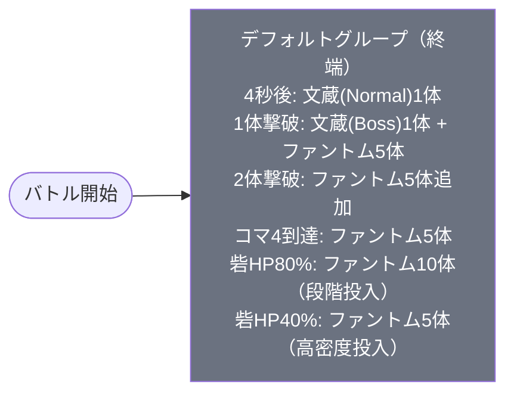

# veryhard_aka_00001 インゲームデータ詳細解説

> 参照リポジトリ: `projects/glow-masterdata`
> リリースキー: 202509010
> 本ファイルはMstAutoPlayerSequenceが11行のメインクエスト（veryhard難度）の全データ設定を解説する

---

## 概要

**メインクエスト・akaシリーズ ベリーハード難度**（砦破壊型・veryhard難度）。

- 砦のHP: `150,000` でダメージ有効
- BGM: `SSE_SBG_003_006`
- グループ: デフォルトのみ（グループ切り替えなし・終端グループ）
- 使用する敵の種類: 2種類（`c_aka_00101_general_vh_Normal_Red` / `c_aka_00101_general_vh_Boss_Red` 文蔵 / `e_glo_00001_general_vh_Normal_Red` ファントム）
- 特徴的なルール: **コマ侵入・砦HP・撃破数トリガー**が複合し、ファントムを大量投入する多段構成。また、**特別ルールあり**（説明文より）

---

## 関連テーブル設定

### MstInGame

| カラム | 値 |
|--------|-----|
| `id` | `veryhard_aka_00001` |
| `mst_auto_player_sequence_set_id` | `veryhard_aka_00001` |
| `bgm_asset_key` | `SSE_SBG_003_006` |
| `boss_bgm_asset_key` | （空） |
| `loop_background_asset_key` | （空） |
| `player_outpost_asset_key` | （空） |
| `mst_page_id` | `veryhard_aka_00001` |
| `mst_enemy_outpost_id` | `veryhard_aka_00001` |
| `mst_defense_target_id` | （空） |
| `boss_mst_enemy_stage_parameter_id` | `1` |
| `boss_count` | （空） |
| `normal_enemy_hp_coef` | `1.0` |
| `normal_enemy_attack_coef` | `1.0` |
| `normal_enemy_speed_coef` | `1` |
| `boss_enemy_hp_coef` | `1.0` |
| `boss_enemy_attack_coef` | `1.0` |
| `boss_enemy_speed_coef` | `1` |
| `release_key` | `202509010` |

### MstEnemyOutpost（敵砦）

| カラム | 値 | 意味 |
|--------|-----|------|
| `id` | `veryhard_aka_00001` | |
| `hp` | `150,000` | veryhardとして高めの砦HP |
| `is_damage_invalidation` | （空） | **ダメージ有効**（砦破壊型） |
| `artwork_asset_key` | `aka_0003` | 背景アートワーク |

### MstPage + MstKomaLine（コマフィールド）

2行構成。

```
row=1  height=0.55  layout=7.0  （3コマ: 0.33, 0.34, 0.33）
  koma1: aka_00001  width=0.33  effect=AttackPowerDown（プレイヤー側 / 全色・全役職）  param=70（-70%）
  koma2: aka_00001  width=0.34  effect=AttackPowerUp（プレイヤー側 / 全色・全役職）  param=10（+10%）
  koma3: aka_00001  width=0.33  effect=AttackPowerDown（プレイヤー側 / 全色・全役職）  param=70（-70%）

row=2  height=0.55  layout=1.0  （1コマ: 1.0）
  koma1: aka_00001  width=1.0  effect=None（全対象）
```

> **コマ効果の補足**: row=1 はkoma1とkoma3が攻撃力-70%の「攻撃DOWNコマ」で両側に配置され、中央のkoma2のみ+10%の「攻撃UPコマ」となっている。プレイヤーは中央コマを維持することで攻撃力を若干底上げできるが、左右のコマに入ると大幅に攻撃力が低下する非常にシビアなコマ配置。row=2 は単一コマで効果なし（後方の安全地帯）。

### MstInGameI18n（バトル説明文）

**result_tips（バトルヒント）:**
> （空）

**description（ステージ説明）:**
> 【属性情報】
> 赤属性の敵が登場するので青属性のキャラは有利に戦うこともできるぞ!
>
> 【コマ効果情報】
> 攻撃UPコマ、攻撃DOWNコマが登場するぞ!
>
> 【ギミック情報】
> ノックバック攻撃、火傷攻撃をしてくる敵が登場するぞ!
>
> 味方がコマに侵入すると、出現する敵もいるぞ!
>
> また、このステージでは特別ルールがあるぞ!

---

## 使用する敵パラメータ（MstEnemyStageParameter）一覧

3種類の敵パラメータを使用。`c_` プレフィックスはキャラ個別ID、`e_` は汎用敵。
IDの命名規則: `{c_/e_}{キャラID}_{コンテンツID}_{kind}_{color}`

### カラム解説

| カラム名（略称） | DBカラム名 | 説明 |
|---------------|-----------|------|
| id | id | MstEnemyStageParameterの主キー |
| 日本語名 | — | MstEnemyCharacterI18nから取得 |
| キャラID | mst_enemy_character_id | 紐付くキャラモデル・スキルの参照元 |
| kind | character_unit_kind | `Normal`（通常敵）/ `Boss`（ボス）。UIオーラ表示に影響 |
| role | role_type | 属性相性の役職（Attack/Technical/Defense/Support） |
| color | color | 属性色（Red/Yellow/Green/Blue/Colorless） |
| sort_order | sort_order | ゲーム内表示順 |
| base_hp | hp | ベースHP（`enemy_hp_coef` 乗算前の素値） |
| base_atk | attack_power | ベース攻撃力（`enemy_attack_coef` 乗算前の素値） |
| base_spd | move_speed | 移動速度（数値が大きいほど速い） |
| well_dist | well_distance | 攻撃射程（コマ単位） |
| combo | attack_combo_cycle | 攻撃コンボ数（1=単発） |
| knockback | damage_knock_back_count | 被攻撃時ノックバック回数（0=ノックバックなし） |
| ability | mst_unit_ability_id1 | 特殊アビリティID |
| drop_bp | drop_battle_point | 基本ドロップバトルポイント |

### 全3種類の詳細パラメータ

| MstEnemyStageParameter ID | 日本語名 | キャラID | kind | role | color | sort | base_hp | base_atk | base_spd | well_dist | combo | knockback | ability | drop_bp |
|--------------------------|---------|---------|------|------|-------|------|---------|---------|---------|-----------|-------|-----------|---------|---------|
| `c_aka_00101_general_vh_Normal_Red` | 文蔵（Normal） | `chara_aka_00101` | Normal | Attack | Red | 1 | 10,000 | 100 | 31 | 0.2 | 1 | 1 | （空） | 150 |
| `c_aka_00101_general_vh_Boss_Red` | 文蔵（Boss） | `chara_aka_00101` | Boss | Technical | Red | 5 | 10,000 | 100 | 31 | 0.2 | 4 | 1 | （空） | 200 |
| `e_glo_00001_general_vh_Normal_Red` | ファントム | `enemy_glo_00001` | Normal | Technical | Red | 12 | 1,000 | 50 | 40 | 0.2 | 1 | 1 | （空） | 100 |

> **実際のHP・ATKは `base × MstAutoPlayerSequence.enemy_hp_coef` で決まる。**
> 例: 文蔵（Normal） 最初の出現（elem 1）hp倍4 → 実HP `10,000 × 4 = 40,000`

### 敵パラメータの特性解説

| 比較項目 | 文蔵（Normal） | 文蔵（Boss） | ファントム |
|---------|-------------|------------|-----------|
| kind | Normal | Boss | Normal |
| role | Attack（攻撃型） | Technical（技巧型） | Technical（技巧型） |
| base_hp | 10,000 | 10,000 | 1,000（低い） |
| base_atk | 100 | 100 | 50（半分） |
| base_spd | 31（やや遅め） | 31（やや遅め） | 40（速い） |
| well_dist | 0.2 | 0.2 | 0.2 |
| combo | 1（単発） | **4（4連コンボ）** | 1（単発） |
| knockback | 1回 | 1回 | 1回 |
| ability | なし | なし | なし |
| drop_bp | 150 | 200 | 100 |
| 登場グループ | デフォルトのみ（elem 1） | デフォルトのみ（elem 2） | デフォルトのみ（elem 3〜11） |

**設計上の特徴**:
- 文蔵（Normal）はelem 1でのみ出現し、バトル開始4秒後（`ElapsedTime(400)` = 4,000ms）に1体配置。hp倍4で実HP 40,000と高く、最初の壁として機能する。
- 文蔵（Boss）は文蔵（Normal）の1体撃破（`FriendUnitDead(1)`）で登場する後継ボス。同じbase_hpだがatk_coefが20（Normal 14より大幅増）かつ4連コンボを持つ強力なボス。Bossオーラ（`aura_type=Default`）付き。hp倍50で実HP 500,000の超高HPが特徴。
- ファントムは elem 3〜11 の多段トリガーで大量投入される雑魚役。`move_speed=40`（最速クラス）で速く動き、hp倍36で実HP 36,000と大幅強化されており、veryhardとして硬い壁役を担う。各トリガーで5〜15体ずつ投入される。

---

## グループ構造の全体フロー（Mermaid）



> **Mermaid スタイルカラー規則**:
> - デフォルトグループ: `#6b7280`（グレー）
>
> **注意**: このステージはデフォルトグループのみで構成されており、グループ切り替え（SwitchSequenceGroup）は一切存在しない。全11行がデフォルトグループ内に集約された終端グループ設計。ループ構造なし。

---

## 全11行の詳細データ（グループ単位）

### デフォルトグループ（elem 1〜11、終端グループ）

バトル開始時から終了まで動作する唯一のグループ。文蔵（Normal）を先頭に置き、1体撃破で文蔵（Boss）とファントムの大量投入が始まる構成。コマ侵入・撃破数・砦HPの3種のトリガーが組み合わさり、プレイヤーの進行に応じて段階的に敵が増加する。

| id | elem | 条件 | action_type | action_value | 召喚数 | interval | aura | hp倍 | atk倍 | spd倍 | override_bp | defeated_score | action_delay |
|----|------|------|-------------|--------------|--------|----------|------|------|------|------|------------|----------------|--------------|
| veryhard_aka_00001_1 | 1 | ElapsedTime(400) | SummonEnemy | c_aka_00101_general_vh_Normal_Red | 1 | 0 | Boss | 4 | 14 | 1 | 200 | 0 | （空） |
| veryhard_aka_00001_2 | 2 | FriendUnitDead(1) | SummonEnemy | c_aka_00101_general_vh_Boss_Red | 1 | 0 | Default | 50 | 20 | 1 | 200 | 0 | 50 |
| veryhard_aka_00001_3 | 3 | EnterTargetKomaIndex(4) | SummonEnemy | e_glo_00001_general_vh_Normal_Red | 5 | 300 | Default | 36 | 12 | 1 | 20 | 0 | 0 |
| veryhard_aka_00001_4 | 4 | FriendUnitDead(1) | SummonEnemy | e_glo_00001_general_vh_Normal_Red | 5 | 50 | Default | 36 | 12 | 1 | 20 | 0 | 50 |
| veryhard_aka_00001_5 | 5 | FriendUnitDead(1) | SummonEnemy | e_glo_00001_general_vh_Normal_Red | 15 | 400 | Default | 36 | 12 | 1 | 20 | 0 | 500 |
| veryhard_aka_00001_6 | 6 | FriendUnitDead(1) | SummonEnemy | e_glo_00001_general_vh_Normal_Red | 15 | 450 | Default | 36 | 12 | 1 | 20 | 0 | 550 |
| veryhard_aka_00001_7 | 7 | FriendUnitDead(1) | SummonEnemy | e_glo_00001_general_vh_Normal_Red | 10 | 500 | Default | 36 | 12 | 1 | 20 | 0 | 3050 |
| veryhard_aka_00001_8 | 8 | FriendUnitDead(2) | SummonEnemy | e_glo_00001_general_vh_Normal_Red | 5 | 50 | Default | 36 | 12 | 1 | 20 | 0 | 50 |
| veryhard_aka_00001_9 | 9 | OutpostHpPercentage(80) | SummonEnemy | e_glo_00001_general_vh_Normal_Red | 5 | 50 | Default | 36 | 12 | 1 | 20 | 0 | 0 |
| veryhard_aka_00001_10 | 10 | OutpostHpPercentage(80) | SummonEnemy | e_glo_00001_general_vh_Normal_Red | 5 | 300 | Default | 36 | 12 | 1 | 20 | 0 | 50 |
| veryhard_aka_00001_11 | 11 | OutpostHpPercentage(40) | SummonEnemy | e_glo_00001_general_vh_Normal_Red | 5 | 50 | Default | 36 | 12 | 1 | 20 | 0 | 0 |

**ポイント:**
- **elem 1** は `ElapsedTime(400)` = 4,000ms = 4秒後に文蔵（Normal）を1体配置。`aura_type=Boss` でボスオーラ付き（kindはNormal）。hp倍4で実HP 40,000の中ボス的な先陣キャラ。action_delay なし。
- **elem 2** は `FriendUnitDead(1)` = 累計1体撃破で文蔵（Boss）が登場。hp倍50で実HP 500,000のメインボス。action_delay=50（500ms後）。atk_coef=20 かつ4連コンボで非常に高い攻撃力。
- **elem 3** は `EnterTargetKomaIndex(4)` = プレイヤーがコマ4番目に到達でファントム5体（interval=300=3秒おきに1体ずつ）を投入。コマ侵入トリガーが1つのみ存在。
- **elem 4〜7** はすべて `FriendUnitDead(1)` = 1体撃破時に同時発動する複数トリガー（elem 2と同じ条件）。action_delay によって発動タイミングをずらしている:
  - elem 4: delay=50（0.5秒後）ファントム5体（interval=50=0.5秒おきに1体ずつ）
  - elem 5: delay=500（5秒後）ファントム15体（interval=400=4秒おきに1体ずつ）
  - elem 6: delay=550（5.5秒後）ファントム15体（interval=450=4.5秒おきに1体ずつ）
  - elem 7: delay=3050（30.5秒後）ファントム10体（interval=500=5秒おきに1体ずつ）
- **elem 8** は `FriendUnitDead(2)` = 累計2体撃破でファントム5体追加（interval=50）。action_delay=50（0.5秒後）。
- **elem 9〜10** は `OutpostHpPercentage(80)` = 砦HP 80%以下でファントム5体を2ウェーブ投入（それぞれdelay 0 / delay 50で異なるinterval）。
- **elem 11** は `OutpostHpPercentage(40)` = 砦HP 40%以下でファントム5体（interval=50=高密度投入）。

---

## グループ切り替えまとめ表

このステージにはグループ切り替えが存在しない。全11行がデフォルトグループのみで構成される。

| 切り替え | 条件 | 遷移先 |
|---------|------|--------|
| （なし） | — | — |

**トリガー種別まとめ（グループ切り替えの代わりとなる複合トリガー）:**

| トリガー種別 | 条件値 | 発動内容 |
|-------------|--------|---------|
| ElapsedTime | 400（4秒後） | 文蔵（Normal）1体 登場 |
| FriendUnitDead | 1体撃破 | 文蔵（Boss）1体 + ファントム大量投入（elem 2・4・5・6・7） |
| FriendUnitDead | 2体撃破 | ファントム5体追加（elem 8） |
| EnterTargetKomaIndex | コマ4到達 | ファントム5体（elem 3） |
| OutpostHpPercentage | 砦HP80%以下 | ファントム10体（elem 9・10 合計） |
| OutpostHpPercentage | 砦HP40%以下 | ファントム5体（elem 11） |

> **補足**: デフォルトグループのみのため「グループ切り替え」は存在しないが、複数のトリガー種別が組み合わさることでevent型の多グループ構成と同等の段階的難度上昇を実現している。

---

## スコア体系

バトルポイントは `override_drop_battle_point`（MstAutoPlayerSequence設定値）が優先される。

| 敵の種類 | override_bp（設定値） | base drop_bp | 備考 |
|---------|---------------------|--------------|------|
| 文蔵（Normal） | `200` | 150 | override設定あり |
| 文蔵（Boss） | `200` | 200 | override設定あり |
| ファントム | `20` | 100 | override設定あり（base_bpより低い） |

- 全行の `defeated_score` は `0`（リザルト画面スコア表示なし）
- `override_drop_battle_point` が全行に設定されており、baseの `drop_battle_point` は使用されない
- 文蔵系は200bp（ボスクラスとして高め）、ファントムは20bpと大幅に低く抑えられている
- ファントムの大量投入（elem 5・6・7 それぞれ15体・15体・10体）を考慮し、1体あたりのbpを低く設定することでインフレを抑制している設計

---

## この設定から読み取れる設計パターン

### 1. 単グループで多トリガーを使い分ける高密度設計

通常のeventタイプ（w1〜w5などの多グループ構成）とは異なり、このステージはデフォルトグループのみの11行で完結している。ElapsedTime・FriendUnitDead・EnterTargetKomaIndex・OutpostHpPercentageという4種のトリガーを同一グループ内に混在させることで、グループ切り替えなしでも段階的な難度上昇を実現している。

### 2. action_delay によるウェーブの時間的分散

elem 4〜7 はすべて `FriendUnitDead(1)` という同一条件で発動するが、action_delay を50 / 500 / 550 / 3050（ms単位）と段階的にずらすことで、1体撃破という単一イベントから複数の独立したウェーブを時間軸上で分散配置している。特にelem 7のdelay=3050（30.5秒後）は長期間にわたる持続圧力を生み出す。

### 3. ボス登場前に文蔵（Normal）を置く二段階ボス演出

elem 1 で文蔵（Normal）を先出しし（aura_type=Boss でボスオーラ演出）、その撃破を条件に elem 2 で文蔵（Boss）本体が登場するという二段構成。kindがNormal → Boss と変わることで、演出上の「ウォームアップ → 本番」の流れを作っている。同一キャラクター（`chara_aka_00101`）を2種類のパラメータセットで使い分けるテクニック。

### 4. 砦HPを双方向トリガーとして活用する圧力設計

`OutpostHpPercentage(80)` と `OutpostHpPercentage(40)` の2段階を設定することで、プレイヤーが砦にダメージを与えるほど敵が増加するという逆説的な圧力構造を作っている。砦HP 150,000と高めに設定されており、削りの速さに応じて援軍の波が来る仕組み。砦破壊型コンテンツとしての緊張感を高める設計。

### 5. ファントムの大量投入による波状攻撃

elem 5・6・7 でそれぞれ15・15・10体のファントム（計40体）が大量投入される。各ファントムはhp倍36で実HP 36,000と硬く、`move_speed=40`（高速）で砦に迫る。これにより文蔵（Boss）の高攻撃力との「ボス + 雑魚大量」という二重の脅威が同時に展開される veryhardとしての高難度設計を実現している。

### 6. コマ配置が戦略的意思決定を要求する設計

MstPageの row=1 は3コマ構成で左右が攻撃-70%、中央のみ+10%というアシンメトリーな設計。プレイヤーは中央コマを維持するか、敵対応のため左右コマに入るかを常に選択しなければならない。砦HP150,000の高耐久と多量の雑魚を考えると、攻撃DOWN状態での戦闘は厳しく、コマ管理が勝敗を左右するveryhard特有の戦略要素となっている。
