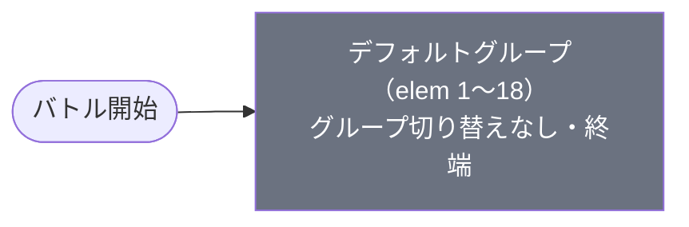

# veryhard_chi_00006 インゲームデータ詳細解説

> 参照リポジトリ: `projects/glow-masterdata`
> リリースキー: 202509010
> 本ファイルはMstAutoPlayerSequenceが18行のメインクエスト（veryhard難度）の全データ設定を解説する

---

## 概要

チェンソーマン（chi）シリーズのメインクエスト第6弾（veryhard難度）。砦HPは225,000でダメージ有効（砦破壊型）。BGMは`SSE_SBG_003_001`、ループ背景は未設定。3行構成のコマフィールドを使用し、行1は2コマ（幅0.6＋幅0.4）、行2は1コマ（幅1.0）、行3は2コマ（幅0.75＋幅0.25）。攻撃DOWNコマが行1のkoma2と行3のkoma1に配置されており、通過したプレイヤー側全キャラの攻撃力を30%ダウンさせる。

4種類の敵が登場する。主力はゾンビ（enemy_chi_00101）ベースの緑属性（HP16,000・攻撃650・速度45・アタック型・根性アビリティ持ち）と青属性（HP18,000・攻撃550・速度45・アタック型・根性アビリティ持ち）で、どちらも根性（enemy_ability_gust_1_zombie）を持ち復活力が高い。赤属性のゾンビの悪魔（HP250,000・攻撃700・速度35・テクニカル型・根性持ち）が中ボス的な強さで出現し、最終的にはボスのデンジ（HP500,000・攻撃500・速度45・青属性）が登場、HP30%到達時に悪魔が恐れる悪魔チェンソーマン（HP1,200,000・攻撃800・速度65）へと変身する。

グループ切り替えはなく、全18行がデフォルトグループに収まる単一グループ構成。5体・9体・10体という撃破数の節目でステージの様相が変化する。序盤は大量の緑ゾンビが押し寄せ、5体撃破で赤・青の多属性混成に移行し、10体目の撃破でデンジが出現。砦残HP30%以下になると緑ゾンビが追加増援として送り込まれる設計で、攻撃DOWNコマと根性アビリティが合わさった持久戦を強いる高難度ステージ。

バトルヒントは未設定。ステージ説明では赤・青・緑の3属性が登場し、攻撃DOWNコマ・根性・自己回復の存在と特別ルール適用が告知されている。再召喚時間の短いキャラの活用が推奨されており、ローテーション戦術が求められる。

---

## 関連テーブル設定

### MstInGame

| カラム | 値 |
|--------|-----|
| `id` | `veryhard_chi_00006` |
| `mst_auto_player_sequence_set_id` | `veryhard_chi_00006` |
| `bgm_asset_key` | `SSE_SBG_003_001` |
| `boss_bgm_asset_key` | （空） |
| `loop_background_asset_key` | （空） |
| `mst_page_id` | `veryhard_chi_00006` |
| `mst_enemy_outpost_id` | `veryhard_chi_00006` |
| `boss_mst_enemy_stage_parameter_id` | `1` |
| `normal_enemy_hp_coef` | `1.0` |
| `normal_enemy_attack_coef` | `1.0` |
| `normal_enemy_speed_coef` | `1` |
| `boss_enemy_hp_coef` | `1.0` |
| `boss_enemy_attack_coef` | `1.0` |
| `boss_enemy_speed_coef` | `1` |

### MstEnemyOutpost（敵砦）

| カラム | 値 | 意味 |
|--------|-----|------|
| `id` | `veryhard_chi_00006` | |
| `hp` | `225,000` | 超難関ブロックの高耐久砦HP |
| `is_damage_invalidation` | （空） | **ダメージ有効**（砦破壊型） |
| `artwork_asset_key` | `chi_0003` | 背景アートワーク（通常と異なる） |

### MstPage + MstKomaLine（コマフィールド）

3行構成。攻撃DOWNコマが2箇所に設定されている。

```
row=1  height=0.55  layout=2.0  (2コマ: 0.6, 0.4)
  koma1: glo_00016  width=0.6  bg_offset=0.6  effect=None
  koma2: glo_00016  width=0.4  bg_offset=0.6  effect=AttackPowerDown(30%, Player/All/All)

row=2  height=0.55  layout=1.0  (1コマ: 1.0)
  koma1: glo_00016  width=1.0  bg_offset=-1.0  effect=None

row=3  height=0.55  layout=4.0  (2コマ: 0.75, 0.25)
  koma1: glo_00016  width=0.75  bg_offset=0.6  effect=AttackPowerDown(30%, Player/All/All)
  koma2: glo_00016  width=0.25  bg_offset=0.6  effect=None
```

> **コマ効果の補足**: `AttackPowerDown`（koma1_effect_parameter1=30）がrow1-koma2・row3-koma1に配置。対象はPlayer側の全属性・全役職キャラ。これらのコマを通過した敵または踏んだプレイヤーキャラの攻撃力が30%ダウンする。

### MstInGameI18n（バトル説明文）

**result_tips（バトルヒント）:**
> （未設定）

**description（ステージ説明）:**
> 【属性情報】\n赤属性の敵が登場するので青属性のキャラは有利に戦うこともできるぞ!\n青属性の敵が登場するので黄属性のキャラは有利に戦うこともできるぞ!\n緑属性の敵が登場するので赤属性のキャラは有利に戦うこともできるぞ!\n\n【コマ効果情報】\n攻撃DOWNコマが登場するぞ!\n\n【ギミック情報】\n毒攻撃をしてくる敵や\n自身の体力を回復する攻撃をしてくる敵や\n根性の特性を持つ敵が登場するぞ!\n\n再召喚時間の短いキャラが活躍するぞ!\n\nまた、このステージでは特別ルールがあるぞ!

---

## 使用する敵パラメータ（MstEnemyStageParameter）一覧

4種類の敵パラメータを使用（変身後チェンソーマンを含めると5種類）。`c_` プレフィックスはキャラ個別ID、`e_` は汎用敵。
IDの命名規則: `{c_/e_}_{キャラID}_general_chi_vh_{kind}_{color}`（veryhardシリーズ専用）

### カラム解説

| カラム名（略称） | DBカラム名 | 説明 |
|---------------|-----------|------|
| id | id | MstEnemyStageParameterの主キー |
| キャラID | mst_enemy_character_id | 紐付くキャラモデル・スキルの参照元 |
| kind | character_unit_kind | `Normal`（通常敵）/ `Boss`（ボス）。UIオーラ表示に影響 |
| role | role_type | 属性相性の役職（Attack/Technical/Defense/Support） |
| color | color | 属性色（Red/Yellow/Green/Blue/Colorless） |
| sort_order | sort_order | ゲーム内表示順 |
| base_hp | hp | ベースHP（`enemy_hp_coef` 乗算前の素値） |
| base_atk | attack_power | ベース攻撃力（`enemy_attack_coef` 乗算前の素値） |
| base_spd | move_speed | 移動速度（数値が大きいほど速い） |
| well_dist | well_distance | 攻撃射程（コマ単位） |
| combo | attack_combo_cycle | 攻撃コンボ数（1=単発） |
| knockback | damage_knock_back_count | 被攻撃時ノックバック回数（0=ノックバックなし） |
| ability | mst_unit_ability_id1 | 特殊アビリティID |
| drop_bp | drop_battle_point | 基本ドロップバトルポイント |

### 全5種類（変身後含む）の詳細パラメータ

| MstEnemyStageParameter ID | 日本語名 | キャラID | kind | role | color | sort | base_hp | base_atk | base_spd | well_dist | combo | knockback | ability | drop_bp |
|--------------------------|---------|---------|------|------|-------|------|---------|----------|---------|-----------|-------|-----------|---------|---------|
| e_chi_00101_general_chi_vh_Normal_Green | ゾンビ | enemy_chi_00101 | Normal | Attack | Green | 821 | 16,000 | 650 | 45 | 0.11 | 1 | 1 | enemy_ability_gust_1_zombie | 0 |
| e_chi_00101_general_chi_vh_Normal_Blue | ゾンビ | enemy_chi_00101 | Normal | Attack | Blue | 822 | 18,000 | 550 | 45 | 0.11 | 1 | 1 | enemy_ability_gust_1_zombie | 0 |
| e_chi_00001_general_chi_vh_Normal_Red | ゾンビの悪魔 | enemy_chi_00001 | Normal | Technical | Red | 817 | 250,000 | 700 | 35 | 0.40 | 1 | 1 | enemy_ability_gust_1_zombie | 0 |
| c_chi_00001_general_chi_vh_Boss_Blue | デンジ | chara_chi_00001 | Boss | Attack | Blue | 836 | 500,000 | 500 | 45 | 0.11 | 3 | 2 | （なし） | 0 |
| c_chi_00002_general_chi_vh_Boss_Blue（変身後） | 悪魔が恐れる悪魔 チェンソーマン | chara_chi_00002 | Boss | Technical | Blue | 834 | 1,200,000 | 800 | 65 | 0.11 | 7 | 2 | （なし） | 0 |

> **実際のHP・ATKは `base × MstAutoPlayerSequence.enemy_hp_coef` で決まる。** 本ステージはすべて 1.0 倍。
> **デンジの変身**: `transformationConditionType=HpPercentage`、`transformationConditionValue=30` ―― HP30%以下になると`c_chi_00002_general_chi_vh_Boss_Blue`（チェンソーマン）へ変身する。

### 敵パラメータの特性解説

- **緑ゾンビ（Green/Normal）**: 序盤の主力量産型。HPはやや強め（16,000）・かなり高火力（攻撃650）・高速（45）・根性アビリティ持ちで何度でも立ち上がる。drop_bp=0のため撃破スコアなし。
- **青ゾンビ（Blue/Normal）**: 中盤以降の主力。HPはやや強め（18,000）・高火力（550）・高速（45）・根性アビリティ持ち。緑より攻撃は控えめだが耐久はわずかに高い。
- **ゾンビの悪魔（Red/Normal）**: 中ボス的存在。HPが非常に高耐久（250,000）・高火力（700）・中速（35）・射程0.4（広め）・根性アビリティ持ち。テクニカル型なのでDefenseロールに有利。
- **デンジ（Blue/Boss）**: 最終ボス第1形態。HP突出した耐久力（500,000）・攻撃控えめ（500）・高速（45）・コンボ3回。HP30%で変身トリガー。
- **チェンソーマン（Blue/Boss/変身後）**: 最終ボス第2形態。HPが桁外れの耐久力（1,200,000）・かなり高火力（800）・非常に高速（65）・コンボ7回。変身後は大幅な強化が入る。

---

## グループ構造の全体フロー（Mermaid）



> グループ切り替えは存在しない。全18行がデフォルトグループで完結する。

---

## 全18行の詳細データ（デフォルトグループ）

### デフォルトグループ（elem 1〜18）

序盤の時間経過・撃破数条件・砦HP条件を組み合わせた段階的難度設計。5体・9体・10体の撃破数が主な節目となり、最終的にはボスのデンジ→チェンソーマンへの変身が待つ。

| id | elem | 条件 | アクション | 召喚数 | interval | delay | hp倍 | atk倍 | override_bp | 説明 |
|----|------|------|-----------|--------|---------|-------|------|------|------------|------|
| veryhard_chi_00006_1 | 1 | ElapsedTime 1 | SummonEnemy: e_chi_00101_general_chi_vh_Normal_Green | 7 | 350ms | — | 1.0 | 1.0 | — | 開始直後（1ms）、緑ゾンビ7体を0.35秒間隔で一斉召喚 |
| veryhard_chi_00006_2 | 2 | ElapsedTime 400 | SummonEnemy: e_chi_00101_general_chi_vh_Normal_Green | 3 | 700ms | — | 1.0 | 1.0 | — | 400ms経過、緑ゾンビ追加3体 |
| veryhard_chi_00006_3 | 3 | ElapsedTime 1800 | SummonEnemy: e_chi_00101_general_chi_vh_Normal_Blue | 1 | — | — | 1.0 | 1.0 | — | 1800ms経過、青ゾンビ初登場1体 |
| veryhard_chi_00006_4 | 4 | FriendUnitDead 3 | SummonEnemy: e_chi_00101_general_chi_vh_Normal_Green | 3 | 350ms | — | 1.0 | 1.0 | — | 3体撃破、緑ゾンビ3体追加 |
| veryhard_chi_00006_5 | 5 | FriendUnitDead 3 | SummonEnemy: e_chi_00001_general_chi_vh_Normal_Red | 1 | — | **500ms** | 1.0 | 1.0 | — | 3体撃破（同条件）、500ms遅延後にゾンビの悪魔1体 |
| veryhard_chi_00006_6 | 6 | FriendUnitDead 3 | SummonEnemy: e_chi_00101_general_chi_vh_Normal_Green | 99 | 700ms | — | 1.0 | 1.0 | — | 3体撃破（同条件）、緑ゾンビ99体を0.7秒間隔で無限継続出現 |
| veryhard_chi_00006_7 | 7 | FriendUnitDead 5 | SummonEnemy: e_chi_00101_general_chi_vh_Normal_Blue | 1 | — | — | 1.0 | 1.0 | — | 5体撃破、青ゾンビ1体追加 |
| veryhard_chi_00006_8 | 8 | FriendUnitDead 5 | SummonEnemy: e_chi_00101_general_chi_vh_Normal_Green | 3 | 200ms | **75ms** | 1.0 | 1.0 | — | 5体撃破（同条件）、75ms遅延後に緑ゾンビ3体（0.2秒間隔） |
| veryhard_chi_00006_9 | 9 | FriendUnitDead 5 | SummonEnemy: e_chi_00101_general_chi_vh_Normal_Blue | 1 | — | — | 1.0 | 1.0 | — | 5体撃破（同条件）、青ゾンビ1体追加 |
| veryhard_chi_00006_10 | 10 | FriendUnitDead 9 | SummonEnemy: e_chi_00001_general_chi_vh_Normal_Red | 1 | — | — | 1.0 | 1.0 | — | 9体撃破、ゾンビの悪魔が再登場 |
| veryhard_chi_00006_11 | 11 | FriendUnitDead 9 | SummonEnemy: e_chi_00101_general_chi_vh_Normal_Blue | 3 | 500ms | — | 1.0 | 1.0 | — | 9体撃破（同条件）、青ゾンビ3体追加 |
| veryhard_chi_00006_12 | 12 | FriendUnitDead 9 | SummonEnemy: e_chi_00101_general_chi_vh_Normal_Blue | 1 | — | **1700ms** | 1.0 | 1.0 | — | 9体撃破（同条件）、1700ms遅延後に青ゾンビ1体 |
| veryhard_chi_00006_13 | 13 | FriendUnitDead 10 | SummonEnemy: c_chi_00001_general_chi_vh_Boss_Blue | 1 | — | — | 1.0 | 1.0 | — | 10体撃破、**ボスのデンジが降臨**（HP30%で変身） |
| veryhard_chi_00006_14 | 14 | FriendUnitDead 12 | SummonEnemy: e_chi_00101_general_chi_vh_Normal_Green | 3 | 400ms | **600ms** | 1.0 | 1.0 | — | 12体撃破、600ms遅延後に緑ゾンビ3体 |
| veryhard_chi_00006_15 | 15 | FriendUnitDead 13 | SummonEnemy: e_chi_00101_general_chi_vh_Normal_Green | 3 | 350ms | — | 1.0 | 1.0 | — | 13体撃破、緑ゾンビ3体 |
| veryhard_chi_00006_16 | 16 | FriendUnitDead 13 | SummonEnemy: e_chi_00101_general_chi_vh_Normal_Blue | 2 | 500ms | — | 1.0 | 1.0 | — | 13体撃破（同条件）、青ゾンビ2体 |
| veryhard_chi_00006_17 | 17 | OutpostDamage 1 | SummonEnemy: e_chi_00101_general_chi_vh_Normal_Blue | 2 | 100ms | — | 1.0 | 1.0 | — | 砦ダメージ発生、青ゾンビ2体を0.1秒間隔で急追援軍 |
| veryhard_chi_00006_18 | 18 | OutpostHpPercentage 30 | SummonEnemy: e_chi_00101_general_chi_vh_Normal_Green | 1 | — | — | 1.0 | 1.0 | — | 砦HP30%以下、緑ゾンビ追加1体 |

**ポイント:**
- elem 1: `ElapsedTime 1`（実質バトル開始直後）に緑ゾンビ7体を0.35秒間隔で大量召喚するインパクトある序盤演出
- elem 5〜6: `FriendUnitDead 3` で3行が同時トリガー。ゾンビの悪魔が500ms遅延で登場し、緑ゾンビ99体が継続出現する（elem6は実質無限）
- elem 13: `FriendUnitDead 10` でデンジが降臨。HP30%到達でチェンソーマン（HP1,200,000・速度65）に変身するため、それまでに準備が必要
- elem 17〜18: 砦ダメージ・HP30%の2条件がそれぞれ援軍をトリガー。砦への圧力が高まる後半の追い打ち設計

---

## グループ切り替えまとめ表

グループ切り替えは存在しない（単一デフォルトグループのみ）。

| 項目 | 内容 |
|------|------|
| グループ数 | 1（デフォルトのみ） |
| SwitchSequenceGroup | なし |
| 主な節目 | 3体撃破（ゾンビの悪魔初登場＋無限緑ゾンビ開始）/ 5体撃破（青混成）/ 9体撃破（ゾンビの悪魔再登場）/ 10体撃破（デンジ降臨）/ 砦ダメージ / 砦HP30% |

---

## スコア体系

バトルポイントは`override_drop_battle_point`（MstAutoPlayerSequence設定値）が優先される。本ステージは全行に`override_drop_battle_point`が設定されていないため、MstEnemyStageParameterの`drop_battle_point`が使用される。

| 敵の種類 | override_bp（MstAutoPlayerSequence） | drop_bp（MstEnemyStageParameter） | 備考 |
|---------|--------------------------------------|----------------------------------|------|
| 緑ゾンビ | — | 0 | override未設定。drop_bp=0のためスコアなし |
| 青ゾンビ | — | 0 | override未設定。drop_bp=0のためスコアなし |
| ゾンビの悪魔（Red） | — | 0 | override未設定。drop_bp=0のためスコアなし |
| デンジ（Blue/Boss） | — | 0 | override未設定。drop_bp=0のためスコアなし |
| チェンソーマン（Blue/Boss/変身後） | — | 0 | override未設定。drop_bp=0のためスコアなし |

> **全敵のdrop_bp=0。** 本ステージでは敵撃破によるバトルポイント獲得は設計されていない。超難関ステージとしてのクリア達成自体が目的であることが読み取れる。

---

## この設定から読み取れる設計パターン

### 1. 序盤の大量召喚による「圧迫感」演出
`ElapsedTime 1`（開始直後）に緑ゾンビ7体を連続召喚し、400ms後にさらに3体追加と、序盤から高密度の敵群で画面を埋める設計。根性アビリティ持ちの敵が倒れてもすぐに復活するため、序盤から高い持続戦闘力が求められる。

### 2. 同一条件の複数行で「節目爆発」を演出
`FriendUnitDead 3`で3行（elem4・5・6）が同時発火し、ゾンビの悪魔登場＋緑ゾンビ無限湧きが一気に始まる。同様に`FriendUnitDead 5`で3行（elem7・8・9）が青ゾンビ混入を演出。撃破の節目ごとに戦場が様変わりする体験を5行構造で実現している。

### 3. デンジ→チェンソーマンへの「変身ギミック」による後半急激化
`FriendUnitDead 10`でデンジが降臨し、HP30%到達で変身。変身前後でHP3.4倍（50万→120万）・速度1.4倍（45→65）・コンボ7回と劇的強化が入る。変身前に一気に削り切れるかが攻略の分岐点となる高度な設計。

### 4. 根性アビリティ（enemy_ability_gust_1_zombie）による持久戦強制
緑・青ゾンビとゾンビの悪魔の3種全てが根性アビリティを持ち、通常の撃破後に復活する。ステージ説明でも「再召喚時間の短いキャラが活躍」と案内されており、継続的なダメージ供給とローテーション戦術を要求する設計意図が明確。

### 5. 攻撃DOWNコマによるDPS低下の圧迫
2箇所のAttackPowerDownコマ（行1-koma2・行3-koma1）がプレイヤー全キャラの攻撃を30%削減する。根性持ち敵の高HPと組み合わさり、長期戦を余儀なくされる高難度設計の根幹を成している。

### 6. スコアなし設計による「クリア重視」型
全敵のdrop_bp=0・override_bp未設定という、撃破スコアを一切与えない設計。超難関ステージとして「点数を稼ぐ」ではなく「クリアすること」を目標に据えた設計哲学が読み取れる。
